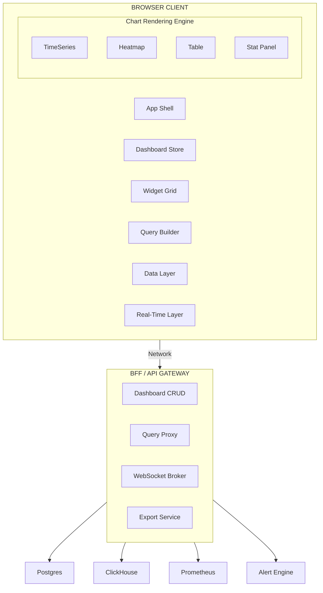

## Problem Statement

Design a frontend system for a real-time analytics dashboard platform — the kind built by Grafana, Datadog, New Relic, Kibana, and Amplitude. The core architectural challenge is rendering 50+ heterogeneous widgets on a single dashboard, each independently fetching and streaming time-series data at different cadences, while maintaining sub-second interaction latency for pan/zoom/resize operations across hundreds of thousands of data points.

This is not a generic CRUD app with charts. The system must handle: a composable grid layout with drag-resize semantics, a query builder that translates structured user input into a backend DSL, real-time data streaming with intelligent downsampling, and a templating engine that parameterizes entire dashboards via variable substitution. The frontend owns the rendering pipeline for time-series data — the decision between Canvas and SVG at 100K+ points is an architecture-level choice that cascades into accessibility, export, and memory management.

**Scope boundary:** We design the browser client and its BFF (Backend-for-Frontend) layer. The metrics storage engine (e.g., InfluxDB, ClickHouse, Prometheus) and alerting evaluation engine are out of scope — we consume their APIs.

**Real-world references:** Grafana (open-source, plugin-based panels), Datadog (unified APM + logs + metrics), New Relic (full-stack observability), Kibana (ELK-based analytics), Amplitude/Mixpanel (product analytics with cohort builders).

---

## Requirements Exploration

### Functional Requirements

1. Users can create dashboards with a configurable grid of widgets (charts, tables, stat panels, logs, heatmaps).
2. Widgets are positioned via drag-and-drop and resized via edge handles on a 24-column responsive grid.
3. Each widget executes an independent data query with a structured query builder UI (auto-suggest, syntax validation).
4. Dashboards support a global time range picker with relative ranges (e.g., "last 1h"), absolute ranges, timezone selection, and configurable auto-refresh intervals (5s, 10s, 30s, 1m, 5m).
5. Real-time streaming mode pushes new data points to active widgets via WebSocket or SSE without full refetch.
6. Dashboard templating: variables (e.g., `$region`, `$service`) drive dynamic filters across all widgets via parameterized queries.
7. A query builder UI provides structured query construction with metric selection, aggregation functions, group-by dimensions, and filter predicates — with auto-complete and syntax validation.
8. Alert rules are configurable per widget with threshold visualization overlaid on charts and notification channel assignment.
9. Dashboards are exportable as PDF/PNG snapshots, shareable via public links (read-only), and embeddable via iframe codes.
10. Data downsampling renders appropriate detail for viewport width — zooming in progressively fetches higher-resolution data.

### Non-Functional Requirements

| Category      | Requirement                          | Target                                       |
| ------------- | ------------------------------------ | -------------------------------------------- |
| Performance   | Time to Interactive (dashboard load) | < 3s on 4G mid-range device                  |
| Performance   | Chart interaction latency (pan/zoom) | < 16ms (60fps)                               |
| Performance   | Widget render with 100K data points  | < 200ms                                      |
| Bundle        | Initial JS (dashboard shell)         | < 180KB gzip                                 |
| Bundle        | Chart renderer (lazy)                | < 90KB gzip                                  |
| Memory        | 50-widget dashboard ceiling          | < 512MB heap                                 |
| Real-time     | Data point delivery latency          | < 500ms end-to-end                           |
| Reliability   | Widget isolation                     | One failing widget must not crash others     |
| Accessibility | WCAG 2.1 AA                          | Full keyboard nav, screen reader data tables |
| Concurrent    | Max widgets per dashboard            | 50 active, 200 defined                       |

---

## Capacity Estimation & Constraints

**Traffic Model:**

- 50K DAU, each viewing ~8 dashboards/session, 3 min avg per dashboard
- Peak concurrent users: 12K
- Each dashboard: avg 15 widgets, each widget issues 1 query on load + 1 query per auto-refresh
- Auto-refresh at 30s default: 15 widgets × 2 queries/min = 30 queries/min/user
- Peak: 12K × 30 = 360K queries/min to backend

**Data Volume per Widget:**

- Time-series query response: avg 2,000 data points × 16 bytes (timestamp + value) = 32KB
- High-density widget (heatmap, histogram): up to 100K points = 1.6MB
- 15-widget dashboard payload: ~500KB–5MB depending on widget density

**Client Memory Budget:**

- 50 widgets × avg 5K points × 16 bytes raw = 4MB data
- Rendered chart buffers (Canvas): 50 × 400KB = 20MB
- DOM nodes (grid + widget chrome + controls): ~15K nodes max
- Total budget ceiling: 512MB — exceeding this triggers viewport-based activation (render only visible widgets)

**Bandwidth:**

- WebSocket stream: 50 widgets × 1 point/sec × 16 bytes = 800 bytes/sec (negligible)
- Burst on time range change: 50 widgets × 32KB = 1.6MB (cache miss scenario)

<Callout>
  The 512MB memory ceiling is the architectural forcing function. It mandates
  viewport-based lazy rendering: only widgets intersecting the viewport (plus
  one screen of overscan) hold active Canvas contexts and data buffers.
  Off-screen widgets release their GPU-backed Canvas to a pool.
</Callout>

---

## Architecture / High-Level Design

### Rendering Strategy

**Client-Side Rendering (CSR) with shell preload.** Dashboards are user-specific, highly interactive, and data-driven — SSR provides minimal benefit. The app shell (sidebar, header, time picker) is statically served from CDN. Widget rendering is entirely client-driven:

1. **Tier 1 (0–500ms):** Static app shell + CSS from CDN. Dashboard skeleton (grid layout with shimmer placeholders).
2. **Tier 2 (500ms–2s):** Dashboard definition JSON fetched → grid layout computed → widget chrome rendered. Query builder and chart renderers loaded via dynamic import.
3. **Tier 3 (2s+):** Individual widget data queries execute in parallel (max 6 concurrent). Charts render progressively as data arrives.

Justification: SSR is impractical — each widget query depends on user-specific time range, variables, and data source credentials. The 50ms server render gain is dwarfed by the 500ms–2s data fetch latency.

### Navigation Model

SPA with URL-driven state. Dashboard ID, time range, variables, and selected widget are encoded in the URL for shareability:

```
/d/{dashboard-id}?from=now-1h&to=now&var-region=us-east&var-service=api&refresh=30s
```

Route structure:

- `/d/:id` — Dashboard view
- `/d/:id/edit` — Dashboard edit mode (drag-resize enabled)
- `/d/:id/widget/:widgetId/edit` — Widget configuration panel
- `/explore` — Ad-hoc query explorer
- `/alerting` — Alert rule management

Navigation between dashboards is client-side (no full reload). Time range and variable changes update URL params without route transition (shallow routing).

### System Architecture Diagram



### Component Architecture

```
<App>
├── <AppShell>                          [Server Component - static]
│   ├── <Sidebar />                     [Client - navigation + recent dashboards]
│   └── <Header />                      [Client - org switcher, user menu]
├── <DashboardPage>                     [Client - route-level boundary]
│   ├── <DashboardToolbar>              [Client]
│   │   ├── <TimeRangePicker />         [Client - Popover + calendar]
│   │   ├── <VariableBar />             [Client - template variable dropdowns]
│   │   ├── <RefreshControl />          [Client - interval selector + pause]
│   │   └── <DashboardActions />        [Client - save, share, export]
│   ├── <WidgetGrid>                    [Client - CSS Grid + DnD]
│   │   └── <WidgetContainer key={id}>  [Client - error boundary per widget]
│   │       ├── <WidgetHeader />        [Client - title, menu, edit link]
│   │       └── <WidgetRenderer />      [Client - dynamic: Chart|Table|Stat|Heatmap]
│   └── <WidgetConfigDrawer />          [Client - lazy loaded on edit]
└── <QueryBuilder />                    [Client - lazy loaded, heavy]
```

### State Management Strategy

| State Type                                    | Location                    | Rationale                                         |
| --------------------------------------------- | --------------------------- | ------------------------------------------------- |
| Dashboard definition (layout, widget configs) | Zustand store + server sync | Collaborative editing potential, undo/redo        |
| Time range, variables, refresh interval       | URL search params           | Shareable, bookmarkable                           |
| Widget query results (time-series data)       | TanStack Query cache        | Automatic stale detection, deduplication, GC      |
| Real-time stream buffers                      | Zustand per-widget slice    | High-frequency updates, no serialization overhead |
| UI state (selected widget, panel open)        | Zustand transient slice     | No persistence needed                             |
| Grid layout (drag state)                      | Local component state       | Ephemeral, high-frequency updates during drag     |

---

## Data Model / Entities

```typescript
// === Dashboard Definition ===
interface Dashboard {
  id: string; // UUID
  orgId: string; // Multi-tenant isolation
  title: string;
  description: string;
  slug: string; // URL-friendly identifier
  tags: string[];
  variables: TemplateVariable[]; // Dashboard-level variables
  panels: PanelDefinition[]; // Ordered list of widgets
  timeSettings: TimeSettings; // Default time range
  version: number; // Optimistic locking
  createdBy: string; // User ID
  updatedAt: string; // ISO 8601
  permissions: DashboardPermissions;
}

interface TemplateVariable {
  name: string; // e.g., "region"
  type: "query" | "custom" | "interval" | "textbox";
  query?: string; // For type='query': fetch options from data source
  options: string[]; // Resolved values
  current: string; // Selected value
  multi: boolean; // Allow multi-select
  includeAll: boolean; // Add "All" option
  refresh: "never" | "on-load" | "on-time-change";
}

interface TimeSettings {
  from: string; // "now-1h" | ISO 8601
  to: string; // "now" | ISO 8601
  timezone: string; // IANA timezone (e.g., "America/New_York")
  refreshInterval: number | null; // Milliseconds, null = paused
}

// === Panel / Widget Definition ===
interface PanelDefinition {
  id: string; // Unique within dashboard
  type: PanelType;
  title: string;
  description?: string;
  gridPosition: GridPosition;
  datasource: DatasourceRef;
  queries: PanelQuery[]; // One or more queries per panel
  fieldConfig: FieldConfig; // Visualization overrides (colors, units, thresholds)
  options: PanelOptions; // Type-specific rendering options
  alert?: AlertRule; // Optional alert attached to panel
  transparent: boolean;
}

type PanelType =
  | "timeseries"
  | "stat"
  | "gauge"
  | "table"
  | "heatmap"
  | "barchart"
  | "logs"
  | "text"
  | "alertlist"
  | "histogram";

interface GridPosition {
  x: number; // Column start (0-23)
  y: number; // Row start (auto-packed)
  w: number; // Width in columns (1-24)
  h: number; // Height in grid units (1 unit = 30px)
  minW?: number; // Minimum width
  minH?: number; // Minimum height
}

interface PanelQuery {
  refId: string; // "A", "B", "C" — identifies query within panel
  datasource: DatasourceRef;
  expression: string; // Raw query string or structured expression
  legendFormat?: string; // Template for series legend
  interval?: string; // Override auto-calculated step
  hide: boolean; // Computed but not rendered
}

interface DatasourceRef {
  uid: string;
  type: "prometheus" | "clickhouse" | "elasticsearch" | "postgres" | "custom";
}

// === Query Builder AST ===
interface QueryAST {
  metric: string; // e.g., "http_requests_total"
  aggregation: AggregationFn; // e.g., { fn: 'rate', interval: '5m' }
  filters: QueryFilter[]; // WHERE clauses
  groupBy: string[]; // Label dimensions
  orderBy?: { field: string; direction: "asc" | "desc" };
  limit?: number;
}

interface AggregationFn {
  fn: "sum" | "avg" | "max" | "min" | "count" | "rate" | "p50" | "p95" | "p99";
  interval?: string; // For rate: "5m", "1h"
  by?: string[]; // Aggregation dimensions
}

interface QueryFilter {
  key: string; // Label name
  operator: "=" | "!=" | "=~" | "!~"; // Exact, not-equal, regex, not-regex
  value: string;
}

// === Time-Series Data (Wire Format) ===
interface TimeSeriesResponse {
  series: TimeSeries[];
  meta: QueryMeta;
}

interface TimeSeries {
  name: string; // Series label (e.g., "us-east/api")
  labels: Record<string, string>;
  datapoints: [number, number][]; // [value, timestamp_ms][] — column-oriented for perf
}

interface QueryMeta {
  executionTimeMs: number;
  totalPoints: number;
  downsampledFrom?: number; // Original count before downsampling
  resolution: number; // Step in seconds between points
}

// === Alert Rule ===
interface AlertRule {
  id: string;
  condition: AlertCondition;
  duration: string; // "5m" — condition must hold this long
  severity: "warning" | "critical";
  notifications: NotificationChannel[];
  annotations: Record<string, string>;
}

interface AlertCondition {
  type: "threshold" | "anomaly" | "absence";
  threshold?: { value: number; operator: "gt" | "lt" | "gte" | "lte" };
  reducer: "avg" | "max" | "min" | "last" | "sum";
  queryRef: string; // Which query (refId) to evaluate
}

// === UI State ===
interface DashboardUIState {
  isEditing: boolean;
  selectedPanelId: string | null;
  dragState: DragState | null;
  fullscreenPanelId: string | null;
  inspectorOpen: boolean;
}

interface DragState {
  panelId: string;
  type: "move" | "resize";
  startPosition: { x: number; y: number };
  currentPosition: { x: number; y: number };
  placeholder: GridPosition; // Ghost position for drop preview
}
```

---

## Interface Definition (API)

### Dashboard CRUD

```typescript
// GET /api/dashboards/:id
// Response: Dashboard
// Cache-Control: private, no-cache (user-specific, mutable)

// PUT /api/dashboards/:id
// Request: { dashboard: Dashboard, message: string }
// Response: { version: number; updatedAt: string }
// Idempotency: version field acts as ETag — 409 on conflict

// POST /api/dashboards/:id/save-as
// Request: { title: string; folderId?: string }
// Response: { id: string; slug: string }
```

### Query Execution

```typescript
// POST /api/query
// Request:
interface QueryRequest {
  queries: Array<{
    refId: string;
    datasource: DatasourceRef;
    expression: string;
    intervalMs: number; // Calculated from viewport width
    maxDataPoints: number; // Viewport px width → max points
    timeRange: { from: number; to: number }; // Unix ms
  }>;
  variables: Record<string, string>; // Template variable interpolation
}

// Response:
interface QueryResponse {
  results: Record<
    string,
    {
      // Keyed by refId
      series: TimeSeries[];
      meta: QueryMeta;
      error?: string; // Per-query error isolation
    }
  >;
}

// Cache-Control: private, max-age=0
// Reason: Data is time-dependent, caching handled client-side by TanStack Query
```

### WebSocket Streaming

```typescript
// WS /api/live/dashboard/:dashboardId
// Client → Server:
interface SubscribeMessage {
  action: "subscribe" | "unsubscribe";
  panelId: string;
  query: { datasource: DatasourceRef; expression: string };
  intervalMs: number; // Desired push frequency
}

// Server → Client:
interface StreamFrame {
  panelId: string;
  refId: string;
  datapoints: [number, number][]; // Incremental — append to existing series
  timestamp: number; // Server timestamp for ordering
}
```

### Query Builder Auto-Suggest

```typescript
// GET /api/suggest/metrics?prefix=http_&datasource=prometheus&limit=20
// Response: { metrics: string[] }

// GET /api/suggest/labels?metric=http_requests_total&datasource=prometheus
// Response: { labels: string[] }

// GET /api/suggest/label-values?metric=http_requests_total&label=region
// Response: { values: string[] }
```

### Export

```typescript
// POST /api/dashboards/:id/export
// Request: { format: 'pdf' | 'png'; timeRange: TimeSettings; width: number; height: number }
// Response: { jobId: string } — async, poll for result

// GET /api/dashboards/:id/export/:jobId
// Response: { status: 'pending' | 'complete' | 'failed'; url?: string }
```

---

## Caching Strategy

### Client-Side Caching

**TanStack Query as the primary data cache:**

| Query Type                     | Stale Time                    | GC Time | Refetch Strategy        |
| ------------------------------ | ----------------------------- | ------- | ----------------------- |
| Dashboard definition           | 30s                           | 5min    | Refetch on window focus |
| Query results (historical)     | ∞ (immutable for fixed range) | 10min   | Never auto-refetch      |
| Query results (relative range) | 0 (always stale)              | 2min    | Refetch on interval     |
| Auto-suggest (metrics/labels)  | 5min                          | 30min   | Background refetch      |
| Variable options               | 1min                          | 5min    | Refetch on time change  |

**Canvas bitmap cache:** Rendered chart images are retained as `ImageBitmap` for widgets scrolled out of viewport. When scrolling back, the cached bitmap displays instantly while fresh data fetches in background. Eviction: LRU with 20-bitmap cap (~8MB).

**IndexedDB for dashboard definitions:** Offline-capable shell loads the last-known dashboard definition from IndexedDB while network request is in-flight. Schema: `\{ dashboardId, version, definition, cachedAt \}`. TTL: 24 hours. Storage budget: 50MB.

### CDN & Edge Caching

| Asset                        | Cache-Control                                     | Invalidation                          |
| ---------------------------- | ------------------------------------------------- | ------------------------------------- |
| App shell (HTML)             | `public, s-maxage=60, stale-while-revalidate=300` | Deploy-time purge                     |
| JS/CSS bundles               | `public, max-age=31536000, immutable`             | Content-hash filenames                |
| Dashboard JSON               | `private, no-store`                               | Not CDN-cacheable (user-specific)     |
| Static assets (icons, fonts) | `public, max-age=31536000, immutable`             | Content-hash                          |
| Suggest API                  | `public, s-maxage=300`                            | Metric registry change triggers purge |

### Cache Coherence

- **Cross-tab sync:** `BroadcastChannel('dashboard-sync')` propagates dashboard save events. When user edits dashboard in one tab, other tabs showing the same dashboard invalidate their definition cache and refetch.
- **Optimistic updates on save:** Dashboard definition updates optimistically in the store. On 409 conflict (version mismatch), present a merge dialog showing the diff between local changes and server state.
- **WebSocket keepalive:** If the WebSocket disconnects for > 5s, all streaming widgets switch to polling mode (30s interval) and display a "Live paused" indicator. Reconnection triggers a full data refetch for the missed window.
- **Cache versioning on deploy:** Service Worker caches are version-stamped. On deploy, the new SW claims clients and purges stale caches. Dashboard data cache (IndexedDB) is retained across deploys — only the app shell cache is busted.

---

## Rendering & Performance Deep Dive

### Critical Rendering Path

```
T=0ms     CDN serves HTML shell (< 5KB) + critical CSS inline
T=50ms    Browser paints header, sidebar skeleton, grid shimmer
T=200ms   Main bundle loads (dashboard store, grid engine, routing)
T=400ms   Dashboard definition fetched → grid layout computed
T=500ms   Widget chrome rendered (titles, loading spinners)
T=600ms   Chart renderer chunk loaded (dynamic import)
T=800ms   First 6 widget queries dispatched (parallel, priority-ordered)
T=1500ms  First chart renders (above-fold widgets prioritized)
T=3000ms  All visible widgets rendered — below-fold remain skeleton
```

**Loading priority:** Widgets are sorted by `gridPosition.y` (top-first). Above-fold widgets (y < viewport height / 30px grid unit) execute queries immediately. Below-fold widgets defer until scroll intersection or 5s timeout.

### Chart Rendering

**Canvas for time-series (> 1K points).** SVG for ≤ 1K points or when accessibility data table is primary.

| Renderer                     | Use When                 | Pros                                            | Cons                                                        |
| ---------------------------- | ------------------------ | ----------------------------------------------- | ----------------------------------------------------------- |
| Canvas 2D                    | > 1K data points         | 60fps pan/zoom at 100K pts, low memory          | No DOM events on individual points, no native accessibility |
| SVG                          | ≤ 1K points, stat panels | DOM events per element, CSS styling, accessible | Unusable above 5K nodes (layout thrashing)                  |
| OffscreenCanvas (Web Worker) | Heatmaps, > 500K points  | Main thread unblocked, parallel render          | Requires transferable bitmap, limited API                   |

**Canvas rendering pipeline:**

```typescript
function renderTimeSeries(
  ctx: CanvasRenderingContext2D,
  series: TimeSeries[],
  viewport: Viewport,
) {
  const visiblePoints = downsample(series, viewport.widthPx, "lttb");
  ctx.clearRect(0, 0, viewport.widthPx, viewport.heightPx);

  for (const s of visiblePoints) {
    ctx.beginPath();
    ctx.strokeStyle = s.color;
    ctx.lineWidth = 1.5;
    for (let i = 0; i < s.datapoints.length; i++) {
      const x = timeToPixel(s.datapoints[i][1], viewport);
      const y = valueToPixel(s.datapoints[i][0], viewport);
      i === 0 ? ctx.moveTo(x, y) : ctx.lineTo(x, y);
    }
    ctx.stroke();
  }
}
```

**LTTB (Largest Triangle Three Buckets) downsampling:** Reduces 100K points to viewport-width pixels while preserving visual peaks and valleys. The algorithm is O(n) and runs client-side before render. On zoom-in, the client requests higher-resolution data from the server (the `maxDataPoints` param in QueryRequest controls server-side downsampling).

<Callout>
Canvas rendering requires a parallel accessibility strategy. Every Canvas chart must have a co-located `<table role="grid">` with the raw data (paginated to 100 rows) accessible via a "View as table" toggle. Screen readers interact with the table, not the Canvas.
</Callout>

### Real-Time Data

**WebSocket with graceful degradation to SSE:**

1. On dashboard load, open a single WebSocket per dashboard: `ws://api/live/dashboard/:id`
2. Subscribe each visible widget. The server pushes incremental frames at the configured interval.
3. Client appends new points to the in-memory ring buffer (fixed size: `maxDataPoints` per series).
4. When buffer is full, oldest points are evicted (sliding window).
5. Chart re-renders on `requestAnimationFrame` — coalesces multiple frames received within one frame tick.

**Degradation path:**

- WebSocket unavailable → SSE (`/api/live/sse/dashboard/:id`) with same frame format
- SSE unavailable → Polling (interval matches configured refresh)
- All fail → Static mode with manual refresh button

**Backpressure:** If the client cannot keep up (render takes > frame interval), it signals the server to reduce push frequency via a `throttle` message. The server doubles the interval until the client sends `resume`.

### Bundle Optimization

| Chunk                              | Size (gzip) | Load Trigger               |
| ---------------------------------- | ----------- | -------------------------- |
| Shell (router, layout, store)      | 85KB        | Route entry                |
| Dashboard engine (grid, DnD)       | 45KB        | Dashboard route            |
| Chart renderer (Canvas pipeline)   | 88KB        | First chart widget visible |
| Query builder                      | 62KB        | User opens query editor    |
| Table renderer (virtual scroll)    | 35KB        | First table widget visible |
| Export module (html2canvas, jspdf) | 120KB       | User clicks export         |
| Alert config                       | 28KB        | User opens alert panel     |

Total critical path: 85KB + 45KB = 130KB. Chart renderer loads async within 200ms of visible widget.

**Tree shaking:** Panel types not present in the current dashboard are never loaded. The widget registry maps `PanelType` → dynamic import path. Only referenced types trigger chunk fetch.

---

## Security Deep Dive

### Threat Model

| Threat                                       | Attack Vector                                                             | Impact                                  | Mitigation                                                                                                                    |
| -------------------------------------------- | ------------------------------------------------------------------------- | --------------------------------------- | ----------------------------------------------------------------------------------------------------------------------------- |
| Query injection via template variables       | User crafts `$region` value containing PromQL/SQL injection               | Unauthorized data access across tenants | Server-side variable sanitization + allowlist validation against label values API                                             |
| Dashboard XSS via widget titles/descriptions | Stored XSS in dashboard JSON fields rendered as HTML                      | Session hijack, data exfiltration       | All user-provided strings rendered via `textContent` or sanitized with DOMPurify. No `dangerouslySetInnerHTML` on user fields |
| WebSocket session hijack                     | Attacker replays WS auth token                                            | Receives another user's live data       | WS tokens are short-lived (5min), bound to specific dashboard ID, validated per-frame server-side                             |
| Public dashboard data leakage                | Misconfigured sharing exposes sensitive metrics                           | Compliance violation                    | Public dashboards can only reference designated "public" data sources. Server enforces data source ACL per share link         |
| Export SSRF                                  | PDF export service fetches attacker-controlled URLs embedded in dashboard | Internal network scanning               | Export service runs in isolated network, allowlist for image URLs, no external fetch in rendering context                     |

### CSP

```
Content-Security-Policy:
  default-src 'self';
  script-src 'self' 'nonce-{per-request}';
  style-src 'self' 'unsafe-inline';       /* Required for CSS-in-JS grid positioning */
  img-src 'self' data: blob:;             /* Canvas toDataURL for export */
  connect-src 'self' wss://*.api.example.com;
  worker-src 'self' blob:;               /* OffscreenCanvas workers */
  frame-src 'none';                       /* No iframes loaded */
  frame-ancestors 'self' *.trusted-embed-domain.com;  /* Allow controlled embedding */
```

`unsafe-inline` for styles is required because CSS Grid positions (`grid-row`, `grid-column`) are computed dynamically during drag operations. Mitigated by strict `script-src` with nonces.

### Multi-Tenant Data Isolation

- Every query request includes `orgId` from the session token (not from client-provided params)
- BFF validates that the referenced `datasource.uid` belongs to the requesting org
- Dashboard definitions are stored with `orgId` as partition key — cross-tenant queries return 404, never 403 (information leakage prevention)
- WebSocket connections are authenticated per-connection AND per-subscribe message (dashboard ownership verified)

### Query Injection

Template variables undergo a strict pipeline before interpolation:

```typescript
function sanitizeVariable(value: string, allowedValues: string[]): string {
  // 1. Check against resolved allowed values (fetched from label API)
  if (!allowedValues.includes(value)) {
    throw new QueryValidationError(`Invalid variable value: ${value}`);
  }
  // 2. Reject regex metacharacters unless variable type is 'regex'
  if (/[{}()|\\[\]^$.*+?]/.test(value) && variableType !== "regex") {
    throw new QueryValidationError("Regex characters not allowed");
  }
  // 3. Server performs final validation before query execution
  return value;
}
```

<Callout>
  Never interpolate template variables client-side into the query string. Send
  variables as a separate parameter in the QueryRequest. The server performs
  interpolation after validation against the data source's label index.
</Callout>

---

## Scalability & Reliability

### Scalability Patterns

**50+ widgets — viewport-based activation:**

```typescript
const observer = new IntersectionObserver(
  (entries) => {
    entries.forEach((entry) => {
      const widgetId = entry.target.dataset.widgetId!;
      if (entry.isIntersecting) {
        activateWidget(widgetId); // Fetch data, init Canvas, subscribe to stream
      } else {
        deactivateWidget(widgetId); // Release Canvas, unsub stream, retain bitmap cache
      }
    });
  },
  { rootMargin: "200px" }, // One viewport of overscan
);
```

Active widgets: those within viewport + 200px margin. Deactivated widgets retain a cached `ImageBitmap` for instant re-display on scroll, but release their Canvas context and WebSocket subscription.

**Query deduplication:** If multiple widgets reference the same query expression + time range, TanStack Query deduplicates to a single network request. On a 50-widget dashboard, typical deduplication ratio is 30% (15 widgets share common base queries with different legend formats).

**Pagination for tables:** Cursor-based pagination using the last row's timestamp as cursor. Offset pagination is unsuitable for time-series tables where data is continuously appended.

### Failure Handling

| Failure Mode                        | Detection                                      | User Sees                                                      | Recovery                                                                                         |
| ----------------------------------- | ---------------------------------------------- | -------------------------------------------------------------- | ------------------------------------------------------------------------------------------------ |
| Single widget query timeout (> 30s) | AbortController timeout                        | Widget shows "Query timed out" with retry button               | Manual retry or auto-retry after 60s (max 3 retries)                                             |
| WebSocket disconnect                | `close` event + heartbeat miss                 | "Live paused" banner, data freezes                             | Exponential backoff reconnect: 1s → 2s → 4s → 8s → 30s cap. Fallback to polling after 5 failures |
| Dashboard definition 404            | API response                                   | "Dashboard not found" with redirect to home                    | No retry (permanent)                                                                             |
| Datasource unreachable              | Query returns 502/503                          | Per-widget error with datasource name                          | Retry with backoff, show last-known cached data with "stale" indicator                           |
| Out of memory (> 512MB)             | `performance.measureUserAgentSpecificMemory()` | Progressive widget deactivation (furthest from viewport first) | GC triggered, reduce active widget count by 25%                                                  |
| Network offline                     | `navigator.onLine` + fetch failure             | Global "Offline" banner, dashboards load from IndexedDB        | Queue mutations, replay on reconnect                                                             |

### Resilience Patterns

- **Error boundaries per widget:** Each `<WidgetContainer>` wraps its renderer in a React error boundary. A crashing chart cannot take down the dashboard.
- **Request deduplication:** Rapid time range changes (slider scrubbing) are debounced at 300ms. Only the final range triggers query execution.
- **Circuit breaker for datasources:** If a data source returns 5 consecutive errors within 30s, the circuit opens. Widgets display cached data with "Data source unavailable" for 60s before half-open retry.
- **Graceful degradation tiers:**
  - Full mode: WebSocket streaming, 60fps charts, all widgets active
  - Reduced mode (slow connection): Polling at 60s, 30fps cap, viewport-only activation
  - Offline mode: IndexedDB definitions, no data refresh, view-only

---

## Accessibility Deep Dive

### Landmark Structure

```html
<main role="main" aria-label="Dashboard: Production Overview">
  <nav aria-label="Dashboard toolbar">
    <!-- Time picker, variables, actions -->
  </nav>
  <section aria-label="Widget grid" role="region">
    <article role="article" aria-label="CPU Usage — Line Chart">
      <canvas aria-hidden="true" />
      <table role="grid" aria-label="CPU Usage data" class="sr-only">
        <!-- Accessible data table alternative -->
      </table>
    </article>
  </section>
</main>
```

### Keyboard Navigation

| Key            | Context         | Action                                                 |
| -------------- | --------------- | ------------------------------------------------------ |
| `Tab`          | Dashboard       | Move between widgets (tab order follows grid position) |
| `Enter`        | Focused widget  | Enter widget (focus moves to chart interaction)        |
| `Escape`       | Inside widget   | Exit widget, return to grid navigation                 |
| `Arrow keys`   | Inside chart    | Move crosshair / data cursor through time points       |
| `+` / `-`      | Inside chart    | Zoom in / zoom out on time axis                        |
| `Ctrl+Shift+F` | Any             | Toggle fullscreen on focused widget                    |
| `Ctrl+Shift+T` | Any             | Open time range picker                                 |
| `1-9`          | Grid navigation | Jump to widget by position index                       |

### Screen Reader Announcements

- On dashboard load: `aria-live="polite"` announces "Dashboard loaded: \{title\}, \{n\} widgets"
- On time range change: announces "Time range updated to \{from\} — \{to\}"
- On data refresh: announces "Data refreshed at \{timestamp\}" (throttled to once per 30s to avoid spam)
- On alert trigger: `aria-live="assertive"` announces "Alert: \{widget title\} — \{condition description\}"
- On widget error: `aria-live="polite"` announces "Widget \{title\} encountered an error"

### Chart Accessibility

Canvas charts have no native accessibility. Mitigation:

1. **Data table alternative:** Every chart has a hidden `<table>` with the same data, accessible via "View as table" button or screen reader exploration.
2. **Sonification option:** Users can enable audio representation of trends (rising pitch = increasing value). Implemented via Web Audio API.
3. **Text summary:** Auto-generated aria description: "Line chart showing CPU usage from 14:00 to 15:00. Peak: 92% at 14:32. Average: 67%."

### Motion and Visual Preferences

- `prefers-reduced-motion`: Disables chart animations (transitions, live data streaming animation). Data updates instantly without interpolation.
- `prefers-contrast`: High-contrast chart colors with 7:1 ratio minimum. Gridlines become solid (not dashed).
- `forced-colors`: Charts render with system colors, series differentiated by line pattern (solid, dashed, dotted) in addition to color.

---

## Monitoring & Observability

### Client-Side Metrics

| Metric                           | Collection Method                              | Alert Threshold                 |
| -------------------------------- | ---------------------------------------------- | ------------------------------- |
| Dashboard TTI                    | `PerformanceObserver` (LCP of first chart)     | > 5s (p95)                      |
| Chart render time                | `performance.mark()` around render pipeline    | > 500ms per widget (p95)        |
| WebSocket reconnection rate      | Custom counter                                 | > 5 reconnects/min across users |
| Query latency (client-perceived) | TanStack Query `onSuccess` timing              | > 10s (p95)                     |
| JS heap size                     | `performance.measureUserAgentSpecificMemory()` | > 400MB                         |
| Widget error rate                | Error boundary catch count / total widgets     | > 2%                            |
| Frame drop during interaction    | `requestAnimationFrame` delta monitoring       | > 10 dropped frames/sec         |
| Bundle load failures             | Dynamic import `.catch()`                      | > 0.5% failure rate             |

### Error Tracking

- `window.onerror` and `unhandledrejection` capture all unhandled exceptions with source-mapped stack traces
- Per-widget error boundaries report: `\{ widgetId, panelType, queryExpression, errorMessage, stackTrace \}`
- Query errors are tracked separately: `\{ datasource, expression, statusCode, latencyMs \}`
- Error grouping: by `panelType + errorMessage signature` (strip dynamic values)
- Sampling: 100% for errors, 10% for performance telemetry

### Day-1 Launch Dashboard

```
┌─────────────────────────────────────────────────────────┐
│ Analytics Platform — Observability Dashboard            │
├─────────────────────────────────────────────────────────┤
│                                                         │
│  [1. Dashboard Load P50/P95/P99]  [2. Active WS Conns] │
│  Line chart — last 24h             Gauge — current      │
│                                                         │
│  [3. Query Latency by Datasource] [4. Error Rate]      │
│  Heatmap — by percentile           Line — 5min buckets │
│                                                         │
│  [5. Widget Render Time]          [6. JS Heap Size]    │
│  Histogram — distribution          Line — P95 over time│
│                                                         │
│  [7. Client Errors by Type]       [8. Bundle Load Fails]│
│  Table — grouped, last 1h          Counter — last 24h  │
│                                                         │
└─────────────────────────────────────────────────────────┘
```

### Alerting Rules

| Alert                     | Condition                                  | Severity | Channel               |
| ------------------------- | ------------------------------------------ | -------- | --------------------- |
| Dashboard TTI degradation | P95 > 5s for 5min                          | Warning  | Slack #frontend-perf  |
| Widget crash storm        | > 10 distinct widgets crashing in 1min     | Critical | PagerDuty             |
| WebSocket mass disconnect | > 20% connections lost in 30s              | Critical | PagerDuty             |
| Memory leak detected      | Heap monotonically increasing > 100MB/hour | Warning  | Slack #frontend-perf  |
| Query timeout spike       | > 5% of queries timing out for 3min        | Warning  | Slack #backend-oncall |
| Bundle load failure       | > 1% failure rate for 2min                 | Critical | PagerDuty             |

---

## Trade-offs

| Decision               | Chosen                                         | Alternative                  | Pro                                                                                                         | Con                                                                                                          |
| ---------------------- | ---------------------------------------------- | ---------------------------- | ----------------------------------------------------------------------------------------------------------- | ------------------------------------------------------------------------------------------------------------ |
| Chart renderer         | Canvas 2D for time-series                      | SVG                          | 60fps at 100K+ points, constant memory regardless of point count                                            | No native DOM events per point, requires parallel accessibility table, harder to style with CSS              |
| Grid layout            | CSS Grid with absolute cell placement          | Flexbox + masonry            | Precise 24-column positioning matches design tools, native browser layout performance                       | Requires JS-computed grid-row/grid-column values, not truly responsive without breakpoint logic              |
| Real-time transport    | WebSocket (single conn per dashboard)          | SSE per widget               | Bidirectional (client can throttle), lower connection overhead for 50 widgets                               | More complex server infrastructure, requires sticky sessions or Redis pub/sub for horizontal scaling         |
| State management       | Zustand + TanStack Query                       | Redux Toolkit + RTK Query    | Lighter bundle (8KB vs 42KB), simpler API for high-frequency updates (streaming), no action boilerplate     | Smaller ecosystem, no Redux DevTools time-travel (use Zustand devtools middleware instead)                   |
| Downsampling location  | Client-side LTTB + server-side pre-aggregation | Server-only downsampling     | Client controls visual fidelity per zoom level, zoom-in doesn't require server round-trip for cached ranges | More CPU on client for large datasets, duplicates logic across client and server                             |
| Dashboard persistence  | JSON document in Postgres                      | Normalized relational schema | Flexible schema evolution (add panel types without migrations), atomic save/load                            | Harder to query across dashboards (e.g., "find all dashboards using metric X"), larger single-record payload |
| Variable interpolation | Server-side only                               | Client-side interpolation    | Prevents query injection, single validation point                                                           | Extra latency (variables sent as params, server interpolates before executing), more complex server logic    |
| Export strategy        | Server-side headless browser (Puppeteer)       | Client-side html2canvas      | Pixel-perfect rendering matches live dashboard, handles Canvas charts natively                              | Higher server cost, 5-10s generation time, requires render service infrastructure                            |
| Widget isolation       | React Error Boundaries                         | Web Workers per widget       | Simple implementation, no serialization overhead for data                                                   | Cannot prevent memory leaks from propagating, single-threaded render contention                              |

<Callout>
The Canvas vs SVG decision is the highest-impact architectural trade-off. Choose Canvas when: data points > 1K, user pans/zooms frequently, dashboard has > 10 chart widgets. Choose SVG when: data points < 500, accessibility without table fallback is required, CSS-driven theming is critical.
</Callout>

---

## What Great Looks Like

A **senior** answer covers:

- Identifies Canvas as necessary for time-series performance at scale
- Designs a widget grid with drag-resize and responsive breakpoints
- Implements TanStack Query for data fetching with appropriate stale/GC times
- Handles WebSocket streaming with reconnection logic
- Addresses basic accessibility (keyboard navigation, ARIA labels)

A **staff** answer additionally:

- Designs the LTTB downsampling pipeline and explains viewport-width-driven `maxDataPoints`
- Implements viewport-based lazy activation for 50+ widget dashboards with IntersectionObserver
- Architects the template variable system with server-side interpolation for security
- Designs the query builder AST and auto-suggest system with debounced requests
- Specifies cache coherence across tabs (BroadcastChannel) and optimistic save with conflict resolution
- Plans the Canvas → accessibility table bridge with auto-generated text summaries
- Defines error boundary isolation per widget with circuit breaker for datasources

A **principal** answer additionally:

- Designs the OffscreenCanvas pipeline for heatmap rendering on Web Workers with transferable bitmaps
- Architects the export system (server-side Puppeteer vs client-side limitations) with async job queue
- Specifies memory management strategy (512MB ceiling, progressive widget deactivation, GPU context pooling)
- Defines multi-tenant data isolation at every layer (query, WebSocket, export) with threat model
- Plans the observability system with specific alert thresholds and day-1 dashboard specification

---

## Key Takeaways

- **Canvas is mandatory for time-series at scale** — SVG breaks at 5K+ DOM nodes. Use LTTB downsampling to match data resolution to viewport pixel width, and provide accessible data tables as a parallel path.
- **Viewport-based widget activation is the key to 50+ widget dashboards** — IntersectionObserver with 200px overscan. Deactivated widgets retain ImageBitmap caches for instant re-render on scroll.
- **Template variables must be interpolated server-side** — Client-side interpolation is a query injection vector. Send variables as structured parameters; the server validates against the label index before interpolation.
- **A single WebSocket per dashboard** with per-widget subscribe/unsubscribe messages minimizes connection overhead while maintaining fine-grained control over streaming frequency and backpressure.
- **CSS Grid with computed cell positions** gives pixel-precise widget placement matching Grafana-style 24-column layouts. Grid positions are stored in the dashboard JSON and translated to `grid-row`/`grid-column` at render time.
- **Error boundaries per widget** prevent cascade failures. Combine with circuit breakers per data source and graceful degradation tiers (full → reduced → offline) for production resilience.
- **Memory budget (512MB) must be actively enforced** — monitor with `performance.measureUserAgentSpecificMemory()`, progressively deactivate distant widgets, and pool GPU-backed Canvas contexts to prevent unbounded allocation.
