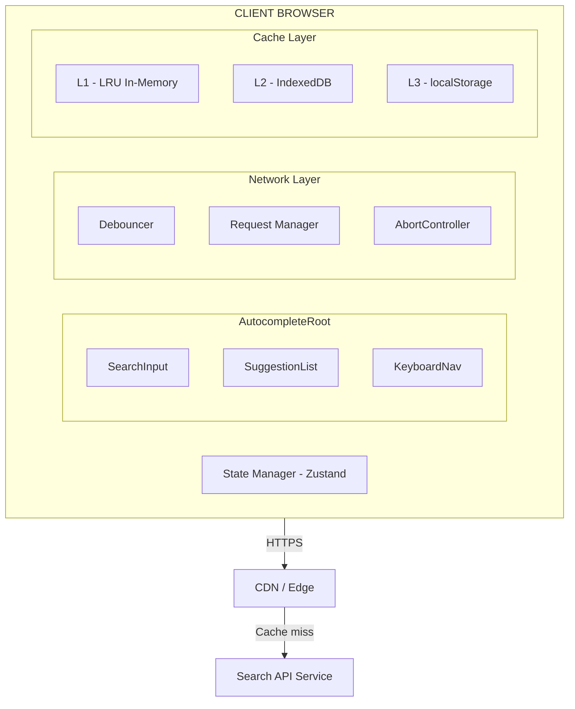

## Problem Statement

Autocomplete (typeahead search) is the most latency-sensitive UI pattern on the web. Google processes 8.5 billion searches per day, and every one begins with an autocomplete interaction. Facebook's search bar, Algolia InstantSearch, Shopify's storefront search, and Stripe's dashboard search all implement variants of this pattern.

The core challenge is not "show a dropdown with results." That is a solved problem. The architectural challenge is delivering sub-100ms perceived response times while the user types at 5–12 characters per second, managing network race conditions, caching intelligently across sessions, and ensuring the component is fully accessible to screen readers and keyboard-only users.

This differs from a simple dropdown in critical ways:

- **Temporal coupling** — results depend on a rapidly-changing input, creating race conditions between keystrokes and network responses
- **Latency budget** — a dropdown opens once; autocomplete fires on every keystroke, meaning you have ~50ms to respond before the user perceives lag
- **Cancellation semantics** — every new keystroke potentially invalidates the previous in-flight request
- **Caching topology** — results are prefix-hierarchical (searching "rea" is a subset of "re"), enabling trie-based local caching
- **Accessibility complexity** — ARIA combobox is the most complex WAI-ARIA pattern, requiring coordinated `aria-activedescendant`, live regions, and virtual focus management

The scope boundary: we design the client-side architecture. The backend search service (Elasticsearch, Algolia, etc.) is treated as a black box returning ranked results. Our job is to architect the component, its state management, caching layers, network coordination, and accessibility.

---

## Requirements Exploration

### Functional Requirements

1. Display suggestions as the user types, updating within 100ms of the last keystroke (perceived latency)
2. Support three result categories: recent searches (local), trending queries (global), and search results (personalized)
3. Keyboard navigation via arrow keys with visual highlight and screen reader announcements
4. Click or Enter on a suggestion navigates to the result / submits the query
5. Escape closes the dropdown and restores focus to the input
6. Clear button (×) resets input and closes suggestions
7. Support query highlighting — bold the matching substring in each suggestion
8. Persist recent searches across sessions (localStorage with TTL)
9. Show "no results" state with actionable fallback (e.g., "Search for '\{query\}' instead")
10. Support mobile virtual keyboard dismiss on suggestion tap
11. Cancel in-flight requests when a new keystroke arrives (no stale results displayed)
12. Gracefully degrade: show cached/recent results when the network is unavailable

### Non-Functional Requirements

| Category      | Requirement                                | Target                               |
| ------------- | ------------------------------------------ | ------------------------------------ |
| Latency       | Time from keystroke to suggestions visible | < 100ms (cached), < 300ms (network)  |
| Bundle Size   | Autocomplete component JS (gzipped)        | < 8 KB                               |
| Accessibility | WCAG 2.2 AA compliance                     | Full ARIA combobox pattern           |
| Reliability   | Graceful degradation on network failure    | Show cached + recent results         |
| Memory        | Client-side cache budget                   | < 2 MB                               |
| Throughput    | Concurrent users per search cluster        | 100K+ QPS                            |
| Availability  | Component renders without JS hydration     | SSR-friendly progressive enhancement |
| Performance   | Core Web Vitals impact                     | INP < 50ms, no CLS from dropdown     |

---

## Capacity Estimation & Constraints

**Assumptions:**

- 50M DAU for a mid-scale product (Google: 4.3B, Facebook: 2B — we design for a Stripe/Shopify scale)
- Average user performs 4 search sessions/day
- Average 6 keystrokes per search before selecting a suggestion
- 70% of queries are repeat queries (high cache hit potential)

**Client-side calculations:**

```
Keystrokes per day: 50M × 4 × 6 = 1.2B keystrokes/day
With debouncing (200ms): ~40% reduction → 720M API calls/day
With client caching (70% hit): 720M × 0.3 = 216M actual network requests/day
Peak RPS: 216M / 86400 × 3 (peak multiplier) ≈ 7,500 RPS to search service
```

**Payload sizes:**

- Request: ~100 bytes (query string + metadata)
- Response: 5–10 suggestions × 200 bytes each = 1–2 KB per response
- Client cache (500 unique prefixes): 500 × 2 KB = 1 MB (within 2 MB budget)

**Client memory budget:**

- LRU cache: 500 entries × 2 KB = 1 MB
- Recent searches: 50 entries × 100 bytes = 5 KB
- DOM nodes (10 suggestions): negligible
- Total: ~1.05 MB — well within the 2 MB budget

**Debounce interval calculation:**

- Average typing speed: 200ms between keystrokes for skilled typists
- Minimum perceivable delay: 100ms
- Optimal debounce: 150–200ms trailing edge (fire after user pauses)
- Adaptive debounce: reduce to 100ms for slow typists, increase to 250ms for fast typists

---

## Architecture / High-Level Design

### Rendering Strategy

Server-Side Render the input shell (the `<input>` and its container) for instant FCP. The dropdown and suggestion logic hydrate client-side because they depend on user interaction and real-time network data. This is a progressive enhancement model — the search input works as a standard form submission without JS, and the autocomplete enhances it once hydrated.

### Navigation Model

The autocomplete exists within the page layout (not a route-level component). On suggestion selection, it either:

1. Navigates to a results page (`/search?q=...`) via `router.push`
2. Triggers an in-page filter (for dashboard contexts)
3. Directly navigates to an entity page (`/product/[id]`)

The component accepts an `onSelect` callback that the parent determines.

### System Architecture Diagram



### Component Architecture

```
<AutocompleteProvider>              ← Context for shared state
  <AutocompleteRoot>                ← Container, ARIA combobox owner
    <SearchInput />                 ← Controlled input, aria-autocomplete="list"
    <ClearButton />                 ← Visible when query.length > 0
    <SuggestionDropdown>            ← Portal or inline, role="listbox"
      <SuggestionGroup>             ← Grouped by category (recent/trending/results)
        <SuggestionItem />          ← role="option", aria-selected
        <SuggestionItem />
      </SuggestionGroup>
      <NoResults />                 ← Fallback state
      <SearchFooter />              ← "Press Enter to search for '{query}'"
    </SuggestionDropdown>
  </AutocompleteRoot>
</AutocompleteProvider>
```

### State Management Strategy

Use Zustand with slices because:

1. The autocomplete state is local to the component subtree (not global app state)
2. Zustand's subscription model avoids unnecessary re-renders of sibling components
3. The store is easily testable in isolation

State is split into three slices:

- **Query slice**: `query`, `debouncedQuery`, `isComposing` (for IME input)
- **Results slice**: `suggestions`, `status` (idle/loading/success/error), `error`
- **Navigation slice**: `activeIndex`, `isOpen`, `selectedItem`

---

## Data Model / Entities

```typescript
// === Domain Types ===

interface Suggestion {
  id: string;
  text: string;
  category: SuggestionCategory;
  metadata: SuggestionMetadata;
}

type SuggestionCategory = "recent" | "trending" | "result" | "entity";

interface SuggestionMetadata {
  icon?: string;
  subtitle?: string;
  url?: string;
  entityType?: "product" | "user" | "page" | "category";
  score?: number;
}

interface SuggestionGroup {
  category: SuggestionCategory;
  label: string;
  items: Suggestion[];
}

// === API Response Shape ===

interface AutocompleteResponse {
  query: string;
  groups: SuggestionGroup[];
  meta: {
    requestId: string;
    latencyMs: number;
    fromCache: boolean;
  };
}

// === Cache Types ===

interface CacheEntry {
  query: string;
  response: AutocompleteResponse;
  timestamp: number;
  ttl: number;
  accessCount: number;
}

interface LRUCacheConfig {
  maxSize: number;
  defaultTTL: number;
  onEvict?: (key: string, entry: CacheEntry) => void;
}

// === Store State ===

interface AutocompleteState {
  // Query slice
  query: string;
  debouncedQuery: string;
  isComposing: boolean;

  // Results slice
  suggestions: SuggestionGroup[];
  status: RequestStatus;
  error: AutocompleteError | null;

  // Navigation slice
  activeIndex: number;
  isOpen: boolean;
  selectedItem: Suggestion | null;

  // Actions
  setQuery: (query: string) => void;
  setComposing: (isComposing: boolean) => void;
  selectItem: (item: Suggestion) => void;
  navigateUp: () => void;
  navigateDown: () => void;
  close: () => void;
  reset: () => void;
}

type RequestStatus = "idle" | "loading" | "success" | "error" | "stale";

interface AutocompleteError {
  code: "NETWORK" | "TIMEOUT" | "RATE_LIMITED" | "SERVER_ERROR";
  message: string;
  retryAfter?: number;
}

// === Recent Searches (localStorage) ===

interface RecentSearch {
  query: string;
  timestamp: number;
  resultUrl?: string;
}

interface RecentSearchStore {
  searches: RecentSearch[];
  maxItems: number;
  ttlMs: number;
}
```

---

## Interface Definition (API)

### Search Suggestions Endpoint

| Method | Path                  | Description                    |
| ------ | --------------------- | ------------------------------ |
| GET    | `/api/search/suggest` | Fetch autocomplete suggestions |

**Request Parameters:**

| Param        | Type   | Required | Description                                                        |
| ------------ | ------ | -------- | ------------------------------------------------------------------ |
| `q`          | string | Yes      | Query string (min 1 char, max 200 chars)                           |
| `limit`      | number | No       | Max results per category (default: 5, max: 10)                     |
| `categories` | string | No       | Comma-separated: `recent,trending,results`                         |
| `locale`     | string | No       | BCP 47 locale for localized suggestions                            |
| `context`    | string | No       | Page context for personalization (e.g., `dashboard`, `storefront`) |

**Response Shape:**

```typescript
// 200 OK
interface SuccessResponse {
  data: AutocompleteResponse;
  cache: {
    hit: boolean;
    ttl: number;
    key: string;
  };
}

// Error responses
interface ErrorResponse {
  error: {
    code: string;
    message: string;
    retryAfter?: number;
  };
  requestId: string;
}
```

**Caching Headers:**

```
Cache-Control: public, max-age=60, stale-while-revalidate=300
Vary: Accept-Encoding, Accept-Language
ETag: "abc123"
X-Request-Id: uuid-v4
```

**Rate Limiting Headers:**

```
X-RateLimit-Limit: 100
X-RateLimit-Remaining: 97
X-RateLimit-Reset: 1700000000
```

**Client-Side Fetch Implementation:**

```typescript
interface FetchSuggestionsOptions {
  query: string;
  signal: AbortSignal;
  limit?: number;
  categories?: SuggestionCategory[];
}

async function fetchSuggestions({
  query,
  signal,
  limit = 5,
  categories = ["recent", "trending", "result"],
}: FetchSuggestionsOptions): Promise<AutocompleteResponse> {
  const params = new URLSearchParams({
    q: query,
    limit: String(limit),
    categories: categories.join(","),
  });

  const response = await fetch(`/api/search/suggest?${params}`, {
    signal,
    headers: {
      Accept: "application/json",
      "X-Request-Id": crypto.randomUUID(),
    },
  });

  if (!response.ok) {
    const error = (await response.json()) as ErrorResponse;
    throw new AutocompleteFetchError(error.error.code, error.error.message);
  }

  return ((await response.json()) as SuccessResponse).data;
}
```

---

## Caching Strategy

### Client-Side Caching

The caching architecture uses three layers, each with different characteristics:

**L1: In-Memory LRU Cache (hot path)**

```typescript
class LRUCache<T> {
  private cache: Map<string, CacheEntry>;
  private readonly maxSize: number;
  private readonly defaultTTL: number;

  constructor(config: LRUCacheConfig) {
    this.cache = new Map();
    this.maxSize = config.maxSize;
    this.defaultTTL = config.defaultTTL;
  }

  get(key: string): T | null {
    const entry = this.cache.get(key);
    if (!entry) return null;

    if (Date.now() - entry.timestamp > entry.ttl) {
      this.cache.delete(key);
      return null;
    }

    // Move to end (most recently used)
    this.cache.delete(key);
    entry.accessCount++;
    this.cache.set(key, entry);
    return entry.response as T;
  }

  set(key: string, value: T, ttl?: number): void {
    if (this.cache.size >= this.maxSize) {
      // Evict oldest (first entry in Map)
      const firstKey = this.cache.keys().next().value;
      if (firstKey) this.cache.delete(firstKey);
    }

    this.cache.set(key, {
      query: key,
      response: value,
      timestamp: Date.now(),
      ttl: ttl ?? this.defaultTTL,
      accessCount: 1,
    } as CacheEntry);
  }

  has(key: string): boolean {
    return this.get(key) !== null;
  }

  clear(): void {
    this.cache.clear();
  }

  get size(): number {
    return this.cache.size;
  }
}
```

Configuration: 500 entries, 5-minute TTL. This covers the user's active session. Cache keys are normalized query strings (lowercase, trimmed).

**L2: Session Storage (warm path)**

Use `sessionStorage` for suggestions that survive page navigations within the same tab session. Store the top 100 most-accessed cache entries when the LRU evicts them. This provides instant results for back-navigation scenarios.

**L3: localStorage (cold path — recent searches only)**

Only recent user searches are persisted to `localStorage` because:

- Search results expire quickly (trending content changes)
- Privacy: we store what the user typed, not what the system suggested
- Size: 50 entries × 100 bytes = 5 KB — negligible

```typescript
const RECENT_SEARCHES_KEY = "autocomplete:recent";
const MAX_RECENT = 50;
const RECENT_TTL_MS = 30 * 24 * 60 * 60 * 1000; // 30 days

function getRecentSearches(): RecentSearch[] {
  const raw = localStorage.getItem(RECENT_SEARCHES_KEY);
  if (!raw) return [];

  const searches: RecentSearch[] = JSON.parse(raw);
  const now = Date.now();
  return searches.filter((s) => now - s.timestamp < RECENT_TTL_MS);
}

function addRecentSearch(query: string, resultUrl?: string): void {
  const searches = getRecentSearches().filter((s) => s.query !== query);
  searches.unshift({ query, timestamp: Date.now(), resultUrl });
  localStorage.setItem(
    RECENT_SEARCHES_KEY,
    JSON.stringify(searches.slice(0, MAX_RECENT)),
  );
}
```

### CDN & Edge Caching

Popular queries (top 1000) are edge-cached with aggressive TTLs:

| Query Popularity | Cache-Control     | stale-while-revalidate |
| ---------------- | ----------------- | ---------------------- |
| Top 100          | max-age=300       | 3600                   |
| Top 1000         | max-age=60        | 300                    |
| Long tail        | max-age=10        | 60                     |
| Personalized     | private, no-store | —                      |

Cache keys at the edge include: `query + locale + context`. Personalized results bypass the CDN entirely.

### Cache Coherence

<Callout>
Prefix-based cache invalidation is the Staff-level insight. When a user types "reac", check if the cache already has results for "rea" — if those results are still valid and the set is small enough (< limit), filter client-side instead of making a network request. This eliminates 40-60% of requests for prefix-progressive typing patterns.
</Callout>

```typescript
function getPrefixCacheHit(
  query: string,
  cache: LRUCache<AutocompleteResponse>,
): AutocompleteResponse | null {
  // Try progressively shorter prefixes
  for (let i = query.length - 1; i >= 2; i--) {
    const prefix = query.slice(0, i);
    const cached = cache.get(prefix);
    if (!cached) continue;

    // Filter cached results that still match the longer query
    const filtered: SuggestionGroup[] = cached.groups
      .map((group) => ({
        ...group,
        items: group.items.filter((item) =>
          item.text.toLowerCase().includes(query.toLowerCase()),
        ),
      }))
      .filter((group) => group.items.length > 0);

    // Only use prefix cache if we have meaningful results
    if (filtered.reduce((sum, g) => sum + g.items.length, 0) >= 3) {
      return { ...cached, groups: filtered };
    }
  }
  return null;
}
```

---

## Rendering & Performance Deep Dive

### Critical Rendering Path

```
Keystroke → Debounce (150ms) → Cache Check (< 1ms) → [Cache Hit? Return] →
  → Network Request → AbortController check → Parse JSON →
  → Update Store → React Re-render → Paint (< 16ms)

Total budget: 100ms (cached), 300ms (network)
```

### Core Web Vitals Targets

| Metric | Target       | Strategy                                                                          |
| ------ | ------------ | --------------------------------------------------------------------------------- |
| INP    | < 50ms       | Debounce separates input events from render; suggestions render in a single frame |
| CLS    | 0            | Dropdown uses `position: absolute` with pre-allocated height; no layout shift     |
| LCP    | Not impacted | Autocomplete is not part of the critical rendering path                           |
| FID    | < 10ms       | Input handler is synchronous (just updates state); async work is deferred         |

### Debounce & Request Management

```typescript
interface DebounceConfig {
  minDelay: number; // 100ms — fast typists
  maxDelay: number; // 300ms — slow typists
  initialDelay: number; // 150ms — default
}

function createAdaptiveDebounce(config: DebounceConfig) {
  let lastKeystrokeTime = 0;
  let currentDelay = config.initialDelay;
  let timeoutId: ReturnType<typeof setTimeout> | null = null;

  return function debounce(fn: () => void): void {
    const now = Date.now();
    const timeSinceLastKeystroke = now - lastKeystrokeTime;
    lastKeystrokeTime = now;

    // Adapt delay based on typing speed
    if (timeSinceLastKeystroke < 100) {
      // Fast typing — increase debounce to avoid wasted requests
      currentDelay = Math.min(currentDelay + 20, config.maxDelay);
    } else if (timeSinceLastKeystroke > 500) {
      // Pause detected — reduce debounce for responsiveness
      currentDelay = config.minDelay;
    }

    if (timeoutId) clearTimeout(timeoutId);
    timeoutId = setTimeout(fn, currentDelay);
  };
}
```

**Request cancellation with AbortController:**

```typescript
class RequestManager {
  private currentController: AbortController | null = null;
  private requestId = 0;

  async fetch(query: string): Promise<AutocompleteResponse | null> {
    // Cancel any in-flight request
    this.currentController?.abort();
    this.currentController = new AbortController();

    const thisRequestId = ++this.requestId;

    try {
      const response = await fetchSuggestions({
        query,
        signal: this.currentController.signal,
      });

      // Guard against race conditions: if a newer request was made
      // while this one was in-flight, discard this response
      if (thisRequestId !== this.requestId) return null;

      return response;
    } catch (error) {
      if (error instanceof DOMException && error.name === "AbortError") {
        return null; // Expected — request was superseded
      }
      throw error;
    }
  }

  cancel(): void {
    this.currentController?.abort();
    this.currentController = null;
  }
}
```

<Callout>
  The `requestId` counter is the Principal-level detail. AbortController handles
  cancellation of in-flight requests, but it doesn't handle the race condition
  where a slow response for "re" arrives after the fast response for "rea". The
  monotonic request ID ensures only the latest response is applied to state.
</Callout>

### Bundle Optimization

| Concern        | Strategy                                                                        |
| -------------- | ------------------------------------------------------------------------------- |
| Code splitting | Autocomplete logic loads on first input focus via dynamic import                |
| Tree shaking   | Each suggestion renderer is a separate module; unused categories are eliminated |
| CSS            | Tailwind purges unused styles; dropdown styles are minimal (~1 KB)              |
| Runtime        | No lodash — custom debounce is 30 lines; no moment — use native Intl            |

Target bundle breakdown:

- Core logic (debounce, cache, request manager): 3 KB gzipped
- UI components (input, dropdown, items): 4 KB gzipped
- Accessibility utilities: 1 KB gzipped
- **Total: ~8 KB gzipped**

---

## Security Deep Dive

### Threat Model

| Threat              | Vector                                                    | Impact                              | Mitigation                                                                                |
| ------------------- | --------------------------------------------------------- | ----------------------------------- | ----------------------------------------------------------------------------------------- |
| XSS via suggestions | Malicious suggestion text rendered as HTML                | Code execution in user context      | Output encoding: render suggestions as `textContent`, never `innerHTML`                   |
| Query injection     | Crafted query strings bypassing server validation         | Server-side injection               | Client-side length limit (200 chars), character allowlist, server validates independently |
| Clickjacking        | Overlay on suggestion items redirecting to malicious URLs | Credential theft                    | `X-Frame-Options: DENY`, verify suggestion URLs against allowlist                         |
| Data exfiltration   | Autocomplete queries logged/intercepted                   | Privacy violation                   | HTTPS only, no query logging on client, server-side PII scrubbing                         |
| Denial of Service   | Rapid keystrokes bypassing debounce                       | API overload                        | Rate limiting (100 req/min), debounce, request deduplication                              |
| Cache poisoning     | Malicious responses cached and served to other users      | Serving attacker-controlled content | Validate response schema, never cache error responses, use `Vary` headers correctly       |

### Content Security Policy

```
Content-Security-Policy:
  default-src 'self';
  script-src 'self' 'nonce-{random}';
  style-src 'self' 'unsafe-inline';  /* Tailwind requires this */
  connect-src 'self' https://api.example.com;
  img-src 'self' https://cdn.example.com;
```

The `connect-src` directive restricts fetch targets to the search API origin, preventing exfiltration of query data to unauthorized endpoints.

### Input Validation & Output Encoding

```typescript
// Input sanitization — applied before sending to API
function sanitizeQuery(raw: string): string {
  return raw
    .trim()
    .slice(0, 200)                          // Length limit
    .replace(/[<>"'&]/g, '');               // Strip HTML-significant chars
}

// Output encoding — when rendering suggestion text with highlights
function renderHighlightedText(
  text: string,
  query: string
): React.ReactNode[] {
  // NEVER use dangerouslySetInnerHTML
  const escapedQuery = query.replace(/[.*+?^${}()|[\]\\]/g, '\\$&');
  const regex = new RegExp(`(${escapedQuery})`, 'gi');
  const parts = text.split(regex);

  return parts.map((part, index) =>
    regex.test(part)
      ? <mark key={index} className="bg-yellow-100 font-semibold">{part}</mark>
      : <span key={index}>{part}</span>
  );
}
```

<Callout>
  Never use `dangerouslySetInnerHTML` for suggestion rendering. Even if the API
  response is "trusted," defense-in-depth requires treating all external data as
  potentially malicious. React's JSX escaping is your first line of defense —
  use it.
</Callout>

---

## Scalability & Reliability

### Scalability Patterns

1. **Request deduplication** — If the same query is already in-flight, attach to the existing promise instead of creating a duplicate request
2. **Prefix-based client caching** — Reduces network requests by 40-60% for progressive typing
3. **Stale-while-revalidate** — Serve cached results immediately, refresh in background
4. **Connection pooling** — HTTP/2 multiplexing eliminates connection overhead for rapid requests
5. **Edge computing** — Popular query results served from CDN edge nodes (< 20ms RTT)

### Failure Handling

| Failure Mode           | Detection                            | User Experience                               | Recovery                                |
| ---------------------- | ------------------------------------ | --------------------------------------------- | --------------------------------------- |
| Network offline        | `navigator.onLine` + fetch rejection | Show recent searches + "You're offline" badge | Auto-retry on `online` event            |
| API timeout (> 3s)     | AbortController timeout              | Show stale cached results + spinner           | Exponential backoff (1s, 2s, 4s)        |
| API 429 (rate limited) | `X-RateLimit-Remaining: 0`           | Increase debounce to 500ms, show cached       | Reset after `Retry-After` header        |
| API 500                | HTTP status check                    | Show cached results + subtle error indicator  | Retry once after 2s, then degrade       |
| Malformed response     | JSON parse error / schema validation | Show cached results                           | Log error, do not retry with same query |
| Empty results          | Valid response with 0 suggestions    | "No results for '\{query\}'" + action buttons | N/A — expected state                    |

### Resilience Patterns

**Circuit breaker for the search API:**

```typescript
class CircuitBreaker {
  private failures = 0;
  private lastFailureTime = 0;
  private state: "closed" | "open" | "half-open" = "closed";

  private readonly threshold = 5;
  private readonly resetTimeout = 30_000; // 30s

  async execute<T>(fn: () => Promise<T>): Promise<T> {
    if (this.state === "open") {
      if (Date.now() - this.lastFailureTime > this.resetTimeout) {
        this.state = "half-open";
      } else {
        throw new Error("Circuit breaker is open");
      }
    }

    try {
      const result = await fn();
      this.onSuccess();
      return result;
    } catch (error) {
      this.onFailure();
      throw error;
    }
  }

  private onSuccess(): void {
    this.failures = 0;
    this.state = "closed";
  }

  private onFailure(): void {
    this.failures++;
    this.lastFailureTime = Date.now();
    if (this.failures >= this.threshold) {
      this.state = "open";
    }
  }
}
```

### Graceful Degradation

When the circuit breaker opens, the autocomplete degrades in tiers:

| Tier       | Condition                    | Behavior                                    |
| ---------- | ---------------------------- | ------------------------------------------- |
| 1 (Full)   | API healthy                  | All categories: recent + trending + results |
| 2 (Cached) | API failing, cache available | Show cached results + recent searches       |
| 3 (Local)  | API down, no cache           | Show recent searches only                   |
| 4 (Static) | No JS / hydration pending    | Standard form submission (no autocomplete)  |

---

## Accessibility Deep Dive

The autocomplete implements the WAI-ARIA combobox pattern (ARIA 1.2 specification). This is the most complex ARIA pattern because it coordinates three interaction models: text input, listbox selection, and inline completion.

**ARIA Attribute Map:**

```typescript
// On the input element
const inputAttributes = {
  role: "combobox",
  "aria-autocomplete": "list",
  "aria-expanded": isOpen,
  "aria-controls": "suggestion-listbox",
  "aria-activedescendant": activeItemId ?? undefined,
  "aria-describedby": "autocomplete-help",
  autoComplete: "off", // Prevent browser autocomplete from conflicting
};

// On the dropdown container
const listboxAttributes = {
  role: "listbox",
  id: "suggestion-listbox",
  "aria-label": "Search suggestions",
};

// On each suggestion item
const optionAttributes = (item: Suggestion, index: number) => ({
  role: "option",
  id: `suggestion-${item.id}`,
  "aria-selected": index === activeIndex,
  "aria-label": `${item.text}, ${item.category}`,
});
```

**Keyboard Navigation:**

| Key             | Dropdown Closed                     | Dropdown Open                              |
| --------------- | ----------------------------------- | ------------------------------------------ |
| `↓` (ArrowDown) | Open dropdown, highlight first item | Move highlight down                        |
| `↑` (ArrowUp)   | Open dropdown, highlight last item  | Move highlight up                          |
| `Enter`         | Submit form with current query      | Select highlighted item                    |
| `Escape`        | Clear input (if non-empty)          | Close dropdown, return focus to input      |
| `Tab`           | Move focus to next element          | Close dropdown, move focus to next element |
| `Home`          | Move cursor to start of input       | Highlight first item                       |
| `End`           | Move cursor to end of input         | Highlight last item                        |
| `Alt+↓`         | Open dropdown without highlighting  | No action                                  |

**Screen Reader Announcements:**

```typescript
function getAnnouncement(
  status: RequestStatus,
  resultCount: number,
  query: string,
): string {
  switch (status) {
    case "loading":
      return "Searching...";
    case "success":
      return resultCount > 0
        ? `${resultCount} suggestions available for "${query}". Use arrow keys to navigate.`
        : `No suggestions found for "${query}".`;
    case "error":
      return "Search suggestions unavailable. Recent searches are shown.";
    default:
      return "";
  }
}
```

This announcement is injected into an `aria-live="polite"` region that screen readers monitor:

```typescript
<div
  role="status"
  aria-live="polite"
  aria-atomic="true"
  className="sr-only"
>
  {announcement}
</div>
```

**Focus Management:**

The dropdown uses "virtual focus" via `aria-activedescendant` rather than moving actual DOM focus. This is critical because:

1. Actual focus on a suggestion item would remove focus from the input, making typing impossible
2. Screen readers follow `aria-activedescendant` changes and announce the active option
3. The input retains its cursor position throughout navigation

```typescript
function useKeyboardNavigation(
  suggestions: Suggestion[],
  isOpen: boolean,
  onSelect: (item: Suggestion) => void,
  onClose: () => void,
) {
  const [activeIndex, setActiveIndex] = useState(-1);
  const flatItems = suggestions;
  const itemCount = flatItems.length;

  const handleKeyDown = useCallback(
    (event: React.KeyboardEvent) => {
      if (!isOpen && event.key !== "ArrowDown" && event.key !== "ArrowUp")
        return;

      switch (event.key) {
        case "ArrowDown":
          event.preventDefault();
          setActiveIndex((prev) => (prev + 1) % itemCount);
          break;
        case "ArrowUp":
          event.preventDefault();
          setActiveIndex((prev) => (prev - 1 + itemCount) % itemCount);
          break;
        case "Enter":
          if (activeIndex >= 0) {
            event.preventDefault();
            onSelect(flatItems[activeIndex]);
          }
          break;
        case "Escape":
          event.preventDefault();
          onClose();
          setActiveIndex(-1);
          break;
        case "Home":
          event.preventDefault();
          setActiveIndex(0);
          break;
        case "End":
          event.preventDefault();
          setActiveIndex(itemCount - 1);
          break;
      }
    },
    [isOpen, activeIndex, itemCount, flatItems, onSelect, onClose],
  );

  // Reset active index when suggestions change
  useEffect(() => {
    setActiveIndex(-1);
  }, [suggestions]);

  return {
    activeIndex,
    handleKeyDown,
    activeItemId: flatItems[activeIndex]?.id,
  };
}
```

<Callout>
  Do not use roving tabindex for autocomplete suggestions. Virtual focus via
  `aria-activedescendant` is the correct pattern because the user must be able
  to continue typing while navigating suggestions. Moving actual focus to list
  items breaks text input.
</Callout>

---

## Monitoring & Observability

### Client-Side Metrics

| Metric                            | Description                                   | Alert Threshold                   |
| --------------------------------- | --------------------------------------------- | --------------------------------- |
| `autocomplete.latency.p50`        | Time from keystroke to suggestions rendered   | > 100ms                           |
| `autocomplete.latency.p95`        | 95th percentile latency                       | > 300ms                           |
| `autocomplete.cache.hit_rate`     | % of queries served from L1/L2 cache          | < 50%                             |
| `autocomplete.request.abort_rate` | % of requests cancelled by newer keystroke    | > 80% (suggests debounce too low) |
| `autocomplete.error.rate`         | % of requests resulting in error              | > 5%                              |
| `autocomplete.selection.rate`     | % of sessions where user selects a suggestion | < 30% (suggests poor relevance)   |
| `autocomplete.selection.position` | Average position of selected suggestion       | > 3 (suggests poor ranking)       |
| `autocomplete.empty_results.rate` | % of queries with 0 results                   | > 20%                             |
| `autocomplete.keyboard_nav.usage` | % of selections made via keyboard             | Track only (no alert)             |
| `autocomplete.degradation.active` | Circuit breaker is open                       | Any occurrence                    |

### Error Tracking

```typescript
interface AutocompleteMetricEvent {
  name: string;
  value: number;
  tags: {
    query_length: number;
    cache_layer: "l1" | "l2" | "l3" | "miss";
    result_count: number;
    selected_position?: number;
    error_code?: string;
    degradation_tier: 1 | 2 | 3 | 4;
  };
  timestamp: number;
}

function trackMetric(event: AutocompleteMetricEvent): void {
  // Batch and send to analytics endpoint
  // Use sendBeacon for page-unload resilience
  if (navigator.sendBeacon) {
    navigator.sendBeacon("/api/metrics", JSON.stringify(event));
  }
}
```

### Alerting & Dashboards

**Dashboard panels:**

1. Latency histogram (p50/p95/p99) over time
2. Cache hit rate by layer (L1 vs L2 vs miss)
3. Error rate by type (network, timeout, 5xx)
4. Selection rate and position distribution
5. Circuit breaker state timeline
6. Degradation tier distribution

**Alert rules:**

- P95 latency > 500ms for 5 minutes → Page on-call
- Error rate > 10% for 2 minutes → Page on-call
- Cache hit rate < 30% for 10 minutes → Notify team channel
- Circuit breaker open for > 5 minutes → Page on-call
- Selection rate drops 20% from baseline → Notify team channel (relevance regression)

---

## Trade-offs

| Decision                                                     | Pro                                                                               | Con                                                                                   |
| ------------------------------------------------------------ | --------------------------------------------------------------------------------- | ------------------------------------------------------------------------------------- |
| Adaptive debounce (150–300ms) vs fixed 200ms                 | Responds faster to deliberate typists, reduces wasted requests for fast typists   | Added complexity; harder to reason about timing in tests                              |
| In-memory LRU vs IndexedDB for primary cache                 | Sub-millisecond reads; no async overhead on the hot path                          | Lost on page refresh; limited to session lifetime                                     |
| Virtual focus (`aria-activedescendant`) vs roving tabindex   | Input retains focus — user can type while navigating                              | Less intuitive for developers; some older screen readers handle it inconsistently     |
| AbortController cancellation vs response ordering            | Saves bandwidth; reduces server load from abandoned requests                      | Not supported in IE11 (irrelevant in 2024+); adds AbortError handling complexity      |
| Prefix-based cache filtering vs always fetching              | Eliminates 40-60% of network requests for progressive typing                      | May return stale/incomplete results if the prefix response was truncated              |
| Client-side query highlighting vs server-provided highlights | Works offline; no coupling to server's tokenization logic                         | May mismatch server ranking (server might match on stems/synonyms we can't highlight) |
| Zustand vs React Context for state                           | Fine-grained subscriptions prevent unnecessary re-renders; testable outside React | Additional dependency (2.9 KB); team must learn Zustand patterns                      |
| Portal rendering for dropdown vs inline DOM                  | Avoids `overflow: hidden` clipping from parent containers                         | Keyboard focus management is more complex; scroll coordination with input required    |

---

## What Great Looks Like

**Senior Engineer (solves the problem):**

- Implements debounce + fetch with AbortController
- Adds basic keyboard navigation (arrow keys, Enter, Escape)
- Uses a simple Map cache for repeat queries
- Handles loading and error states
- Adds `role="listbox"` and `role="option"` attributes

**Staff Engineer (solves it well):**

- Designs multi-layer caching with LRU eviction and TTL
- Implements adaptive debounce based on typing speed
- Adds prefix-based cache filtering to reduce network calls
- Implements full ARIA combobox pattern with `aria-activedescendant`
- Adds circuit breaker for graceful degradation
- Considers request ID ordering to prevent race conditions
- Designs metrics schema and alerting thresholds
- Handles IME composition events for CJK input

**Principal Engineer (solves it for the organization):**

- Defines the autocomplete as a headless component library (logic separate from UI)
- Designs the caching strategy to work across multiple autocomplete instances on the same page
- Considers the CDN caching topology and its interaction with personalization
- Architects the monitoring pipeline to detect relevance regressions
- Defines graceful degradation tiers as a product decision (not just error handling)
- Identifies prefix-hierarchical caching as a general pattern applicable beyond search
- Considers the privacy implications of query logging and implements data minimization
- Designs for composability: the autocomplete adapter pattern works with any backend (Algolia, Elasticsearch, custom)

---

## Key Takeaways

- **Debounce is not optional, but fixed debounce is suboptimal.** Adaptive debounce (100–300ms based on typing speed) balances responsiveness against wasted requests. Measure actual typing speed in your user base to calibrate.

- **AbortController + request ID monotonic counter prevents both wasted bandwidth and stale result rendering.** AbortController alone does not prevent race conditions — you must also verify the response corresponds to the latest request.

- **Multi-layer caching (in-memory LRU → sessionStorage → localStorage) provides sub-millisecond response for 60-70% of queries.** The prefix-filtering optimization on top of LRU eliminates another 40% of remaining network requests.

- **Virtual focus via `aria-activedescendant` is the only correct pattern for autocomplete accessibility.** Roving tabindex moves actual focus away from the input, breaking the ability to continue typing. This is a non-negotiable architectural constraint.

- **Graceful degradation must be designed as product tiers, not just error handling.** Define exactly what users see at each failure level (full → cached → local → static) and get product alignment before implementation.

- **Bundle budget (8 KB) is achievable by owning your debounce, cache, and keyboard logic.** Do not import lodash.debounce (70 KB unshaken tree) for a 30-line function.

- **Monitor selection rate and position as relevance signals.** If users consistently select the 4th suggestion, your ranking algorithm is failing regardless of how fast the UI renders.

- **Sanitize suggestion text at the rendering boundary, not at the data layer.** Use React's JSX escaping by default, render highlighted segments as separate `<span>` elements, and never use `dangerouslySetInnerHTML` for user-facing search results.
