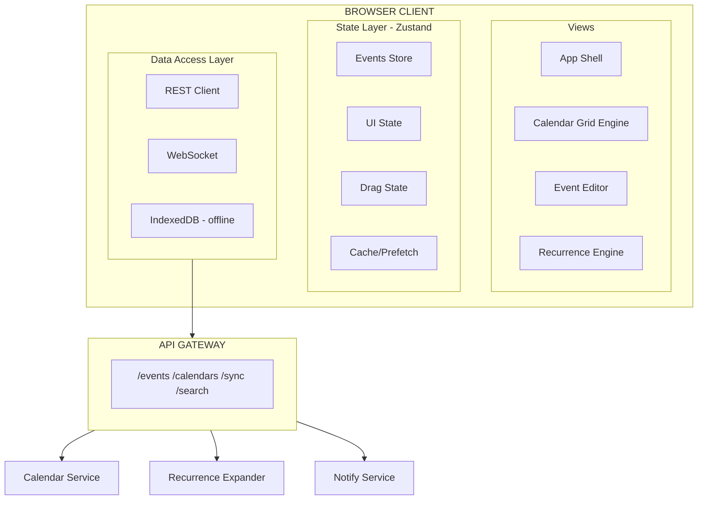

## Problem Statement

A calendar application is one of the most architecturally demanding frontend systems—it combines complex 2D spatial layout algorithms, real-time collaboration, timezone arithmetic, recurrence expansion, drag-and-drop manipulation, and multi-view state synchronization. Unlike simpler CRUD apps, a calendar must render hundreds of overlapping events in a time grid, resolve visual conflicts in sub-millisecond layout passes, and support optimistic drag operations that snap to 15-minute intervals while maintaining 60fps rendering.

**Scope:** Design the frontend architecture for a web-based calendar comparable to Google Calendar. The system supports day/week/month/year/agenda views, drag-to-create and drag-to-resize events, recurring event series (RRULE), multi-timezone display, CalDAV/ICS sync, conflict visualization, and reminder scheduling.

**Out of scope:** Video conferencing integration, email invitation transport (we call an API), calendar sharing permission management UI, and mobile-native implementations.

**Real-world references:** Google Calendar, Microsoft Outlook Calendar, Apple Calendar (iCloud), Calendly, Cal.com, Fantastical, Cron (now Notion Calendar).

---

## Requirements Exploration

### Functional Requirements

1. Users can view events across five view modes: day, week, month, year, and agenda list.
2. Users can create events by clicking a time slot or dragging across a time range (snaps to 15-minute intervals).
3. Users can drag events to reschedule them and drag event edges to resize duration.
4. Users can create recurring events using RRULE patterns (daily, weekly, monthly, custom) and edit "this event", "this and following", or "all events" in a series.
5. Events are stored in UTC and displayed in the user's local timezone, with optional multi-timezone column display.
6. Overlapping events are visually packed into columns with conflict indicators.
7. All-day events render in a dedicated banner zone above the time grid.
8. Users can subscribe to external calendars via CalDAV/ICS URL.
9. Users receive browser notifications and email reminders at configured offsets before events.
10. Users can search events by title, attendee, or location with instant results.
11. Keyboard-accessible date picker and full navigation without a mouse.
12. Mini calendar (month picker) in the sidebar syncs with the main view's date range.

### Non-Functional Requirements

| Category       | Requirement                       | Target                                  |
| -------------- | --------------------------------- | --------------------------------------- |
| Performance    | Time-to-Interactive (week view)   | < 1.8s on 4G mid-range device           |
| Performance    | Frame rate during drag operations | 60fps (< 16.6ms per frame)              |
| Performance    | Layout pass for 200 events        | < 8ms                                   |
| Bundle         | Initial JS (calendar shell)       | < 120KB gzipped                         |
| Bundle         | Full app with editor/recurrence   | < 280KB gzipped                         |
| Responsiveness | Event create via drag             | < 50ms visual feedback                  |
| Responsiveness | View switch (day→week)            | < 100ms paint                           |
| Reliability    | Offline event creation            | Queue and sync when online              |
| Accessibility  | WCAG 2.1 AA                       | Full keyboard nav + screen reader       |
| Data           | Max events per user               | 50,000+ without performance degradation |
| Sync           | External calendar refresh         | ≤ 5 min staleness                       |

---

## Capacity Estimation & Constraints

**User profile:**

- DAU: 2M users
- Average events per user: 8 visible in a week view, 200 in a month, 2,400 per year
- Peak creation rate: 500 events/sec across all users
- Read:write ratio: 50:1 (users view far more than they create)

**Payload sizes:**

- Single event JSON: ~400 bytes (title, start, end, recurrence, metadata)
- Week view fetch (user's events + shared): ~80 events × 400B = 32KB
- Month view: ~200 events × 400B = 80KB
- Recurring event expansion: 1 RRULE can generate 52+ instances/year

**Client memory budget:**

- Active view events: ≤ 500 event objects in memory (~200KB)
- Cached adjacent views (±1 week): ~1,000 events (~400KB)
- Total calendar client state: < 2MB

**Rendering budget:**

- Week view grid: 7 columns × 24 rows = 168 cells + event overlays
- Month view: 42 cells (6 weeks × 7 days) + stacked event chips
- Layout algorithm must handle O(n log n) overlap detection for n events per column

These constraints drive the architecture: we need virtualized rendering for month/year views, a spatial index for overlap detection, and aggressive prefetching of adjacent date ranges.

---

## Architecture / High-Level Design

### Rendering Strategy

**Client-Side Rendering (CSR) with Server-Side Shell.**

Justification: Calendar is a highly interactive single-page application. Every user action (drag, resize, view switch, date navigation) requires immediate DOM updates. SSR adds no value for the core grid—it's always behind auth and personalized. We SSR the app shell (header, sidebar skeleton) for fast FCP, then hydrate the calendar grid client-side.

- **App Shell:** Static HTML + critical CSS. Renders nav, sidebar skeleton, loading spinners.
- **Calendar Grid:** CSR. Mounted after hydration. Fetches events for current date range.
- **Event Editor Modal:** Lazy-loaded on first interaction (code-split).
- **Recurrence Engine:** Loaded on-demand when user opens recurrence picker or views recurring events.

### Navigation Model

Single-Page Application with URL-driven state:

```
/calendar/week/2024-03-18          → week view starting March 18
/calendar/day/2024-03-20           → day view for March 20
/calendar/month/2024-03             → month view for March 2024
/calendar/event/evt_abc123         → event detail overlay
```

URL encodes: view mode, anchor date, and optional event ID. The mini calendar and main view share a single source of truth for the active date range, derived from the URL.

Browser back/forward navigates between date ranges and views without full remounts—only the grid content updates.

### System Architecture Diagram



### Component Architecture

```
<CalendarApp>                          ← CSR root, URL router
├── <Sidebar>                          ← Server Component (static)
│   ├── <MiniCalendar />               ← Client: date navigation
│   ├── <CalendarList />               ← Client: toggle visibility
│   └── <CreateButton />               ← Client: quick-create trigger
├── <CalendarHeader>                   ← Client: view switcher, date nav
│   ├── <ViewSelector />               ← day|week|month|year|agenda
│   ├── <DateNavigator />              ← prev/today/next
│   └── <TimezoneSelector />           ← multi-tz display toggle
├── <CalendarGrid>                     ← Client: core rendering engine
│   ├── <AllDayBanner />               ← renders all-day event chips
│   ├── <TimeGrid>                     ← time column + event lanes
│   │   ├── <TimeGutter />             ← hour labels (00:00–23:00)
│   │   ├── <DayColumn />              ← per-day event layout
│   │   │   └── <EventBlock />         ← positioned event (absolute)
│   │   └── <DragGhost />              ← during drag operations
│   └── <MonthGrid />                  ← alternative: cell-based layout
│       └── <DayCell />
│           └── <EventChip />
├── <EventEditor />                    ← Lazy: modal/panel for create/edit
│   ├── <RecurrencePicker />           ← RRULE builder UI
│   ├── <DateTimePicker />             ← keyboard-accessible
│   ├── <AttendeeInput />              ← autocomplete
│   └── <ReminderSelector />           ← notification offset picker
└── <SearchOverlay />                  ← Lazy: full-text event search
```

### State Management Strategy

| State Category                                 | Tool                   | Reason                                        |
| ---------------------------------------------- | ---------------------- | --------------------------------------------- |
| Server state (events, calendars)               | TanStack Query         | Cache, background refresh, optimistic updates |
| UI state (current view, active date)           | URL (via router)       | Shareable, back/forward works                 |
| Drag state (ghost position, snap)              | Zustand (transient)    | High-frequency updates, no persistence needed |
| Event editor form                              | React Hook Form        | Validation, controlled inputs                 |
| User preferences (timezone, first day of week) | Zustand + localStorage | Persisted client-side                         |
| Offline queue                                  | IndexedDB via Dexie    | Survives page reload                          |

<Callout>
The critical insight is separating **transient drag state** from **persisted event state**. Drag state updates at 60fps (pointer position, snap calculations) and must never trigger React re-renders of the entire grid. Use a Zustand store with selective subscriptions—only the `<DragGhost>` and the target `<DayColumn>` subscribe to drag coordinates.
</Callout>

---

## Data Model / Entities

```typescript
/** Core event entity — stored server-side in UTC */
interface CalendarEvent {
  id: string; // evt_uuid
  calendarId: string; // which calendar this belongs to
  title: string;
  description: string; // rich text (markdown)
  location: string;
  startTime: string; // ISO 8601 UTC: "2024-03-20T14:00:00Z"
  endTime: string; // ISO 8601 UTC: "2024-03-20T15:30:00Z"
  isAllDay: boolean; // true → ignore time, use date only
  timezone: string; // IANA: "America/New_York" (creation tz)
  status: "confirmed" | "tentative" | "cancelled";
  visibility: "public" | "private" | "confidential";
  recurrence: RecurrenceRule | null; // null for single events
  recurrenceId: string | null; // parent series ID for instances
  isRecurrenceException: boolean; // true if this instance was modified
  attendees: Attendee[];
  reminders: Reminder[];
  color: string | null; // override calendar color
  createdAt: string;
  updatedAt: string;
  etag: string; // for conflict detection (If-Match)
}

/** RRULE representation — subset of RFC 5545 */
interface RecurrenceRule {
  frequency: "daily" | "weekly" | "monthly" | "yearly";
  interval: number; // every N frequency units
  byDay: DayOfWeek[]; // ['MO', 'WE', 'FR']
  byMonthDay: number[]; // [1, 15] for 1st and 15th
  byMonth: number[]; // [1, 6] for Jan and June
  bySetPos: number[]; // [-1] for "last"
  until: string | null; // ISO date or null for infinite
  count: number | null; // max occurrences or null
  exDates: string[]; // excluded dates (cancelled instances)
  wkst: DayOfWeek; // week start day
}

type DayOfWeek = "MO" | "TU" | "WE" | "TH" | "FR" | "SA" | "SU";

interface Attendee {
  email: string;
  name: string;
  status: "accepted" | "declined" | "tentative" | "needsAction";
  role: "required" | "optional" | "chair";
}

interface Reminder {
  method: "notification" | "email";
  minutesBefore: number; // 0 = at event time, 1440 = 1 day before
}

interface Calendar {
  id: string;
  name: string;
  color: string; // hex: "#4285F4"
  isVisible: boolean; // toggled in sidebar
  isOwner: boolean;
  accessRole: "owner" | "writer" | "reader" | "freeBusyReader";
  syncSource: SyncSource | null; // external CalDAV/ICS
  defaultReminders: Reminder[];
  timezone: string; // calendar-level default TZ
}

interface SyncSource {
  type: "caldav" | "ics";
  url: string;
  lastSyncAt: string;
  syncStatus: "active" | "error" | "paused";
  errorMessage: string | null;
}

/** UI state for the grid layout engine */
interface LayoutEvent {
  event: CalendarEvent;
  column: number; // 0-based column in overlap group
  totalColumns: number; // total columns in this group
  top: number; // pixel offset from grid top
  height: number; // pixel height based on duration
  left: number; // percentage left offset
  width: number; // percentage width
  isConflict: boolean; // overlaps another event
}

/** Drag operation transient state */
interface DragState {
  type: "create" | "move" | "resize-top" | "resize-bottom";
  eventId: string | null; // null for create
  originDate: string; // original date (for move undo)
  originStart: string; // original start time
  originEnd: string; // original end time
  currentStart: string; // snapped to 15-min
  currentEnd: string; // snapped to 15-min
  ghostPosition: { x: number; y: number; width: number; height: number };
  isDirty: boolean; // has moved from origin
}

/** Normalized store shape */
interface CalendarStore {
  events: Record<string, CalendarEvent>; // keyed by event ID
  calendars: Record<string, Calendar>;
  expandedInstances: Record<string, CalendarEvent[]>; // recurrenceId → instances
  visibleRange: { start: string; end: string };
  activeView: "day" | "week" | "month" | "year" | "agenda";
  anchorDate: string; // ISO date driving current view
  userTimezone: string;
  displayTimezones: string[]; // additional TZ columns
  searchQuery: string;
  searchResults: CalendarEvent[];
}
```

---

## Interface Definition (API)

### Events CRUD

```typescript
// GET /api/v1/events?start=2024-03-18T00:00:00Z&end=2024-03-25T00:00:00Z&calendarIds=cal_1,cal_2
// Response:
interface EventsResponse {
  events: CalendarEvent[];
  expandedRecurrences: CalendarEvent[]; // virtual instances in range
  nextSyncToken: string; // for incremental sync
}

// POST /api/v1/events
interface CreateEventRequest {
  calendarId: string;
  title: string;
  startTime: string; // UTC ISO 8601
  endTime: string;
  isAllDay: boolean;
  timezone: string;
  recurrence?: RecurrenceRule;
  attendees?: Attendee[];
  reminders?: Reminder[];
  idempotencyKey: string; // client-generated UUID
}
// Response: 201 { event: CalendarEvent }

// PATCH /api/v1/events/:eventId
// Headers: If-Match: "etag_value"      ← optimistic concurrency
interface UpdateEventRequest {
  title?: string;
  startTime?: string;
  endTime?: string;
  recurrenceEditMode?: "this" | "thisAndFollowing" | "all";
  // ... any mutable field
}
// Response: 200 { event: CalendarEvent, newEtag: string }

// DELETE /api/v1/events/:eventId?mode=this|thisAndFollowing|all
// Response: 204
```

### Incremental Sync

```typescript
// GET /api/v1/events/sync?syncToken=abc123
// Returns only changes since last sync token
interface SyncResponse {
  created: CalendarEvent[];
  updated: CalendarEvent[];
  deleted: string[]; // event IDs
  nextSyncToken: string;
  fullSyncRequired: boolean; // token expired → refetch all
}
```

### WebSocket Contract

```typescript
// Client subscribes after initial load
// WS /ws/calendar?calendarIds=cal_1,cal_2

// Server → Client messages:
type WSMessage =
  | { type: "event.created"; event: CalendarEvent }
  | { type: "event.updated"; event: CalendarEvent; oldEtag: string }
  | { type: "event.deleted"; eventId: string }
  | { type: "sync.required"; reason: "token_expired" | "bulk_change" };
```

### External Calendar Sync

```typescript
// POST /api/v1/calendars/subscribe
interface SubscribeRequest {
  type: "caldav" | "ics";
  url: string;
  credentials?: { username: string; password: string }; // CalDAV auth
}

// GET /api/v1/calendars/:calId/sync-status
interface SyncStatusResponse {
  lastSyncAt: string;
  nextSyncAt: string;
  status: "active" | "error";
  eventCount: number;
  errorMessage: string | null;
}
```

---

## Caching Strategy

### Client-Side Caching

**TanStack Query normalized cache:**

- Query key: `['events', calendarIds, startDate, endDate]`
- Stale time: 30 seconds (background refetch on window focus)
- Cache time: 10 minutes (keep in memory after unmount)
- Max cached ranges: 5 week-ranges (current ±2 weeks)

**Prefetching strategy:**

- On week view load, prefetch previous and next week in background
- On month view load, prefetch adjacent months
- On hover over date in mini-calendar, prefetch that week

**Recurrence instance cache:**

- Expanded instances cached per RRULE + date range
- Max 1,000 expanded instances in memory
- Eviction: LRU by date range (furthest from current view evicted first)

**IndexedDB (offline + warm cache):**

- Schema: `events` table (id, calendarId, data JSON, updatedAt)
- TTL: 7 days since last access
- Storage budget: 50MB
- On app load: serve from IndexedDB immediately, then validate against server syncToken

### CDN & Edge Caching

| Resource                   | Cache-Control                                         | Invalidation                        |
| -------------------------- | ----------------------------------------------------- | ----------------------------------- |
| App shell HTML             | `public, s-maxage=3600, stale-while-revalidate=86400` | Deploy-time purge                   |
| JS/CSS bundles             | `public, max-age=31536000, immutable`                 | Content-hash filenames              |
| Static assets (icons)      | `public, max-age=604800`                              | Filename versioning                 |
| Event API responses        | `private, no-store`                                   | Never cached at CDN (user-specific) |
| ICS feed (public calendar) | `public, s-maxage=300, stale-while-revalidate=60`     | 5-min TTL                           |

### Cache Coherence

**Cross-tab synchronization:**

- BroadcastChannel API posts event mutations to all open tabs
- When Tab A creates an event, Tab B's TanStack Query cache is updated without refetch
- Fallback for Safari < 15.4: SharedWorker with MessagePort

**Optimistic update reconciliation:**

- Drag-to-move applies optimistic update with a pending marker
- On server confirmation: remove marker, update etag
- On server rejection (409 Conflict): rollback to pre-drag position, show toast with conflict info
- Conflict resolution: server's etag wins, client refetches affected range

**Cache versioning:**

- SyncToken stored in IndexedDB alongside events
- On deploy with schema changes: increment cache version, force full sync
- Service Worker checks `X-App-Version` header; if mismatched, clears all caches

<Callout>
Prefetching adjacent weeks is the single biggest perceived-performance win. When a user clicks "next week", the events are already in TanStack Query's cache from the background fetch initiated 30 seconds earlier. The view switch feels instant (< 50ms) because it's purely a client-side render with cached data.
</Callout>

---

## Rendering & Performance Deep Dive

### Critical Rendering Path

**Tier 1 (0–500ms):** App shell HTML + critical CSS + navigation skeleton. No JS required.
**Tier 2 (500ms–1.5s):** Calendar grid renderer + current week's events from IndexedDB/cache.
**Tier 3 (1.5s+):** Event editor, recurrence engine, search overlay, multi-timezone display.

Code splitting boundaries:

- `@/components/CalendarGrid` — main bundle (loaded always)
- `@/components/EventEditor` — dynamic import on first create/edit action
- `@/lib/recurrence` — dynamic import when RRULE events are present in view
- `@/components/SearchOverlay` — dynamic import on Cmd+K

### Core Web Vitals Targets

| Metric | Target  | Strategy                                                                      |
| ------ | ------- | ----------------------------------------------------------------------------- |
| LCP    | < 1.5s  | SSR shell + inline critical CSS, grid rendered from IndexedDB cache           |
| INP    | < 100ms | Event handlers use `requestAnimationFrame` batching, no sync layout thrashing |
| CLS    | < 0.05  | Fixed grid dimensions, skeleton matches final layout, no font swap shift      |
| FCP    | < 800ms | Inlined critical CSS (< 14KB), preloaded fonts                                |
| TTFB   | < 200ms | Edge-cached shell HTML                                                        |

### Time Grid Layout Algorithm

The core challenge: given N events in a day column, compute non-overlapping positions in O(n log n).

```typescript
/**
 * Column-packing algorithm for overlapping events.
 * Based on the "interval graph coloring" approach.
 */
function layoutEvents(
  events: CalendarEvent[],
  dayStart: Date,
  pixelsPerMinute: number,
): LayoutEvent[] {
  // Sort by start time, then by duration (longest first for ties)
  const sorted = [...events].sort((a, b) => {
    const startDiff =
      new Date(a.startTime).getTime() - new Date(b.startTime).getTime();
    if (startDiff !== 0) return startDiff;
    return (
      new Date(b.endTime).getTime() -
      new Date(b.startTime).getTime() -
      (new Date(a.endTime).getTime() - new Date(a.startTime).getTime())
    );
  });

  // Group overlapping events into clusters
  const clusters: CalendarEvent[][] = [];
  let currentCluster: CalendarEvent[] = [];
  let clusterEnd = 0;

  for (const event of sorted) {
    const eventStart = new Date(event.startTime).getTime();
    const eventEnd = new Date(event.endTime).getTime();

    if (currentCluster.length === 0 || eventStart < clusterEnd) {
      currentCluster.push(event);
      clusterEnd = Math.max(clusterEnd, eventEnd);
    } else {
      clusters.push(currentCluster);
      currentCluster = [event];
      clusterEnd = eventEnd;
    }
  }
  if (currentCluster.length > 0) clusters.push(currentCluster);

  // Assign columns within each cluster using greedy graph coloring
  const layouts: LayoutEvent[] = [];

  for (const cluster of clusters) {
    const columns: CalendarEvent[][] = [];

    for (const event of cluster) {
      const eventStart = new Date(event.startTime).getTime();
      let placed = false;

      for (let col = 0; col < columns.length; col++) {
        const lastInCol = columns[col][columns[col].length - 1];
        if (new Date(lastInCol.endTime).getTime() <= eventStart) {
          columns[col].push(event);
          placed = true;
          break;
        }
      }

      if (!placed) {
        columns.push([event]);
      }
    }

    const totalColumns = columns.length;

    for (let col = 0; col < columns.length; col++) {
      for (const event of columns[col]) {
        const startMinutes = minutesSinceMidnight(
          new Date(event.startTime),
          dayStart,
        );
        const endMinutes = minutesSinceMidnight(
          new Date(event.endTime),
          dayStart,
        );

        layouts.push({
          event,
          column: col,
          totalColumns,
          top: startMinutes * pixelsPerMinute,
          height: Math.max((endMinutes - startMinutes) * pixelsPerMinute, 20), // 20px minimum
          left: (col / totalColumns) * 100,
          width: (1 / totalColumns) * 100,
          isConflict: totalColumns > 1,
        });
      }
    }
  }

  return layouts;
}
```

### Drag Operation Rendering

Drag operations must maintain 60fps. The architecture:

1. **PointerDown:** Capture event ID, initial position. No state change yet.
2. **PointerMove (throttled to rAF):** Update `DragState` in Zustand. Only `<DragGhost>` re-renders (via selector). Compute snapped time from Y-position: `Math.round(y / (pixelsPerMinute * 15)) * 15`.
3. **PointerUp:** Commit optimistic update to TanStack Query cache. Fire PATCH request. Remove ghost.

```typescript
// Snap-to-grid calculation
function snapToInterval(
  pixelY: number,
  gridTop: number,
  pixelsPerHour: number,
  intervalMinutes: number = 15,
): { minutes: number; snappedY: number } {
  const relativeY = pixelY - gridTop;
  const totalMinutes = (relativeY / pixelsPerHour) * 60;
  const snappedMinutes =
    Math.round(totalMinutes / intervalMinutes) * intervalMinutes;
  const snappedY = (snappedMinutes / 60) * pixelsPerHour + gridTop;
  return { minutes: snappedMinutes, snappedY };
}
```

### Bundle Optimization

| Chunk        | Contents                                              | Size (gzip) |
| ------------ | ----------------------------------------------------- | ----------- |
| `main`       | React, router, Zustand, TanStack Query, grid renderer | 95KB        |
| `editor`     | Event form, date-fns, recurrence UI                   | 45KB        |
| `recurrence` | RRULE parser/expander (rrule.js)                      | 28KB        |
| `search`     | Search overlay, fuzzy matching (Fuse.js)              | 18KB        |
| `tz`         | Timezone database (Intl polyfill for older browsers)  | 12KB        |

Tree-shaking: Import only needed date-fns functions (`addDays`, `startOfWeek`, `format`) — not the entire library.

---

## Security Deep Dive

### Threat Model

| Threat                               | Attack Vector                                          | Mitigation                                                                       |
| ------------------------------------ | ------------------------------------------------------ | -------------------------------------------------------------------------------- |
| Calendar data exfiltration           | XSS injecting script via event title/description       | DOMPurify sanitization on render; CSP script-src with nonce                      |
| ICS feed SSRF                        | Malicious CalDAV URL pointing to internal services     | Server-side URL validation: allowlist public DNS only, deny RFC 1918 ranges      |
| Timing attack on free/busy           | Enumerate user availability via API timing differences | Constant-time free/busy responses; rate limit to 10 req/min per IP               |
| Recurring event DoS                  | RRULE with infinite expansion (COUNT=null, no UNTIL)   | Client-side expansion limit (500 instances max), server enforces UNTIL ≤ 2 years |
| Shared calendar privilege escalation | Modify event on shared calendar without write access   | Server-side ACL check on every mutation; client checks are cosmetic only         |

### Content Security Policy

```
Content-Security-Policy:
  default-src 'self';
  script-src 'self' 'nonce-{random}';
  style-src 'self' 'unsafe-inline';          ← required for inline event positioning styles
  img-src 'self' data: https://lh3.googleusercontent.com;  ← attendee avatars
  connect-src 'self' wss://*.calendar.app https://api.calendar.app;
  frame-ancestors 'none';
  base-uri 'self';
```

`unsafe-inline` for styles is necessary because event blocks use absolute positioning computed at runtime. Mitigated by strict script-src with nonces—style injection alone cannot execute code.

### Authentication & Authorization

- **Token strategy:** httpOnly secure SameSite=Strict cookie containing a session ID. No JWTs in localStorage.
- **Refresh flow:** Silent refresh via `/api/auth/refresh` with rolling session (extend on activity). If session expires during a drag operation, queue the mutation and prompt re-auth.
- **Calendar ACL:** Every API call includes calendar ID; server validates user's access role. Client hides UI affordances (edit buttons) based on cached role but never trusts client-side checks.
- **Shared link tokens:** Public calendar links use signed URLs with expiry (`?token=hmac_base64&expires=unix_ts`).

### Input Validation

| Input Vector      | Sanitization                                                    |
| ----------------- | --------------------------------------------------------------- |
| Event title       | Strip HTML tags, max 200 chars, encode on output                |
| Event description | DOMPurify with allowlist (bold, italic, links only)             |
| Location field    | Strip scripts, max 500 chars                                    |
| CalDAV/ICS URL    | Validate URL scheme (https only), DNS resolve to non-private IP |
| RRULE string      | Parse with strict grammar; reject unknown properties            |
| Attendee email    | RFC 5322 validation; no display name XSS                        |

---

## Scalability & Reliability

### Scalability Patterns

**Pagination for event search:**
Cursor-based pagination using `(startTime, eventId)` composite cursor. Offset-based fails because events are frequently inserted/deleted, causing page drift.

```typescript
// Cursor: base64 encode of { startTime, eventId }
GET /api/v1/events/search?q=standup&cursor=eyJzIj...&limit=20
```

**Virtualization for month/year views:**
Month view with 200+ events uses windowed rendering—only cells within viewport ± 1 row are rendered. Year view virtualizes entire months.

**Recurring event expansion:**
Server never materializes all instances. Client requests a date range; server expands RRULE on-the-fly for that range only. Maximum 500 instances per request.

### Failure Handling

| Failure Mode             | User Experience                             | Recovery Strategy                                                                                      |
| ------------------------ | ------------------------------------------- | ------------------------------------------------------------------------------------------------------ |
| Network loss during drag | Ghost stays, "Saving..." indicator          | Queue mutation in IndexedDB outbox; retry on reconnect with exponential backoff (1s, 2s, 4s, max 30s)  |
| API 409 Conflict         | Toast: "Event was modified by another user" | Refetch event, show diff, let user choose                                                              |
| API 500 on event create  | Toast: "Failed to save. Retrying..."        | 3 automatic retries with jitter; after max retries, move to dead-letter queue with manual retry button |
| WebSocket disconnect     | Stale indicator after 60s                   | Reconnect with exponential backoff; on reconnect, call incremental sync endpoint                       |
| ICS sync failure         | Badge on calendar: "Sync error"             | Auto-retry every 5 minutes; after 3 failures, pause sync and notify user                               |
| IndexedDB quota exceeded | Silent degradation to memory-only cache     | Evict events older than 30 days; warn user if storage is persistently full                             |

### Resilience Patterns

- **Outbox pattern:** All mutations are first written to IndexedDB with status `pending`, then sent to server. On success, status changes to `synced`. On failure, stays `pending` for retry.
- **Idempotency keys:** Every create/update request includes a client-generated UUID. Server deduplicates within a 24-hour window.
- **Request deduplication:** If the user rapidly clicks "Save", TanStack Query's mutation deduplication ensures only one request fires.
- **Circuit breaker:** After 5 consecutive API failures within 30 seconds, stop retrying for 60 seconds and show "Service unavailable" banner.

### Graceful Degradation

| Connection Quality         | Experience                                                                    |
| -------------------------- | ----------------------------------------------------------------------------- |
| Full connectivity          | Real-time WebSocket updates, instant sync                                     |
| Slow connection (> 2s RTT) | Disable WebSocket, poll every 60s, show "Limited connectivity"                |
| Offline                    | Full read access from IndexedDB, create/edit queued, visual offline indicator |
| No JavaScript              | Static schedule export (server-rendered agenda view as HTML fallback)         |

---

## Accessibility Deep Dive

### Landmarks and Roles

```html
<main role="application" aria-label="Calendar">
  <nav aria-label="Calendar navigation"><!-- date nav, view switcher --></nav>
  <section role="grid" aria-label="Week view, March 18-24, 2024">
    <div role="rowgroup"><!-- all-day events row --></div>
    <div role="rowgroup"><!-- time slots --></div>
  </section>
</main>
```

The calendar grid uses `role="grid"` with `role="gridcell"` for each time slot. Events within cells are `role="button"` with `aria-label` containing full event details.

### Keyboard Navigation

| Key                    | Action                                                         |
| ---------------------- | -------------------------------------------------------------- |
| `Tab`                  | Move between major regions (nav → sidebar → grid → event list) |
| `Arrow keys`           | Navigate between time slots / dates within the grid            |
| `Enter` / `Space`      | Open event detail or create event at focused slot              |
| `Escape`               | Close modal/popover, cancel drag                               |
| `N`                    | Quick-create event at focused time                             |
| `T`                    | Jump to today                                                  |
| `D` / `W` / `M`        | Switch to day / week / month view                              |
| `Delete` / `Backspace` | Delete focused event (with confirmation)                       |
| `Ctrl+Z`               | Undo last action                                               |

### Screen Reader Announcements

- View change: `aria-live="polite"` region announces "Now showing week of March 18, 2024. 12 events."
- Event creation: "Event created: Team Standup, Wednesday March 20, 2:00 PM to 2:30 PM"
- Drag feedback: `aria-live="assertive"` announces snapped time during keyboard-based move: "Moving to 3:00 PM"
- Conflict: "Warning: this event overlaps with Design Review at 2:00 PM"

### Focus Management

- Opening event editor traps focus within the modal; `Escape` restores focus to the triggering event.
- After event deletion, focus moves to the next event in chronological order, or to the time slot if no events remain.
- View switches preserve the focused date—switching from week to day focuses the same day's first event.

### Drag-and-Drop Alternative

For keyboard and screen reader users, drag-to-create and drag-to-resize are supplemented:

- **Create:** Press `N` at a time slot → opens editor pre-filled with that time
- **Move:** Focus event → press `M` → arrow keys to new slot → `Enter` to confirm
- **Resize:** Focus event → press `R` → up/down arrows adjust end time in 15-min increments → `Enter`

<Callout>
  Calendar grids are one of the hardest accessibility challenges in frontend
  engineering. The grid pattern from WAI-ARIA Authoring Practices 1.2 requires
  arrow-key navigation within the grid and Tab to exit. Most implementations get
  this wrong by making every event a tab stop, creating a tab trap with 200+
  stops. Use roving tabindex: only one cell has `tabindex="0"` at a time.
</Callout>

### Motion and Visual

- `prefers-reduced-motion`: disable drag animations, view transition animations; use instant position changes
- `forced-colors`: events use transparent borders that become visible in high-contrast mode; color-coding supplemented with icons/patterns
- Minimum touch target: 44×44px for all interactive elements (time slots, event resize handles)

---

## Monitoring & Observability

### Client-Side Metrics

| Metric                | Collection Method                               | Alert Threshold             |
| --------------------- | ----------------------------------------------- | --------------------------- |
| LCP (week view)       | `web-vitals` PerformanceObserver                | > 2.5s (p75)                |
| INP (drag operations) | `web-vitals` Event Timing API                   | > 200ms (p75)               |
| CLS (view switch)     | `web-vitals` Layout Instability API             | > 0.1                       |
| Layout pass duration  | `performance.measure()` around `layoutEvents()` | > 16ms                      |
| Event fetch latency   | TanStack Query `onSettled` timing               | > 3s (p95)                  |
| Drag frame drops      | `requestAnimationFrame` timing                  | > 5 dropped frames per drag |
| WebSocket reconnects  | Connection state machine transitions            | > 3/hour                    |

### Error Tracking

- Global `window.onerror` and `unhandledrejection` → Sentry with source maps
- React Error Boundary wrapping `<CalendarGrid>` — shows fallback UI with "Reload calendar" button, reports component stack
- Recurrence expansion errors: catch and log malformed RRULEs, show event as single instance with warning badge
- API error grouping: by endpoint + status code + error code

### Day-1 Launch Dashboard

| Panel                            | Visualization          | Purpose                          |
| -------------------------------- | ---------------------- | -------------------------------- |
| Error rate by endpoint           | Time series line chart | Detect API degradation           |
| P50/P95/P99 event fetch latency  | Percentile chart       | Performance regression detection |
| Active WebSocket connections     | Gauge                  | Capacity planning                |
| Events created/hour              | Counter                | Business health                  |
| Failed drag operations           | Rate counter           | UX quality signal                |
| INP distribution                 | Histogram              | Interaction performance          |
| Cache hit ratio (TanStack Query) | Percentage gauge       | Prefetching effectiveness        |
| Sync failures (CalDAV/ICS)       | Count by calendar      | Integration health               |

### Alerting Thresholds

- **P1 (page immediately):** Error rate > 5% for 5 min, WebSocket connection drop > 50%
- **P2 (Slack alert):** LCP p75 > 3s, event fetch p95 > 5s, sync failure rate > 20%
- **P3 (daily digest):** Bundle size increase > 10KB, CLS > 0.1, cache miss rate > 40%

---

## Trade-offs

| Decision                                                   | Pro                                                                                        | Con                                                                              |
| ---------------------------------------------------------- | ------------------------------------------------------------------------------------------ | -------------------------------------------------------------------------------- |
| CSR for calendar grid (no SSR)                             | Instant view switches, simpler state; no hydration mismatch for time-dependent content     | Slower initial load; requires IndexedDB cache for fast repeat visits             |
| TanStack Query over Redux                                  | Built-in cache, background refresh, optimistic updates; less boilerplate                   | Another abstraction layer; team must learn query key patterns                    |
| Zustand for drag state (not React state)                   | 60fps updates without re-rendering grid; surgical subscriptions                            | State lives outside React tree; harder to debug in DevTools                      |
| Column-packing layout (greedy) over optimal graph coloring | O(n log n) vs O(2^n); fast enough for 200 events; matches Google Calendar behavior         | Not mathematically optimal; some layouts use more columns than necessary         |
| Client-side RRULE expansion over server materialization    | Instant "this and following" edits; no migration when rules change; smaller server storage | Client CPU cost for complex rules; must limit expansion window                   |
| IndexedDB for offline over Service Worker cache-only       | Can query by date range; supports offline mutations; survives SW updates                   | More complex than Cache API; requires schema management; quota varies by browser |
| WebSocket for real-time over polling                       | Instant multi-user updates; lower server load at scale                                     | Connection management complexity; fallback needed; harder to debug               |
| 15-minute snap interval (not 5-minute)                     | Reduces layout complexity; matches most calendar UX conventions; fewer edge cases          | Less precise for users who need 5-min granularity; requires override option      |
| BroadcastChannel for cross-tab sync over SharedWorker      | Simpler API; no worker lifecycle management; sufficient for cache invalidation             | No computation offloading; Safari support requires fallback; no shared memory    |

---

## What Great Looks Like

A **senior** answer covers:

- Multi-view architecture with shared state derived from URL
- Basic event overlap detection and column layout
- CRUD API design with proper REST conventions
- Client-side caching with TanStack Query
- Basic accessibility (keyboard nav, ARIA labels)

A **staff** answer additionally:

- Time grid layout algorithm with O(n log n) column packing and cluster detection
- Drag-to-create/resize with 60fps rendering (separated drag state from React renders)
- RRULE expansion strategy (client-side windowed expansion, "this and following" edit semantics)
- Timezone architecture (UTC storage, IANA display, multi-TZ columns)
- Optimistic updates with rollback on conflict (etag-based concurrency)
- Comprehensive offline support with IndexedDB outbox pattern
- Cross-tab cache coherence via BroadcastChannel
- Performance budget with concrete numbers and monitoring

A **principal** answer additionally:

- Formal analysis of the overlap layout as an interval graph coloring problem with proof of greedy optimality for the subclass of interval graphs
- CalDAV/ICS sync architecture with SSRF prevention, incremental sync tokens, and conflict resolution semantics
- Failure mode enumeration with specific recovery strategies and user-visible states for each
- Accessibility deep dive with roving tabindex grid pattern and keyboard-based drag alternatives
- Cache coherence formal reasoning (eventual consistency guarantees, partition tolerance during offline)

---

## Key Takeaways

- **Separate drag state from event state.** Drag coordinates update at 60fps via Zustand with selective subscriptions; event mutations happen only on drop. Never put pointer position in React state.
- **The overlap layout is an interval graph coloring problem.** A greedy algorithm sorting by start time achieves optimal column count for interval graphs in O(n log n), handling 200+ events within a single frame budget.
- **Store UTC, display local, carry original timezone.** Every event stores `startTime` in UTC and the `timezone` it was created in. Display conversion uses `Intl.DateTimeFormat` with the user's selected IANA zone.
- **Expand recurrences on-demand within a date window.** Never materialize all instances. Client expands RRULEs for the visible range + buffer. "This and following" edits split the series by creating an EXDATE on the parent and a new event with a modified RRULE starting at the split point.
- **Prefetch adjacent date ranges for instant navigation.** The single biggest perceived-performance optimization: background-fetch ±1 week/month so view transitions read from cache, not network.
- **Offline-first with an IndexedDB outbox.** Write mutations to IndexedDB first, sync to server when online. Idempotency keys prevent duplicates. This makes the app usable on planes and in tunnels.
- **Roving tabindex for grid accessibility.** A calendar with 168 time slots and 50+ events cannot have 200+ tab stops. One cell has `tabindex="0"` at a time; arrow keys move the roving index. This matches WAI-ARIA grid pattern requirements.

<Callout>
  The hardest part of a calendar is not rendering events—it's the interaction
  model. Drag-to-create, drag-to-resize, and drag-to-move must all feel
  instantaneous while maintaining data consistency. This requires architectural
  separation: pointer tracking in a Zustand store (outside React), visual
  feedback via CSS transforms (no layout recalc), and event mutation only on
  pointer-up with optimistic cache updates.
</Callout>
