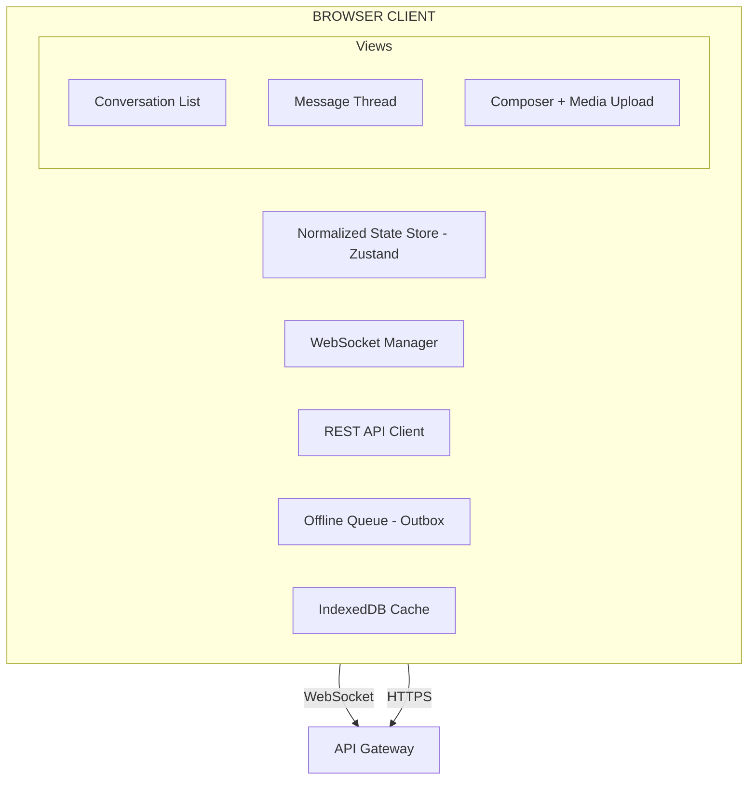

## Problem Statement

Real-time chat is the backbone of modern communication platforms — Facebook Messenger serves 1.3B monthly users, Slack handles 2.6B+ messages per week across enterprises, WhatsApp Web mirrors mobile conversations with sub-second delivery, Discord manages millions of concurrent voice and text channels, and Telegram Web pushes the boundary on media-rich messaging at scale.

This design focuses on the **front-end architecture** of a web-based chat application. The scope boundary is critical: we are not designing backend message routing, Kafka partitioning, or database sharding. We are designing the client system that manages WebSocket connections, renders conversation threads performantly, handles offline scenarios gracefully, and delivers a responsive experience across network conditions.

Chat differs fundamentally from a notification feed because:

1. **Bidirectional real-time** — Messages flow both directions with sub-second expectations, unlike feeds that poll or receive server pushes
2. **Ordering guarantees matter** — A conversation is incoherent if messages render out of order; a feed tolerates reordering
3. **State is collaborative** — Typing indicators, presence, and read receipts require coordination between multiple participants in real-time
4. **Persistent connection** — A single long-lived WebSocket connection multiplexes all conversations, unlike REST-based feed fetching
5. **Offline resilience** — Users expect to compose and "send" messages offline, with automatic delivery on reconnection

The architectural challenge is managing the intersection of real-time data flow, optimistic UI updates, connection lifecycle, and performant rendering of potentially infinite message histories.

---

## Requirements Exploration

### Functional Requirements

1. **1:1 direct messaging** — Send and receive text messages between two users with delivery confirmation
2. **Group conversations** — Support groups of 2–1000+ participants with fan-out message delivery
3. **Real-time message delivery** — Messages appear for recipients within 300ms of send on stable connections
4. **Typing indicators** — Show "Alice is typing..." with debounce and auto-timeout after 5s of inactivity
5. **Read receipts** — Track per-message read status; show "Read by 3" in groups, exact reader in 1:1
6. **Presence indicators** — Online/away/offline status with staleness detection
7. **Media sharing** — Upload and display images, videos, files with progress indication and thumbnail preview
8. **Message reactions** — Emoji reactions with aggregation (👍 3, ❤️ 2)
9. **Message threading** — Reply-to with quoted context, thread view for focused discussions
10. **Conversation search** — Full-text search across message history with highlighted results
11. **Message history** — Infinite scroll through conversation history with cursor-based pagination
12. **Offline message composition** — Queue messages when disconnected, deliver on reconnection with ordering guarantees

### Non-Functional Requirements

| Requirement                   | Target          | Rationale                                              |
| ----------------------------- | --------------- | ------------------------------------------------------ |
| Message delivery latency      | < 300ms (p95)   | Users perceive > 500ms as "laggy" in real-time chat    |
| Typing indicator latency      | < 500ms         | Must feel instantaneous to create presence illusion    |
| Time to Interactive           | < 2.5s          | Conversation list must render immediately on app load  |
| Offline queue capacity        | 100+ messages   | Users in subway/flight scenarios compose many messages |
| Client memory (1000 convos)   | < 150MB         | Mobile browsers and low-end devices must remain stable |
| WebSocket reconnection        | < 3s (p90)      | Connection drops are invisible if recovery is fast     |
| Bundle size (initial)         | < 200KB gzipped | Chat must load fast on mobile networks                 |
| Message rendering (1000 msgs) | 60fps scroll    | Virtualized list must never drop frames                |
| LCP                           | < 1.5s          | Conversation list is the LCP element                   |
| CLS                           | < 0.05          | No layout shift when messages load or media renders    |

---

## Capacity Estimation & Constraints

**Assumptions for a large-scale chat application (front-end perspective):**

| Metric                             | Value             | Front-End Impact                            |
| ---------------------------------- | ----------------- | ------------------------------------------- |
| DAU                                | 50M               | N/A directly, but informs API design        |
| Messages per user per day          | 40                | ~40 incoming WebSocket frames per session   |
| Active conversations per user      | 15–30             | All must have real-time listeners active    |
| Total conversations per user       | 200–1000+         | Conversation list must virtualize           |
| Average message payload            | 500 bytes (text)  | Negligible per-message, but accumulates     |
| Media message payload              | 2–10MB (original) | Thumbnail strategy critical                 |
| WebSocket frames/min (active chat) | 5–20              | Includes typing, presence, receipts         |
| Concurrent WebSocket connections   | 1 multiplexed     | Single connection for all conversations     |
| Message history per conversation   | 10K–100K+         | Only 50–100 loaded in memory at any time    |
| Group size                         | 2–1000+           | Fan-out for typing/presence scales linearly |

**Client memory budget:**

```
Conversation metadata (1000 convos × 200B) = ~200KB
Active message windows (30 convos × 100 msgs × 500B) = ~1.5MB
Media thumbnails in DOM (50 visible × 50KB) = ~2.5MB
WebSocket buffers = ~50KB
Zustand/Redux state overhead = ~500KB
IndexedDB offline queue = disk, not RAM
─────────────────────────────────────────────────
Total working memory: ~5–10MB (well within budget)
```

The key constraint is not total memory but **rendering performance** — virtualizing a bidirectional message list while anchoring scroll position to the bottom is the primary technical challenge.

---

## Architecture / High-Level Design

### Rendering Strategy

Use **Client-Side Rendering (CSR)** for the authenticated chat experience because:

1. Chat is inherently interactive — every element responds to real-time updates
2. There is no SEO value in message content (private, authenticated)
3. The WebSocket connection must be established client-side regardless
4. Server-side rendering adds latency to an experience where TTI matters more than FCP

The app shell (conversation list sidebar + message area) renders immediately from cached state, then hydrates with fresh data from the WebSocket connection and REST APIs.

### Navigation Model

**Single-Page Application** with client-side routing:

```
/chat                    → Conversation list (no conversation selected)
/chat/:conversationId    → Active conversation thread
/chat/:conversationId/info → Conversation details/settings
/chat/new                → New message composer
```

Use `pushState` navigation to avoid full reloads. The WebSocket connection persists across route transitions because it lives outside the component tree in a singleton service.

### System Architecture Diagram



### Component Architecture

```
<ChatApp>
├── <ConversationList>
│   ├── <SearchBar />
│   ├── <ConversationItem />  (virtualized, 1000+)
│   │   ├── <Avatar /> + <PresenceIndicator />
│   │   ├── <LastMessage />
│   │   └── <UnreadBadge />
│   └── <ConversationListSkeleton />
├── <MessageThread>
│   ├── <MessageList />  (virtualized, bidirectional)
│   │   ├── <MessageBubble />
│   │   │   ├── <MessageContent /> (text/media/file)
│   │   │   ├── <MessageReactions />
│   │   │   ├── <MessageStatus /> (sent/delivered/read)
│   │   │   └── <ReplyPreview />
│   │   ├── <DateSeparator />
│   │   └── <SystemMessage />
│   ├── <TypingIndicator />
│   └── <ScrollToBottomFAB />
├── <Composer>
│   ├── <TextInput /> (contenteditable with mentions)
│   ├── <MediaAttachmentPreview />
│   ├── <EmojiPicker />
│   └── <SendButton />
└── <ConnectionStatus />  (offline banner)
```

### State Management Strategy

Use **Zustand** with a **normalized entity store** because:

1. Messages are referenced by multiple views (conversation list snippet, thread, search results)
2. Optimistic updates require matching pending messages to server-confirmed messages by idempotency key
3. Real-time updates arrive out of band and must merge cleanly without re-renders of unaffected components
4. Zustand's selector-based subscriptions prevent cascade re-renders when a single message updates

```typescript
// Normalized store shape (conceptual)
interface ChatStore {
  // Entities (normalized by ID)
  conversations: Record<string, Conversation>;
  messages: Record<string, Message>;
  participants: Record<string, Participant>;

  // Real-time state
  presence: Record<string, PresenceState>;
  typing: Record<string, TypingState[]>;

  // UI state
  activeConversationId: string | null;
  messageWindows: Record<string, MessageWindow>;

  // Offline
  outbox: OutboxMessage[];
}
```

---

## Data Model / Entities

```typescript
// Core message entity
interface Message {
  id: string; // Server-assigned unique ID
  clientId: string; // Client-generated idempotency key (UUIDv4)
  conversationId: string; // Parent conversation
  senderId: string; // Author user ID
  content: MessageContent; // Text, media, or system message
  replyTo: string | null; // Parent message ID for threading
  reactions: ReactionSummary[]; // Aggregated reactions
  status: MessageStatus; // Client-side delivery status
  serverTimestamp: number; // Server-assigned ordering timestamp (ms)
  clientTimestamp: number; // Client-generated timestamp (for optimistic display)
  editedAt: number | null; // Last edit timestamp
  deletedAt: number | null; // Soft-delete timestamp
}

type MessageContent =
  | { type: "text"; text: string; mentions: Mention[] }
  | { type: "media"; attachments: MediaAttachment[] }
  | { type: "file"; file: FileAttachment }
  | { type: "system"; event: SystemEvent };

type MessageStatus = "pending" | "sent" | "delivered" | "read" | "failed";

interface MediaAttachment {
  id: string;
  url: string; // CDN URL for full resolution
  thumbnailUrl: string; // CDN URL for thumbnail (< 50KB)
  mimeType: string;
  width: number;
  height: number;
  sizeBytes: number;
  blurhash: string; // Placeholder while loading
}

interface FileAttachment {
  id: string;
  url: string;
  filename: string;
  mimeType: string;
  sizeBytes: number;
}

// Conversation entity
interface Conversation {
  id: string;
  type: "direct" | "group";
  name: string | null; // null for 1:1 (derived from participant)
  avatarUrl: string | null;
  participantIds: string[]; // User IDs in this conversation
  lastMessage: MessagePreview | null; // Denormalized for list rendering
  unreadCount: number;
  mutedUntil: number | null; // Mute expiry timestamp
  pinnedAt: number | null; // Pin ordering
  createdAt: number;
  updatedAt: number; // Last activity timestamp (for sort)
}

interface MessagePreview {
  id: string;
  senderId: string;
  text: string; // Truncated to 100 chars
  timestamp: number;
  type: MessageContent["type"];
}

// Participant entity
interface Participant {
  id: string;
  displayName: string;
  avatarUrl: string | null;
  username: string;
}

// Real-time state types
interface PresenceState {
  userId: string;
  status: "online" | "away" | "offline";
  lastSeen: number; // Timestamp of last activity
  device: "web" | "mobile" | "desktop";
}

interface TypingState {
  userId: string;
  conversationId: string;
  startedAt: number; // For timeout calculation
}

interface ReadReceipt {
  userId: string;
  conversationId: string;
  lastReadMessageId: string; // Watermark: all messages up to this ID are read
  timestamp: number;
}

interface ReactionSummary {
  emoji: string;
  count: number;
  includesMe: boolean;
  recentUserIds: string[]; // Last 3 reactors for tooltip
}

// Offline queue
interface OutboxMessage {
  clientId: string; // Matches Message.clientId for reconciliation
  conversationId: string;
  content: MessageContent;
  replyTo: string | null;
  createdAt: number;
  retryCount: number;
  lastRetryAt: number | null;
  status: "queued" | "sending" | "failed";
}

// Normalized store window for message pagination
interface MessageWindow {
  conversationId: string;
  messageIds: string[]; // Ordered by serverTimestamp
  hasOlder: boolean; // More history available above
  hasNewer: boolean; // More messages available below (when scrolled up)
  oldestCursor: string | null; // Pagination cursor for loading older
  newestCursor: string | null; // Pagination cursor for loading newer
  isLoadingOlder: boolean;
  isLoadingNewer: boolean;
}

// Mention in message
interface Mention {
  userId: string;
  offset: number; // Character offset in text
  length: number; // Length of mention text
}

type SystemEvent =
  | { kind: "participant_added"; userId: string; addedBy: string }
  | { kind: "participant_removed"; userId: string; removedBy: string }
  | { kind: "conversation_renamed"; name: string; renamedBy: string }
  | { kind: "avatar_changed"; changedBy: string };
```

---

## Interface Definition (API)

### REST API — History & Search

```typescript
// GET /api/conversations?cursor=<string>&limit=20
// Returns paginated conversation list sorted by last activity
interface ConversationListResponse {
  conversations: Conversation[];
  nextCursor: string | null;
  hasMore: boolean;
}

// GET /api/conversations/:id/messages?cursor=<string>&limit=50&direction=older|newer
// Cursor-based pagination for message history
interface MessageHistoryResponse {
  messages: Message[];
  nextCursor: string | null;
  hasMore: boolean;
}

// POST /api/conversations/:id/messages
// Fallback REST endpoint for message sending (when WebSocket unavailable)
interface SendMessageRequest {
  clientId: string; // Idempotency key — server deduplicates by this
  content: MessageContent;
  replyTo: string | null;
}

interface SendMessageResponse {
  message: Message; // Server-assigned ID and timestamp
}

// POST /api/media/upload
// Multipart form upload with progress
interface MediaUploadResponse {
  id: string;
  url: string;
  thumbnailUrl: string;
  blurhash: string;
  width: number;
  height: number;
  sizeBytes: number;
}

// GET /api/conversations/:id/search?q=<string>&cursor=<string>&limit=20
interface SearchResponse {
  results: SearchResult[];
  nextCursor: string | null;
  hasMore: boolean;
}

interface SearchResult {
  message: Message;
  highlights: { field: string; snippet: string }[];
}
```

### WebSocket Protocol

Single multiplexed WebSocket connection handles all real-time events. Every frame has a discriminated `type` field:

```typescript
// Client → Server frames
type ClientFrame =
  | { type: "send_message"; payload: SendMessagePayload }
  | { type: "typing_start"; payload: { conversationId: string } }
  | { type: "typing_stop"; payload: { conversationId: string } }
  | {
      type: "mark_read";
      payload: { conversationId: string; messageId: string };
    }
  | { type: "presence_update"; payload: { status: "online" | "away" } }
  | { type: "ping"; payload: { timestamp: number } }
  | { type: "subscribe"; payload: { conversationIds: string[] } }
  | { type: "unsubscribe"; payload: { conversationIds: string[] } };

interface SendMessagePayload {
  clientId: string; // Idempotency key
  conversationId: string;
  content: MessageContent;
  replyTo: string | null;
}

// Server → Client frames
type ServerFrame =
  | { type: "message_new"; payload: Message }
  | { type: "message_updated"; payload: Message }
  | {
      type: "message_deleted";
      payload: { conversationId: string; messageId: string };
    }
  | { type: "message_ack"; payload: { clientId: string; message: Message } }
  | {
      type: "typing";
      payload: { conversationId: string; userId: string; active: boolean };
    }
  | { type: "presence"; payload: PresenceState }
  | { type: "read_receipt"; payload: ReadReceipt }
  | {
      type: "reaction";
      payload: { messageId: string; reactions: ReactionSummary[] };
    }
  | {
      type: "conversation_updated";
      payload: Partial<Conversation> & { id: string };
    }
  | { type: "pong"; payload: { timestamp: number; serverTime: number } }
  | { type: "error"; payload: { code: string; message: string; ref?: string } };
```

<Callout>
  **Idempotency is non-negotiable.** Every `send_message` frame includes a
  `clientId` (UUIDv4) generated client-side. The server responds with
  `message_ack` containing both the `clientId` and the server-assigned
  `Message`. If the client retransmits after a timeout (e.g., no ACK within 5s),
  the server deduplicates by `clientId` and returns the same `Message`. This
  prevents duplicate messages on reconnection.
</Callout>

### WebSocket Connection Lifecycle

```typescript
class WebSocketManager {
  private ws: WebSocket | null = null;
  private reconnectAttempt = 0;
  private heartbeatInterval: ReturnType<typeof setInterval> | null = null;
  private pendingAcks: Map<
    string,
    { resolve: Function; timeout: ReturnType<typeof setTimeout> }
  > = new Map();

  connect(token: string): void {
    const url = `wss://chat.example.com/ws?token=${token}`;
    this.ws = new WebSocket(url);

    this.ws.onopen = () => {
      this.reconnectAttempt = 0;
      this.startHeartbeat();
      this.resubscribeConversations();
      this.flushOutbox();
    };

    this.ws.onmessage = (event) => {
      const frame: ServerFrame = JSON.parse(event.data);
      this.routeFrame(frame);
    };

    this.ws.onclose = (event) => {
      this.stopHeartbeat();
      if (!event.wasClean) {
        this.scheduleReconnect();
      }
    };
  }

  private scheduleReconnect(): void {
    const baseDelay = Math.min(
      1000 * Math.pow(2, this.reconnectAttempt),
      30000,
    );
    const jitter = Math.random() * baseDelay * 0.3;
    const delay = baseDelay + jitter;
    this.reconnectAttempt++;

    setTimeout(() => this.connect(this.getToken()), delay);
  }

  private startHeartbeat(): void {
    this.heartbeatInterval = setInterval(() => {
      this.send({ type: "ping", payload: { timestamp: Date.now() } });
    }, 25000); // Every 25s (under typical 30s proxy timeouts)
  }

  send(frame: ClientFrame): void {
    if (this.ws?.readyState === WebSocket.OPEN) {
      this.ws.send(JSON.stringify(frame));
    } else {
      // Queue for delivery on reconnection
      this.queueOffline(frame);
    }
  }
}
```

---

## Caching Strategy

### Multi-Layer Cache Architecture

```
┌─────────────────────────────────────────────────┐
│  Layer 1: In-Memory (Zustand normalized store)  │
│  • Active conversation messages (last 100 each) │
│  • All conversation metadata                     │
│  • Presence & typing state (ephemeral)          │
│  • TTL: session lifetime                         │
├─────────────────────────────────────────────────┤
│  Layer 2: IndexedDB (persistent client cache)   │
│  • Full message history (disk-backed)           │
│  • Conversation list with last messages         │
│  • Offline outbox queue                          │
│  • Media blob cache (thumbnails)                │
│  • TTL: 30 days, LRU eviction at 500MB         │
├─────────────────────────────────────────────────┤
│  Layer 3: CDN (media assets)                    │
│  • Full-resolution images/videos                │
│  • File attachments                              │
│  • Cache-Control: immutable (content-addressed) │
└─────────────────────────────────────────────────┘
```

### In-Memory Message Window Strategy

Only keep the **active viewport** of messages in the Zustand store per conversation. This prevents memory exhaustion with 1000+ conversations:

```typescript
const MESSAGE_WINDOW_SIZE = 100; // Messages kept in memory per conversation

function loadMessagesForConversation(conversationId: string): void {
  // 1. Check in-memory store first
  const window = store.getState().messageWindows[conversationId];
  if (window && window.messageIds.length > 0) return;

  // 2. Check IndexedDB for cached messages
  const cached = await messageDb.getRecentMessages(
    conversationId,
    MESSAGE_WINDOW_SIZE,
  );
  if (cached.length > 0) {
    store.getState().hydrateMessages(conversationId, cached);
    return;
  }

  // 3. Fetch from server
  const response = await api.getMessageHistory(conversationId, { limit: 50 });
  store.getState().hydrateMessages(conversationId, response.messages);
  messageDb.cacheMessages(conversationId, response.messages);
}
```

### Conversation List Cache

The conversation list is the first thing users see. Cache it aggressively:

1. **On app load**: Render from IndexedDB cache immediately (stale-while-revalidate)
2. **Revalidate**: Fetch fresh list from REST API, merge updates
3. **Real-time updates**: WebSocket `conversation_updated` frames patch the list incrementally

```typescript
async function initializeConversationList(): Promise<void> {
  // Render cached list immediately (< 100ms)
  const cached = await conversationDb.getAllConversations();
  store.getState().setConversations(cached);

  // Fetch fresh data in background
  const fresh = await api.getConversations({ limit: 50 });
  store.getState().mergeConversations(fresh.conversations);
  conversationDb.upsertConversations(fresh.conversations);
}
```

### Offline Queue (IndexedDB)

Messages composed offline are stored in IndexedDB with full outbox metadata:

```typescript
const outboxStore = {
  async enqueue(message: OutboxMessage): Promise<void> {
    await db.put("outbox", message);
  },

  async dequeue(clientId: string): Promise<void> {
    await db.delete("outbox", clientId);
  },

  async getAll(): Promise<OutboxMessage[]> {
    return db.getAllFromIndex("outbox", "by-created-at");
  },

  async markFailed(clientId: string): Promise<void> {
    const msg = await db.get("outbox", clientId);
    if (msg) {
      msg.status = "failed";
      msg.retryCount++;
      msg.lastRetryAt = Date.now();
      await db.put("outbox", msg);
    }
  },
};
```

<Callout>
  **Cache coherence on reconnection**: When the WebSocket reconnects after a
  disconnection, the client sends a `subscribe` frame with the timestamp of the
  last received message. The server replays missed messages since that
  timestamp. This eliminates the need for full cache invalidation — the client
  simply appends missed messages to its local store.
</Callout>

---

## Rendering & Performance Deep Dive

### Bidirectional Virtualized Message List

The message list is the hardest rendering challenge in a chat application because it must:

1. **Anchor to bottom** — New messages append at the bottom, scroll stays pinned
2. **Load older on scroll up** — Fetch history pages when user scrolls to top
3. **Load newer on scroll down** — When user has scrolled up and new messages arrive, show "N new messages" indicator
4. **Variable height rows** — Messages contain text, images, reactions of varying heights
5. **Maintain scroll position** — When older messages prepend, the viewport must not jump

```typescript
// Bidirectional virtualized list implementation strategy
interface VirtualizedMessageListProps {
  messageIds: string[];
  hasOlder: boolean;
  hasNewer: boolean;
  isAtBottom: boolean;
  onLoadOlder: () => void;
  onLoadNewer: () => void;
}

function VirtualizedMessageList({
  messageIds,
  hasOlder,
  hasNewer,
  isAtBottom,
  onLoadOlder,
  onLoadNewer,
}: VirtualizedMessageListProps) {
  const listRef = useRef<VirtualizerHandle>(null);
  const [scrollAnchor, setScrollAnchor] = useState<'bottom' | 'position'>('bottom');

  // Pin to bottom when new messages arrive and user hasn't scrolled up
  useEffect(() => {
    if (scrollAnchor === 'bottom' && listRef.current) {
      listRef.current.scrollToEnd({ behavior: 'instant' });
    }
  }, [messageIds.length, scrollAnchor]);

  // Prepend scroll position maintenance
  const prevMessageCount = useRef(messageIds.length);
  useLayoutEffect(() => {
    if (messageIds.length > prevMessageCount.current && scrollAnchor === 'position') {
      // Messages were prepended (loaded older) — maintain viewport position
      const addedCount = messageIds.length - prevMessageCount.current;
      listRef.current?.adjustScrollBy(addedCount);
    }
    prevMessageCount.current = messageIds.length;
  }, [messageIds.length]);

  return (
    <Virtualizer
      ref={listRef}
      count={messageIds.length}
      estimateSize={() => 72} // Average message height estimate
      overscan={10}
      onScrollTopReached={hasOlder ? onLoadOlder : undefined}
      onScrollBottomReached={hasNewer ? onLoadNewer : undefined}
      onScrollAwayFromBottom={() => setScrollAnchor('position')}
      onScrollToBottom={() => setScrollAnchor('bottom')}
    >
      {(index) => <MessageBubble messageId={messageIds[index]} />}
    </Virtualizer>
  );
}
```

### Image and Media Optimization

```typescript
// Progressive image loading for chat media
function ChatImage({ attachment }: { attachment: MediaAttachment }) {
  const [loaded, setLoaded] = useState(false);

  // Calculate aspect ratio container to prevent CLS
  const aspectRatio = attachment.width / attachment.height;

  return (
    <div
      className="relative overflow-hidden rounded-lg"
      style={{ aspectRatio, maxWidth: Math.min(attachment.width, 400) }}
    >
      {/* Blurhash placeholder — renders instantly */}
      {!loaded && <BlurhashCanvas hash={attachment.blurhash} className="absolute inset-0" />}

      {/* Thumbnail (< 50KB, loads fast) */}
       setLoaded(true)}
        className={cn('w-full h-full object-cover', !loaded && 'opacity-0')}
      />
    </div>
  );
}
```

### Critical Rendering Path

```
Time    0ms    200ms    500ms    1000ms    1500ms    2000ms
         │       │        │        │         │         │
         ├─ HTML shell (cached service worker)
         │       ├─ JS bundle (< 200KB gzip, code-split)
         │       │        ├─ IndexedDB conversation cache read
         │       │        │   ├─ Render conversation list (LCP)
         │       │        │        ├─ WebSocket connect
         │       │        │        │    ├─ Fresh data merge
         │       │        │        │         ├─ Active conversation messages load
         │       │        │        │         │    ├─ Full interactive (TTI)
```

### Bundle Strategy

| Chunk               | Contents                                       | Size (gzip) | Load                 |
| ------------------- | ---------------------------------------------- | ----------- | -------------------- |
| `main`              | App shell, routing, Zustand, WebSocket manager | 80KB        | Immediate            |
| `conversation-list` | ConversationItem, Avatar, PresenceIndicator    | 25KB        | Immediate            |
| `message-thread`    | Virtualizer, MessageBubble, MessageContent     | 45KB        | On conversation open |
| `composer`          | TextInput, EmojiPicker, file handling          | 35KB        | On conversation open |
| `media`             | Image viewer, video player, lightbox           | 40KB        | On media interaction |
| `search`            | Search UI, highlight renderer                  | 20KB        | On search open       |

### Core Web Vitals Targets

| Metric | Target  | Strategy                                                                                |
| ------ | ------- | --------------------------------------------------------------------------------------- |
| LCP    | < 1.5s  | Conversation list from IndexedDB cache, no network dependency                           |
| FID    | < 50ms  | No long tasks in main thread; WebSocket parsing is O(1) per frame                       |
| CLS    | < 0.05  | Pre-sized media containers via aspect ratio + blurhash; no layout shift on message load |
| INP    | < 100ms | Optimistic message send (no network wait for UI feedback)                               |

---

## Security Deep Dive

### Threat Model

| Threat                  | Vector                                                                  | Impact                                           | Mitigation                                                                                                  |
| ----------------------- | ----------------------------------------------------------------------- | ------------------------------------------------ | ----------------------------------------------------------------------------------------------------------- |
| XSS via message content | Malicious user sends `<script>` or event handler in message text        | Execute arbitrary JS in all recipients' browsers | Strict output encoding; render text via `textContent`, never `innerHTML`; CSP blocks inline scripts         |
| Media upload abuse      | Upload malicious SVG/HTML disguised as image                            | XSS execution via SVG `<foreignObject>`          | Validate MIME type server-side; serve media from separate origin (CDN); `Content-Type: image/*` enforcement |
| WebSocket hijacking     | CSRF or token theft allows attacker to impersonate user's WS connection | Read all messages, send as user                  | Short-lived auth token in WS URL (not cookie); verify token on each connection; bind to session             |
| Token exfiltration      | XSS exfiltrates auth token from memory/storage                          | Full account takeover                            | Store tokens in httpOnly cookie for REST; WS token is short-lived (5min), refreshed via REST                |
| Message spoofing        | Attacker crafts WebSocket frames to appear as another user              | Social engineering, impersonation                | Server validates sender identity on every frame; client never trusts `senderId` from WS directly            |
| Denial of Service       | Flood client with messages (spam group)                                 | UI freeze, memory exhaustion                     | Rate limiting at API gateway; client-side message window cap; virtualization prevents DOM explosion         |

### Message Content Sanitization

```typescript
// NEVER use dangerouslySetInnerHTML for message content
function MessageText({ text, mentions }: { text: string; mentions: Mention[] }) {
  // Build safe React elements from plain text + mentions
  const segments = buildSegments(text, mentions);

  return (
    <p className="message-text whitespace-pre-wrap break-words">
      {segments.map((segment, i) => {
        if (segment.type === 'text') {
          // React automatically escapes text content — XSS-safe
          return <span key={i}>{segment.value}</span>;
        }
        if (segment.type === 'mention') {
          return (
            <span key={i} className="text-blue-500 font-medium">
              @{segment.displayName}
            </span>
          );
        }
        if (segment.type === 'link') {
          // Only allow http/https protocols
          const url = sanitizeUrl(segment.value);
          return url ? (
            <a key={i} href={url} target="_blank" rel="noopener noreferrer nofollow">
              {segment.value}
            </a>
          ) : (
            <span key={i}>{segment.value}</span>
          );
        }
        return null;
      })}
    </p>
  );
}

function sanitizeUrl(url: string): string | null {
  try {
    const parsed = new URL(url);
    if (parsed.protocol === 'http:' || parsed.protocol === 'https:') {
      return parsed.href;
    }
    return null; // Block javascript:, data:, etc.
  } catch {
    return null;
  }
}
```

### Content Security Policy

```
Content-Security-Policy:
  default-src 'self';
  script-src 'self';
  style-src 'self' 'unsafe-inline';
  img-src 'self' https://cdn.chat.example.com;
  media-src 'self' https://cdn.chat.example.com;
  connect-src 'self' wss://chat.example.com https://api.chat.example.com;
  frame-src 'none';
  object-src 'none';
  base-uri 'self';
```

### Authentication Token Strategy

```typescript
// Token refresh flow for WebSocket
class AuthTokenManager {
  private accessToken: string | null = null;
  private refreshTimer: ReturnType<typeof setTimeout> | null = null;

  async getWsToken(): Promise<string> {
    // WS tokens are short-lived (5 min) to limit exposure if intercepted
    if (this.accessToken && !this.isExpired(this.accessToken)) {
      return this.accessToken;
    }

    // Refresh via httpOnly cookie (CSRF-protected REST call)
    const response = await fetch("/api/auth/ws-token", {
      method: "POST",
      credentials: "include", // Sends httpOnly refresh cookie
      headers: { "X-CSRF-Token": getCsrfToken() },
    });

    const { token, expiresIn } = await response.json();
    this.accessToken = token;

    // Schedule refresh at 80% of TTL
    this.refreshTimer = setTimeout(
      () => this.getWsToken(),
      expiresIn * 0.8 * 1000,
    );

    return token;
  }
}
```

---

## Scalability & Reliability

### Message Ordering Guarantees

Out-of-order message delivery is inevitable in distributed systems. The client must handle it gracefully:

```typescript
// Server assigns monotonically increasing sequence IDs per conversation
// Client uses these for ordering, NOT arrival order

function insertMessageInOrder(
  window: MessageWindow,
  messages: Record<string, Message>,
  newMessage: Message,
): string[] {
  const ids = [...window.messageIds];

  // Binary search for correct insertion position by serverTimestamp
  let low = 0;
  let high = ids.length;

  while (low < high) {
    const mid = (low + high) >>> 1;
    const existing = messages[ids[mid]];
    if (existing.serverTimestamp < newMessage.serverTimestamp) {
      low = mid + 1;
    } else {
      high = mid;
    }
  }

  // Deduplicate: if message with same ID exists, replace (update case)
  const existingIndex = ids.indexOf(newMessage.id);
  if (existingIndex !== -1) {
    ids[existingIndex] = newMessage.id; // Same ID, potentially updated content
    return ids;
  }

  ids.splice(low, 0, newMessage.id);
  return ids;
}
```

<Callout>
  **Why not Lamport timestamps?** Server-assigned sequence IDs are simpler for
  the client because they provide total ordering within a conversation without
  requiring the client to implement vector clock merging. The server is the
  single authority for message order — the client's job is to display that order
  correctly, even when messages arrive out of sequence over WebSocket.
</Callout>

### Offline Queue with Outbox Pattern

```typescript
class OfflineOutbox {
  private processing = false;

  async enqueue(
    message: Omit<OutboxMessage, "retryCount" | "lastRetryAt" | "status">,
  ): Promise<void> {
    const outboxMsg: OutboxMessage = {
      ...message,
      retryCount: 0,
      lastRetryAt: null,
      status: "queued",
    };

    // Persist to IndexedDB immediately
    await outboxStore.enqueue(outboxMsg);

    // Add optimistic message to in-memory store
    store.getState().addOptimisticMessage(outboxMsg);

    // Attempt send if online
    if (navigator.onLine && wsManager.isConnected()) {
      this.processQueue();
    }
  }

  async processQueue(): Promise<void> {
    if (this.processing) return;
    this.processing = true;

    try {
      const pending = await outboxStore.getAll();

      for (const msg of pending) {
        if (msg.retryCount >= 5) {
          // Mark as permanently failed after 5 retries
          await outboxStore.markFailed(msg.clientId);
          store.getState().markMessageFailed(msg.clientId);
          continue;
        }

        try {
          wsManager.send({
            type: "send_message",
            payload: {
              clientId: msg.clientId,
              conversationId: msg.conversationId,
              content: msg.content,
              replyTo: msg.replyTo,
            },
          });

          // Wait for ACK with timeout
          await this.waitForAck(msg.clientId, 5000);
          await outboxStore.dequeue(msg.clientId);
        } catch {
          msg.retryCount++;
          msg.lastRetryAt = Date.now();
          await outboxStore.enqueue(msg);
        }
      }
    } finally {
      this.processing = false;
    }
  }

  private waitForAck(clientId: string, timeoutMs: number): Promise<Message> {
    return new Promise((resolve, reject) => {
      const timeout = setTimeout(() => {
        unsubscribe();
        reject(new Error("ACK timeout"));
      }, timeoutMs);

      const unsubscribe = store.subscribe(
        (state) => state.messages,
        (messages) => {
          // Find message where clientId matches and has server-assigned ID
          const acked = Object.values(messages).find(
            (m) => m.clientId === clientId && m.status !== "pending",
          );
          if (acked) {
            clearTimeout(timeout);
            unsubscribe();
            resolve(acked);
          }
        },
      );
    });
  }
}
```

### WebSocket Reconnection Strategy

```typescript
// Exponential backoff with jitter — prevents thundering herd on server recovery
const RECONNECT_CONFIG = {
  baseDelay: 1000, // 1s initial delay
  maxDelay: 30000, // 30s cap
  jitterFactor: 0.3, // ±30% randomization
  maxAttempts: Infinity, // Never stop trying (user expectation)
};

function calculateReconnectDelay(attempt: number): number {
  const exponential = Math.min(
    RECONNECT_CONFIG.baseDelay * Math.pow(2, attempt),
    RECONNECT_CONFIG.maxDelay,
  );
  const jitter =
    exponential * RECONNECT_CONFIG.jitterFactor * (Math.random() * 2 - 1);
  return Math.max(0, exponential + jitter);
}

// On reconnection: replay missed messages
async function onReconnect(): Promise<void> {
  const lastReceived = store.getState().lastServerTimestamp;

  // Server replays all messages since lastReceived for subscribed conversations
  wsManager.send({
    type: "subscribe",
    payload: {
      conversationIds: store.getState().activeConversationIds,
      since: lastReceived, // Extension: server uses this for replay
    },
  });

  // Flush offline outbox
  offlineOutbox.processQueue();
}
```

### Handling Large Groups (1000+ Members)

```typescript
// Problem: typing indicators for 1000 members would flood the client
// Solution: server-side fan-out limiting

// Client subscribes to typing for active conversation only
// Server limits typing indicator broadcasts to first 5 concurrent typers
// Presence is batched — server sends deltas every 5s, not per-user

interface GroupPresenceBatch {
  conversationId: string;
  online: string[]; // User IDs currently online (truncated to 50)
  onlineCount: number; // Total count for "47 online" display
  recentlyActive: string[]; // Last 10 users who sent messages
}

// Client renders: "Alice, Bob, and 3 others are typing..."
function formatTypingIndicator(
  typing: TypingState[],
  participants: Record<string, Participant>,
): string {
  const names = typing
    .slice(0, 3)
    .map((t) => participants[t.userId]?.displayName ?? "Someone");

  if (typing.length === 1) return `${names[0]} is typing...`;
  if (typing.length === 2) return `${names[0]} and ${names[1]} are typing...`;
  if (typing.length === 3)
    return `${names[0]}, ${names[1]}, and ${names[2]} are typing...`;
  return `${names[0]}, ${names[1]}, and ${typing.length - 2} others are typing...`;
}
```

---

## Accessibility Deep Dive

### Live Regions for New Messages

New messages must be announced to screen readers without stealing focus from the composer:

```typescript
function MessageList({ messages }: { messages: Message[] }) {
  const lastAnnouncedRef = useRef<string | null>(null);

  return (
    <>
      {/* Polite live region — announces new messages without interrupting */}
      <div
        role="log"
        aria-live="polite"
        aria-atomic={false}
        aria-relevant="additions"
        className="sr-only"
      >
        {messages.slice(-1).map((msg) => {
          if (msg.id === lastAnnouncedRef.current) return null;
          lastAnnouncedRef.current = msg.id;
          return (
            <p key={msg.id}>
              {getParticipantName(msg.senderId)} says: {getMessageTextContent(msg.content)}
            </p>
          );
        })}
      </div>

      {/* Visual message list */}
      <div role="list" aria-label="Messages">
        {messages.map((msg) => (
          <MessageBubble key={msg.id} message={msg} />
        ))}
      </div>
    </>
  );
}
```

### Keyboard Navigation

| Key               | Context           | Action                                        |
| ----------------- | ----------------- | --------------------------------------------- |
| `↑` / `↓`         | Conversation list | Navigate between conversations                |
| `Enter`           | Conversation list | Open selected conversation                    |
| `Escape`          | Message thread    | Return focus to conversation list             |
| `Tab`             | Composer          | Move between input, emoji picker, send button |
| `Enter`           | Composer          | Send message                                  |
| `Shift+Enter`     | Composer          | New line in message                           |
| `Alt+↑` / `Alt+↓` | Message thread    | Navigate between messages for context menu    |
| `Ctrl+K`          | Global            | Open conversation search                      |

```typescript
function ConversationList({ conversations }: { conversations: Conversation[] }) {
  const [focusIndex, setFocusIndex] = useState(0);
  const itemRefs = useRef<(HTMLElement | null)[]>([]);

  const handleKeyDown = (e: KeyboardEvent) => {
    switch (e.key) {
      case 'ArrowDown':
        e.preventDefault();
        setFocusIndex((i) => Math.min(i + 1, conversations.length - 1));
        break;
      case 'ArrowUp':
        e.preventDefault();
        setFocusIndex((i) => Math.max(i - 1, 0));
        break;
      case 'Enter':
        e.preventDefault();
        openConversation(conversations[focusIndex].id);
        break;
    }
  };

  useEffect(() => {
    itemRefs.current[focusIndex]?.focus();
  }, [focusIndex]);

  return (
    <nav
      role="listbox"
      aria-label="Conversations"
      onKeyDown={handleKeyDown}
    >
      {conversations.map((convo, i) => (
        <div
          key={convo.id}
          ref={(el) => { itemRefs.current[i] = el; }}
          role="option"
          aria-selected={i === focusIndex}
          tabIndex={i === focusIndex ? 0 : -1}
        >
          <ConversationItem conversation={convo} />
        </div>
      ))}
    </nav>
  );
}
```

### Message Status for Screen Readers

```typescript
function MessageStatus({ status }: { status: MessageStatus }) {
  const labels: Record<MessageStatus, string> = {
    pending: 'Sending',
    sent: 'Sent',
    delivered: 'Delivered',
    read: 'Read',
    failed: 'Failed to send',
  };

  return (
    <span className="message-status" aria-label={labels[status]}>
      {status === 'pending' && <ClockIcon size={12} aria-hidden />}
      {status === 'sent' && <CheckIcon size={12} aria-hidden />}
      {status === 'delivered' && <CheckCheckIcon size={12} aria-hidden />}
      {status === 'read' && <CheckCheckIcon size={12} className="text-blue-500" aria-hidden />}
      {status === 'failed' && <AlertCircleIcon size={12} className="text-red-500" aria-hidden />}
      <span className="sr-only">{labels[status]}</span>
    </span>
  );
}
```

### Focus Management

```typescript
// When a new conversation opens, focus moves to the composer
// When a message fails, focus moves to the retry button
// When search opens, focus moves to the search input

function useConversationFocus(activeConversationId: string | null) {
  const composerRef = useRef<HTMLTextAreaElement>(null);

  useEffect(() => {
    if (activeConversationId) {
      // Small delay to allow render to complete
      requestAnimationFrame(() => {
        composerRef.current?.focus();
      });
    }
  }, [activeConversationId]);

  return composerRef;
}
```

---

## Monitoring & Observability

### Key Metrics Dashboard

| Metric                      | Measurement                                     | Alert Threshold | Collection Method             |
| --------------------------- | ----------------------------------------------- | --------------- | ----------------------------- |
| Message delivery latency    | Time from send click to `message_ack` receipt   | p95 > 500ms     | Client-side performance mark  |
| WebSocket connection health | % time connected vs total session time          | < 95%           | Connection state tracking     |
| Reconnection frequency      | Reconnects per session                          | > 5 per hour    | WebSocket manager counter     |
| Message send failure rate   | Failed sends / total sends                      | > 2%            | Outbox failure tracking       |
| Typing indicator round-trip | Time from keystroke to remote indicator display | p95 > 800ms     | Synthetic monitoring          |
| LCP (conversation list)     | Largest Contentful Paint                        | > 2s            | web-vitals library            |
| INP (message send)          | Interaction to Next Paint                       | > 150ms         | web-vitals library            |
| Offline queue depth         | Messages waiting in outbox                      | > 50 sustained  | IndexedDB query               |
| Memory usage                | JS heap size during active session              | > 200MB         | `performance.memory`          |
| Frame drops                 | Dropped frames during message list scroll       | > 5% of frames  | `requestAnimationFrame` delta |

### Client-Side Telemetry Implementation

```typescript
class ChatMetrics {
  private deliveryTimers: Map<string, number> = new Map();

  // Track message delivery latency
  onMessageSend(clientId: string): void {
    this.deliveryTimers.set(clientId, performance.now());
  }

  onMessageAck(clientId: string): void {
    const sendTime = this.deliveryTimers.get(clientId);
    if (sendTime) {
      const latency = performance.now() - sendTime;
      this.deliveryTimers.delete(clientId);
      this.report("message_delivery_latency", latency);
    }
  }

  // Track WebSocket health
  onConnectionStateChange(
    state: "connected" | "disconnected" | "reconnecting",
  ): void {
    this.report("ws_connection_state", { state, timestamp: Date.now() });
  }

  // Track scroll performance
  onScrollFrame(frameTime: number): void {
    if (frameTime > 16.67) {
      // Dropped frame (below 60fps)
      this.report("scroll_frame_drop", { frameTime });
    }
  }

  private report(event: string, data: unknown): void {
    // Batch and send to analytics endpoint every 30s
    navigator.sendBeacon(
      "/api/metrics",
      JSON.stringify({ event, data, ts: Date.now() }),
    );
  }
}
```

### Error Tracking

```typescript
// Structured error reporting for chat-specific failures
type ChatError =
  | { kind: "ws_connection_failed"; attempt: number; code: number }
  | { kind: "message_send_failed"; clientId: string; reason: string }
  | {
      kind: "media_upload_failed";
      conversationId: string;
      size: number;
      mimeType: string;
    }
  | { kind: "message_parse_failed"; rawFrame: string }
  | { kind: "indexeddb_quota_exceeded"; usedBytes: number };

function reportChatError(error: ChatError): void {
  console.error("[Chat]", error.kind, error);
  metrics.report("chat_error", error);
}
```

---

## Trade-offs

| Decision                  | Option A                      | Option B                               | Choice                                 | Rationale                                                                                                                                                     |
| ------------------------- | ----------------------------- | -------------------------------------- | -------------------------------------- | ------------------------------------------------------------------------------------------------------------------------------------------------------------- |
| Real-time transport       | WebSocket                     | SSE (Server-Sent Events)               | WebSocket                              | Bidirectional — client sends typing/presence/messages without separate HTTP requests. SSE is receive-only, requiring parallel POST requests for sends.        |
| Message store shape       | Normalized (by ID)            | Denormalized (nested in conversations) | Normalized                             | Messages are referenced from conversation list (last message), search results, and thread view. Normalization prevents data duplication and update anomalies. |
| Message send strategy     | Optimistic (show immediately) | Pessimistic (wait for server ACK)      | Optimistic                             | Users expect instant feedback. Show message immediately with "pending" status, reconcile on ACK. Failure case (rare) shows retry affordance.                  |
| Scroll virtualization     | Fixed-height rows             | Variable-height with measurement       | Variable-height                        | Messages contain images, reactions, and replies of varying height. Fixed-height requires ugly truncation or wasted space.                                     |
| Offline storage           | localStorage                  | IndexedDB                              | IndexedDB                              | localStorage has 5–10MB limit and blocks the main thread on access. IndexedDB supports structured queries, large storage (GB+), and async access.             |
| Typing indicator approach | Per-keystroke broadcast       | Debounced with timeout                 | Debounced (300ms debounce, 5s timeout) | Per-keystroke floods the server and network. Debounced reduces traffic by 90%+ while maintaining responsive feel.                                             |
| Presence updates          | Real-time per-user            | Batched delta every 5s                 | Batched delta                          | For groups with 1000+ members, per-user presence updates would generate thousands of WebSocket frames per second. Batching reduces to one frame every 5s.     |
| Read receipt granularity  | Per-message                   | Watermark (last-read pointer)          | Watermark                              | Sending a read receipt for every message in a catch-up scroll would be excessive. A single watermark ("read up to message X") is compact and sufficient.      |

---

## What Great Looks Like

### Senior Engineer (Meets Bar)

- Designs the WebSocket connection with reconnection logic
- Implements a basic message list with pagination
- Handles optimistic sends with pending/sent/failed states
- Structures components cleanly (conversation list, message thread, composer)
- Implements typing indicators with debounce
- Uses a state management library (Redux/Zustand) with a reasonable schema
- Addresses basic XSS prevention in message rendering

### Staff Engineer (Exceeds Bar)

- Designs the **normalized entity store** with explanation of why denormalization causes update anomalies
- Implements **bidirectional virtualized scrolling** with scroll anchor maintenance
- Designs the **offline outbox pattern** with idempotency keys and conflict resolution
- Addresses **message ordering** — explains that arrival order ≠ display order and uses server sequence IDs
- Designs **multi-layer caching** (memory → IndexedDB → network) with cache coherence on reconnection
- Discusses **bundle splitting strategy** specific to chat (eager conversation list, lazy thread components)
- Identifies **group chat scalability challenges** and proposes server-side fan-out limiting for typing/presence
- Implements **accessibility live regions** for message announcements without focus theft

### Principal Engineer (Exceptional)

- Designs the **complete WebSocket protocol** with frame types, acknowledgment flow, and error semantics
- Addresses **thundering herd** on server recovery with jittered exponential backoff
- Designs **client-side telemetry** for delivery latency, connection health, and scroll performance
- Proposes **progressive enhancement** — graceful degradation from WebSocket → SSE → long-polling based on environment
- Discusses **memory management** at scale (1000+ conversations, eviction strategies, WeakRef for media)
- Addresses **privacy in read receipts** — user control over whether read status is shared
- Designs **conflict resolution** for offline edits — last-writer-wins for reactions, append-only for messages
- Considers **multi-device synchronization** — read position sync across web, mobile, desktop clients
- Proposes **end-to-end encryption** client architecture (key exchange, session management, encrypted IndexedDB)

---

## Key Takeaways

- **WebSocket lifecycle management** is the foundation — connection, heartbeat, reconnection with backoff+jitter, and message replay on reconnect are non-negotiable for production chat.
- **Optimistic message sending with outbox pattern** provides instant feedback while guaranteeing delivery; the client ID serves as both optimistic identifier and idempotency key for deduplication.
- **Bidirectional virtualized scrolling** with scroll anchor maintenance is the hardest rendering challenge — prepending older messages must not shift the viewport, and new messages must auto-scroll only when pinned to bottom.
- **Normalized state** is mandatory because messages are referenced from multiple views (conversation list preview, thread, search results); denormalized structures lead to inconsistency on real-time updates.
- **Message ordering by server-assigned sequence** (not arrival order or client timestamp) ensures conversation coherence even when WebSocket frames arrive out of order after reconnection.
- **Multi-layer caching** (memory for active viewport → IndexedDB for history → network for cold start) enables sub-second conversation switching while keeping memory usage bounded.
- **Typing indicators and presence require aggressive debouncing and batching** — per-keystroke and per-user updates are viable for 1:1 but catastrophic for groups; server-side fan-out limiting and client-side batched rendering solve the scalability problem.
- **Security is message-content-centric** — never use `innerHTML` for user text, serve media from a separate origin, and treat every WebSocket frame as untrusted input requiring validation.
