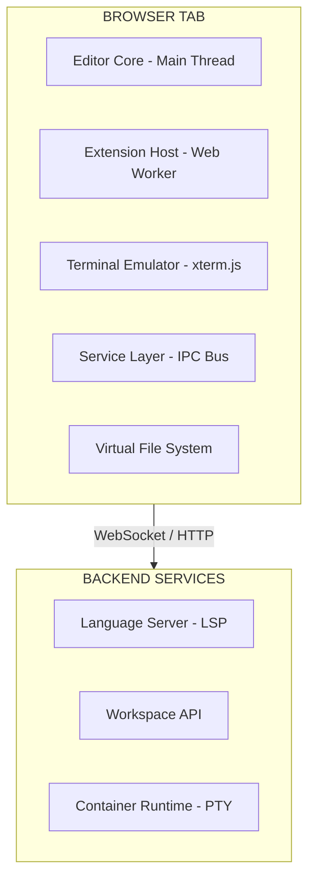

## Problem Statement

A browser-based code editor is one of the most complex frontend applications ever built. Unlike a document editor that deals with rich-text formatting, a code editor must handle raw text with near-zero input latency (< 16ms per keystroke), syntax highlighting across hundreds of languages, multi-cursor editing, language intelligence (autocomplete, diagnostics, refactoring), terminal emulation, and a plugin system — all within the constraints of a browser sandbox. The architectural challenge is delivering a native-quality IDE experience over HTTP while managing memory budgets (< 512MB heap), network variability, and cross-tab isolation.

**Scope boundary:** We design the frontend architecture for a web-based IDE supporting file editing, syntax highlighting, LSP integration, terminal, extensions, search, diff view, and Git integration. Out of scope: the backend orchestration layer (container provisioning, user auth, billing), though we specify API contracts at the boundary.

**Real-world production examples:** VS Code Web (vscode.dev), GitHub Codespaces, CodeSandbox, StackBlitz (WebContainer), Replit, Gitpod.

This differs from a rich-text editor (Google Docs) in three fundamental ways: (1) content is unformatted plaintext with syntax tokens overlaid as decorations, (2) edits must be reflected in a language server for intelligent completions in real-time, and (3) the user expects sub-frame latency on every keystroke — not eventual consistency.

---

## Requirements Exploration

### Functional Requirements

1. Users can open, edit, and save files with sub-frame (< 16ms) keystroke-to-pixel latency.
2. Users can navigate a multi-file workspace via a file explorer tree, tabs, and keyboard shortcuts (Cmd+P quick-open).
3. The editor provides syntax highlighting for 50+ languages using TextMate grammars or tree-sitter.
4. Language Server Protocol integration provides autocomplete, hover info, diagnostics, go-to-definition, and rename refactoring.
5. Users can open an integrated terminal with full PTY emulation.
6. Users can install and run extensions in a sandboxed environment.
7. Users can perform project-wide search and replace with regex support and streaming results.
8. Users can view diffs (inline and side-by-side) for uncommitted changes.
9. A minimap provides a zoomed-out overview of the current file.
10. Multi-cursor and column/box selection editing are supported.
11. Users can collaborate on the same file in real-time with cursor presence.
12. Git operations (stage, commit, push, blame) are accessible from the UI.

### Non-Functional Requirements

| Category      | Requirement                | Target                                          |
| ------------- | -------------------------- | ----------------------------------------------- |
| Latency       | Keystroke-to-pixel         | < 16ms (single frame at 60fps)                  |
| Latency       | Autocomplete popup         | < 100ms from trigger character                  |
| Latency       | File open (< 1MB)          | < 200ms to first paint of content               |
| Latency       | Search results (10K files) | First results in < 500ms                        |
| Memory        | Heap budget                | < 512MB for workspace of 50K files              |
| Memory        | Per-open-file overhead     | < 2MB for files under 100KB                     |
| Bundle        | Initial editor load        | < 800KB compressed (editor core)                |
| Bundle        | Full IDE with extensions   | < 3MB compressed total                          |
| Reliability   | Crash recovery             | Auto-save every 2s, restore on reload           |
| Scalability   | File size                  | Edit files up to 50MB without degradation       |
| Scalability   | Workspace size             | 100K+ files in file tree without jank           |
| Accessibility | Keyboard                   | Full keyboard navigation, screen reader support |
| Offline       | Editing                    | Full offline editing with sync-on-reconnect     |

---

## Capacity Estimation & Constraints

**User session profile:**

- Average session: 45 minutes
- Files opened per session: 8–12
- Keystrokes per minute: 80 (burst: 300+ during paste)
- Autocomplete requests: ~2 per minute of active typing
- File saves: triggered on every pause > 1s (auto-save)

**Data volumes per workspace:**

- Average workspace: 5,000 files, 200MB total
- Large monorepo workspace: 100K files, 2GB total
- File tree metadata (path + size + type): ~100 bytes/file × 100K = 10MB
- Open file buffer: average 30KB × 10 open files = 300KB in memory
- Language server index: 50–200MB for large TypeScript projects

**Network assumptions:**

- WebSocket for LSP: ~50 messages/min during active editing (avg 2KB each = 100KB/min)
- Terminal PTY: ~10KB/s during active shell usage
- File sync: on-save delta, average 500 bytes per save event

**Client memory budget breakdown:**

| Component                       | Budget                           |
| ------------------------------- | -------------------------------- |
| Text buffers (open files)       | 50MB                             |
| Syntax tokens / decorations     | 30MB                             |
| File tree metadata              | 15MB                             |
| Language server client cache    | 100MB                            |
| Extension host                  | 80MB                             |
| Terminal emulator (3 terminals) | 30MB                             |
| Undo/redo stacks                | 20MB                             |
| Search index (trigram)          | 50MB                             |
| UI framework + DOM              | 50MB                             |
| **Total**                       | **~425MB** (within 512MB budget) |

These constraints drive architectural decisions: we cannot load all files into memory (virtual filesystem with on-demand fetching), syntax highlighting must be incremental (not full-file re-parse on each edit), and the file tree must be virtualized.

---

## Architecture / High-Level Design

### Rendering Strategy

**Client-Side Rendering (CSR)** exclusively. Justification:

1. The editor is a long-lived interactive application — SSR provides zero benefit after initial load.
2. Keystroke latency requires direct DOM manipulation, not hydration overhead.
3. The app shell loads once; all subsequent interaction is client-state driven.
4. Monaco Editor requires direct Canvas/DOM access incompatible with server rendering.

The loading strategy is tiered:

- **Tier 1 (< 1s):** App shell HTML + critical CSS + loading skeleton
- **Tier 2 (< 2s):** Editor core (Monaco), file tree, tab bar
- **Tier 3 (on-demand):** Terminal, extensions, diff view, search panel, settings

### Navigation Model

Single Page Application with client-side routing. URL encodes workspace state:

```
https://ide.example.com/{workspace-id}?file=src/index.ts&line=42&col=8
```

Route segments:

- `/{workspace-id}` — workspace root
- `/{workspace-id}/terminal` — focused terminal view
- `/{workspace-id}/diff/{path}` — diff view for a file
- `/{workspace-id}/settings` — settings panel

Navigation is driven by command palette (Cmd+P) and keyboard shortcuts rather than URL navigation. The URL is a bookmark into editor state, not a navigation primitive.

### System Architecture Diagram



### Component Architecture

```
App
├── TitleBar (drag region, window controls)
├── ActivityBar (icon rail: Explorer, Search, SCM, Extensions, Debug)
├── SidePanel
│   ├── FileExplorer (virtualized tree)
│   ├── SearchPanel (input + streaming results)
│   ├── SCMPanel (staged/unstaged file groups)
│   └── ExtensionPanel (marketplace + installed)
├── EditorArea
│   ├── TabBar (open files, drag-to-reorder)
│   ├── BreadcrumbBar (file path segments)
│   ├── EditorGroup[] (split panes)
│   │   └── EditorInstance
│   │       ├── ViewZones (inline widgets)
│   │       ├── OverlayWidgets (hover, autocomplete)
│   │       ├── Minimap (Canvas)
│   │       ├── ScrollBar (custom, not native)
│   │       └── ContentWidget (inline decorations)
│   └── DiffEditor (side-by-side | inline)
├── Panel (bottom)
│   ├── Terminal (xterm.js instances)
│   ├── Problems (diagnostics list)
│   ├── Output (extension logs)
│   └── DebugConsole
├── StatusBar (line/col, language, encoding, Git branch)
└── CommandPalette (Cmd+Shift+P overlay)
```

### State Management Strategy

| State Type                       | Storage                        | Justification                      |
| -------------------------------- | ------------------------------ | ---------------------------------- |
| File buffers (text models)       | In-memory piece table          | O(log n) edits, undo/redo native   |
| Open tabs / layout               | Zustand store + localStorage   | Restore on reload                  |
| Editor viewport                  | Component-local                | Changes 60fps, no global broadcast |
| File tree                        | Zustand + VFS cache            | Virtualized, lazy-loaded           |
| LSP state (diagnostics, symbols) | Dedicated per-language store   | Isolated per language server       |
| Extension state                  | Worker-local + message passing | Sandboxed, no shared memory        |
| Terminal state                   | xterm.js internal buffer       | 10K scrollback lines per terminal  |
| User preferences                 | IndexedDB + sync to server     | Persisted across sessions          |
| Collaboration cursors            | CRDT (Yjs)                     | Conflict-free multi-user           |
| Git status                       | Polling (2s) + event-driven    | stale-while-revalidate             |

<Callout>
  The text buffer is the single most performance-critical data structure. Monaco
  uses a **piece table** — a persistent data structure where the original file
  content and all insertions form two append-only buffers, with a table of
  "pieces" pointing into these buffers. This gives O(log n) insert/delete and
  trivial undo (just remove the last piece entry) without copying the entire
  document on each edit.
</Callout>

---

## Data Model / Entities

```typescript
/** Core text buffer using piece table representation */
interface PieceTable {
  originalBuffer: string; // Immutable original file content
  addBuffer: string; // Append-only buffer for all insertions
  pieces: Piece[]; // Ordered list of pieces
  lineStarts: Uint32Array; // Line start offsets for O(1) line lookup
  length: number; // Total character count
  lineCount: number; // Total line count
}

interface Piece {
  bufferType: "original" | "add"; // Which buffer this piece references
  offset: number; // Start offset in the referenced buffer
  length: number; // Number of characters in this piece
  lineFeeds: number; // Number of \n in this piece (for line counting)
}

/** Represents a file in the virtual filesystem */
interface FileEntry {
  uri: string; // e.g. "file:///workspace/src/index.ts"
  path: string; // Relative path within workspace
  name: string; // Filename
  type: "file" | "directory" | "symlink";
  size: number; // Bytes
  mtime: number; // Last modified timestamp (ms)
  encoding: "utf-8" | "utf-16le" | "ascii" | "binary";
  isReadOnly: boolean;
  languageId: string; // e.g. "typescript", "python"
}

/** Editor state for a single open file */
interface EditorModel {
  uri: string;
  buffer: PieceTable;
  versionId: number; // Incremented on each edit
  alternativeVersionId: number; // For dirty detection (matches saved version)
  languageId: string;
  eol: "\n" | "\r\n";
  decorations: DecorationEntry[]; // Syntax tokens, diagnostics, git blame
  viewState: EditorViewState;
}

interface EditorViewState {
  scrollTop: number;
  scrollLeft: number;
  cursorState: CursorState[]; // Multi-cursor support
  viewportStartLine: number;
  viewportEndLine: number;
  firstVisibleColumn: number;
}

interface CursorState {
  position: Position; // Primary cursor position
  selection: Range; // Selection range (empty = no selection)
  selectionStartPosition: Position; // Anchor for shift+arrow selection
}

interface Position {
  lineNumber: number; // 1-based
  column: number; // 1-based
}

interface Range {
  startLineNumber: number;
  startColumn: number;
  endLineNumber: number;
  endColumn: number;
}

/** Token for syntax highlighting */
interface TokenInfo {
  startOffset: number;
  type: string; // TextMate scope, e.g. "keyword.control.ts"
  fontStyle: FontStyle; // Computed from theme
  foreground: number; // Color index into theme palette
  background: number; // Color index
}

interface LineTokens {
  lineNumber: number;
  tokens: Uint32Array; // Packed: [startOffset, metadata] pairs
  isValid: boolean; // Invalidated when line edited
}

/** Decoration (diagnostic, git change, breakpoint) */
interface DecorationEntry {
  id: string;
  range: Range;
  options: DecorationOptions;
}

interface DecorationOptions {
  className?: string; // CSS class on the text span
  glyphMarginClassName?: string; // Glyph margin icon (breakpoint, etc.)
  inlineClassName?: string; // Inline styling (e.g. error squiggle)
  hoverMessage?: MarkdownString;
  isWholeLine?: boolean;
  overviewRuler?: { color: string; position: "left" | "center" | "right" };
  minimap?: { color: string; position: "inline" | "gutter" };
  stickiness: TrackedRangeStickiness; // How decoration moves on edits
}

/** LSP Diagnostic */
interface Diagnostic {
  uri: string;
  range: Range;
  severity: "error" | "warning" | "info" | "hint";
  message: string;
  source: string; // e.g. "typescript", "eslint"
  code?: string | number;
  relatedInformation?: DiagnosticRelatedInfo[];
  tags?: ("unnecessary" | "deprecated")[];
}

/** Workspace configuration */
interface WorkspaceState {
  id: string;
  name: string;
  rootUri: string;
  openEditors: EditorTabState[];
  activeEditorIndex: number;
  layout: LayoutState;
  terminals: TerminalState[];
  recentFiles: string[]; // LRU, max 50 entries
}

interface EditorTabState {
  uri: string;
  viewState: EditorViewState;
  isDirty: boolean;
  isPinned: boolean;
  isPreview: boolean; // Single-click preview (italic tab)
}

interface LayoutState {
  sideBarVisible: boolean;
  sideBarWidth: number;
  panelVisible: boolean;
  panelHeight: number;
  editorGroups: EditorGroupLayout[];
  activityBarPosition: "left" | "hidden";
}

interface EditorGroupLayout {
  id: string;
  direction: "horizontal" | "vertical";
  size: number; // Percentage of parent
  editors: string[]; // URI references
}

interface TerminalState {
  id: string;
  name: string;
  cwd: string;
  shellPath: string;
  scrollback: number; // Max 10,000 lines
  pid?: number; // Backend process ID
}
```

---

## Interface Definition (API)

### File Operations (REST + WebSocket)

```typescript
// GET /api/workspaces/:id/files?path=/src
// List directory contents (paginated for large directories)
interface ListFilesResponse {
  entries: FileEntry[];
  totalCount: number;
  cursor?: string; // For directories with 1000+ entries
}

// GET /api/workspaces/:id/files/content?path=/src/index.ts
// Fetch file content (streamed for large files)
interface FileContentResponse {
  content: string; // UTF-8 encoded
  encoding: string;
  size: number;
  mtime: number;
  etag: string; // For conflict detection
}

// PUT /api/workspaces/:id/files/content?path=/src/index.ts
interface SaveFileRequest {
  content: string;
  encoding: string;
  expectedEtag: string; // Optimistic concurrency
}
interface SaveFileResponse {
  etag: string; // New etag after save
  mtime: number;
}

// POST /api/workspaces/:id/files/search
interface SearchRequest {
  query: string;
  isRegex: boolean;
  isCaseSensitive: boolean;
  includePattern?: string; // Glob, e.g. "**/*.ts"
  excludePattern?: string; // Glob, e.g. "**/node_modules/**"
  maxResults: number; // Default 1000
}
interface SearchResponse {
  results: SearchResult[];
  limitHit: boolean;
  stats: { filesSearched: number; durationMs: number };
}
interface SearchResult {
  uri: string;
  ranges: Range[];
  preview: { text: string; matches: Range[] };
}
```

### Language Server Protocol (WebSocket)

```typescript
// WebSocket: ws://api.example.com/workspaces/:id/lsp/:languageId
// Follows JSON-RPC 2.0 over WebSocket

// Client → Server
interface LSPRequest {
  jsonrpc: "2.0";
  id: number;
  method: string; // e.g. "textDocument/completion"
  params: unknown;
}

// Server → Client
interface LSPResponse {
  jsonrpc: "2.0";
  id: number;
  result?: unknown;
  error?: { code: number; message: string; data?: unknown };
}

// Server → Client (push notification)
interface LSPNotification {
  jsonrpc: "2.0";
  method: string; // e.g. "textDocument/publishDiagnostics"
  params: unknown;
}

// Key LSP methods used:
// textDocument/didOpen - sync file content to server
// textDocument/didChange - incremental edits (range + newText)
// textDocument/completion - autocomplete (triggered by "." or Ctrl+Space)
// textDocument/hover - hover info
// textDocument/definition - go-to-definition
// textDocument/references - find all references
// textDocument/rename - rename symbol
// textDocument/publishDiagnostics - errors/warnings push from server
```

### Terminal (WebSocket)

```typescript
// WebSocket: ws://api.example.com/workspaces/:id/terminal/:terminalId
// Binary frames for PTY data, JSON frames for control

interface TerminalResize {
  type: "resize";
  cols: number;
  rows: number;
}

interface TerminalInput {
  type: "data";
  data: string; // Raw keystroke data
}

// Server → Client: raw PTY output as binary Uint8Array frames
// Client → Server: TerminalInput | TerminalResize as JSON frames
```

### Collaboration (WebSocket + CRDT)

```typescript
// WebSocket: ws://api.example.com/workspaces/:id/collab
interface CollabMessage {
  type: "awareness" | "sync-step-1" | "sync-step-2" | "update";
  payload: Uint8Array; // Yjs encoded binary
}

interface AwarenessState {
  cursor: Position | null;
  selection: Range | null;
  displayName: string;
  color: string; // Assigned per-user
  activeFile: string;
}
```

<Callout>
LSP uses **incremental document sync** — only the edited range is sent to the language server on each keystroke, not the entire file. This is critical: sending a full 50KB file 5 times per second would saturate the WebSocket. The `textDocument/didChange` notification includes `contentChanges: [{ range, text }]` with only the delta.
</Callout>

---

## Caching Strategy

### Client-Side Caching

**In-Memory Text Buffer Cache:**

- Open files: piece table in memory (max 20 simultaneous open models)
- Recently closed files: serialized buffer in LRU cache (max 10, evicted on memory pressure)
- Token cache: per-line tokenization results, invalidated on line edit (lazy re-tokenize visible lines first)

**IndexedDB (Persistent Cache):**

- File content cache: stores last-fetched content keyed by `uri + etag` (max 200MB budget)
- Unsaved changes: auto-saved every 2s as serialized edit operations (survives tab crash)
- Workspace state: layout, open tabs, cursor positions, recent files
- Search history: last 50 search queries with results (for instant re-search)
- TTL: file content expires after 24h if not accessed; workspace state never expires

**Service Worker:**

- App shell (HTML + critical JS + CSS): cache-first, updated in background
- Editor core chunks: cache-first with version hash in filename (immutable)
- Font files (editor font): cache-first, indefinite TTL
- API responses: NOT cached in SW (freshness required for file content)

### CDN & Edge Caching

| Asset Type           | Cache-Control                            | Invalidation                     |
| -------------------- | ---------------------------------------- | -------------------------------- |
| App shell HTML       | `no-cache` (revalidate every load)       | Deploy triggers HTML update      |
| JS chunks (hashed)   | `public, max-age=31536000, immutable`    | Filename hash changes on rebuild |
| TextMate grammars    | `public, max-age=86400, s-maxage=604800` | Weekly grammar updates           |
| Language server WASM | `public, max-age=604800, immutable`      | Versioned URL path               |
| Theme JSON           | `public, max-age=3600`                   | Purge on theme publish           |
| Extension bundles    | `public, max-age=86400`                  | Versioned by extension version   |

### Cache Coherence

- **File content conflicts:** ETag-based optimistic concurrency. On save, if ETag mismatches (another user/tab modified), prompt user with 3-way merge UI.
- **Cross-tab consistency:** SharedWorker mediates file state between tabs editing the same workspace. BroadcastChannel used as fallback where SharedWorker unavailable.
- **LSP cache:** Diagnostics are server-authoritative — client cache is replaced wholesale on each `publishDiagnostics` notification (no merging).
- **Deploy cache busting:** JS chunks use content-hash filenames. App shell HTML includes `<meta name="version">` tag checked on visibility change — if version differs, show "Update available" banner.
- **Warm vs cold start:** First visit fetches file tree + last 5 open files in parallel. Return visit hydrates from IndexedDB, then validates with server ETags in background.

---

## Rendering & Performance Deep Dive

### Text Rendering

Monaco Editor renders text using a **viewport-based DOM approach** rather than Canvas:

1. Only lines within the viewport (+ 1 screen of overscan above/below) are rendered as DOM elements.
2. Each visible line is a `<div class="view-line">` containing `<span>` elements for each token.
3. On scroll, lines entering the viewport are created; lines leaving are destroyed (recycled from a DOM pool).
4. The scrollbar is custom-rendered (not native) to support smooth scrolling on a virtual document millions of lines long.

**Why DOM over Canvas for text?** DOM enables native text selection, IME input (CJK), accessibility (screen readers parse DOM), and browser find-in-page. Canvas would require reimplementing all of these.

```
┌──────────────────────────────────────────┐
│  Viewport (visible area)                  │
│  ┌────────────────────────────────────┐  │
│  │ Line 142: <div class="view-line">  │  │
│  │   <span class="keyword">const</span>│  │
│  │   <span class="var">x</span>       │  │
│  │   <span class="op">=</span>        │  │
│  │   <span class="num">42</span>      │  │
│  │ </div>                             │  │
│  │ Line 143: ...                      │  │
│  │ ... (only ~50 lines rendered)      │  │
│  └────────────────────────────────────┘  │
│                                          │
│  Lines 1-141: not in DOM (virtual)       │
│  Lines 193+: not in DOM (virtual)        │
└──────────────────────────────────────────┘
```

**Typing latency breakdown (16ms budget):**

| Phase                               | Budget   | What happens                       |
| ----------------------------------- | -------- | ---------------------------------- |
| Keydown event dispatch              | 0.5ms    | Browser fires keydown              |
| Input handling + command resolution | 1ms      | Map key to edit operation          |
| Piece table update                  | 0.2ms    | Insert character into buffer       |
| Token invalidation                  | 0.1ms    | Mark affected line tokens as stale |
| Cursor position recalculation       | 0.3ms    | Update cursor widget position      |
| Line re-render (single line)        | 1ms      | Update affected view-line DOM      |
| Layout thrash avoidance             | 0ms      | Batch DOM reads before writes      |
| Scroll position adjustment          | 0.5ms    | If cursor moved viewport           |
| Decoration update                   | 0.5ms    | Shift decorations after edit point |
| rAF and composite                   | 3ms      | Browser paint + composite          |
| **Total**                           | **~7ms** | Well within 16ms budget            |

### Syntax Highlighting

**Architecture:** Incremental tokenization using TextMate grammars (oniguruma regex engine compiled to WASM).

1. Each line is tokenized independently, but carries forward a **state stack** from the previous line (for multi-line strings, comments, etc.).
2. On file open: tokenize visible viewport lines synchronously (< 50 lines), then tokenize remaining lines in idle callbacks (`requestIdleCallback`) at 5ms chunks.
3. On edit: invalidate the edited line and all subsequent lines (their start-state may have changed). Re-tokenize from the edited line downward until a line's end-state matches the previously cached end-state (convergence).
4. Fallback: if tokenization takes > 500ms for a file, switch to monarch (simpler regex-based) tokenizer for that language.

<Callout>
  **Tree-sitter vs TextMate grammars:** Tree-sitter produces a full AST and
  handles incremental re-parsing in O(log n) time after edits. Monaco uses
  TextMate grammars (regex-based, per-line) because: (1) 600+ grammars already
  exist from VS Code, (2) tree-sitter WASM binaries are 200KB+ per language, (3)
  TextMate is "good enough" for highlighting (AST not needed for coloring).
  StackBlitz and Zed use tree-sitter where AST-aware features (folding,
  structural selection) justify the binary cost.
</Callout>

**Token storage optimization:**

- Tokens are stored as a packed `Uint32Array` per line: each token is 2 × 32-bit integers.
- First uint32: start offset within the line (0-based).
- Second uint32: metadata packed as bit fields — language ID (8 bits), font style (3 bits), foreground color index (9 bits), background color index (9 bits).
- This packing reduces per-token memory from ~100 bytes (object) to 8 bytes.

### Large File Handling

For files > 1MB (threshold for "large file mode"):

1. **Chunked loading:** File is split into 64KB chunks. Only chunks overlapping the viewport are loaded initially.
2. **Line index:** A line-start offset array is built from the first streaming pass (just scan for `\n`), allowing O(1) scroll-to-line before full content is available.
3. **Disabled features:** Tokenization limited to visible viewport only. Full-file tokenization disabled. Minimap uses monochrome block rendering. Bracket matching limited to ±500 lines.
4. **Memory-mapped virtual scrolling:** Scroll position maps to byte offset ranges in the file. Only the active range (viewport ± 2 screens) is held in the piece table.

### Bundle Optimization

| Chunk                                      | Size (Brotli) | Load Trigger                  |
| ------------------------------------------ | ------------- | ----------------------------- |
| App shell + UI framework                   | 85KB          | Immediate                     |
| Editor core (text model, viewport)         | 320KB         | Immediate (Tier 2)            |
| Editor contrib (autocomplete, hover, find) | 180KB         | On first editor interaction   |
| TextMate grammar engine (WASM)             | 150KB         | On file open                  |
| Grammar definitions (per-language)         | 5–30KB each   | On language detection         |
| Terminal (xterm.js)                        | 95KB          | On terminal open              |
| Diff engine (Myers algorithm)              | 40KB          | On diff view open             |
| Search (streaming worker)                  | 25KB          | On search panel open          |
| Extension host (worker runtime)            | 120KB         | On first extension activation |
| Collaboration (Yjs + awareness)            | 45KB          | On collab session join        |

**Total critical path:** 405KB (shell + editor core + grammars WASM). Full IDE: ~1.1MB compressed.

**Optimization techniques:**

- Grammar definitions loaded per-language via dynamic `import()` — never bundle all 600 grammars.
- Tree-shaking removes unused Monaco editor contributions (e.g., if diff view is unused, its 40KB never loads).
- Web Workers for: tokenization, search, extension host — keeps main thread free for rendering.
- SharedArrayBuffer (where available) for zero-copy text buffer sharing between main thread and worker.

---

## Security Deep Dive

### Threat Model

| Threat                             | Attack Vector                                                              | Impact                                | Mitigation                                                                           |
| ---------------------------------- | -------------------------------------------------------------------------- | ------------------------------------- | ------------------------------------------------------------------------------------ |
| Malicious extension code execution | Extension accesses DOM, exfiltrates code                                   | Data theft, account compromise        | Extension sandboxing in Web Worker with no DOM access; message-passing API only      |
| XSS via rendered markdown/HTML     | Preview pane renders user-authored HTML                                    | Session hijacking                     | Render previews in sandboxed iframe (`sandbox="allow-scripts"`) with separate origin |
| Terminal injection                 | Crafted terminal output with escape sequences                              | Clickjacking via hyperlink decoration | Sanitize OSC hyperlinks, validate URL schemes (http/https only)                      |
| Supply chain attack via LSP        | Compromised language server sends malicious completions containing scripts | Code injection into user's project    | CSP blocks inline script execution; completions rendered as text only, never as HTML |
| Workspace file exfiltration        | Collab participant reads files outside shared scope                        | Unauthorized data access              | Per-file ACL checks on server; client cannot request files outside granted paths     |
| CRDT poisoning                     | Malicious collab messages corrupt document state                           | Data loss                             | Server-side CRDT validation; reject updates that violate document schema bounds      |

### Extension Sandboxing

Extensions execute in an **isolated Web Worker** (the "Extension Host Worker"):

```
┌─────────────────────────────────────────────┐
│  Main Thread (UI)                            │
│  • Cannot be accessed by extensions          │
│  • Extensions interact via message API       │
└─────────────────┬───────────────────────────┘
                  │ postMessage (structured clone)
┌─────────────────┴───────────────────────────┐
│  Extension Host Worker                       │
│  • No DOM access (no document, no window)    │
│  • No fetch() to arbitrary URLs              │
│  • Allowlisted APIs only:                    │
│    - vscode.workspace.fs (VFS only)          │
│    - vscode.languages (register providers)   │
│    - vscode.window (create UI via messages)  │
│  • CPU time limit: 10s per operation         │
│  • Memory limit: 256MB per extension         │
└─────────────────────────────────────────────┘
```

**Additional isolation for untrusted extensions:**

- Run in a separate iframe with `sandbox` attribute + `allow-scripts` only
- CSP on the iframe: `script-src 'self'; connect-src 'none'; object-src 'none'`
- No access to IndexedDB, localStorage, or cookies of the main app origin
- Network requests proxied through the main thread with URL allowlist

### Code Execution Isolation

For "Run code" functionality (like CodeSandbox/StackBlitz):

1. **WebContainer approach (StackBlitz):** Run Node.js in a Service Worker + WASM. The "container" runs entirely in-browser with no backend server. Isolation is inherent — it's a userspace OS emulation with no network access unless explicitly opened.

2. **Backend container approach (Codespaces/Replit):** Code executes in an ephemeral Docker container on the server. The browser only receives stdout/stderr via WebSocket. Isolation: Linux namespaces + seccomp + network policy.

3. **iframe sandbox approach (CodeSandbox):** User code bundled and loaded in a sandboxed iframe. The iframe's CSP restricts network access. Communication with the editor is via `postMessage` only.

| Approach          | Latency               | Security                     | Offline |
| ----------------- | --------------------- | ---------------------------- | ------- |
| WebContainer      | < 100ms (local)       | High (WASM sandbox)          | Yes     |
| Backend container | 500ms–2s (cold start) | Highest (OS-level isolation) | No      |
| iframe sandbox    | < 200ms (bundle time) | Medium (CSP + sandbox attr)  | Yes     |

### CSP

```
Content-Security-Policy:
  default-src 'self';
  script-src 'self' 'wasm-unsafe-eval' blob:;
  worker-src 'self' blob:;
  style-src 'self' 'unsafe-inline';
  img-src 'self' data: https:;
  connect-src 'self' wss://api.example.com https://api.example.com https://marketplace.example.com;
  frame-src https://preview.example.com;
  font-src 'self' data:;
  object-src 'none';
  base-uri 'self';
```

Key decisions:

- `'wasm-unsafe-eval'` required for TextMate WASM engine and tree-sitter
- `blob:` in script-src for dynamically created Web Workers
- `'unsafe-inline'` for styles because Monaco injects computed styles for tokenized spans (each color is a generated CSS class)
- `frame-src` restricted to preview subdomain for HTML/Markdown preview isolation
- `connect-src` explicitly lists allowed WebSocket and API endpoints

---

## Scalability & Reliability

### Scalability Patterns

**File Tree Virtualization:**

- 100K-file workspace: only render visible tree nodes (typically 30–50 DOM elements regardless of total file count).
- Expand/collapse is lazy — child entries fetched from VFS only on expand.
- Search within file tree uses pre-built trigram index (50MB budget).

**Large Workspace Search:**

- Streaming results architecture: search worker sends results as they're found via `ReadableStream`.
- UI renders results incrementally — first results visible in < 500ms even for 100K-file workspace.
- Ripgrep-style parallelism: split file list into N chunks (N = `navigator.hardwareConcurrency`), search in parallel workers.

**Editor Scaling:**

- Split view: each editor group is an independent `EditorInstance` with its own viewport and DOM subtree.
- Maximum 10 simultaneous editor groups (beyond this, memory budget exceeded).
- Background tabs are "frozen" — their view-lines are unmounted, only the text model persists.

**LSP Scaling:**

- One WebSocket per language server (not per file). Multiple files share a single TypeScript language server instance.
- Server-side: language server process pool (1 per workspace for TypeScript, shared across users for read-only analysis).
- Debounce `textDocument/didChange`: batch rapid edits into a single notification (50ms debounce).

### Failure Handling

| Failure Mode                             | Detection                                      | User Experience                                    | Recovery                                                                                                                    |
| ---------------------------------------- | ---------------------------------------------- | -------------------------------------------------- | --------------------------------------------------------------------------------------------------------------------------- |
| WebSocket disconnect (LSP)               | `onclose` event                                | Yellow status bar: "Reconnecting..."               | Exponential backoff reconnect (1s, 2s, 4s, 8s, max 30s). Re-sync open documents on reconnect.                               |
| WebSocket disconnect (terminal)          | `onclose` event                                | Terminal shows "Disconnected" overlay              | Auto-reconnect. If session lost, offer to create new terminal. Scrollback preserved client-side.                            |
| File save conflict (ETag mismatch)       | 409 response from server                       | Modal: "File changed externally" with 3-way merge  | User chooses: overwrite, merge, or discard local changes.                                                                   |
| Extension crash (Worker unhandled error) | `onerror` on Worker                            | Notification: "Extension X crashed"                | Kill worker, offer restart. Extension state lost — acceptable trade-off for isolation.                                      |
| Out of memory (> 512MB)                  | `performance.measureUserAgentSpecificMemory()` | Warning: "Close some files to free memory"         | Evict LRU text models, clear token caches, suggest disabling memory-heavy extensions.                                       |
| Language server timeout (> 10s)          | Request timeout                                | Autocomplete shows "Loading..." then "Unavailable" | Cancel request. Next keystroke triggers fresh request. After 3 consecutive timeouts, show "Restart language server" prompt. |
| IndexedDB quota exceeded                 | `QuotaExceededError`                           | Silent — non-critical cache                        | Evict oldest entries (LRU by access time) until 20% free.                                                                   |

### Resilience Patterns

- **Offline editing:** All edits stored in IndexedDB as an operation log. On reconnect, replay operations to server. Conflicts resolved via OT/CRDT.
- **Crash recovery:** Auto-save serializes the piece table state every 2s. On reload, detect unsaved changes in IndexedDB and prompt "Recover unsaved files?"
- **Request deduplication:** If user triggers autocomplete while a previous request is in-flight, cancel the first (AbortController) and send only the latest.
- **Circuit breaker for extensions:** If an extension causes 5 errors in 60s, auto-disable it with a notification and log the pattern.

<Callout>
  **Crash recovery is non-negotiable.** VS Code Web stores a `backup` in
  IndexedDB containing: (1) the list of dirty files, (2) their serialized piece
  tables, (3) cursor positions. On `beforeunload`, this is synchronously
  written. On next load, if backups exist and the file's `versionId` doesn't
  match the server, the recovery dialog appears. This single feature prevents
  more user frustration than any other reliability measure.
</Callout>

---

## Accessibility Deep Dive

**Core challenge:** A code editor must be keyboard-first AND screen-reader accessible, which are often conflicting requirements (arrow keys for cursor movement vs screen reader navigation).

### ARIA Roles and Structure

```html
<div role="application" aria-label="Code Editor">
  <!-- Activity bar -->
  <nav role="tablist" aria-label="Activity Bar" aria-orientation="vertical">
    <button role="tab" aria-selected="true" aria-controls="explorer-panel">
      Explorer
    </button>
    <button role="tab" aria-selected="false" aria-controls="search-panel">
      Search
    </button>
  </nav>

  <!-- File explorer -->
  <div role="tree" aria-label="File Explorer">
    <div role="treeitem" aria-expanded="true" aria-level="1">src</div>
    <div role="treeitem" aria-level="2">index.ts</div>
  </div>

  <!-- Editor -->
  <div role="code" aria-label="Editor: index.ts" aria-multiline="true">
    <textarea
      aria-label="Editor content"
      aria-describedby="editor-status"
      aria-activedescendant="current-line"
    />
  </div>

  <!-- Status -->
  <div id="editor-status" role="status" aria-live="polite" aria-atomic="true">
    Line 42, Column 8 — TypeScript — UTF-8
  </div>
</div>
```

### Keyboard Navigation

| Context      | Key           | Action                                               |
| ------------ | ------------- | ---------------------------------------------------- |
| Editor       | Ctrl+Shift+M  | Toggle screen reader mode (line-by-line nav)         |
| Editor       | Tab           | Insert tab character (NOT focus trap escape)         |
| Editor       | Ctrl+M        | Toggle Tab key trapping (Escape when Tab is trapped) |
| Editor       | Ctrl+Shift+P  | Open command palette                                 |
| File tree    | Arrow Up/Down | Navigate items                                       |
| File tree    | Arrow Right   | Expand folder                                        |
| File tree    | Arrow Left    | Collapse folder                                      |
| File tree    | Enter         | Open file                                            |
| Tab bar      | Ctrl+Tab      | Switch to next open editor                           |
| Terminal     | Ctrl+`        | Toggle terminal panel                                |
| Autocomplete | Up/Down       | Navigate suggestions                                 |
| Autocomplete | Tab/Enter     | Accept suggestion                                    |
| Autocomplete | Escape        | Dismiss                                              |

### Screen Reader Mode

When screen reader mode is active (auto-detected via `role="application"` + accessibility tree inspection):

- Lines are announced one-by-one as the cursor moves.
- Token information is spoken: "const keyword, x identifier, equals operator, 42 number literal."
- Diagnostics on the current line are announced: "Error: Property 'x' does not exist on type 'Y'."
- Autocomplete items include type info: "useState, function, from react hooks."
- An `aria-live="polite"` region announces cursor position changes debounced to 300ms.

### High Contrast and Reduced Motion

- Full Windows High Contrast Mode support via `forced-colors` media query and `prefers-contrast: more`.
- All syntax highlighting maps to system colors (`CanvasText`, `LinkText`, `Highlight`) in forced-colors mode.
- `prefers-reduced-motion: reduce` disables: cursor blink animation, smooth scrolling, bracket pair colorization animation, minimap scroll animation.
- Touch targets for all buttons/tabs are ≥ 44×44 CSS pixels.
- Focus indicators use a 2px solid outline (never `outline: none` without replacement).

---

## Monitoring & Observability

### Client-Side Metrics

| Metric                             | Method                                         | Alert Threshold                       |
| ---------------------------------- | ---------------------------------------------- | ------------------------------------- |
| Keystroke latency (p95)            | PerformanceObserver + custom mark              | > 32ms (2 frames)                     |
| Time to interactive (editor ready) | Custom mark on first keystroke possible        | > 3s                                  |
| Autocomplete latency (p95)         | Measure request→popup time                     | > 200ms                               |
| File open latency (p95)            | Mark on click→content painted                  | > 500ms                               |
| Memory usage                       | `performance.measureUserAgentSpecificMemory()` | > 600MB                               |
| Extension activation time          | Custom marks per extension                     | > 2s per extension                    |
| Terminal first-byte latency        | WebSocket open→first data                      | > 1s                                  |
| Crash recovery rate                | Backup present on load / total loads           | > 5% sessions (indicates instability) |

### Error Tracking

- **Unhandled exceptions:** `window.onerror` + `unhandledrejection` → log with stack trace, current file URI, editor state snapshot.
- **Extension errors:** Separate error bucket per extension ID. Extensions with > 10 errors/hour flagged for review.
- **Language server errors:** LSP error responses tracked by method name. `textDocument/completion` failures directly impact user experience.
- **Source maps:** Uploaded to error tracking service (Sentry) on each deploy. Stack traces symbolicated server-side.
- **Deduplication:** Group by (error message, top 3 stack frames). Suppress alerts for known issues with `silenced` flag.

### Day-1 Launch Dashboard

| Panel                          | Visualization                 | Purpose                             |
| ------------------------------ | ----------------------------- | ----------------------------------- |
| Keystroke latency distribution | Histogram (p50, p95, p99)     | Core UX metric — must stay < 16ms   |
| Editor load time               | Time series (p50, p95)        | Regression detection                |
| WebSocket health               | Connection state pie chart    | LSP/terminal availability           |
| Error rate by category         | Stacked area chart            | Extension vs core vs network        |
| Memory usage distribution      | Box plot by session duration  | Identify memory leaks               |
| Active users by workspace size | Scatter plot                  | Correlation between size and issues |
| Extension crash rate           | Bar chart (top 10 extensions) | Identify problematic extensions     |
| File save success rate         | Single stat (target: 99.9%)   | Data loss prevention                |

### Alerting Thresholds

| Condition                                   | Severity    | Action                                           |
| ------------------------------------------- | ----------- | ------------------------------------------------ |
| Keystroke p95 > 32ms for 5 min              | P1 (page)   | Performance regression — immediate investigation |
| Error rate > 2% for 10 min                  | P1 (page)   | Likely deploy regression — consider rollback     |
| WebSocket reconnect rate > 20% in 5 min     | P2 (Slack)  | Infrastructure issue                             |
| Memory usage p95 > 600MB                    | P2 (Slack)  | Memory leak — check recent extension updates     |
| File save failure rate > 0.5%               | P1 (page)   | Data loss risk                                   |
| Extension crash rate > 5% for any extension | P3 (ticket) | Disable extension or contact author              |

---

## Trade-offs

| Decision                                         | Pro                                                                                                  | Con                                                                                                                                                               |
| ------------------------------------------------ | ---------------------------------------------------------------------------------------------------- | ----------------------------------------------------------------------------------------------------------------------------------------------------------------- |
| Piece table over rope for text buffer            | O(1) sequential reads (great for rendering lines), simple undo via entry removal, fewer allocations  | Slower random access than balanced rope for very large files (> 50MB); higher memory for many small edits due to piece table fragmentation                        |
| DOM rendering over Canvas for text               | Native text selection, IME support, accessibility (screen readers), browser find-in-page works       | More DOM nodes = GC pressure; harder to render 100K+ lines smoothly; style recalc cost on theme change                                                            |
| TextMate grammars over tree-sitter               | 600+ existing grammars, smaller WASM binary, good enough for syntax coloring                         | No AST available for structural editing (expand selection, smart indent); regex backtracking can cause hangs on pathological input                                |
| Web Worker for extension host over iframe        | Lower overhead (no separate document/realm), faster message passing, shared WASM memory possible     | Less isolation than iframe (same origin, can theoretically Spectre-attack shared memory); no independent CSP per extension                                        |
| WebSocket over HTTP/2 streams for LSP            | Bidirectional, lower latency for server-push diagnostics, well-supported by LSP spec                 | Requires persistent connection (mobile battery impact); reconnection logic more complex than stateless HTTP; load balancer sticky sessions required               |
| Yjs CRDT over Operational Transform for collab   | No central server required for conflict resolution; works offline; proven at scale (100+ concurrent) | Larger document metadata (tombstones); eventual consistency can show transient visual glitches; debugging CRDT state is harder than OT log                        |
| Auto-save (2s debounce) over manual save         | Eliminates data loss; matches modern UX expectations (Google Docs behavior)                          | Higher write frequency to backend; harder to reason about "saved" state; potential for saving broken syntax mid-thought                                           |
| Virtualized file tree over full DOM tree         | Handles 100K+ files without DOM explosion; constant memory regardless of workspace size              | Keyboard navigation loses positional context on scroll; search-and-scroll-to-item requires computing virtual offsets; drag-and-drop is harder with recycled nodes |
| LSP over WebSocket vs in-browser WASM LSP        | Full language server capabilities (type checker, linter, formatter); same as desktop VS Code         | Network dependency; cold start latency on connect; bandwidth for didChange; unavailable offline (unless using WASM fallback like TypeScript in-browser)           |
| Monolithic editor core vs micro-frontend plugins | Predictable performance; single bundle optimization pass; type-safe internal APIs                    | Harder to A/B test individual features; all-or-nothing updates; large teams can't deploy independently                                                            |

---

## What Great Looks Like

A **senior** answer covers:

- Viewport-based rendering with DOM recycling for performance
- Piece table or gap buffer as the text buffer data structure
- WebSocket-based LSP integration for autocomplete/diagnostics
- Extension isolation in a Web Worker
- Auto-save with IndexedDB for crash recovery

A **staff** answer additionally:

- Detailed token packing strategy (Uint32Array, bit fields) for memory efficiency
- Incremental tokenization with convergence detection (stop re-tokenizing when end-state matches)
- Multi-layer caching (memory → IndexedDB → CDN) with explicit TTLs and coherence strategy
- Failure mode table with specific recovery per scenario
- Keystroke latency budget breakdown (which phase gets how many ms)
- CRDT choice for collaboration with trade-off analysis vs OT
- CSP that accounts for WASM eval, blob: workers, and inline styles from token rendering
- Minimap as Canvas (1:1 pixel rendering at reduced scale, not DOM)

A **principal** answer additionally:

- Cross-tab SharedWorker for workspace-level coordination and deduplication
- Extension capability model (declare required APIs in manifest, principle of least privilege)
- Service Worker strategy that accelerates repeat loads without stale content risk
- Analysis of tree-sitter vs TextMate trade-off with WASM binary size budgets per language
- Memory pressure detection and graceful degradation (evict models, reduce overscan, disable features)
- Architecture for WebContainer-style in-browser execution (Service Worker intercept + WASM Node.js runtime)

---

## Key Takeaways

- **The piece table is the heart of the editor** — it enables O(log n) edits, trivial undo/redo, and efficient sequential line reads that the viewport renderer depends on.
- **Viewport rendering (not Canvas) is correct for text editors** — DOM gives you accessibility, IME, selection, and find-in-page for free; the 50-line viewport window keeps DOM node count bounded.
- **Syntax highlighting must be incremental** — tokenize only changed lines and propagate state forward until convergence; never re-tokenize the entire file on each keystroke.
- **Extension isolation is a security boundary, not just architecture** — Web Workers with message-passing APIs prevent malicious extensions from accessing user code, DOM, or auth tokens.
- **LSP over WebSocket with incremental document sync** — send only the edited range (not the full file) on each `didChange` to keep bandwidth proportional to edit size, not file size.
- **Auto-save to IndexedDB is the crash recovery mechanism** — serialize piece table state every 2s; on reload, detect and offer to restore unsaved changes before they're lost.
- **Memory budget planning must be explicit** — allocate per-component budgets (50MB for buffers, 80MB for extensions, etc.) that sum to less than 512MB; detect pressure and degrade gracefully.
- **Collaborative editing requires CRDTs (not OT) for browser-based editors** — Yjs provides offline-first conflict resolution without a central coordination server, critical for unreliable network conditions.
