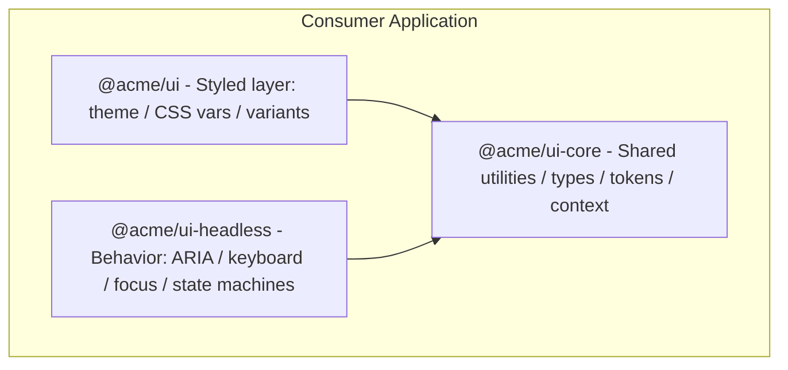
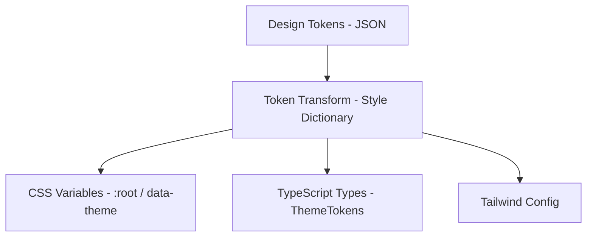

## Problem Statement

A component library is not a folder of React components in your app. It is **shared infrastructure** — a product consumed by dozens or hundreds of teams, each with different requirements, constraints, and upgrade timelines. The difference between an app's `components/` directory and a design system library is the difference between a script and a platform.

Real-world examples at scale:

| Library                 | Approach                                              | Consumer Scale |
| ----------------------- | ----------------------------------------------------- | -------------- |
| Radix UI                | Headless primitives, zero styling opinions            | 100K+ projects |
| Chakra UI               | Styled with runtime theme, composition-first          | 50K+ projects  |
| Material UI (MUI)       | Full styled system, theme overrides, sx prop          | 500K+ projects |
| Ant Design              | Opinionated enterprise components, ConfigProvider     | 300K+ projects |
| shadcn/ui               | Copy-paste primitives built on Radix, user owns code  | 80K+ projects  |
| Atlassian Design System | Internal, serves 50+ product teams, strict versioning | Internal       |

The organizational challenge is severe. A library team of 5–12 engineers serves 50+ consumer teams. Every API decision creates a maintenance contract. Every breaking change requires coordinated migration across hundreds of repositories. Every accessibility gap becomes a legal liability multiplied across all consumers.

The core tensions:

1. **Flexibility vs. Consistency** — Consumers want customization; the design system wants uniformity.
2. **Simplicity vs. Power** — Junior devs want `<Button color="blue" />`; senior devs want compound composition with render delegation.
3. **Stability vs. Evolution** — Teams on v3 cannot be forced to v5 overnight, but maintaining three major versions is unsustainable.
4. **Bundle Size vs. Features** — Every feature adds bytes. Consumers on slow networks pay for features they never use.

This problem is expert-level because it requires simultaneous mastery of: TypeScript generics, React composition patterns, CSS architecture, build tooling, package management, accessibility standards, and organizational coordination.

---

## Requirements Exploration

### Functional Requirements

| ID   | Requirement            | Detail                                                                                     |
| ---- | ---------------------- | ------------------------------------------------------------------------------------------ |
| FR1  | Component API patterns | Support controlled, uncontrolled, and mixed modes via a single prop interface              |
| FR2  | Theming system         | Token-based theming with runtime switching (light/dark/custom) without full re-render      |
| FR3  | Composition model      | Compound components with slots, render delegation via `asChild`, and polymorphic `as` prop |
| FR4  | Accessibility built-in | Every interactive component ships WCAG 2.1 AA compliant out of the box                     |
| FR5  | Responsive behavior    | Components adapt to container/viewport without consumer CSS                                |
| FR6  | SSR compatibility      | Zero hydration mismatches, works with Next.js App Router, Remix, Astro                     |
| FR7  | Ref forwarding         | Every component forwards refs to the underlying DOM element                                |
| FR8  | Event handler merging  | Consumer event handlers compose with internal handlers, never override                     |
| FR9  | Variant system         | Type-safe variants (size, color, state) with compound variant support                      |
| FR10 | Animation integration  | Presence-aware exit animations without forcing a specific animation library                |

### Non-Functional Requirements

| NFR                        | Target                                                | Rationale                                                   |
| -------------------------- | ----------------------------------------------------- | ----------------------------------------------------------- |
| Bundle size per component  | &lt;5 KB gzipped                                      | Consumers import 10–30 components; total budget &lt;80 KB   |
| Tree-shaking effectiveness | Zero side effects, 100% dead code elimination         | Unused components must not appear in production bundles     |
| Dev server import speed    | &lt;100ms per component in Vite/webpack               | Slow HMR kills developer productivity                       |
| Accessibility compliance   | WCAG 2.1 AA, automated + manual tested                | Legal requirement; one failure = organization-wide exposure |
| TypeScript coverage        | 100% public API typed, no `any` exports               | Consumers depend on autocomplete and type safety            |
| SSR compatibility          | Zero hydration warnings                               | Next.js/Remix consumers see console errors as bugs          |
| Documentation coverage     | Every component has props table, examples, a11y notes | Undocumented APIs get misused, generating support tickets   |
| Breaking change cadence    | Max 1 major version per year                          | Consumer teams budget migration effort annually             |

---

## Capacity Estimation & Constraints

### Component inventory

```
Primitives (20-30):    Button, Input, Select, Checkbox, Radio, Switch, Slider,
                       Textarea, Label, Separator, Avatar, Badge, Tooltip
Overlay (8-12):        Dialog, Popover, Dropdown, Toast, Alert Dialog,
                       Sheet, Command Palette, Context Menu
Navigation (6-10):     Tabs, Accordion, NavigationMenu, Breadcrumb, Pagination, Stepper
Layout (8-12):         Stack, Grid, Container, AspectRatio, ScrollArea, Collapsible
Data Display (10-15):  Table, Card, DataList, Stat, Timeline, Calendar, Tree
Feedback (5-8):        Progress, Skeleton, Spinner, Alert, Banner
```

**Total: 60–90 components** across a mature design system.

### Scale constraints

| Dimension                          | Value                                                           | Impact                                               |
| ---------------------------------- | --------------------------------------------------------------- | ---------------------------------------------------- |
| Consumer teams                     | 50+                                                             | Every API change requires communication to 50+ teams |
| Simultaneous major versions        | 2–3                                                             | Must maintain security patches for n-1 and n-2       |
| Monthly npm downloads              | 500K–2M                                                         | CDN and registry caching critical                    |
| Component download size budget     | &lt;150 KB total (gzip) for typical app importing 30 components | Drives tree-shaking and code-splitting architecture  |
| Dev server startup impact          | &lt;2s additional for full library import                       | Lazy resolution and barrel file avoidance            |
| Storybook stories                  | 500–1000                                                        | Build time optimization critical                     |
| CI pipeline time                   | &lt;10 min for full test + build + publish                      | Parallelization required                             |
| Consumer bundle analysis frequency | Every PR                                                        | Automated size regression detection                  |

### Version matrix

```
┌─────────────────────────────────────────────────┐
│  Production at any given time:                  │
│                                                 │
│  v4.2.1 (latest)     — 30% of consumers        │
│  v4.1.x (previous)   — 40% of consumers        │
│  v3.x (legacy)       — 25% of consumers        │
│  v2.x (deprecated)   — 5% of consumers         │
│                                                 │
│  Support commitment:                            │
│  - Latest: full feature + bugfix                │
│  - n-1 minor: bugfix + security                 │
│  - n-1 major: security only                     │
│  - n-2 major: EOL, no patches                   │
└─────────────────────────────────────────────────┘
```

---

## Architecture / High-Level Design

### Approach decision: Headless + styled layers



This two-layer architecture lets consumers choose their integration depth:

- **Full styled** (`@acme/ui`): Import styled components with theme support. Fastest time-to-UI.
- **Headless** (`@acme/ui-headless`): Import behavior-only hooks/components, bring your own styles. Maximum flexibility.
- **Core** (`@acme/ui-core`): Shared tokens, types, and utilities used by both layers.

### Compound component pattern

Every complex component uses compound composition:

```tsx
// Consumer usage — compound pattern
<Select value={value} onValueChange={setValue}>
  <Select.Trigger>
    <Select.Value placeholder="Choose..." />
  </Select.Trigger>
  <Select.Content>
    <Select.Group>
      <Select.Label>Fruits</Select.Label>
      <Select.Item value="apple">Apple</Select.Item>
      <Select.Item value="banana">Banana</Select.Item>
    </Select.Group>
  </Select.Content>
</Select>
```

The compound pattern solves:

1. **Flexibility** — consumers control layout between sub-components
2. **Accessibility** — the parent orchestrates ARIA relationships
3. **State sharing** — React context connects parts without prop drilling

### Render delegation via `asChild`

```tsx
// The button renders as an anchor tag
<Button asChild>
  <a href="/dashboard">Go to dashboard</a>
</Button>

// Internally: Button delegates ALL its behavior (event handlers, ARIA, styles)
// to the child element instead of rendering its own <button>
```

<Callout>
  The `asChild` pattern (pioneered by Radix) is superior to the polymorphic `as`
  prop for TypeScript because it avoids the combinatorial explosion of prop
  types. With `as="a"`, TypeScript must union all possible element props. With
  `asChild`, the child's own type system handles it naturally.
</Callout>

### Theming engine: CSS custom properties



CSS variables over CSS-in-JS runtime because:

- Zero JavaScript cost for theme application
- Works in SSR without hydration mismatch
- Scoped overrides without provider nesting
- DevTools inspect shows computed values
- Compatible with any styling approach consumers use

### Monorepo structure

```
packages/
├── core/                  # Shared types, tokens, utilities
│   ├── src/
│   │   ├── tokens/        # Design tokens (color, space, radius, typography)
│   │   ├── types/         # Shared TypeScript types
│   │   └── utils/         # mergeProps, composeEventHandlers, createContext
│   └── package.json
├── headless/              # Behavior-only components
│   ├── src/
│   │   ├── button/
│   │   ├── dialog/
│   │   ├── select/
│   │   └── ...
│   └── package.json
├── ui/                    # Styled components (depends on headless + core)
│   ├── src/
│   │   ├── button/
│   │   ├── dialog/
│   │   ├── select/
│   │   └── ...
│   └── package.json
├── icons/                 # Icon library (separate package, large)
│   └── package.json
├── tokens/                # Raw design tokens (JSON, consumed by core)
│   └── package.json
└── docs/                  # Storybook + documentation site
    └── package.json
```

---

## Data Model / Entities

### Polymorphic component types

```typescript
/**
 * Enables the `as` prop pattern for components that need
 * to render as different HTML elements.
 */
type AsProp<C extends React.ElementType> = {
  as?: C;
};

type PropsToOmit<C extends React.ElementType, P> = keyof (AsProp<C> & P);

/**
 * Polymorphic component props — merges component-specific props
 * with the target element's native props, avoiding conflicts.
 */
type PolymorphicComponentProps<
  C extends React.ElementType,
  Props = {},
> = React.PropsWithChildren<Props & AsProp<C>> &
  Omit<React.ComponentPropsWithoutRef<C>, PropsToOmit<C, Props>>;

/**
 * Adds ref forwarding to polymorphic props.
 */
type PolymorphicComponentPropsWithRef<
  C extends React.ElementType,
  Props = {},
> = PolymorphicComponentProps<C, Props> & {
  ref?: PolymorphicRef<C>;
};

type PolymorphicRef<C extends React.ElementType> =
  React.ComponentPropsWithRef<C>["ref"];
```

### Theme token types

```typescript
interface ThemeTokens {
  colors: ColorTokens;
  spacing: SpacingTokens;
  radii: RadiiTokens;
  typography: TypographyTokens;
  shadows: ShadowTokens;
  transitions: TransitionTokens;
  zIndices: ZIndexTokens;
}

interface ColorTokens {
  // Semantic tokens — not raw values
  background: {
    default: string;
    subtle: string;
    muted: string;
    emphasis: string;
  };
  foreground: {
    default: string;
    muted: string;
    subtle: string;
    onEmphasis: string;
  };
  border: {
    default: string;
    muted: string;
    emphasis: string;
  };
  accent: {
    default: string;
    foreground: string;
    muted: string;
    subtle: string;
  };
  destructive: {
    default: string;
    foreground: string;
    muted: string;
  };
  success: {
    default: string;
    foreground: string;
    muted: string;
  };
  warning: {
    default: string;
    foreground: string;
    muted: string;
  };
}

interface SpacingTokens {
  0: string; // 0px
  1: string; // 4px
  2: string; // 8px
  3: string; // 12px
  4: string; // 16px
  5: string; // 20px
  6: string; // 24px
  8: string; // 32px
  10: string; // 40px
  12: string; // 48px
  16: string; // 64px
  20: string; // 80px
}

interface TypographyTokens {
  fontFamilies: {
    sans: string;
    mono: string;
    serif: string;
  };
  fontSizes: {
    xs: string;
    sm: string;
    base: string;
    lg: string;
    xl: string;
    "2xl": string;
    "3xl": string;
    "4xl": string;
  };
  fontWeights: {
    normal: string;
    medium: string;
    semibold: string;
    bold: string;
  };
  lineHeights: {
    tight: string;
    normal: string;
    relaxed: string;
  };
}
```

### Variant system types

```typescript
/**
 * Class Variance Authority (CVA) inspired type-safe variant system.
 * Variants are defined declaratively and produce CSS class strings.
 */
interface VariantDefinition<V extends Record<string, Record<string, string>>> {
  base: string;
  variants: V;
  compoundVariants?: CompoundVariant<V>[];
  defaultVariants: { [K in keyof V]?: keyof V[K] };
}

type CompoundVariant<V extends Record<string, Record<string, string>>> = {
  [K in keyof V]?: keyof V[K] | Array<keyof V[K]>;
} & { class: string };

// Example: Button variants
const buttonVariants: VariantDefinition<{
  variant: {
    primary: string;
    secondary: string;
    ghost: string;
    destructive: string;
  };
  size: {
    sm: string;
    md: string;
    lg: string;
    icon: string;
  };
}> = {
  base: "inline-flex items-center justify-center rounded-md font-medium transition-colors focus-visible:outline-none focus-visible:ring-2 disabled:pointer-events-none disabled:opacity-50",
  variants: {
    variant: {
      primary:
        "bg-accent-default text-accent-foreground hover:bg-accent-default/90",
      secondary:
        "bg-background-subtle text-foreground-default hover:bg-background-muted",
      ghost: "hover:bg-background-subtle text-foreground-default",
      destructive:
        "bg-destructive-default text-destructive-foreground hover:bg-destructive-default/90",
    },
    size: {
      sm: "h-8 px-3 text-sm",
      md: "h-10 px-4 text-sm",
      lg: "h-12 px-6 text-base",
      icon: "h-10 w-10",
    },
  },
  compoundVariants: [{ variant: "ghost", size: "icon", class: "rounded-full" }],
  defaultVariants: { variant: "primary", size: "md" },
};
```

### Slot types for compound components

```typescript
/**
 * Slot system — allows parent components to pass props to specific
 * child parts without those children being direct props.
 */
interface SlotProps extends React.HTMLAttributes<HTMLElement> {
  children?: React.ReactNode;
}

/**
 * Context type for compound components.
 * Each compound component family has its own context.
 */
interface SelectContextValue {
  value: string | undefined;
  onValueChange: (value: string) => void;
  open: boolean;
  onOpenChange: (open: boolean) => void;
  disabled: boolean;
  required: boolean;
  name: string | undefined;
  // Internal state
  triggerRef: React.RefObject<HTMLButtonElement>;
  contentRef: React.RefObject<HTMLDivElement>;
  activeDescendant: string | null;
  setActiveDescendant: (id: string | null) => void;
}

/**
 * Strict context creation — throws if used outside provider.
 * No silent undefined returns that cause bugs downstream.
 */
function createStrictContext<T>(displayName: string) {
  const Context = React.createContext<T | undefined>(undefined);
  Context.displayName = displayName;

  function useContext() {
    const ctx = React.useContext(Context);
    if (ctx === undefined) {
      throw new Error(
        `use${displayName} must be used within a ${displayName}Provider`,
      );
    }
    return ctx;
  }

  return [Context.Provider, useContext] as const;
}
```

### Component internal state machine types

```typescript
/**
 * State machine for Dialog — eliminates impossible states.
 * No boolean soup (isOpen && isAnimating && !isClosing).
 */
type DialogState =
  | { status: "closed" }
  | { status: "opening"; trigger: HTMLElement | null }
  | { status: "open"; trigger: HTMLElement | null }
  | { status: "closing"; trigger: HTMLElement | null };

type DialogEvent =
  | { type: "OPEN"; trigger: HTMLElement | null }
  | { type: "ANIMATION_END" }
  | { type: "CLOSE" }
  | { type: "CLOSE_ANIMATION_END" };

function dialogReducer(state: DialogState, event: DialogEvent): DialogState {
  switch (state.status) {
    case "closed":
      if (event.type === "OPEN")
        return { status: "opening", trigger: event.trigger };
      return state;
    case "opening":
      if (event.type === "ANIMATION_END")
        return { status: "open", trigger: state.trigger };
      return state;
    case "open":
      if (event.type === "CLOSE")
        return { status: "closing", trigger: state.trigger };
      return state;
    case "closing":
      if (event.type === "CLOSE_ANIMATION_END") return { status: "closed" };
      return state;
  }
}
```

---

## Interface Definition (API)

### Button — the simplest contract

```tsx
interface ButtonProps {
  /** Visual style variant */
  variant?: "primary" | "secondary" | "ghost" | "destructive" | "link";
  /** Size preset */
  size?: "sm" | "md" | "lg" | "icon";
  /** Renders child as the button element (render delegation) */
  asChild?: boolean;
  /** Loading state — shows spinner, disables interaction */
  loading?: boolean;
  /** Full width */
  fullWidth?: boolean;
}

// Usage examples:
<Button variant="primary" size="lg">Submit</Button>
<Button variant="ghost" size="icon" aria-label="Close">
  <XIcon />
</Button>
<Button asChild>
  <a href="/next">Continue</a>
</Button>
<Button loading>Saving...</Button>
```

### Dialog — compound composition

```tsx
interface DialogProps {
  /** Controlled open state */
  open?: boolean;
  /** Callback when open state changes */
  onOpenChange?: (open: boolean) => void;
  /** Default open state (uncontrolled) */
  defaultOpen?: boolean;
  /** Whether the dialog is a modal (traps focus, adds overlay) */
  modal?: boolean;
}

interface DialogContentProps {
  /** Called when user attempts to close via escape or overlay click */
  onEscapeKeyDown?: (event: KeyboardEvent) => void;
  onPointerDownOutside?: (event: PointerDownOutsideEvent) => void;
  onInteractOutside?: (event: InteractOutsideEvent) => void;
  /** Force mount (useful for animation libraries) */
  forceMount?: boolean;
}

// Usage:
<Dialog open={isOpen} onOpenChange={setIsOpen}>
  <Dialog.Trigger asChild>
    <Button>Edit Profile</Button>
  </Dialog.Trigger>
  <Dialog.Portal>
    <Dialog.Overlay />
    <Dialog.Content>
      <Dialog.Title>Edit Profile</Dialog.Title>
      <Dialog.Description>
        Make changes to your profile here.
      </Dialog.Description>
      {/* form content */}
      <Dialog.Close asChild>
        <Button variant="ghost">Cancel</Button>
      </Dialog.Close>
    </Dialog.Content>
  </Dialog.Portal>
</Dialog>;
```

### Select — controlled/uncontrolled pattern

```tsx
interface SelectProps {
  /** Controlled value */
  value?: string;
  /** Callback on value change */
  onValueChange?: (value: string) => void;
  /** Default value (uncontrolled) */
  defaultValue?: string;
  /** Open state (controlled) */
  open?: boolean;
  onOpenChange?: (open: boolean) => void;
  /** HTML form integration */
  name?: string;
  required?: boolean;
  disabled?: boolean;
}

// Uncontrolled usage (simplest):
<Select defaultValue="apple" name="fruit">
  <Select.Trigger>
    <Select.Value placeholder="Pick a fruit" />
  </Select.Trigger>
  <Select.Content>
    <Select.Item value="apple">Apple</Select.Item>
    <Select.Item value="banana">Banana</Select.Item>
  </Select.Content>
</Select>

// Controlled usage (full power):
<Select value={fruit} onValueChange={setFruit} open={open} onOpenChange={setOpen}>
  {/* same children */}
</Select>
```

### Ref forwarding contract

```typescript
/**
 * Every component forwards refs to the outermost DOM element.
 * This is non-negotiable — consumers need refs for:
 * - Focus management
 * - Position measurement (tooltips, popovers)
 * - Animation libraries (Framer Motion, GSAP)
 * - Integration with form libraries (React Hook Form)
 */
const Button = React.forwardRef<HTMLButtonElement, ButtonProps>(
  ({ variant, size, asChild, children, ...props }, forwardedRef) => {
    const Comp = asChild ? Slot : "button";
    return (
      <Comp
        ref={forwardedRef}
        className={buttonVariants({ variant, size })}
        {...props}
      >
        {children}
      </Comp>
    );
  }
);
Button.displayName = "Button";
```

### Event handler merging

```typescript
/**
 * composeEventHandlers — merges internal + consumer event handlers.
 * Consumer handlers run first. If they call event.preventDefault(),
 * the internal handler is skipped.
 */
function composeEventHandlers<E>(
  externalHandler?: (event: E) => void,
  internalHandler?: (event: E) => void
) {
  return function handleEvent(event: E) {
    externalHandler?.(event);
    if (!(event as unknown as Event).defaultPrevented) {
      internalHandler?.(event);
    }
  };
}

// Usage inside a component:
<button
  onClick={composeEventHandlers(props.onClick, handleInternalClick)}
  onKeyDown={composeEventHandlers(props.onKeyDown, handleInternalKeyDown)}
/>
```

<Callout>
  Event handler merging is a contract consumers depend on implicitly. If
  clicking a Dialog.Trigger both opens the dialog AND fires the consumer's
  onClick, that's correct. If consuming code calls `event.preventDefault()`,
  internal behavior must yield. This pattern prevents the #1 support issue in
  component libraries: "your component swallows my event handler."
</Callout>

### Slot implementation (asChild core mechanism)

```typescript
/**
 * Slot — renders nothing itself, passes all props to its single child.
 * This is the engine behind asChild.
 */
const Slot = React.forwardRef<HTMLElement, SlotProps>(
  ({ children, ...slotProps }, forwardedRef) => {
    if (!React.isValidElement(children)) {
      return null;
    }

    // Merge refs
    const childRef = (children as any).ref;
    const mergedRef = composeRefs(forwardedRef, childRef);

    // Merge props (slot props + child props)
    // Child props take precedence for className (merged), others override
    return React.cloneElement(children, {
      ...mergeProps(slotProps, children.props),
      ref: mergedRef,
    } as any);
  },
);

/**
 * mergeProps — intelligently merges two prop objects.
 * - Event handlers are composed (both fire)
 * - className values are concatenated
 * - style objects are merged (child wins conflicts)
 * - All other props: child wins
 */
function mergeProps(
  slotProps: Record<string, any>,
  childProps: Record<string, any>,
) {
  const merged: Record<string, any> = { ...childProps };

  for (const propName in slotProps) {
    const slotValue = slotProps[propName];
    const childValue = childProps[propName];

    if (isEventHandler(propName)) {
      merged[propName] = composeEventHandlers(childValue, slotValue);
    } else if (propName === "className") {
      merged[propName] = [slotValue, childValue].filter(Boolean).join(" ");
    } else if (propName === "style") {
      merged[propName] = { ...slotValue, ...childValue };
    } else {
      merged[propName] = childValue ?? slotValue;
    }
  }

  return merged;
}
```

---

## Caching Strategy

### npm registry layer

```
┌──────────────────────────────────────────────────────┐
│  Package Distribution                                │
│                                                      │
│  npm publish ──▶ npm Registry (origin)               │
│                      │                               │
│                      ├──▶ Cloudflare CDN (unpkg)     │
│                      ├──▶ jsDelivr CDN               │
│                      └──▶ Consumer node_modules      │
│                                                      │
│  Caching layers:                                     │
│  1. npm registry: immutable tarballs (forever cache) │
│  2. Consumer lockfile: pinned resolution             │
│  3. CI cache: node_modules restored from hash        │
│  4. CDN: immutable versioned URLs (1yr cache)        │
└──────────────────────────────────────────────────────┘
```

### Build caching with Turborepo

```typescript
// turbo.json
{
  "pipeline": {
    "build": {
      "dependsOn": ["^build"],
      "outputs": ["dist/**"],
      "cache": true
    },
    "test": {
      "dependsOn": ["build"],
      "outputs": ["coverage/**"],
      "cache": true
    },
    "lint": {
      "outputs": [],
      "cache": true
    },
    "typecheck": {
      "dependsOn": ["^build"],
      "outputs": [],
      "cache": true
    }
  }
}
```

Cache hit rates in practice:

- **Local development**: 80%+ cache hits after initial build (only changed packages rebuild)
- **CI**: 60%+ hits with remote cache (Vercel Remote Cache or custom S3)
- **Storybook build**: Cached per-story — incremental builds take &lt;30s vs 5min full

### Documentation/playground caching

```
CDN Strategy for docs site:
- Static pages: ISR with 1hr revalidation
- Playground code execution: no cache (security)
- Component examples: build-time rendered, immutable deploy
- Search index: rebuilt on publish, cached at edge
```

---

## Rendering & Performance Deep Dive

### Tree-shaking verification

The #1 performance requirement. Every component must be independently importable with zero side effects.

```typescript
// package.json — critical fields for tree-shaking
{
  "name": "@acme/ui",
  "sideEffects": false,
  "exports": {
    ".": {
      "types": "./dist/index.d.ts",
      "import": "./dist/index.mjs",
      "require": "./dist/index.cjs"
    },
    "./button": {
      "types": "./dist/button/index.d.ts",
      "import": "./dist/button/index.mjs",
      "require": "./dist/button/index.cjs"
    },
    "./dialog": {
      "types": "./dist/dialog/index.d.ts",
      "import": "./dist/dialog/index.mjs",
      "require": "./dist/dialog/index.cjs"
    }
  }
}
```

<Callout>
  The `"sideEffects": false` field tells bundlers that any unused export can be
  safely eliminated. If your CSS import creates a side effect, declare it:
  `"sideEffects": ["*.css"]`. Getting this wrong means consumers ship your
  entire library in their bundle regardless of what they import.
</Callout>

### Bundle analysis per component

CI pipeline step — every PR shows size impact:

```typescript
// scripts/bundle-analysis.ts
import { build } from "esbuild";
import { gzipSync } from "zlib";
import { readFileSync, writeFileSync } from "fs";
import { glob } from "glob";

interface ComponentSize {
  name: string;
  raw: number;
  gzip: number;
  limit: number;
}

async function analyzeComponentSizes(): Promise<ComponentSize[]> {
  const components = await glob("packages/ui/src/*/index.ts");
  const results: ComponentSize[] = [];

  for (const entry of components) {
    const name = entry.split("/").at(-2)!;
    const result = await build({
      entryPoints: [entry],
      bundle: true,
      write: false,
      format: "esm",
      external: ["react", "react-dom"],
      minify: true,
      treeShaking: true,
    });

    const raw = result.outputFiles[0].contents.length;
    const gzip = gzipSync(result.outputFiles[0].contents).length;

    results.push({
      name,
      raw,
      gzip,
      limit: 5120, // 5KB gzip limit
    });
  }

  return results;
}

// Output as markdown table in PR comment
function formatReport(sizes: ComponentSize[]): string {
  const violations = sizes.filter((s) => s.gzip > s.limit);
  let report = "## Bundle Size Report\n\n";
  report += "| Component | Raw | Gzip | Limit | Status |\n";
  report += "|-----------|-----|------|-------|--------|\n";

  for (const s of sizes) {
    const status = s.gzip > s.limit ? "❌ OVER" : "✅";
    report += `| ${s.name} | ${s.raw}B | ${s.gzip}B | ${s.limit}B | ${status} |\n`;
  }

  if (violations.length > 0) {
    report += `\n⚠️ ${violations.length} component(s) exceed size budget.`;
  }

  return report;
}
```

### CSS variables vs CSS-in-JS runtime cost

| Metric                  | CSS Variables           | CSS-in-JS (runtime)                         |
| ----------------------- | ----------------------- | ------------------------------------------- |
| Theme switch cost       | 0ms (repaint only)      | 50–200ms (style recalc + injection)         |
| SSR bundle addition     | 0 KB                    | 8–15 KB (emotion/styled-components runtime) |
| Hydration mismatches    | None                    | Common (className mismatch)                 |
| DevTools inspectability | Full                    | Obfuscated class names                      |
| Dynamic styles          | Limited to token values | Arbitrary                                   |
| Component isolation     | Via naming convention   | Automatic                                   |

Decision: **CSS variables for theming, utility classes for component styling**. No runtime CSS-in-JS.

### SSR hydration mismatch prevention

```typescript
/**
 * useId — generates stable IDs across server and client.
 * Required for ARIA relationships (labelledby, describedby, controls).
 */
function useStableId(providedId?: string): string {
  // React 18+ useId handles SSR natively
  const generatedId = React.useId();
  return providedId ?? generatedId;
}

/**
 * Presence — handles mount/unmount animations without
 * conditional rendering that breaks SSR.
 */
interface PresenceProps {
  present: boolean;
  children:
    | React.ReactElement
    | ((props: { present: boolean }) => React.ReactElement);
}

function Presence({ present, children }: PresenceProps) {
  const [node, setNode] = React.useState<HTMLElement | null>(null);
  const stylesRef = React.useRef<CSSStyleDeclaration | null>(null);
  const prevPresentRef = React.useRef(present);
  const [isPresent, setIsPresent] = React.useState(present);

  // Only remove from DOM after exit animation completes
  const handleAnimationEnd = React.useCallback(() => {
    if (!present) setIsPresent(false);
  }, [present]);

  if (present && !isPresent) setIsPresent(true);

  if (!isPresent) return null;

  return typeof children === "function"
    ? children({ present })
    : React.cloneElement(children, {
        ref: setNode,
        onAnimationEnd: handleAnimationEnd,
        "data-state": present ? "open" : "closed",
      });
}
```

### Dev mode performance

```typescript
// Barrel file strategy — avoid re-exporting everything from index.ts
// BAD: forces bundler to parse all components on any import
// packages/ui/src/index.ts
export { Button } from "./button";
export { Dialog } from "./dialog";
// ... 80 more re-exports — dev server loads ALL on first import

// GOOD: subpath imports — only loaded component is parsed
// Consumer imports:
import { Button } from "@acme/ui/button";
import { Dialog } from "@acme/ui/dialog";
// Dev server only parses button + dialog modules
```

---

## Security Deep Dive

### Supply chain security

```typescript
// .npmrc — enforce integrity
audit=true
fund=false

// package.json — npm provenance
{
  "publishConfig": {
    "provenance": true,
    "access": "public"
  }
}
```

CI enforcement:

```yaml
# .github/workflows/publish.yml (relevant steps)
- name: Verify lockfile integrity
  run: npm ci --ignore-scripts

- name: Audit dependencies
  run: npm audit --audit-level=high

- name: Check for known vulnerabilities
  run: npx better-npm-audit audit --level high

- name: Publish with provenance
  run: npm publish --provenance
  env:
    NODE_AUTH_TOKEN: ${{ secrets.NPM_TOKEN }}
```

### XSS prevention in rich components

Components that render user-provided HTML (Tooltip content, Dialog description, rich text) must sanitize:

```typescript
/**
 * Components that accept `dangerouslySetInnerHTML` must be explicitly
 * opt-in and documented as dangerous. Default rendering always escapes.
 */
interface TooltipContentProps {
  /** Safe text content — automatically escaped */
  children: React.ReactNode;
  // NOTE: No dangerouslySetInnerHTML prop. Ever.
  // If consumers need rich tooltip content, they compose:
  // <Tooltip.Content><MyRichContent /></Tooltip.Content>
}

/**
 * For components that MUST render arbitrary strings (e.g., code highlighting),
 * use DOMPurify at the boundary:
 */
import DOMPurify from "dompurify";

interface CodeBlockProps {
  /** Pre-highlighted HTML from a server-side highlighter */
  highlightedHtml: string;
  language: string;
}

function CodeBlock({ highlightedHtml, language }: CodeBlockProps) {
  const sanitized = DOMPurify.sanitize(highlightedHtml, {
    ALLOWED_TAGS: ["span", "code", "pre"],
    ALLOWED_ATTR: ["class", "style"],
  });

  return (
    <pre data-language={language}>
      <code dangerouslySetInnerHTML={{ __html: sanitized }} />
    </pre>
  );
}
```

### CSP compatibility

```typescript
/**
 * All styling must work with strict CSP:
 * style-src 'self' — no inline styles via JS
 *
 * This rules out:
 * - emotion/styled-components that inject <style> tags
 * - Any component that sets element.style dynamically
 *
 * Allowed:
 * - Pre-built CSS files
 * - CSS custom properties (set via className, not style attr)
 * - CSS-in-JS with build-time extraction (vanilla-extract, Linaria)
 */

// Pattern for dynamic values that respect CSP:
// Use CSS custom properties set via className or data attributes
function ProgressBar({ value }: { value: number }) {
  return (
    <div
      className="progress-bar"
      role="progressbar"
      aria-valuenow={value}
      aria-valuemin={0}
      aria-valuemax={100}
      // CSS variable set via style is CSP-safe (style-src 'unsafe-inline'
      // is only needed for computed styles, not declarative ones)
      style={{ "--progress-value": `${value}%` } as React.CSSProperties}
    />
  );
}
// CSS: .progress-bar::after { width: var(--progress-value); }
```

### Dependency audit policy

| Category        | Policy                            | Enforcement                                         |
| --------------- | --------------------------------- | --------------------------------------------------- |
| Runtime deps    | Zero or near-zero                 | `@acme/ui` has 0 runtime deps beyond react peer dep |
| Dev deps        | Pinned majors, automated updates  | Renovate bot with auto-merge for patch              |
| Peer deps       | React 18+, explicit version range | CI tests against min + max of range                 |
| Transitive deps | Audit weekly                      | `npm audit` in CI, block on high/critical           |

---

## Scalability & Reliability

### Versioning strategy

```
Semver with Conventional Commits:
┌─────────────────────────────────────────────────────────┐
│  feat(button): add loading state prop        → minor    │
│  fix(dialog): prevent focus escape           → patch    │
│  feat(select)!: rename onSelect to onChange  → major    │
│  BREAKING CHANGE: remove deprecated props    → major    │
└─────────────────────────────────────────────────────────┘

Automated via changesets:
1. Developer adds changeset: `npx changeset`
2. CI aggregates changesets on merge to main
3. Release PR auto-generated with combined changelog
4. Merge release PR → publish to npm
```

### Breaking change detection

```typescript
// scripts/api-extractor-check.ts
// Uses @microsoft/api-extractor to compare .d.ts between versions

import { Extractor, ExtractorConfig } from "@microsoft/api-extractor";

/**
 * Detects breaking changes by comparing public API surface:
 * - Removed exports
 * - Changed function signatures
 * - Narrowed types (string → "a" | "b")
 * - Removed interface members
 */
function detectBreakingChanges(
  previousApi: string,
  currentApi: string,
): BreakingChange[] {
  // Compare API report files generated by api-extractor
  // Flag: removed symbols, changed signatures, type narrowing
  // Output: list of breaking changes with migration notes
}
```

### Codemods for migrations

```typescript
// codemods/v3-to-v4/rename-color-prop.ts
// jscodeshift transform
import type { API, FileInfo } from "jscodeshift";

export default function transform(file: FileInfo, api: API) {
  const j = api.jscodeshift;
  const root = j(file.source);

  // Rename: <Button color="primary"> → <Button variant="primary">
  root
    .find(j.JSXOpeningElement, { name: { name: "Button" } })
    .find(j.JSXAttribute, { name: { name: "color" } })
    .forEach((path) => {
      path.node.name = j.jsxIdentifier("variant");
    });

  // Rename: <Input isInvalid> → <Input invalid>
  root
    .find(j.JSXOpeningElement, { name: { name: "Input" } })
    .find(j.JSXAttribute, { name: { name: "isInvalid" } })
    .forEach((path) => {
      path.node.name = j.jsxIdentifier("invalid");
    });

  return root.toSource({ quote: "double" });
}
```

<Callout>
  Every breaking change MUST ship with a codemod. If you cannot write an
  automated transform, the API change is too complex and should be reconsidered.
  This is the difference between a library that 50 teams can adopt and one that
  50 teams resent.
</Callout>

### Multi-version coexistence

```typescript
/**
 * When consumers cannot upgrade atomically, two versions coexist:
 *
 * Resolution strategies:
 * 1. CSS variable namespacing: --acme-v4-color-primary vs --acme-v3-color-primary
 * 2. React context isolation: each major version has its own Provider
 * 3. CSS class prefixes: .acme-v4-button vs .acme-v3-button
 *
 * The theme provider detects version conflicts:
 */
function ThemeProvider({ children, version }: { children: React.ReactNode; version: number }) {
  React.useEffect(() => {
    const existingVersion = document.documentElement.dataset.acmeUiVersion;
    if (existingVersion && Number(existingVersion) !== version) {
      console.warn(
        `[acme/ui] Multiple versions detected: v${existingVersion} and v${version}. ` +
        `This may cause style conflicts. See migration guide.`
      );
    }
    document.documentElement.dataset.acmeUiVersion = String(version);
  }, [version]);

  return <InternalThemeProvider>{children}</InternalThemeProvider>;
}
```

### Backward compatibility testing

```yaml
# CI matrix — test against consumer scenarios
strategy:
  matrix:
    react: ["18.2", "18.3", "19.0"]
    bundler: ["webpack5", "vite5", "esbuild"]
    ssr: ["next14", "next15", "remix2"]
    node: ["18", "20", "22"]
```

---

## Accessibility Deep Dive

### ARIA pattern implementation matrix

| Component | WAI-ARIA Pattern   | Key Behaviors                                      |
| --------- | ------------------ | -------------------------------------------------- |
| Dialog    | dialog (modal)     | Focus trap, Escape close, return focus to trigger  |
| Select    | listbox            | Arrow key navigation, typeahead, active descendant |
| Tabs      | tablist + tabpanel | Arrow keys switch tabs, Home/End, roving tabindex  |
| Menu      | menu + menuitem    | Arrow keys, typeahead, nested submenus             |
| Combobox  | combobox           | Input + listbox, filtering, autocomplete modes     |
| Accordion | accordion          | Enter/Space toggle, optional single-expand         |
| Tooltip   | tooltip            | Escape dismisses, not focusable, delay             |
| Toast     | alert + status     | Polite/assertive, auto-dismiss with pause on hover |
| Switch    | switch             | Space toggles, communicates on/off state           |
| Slider    | slider             | Arrow keys adjust, min/max/step, multi-thumb       |

### Keyboard navigation implementation

```typescript
/**
 * Roving tabindex — only one item in a group is tabbable at a time.
 * Used for: Tabs, Menu, RadioGroup, Toolbar
 */
function useRovingFocus<T extends HTMLElement>(items: T[]) {
  const [focusedIndex, setFocusedIndex] = React.useState(0);

  const handleKeyDown = React.useCallback(
    (event: React.KeyboardEvent) => {
      const maxIndex = items.length - 1;
      let nextIndex = focusedIndex;

      switch (event.key) {
        case "ArrowRight":
        case "ArrowDown":
          nextIndex = focusedIndex === maxIndex ? 0 : focusedIndex + 1;
          break;
        case "ArrowLeft":
        case "ArrowUp":
          nextIndex = focusedIndex === 0 ? maxIndex : focusedIndex - 1;
          break;
        case "Home":
          nextIndex = 0;
          break;
        case "End":
          nextIndex = maxIndex;
          break;
        default:
          return;
      }

      event.preventDefault();
      setFocusedIndex(nextIndex);
      items[nextIndex]?.focus();
    },
    [focusedIndex, items],
  );

  return {
    focusedIndex,
    handleKeyDown,
    getItemProps: (index: number) => ({
      tabIndex: index === focusedIndex ? 0 : -1,
      onKeyDown: handleKeyDown,
      onFocus: () => setFocusedIndex(index),
    }),
  };
}
```

### Focus management

```typescript
/**
 * Focus trap for modal components (Dialog, Sheet, AlertDialog).
 * Requirements:
 * 1. Tab cycles within the modal
 * 2. Shift+Tab reverse cycles
 * 3. Focus moves to first focusable element on open
 * 4. Focus returns to trigger on close
 * 5. Focus is not trapped if modal=false (non-modal dialog)
 */
function useFocusTrap(
  containerRef: React.RefObject<HTMLElement>,
  active: boolean,
) {
  React.useEffect(() => {
    if (!active || !containerRef.current) return;

    const container = containerRef.current;
    const focusableSelector = [
      "a[href]",
      "button:not([disabled])",
      "input:not([disabled])",
      "select:not([disabled])",
      "textarea:not([disabled])",
      "[tabindex]:not([tabindex='-1'])",
    ].join(", ");

    function getFocusableElements() {
      return Array.from(
        container.querySelectorAll<HTMLElement>(focusableSelector),
      ).filter(
        (el) => !el.hasAttribute("disabled") && el.offsetParent !== null,
      );
    }

    function handleKeyDown(event: KeyboardEvent) {
      if (event.key !== "Tab") return;

      const focusable = getFocusableElements();
      if (focusable.length === 0) return;

      const first = focusable[0];
      const last = focusable[focusable.length - 1];

      if (event.shiftKey && document.activeElement === first) {
        event.preventDefault();
        last.focus();
      } else if (!event.shiftKey && document.activeElement === last) {
        event.preventDefault();
        first.focus();
      }
    }

    // Move focus into container
    const previouslyFocused = document.activeElement as HTMLElement;
    const firstFocusable = getFocusableElements()[0];
    firstFocusable?.focus();

    document.addEventListener("keydown", handleKeyDown);

    return () => {
      document.removeEventListener("keydown", handleKeyDown);
      previouslyFocused?.focus();
    };
  }, [active, containerRef]);
}
```

### Screen reader testing matrix

| Component | NVDA (Windows)                         | VoiceOver (macOS)           | JAWS (Windows)        | TalkBack (Android)       |
| --------- | -------------------------------------- | --------------------------- | --------------------- | ------------------------ |
| Dialog    | Announces title on open, trapped focus | ✓                           | Announces role=dialog | ✓                        |
| Select    | Reads selected value, options count    | ✓ (native behavior differs) | ✓                     | Touch explore on options |
| Tabs      | "Tab 1 of 3, selected"                 | ✓                           | ✓                     | ✓                        |
| Combobox  | "Combobox, expanded, 5 results"        | ✓                           | ✓                     | Limited support          |
| Toast     | Polite announcement, no focus steal    | ✓                           | ✓                     | ✓                        |
| Menu      | "Menu, 4 items" on open                | ✓                           | ✓                     | ✓                        |

Testing is automated where possible via `axe-core` in CI, but manual testing across this matrix happens every release for complex components.

```typescript
// Automated a11y test — runs in CI for every component
import { axe, toHaveNoViolations } from "jest-axe";
import { render } from "@testing-library/react";

expect.extend(toHaveNoViolations);

describe("Dialog accessibility", () => {
  it("has no axe violations when open", async () => {
    const { container } = render(
      <Dialog defaultOpen>
        <Dialog.Content>
          <Dialog.Title>Test Dialog</Dialog.Title>
          <Dialog.Description>Description text</Dialog.Description>
          <Dialog.Close>Close</Dialog.Close>
        </Dialog.Content>
      </Dialog>
    );

    const results = await axe(container);
    expect(results).toHaveNoViolations();
  });

  it("traps focus within dialog", async () => {
    render(
      <Dialog defaultOpen>
        <Dialog.Content>
          <Dialog.Title>Test</Dialog.Title>
          <button>First</button>
          <button>Last</button>
          <Dialog.Close>Close</Dialog.Close>
        </Dialog.Content>
      </Dialog>
    );

    // Tab should cycle within dialog
    await userEvent.tab(); // First button
    await userEvent.tab(); // Last button
    await userEvent.tab(); // Close button
    await userEvent.tab(); // Wraps to First button
    expect(screen.getByText("First")).toHaveFocus();
  });
});
```

---

## Monitoring & Observability

### Bundle size regression CI

```typescript
// .github/workflows/size-check.yml logic
interface SizeReport {
  component: string;
  currentSize: number;
  previousSize: number;
  delta: number;
  deltaPercent: number;
  budget: number;
  status: "pass" | "warn" | "fail";
}

// Thresholds:
// - PASS: within budget
// - WARN: within budget but >10% increase from previous
// - FAIL: exceeds budget

// Output: PR comment with table + status check
```

### Visual regression testing

```typescript
// Chromatic or Percy integration
// Every component has stories that cover:
// 1. All variant combinations
// 2. All interactive states (hover, focus, active, disabled)
// 3. Dark/light theme
// 4. RTL layout
// 5. Responsive breakpoints

// Storybook story structure for visual testing:
export const AllVariants: Story = {
  render: () => (
    <div className="grid gap-4">
      {(["primary", "secondary", "ghost", "destructive"] as const).map((variant) =>
        (["sm", "md", "lg"] as const).map((size) => (
          <Button key={`${variant}-${size}`} variant={variant} size={size}>
            {variant} {size}
          </Button>
        ))
      )}
    </div>
  ),
};

export const InteractiveStates: Story = {
  render: () => (
    <div className="grid gap-4">
      <Button>Default</Button>
      <Button data-state="hover">Hover</Button>
      <Button data-state="focus">Focus</Button>
      <Button data-state="active">Active</Button>
      <Button disabled>Disabled</Button>
      <Button loading>Loading</Button>
    </div>
  ),
};
```

### Accessibility audit CI

```yaml
# Runs axe-core against all component stories
- name: Accessibility audit
  run: |
    npx storybook build --output-dir storybook-static
    npx @storybook/test-runner --url http://localhost:6006 \
      --config-dir .storybook \
      --reporters json \
      --coverage
  # Fails CI on any axe violation (WCAG AA)
```

### Adoption metrics

```typescript
/**
 * Track library adoption across consumer teams.
 * Data sources:
 * 1. npm download counts per package
 * 2. Internal registry (Artifactory) download tracking
 * 3. GitHub/GitLab code search for import statements
 * 4. Optional telemetry (opt-in, privacy-respecting)
 */
interface AdoptionMetrics {
  weeklyDownloads: number;
  activeConsumerRepos: number;
  componentUsageRanking: Array<{ component: string; importCount: number }>;
  versionDistribution: Array<{ version: string; percentage: number }>;
  migrationProgress: {
    totalRepos: number;
    migratedToLatest: number;
    onPreviousMajor: number;
    onDeprecatedVersion: number;
  };
}

// Alert thresholds:
// - Adoption drop >20% week-over-week → investigate
// - >50% still on deprecated version after 6 months → escalate
// - New component adopted by <5 teams after 3 months → review API
```

### Performance monitoring dashboard

| Metric                            | Target          | Alert Threshold |
| --------------------------------- | --------------- | --------------- |
| Largest component bundle (gzip)   | &lt;5 KB        | >5 KB           |
| Total library import size         | &lt;80 KB       | >100 KB         |
| Storybook build time              | &lt;5 min       | >8 min          |
| CI full pipeline                  | &lt;10 min      | >15 min         |
| Visual regression false positives | &lt;5%          | >10%            |
| A11y violations in CI             | 0               | >0              |
| npm publish success rate          | 100%            | &lt;100%        |
| Documentation coverage            | 100% components | &lt;95%         |

---

## Trade-offs

| Decision             | Option A                                | Option B                                  | Choice                   | Justification                                                                 |
| -------------------- | --------------------------------------- | ----------------------------------------- | ------------------------ | ----------------------------------------------------------------------------- |
| Styling approach     | CSS-in-JS runtime (emotion)             | CSS variables + utility classes           | **B**                    | Zero runtime cost, SSR-safe, CSP-compatible, smaller bundles                  |
| Component model      | Headless only (Radix approach)          | Styled + headless layers                  | **Both**                 | Ship headless primitives + styled layer on top; consumers choose depth        |
| API pattern          | Polymorphic `as` prop                   | `asChild` render delegation               | **asChild**              | Better TypeScript inference, no prop union explosion, cleaner mental model    |
| Repository structure | Monorepo (all packages)                 | Polyrepo (package per component)          | **Monorepo**             | Atomic cross-package changes, shared tooling, single CI pipeline              |
| Default behavior     | Controlled (consumer manages all state) | Uncontrolled with optional control        | **Uncontrolled default** | Lower barrier to adoption; controlled mode available for power users          |
| Versioning scope     | All packages same version               | Independent per-package versions          | **Shared version**       | Simpler mental model for consumers, avoids incompatible version combinations  |
| CSS strategy         | One CSS file for all components         | Per-component CSS                         | **Per-component**        | Tree-shaking for styles mirrors tree-shaking for JS; unused styles not loaded |
| Build output         | Single bundle                           | Individual ESM + CJS per component        | **Individual**           | Enables subpath imports, eliminates barrel file overhead in dev               |
| Theme switching      | JavaScript runtime (context re-render)  | CSS `data-theme` attribute (repaint only) | **CSS attribute**        | No React re-render on theme switch; instant transition; works outside React   |
| Animation strategy   | Built-in (Framer Motion dep)            | Presence primitive + consumer BYO         | **Presence primitive**   | No forced dependency; 90% of consumers need enter/exit, not spring physics    |

---

## What Great Looks Like

### Senior Engineer (5–8 years)

- Implements compound component pattern correctly with React context
- Forwards refs on all components
- Handles controlled/uncontrolled with internal state fallback
- Writes proper TypeScript generics for polymorphic props
- Sets up basic tree-shaking with `sideEffects: false`
- Implements ARIA attributes per WAI-ARIA authoring practices
- Structures monorepo with turborepo or nx

### Staff Engineer (8–12 years)

- Designs the variant system type-safely (CVA-style with compound variants)
- Implements `asChild` / Slot pattern with full prop merging and event composition
- Architects CSS variable theming with multi-theme support and scoped overrides
- Builds automated bundle analysis CI that blocks on size regressions
- Creates codemod infrastructure for breaking changes
- Designs the testing matrix (unit + a11y + visual + cross-browser)
- Establishes versioning strategy with changesets and automated changelogs
- Implements focus management primitives (trap, restore, roving tabindex)

### Principal Engineer (12+ years)

- Defines the organizational model: library team charter, consumer SLAs, RFC process for new components
- Designs multi-version coexistence strategy that doesn't burden consumers
- Architects the build system for &lt;10s incremental builds in a 100-component monorepo
- Establishes adoption metrics and feedback loops between library team and consumers
- Makes the headless vs. styled layer decision with full cost analysis
- Designs the token → CSS variable → component pipeline with Style Dictionary
- Plans the deprecation lifecycle: announce → codemod → warnings → removal across 18 months
- Evaluates multi-framework support economics (React + Vue + Web Components) and says no when the cost exceeds the value
- Defines the accessibility testing contract: automated + manual matrix, release gates
- Architecs developer experience: documentation site, playground, copy-paste examples, VS Code snippets, ESLint plugin for correct usage

---

## Key Takeaways

- **Ship headless primitives as the foundation, styled layer as convenience** — this serves both teams that want plug-and-play and teams that need full control.
- **`asChild` over `as` prop** — render delegation with a Slot component produces cleaner TypeScript, simpler mental models, and zero prop conflicts.
- **CSS variables for theming, not runtime CSS-in-JS** — zero JavaScript cost for theme application, SSR-safe, CSP-compatible, and DevTools-inspectable.
- **Every breaking change ships with a codemod** — if the migration cannot be automated, the API change is too complex.
- **Bundle size is a feature, not an afterthought** — per-component size budgets enforced in CI, subpath exports for tree-shaking, zero barrel file overhead.
- **Accessibility is architecture, not a checklist** — built into compound component design (focus management, keyboard nav, ARIA relationships), not bolted on after.
- **Uncontrolled by default, controlled when needed** — the simple case should be simple; the complex case should be possible.
- **Treat your library as a product with SLAs** — version support windows, migration timelines, adoption metrics, and consumer feedback loops are as important as the code.
