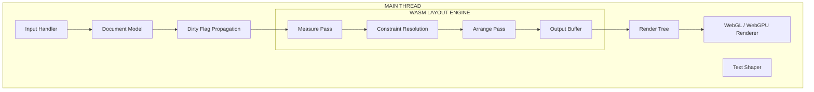
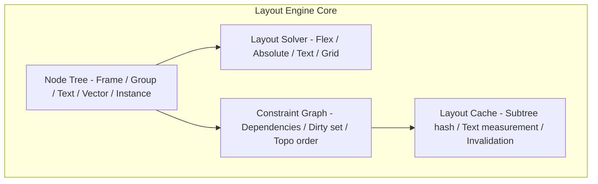

## Problem Statement

A layout engine is the computational core of any design tool. It takes a tree of nodes with constraints (alignment, spacing, sizing modes, padding) and produces concrete pixel rectangles that the renderer draws to the canvas. This is fundamentally the same problem browsers solve with CSS Layout — but design tools operate under stricter performance constraints because users manipulate nodes in real-time via drag, resize, and property changes, all of which must produce updated layout within a single frame (< 16ms at 60fps).

Figma's Auto Layout, Sketch's Smart Layout, and Adobe XD's Responsive Resize all solve variants of this problem. The core challenge: resolve a directed acyclic graph of size and position constraints incrementally, handling bidirectional dependencies (a parent that "hugs" its children depends on children's intrinsic sizes, while children that "fill" their parent depend on the parent's resolved size), all within a frame budget that leaves room for rendering.

Real-world scale: a production Figma file contains 10,000–500,000+ nodes. A single frame interaction (drag-resize) must re-layout the affected subtree (typically 50–5,000 nodes) in under 8ms to leave headroom for hit-testing, rendering, and GC. This demands algorithmic efficiency (O(n) in subtree size), aggressive caching, dirty-flag propagation, and — in Figma's case — WebAssembly for the hot path.

This problem tests deep understanding of: tree algorithms, constraint propagation, incremental computation, GPU rendering pipelines, and collaboration-aware determinism.

---

## Requirements Exploration

### Functional Requirements

1. **Constraint-based sizing** — nodes support three sizing modes per axis: Fixed (explicit px), Hug Contents (shrink-wrap to children's intrinsic size), Fill Container (expand to consume remaining space in parent).
2. **Auto Layout (Flexbox semantics)** — frames can declare a main axis (horizontal/vertical), gap, padding, alignment (main-axis distribution, cross-axis alignment), and children participate in grow/shrink distribution.
3. **Absolute positioning breakout** — children within an auto-layout frame can opt out and position absolutely relative to the frame bounds, without affecting sibling layout.
4. **Min/Max constraints** — every node supports min-width, max-width, min-height, max-height that clamp the resolved size after constraint resolution.
5. **Nested auto-layout** — arbitrary nesting depth of auto-layout frames (flex-in-flex), each resolving independently then composing.
6. **Text layout integration** — text nodes report intrinsic size after line-breaking and shaping, feeding back into the constraint system.
7. **Component instances with overrides** — layout properties inherit from the master component but can be locally overridden; changes to master propagate unless overridden.
8. **Responsive resize behavior** — when a frame is manually resized, children respond according to their constraints (fill children stretch, hug children reflow, fixed children stay).
9. **Deterministic output** — given identical tree state, layout produces identical pixel positions regardless of edit history or user, enabling CRDT-based collaboration.
10. **Layout change propagation** — inserting, removing, or reordering a child triggers minimal re-layout (only affected ancestors and siblings).

### Non-Functional Requirements

| Requirement                    | Target                                | Rationale                                                      |
| ------------------------------ | ------------------------------------- | -------------------------------------------------------------- |
| Layout latency (interactive)   | < 8ms for affected subtree            | Leaves 8ms for render + GC within 16ms frame                   |
| Layout latency (full document) | < 100ms for 100K nodes                | Initial open and undo/redo full recompute                      |
| Memory overhead                | < 200 bytes per node for layout state | 500K nodes × 200B = 100MB layout state budget                  |
| Incremental invalidation       | O(depth) propagation                  | Dirty flags bubble up; re-layout is O(subtree) not O(document) |
| Determinism                    | Bit-exact floating-point results      | Required for CRDT convergence across clients                   |
| Throughput                     | 60fps during drag/resize              | No dropped frames during interactive manipulation              |
| Text measurement               | < 1ms per text node                   | Amortized via caching shaped results                           |
| WASM module size               | < 500KB gzipped                       | Layout engine compiled to WebAssembly for performance          |

---

## Capacity Estimation & Constraints

**Node counts by document tier:**

| Document Size         | Node Count     | Typical Subtree (interactive) | Full Layout Budget |
| --------------------- | -------------- | ----------------------------- | ------------------ |
| Small (single page)   | 500–2,000      | 20–100 nodes                  | < 5ms              |
| Medium (multi-page)   | 5,000–50,000   | 100–1,000 nodes               | < 50ms             |
| Large (design system) | 50,000–500,000 | 500–5,000 nodes               | < 200ms            |

**Frame budget breakdown (16.67ms total at 60fps):**

```
┌──────────────────────────────────────────────────────┐
│ Input handling           │  1ms                       │
│ Dirty flag propagation   │  0.5ms                     │
│ Layout resolution        │  8ms (BUDGET)              │
│ Hit-test update          │  1ms                       │
│ Render tree diff         │  2ms                       │
│ GPU draw calls           │  3ms                       │
│ GC / slack              │  1.17ms                    │
└──────────────────────────────────────────────────────┘
```

**Memory budget per layout node:**

```
Position (x, y):        8 bytes (2 × f32)
Size (w, h):            8 bytes (2 × f32)
Constraints:           32 bytes (sizing modes, min/max per axis)
Flex properties:       24 bytes (axis, gap, padding, alignment)
Dirty flags:            4 bytes (bitfield)
Cache hash:             8 bytes
Parent/child pointers: 16 bytes
─────────────────────────────────
Total:                ~100 bytes (leaves headroom for alignment)
```

**Constraint resolution cycles:** The layout algorithm MUST converge in a bounded number of passes. Flexbox semantics guarantee convergence in exactly 2 passes (measure + arrange) for non-pathological cases. Adding min/max clamping introduces a potential third pass. The engine caps at 3 passes with a hard bail-out to prevent infinite loops from circular constraints.

---

## Architecture / High-Level Design

### Rendering Strategy

The layout engine is decoupled from rendering. Layout produces a flat array of `LayoutResult` structs (position + size per node), which the renderer consumes to produce draw commands. This separation enables:

- Layout in WebAssembly, rendering via WebGL/WebGPU
- Layout computation on a worker thread while the main thread handles input
- Server-side layout resolution for thumbnail generation and export

### Navigation Model

Not applicable in the traditional SPA sense. The "navigation" equivalent is the viewport (camera) transform applied after layout. Layout operates in document coordinates; the viewport matrix translates to screen coordinates. Pan/zoom never triggers re-layout.

### System Architecture Diagram



### Component Architecture



### State Management Strategy

Layout state is owned entirely by the WASM module in a linear memory buffer. The JavaScript layer holds:

1. **Document Model** — the source-of-truth node tree (CRDT-backed for collaboration)
2. **Layout Input Buffer** — a serialized representation of constraints, written by JS, read by WASM
3. **Layout Output Buffer** — a flat `Float32Array` of `[x, y, w, h]` per node, written by WASM, read by the renderer

This shared-buffer approach eliminates serialization overhead. The JS side writes constraint changes directly into WASM linear memory via typed array views.

---

## Data Model / Entities

```typescript
/** Sizing mode for a single axis */
type SizingMode = "fixed" | "hug" | "fill";

/** Alignment on the main axis (distribution) */
type MainAxisAlignment =
  | "start"
  | "center"
  | "end"
  | "space-between"
  | "space-around"
  | "space-evenly";

/** Alignment on the cross axis */
type CrossAxisAlignment = "start" | "center" | "end" | "stretch" | "baseline";

/** Layout direction */
type LayoutDirection = "horizontal" | "vertical";

/** Overflow behavior */
type OverflowBehavior = "visible" | "hidden" | "scroll";

/** Edge insets (padding/margin) */
interface EdgeInsets {
  top: number;
  right: number;
  bottom: number;
  left: number;
}

/** Size constraints for a single axis */
interface AxisConstraint {
  mode: SizingMode;
  value: number; // used when mode === 'fixed'
  min: number; // 0 = unconstrained
  max: number; // Infinity = unconstrained
  growFactor: number; // flex-grow equivalent (0 = don't grow)
  shrinkFactor: number; // flex-shrink equivalent (1 = can shrink)
}

/** Auto-layout properties (only on frames with layoutMode !== 'none') */
interface AutoLayoutProps {
  direction: LayoutDirection;
  mainAxisAlignment: MainAxisAlignment;
  crossAxisAlignment: CrossAxisAlignment;
  gap: number;
  padding: EdgeInsets;
  counterAxisSizingMode: SizingMode; // 'hug' or 'fixed' on cross axis
  wrap: boolean; // wrap children to next line
  wrapGap: number; // gap between wrapped lines
}

/** Position mode within parent */
type PositionMode = "auto" | "absolute";

/** Constraints for absolute positioning (relative to parent edges) */
interface AbsoluteConstraints {
  top: number | null;
  right: number | null;
  bottom: number | null;
  left: number | null;
  centerX: boolean;
  centerY: boolean;
}

/** The core layout node — mirrors the design document node */
interface LayoutNode {
  id: string; // stable across CRDT operations
  parentId: string | null;
  childrenIds: string[]; // ordered

  // Sizing
  widthConstraint: AxisConstraint;
  heightConstraint: AxisConstraint;

  // Positioning
  positionMode: PositionMode;
  absoluteConstraints: AbsoluteConstraints | null;
  rotation: number; // degrees, applied after layout

  // Auto-layout (null if this node is not an auto-layout frame)
  autoLayout: AutoLayoutProps | null;

  // Type-specific
  nodeType: "frame" | "group" | "text" | "vector" | "instance" | "component";

  // Instance overrides
  masterComponentId: string | null; // for instances
  overriddenProperties: Set<string>; // tracks which props are locally overridden

  // Text-specific (intrinsic size comes from text shaper)
  textContent: string | null;
  textStyle: TextStyle | null;

  // Dirty tracking
  dirtyFlags: DirtyFlags;
}

/** Bitfield for dirty tracking */
interface DirtyFlags {
  selfLayout: boolean; // own constraints changed
  childrenLayout: boolean; // a child's size/constraints changed
  textContent: boolean; // text content or style changed
  subtreeStructure: boolean; // children added/removed/reordered
}

/** Resolved layout output for a single node */
interface LayoutResult {
  nodeId: string;
  x: number; // relative to parent's content box
  y: number;
  width: number;
  height: number;

  // Cached for hit-testing: absolute position in document space
  absoluteX: number;
  absoluteY: number;

  // Baseline for text alignment
  firstBaseline: number;
  lastBaseline: number;
}

/** Text measurement result (from text shaper) */
interface TextMeasurement {
  width: number;
  height: number;
  firstBaseline: number;
  lastBaseline: number;
  lineCount: number;
  lineBreaks: number[]; // character indices where lines break
}

/** Input to the text shaper */
interface TextStyle {
  fontFamily: string;
  fontSize: number;
  fontWeight: number;
  lineHeight: number | "auto";
  letterSpacing: number;
  textAlign: "left" | "center" | "right" | "justify";
  maxWidth: number | null; // available width for line-breaking
}

/** Layout computation context passed through the tree */
interface LayoutContext {
  availableWidth: number; // space offered by parent on main axis
  availableHeight: number; // space offered by parent on cross axis
  isWidthDefined: boolean; // parent has definite width (vs hug)
  isHeightDefined: boolean;
}
```

<Callout>
  **Staff-level insight:** The `LayoutContext` carrying `isWidthDefined` flags
  is critical. When a parent is in "hug" mode, children cannot "fill" because
  there's no definite space to fill. The engine must detect this and fall back
  to intrinsic sizing — exactly how CSS handles `width: 100%` inside `width:
  auto` parents. Missing this causes infinite loops or zero-sized nodes.
</Callout>

---

## Interface Definition (API)

### Layout Engine Public API

```typescript
interface LayoutEngine {
  /**
   * Initialize the engine with a node tree.
   * Allocates WASM linear memory for the tree structure.
   */
  initialize(nodes: LayoutNode[]): void;

  /**
   * Perform layout on dirty subtrees.
   * Returns only the nodes whose layout changed.
   * Complexity: O(dirty subtree size), not O(document size).
   */
  computeLayout(): LayoutResult[];

  /**
   * Mark a node as dirty (constraints changed).
   * Propagates dirty flags up to the root.
   * Complexity: O(depth).
   */
  markDirty(nodeId: string, reason: DirtyReason): void;

  /**
   * Bulk update: insert, remove, or reorder children.
   * More efficient than individual markDirty calls.
   */
  applyTreeMutation(mutation: TreeMutation): void;

  /**
   * Get the current layout result for a node.
   * Returns cached result — does NOT trigger recomputation.
   */
  getLayoutResult(nodeId: string): LayoutResult | null;

  /**
   * Register a text measurement provider.
   * Called by the engine when it needs intrinsic text size.
   */
  setTextMeasurer(measurer: TextMeasurer): void;

  /**
   * Force full relayout of entire document.
   * Used for undo/redo where dirty tracking is unreliable.
   */
  computeFullLayout(): LayoutResult[];

  /**
   * Dispose WASM memory and caches. */
  destroy(): void;
}

type DirtyReason =
  | "constraint_change" // sizing mode, min/max, grow/shrink
  | "auto_layout_change" // direction, gap, padding, alignment
  | "content_change" // text content changed
  | "child_added"
  | "child_removed"
  | "child_reordered"
  | "position_mode_change"; // auto ↔ absolute

interface TreeMutation {
  inserts: Array<{ parentId: string; index: number; node: LayoutNode }>;
  removals: Array<{ nodeId: string }>;
  moves: Array<{ nodeId: string; newParentId: string; newIndex: number }>;
}

interface TextMeasurer {
  /**
   * Measure text given style and available width.
   * Implementation uses Canvas 2D measureText or HarfBuzz WASM.
   */
  measure(
    text: string,
    style: TextStyle,
    availableWidth: number,
  ): TextMeasurement;
}
```

### Internal Solver API (WASM-side)

```typescript
/** Called per auto-layout frame during layout resolution */
interface FlexSolver {
  /**
   * Measure pass: determine intrinsic sizes of all children.
   * Returns the minimum and maximum content size of this container.
   */
  measureChildren(
    children: LayoutNode[],
    parentContext: LayoutContext,
  ): { minContent: Size; maxContent: Size };

  /**
   * Arrange pass: distribute available space among children.
   * Writes final positions into the output buffer.
   */
  arrangeChildren(
    children: LayoutNode[],
    containerSize: Size,
    autoLayout: AutoLayoutProps,
  ): LayoutResult[];

  /**
   * Handle overflow: clamp children that exceed min/max after arrangement.
   * May trigger a re-arrangement if clamping changes available space.
   */
  applyMinMaxClamping(
    results: LayoutResult[],
    children: LayoutNode[],
  ): { changed: boolean; results: LayoutResult[] };
}
```

### Change Propagation Protocol

```typescript
/**
 * When a property changes, the propagation follows this protocol:
 *
 * 1. Mark the node dirty (selfLayout = true)
 * 2. Walk up to root, marking each ancestor (childrenLayout = true)
 * 3. On next layout pass, walk down from root:
 *    - Skip clean subtrees entirely
 *    - For dirty nodes: run measure + arrange
 *    - Clear dirty flags after successful layout
 * 4. Emit changed LayoutResults to the renderer
 */
interface ChangeEvent {
  nodeId: string;
  property: string;
  oldValue: unknown;
  newValue: unknown;
  timestamp: number; // for CRDT ordering
}
```

---

## Caching Strategy

### Layout Cache

The layout cache maps subtree state to computed results, enabling instant re-use when a subtree is structurally identical to a previously computed configuration.

**Cache key:** A hash of the subtree's constraint inputs — not node IDs (which change on copy/paste), but the structural signature:

```typescript
interface LayoutCacheKey {
  /** Hash of: sizing modes, auto-layout props, child count, child order */
  constraintHash: number;
  /** Hash of: available width/height from parent context */
  contextHash: number;
}

interface LayoutCacheEntry {
  key: LayoutCacheKey;
  results: LayoutResult[];
  timestamp: number; // for LRU eviction
  hitCount: number; // for frequency-based retention
}
```

**Cache hit rate in practice:** 60–80% during interactive editing (dragging a single node invalidates one path, siblings use cache). During initial layout of component instances: 90%+ hit rate (all instances of the same component share layout).

**Cache size budget:** 50MB maximum. Each entry is ~100 bytes per node in the subtree. Eviction policy: LRU with frequency boost (keep entries that are hit often even if not recently accessed).

### Render Cache

Separate from layout cache. The render cache stores rasterized tiles of static subtrees that haven't changed.

| Layer         | What's Cached                               | Invalidation Trigger         |
| ------------- | ------------------------------------------- | ---------------------------- |
| Text glyphs   | Shaped glyph runs per text node             | Text content or style change |
| Vector paths  | Tessellated path geometry                   | Path edit                    |
| Bitmap fills  | Decoded image data                          | Image source change          |
| Subtree tiles | Rasterized 256×256 tiles of static subtrees | Any layout change in subtree |

### Invalidation Strategy

Invalidation is the hardest part. The engine uses a two-level scheme:

1. **Structural invalidation** — any tree mutation (add/remove/reorder child) invalidates the parent's cache entry and all ancestors up to the nearest "layout boundary" (a frame with fixed size on both axes).

2. **Constraint invalidation** — changing a constraint (e.g., switching from `hug` to `fixed`) invalidates only the node and its parent. Siblings are NOT invalidated unless the parent's content size changes as a result.

```typescript
function invalidateNode(node: LayoutNode): void {
  // Invalidate self
  node.dirtyFlags.selfLayout = true;
  layoutCache.delete(node.id);

  // Propagate upward until hitting a layout boundary
  let current = node.parentId;
  while (current !== null) {
    const parent = getNode(current);
    parent.dirtyFlags.childrenLayout = true;
    layoutCache.delete(parent.id);

    // Stop at layout boundary: fixed size on both axes
    if (isLayoutBoundary(parent)) break;
    current = parent.parentId;
  }
}

function isLayoutBoundary(node: LayoutNode): boolean {
  return (
    node.widthConstraint.mode === "fixed" &&
    node.heightConstraint.mode === "fixed" &&
    node.autoLayout === null // not an auto-layout frame
  );
}
```

<Callout>
  **Staff-level insight:** Layout boundaries are the key optimization. A node
  with fixed width AND fixed height cannot be affected by changes in its
  children's sizes (its size is predetermined). This means dirty propagation
  stops there, limiting re-layout to a bounded subtree. Figma exploits this:
  most top-level frames are fixed-size, creating natural layout boundaries.
  Without boundaries, a single text edit could dirty the entire document.
</Callout>

---

## Rendering & Performance Deep Dive

### Layout Algorithm

The core algorithm is a recursive two-pass tree traversal, conceptually identical to CSS Flexbox layout but operating on a design tool's node tree.

**Algorithm pipeline:**

```
┌─────────────────────────────────────────────────────────────┐
│                  LAYOUT PIPELINE                             │
├─────────────────────────────────────────────────────────────┤
│                                                             │
│  1. DIRTY COLLECTION                                        │
│     Walk dirty flags → collect dirty roots                  │
│     (Topmost dirty ancestor for each dirty path)            │
│                                                             │
│  2. MEASURE PASS (bottom-up)                                │
│     For each dirty root, recursively:                       │
│     • Leaf nodes: return intrinsic size                     │
│       - Text: call TextMeasurer                             │
│       - Vector: bounding box of path                        │
│       - Frame (hug): recurse into children first            │
│     • Auto-layout frames: sum children sizes + gaps         │
│     • Result: each node knows its "desired" size            │
│                                                             │
│  3. CONSTRAINT RESOLUTION                                   │
│     Resolve conflicts between parent and child:             │
│     • Fill children: allocated = remaining space / N        │
│     • Hug parents: size = max(children's resolved sizes)    │
│     • Apply min/max clamping                                │
│     • If clamping changes allocation → re-run distribution  │
│                                                             │
│  4. ARRANGE PASS (top-down)                                 │
│     For each dirty root, recursively:                       │
│     • Compute child positions based on:                     │
│       - Main axis: start position + cumulative offset       │
│       - Cross axis: alignment within container              │
│       - Absolute children: constraint-based positioning     │
│     • Write [x, y, w, h] to output buffer                  │
│                                                             │
│  5. ABSOLUTE POSITION RESOLUTION                            │
│     For absolute children within auto-layout frames:        │
│     • Resolve top/right/bottom/left constraints             │
│     • Apply center constraints                              │
│     • Do NOT affect sibling layout                          │
│                                                             │
│  6. OUTPUT + CLEAR                                          │
│     • Emit changed LayoutResults                            │
│     • Clear dirty flags                                     │
│     • Update cache entries                                  │
│                                                             │
└─────────────────────────────────────────────────────────────┘
```

### Constraint Resolution

The constraint resolver handles the fundamental tension: parents and children have circular dependencies.

**Example circular dependency:**

- Parent is `hug` (size depends on children)
- Child is `fill` (size depends on parent)

**Resolution rule:** Fill-mode is downgraded to hug when the parent on that axis is also hug. This matches CSS behavior (percentage width inside auto-width parent resolves to auto).

**Flex distribution algorithm (simplified):**

```typescript
function distributeFlexSpace(
  children: LayoutNode[],
  availableSpace: number,
  gap: number,
  direction: "main" | "cross",
): number[] {
  const constraint =
    direction === "main" ? "widthConstraint" : "heightConstraint";

  // Step 1: Allocate fixed and hug children their intrinsic sizes
  let usedSpace = 0;
  let totalGrow = 0;
  const sizes: number[] = new Array(children.length);

  for (let i = 0; i < children.length; i++) {
    const child = children[i];
    if (child[constraint].mode === "fill") {
      totalGrow += child[constraint].growFactor || 1;
      sizes[i] = 0; // will be resolved in step 2
    } else {
      sizes[i] = getIntrinsicSize(child, direction);
      usedSpace += sizes[i];
    }
  }

  // Step 2: Distribute remaining space among fill children
  const totalGaps = (children.length - 1) * gap;
  const remainingSpace = Math.max(0, availableSpace - usedSpace - totalGaps);

  for (let i = 0; i < children.length; i++) {
    const child = children[i];
    if (child[constraint].mode === "fill") {
      const growFactor = child[constraint].growFactor || 1;
      sizes[i] = (growFactor / totalGrow) * remainingSpace;
    }
  }

  // Step 3: Apply min/max clamping (may require redistribution)
  let changed = true;
  let iterations = 0;
  while (changed && iterations < 3) {
    changed = false;
    iterations++;
    let clampedSpace = 0;
    let remainingGrow = 0;

    for (let i = 0; i < children.length; i++) {
      const child = children[i];
      const clamped = clamp(
        sizes[i],
        child[constraint].min,
        child[constraint].max,
      );
      if (clamped !== sizes[i]) {
        sizes[i] = clamped;
        clampedSpace += clamped;
        changed = true;
      } else if (child[constraint].mode === "fill") {
        remainingGrow += child[constraint].growFactor || 1;
      }
    }

    // Redistribute remaining space among unclamped fill children
    if (changed && remainingGrow > 0) {
      const newRemaining = availableSpace - clampedSpace - totalGaps;
      for (let i = 0; i < children.length; i++) {
        const child = children[i];
        if (
          child[constraint].mode === "fill" &&
          !isClamped(sizes[i], child[constraint])
        ) {
          sizes[i] =
            ((child[constraint].growFactor || 1) / remainingGrow) *
            newRemaining;
        }
      }
    }
  }

  return sizes;
}
```

### Incremental Layout

The key to 60fps interaction is never re-computing the entire document. The incremental layout system:

1. **Dirty flag propagation** — O(depth) per change. A single property edit dirties one node and its ancestors up to the layout boundary.

2. **Subtree-scoped recomputation** — the layout pass skips entire clean subtrees. For a 100K-node document with a 50-node dirty subtree, only those 50 nodes are visited.

3. **Layout boundary exploitation** — fixed-size frames stop propagation. In practice, 80% of document nodes live under a layout boundary within 3 levels of depth.

4. **Batch coalescing** — during rapid interaction (60fps drag), multiple property changes within a single frame are batched into one layout pass.

```typescript
class IncrementalLayoutScheduler {
  private dirtyRoots: Set<string> = new Set();
  private pendingMutations: TreeMutation[] = [];
  private frameRequested = false;

  markDirty(nodeId: string): void {
    const root = findDirtyRoot(nodeId);
    this.dirtyRoots.add(root);
    this.scheduleLayout();
  }

  private scheduleLayout(): void {
    if (!this.frameRequested) {
      this.frameRequested = true;
      requestAnimationFrame(() => this.flush());
    }
  }

  private flush(): void {
    this.frameRequested = false;

    // Apply pending tree mutations
    for (const mutation of this.pendingMutations) {
      this.engine.applyTreeMutation(mutation);
    }
    this.pendingMutations = [];

    // Compute layout only for dirty subtrees
    const startTime = performance.now();
    const changedResults = this.engine.computeLayout();
    const layoutTime = performance.now() - startTime;

    // Emit to renderer
    this.renderer.updateLayout(changedResults);

    // Performance monitoring
    if (layoutTime > 8) {
      this.metrics.recordSlowLayout(layoutTime, this.dirtyRoots.size);
    }

    this.dirtyRoots.clear();
  }
}
```

### Rendering Pipeline

After layout produces rectangles, the renderer turns them into pixels:

1. **Scene graph diff** — compare new layout results with previous frame. Only nodes with changed position/size need re-rendering.

2. **Draw command generation** — each visible node produces GPU draw commands: filled rectangles, stroked paths, text glyphs, images.

3. **Batching** — sort draw commands by material (shader + texture) to minimize GPU state changes. Typical frame: 200–500 draw calls for a visible viewport of 1000 nodes.

4. **Tile-based rendering** — the canvas is divided into 256×256 tiles. Only tiles containing changed nodes are re-rasterized. Static tiles are cached as textures.

### GPU Acceleration

The layout engine itself runs on the CPU (WASM). GPU acceleration applies to rendering:

| Technique                      | Purpose                                  | Performance Impact          |
| ------------------------------ | ---------------------------------------- | --------------------------- |
| Instanced rendering            | Draw many rectangles with one draw call  | 10× fewer draw calls        |
| SDF text rendering             | Resolution-independent text at any zoom  | No re-rasterization on zoom |
| Texture atlasing               | Pack fills/images into atlases           | Fewer texture binds         |
| Depth buffer culling           | Skip drawing occluded nodes              | 20–40% fewer fragments      |
| Compute shader layout (future) | Parallel layout for independent subtrees | Potential 4× speedup        |

<Callout>
  **Staff-level insight:** Figma compiles its layout engine to WebAssembly (from
  C++), gaining 5–10× performance over JavaScript for the hot loop of constraint
  resolution. The critical insight is that layout is compute-bound (arithmetic
  on small structs), not I/O-bound — exactly where WASM excels over JS due to
  fixed-width integers, no GC pauses, and SIMD instructions for batch
  operations.
</Callout>

---

## Security Deep Dive

### Threat Model

| Threat                                 | Vector                                                                | Impact                             | Mitigation                                                                                   |
| -------------------------------------- | --------------------------------------------------------------------- | ---------------------------------- | -------------------------------------------------------------------------------------------- |
| Malicious plugin layout injection      | Plugin API modifies node constraints to trigger infinite layout loops | DoS — hangs the tab                | Hard iteration cap (3 passes), time-budget kill switch (50ms timeout)                        |
| Crafted file with circular constraints | Import .fig file with hidden circular parent-child fill dependencies  | CPU spike on open                  | Pre-validation pass rejects circular fill chains                                             |
| Memory exhaustion via deep nesting     | File with 10,000 levels of nesting                                    | Stack overflow in recursive layout | Iterative layout traversal with explicit stack, depth cap at 256                             |
| XSS via text content                   | Text node content rendered without sanitization                       | Script execution                   | Layout engine treats text as opaque bytes; rendering uses pre-shaped glyphs, never innerHTML |
| Side-channel via timing                | Layout timing reveals document structure to shared-link viewers       | Information leak                   | Layout is pre-computed server-side for view-only links                                       |
| WASM memory corruption                 | Buffer overflow in WASM linear memory                                 | Arbitrary code in WASM sandbox     | Bounds-checked array access; WASM sandbox prevents host memory access                        |

### Plugin Sandboxing

Plugins interact with the layout engine through a constrained API:

```typescript
interface PluginLayoutAPI {
  /** Read-only access to resolved layout */
  getAbsoluteBoundingBox(nodeId: string): Rect;

  /** Plugins can set constraints but not bypass validation */
  setConstraints(nodeId: string, constraints: Partial<AxisConstraint>): void;

  /** NOT exposed: direct access to WASM memory, output buffer, or cache */
}
```

Plugins run in a Web Worker with no DOM access. The `setConstraints` call is validated (min ≤ max, grow ≥ 0) and queued for the next layout frame — plugins cannot trigger synchronous layout.

### File Format Security

Imported design files are untrusted input. The layout engine validates:

- Node tree is acyclic (no node is its own ancestor)
- All `parentId` references are valid
- Constraint values are finite numbers (not NaN, not Infinity where unexpected)
- Text content length is capped (1MB per text node)
- Total node count is capped (2M nodes per document)

### Shared Link Security

View-only shared links receive pre-computed layout results from the server. The recipient's browser never runs the layout engine on the document tree, preventing:

- Timing attacks that reveal document complexity
- Resource exhaustion from adversarial documents
- Layout engine bugs being exploitable by viewers

---

## Scalability & Reliability

### Scalability Patterns

**Horizontal partitioning (pages):** Large documents are partitioned by page. Only the active page's nodes are loaded into the layout engine. Page switching triggers a full layout of the new page (100ms budget for 100K nodes).

**Subtree parallelism:** Independent subtrees (siblings under a fixed-size frame) can theoretically be laid out in parallel. In practice, WASM's single-threaded execution model limits this. Future: SharedArrayBuffer + multiple WASM instances for parallel subtree layout.

**Level-of-detail layout:** Nodes below the visible viewport threshold (< 1px on screen) skip full layout and use cached bounding boxes. This reduces interactive layout cost by 30–50% when zoomed out.

**Component instance sharing:** All instances of the same component share one layout computation (with override delta applied). A component used 500 times in a design system file only runs layout once.

### Failure Handling

| Failure Mode                  | Detection                                  | Recovery                                               | User Impact                              |
| ----------------------------- | ------------------------------------------ | ------------------------------------------------------ | ---------------------------------------- |
| Layout timeout (>50ms)        | Performance.now() check after each subtree | Abort and show stale layout; schedule retry at idle    | Momentary stale positions, then corrects |
| Stack overflow (deep nesting) | Depth counter in iterative traversal       | Truncate layout at depth 256, show warning             | Deep nodes positioned at (0,0)           |
| NaN propagation               | isNaN check on output buffer               | Replace NaN with 0, log diagnostic                     | Nodes snap to origin; error reported     |
| Text shaper failure           | Try/catch around measurement               | Use fallback measurement (fontSize × charCount × 0.6)  | Approximate text sizing                  |
| WASM OOM                      | WASM memory.grow() failure                 | Evict layout cache, retry; if still OOM, reload module | Brief freeze, then recovery              |
| Circular dependency detected  | Cycle detection in dirty propagation       | Break cycle at arbitrary edge, mark as error           | One node may have incorrect layout       |

### Large Document Handling

For documents exceeding 100K nodes:

1. **Viewport culling** — only compute layout for nodes within the viewport + 2× buffer zone. Off-screen nodes retain their last computed layout.

2. **Lazy component expansion** — component instances are not expanded until their parent is laid out. A design system with 10,000 instances but only 50 visible computes layout for 50.

3. **Background full-layout** — on document open, perform full layout in a Web Worker. The main thread shows a progressively-correct layout (top-level first, then children).

4. **Memory-mapped layout results** — for documents too large to fit in WASM memory (>500K nodes), results are paged in/out from IndexedDB.

<Callout>
  **Staff-level insight:** The viewport culling optimization introduces a
  correctness challenge: a node far off-screen might have a "fill" ancestor
  that's on-screen. If we skip layout for the off-screen node, the ancestor's
  "hug" size may be wrong. Solution: layout is always computed for the full
  constraint path from root to any visible node, even if intermediate nodes are
  off-screen. Only leaf subtrees entirely off-screen can be safely skipped.
</Callout>

---

## Accessibility Deep Dive

Design tools face unique accessibility challenges because they render to `<canvas>`, which is inherently inaccessible to screen readers.

### Semantic Layer

Maintain a parallel DOM structure (visually hidden) that mirrors the canvas content:

```typescript
interface AccessibilityNode {
  role: "group" | "img" | "text" | "button" | "region";
  label: string; // derived from layer name
  description: string; // derived from node type + constraints
  bounds: Rect; // for spatial navigation
  children: AccessibilityNode[];
}

/**
 * Sync accessibility tree with layout results.
 * Called after each layout pass (only for changed nodes).
 */
function updateAccessibilityTree(changedResults: LayoutResult[]): void {
  for (const result of changedResults) {
    const a11yNode = a11yTree.get(result.nodeId);
    if (a11yNode) {
      a11yNode.bounds = {
        x: result.absoluteX,
        y: result.absoluteY,
        width: result.width,
        height: result.height,
      };
      updateAriaAttributes(a11yNode);
    }
  }
}
```

### Keyboard Manipulation

| Action               | Key             | Behavior                                 |
| -------------------- | --------------- | ---------------------------------------- |
| Move selected node   | Arrow keys      | Move by 1px (10px with Shift)            |
| Resize selected node | Cmd+Arrow       | Resize by 1px (10px with Shift)          |
| Navigate siblings    | Tab / Shift+Tab | Move selection to next/previous sibling  |
| Enter group          | Enter           | Select first child of selected group     |
| Exit group           | Escape          | Select parent of selected node           |
| Toggle auto-layout   | Shift+A         | Add/remove auto-layout on selected frame |
| Cycle sizing mode    | Cmd+Shift+H/W   | Cycle width/height: fixed → hug → fill   |

### Screen Reader Announcements

```typescript
function announceLayoutChange(node: LayoutNode, result: LayoutResult): void {
  const announcement = buildAnnouncement(node, result);
  // Example: "Frame 'Header' — auto-layout horizontal, 3 children,
  //           1200×80 pixels, gap 16, padding 24"
  ariaLiveRegion.textContent = announcement;
}

function buildAnnouncement(node: LayoutNode, result: LayoutResult): string {
  const parts: string[] = [`${node.nodeType} '${node.name}'`];

  if (node.autoLayout) {
    parts.push(`auto-layout ${node.autoLayout.direction}`);
    parts.push(`${node.childrenIds.length} children`);
    parts.push(`gap ${node.autoLayout.gap}`);
  }

  parts.push(`${Math.round(result.width)}×${Math.round(result.height)} pixels`);
  parts.push(`width: ${node.widthConstraint.mode}`);
  parts.push(`height: ${node.heightConstraint.mode}`);

  return parts.join(", ");
}
```

### Focus Management

Selected nodes receive visual focus indicators (2px blue border) independent of the browser's native focus ring. The accessibility layer ensures:

- Focus is announced to screen readers when selection changes
- Focus trapping within modal dialogs (property panels, etc.)
- Roving tabindex within node lists (layers panel)

---

## Monitoring & Observability

### Performance Metrics

| Metric                            | Target  | Alert Threshold | Collection Method                        |
| --------------------------------- | ------- | --------------- | ---------------------------------------- |
| p50 layout time (interactive)     | < 4ms   | > 8ms           | Performance.now() around computeLayout() |
| p95 layout time (interactive)     | < 8ms   | > 16ms          | Histogram in layout scheduler            |
| p99 layout time (full document)   | < 200ms | > 500ms         | Logged on document open                  |
| Layout cache hit rate             | > 70%   | < 50%           | Counter in cache lookup                  |
| Dirty nodes per frame             | < 100   | > 1000          | Size of dirty set at flush time          |
| Text measurement cache hit rate   | > 90%   | < 75%           | Counter in text measurer                 |
| WASM memory usage                 | < 256MB | > 400MB         | WebAssembly.Memory.buffer.byteLength     |
| Dropped frames during interaction | 0       | > 2 per second  | requestAnimationFrame timing             |

### Layout Profiling

A built-in profiler records per-frame layout breakdown:

```typescript
interface LayoutProfileFrame {
  timestamp: number;
  totalDuration: number;
  phases: {
    dirtyCollection: number;
    measurePass: number;
    constraintResolution: number;
    arrangePass: number;
    absolutePositioning: number;
    cacheUpdate: number;
    outputEmit: number;
  };
  nodeCount: number; // nodes visited
  cacheHits: number;
  cacheMisses: number;
  textMeasurements: number; // text nodes measured (not cached)
}

class LayoutProfiler {
  private frames: RingBuffer<LayoutProfileFrame>;
  private readonly capacity = 600; // 10 seconds at 60fps

  startFrame(): ProfileFrameBuilder {
    return new ProfileFrameBuilder(performance.now());
  }

  /** Dump last N seconds for debugging slow layout */
  exportProfile(seconds: number): LayoutProfileFrame[] {
    return this.frames.last(seconds * 60);
  }

  /** Real-time summary for the performance HUD */
  getSummary(): { avg: number; p95: number; max: number } {
    const durations = this.frames.last(60).map((f) => f.totalDuration);
    return {
      avg: mean(durations),
      p95: percentile(durations, 0.95),
      max: Math.max(...durations),
    };
  }
}
```

### Error Tracking

Layout errors are categorized and reported with full context:

```typescript
interface LayoutError {
  type:
    | "nan_output"
    | "timeout"
    | "depth_exceeded"
    | "circular_dependency"
    | "wasm_trap";
  nodeId: string;
  parentId: string | null;
  constraints: AxisConstraint; // the constraint config that caused the error
  context: LayoutContext; // what the parent offered
  timestamp: number;
  documentId: string; // for reproduction
}
```

Errors are batched and sent to the telemetry backend every 30 seconds. High-frequency errors (same type + same node path) are deduplicated to prevent flooding.

<Callout>
  **Staff-level insight:** The layout profiler is not just a debugging tool —
  it's the feedback mechanism that drives optimization decisions. By recording
  per-frame phase breakdowns, the team can identify which phase dominates
  (measure vs. arrange vs. text measurement) and invest optimization effort
  proportionally. Figma's internal profiler revealed that text measurement was
  40% of total layout time, leading to the decision to cache shaped glyph runs
  aggressively.
</Callout>

---

## Trade-offs

| Decision                                     | Option Chosen                                      | Pro                                                                                                          | Con                                                                                                   |
| -------------------------------------------- | -------------------------------------------------- | ------------------------------------------------------------------------------------------------------------ | ----------------------------------------------------------------------------------------------------- |
| WASM vs JS for layout                        | WASM (C++/Rust compiled)                           | 5–10× faster for compute-bound layout math; no GC pauses; SIMD support                                       | Debugging harder; source maps limited; 500KB module size; bridge cost for text measurement callbacks  |
| Two-pass (measure+arrange) vs single-pass    | Two-pass                                           | Handles bidirectional dependencies correctly; matches CSS Flexbox spec behavior                              | 2× the tree traversals; more complex implementation                                                   |
| Dirty flags vs full recompute                | Dirty flags with layout boundaries                 | O(subtree) instead of O(document) for interactive edits; enables 60fps                                       | Complex invalidation logic; subtle bugs if boundaries miscalculated                                   |
| Recursive vs iterative traversal             | Iterative with explicit stack                      | No stack overflow for deep trees; predictable memory usage                                                   | Slightly less readable code; manual stack management                                                  |
| Cassowary constraint solver vs Flexbox model | Flexbox-style (no general constraint solver)       | Predictable performance (bounded passes); users understand flex semantics                                    | Cannot express arbitrary constraints (e.g., "A.width = B.height × 2"); less expressive than Cassowary |
| Layout in main thread vs Worker              | Main thread (WASM)                                 | No serialization overhead for input/output; synchronous with input handling                                  | Blocks main thread during layout; long layouts cause jank                                             |
| Shared memory buffer vs message passing      | SharedArrayBuffer between JS and WASM              | Zero-copy data sharing; sub-microsecond access                                                               | Requires cross-origin isolation headers; not available in all contexts                                |
| Component layout sharing vs per-instance     | Shared computation with override delta             | 100× reduction for large design systems (1 computation vs N)                                                 | Override handling is complex; cache invalidation for master changes affects all instances             |
| Float32 vs Float64 for coordinates           | Float32                                            | 2× less memory; GPU-native format; sufficient precision for design tools (±16M range at sub-pixel precision) | Precision loss at extreme zoom/coordinates; not an issue in practice for documents < 100K px          |
| Deterministic layout for CRDT                | Enforce IEEE 754 semantics, fixed evaluation order | Enables conflict-free collaborative editing; any client computes identical layout                            | Must avoid platform-specific float behavior; slight performance cost from ordered evaluation          |

---

## What Great Looks Like

### Senior Engineer (8+ years)

- Correctly identifies the two-pass layout algorithm (measure + arrange)
- Implements basic flex distribution with gap and padding
- Understands the three sizing modes (fixed, hug, fill) and their interactions
- Handles absolute positioning as a separate pass
- Mentions caching for performance but may not detail invalidation
- Produces a working layout for a single auto-layout frame

### Staff Engineer (12+ years)

- Designs the full dirty-flag propagation system with layout boundaries
- Identifies the circular dependency problem (hug parent + fill child) and resolves it
- Architects the WASM + SharedArrayBuffer approach with clear justification
- Designs the component instance sharing optimization
- Produces O(subtree) incremental layout with proper cache invalidation
- Addresses text measurement as a separate concern with its own cache layer
- Discusses determinism requirements for collaborative editing
- Handles min/max clamping with bounded re-distribution passes

### Principal Engineer (15+ years)

- Designs the complete system including edge cases: wrapped flex, baseline alignment, mixed absolute + auto children
- Proposes level-of-detail layout for large documents (viewport culling with correctness guarantees)
- Architects the layout profiling system and explains how it drives optimization decisions
- Discusses trade-offs between Cassowary-style general constraint solving vs bounded flex model
- Proposes future extensibility: CSS Grid semantics, container queries, custom layout algorithms
- Addresses failure modes exhaustively: NaN propagation, timeout handling, graceful degradation
- Considers memory layout and cache-line efficiency of the node struct (struct-of-arrays vs array-of-structs)
- Discusses how the layout engine's determinism guarantee interacts with CRDT conflict resolution

<Callout>
  **Principal-level insight:** The deepest architectural decision is the choice
  between a general constraint solver (Cassowary/Kiwi) and a purpose-built flex
  algorithm. Cassowary can express arbitrary linear constraints (`A.width = 2 *
  B.height + 10`) but has O(n²) worst-case for n constraints and
  non-deterministic iteration order. Flex layout is O(n) with bounded passes (3
  max) and fully deterministic — but cannot express cross-node constraints.
  Figma chose flex because predictable performance at scale matters more than
  constraint expressiveness. The constraint system they actually need
  (parent-child sizing relationships) maps cleanly to flex semantics.
</Callout>

---

## Key Takeaways

- **Two-pass layout (measure + arrange) is the fundamental algorithm** — it resolves bidirectional parent-child sizing dependencies in bounded iterations, matching CSS Flexbox semantics that designers already understand.

- **Layout boundaries are the critical optimization** — a fixed-size frame stops dirty propagation, limiting interactive re-layout to small subtrees regardless of document size. Without boundaries, performance degrades linearly with document size.

- **WASM provides the necessary performance ceiling** — layout is pure computation on small structs with no I/O. WASM delivers 5–10× over JavaScript by eliminating GC pauses, enabling SIMD, and using fixed-width arithmetic.

- **Determinism is non-negotiable for collaboration** — every client must produce identical layout from identical tree state. This constrains the implementation: fixed evaluation order, IEEE 754 compliance, no platform-dependent float behavior.

- **Text measurement dominates layout cost** — shaping text (font loading, line-breaking, glyph metrics) is the most expensive single operation. Aggressive caching of shaped runs per (content, style, availableWidth) tuple is mandatory.

- **The cache invalidation problem is harder than the layout algorithm** — knowing exactly which cached results to discard when a constraint changes requires deep understanding of dependency chains. Over-invalidation kills performance; under-invalidation causes visual bugs.

- **Component instance sharing is the scalability multiplier** — a design system file with 500 instances of a button component should compute button layout exactly once and apply override deltas. This reduces effective node count by 10–100× for real-world files.

- **Layout and rendering are separate concerns** — the layout engine produces rectangles; the renderer produces pixels. This separation enables WASM layout + WebGL rendering, server-side layout for export, and parallel optimization of each layer independently.
