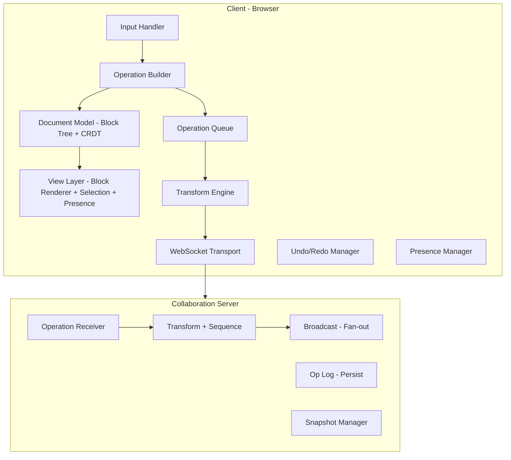

## Problem Statement

Real-time collaborative editing is the defining UX challenge of modern productivity software. Google Docs, Notion, Figma, Linear, and Coda all allow multiple users to simultaneously edit the same document with zero coordination overhead. The user types a character and it appears instantly—while a teammate's edits merge seamlessly into the same document without conflicts, lost data, or visible jank.

This problem is fundamentally different from building a single-user rich text editor. A single-user editor manages one authoritative document state with a linear undo history. A collaborative editor manages N divergent document states that must converge—every keystroke becomes a distributed systems problem.

The scope here is the **front-end collaboration architecture**: the document model, the conflict resolution pipeline (OT or CRDT), the presence system, the operation transport layer, and the rendering strategy that keeps local latency under 50ms while remote operations appear within 200ms. We are not designing the backend distribution layer, database schema, or authentication system—those are infrastructure concerns that sit behind the WebSocket boundary.

The core tension: **local responsiveness vs. global consistency**. The user must never wait for a network round-trip to see their own keystrokes. But every other user must eventually see the same document state. This is optimistic concurrency at the character level, and getting it wrong means data loss, ghost text, or infinite divergence.

### Why This Is Hard

| Challenge           | Single-User Editor    | Collaborative Editor                               |
| ------------------- | --------------------- | -------------------------------------------------- |
| State authority     | Local DOM is truth    | Server is truth, local is speculative              |
| Undo/Redo           | Linear stack          | Per-user inverse against transformed history       |
| Cursor position     | One cursor, trivial   | N cursors that shift as remote ops arrive          |
| Conflict resolution | None needed           | Every concurrent edit is a potential conflict      |
| Offline             | Autosave draft        | Queue ops, replay on reconnect, resolve divergence |
| Document size       | Render what's visible | Sync entire op log OR periodic snapshots           |

---

## Requirements Exploration

### Functional Requirements

| ID    | Requirement                                                                  | Priority |
| ----- | ---------------------------------------------------------------------------- | -------- |
| FR-1  | Real-time co-editing: multiple users edit the same document simultaneously   | P0       |
| FR-2  | Cursor and selection presence: see where each collaborator is working        | P0       |
| FR-3  | Conflict-free concurrent edits: no data loss when users edit the same region | P0       |
| FR-4  | Per-user undo/redo: undoing YOUR operations without affecting others         | P0       |
| FR-5  | Rich text formatting: bold, italic, headings, lists, code blocks             | P0       |
| FR-6  | Block-level structure: paragraphs, images, embeds, tables                    | P1       |
| FR-7  | Comments and suggestions: threaded discussions anchored to text ranges       | P1       |
| FR-8  | Version history: browse and restore previous document states                 | P1       |
| FR-9  | Offline editing: queue operations and reconcile on reconnect                 | P1       |
| FR-10 | Permissions: viewer, commenter, editor roles affect available operations     | P2       |

### Non-Functional Requirements

| NFR                             | Target              | Rationale                                               |
| ------------------------------- | ------------------- | ------------------------------------------------------- |
| Local keystroke latency         | < 50ms              | Users perceive > 100ms as lag; < 50ms feels instant     |
| Remote operation visibility     | < 200ms             | Collaborators must feel "live"—beyond 300ms feels async |
| Concurrent editors per document | 100+                | Large team reviews, all-hands editing, classrooms       |
| Offline operation queue         | 1000+ ops           | Support extended offline periods (flight, subway)       |
| Document size                   | 100K+ blocks        | Book-length documents, technical specifications         |
| Operation payload size          | < 200 bytes average | WebSocket bandwidth constraint at scale                 |
| Memory per document             | < 50MB              | Reasonable browser tab memory budget                    |
| Time to interactive             | < 2s                | Document must be editable within 2 seconds of opening   |

---

## Capacity Estimation & Constraints

### Operations Per Second

A fast typist generates ~8 characters/second. With 100 concurrent editors at peak activity:

```
Peak ops/sec per document = 100 editors × 8 ops/sec = 800 ops/sec
Average ops/sec (realistic) = 100 editors × 2 ops/sec = 200 ops/sec
```

Each operation must be transformed against all concurrent operations, broadcast to all peers, and acknowledged. The transform pipeline must handle 800 ops/sec without visible latency.

### WebSocket Connections

```
Connections per document = N concurrent editors = 100
Messages per second per connection = peer_ops + presence_updates
  = 200 ops/sec + 10 presence/sec = 210 msg/sec outbound per connection (fan-out)
Total outbound messages = 100 × 210 = 21,000 msg/sec per document
```

This is the fan-out problem: every operation must reach every peer. A naive implementation sends O(N²) messages per document.

### Operation Payload Sizes

```typescript
// Insert operation: ~80 bytes
{ type: "insert", position: 1423, content: "a", attributes: {}, clock: 847 }

// Delete operation: ~60 bytes
{ type: "delete", position: 1423, length: 1, clock: 848 }

// Format operation: ~120 bytes
{ type: "format", position: 100, length: 50, attributes: { bold: true }, clock: 849 }

// Presence update: ~150 bytes
{ type: "presence", cursor: { anchor: 1423, head: 1423 }, selection: null, userId: "u_abc", color: "#3b82f6" }
```

Average operation: ~100 bytes. At 800 ops/sec: **80 KB/sec bandwidth per document**.

### Document State Size

A 100K-block document with average 50 characters per block:

```
Text content = 100,000 × 50 = 5 MB raw text
Block metadata (type, attributes, id) = 100,000 × 200 bytes = 20 MB
Total document state in memory = ~25 MB
```

### Undo Stack Memory

Each user maintains their own undo stack. With 100 users, each with 100 undo entries:

```
Undo entries = 100 users × 100 entries × 200 bytes = 2 MB
```

Manageable. Cap at 200 entries per user with LRU eviction.

---

## Architecture / High-Level Design

### Rendering Strategy

The editor uses a **controlled rendering model**: the document model is the source of truth, and the DOM is a projection of that model. This is critical for collaboration because remote operations mutate the document model directly—the DOM must re-render from the model, not the other way around.

```
Document Model (CRDT/OT state)
        │
        ▼
  View Layer (renders model → DOM)
        │
        ▼
  Input Handler (captures DOM events → operations)
        │
        ▼
  Document Model (applies operation, triggers re-render)
```

We do NOT use `contenteditable` as the source of truth. The DOM is a view. Input events are intercepted, converted to operations against the model, and the DOM is updated from the model. This prevents the DOM and model from diverging when remote operations arrive.

### Navigation Model

Single-page document editor. No route transitions during editing. The URL identifies the document: `/docs/:documentId`. Navigation concerns:

- Deep links to specific blocks: `/docs/:documentId#block-:blockId`
- Version history as a modal/panel overlay, not a route change
- Comments panel as a sidebar, preserving editor state

### System Architecture Diagram



### Component Architecture

```
<CollaborativeEditor>
├── <EditorProvider>           // Document model + collaboration context
│   ├── <Toolbar>              // Formatting controls
│   ├── <EditorCanvas>         // Main editing surface
│   │   ├── <BlockRenderer>    // Renders individual blocks
│   │   │   ├── <ParagraphBlock>
│   │   │   ├── <HeadingBlock>
│   │   │   ├── <CodeBlock>
│   │   │   └── <ImageBlock>
│   │   ├── <SelectionOverlay> // Local user's selection
│   │   └── <PresenceLayer>    // Remote cursors + selections
│   │       ├── <RemoteCursor> // Individual cursor with label
│   │       └── <RemoteSelection> // Highlighted selection range
│   ├── <CommentsPanel>        // Sidebar for threaded comments
│   └── <PresenceAvatars>     // Top bar showing active users
└── <VersionHistory>           // Modal for browsing history
```

### State Management

Three distinct state domains with different update frequencies and persistence needs:

```typescript
// 1. Document State — the CRDT/OT document model
// Updated on every local AND remote operation
// Persisted to server via operation log
interface DocumentState {
  blocks: Block[];
  version: number;
  pendingOps: Operation[]; // Sent but not yet acknowledged
  bufferedOps: Operation[]; // Not yet sent (batching)
}

// 2. Presence State — ephemeral, high-frequency
// Updated 10-30 times/sec per user
// NOT persisted — rebuilt on connect
interface PresenceState {
  peers: Map<UserId, PeerPresence>;
  localCursor: CursorPosition;
  localSelection: SelectionRange | null;
}

// 3. UI State — local-only, no sync needed
interface UIState {
  isToolbarVisible: boolean;
  activePanel: "comments" | "history" | null;
  zoomLevel: number;
  findReplaceQuery: string;
}
```

<Callout>
  **Staff+ Insight:** The critical architectural decision is separating document
  state from presence state at the transport layer. Document operations require
  ordering guarantees and persistence. Presence updates are fire-and-forget—a
  lost presence update is immediately superseded by the next one. Using the same
  reliability guarantees for both wastes bandwidth and adds latency. Google Docs
  uses separate channels for ops vs. presence.
</Callout>

---

## Data Model / Entities

### Document Model

The document is a **flat list of blocks**, not a deeply nested tree. This is a deliberate choice: flat structures have simpler conflict resolution because operations reference block IDs and character offsets within blocks, not tree paths that shift when siblings are inserted.

```typescript
interface Document {
  id: DocumentId;
  title: string;
  blocks: Block[];
  version: number; // Server-assigned monotonic version
  createdAt: number;
  updatedAt: number;
}

interface Block {
  id: BlockId; // Stable UUID, never reused
  type: BlockType;
  content: TextContent; // Rich text content within the block
  attributes: BlockAttributes;
  indent: number; // Nesting level (0-based)
  parentId: BlockId | null; // For list items, toggle children
}

type BlockType =
  | "paragraph"
  | "heading-1"
  | "heading-2"
  | "heading-3"
  | "bulleted-list"
  | "numbered-list"
  | "todo-list"
  | "code"
  | "quote"
  | "divider"
  | "image"
  | "embed"
  | "table";

interface TextContent {
  // Flat array of text runs with formatting
  runs: TextRun[];
}

interface TextRun {
  text: string;
  marks: Mark[]; // Inline formatting
}

type Mark =
  | { type: "bold" }
  | { type: "italic" }
  | { type: "underline" }
  | { type: "strikethrough" }
  | { type: "code" }
  | { type: "link"; href: string }
  | { type: "comment"; commentId: string }
  | { type: "highlight"; color: string };

interface BlockAttributes {
  language?: string; // For code blocks
  level?: 1 | 2 | 3; // For headings
  checked?: boolean; // For todo items
  url?: string; // For images/embeds
  alignment?: "left" | "center" | "right";
}
```

### Operation Types

Operations are the atomic unit of change. Every edit—no matter how complex—decomposes into these primitives:

```typescript
type Operation =
  | InsertTextOp
  | DeleteTextOp
  | FormatTextOp
  | InsertBlockOp
  | DeleteBlockOp
  | MoveBlockOp
  | UpdateBlockOp
  | SplitBlockOp
  | MergeBlockOp;

interface InsertTextOp {
  type: "insert_text";
  blockId: BlockId;
  offset: number; // Character offset within the block
  text: string;
  marks: Mark[]; // Formatting of inserted text
}

interface DeleteTextOp {
  type: "delete_text";
  blockId: BlockId;
  offset: number;
  length: number;
}

interface FormatTextOp {
  type: "format_text";
  blockId: BlockId;
  offset: number;
  length: number;
  mark: Mark;
  action: "add" | "remove";
}

interface InsertBlockOp {
  type: "insert_block";
  block: Block;
  afterBlockId: BlockId | null; // null = insert at beginning
}

interface DeleteBlockOp {
  type: "delete_block";
  blockId: BlockId;
}

interface MoveBlockOp {
  type: "move_block";
  blockId: BlockId;
  afterBlockId: BlockId | null;
}

interface UpdateBlockOp {
  type: "update_block";
  blockId: BlockId;
  attributes: Partial<BlockAttributes>;
}

interface SplitBlockOp {
  type: "split_block";
  blockId: BlockId;
  offset: number; // Split point within the block's text
  newBlockId: BlockId; // Pre-generated ID for the new block
}

interface MergeBlockOp {
  type: "merge_block";
  blockId: BlockId; // Block being merged INTO the previous block
}
```

### CRDT Operation Shape

If using a CRDT (Yjs-style), operations carry additional metadata for conflict-free merging:

```typescript
interface CRDTOperation {
  id: OperationId; // Globally unique (clientId + clock)
  clientId: ClientId; // Identifies the originating client
  clock: number; // Lamport clock for causal ordering
  origin: OperationId | null; // The operation this was created "after"
  content: Operation; // The actual edit
  deleted: boolean; // Tombstone for deletion (CRDT never truly deletes)
}

// For OT, operations carry a simpler envelope:
interface OTEnvelope {
  clientId: ClientId;
  revision: number; // Server revision this op is based on
  operation: Operation;
}
```

### Presence State

```typescript
interface PeerPresence {
  userId: UserId;
  userName: string;
  userColor: string; // Assigned deterministically from userId hash
  cursor: CursorPosition | null;
  selection: SelectionRange | null;
  lastActivity: number; // Timestamp for stale cursor cleanup
  isTyping: boolean;
}

interface CursorPosition {
  blockId: BlockId;
  offset: number; // Character offset within the block
}

interface SelectionRange {
  anchor: CursorPosition; // Where the selection started
  focus: CursorPosition; // Where it ends (may be before anchor)
}
```

### Version/Snapshot Types

```typescript
interface DocumentSnapshot {
  documentId: DocumentId;
  version: number;
  blocks: Block[];
  takenAt: number;
  operationsSinceLastSnapshot: number;
}

interface VersionHistoryEntry {
  version: number;
  authorId: UserId;
  authorName: string;
  timestamp: number;
  operationCount: number; // Ops in this version batch
  summary: string; // Auto-generated: "Edited paragraph 3, added heading"
}
```

<Callout>
  **Staff+ Insight:** Block IDs must be UUIDs generated client-side, not
  server-assigned sequential IDs. Two users creating blocks simultaneously must
  not collide on IDs. The ID is the stable reference point for all operations—if
  IDs collide, the entire conflict resolution system breaks. Use
  `crypto.randomUUID()` on modern browsers.
</Callout>

---

## Interface Definition (API)

### WebSocket Protocol

The WebSocket connection handles two message types: **operations** (ordered, persisted) and **presence** (unordered, ephemeral).

```typescript
// Client → Server messages
type ClientMessage =
  | { type: "operation"; payload: OTEnvelope }
  | { type: "presence"; payload: PresenceUpdate }
  | { type: "subscribe"; documentId: DocumentId }
  | { type: "ack"; version: number };

// Server → Client messages
type ServerMessage =
  | { type: "operation"; payload: RemoteOperation }
  | { type: "ack"; version: number; transformedOp: Operation }
  | { type: "presence"; payload: PeerPresence }
  | { type: "peer_join"; payload: PeerPresence }
  | { type: "peer_leave"; payload: { userId: UserId } }
  | { type: "snapshot"; payload: DocumentSnapshot }
  | { type: "error"; payload: { code: string; message: string } };

interface RemoteOperation {
  clientId: ClientId;
  version: number; // Server-assigned version number
  operation: Operation;
  timestamp: number;
}

interface PresenceUpdate {
  cursor: CursorPosition | null;
  selection: SelectionRange | null;
  isTyping: boolean;
}
```

### Operation Acknowledgement Flow

The OT acknowledgement protocol follows the **Jupiter algorithm** pattern:

```
Client A                    Server                    Client B
   │                          │                          │
   │──── op(rev=5) ──────────▶│                          │
   │                          │── transform(op, concurrent)
   │                          │                          │
   │◀──── ack(ver=6) ─────────│                          │
   │                          │──── op'(ver=6) ─────────▶│
   │                          │                          │
   │                          │◀──── op(rev=5) ──────────│
   │                          │── transform(op, concurrent)
   │                          │                          │
   │◀──── op'(ver=7) ─────────│                          │
   │                          │──── ack(ver=7) ─────────▶│
```

Client state machine:

```typescript
type ClientSyncState =
  | { type: "synchronized"; version: number }
  | {
      type: "awaiting_ack";
      version: number;
      pending: Operation;
      buffer: Operation[];
    }
  | {
      type: "awaiting_ack_with_buffer";
      version: number;
      pending: Operation;
      buffer: Operation[];
    };
```

When in `awaiting_ack`:

1. Local ops are buffered
2. On ack: pending is confirmed, send buffer as next pending
3. On remote op: transform pending and buffer against the remote op

### REST API for Document Operations

```typescript
// Load document (initial state)
// GET /api/documents/:documentId
interface LoadDocumentResponse {
  document: DocumentSnapshot;
  version: number;
  collaborators: PeerPresence[];
  permissions: DocumentPermissions;
}

// Save explicit snapshot (manual save / version checkpoint)
// POST /api/documents/:documentId/snapshots
interface CreateSnapshotRequest {
  title?: string; // Optional version label
}

// List version history
// GET /api/documents/:documentId/history?limit=50&before=:version
interface VersionHistoryResponse {
  entries: VersionHistoryEntry[];
  hasMore: boolean;
}

// Restore to a previous version
// POST /api/documents/:documentId/restore
interface RestoreVersionRequest {
  targetVersion: number;
}

// Get operations since a version (for reconnection)
// GET /api/documents/:documentId/operations?since=:version
interface OperationsSinceResponse {
  operations: RemoteOperation[];
  currentVersion: number;
}
```

### Conflict Resolution Protocol

For OT, the server is the single authority that sequences operations:

```typescript
// Server-side transform function signature
function transform(
  operationA: Operation, // Earlier in server sequence
  operationB: Operation, // Later, needs transformation
): [Operation, Operation] {
  // [A', B'] — transformed pair
  // Returns transformed versions that commute:
  // apply(apply(doc, A), B') === apply(apply(doc, B), A')
}

// Example: two concurrent inserts at the same position
// User A inserts "hello" at offset 5
// User B inserts "world" at offset 5
// Server receives A first:
//   A' = insert("hello", 5)  — unchanged, it's first
//   B' = insert("world", 10) — shifted by length of A's insert
```

<Callout>
  **Staff+ Insight:** The transform function must handle ALL pairs of operation
  types. With 9 operation types, that's 81 transform pairs. This is the most
  bug-prone part of an OT system. Google Docs reportedly has thousands of lines
  of transform logic. For a CRDT approach (Yjs), this complexity moves into the
  data structure itself—the CRDT's merge function handles conflicts implicitly.
  The tradeoff: OT is conceptually simpler but has more edge cases in
  implementation; CRDTs are harder to understand but have fewer runtime bugs
  once correct.
</Callout>

---

## Caching Strategy

### Document Snapshot Cache

```typescript
interface SnapshotCache {
  // In-memory LRU cache of recent document snapshots
  // Key: documentId + version
  // Eviction: LRU with max 10 snapshots per document
  get(documentId: DocumentId, version: number): DocumentSnapshot | null;
  set(documentId: DocumentId, snapshot: DocumentSnapshot): void;
}
```

The latest snapshot is always cached in memory. When a user opens a document:

1. Load latest snapshot from cache (or fetch from server)
2. Apply any operations since the snapshot version
3. Subscribe to real-time operations

Snapshots are taken every 100 operations or every 5 minutes (whichever comes first). This bounds the number of operations that must be replayed on document load.

### Operation Log Cache

```typescript
interface OperationLogCache {
  // Circular buffer of recent operations per document
  // Used for:
  //   1. Transforming late-arriving operations
  //   2. Undo/redo history
  //   3. Reconnection replay
  maxSize: 1000; // Operations per document

  append(op: RemoteOperation): void;
  getSince(version: number): RemoteOperation[];
  getByClient(clientId: ClientId, limit: number): RemoteOperation[];
}
```

### Offline Operation Queue

```typescript
interface OfflineQueue {
  // Persisted to IndexedDB for survival across page reloads
  storage: "indexeddb";
  maxOps: 1000;

  enqueue(op: Operation): void;
  dequeueAll(): Operation[];
  clear(): void;
  size(): number;
}

// IndexedDB schema for offline queue
interface OfflineQueueEntry {
  id: number; // Auto-increment
  documentId: DocumentId;
  operation: Operation;
  timestamp: number;
  lastKnownVersion: number; // Server version when op was created
}
```

On reconnect:

1. Fetch all operations from server since `lastKnownVersion`
2. Transform queued operations against server operations
3. Send transformed operations to server
4. Clear queue on acknowledgement

### Collaboration State Cache

```typescript
interface CollaborationCache {
  // WebSocket connection state
  connectionState: "connected" | "connecting" | "disconnected";

  // Presence state (in-memory only, never persisted)
  peers: Map<UserId, PeerPresence>;

  // Local pending state
  pendingOps: Operation[]; // Sent, awaiting ack
  bufferedOps: Operation[]; // Not yet sent

  // Color assignment cache
  colorAssignments: Map<UserId, string>;
}
```

Color assignment uses a deterministic hash of the userId to select from a predefined palette of 12 high-contrast colors. This ensures the same user always gets the same color across sessions without coordination.

```typescript
const PRESENCE_COLORS = [
  "#3b82f6",
  "#ef4444",
  "#10b981",
  "#f59e0b",
  "#8b5cf6",
  "#ec4899",
  "#06b6d4",
  "#84cc16",
  "#f97316",
  "#6366f1",
  "#14b8a6",
  "#e11d48",
];

function assignColor(userId: string): string {
  const hash = hashString(userId);
  return PRESENCE_COLORS[hash % PRESENCE_COLORS.length];
}
```

---

## Rendering & Performance Deep Dive

### Keystroke-to-Screen Latency Budget

The 50ms budget breaks down as:

```
Event dispatch (browser)        :  2ms
Input handler + op creation     :  3ms
Local model update              :  5ms
View reconciliation             : 10ms
DOM mutation + paint            : 15ms
─────────────────────────────────────
Total budget                    : 35ms (15ms headroom)
```

Critical constraint: **the network round-trip is NOT in the local latency path**. The operation is applied locally immediately (optimistic), then sent to the server asynchronously. If the server rejects or transforms the op, we reconcile later.

### Efficient DOM Updates for Remote Operations

Remote operations arrive as model mutations. The challenge: updating the DOM without disrupting the local user's cursor, selection, or scroll position.

```typescript
class RemoteOperationRenderer {
  applyRemoteInsert(op: InsertTextOp): void {
    // 1. Save local selection state
    const savedSelection = this.saveSelection();

    // 2. Update the document model
    this.model.apply(op);

    // 3. Re-render only the affected block
    this.renderBlock(op.blockId);

    // 4. Adjust local cursor if it was after the insertion point
    const adjustedSelection = this.adjustSelection(savedSelection, op);

    // 5. Restore local selection
    this.restoreSelection(adjustedSelection);
  }

  private adjustSelection(
    selection: SelectionState,
    op: InsertTextOp,
  ): SelectionState {
    if (selection.blockId !== op.blockId) return selection;
    if (selection.offset <= op.offset) return selection;

    // Shift cursor right by the length of the inserted text
    return {
      ...selection,
      offset: selection.offset + op.text.length,
    };
  }
}
```

### Large Document Performance (10K+ Blocks)

For documents with thousands of blocks, rendering all blocks is prohibitive. Use **virtualization**:

```typescript
interface VirtualizedEditor {
  // Only render blocks visible in the viewport + buffer
  visibleRange: { start: number; end: number };
  bufferSize: 20; // Blocks above/below viewport

  // Block height estimation for scroll calculations
  estimatedBlockHeight: 24; // px, refined as blocks render
  measuredHeights: Map<BlockId, number>;

  // Total document height for scrollbar
  totalHeight: number; // Sum of measured + estimated
}
```

Virtualization interacts with collaboration:

- Remote operations on off-screen blocks update the model but don't trigger DOM renders
- When the user scrolls to those blocks, they render the already-updated model
- Presence cursors in off-screen blocks show as "User X is editing below" indicators

### Selection Rendering Across Users

Remote selections are rendered as colored overlays, NOT using the browser's native selection API (which only supports one selection per document):

```typescript
interface RemoteSelectionRenderer {
  render(peer: PeerPresence): void {
    if (!peer.selection) return;

    // Calculate rectangles for the selection range
    const rects = this.getSelectionRects(peer.selection);

    // Render as absolutely positioned divs with user's color
    rects.forEach(rect => {
      this.renderHighlight(rect, peer.userColor, 0.2); // 20% opacity
    });

    // Render cursor caret at the focus position
    this.renderCursor(peer.cursor, peer.userColor, peer.userName);
  }

  private getSelectionRects(range: SelectionRange): DOMRect[] {
    // Use Range API to get the visual rectangles
    const domRange = this.selectionToDOMRange(range);
    return Array.from(domRange.getClientRects());
  }
}
```

### Rendering Pipeline Optimizations

| Optimization            | Technique                                                 | Impact                      |
| ----------------------- | --------------------------------------------------------- | --------------------------- |
| Block-level granularity | Only re-render the block containing the edit              | 10x fewer DOM mutations     |
| Batched remote ops      | Collect remote ops for 16ms (one frame), apply together   | Eliminates layout thrashing |
| Request animation frame | Schedule DOM updates in rAF                               | Consistent 60fps            |
| Text node splitting     | Modify text nodes directly instead of replacing innerHTML | Preserves IME composition   |
| Off-screen updates      | Skip DOM render for virtualized blocks                    | O(1) instead of O(N)        |

<Callout>
  **Staff+ Insight:** The hardest rendering bug in collaborative editors is IME
  (Input Method Editor) composition. CJK input, autocomplete, and emoji pickers
  all use composition events. During composition, you MUST NOT mutate the DOM
  text node the user is composing in—even if a remote operation targets that
  exact text. Queue remote DOM updates until `compositionend` fires. Google Docs
  and Notion both have complex IME-aware rendering paths for this reason.
</Callout>

---

## Security Deep Dive

### Threat Model

| Threat                 | Vector                              | Impact                         | Mitigation                                              |
| ---------------------- | ----------------------------------- | ------------------------------ | ------------------------------------------------------- |
| Malicious operations   | Crafted WebSocket messages          | Document corruption, data loss | Server-side operation validation                        |
| Operation replay       | Capture and resend operations       | Duplicate edits, confusion     | Idempotency via operation IDs + version checks          |
| Unauthorized access    | Stolen WebSocket URL                | Read/modify private documents  | Token-based auth on WebSocket handshake                 |
| XSS via pasted content | Paste HTML with scripts             | Session hijack, data exfil     | Sanitize all pasted content server-side and client-side |
| Rate limiting bypass   | Automated operation flooding        | DoS on collaboration server    | Per-client rate limits (100 ops/sec hard cap)           |
| Cursor spoofing        | Fake presence updates               | Social engineering, confusion  | Server validates userId matches authenticated session   |
| Operation size bomb    | Giant insert operation              | Memory exhaustion              | Max operation payload: 1MB, max text per op: 10K chars  |
| History manipulation   | Forge operations with past versions | Alter document history         | Server rejects ops with version < current - window      |

### Operation Validation

Every operation is validated server-side before sequencing:

```typescript
function validateOperation(
  op: Operation,
  doc: DocumentState,
  client: ClientSession,
): ValidationResult {
  // 1. Authentication: client has edit permissions
  if (!client.permissions.includes("edit")) {
    return { valid: false, error: "PERMISSION_DENIED" };
  }

  // 2. Rate limiting: max 100 ops/sec per client
  if (client.opsThisSecond > 100) {
    return { valid: false, error: "RATE_LIMITED" };
  }

  // 3. Structural validity: operation references valid block/offset
  if (op.type === "insert_text") {
    const block = doc.getBlock(op.blockId);
    if (!block) return { valid: false, error: "BLOCK_NOT_FOUND" };
    if (op.offset < 0 || op.offset > block.textLength) {
      return { valid: false, error: "INVALID_OFFSET" };
    }
    if (op.text.length > 10000) {
      return { valid: false, error: "TEXT_TOO_LARGE" };
    }
  }

  // 4. Content sanitization: strip dangerous content
  if (op.type === "insert_text") {
    op.text = sanitizeText(op.text);
  }

  // 5. Version validity: operation is based on a recent version
  if (op.revision < doc.version - 1000) {
    return { valid: false, error: "VERSION_TOO_OLD" };
  }

  return { valid: true };
}
```

### Content Sanitization

Pasted HTML is sanitized at two layers:

```typescript
// Client-side: immediate sanitization on paste
function handlePaste(event: ClipboardEvent): void {
  event.preventDefault();

  const html = event.clipboardData?.getData("text/html");
  if (html) {
    const sanitized = DOMPurify.sanitize(html, {
      ALLOWED_TAGS: ["b", "i", "u", "a", "code", "br", "p", "ul", "ol", "li"],
      ALLOWED_ATTR: ["href"],
      ALLOW_DATA_ATTR: false,
    });
    const operations = htmlToOperations(sanitized);
    this.applyOperations(operations);
  } else {
    const text = event.clipboardData?.getData("text/plain") ?? "";
    this.insertText(text);
  }
}

// Server-side: validate all text content in operations
function sanitizeText(text: string): string {
  // Remove zero-width characters that could hide content
  // Remove control characters except newlines
  // Normalize unicode to NFC
  return text
    .replace(/[\u200B-\u200F\u2028-\u202F]/g, "")
    .replace(/[\x00-\x08\x0B\x0C\x0E-\x1F]/g, "")
    .normalize("NFC");
}
```

### WebSocket Authentication

```typescript
// WebSocket connection with auth token
function connectWebSocket(documentId: string, token: string): WebSocket {
  const ws = new WebSocket(
    `wss://collab.example.com/ws?doc=${documentId}&token=${token}`,
  );

  // Token is validated on handshake
  // Connection is rejected if token is invalid or expired
  // Token refresh happens via a separate REST endpoint

  return ws;
}
```

---

## Scalability & Reliability

### Scaling to 100+ Concurrent Editors

The fan-out problem: with 100 editors, every operation generates 99 outbound messages. Solutions:

| Strategy             | Description                                          | Tradeoff                            |
| -------------------- | ---------------------------------------------------- | ----------------------------------- |
| Server fan-out       | Server maintains all connections, broadcasts to each | Simple but server is bottleneck     |
| Pub/sub layer        | Redis pub/sub or NATS between server instances       | Horizontal scaling, added latency   |
| Client-side batching | Batch ops into 16ms frames before broadcast          | Reduces message count, adds latency |
| Delta compression    | Send only diffs from last acknowledged state         | Reduces bandwidth, adds CPU         |

For 100+ editors, the server fan-out model requires:

- Dedicated collaboration server instance per document (at this scale)
- WebSocket connection pooling
- Operation batching: collect ops for 50ms, broadcast as batch

```typescript
class OperationBatcher {
  private buffer: RemoteOperation[] = [];
  private timer: number | null = null;
  private readonly BATCH_INTERVAL = 50; // ms

  add(op: RemoteOperation): void {
    this.buffer.push(op);
    if (!this.timer) {
      this.timer = setTimeout(() => this.flush(), this.BATCH_INTERVAL);
    }
  }

  private flush(): void {
    const batch = this.buffer;
    this.buffer = [];
    this.timer = null;
    this.broadcast({ type: "operation_batch", operations: batch });
  }
}
```

### Operation Compaction

Over time, the operation log grows unboundedly. Compaction reduces storage and replay time:

```typescript
function compactOperations(ops: Operation[]): Operation[] {
  // Merge adjacent inserts from the same user at sequential offsets
  // "h" + "e" + "l" + "l" + "o" → "hello" at original offset

  // Cancel out insert + delete of same content
  // insert("x", 5) + delete(5, 1) → no-op

  // Merge format operations on overlapping ranges
  // bold(0, 5) + bold(3, 7) → bold(0, 7)

  return compacted;
}
```

Compaction runs during snapshot creation: the snapshot captures the full document state, and the operation log is truncated to only operations after the snapshot.

### Snapshot Intervals

```
Snapshot trigger conditions:
  1. Every 100 operations (bounds replay on load)
  2. Every 5 minutes of activity (bounds replay on crash)
  3. When a user explicitly saves/names a version
  4. When document is idle for 30 seconds after edits (debounced persistence)
```

### WebSocket Reconnection

```typescript
class WebSocketManager {
  private reconnectAttempts = 0;
  private maxReconnectAttempts = 10;
  private lastAckedVersion: number;

  private reconnect(): void {
    const delay = Math.min(
      1000 * Math.pow(2, this.reconnectAttempts), // Exponential backoff
      30000, // Max 30s
    );

    setTimeout(async () => {
      this.reconnectAttempts++;

      // 1. Reconnect WebSocket
      await this.connect();

      // 2. Fetch operations since last acknowledged version
      const missedOps = await this.fetchOpsSince(this.lastAckedVersion);

      // 3. Transform local pending/buffered ops against missed ops
      this.reconcileLocalState(missedOps);

      // 4. Re-send pending operations
      this.resendPending();

      // 5. Re-send presence
      this.sendPresence();

      this.reconnectAttempts = 0;
    }, delay);
  }

  private reconcileLocalState(missedOps: RemoteOperation[]): void {
    // Apply OT transform: local pending ops vs. missed remote ops
    for (const remoteOp of missedOps) {
      // Transform pending ops against each missed remote op
      this.pendingOps = this.pendingOps.map(
        (localOp) => transform(remoteOp.operation, localOp)[1],
      );

      // Apply remote op to local document model
      this.model.apply(remoteOp.operation);
    }
  }
}
```

### Offline Reconnection with Operation Replay

```typescript
class OfflineManager {
  private queue: OfflineQueue;
  private isOnline: boolean = navigator.onLine;

  constructor() {
    window.addEventListener("online", () => this.handleOnline());
    window.addEventListener("offline", () => this.handleOffline());
  }

  private handleOffline(): void {
    this.isOnline = false;
    // Operations continue to be created and queued locally
    // UI shows "Offline — changes will sync when reconnected"
  }

  private async handleOnline(): Promise<void> {
    this.isOnline = true;

    // 1. Reconnect WebSocket
    await this.wsManager.connect();

    // 2. Get all ops from server since our last known version
    const serverOps = await this.fetchOpsSince(this.queue.lastKnownVersion);

    // 3. Transform ALL queued operations against ALL server ops
    let localOps = this.queue.dequeueAll();
    for (const serverOp of serverOps) {
      localOps = localOps.map((localOp) => {
        const [, transformedLocal] = transform(serverOp.operation, localOp);
        return transformedLocal;
      });
      // Apply server op to model
      this.model.apply(serverOp.operation);
    }

    // 4. Send transformed local ops to server
    for (const op of localOps) {
      this.wsManager.send({ type: "operation", payload: op });
    }

    // 5. Clear offline queue
    this.queue.clear();
  }
}
```

<Callout>
  **Staff+ Insight:** The offline reconciliation is the hardest correctness
  challenge. If a user is offline for an hour while 500 operations arrive,
  transforming their 200 queued operations against all 500 server ops requires
  100,000 transform calls. This is O(M×N) where M is local ops and N is remote
  ops. For large offline periods, it may be cheaper to rebase: take the server's
  current snapshot, diff it against the user's local state, and generate a
  minimal set of operations. This is what Figma does for long disconnections.
</Callout>

---

## Accessibility Deep Dive

### Collaborative Editor Accessibility Challenges

Real-time collaboration introduces unique a11y concerns beyond standard rich text editing:

| Challenge                    | Screen Reader Impact               | Solution                           |
| ---------------------------- | ---------------------------------- | ---------------------------------- |
| Remote edits appear silently | User doesn't know document changed | ARIA live region announcements     |
| Multiple cursors             | Can't see other users' positions   | Audio cues + describedby           |
| Presence indicators          | Visual-only user avatars           | Screen reader list of active users |
| Conflict resolution          | Text shifts unexpectedly           | Announce position changes          |

### Announcing Remote Edits

```typescript
class AccessibleCollaborationAnnouncer {
  private announcer: HTMLElement;
  private announceDebounce = 2000; // Don't spam—batch announcements
  private pendingAnnouncements: string[] = [];

  constructor() {
    this.announcer = document.createElement("div");
    this.announcer.setAttribute("role", "log");
    this.announcer.setAttribute("aria-live", "polite");
    this.announcer.setAttribute("aria-atomic", "false");
    this.announcer.className = "sr-only"; // Visually hidden
    document.body.appendChild(this.announcer);
  }

  announceRemoteEdit(userName: string, blockType: string): void {
    this.pendingAnnouncements.push(`${userName} edited a ${blockType}`);
    this.scheduleAnnouncement();
  }

  announceUserJoin(userName: string): void {
    this.announce(`${userName} joined the document`);
  }

  announceUserLeave(userName: string): void {
    this.announce(`${userName} left the document`);
  }

  private scheduleAnnouncement(): void {
    // Debounce: if 5 edits come in 2 seconds, announce once
    clearTimeout(this.timer);
    this.timer = setTimeout(() => {
      const count = this.pendingAnnouncements.length;
      if (count === 1) {
        this.announce(this.pendingAnnouncements[0]);
      } else {
        this.announce(`${count} edits from collaborators`);
      }
      this.pendingAnnouncements = [];
    }, this.announceDebounce);
  }

  private announce(message: string): void {
    const node = document.createElement("p");
    node.textContent = message;
    this.announcer.appendChild(node);
    // Remove after 10s to prevent DOM bloat
    setTimeout(() => node.remove(), 10000);
  }
}
```

### Cursor Labels and Presence

Remote cursors must be perceivable by screen readers:

```typescript
function renderRemoteCursor(peer: PeerPresence): JSX.Element {
  return (
    <span
      className="remote-cursor"
      style={{ borderColor: peer.userColor }}
      aria-hidden="false"
      aria-label={`${peer.userName}'s cursor`}
      role="img"
    >
      <span className="remote-cursor-label" aria-hidden="true">
        {peer.userName}
      </span>
    </span>
  );
}
```

### Keyboard Shortcuts

| Action                | Shortcut    | Context            |
| --------------------- | ----------- | ------------------ |
| Bold                  | Cmd+B       | Text selected      |
| Italic                | Cmd+I       | Text selected      |
| Undo                  | Cmd+Z       | Always             |
| Redo                  | Cmd+Shift+Z | Always             |
| Show collaborators    | Cmd+Shift+P | Always             |
| Jump to next cursor   | Cmd+]       | Collaboration mode |
| Jump to prev cursor   | Cmd+[       | Collaboration mode |
| Toggle comments panel | Cmd+Shift+M | Always             |

All shortcuts are discoverable via a keyboard shortcut panel (Cmd+/) and announced to screen readers when focused.

### Focus Management

```typescript
// When a remote operation moves the user's focus target (e.g., block deletion)
function handleBlockDeletion(deletedBlockId: BlockId): void {
  const focusedBlockId = this.getFocusedBlockId();

  if (focusedBlockId === deletedBlockId) {
    // Move focus to the previous block
    const prevBlock = this.getPreviousBlock(deletedBlockId);
    if (prevBlock) {
      this.focusBlock(prevBlock.id, "end");
      this.announce(`Block deleted by collaborator. Moved to previous block.`);
    }
  }
}
```

---

## Monitoring & Observability

### Key Metrics Dashboard

| Metric                      | Target            | Alert Threshold | Measurement                            |
| --------------------------- | ----------------- | --------------- | -------------------------------------- |
| Local keystroke latency     | < 50ms p95        | > 80ms p95      | Performance.now() around input handler |
| Operation round-trip time   | < 200ms p95       | > 500ms p95     | Send timestamp to ack timestamp        |
| WebSocket reconnection rate | < 0.1/min/user    | > 1/min/user    | Reconnection event counter             |
| Operation transform time    | < 5ms p99         | > 20ms p99      | Transform function instrumentation     |
| Conflict rate               | < 5% of ops       | > 20% of ops    | Server-side transform-needed counter   |
| Document divergence         | 0 (must converge) | Any divergence  | Periodic checksum comparison           |
| Offline queue size          | < 100 ops         | > 500 ops       | Queue length on reconnect              |
| Presence update latency     | < 100ms p95       | > 300ms p95     | Presence send to peer receive          |
| Memory usage                | < 50MB per doc    | > 100MB per doc | Performance.memory sampling            |
| WebSocket message rate      | < 1000/sec/doc    | > 5000/sec/doc  | Server-side message counter            |

### Document Divergence Detection

The most critical monitor: detecting when clients have diverged from the server state.

```typescript
class DivergenceDetector {
  private checksumInterval = 30000; // Every 30 seconds

  start(): void {
    setInterval(() => this.checkDivergence(), this.checksumInterval);
  }

  private async checkDivergence(): Promise<void> {
    // 1. Compute local document checksum
    const localChecksum = this.computeChecksum(this.model.getBlocks());
    const localVersion = this.model.getVersion();

    // 2. Request server checksum for same version
    const serverChecksum = await this.fetchServerChecksum(localVersion);

    // 3. Compare
    if (localChecksum !== serverChecksum) {
      // CRITICAL: document has diverged
      this.reportDivergence({
        localVersion,
        localChecksum,
        serverChecksum,
        pendingOps: this.syncManager.pendingOps.length,
      });

      // Recovery: request full snapshot from server
      await this.forceResync();
    }
  }

  private computeChecksum(blocks: Block[]): string {
    // FNV-1a hash of serialized block content
    const serialized = blocks
      .map((b) => `${b.id}:${b.type}:${serializeContent(b.content)}`)
      .join("|");
    return fnv1a(serialized);
  }
}
```

### Operation Latency Tracing

```typescript
class OperationTracer {
  private traces: Map<string, OperationTrace> = new Map();

  startTrace(op: Operation): string {
    const traceId = crypto.randomUUID();
    this.traces.set(traceId, {
      operationType: op.type,
      createdAt: performance.now(),
      localAppliedAt: null,
      sentAt: null,
      ackedAt: null,
      peersReceivedAt: null, // Estimated from presence updates
    });
    return traceId;
  }

  markSent(traceId: string): void {
    const trace = this.traces.get(traceId);
    if (trace) trace.sentAt = performance.now();
  }

  markAcked(traceId: string): void {
    const trace = this.traces.get(traceId);
    if (trace) {
      trace.ackedAt = performance.now();
      this.reportMetric("op_round_trip", trace.ackedAt - trace.createdAt);
      this.traces.delete(traceId);
    }
  }

  private reportMetric(name: string, value: number): void {
    // Send to observability backend (DataDog, Grafana, etc.)
    performance.mark(`collab:${name}`, { detail: { value } });
  }
}
```

---

## Trade-offs

| Decision            | Option A                                        | Option B                                  | Chosen                                    | Justification                                                                                                                                                                                                        |
| ------------------- | ----------------------------------------------- | ----------------------------------------- | ----------------------------------------- | -------------------------------------------------------------------------------------------------------------------------------------------------------------------------------------------------------------------- |
| Conflict resolution | OT (Operational Transform)                      | CRDT (Conflict-free Replicated Data Type) | **OT for text, CRDT for block structure** | OT is simpler for character-level text edits with a central server. CRDTs shine for structural changes (block reorder, tree mutations) where commutativity matters. Hybrid approach gets the best of both.           |
| Server topology     | Centralized (single authority)                  | Peer-to-peer                              | **Centralized**                           | P2P eliminates the server bottleneck but makes operation ordering non-deterministic, complicates permissions, and requires every client to run the full transform engine. Centralized gives total ordering for free. |
| CRDT flavor         | Operation-based (op-based)                      | State-based (CvRDT)                       | **Operation-based**                       | State-based CRDTs transmit the entire state on merge—impractical for large documents. Op-based CRDTs transmit only the operation (100 bytes vs. megabytes).                                                          |
| Document model      | Flat block list                                 | Nested tree                               | **Flat with indent levels**               | Trees have complex conflict resolution for sibling reordering. Flat lists with indent levels (like Notion) are simpler to merge while still representing hierarchy.                                                  |
| Undo model          | Global undo (undo last op regardless of author) | Per-user undo (undo only YOUR ops)        | **Per-user undo**                         | Global undo is confusing in multiplayer—undoing someone else's edit is destructive. Per-user undo requires inverse transforms but matches user intent.                                                               |
| Presence transport  | Same WebSocket as ops                           | Separate UDP/WebRTC channel               | **Same WebSocket, lower priority**        | Separate channel adds complexity. Instead, presence messages are marked as lossy—the server can drop stale presence if backpressured.                                                                                |
| Offline strategy    | Block edits when offline                        | Queue and reconcile                       | **Queue and reconcile**                   | Blocking edits destroys the user experience. Queuing with transform-on-reconnect preserves local productivity. Risk: large divergence on long offline periods.                                                       |
| Rendering           | ContentEditable as source of truth              | Model-driven rendering                    | **Model-driven**                          | ContentEditable is notoriously buggy for programmatic manipulation. Model-driven ensures remote ops can update the document without fighting browser state. The model is truth; DOM is a projection.                 |
| Snapshot strategy   | Full document every N ops                       | Incremental snapshots (deltas)            | **Full snapshots every 100 ops**          | Incremental snapshots require complex reconstruction. Full snapshots are larger but trivial to load—just deserialize and render. 100 ops bounds replay time to ~50ms.                                                |
| Block IDs           | Sequential server-assigned                      | Client-generated UUIDs                    | **Client UUIDs**                          | Sequential IDs require a server round-trip before creating a block. UUIDs allow instant local block creation with zero-latency. Collision probability is negligible (2^-122).                                        |

<Callout>
  **Staff+ Insight:** The OT vs. CRDT decision is not binary. Production systems
  like Notion use a hybrid: CRDT-like structures for the block tree (where order
  conflicts are common) and OT for inline text within blocks (where sequential
  transforms are simpler and the central server provides total ordering). This
  is the "right tool for the right layer" principle.
</Callout>

---

## What Great Looks Like

### Senior Engineer (L5)

A senior engineer designing this system demonstrates:

- Clear articulation of the OT transform pipeline: local apply → send → server sequences → broadcast → peers transform and apply
- Correct implementation of the client state machine (synchronized → awaiting ack → awaiting ack with buffer)
- Understanding that presence and operations have different reliability requirements
- Block-based document model with stable IDs
- Basic conflict resolution for same-position inserts (earlier client wins, later client shifts)
- Awareness of the cursor adjustment problem (remote inserts shift your cursor)
- Offline queue with IndexedDB persistence

### Staff Engineer (L6)

A staff engineer adds:

- Deep analysis of OT vs. CRDT tradeoffs with specific justification for the chosen approach
- Per-user undo implementation using inverse operations transformed against the operation log
- IME-aware rendering that defers DOM updates during composition
- Divergence detection with checksum-based verification
- Operation compaction and snapshot intervals that bound both storage and replay time
- Horizontal scaling strategy: per-document collaboration servers with pub/sub for cross-instance communication
- Memory budget analysis: how 100 concurrent editors affect the server's memory per document

### Principal Engineer (L7)

A principal engineer demonstrates:

- Formal reasoning about convergence: proving that the transform function satisfies TP1 (transformation property 1: commutativity after transform)
- Hybrid OT/CRDT architecture: CRDTs for structural operations (block reorder, tree mutations) and OT for inline text
- Latency budget breakdown at each pipeline stage with measurement strategy
- Analysis of pathological cases: what happens when 100 users all edit the same word simultaneously? How does the system degrade gracefully?
- Versioning strategy for the protocol itself: how to ship breaking changes to the operation format without disrupting active sessions
- Multi-document collaboration: shared blocks/embeds that reference other documents, maintaining consistency across document boundaries
- Cost analysis: WebSocket connections, operation storage, and compute for transforms at 10K concurrent documents

---

## Key Takeaways

- **Local-first, sync later**: Apply every local operation immediately without waiting for server acknowledgement. Optimistic concurrency is non-negotiable for perceived performance.

- **OT vs. CRDT is a spectrum, not a binary**: Use OT for inline text (simpler, central server gives total ordering) and CRDT-like structures for block-level operations (commutativity handles concurrent structural edits).

- **The transform function is the entire correctness surface**: Every pair of concurrent operations must transform correctly. With 9 operation types, that's 81 pairs to implement and test. One bug means document divergence.

- **Presence is ephemeral, operations are durable**: Never conflate these two concerns. Presence updates can be dropped, delayed, or batched. Operations must be sequenced, persisted, and acknowledged.

- **Per-user undo requires inverse transforms**: Undoing YOUR operation when others have edited since means computing the inverse of your operation transformed against all subsequent operations. This is harder than it sounds.

- **Offline is just "really slow network"**: The same reconciliation logic handles brief disconnections and hour-long offline periods. Queue locally, transform against missed ops on reconnect. The difference is only the divergence magnitude.

- **Divergence detection is your safety net**: Checksums comparing client and server state every 30 seconds catch bugs in the transform logic before they become data loss. When divergence is detected, force-resync from the server snapshot.

- **Block-based models beat character-based for rich text**: A flat list of blocks with stable UUIDs gives you clear operation boundaries, simpler virtualization, and natural points for splitting the transform workload.
