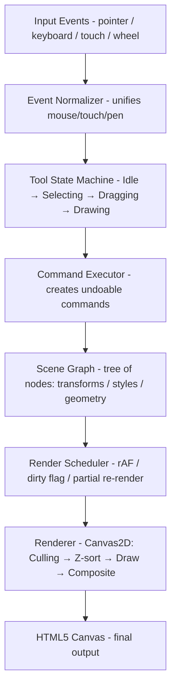

## Problem Statement

Browser-based vector design tools — Figma, Canva, Excalidraw, Miro, tldraw — have replaced native desktop applications for the majority of design workflows. They share a common technical challenge: rendering thousands of vector objects at 60fps while supporting rich interactions (selection, drag, resize, rotation) that feel instantaneous.

This problem is fundamentally different from DOM-based UI engineering. A design canvas operates outside the browser's layout engine entirely. There is no CSS flexbox, no reflow, no text layout algorithm provided for free. Every pixel is your responsibility. You own the rendering pipeline from scene graph traversal through rasterization to compositing.

**Scope of this design:**

- Rendering pipeline architecture (scene graph → visibility culling → z-sorting → batched draw calls → dirty region optimization)
- Scene graph data model with affine transforms and parent-child composition
- Spatial indexing for O(log n) hit testing instead of O(n) iteration
- Tool state machine for clean interaction handling
- Undo/redo via command pattern with memory budgets
- 60fps guarantee with 1000+ objects on canvas

**Out of scope:** Real-time multiplayer collaboration (CRDTs/OT), server-side rendering, asset management CDN, billing.

---

## Requirements Exploration

### Functional Requirements

| ID    | Requirement                                                   | Priority |
| ----- | ------------------------------------------------------------- | -------- |
| FR-1  | Draw primitive shapes (rectangle, ellipse, line, polygon)     | P0       |
| FR-2  | Draw freeform paths (pen tool, pencil tool)                   | P0       |
| FR-3  | Select single/multiple objects via click and marquee          | P0       |
| FR-4  | Move, resize, rotate selected objects with handles            | P0       |
| FR-5  | Layers panel with z-order reordering, visibility toggle, lock | P0       |
| FR-6  | Zoom (0.1x–64x) and pan (infinite canvas)                     | P0       |
| FR-7  | Undo/redo with full operation history                         | P0       |
| FR-8  | Export to PNG, SVG, PDF                                       | P1       |
| FR-9  | Text objects with basic formatting                            | P1       |
| FR-10 | Alignment and distribution tools                              | P1       |
| FR-11 | Group/ungroup objects                                         | P1       |
| FR-12 | Frames (artboards) as clipping containers                     | P2       |
| FR-13 | Boolean operations (union, subtract, intersect)               | P2       |
| FR-14 | Grid and snap-to-grid / snap-to-object guides                 | P1       |

### Non-Functional Requirements

| NFR           | Target                                                | Measurement                      |
| ------------- | ----------------------------------------------------- | -------------------------------- |
| Frame rate    | 60fps sustained                                       | &lt;16.67ms per frame budget        |
| Object count  | 1000+ objects without frame drops                     | Stress test with 5000 shapes     |
| Input latency | &lt;8ms from pointer event to visual feedback            | High-resolution timestamps       |
| Tool switch   | &lt;100ms to change active tool                          | Time from click to cursor change |
| Memory        | &lt;200MB for a 1000-object document                     | Chrome DevTools heap snapshot    |
| Touch support | Full gesture recognition (pinch-zoom, two-finger pan) | Mobile Safari, Chrome Android    |
| Export        | &lt;2s for 1080p PNG export of 500 objects               | Performance.now() timing         |
| Undo response | &lt;16ms to undo any single operation                    | No frame drops during undo       |

---

## Capacity Estimation & Constraints

### Per-Document Budgets

| Resource                  | Estimate                           | Reasoning                                          |
| ------------------------- | ---------------------------------- | -------------------------------------------------- |
| Objects per document      | 1,000–10,000                       | Typical design file; Figma files routinely hit 5K+ |
| Vertices per complex path | Up to 10,000 points                | Freeform pen drawings, imported SVGs               |
| Scene graph memory        | ~200 bytes/node × 5,000 = ~1MB     | Transform matrix, style, bounding box, metadata    |
| Undo stack entries        | 100–500 operations                 | Balance between memory and user expectation        |
| Undo stack memory budget  | 50MB max                           | Serialize commands; evict oldest beyond budget     |
| Spatial index (R-tree)    | ~80 bytes/entry × 5,000 = ~400KB   | Bounding rectangles + child pointers               |
| Canvas bitmap memory      | 4 bytes/pixel × 1920 × 1080 = ~8MB | Single layer; double-buffer doubles this           |
| WebGL texture atlas       | 4096×4096 RGBA = 64MB max          | GPU memory budget for cached renders               |

### Frame Budget Breakdown (16.67ms)

```
┌─────────────────────────────────────────────────┐
│ Input Processing        │  1–2ms                │
│ Scene Graph Update      │  1–2ms                │
│ Visibility Culling      │  0.5–1ms              │
│ Z-Sort + Batch          │  0.5–1ms              │
│ Draw Calls (render)     │  8–10ms               │
│ Compositing             │  1–2ms                │
│ Slack / GC headroom     │  1–2ms                │
└─────────────────────────────────────────────────┘
Total: ≤ 16.67ms for 60fps
```

---

## Architecture / High-Level Design

### Rendering Strategy

**Decision: Canvas2D with selective offscreen canvas caching.**

| Approach | Pros                                                     | Cons                                        | When to use                       |
| -------- | -------------------------------------------------------- | ------------------------------------------- | --------------------------------- |
| Canvas2D | Simple API, good text rendering, browser-optimized paths | Single-threaded, no hardware batching       | &lt;5,000 objects                    |
| WebGL    | GPU batching, shader effects, massive parallelism        | Complex setup, poor text, custom everything | >5,000 objects or heavy effects   |
| Hybrid   | Best of both                                             | Complexity, synchronization overhead        | Production tools (Figma approach) |

For this design, Canvas2D with dirty-rectangle optimization handles the 1,000–5,000 object target. The architecture allows swapping in a WebGL renderer behind the same scene graph interface.

### Navigation Model

Single-page canvas application. No routing. The entire UI is one viewport with tool state determining behavior:

```
┌────────────────────────────────────────────────────────┐
│  Toolbar (top)                                         │
├──────────┬─────────────────────────────────┬───────────┤
│  Layers  │                                 │ Properties│
│  Panel   │         Canvas Viewport         │   Panel   │
│  (left)  │                                 │  (right)  │
│          │                                 │           │
├──────────┴─────────────────────────────────┴───────────┤
│  Status Bar (zoom level, selection info)                │
└────────────────────────────────────────────────────────┘
```

### System Architecture Diagram



### Component Architecture

```typescript
// Top-level React component structure
interface AppShell {
  toolbar: ToolbarComponent; // Tool selection, actions
  layersPanel: LayersPanelComponent; // Z-order list, visibility toggles
  canvasViewport: CanvasViewport; // The <canvas> element + event handling
  propertiesPanel: PropertiesPanel; // Fill, stroke, transform inputs
  statusBar: StatusBarComponent; // Zoom %, selection count
}
```

The React layer handles UI chrome (toolbar, panels, status bar). The canvas is a single `<canvas>` element managed entirely outside React's render cycle — React never touches pixels.

### State Management

```
┌──────────────────────────────────────────────┐
│           Scene Graph (Source of Truth)        │
│  ┌─────────────────────────────────────────┐ │
│  │  Root                                    │ │
│  │  ├── Frame "Page 1"                     │ │
│  │  │   ├── Rectangle                      │ │
│  │  │   ├── Ellipse                        │ │
│  │  │   └── Group                          │ │
│  │  │       ├── Path                       │ │
│  │  │       └── Text                       │ │
│  │  └── Frame "Page 2"                     │ │
│  └─────────────────────────────────────────┘ │
└──────────────────────┬───────────────────────┘
                       │
          ┌────────────┼────────────┐
          ▼            ▼            ▼
   ┌────────────┐ ┌─────────┐ ┌──────────┐
   │ Render     │ │ Spatial │ │ Selection│
   │ State      │ │ Index   │ │ State    │
   │ (derived)  │ │(R-tree) │ │          │
   └────────────┘ └─────────┘ └──────────┘
```

The scene graph is the single source of truth. Derived state (bounding boxes, spatial index, render order) is recomputed on mutation. Selection state lives separately — it is UI state, not document state.

---

## Data Model / Entities

### Scene Graph Node Types

```typescript
/** 3x3 affine transform matrix stored as 6 values (2D) */
interface AffineTransform {
  a: number; // scaleX
  b: number; // skewY
  c: number; // skewX
  d: number; // scaleY
  tx: number; // translateX
  ty: number; // translateY
}

/** Axis-aligned bounding box */
interface AABB {
  minX: number;
  minY: number;
  maxX: number;
  maxY: number;
}

/** Fill style */
interface FillStyle {
  type: "solid" | "linear-gradient" | "radial-gradient" | "none";
  color?: string; // #RRGGBBAA
  gradient?: GradientDef;
  opacity: number; // 0–1
}

interface StrokeStyle {
  color: string;
  width: number;
  dashArray: number[];
  lineCap: "butt" | "round" | "square";
  lineJoin: "miter" | "round" | "bevel";
  opacity: number;
}

interface ShadowStyle {
  color: string;
  offsetX: number;
  offsetY: number;
  blur: number;
}

interface BlurEffect {
  type: "gaussian" | "background";
  radius: number;
}

/** Base node — every scene graph element extends this */
interface SceneNode {
  id: string; // UUID v4
  type: NodeType;
  name: string; // User-visible layer name
  transform: AffineTransform;
  opacity: number;
  visible: boolean;
  locked: boolean;
  parentId: string | null;
  childIds: string[]; // Ordered: first = bottom, last = top
  fills: FillStyle[];
  strokes: StrokeStyle[];
  shadows: ShadowStyle[];
  blurs: BlurEffect[];
  blendMode: BlendMode;
  // Cached, recomputed on mutation
  localBounds: AABB;
  worldBounds: AABB;
  worldTransform: AffineTransform;
  dirty: boolean;
}

type NodeType =
  | "rectangle"
  | "ellipse"
  | "path"
  | "text"
  | "group"
  | "frame"
  | "line"
  | "polygon";

type BlendMode =
  | "normal"
  | "multiply"
  | "screen"
  | "overlay"
  | "darken"
  | "lighten";

/** Rectangle-specific properties */
interface RectangleNode extends SceneNode {
  type: "rectangle";
  width: number;
  height: number;
  cornerRadii: [number, number, number, number]; // TL, TR, BR, BL
}

/** Ellipse-specific properties */
interface EllipseNode extends SceneNode {
  type: "ellipse";
  radiusX: number;
  radiusY: number;
  startAngle: number; // For arcs
  endAngle: number;
  innerRadius: number; // For donuts
}

/** Path node — arbitrary Bezier curves */
interface PathNode extends SceneNode {
  type: "path";
  segments: PathSegment[];
  closed: boolean;
  fillRule: "nonzero" | "evenodd";
}

interface PathSegment {
  type: "move" | "line" | "cubic" | "quadratic" | "close";
  points: [number, number][]; // Control points
}

/** Text node */
interface TextNode extends SceneNode {
  type: "text";
  content: string;
  fontSize: number;
  fontFamily: string;
  fontWeight: number;
  lineHeight: number;
  textAlign: "left" | "center" | "right";
  width: number | "auto"; // Fixed width or auto-size
}

/** Group — transparent container */
interface GroupNode extends SceneNode {
  type: "group";
  // No additional geometry — bounds derived from children
}

/** Frame — clips children to its bounds */
interface FrameNode extends SceneNode {
  type: "frame";
  width: number;
  height: number;
  clipContent: boolean;
  backgroundColor: string | null;
}
```

### Selection State

```typescript
interface SelectionState {
  selectedIds: Set<string>;
  hoveredId: string | null;
  selectionBounds: AABB | null; // Union of all selected bounds
  handles: ResizeHandle[]; // Computed handle positions
  rotationAnchor: [number, number] | null;
}

interface ResizeHandle {
  position: "nw" | "n" | "ne" | "e" | "se" | "s" | "sw" | "w";
  x: number;
  y: number;
  cursor: string;
}
```

### Tool State Machine

```typescript
type ToolType =
  | "select"
  | "rectangle"
  | "ellipse"
  | "line"
  | "pen"
  | "pencil"
  | "text"
  | "hand"
  | "zoom";

type ToolState =
  | { type: "idle" }
  | { type: "hovering"; nodeId: string }
  | {
      type: "selecting";
      marqueeStart: [number, number];
      marqueeEnd: [number, number];
    }
  | {
      type: "dragging";
      startPositions: Map<string, [number, number]>;
      delta: [number, number];
    }
  | {
      type: "resizing";
      handle: ResizeHandle;
      origin: [number, number];
      startBounds: AABB;
    }
  | { type: "rotating"; center: [number, number]; startAngle: number }
  | { type: "drawing"; nodeId: string; points: [number, number][] }
  | { type: "panning"; lastPosition: [number, number] };

interface ToolContext {
  activeTool: ToolType;
  state: ToolState;
  viewport: ViewportState;
}

interface ViewportState {
  panX: number;
  panY: number;
  zoom: number; // 0.1 to 64
  // Screen coords → Canvas coords: (screenX - panX) / zoom
  // Canvas coords → Screen coords: canvasX * zoom + panX
}
```

---

## Interface Definition (API)

### Scene Graph CRUD Operations

```typescript
interface SceneGraphAPI {
  // Node creation
  createNode(type: NodeType, props: Partial<SceneNode>): string;
  deleteNodes(ids: string[]): void;
  duplicateNodes(ids: string[]): string[];

  // Transform operations
  setTransform(id: string, transform: AffineTransform): void;
  translateNodes(ids: string[], dx: number, dy: number): void;
  resizeNode(
    id: string,
    width: number,
    height: number,
    anchor: ResizeHandle["position"],
  ): void;
  rotateNodes(ids: string[], angle: number, center: [number, number]): void;

  // Hierarchy
  setParent(nodeId: string, parentId: string, index: number): void;
  groupNodes(ids: string[]): string; // Returns new group ID
  ungroupNode(groupId: string): string[];

  // Style
  setFills(id: string, fills: FillStyle[]): void;
  setStrokes(id: string, strokes: StrokeStyle[]): void;

  // Z-order
  bringToFront(ids: string[]): void;
  sendToBack(ids: string[]): void;
  moveForward(ids: string[]): void;
  moveBackward(ids: string[]): void;

  // Query
  getNode(id: string): SceneNode | null;
  getChildren(id: string): SceneNode[];
  hitTest(point: [number, number]): string | null;
  hitTestRect(rect: AABB): string[];
}
```

### Command Pattern for Undo/Redo

```typescript
interface Command {
  id: string;
  type: string;
  description: string; // Human-readable for undo menu
  execute(): void;
  undo(): void;
  memoryBytes(): number; // For budget management
}

interface CommandHistory {
  execute(cmd: Command): void;
  undo(): void;
  redo(): void;
  canUndo(): boolean;
  canRedo(): boolean;
  getUndoStack(): Command[];
  getRedoStack(): Command[];
  memoryUsage(): number;
  compact(): void; // Merge adjacent commands of same type
}

// Example: MoveCommand
class MoveCommand implements Command {
  id = crypto.randomUUID();
  type = "move";
  description: string;

  constructor(
    private sceneGraph: SceneGraphAPI,
    private nodeIds: string[],
    private dx: number,
    private dy: number,
  ) {
    this.description = `Move ${nodeIds.length} object(s)`;
  }

  execute(): void {
    this.sceneGraph.translateNodes(this.nodeIds, this.dx, this.dy);
  }

  undo(): void {
    this.sceneGraph.translateNodes(this.nodeIds, -this.dx, -this.dy);
  }

  memoryBytes(): number {
    return 64 + this.nodeIds.length * 36; // UUID strings
  }
}
```

### Serialization Format

```typescript
/** Document file format — JSON for simplicity, binary for production */
interface DocumentFile {
  version: number;
  metadata: {
    name: string;
    createdAt: string;
    modifiedAt: string;
    canvasWidth: number;
    canvasHeight: number;
  };
  nodes: Record<string, SerializedNode>;
  rootId: string;
  pageOrder: string[]; // Frame IDs representing pages
}

interface SerializedNode {
  id: string;
  type: NodeType;
  name: string;
  transform: [number, number, number, number, number, number]; // Compact matrix
  opacity: number;
  visible: boolean;
  locked: boolean;
  parentId: string | null;
  childIds: string[];
  fills: FillStyle[];
  strokes: StrokeStyle[];
  // Type-specific properties flattened
  [key: string]: unknown;
}
```

### Export Contracts

```typescript
interface ExportOptions {
  format: "png" | "svg" | "pdf";
  scale: number; // 1x, 2x, 3x
  nodeIds?: string[]; // Export specific nodes; null = entire canvas
  background: boolean; // Include background color
  padding: number; // Pixels around exported content
}

interface ExportResult {
  blob: Blob;
  width: number;
  height: number;
  mimeType: string;
}

async function exportDocument(
  sceneGraph: SceneGraphAPI,
  renderer: Renderer,
  options: ExportOptions,
): Promise<ExportResult>;
```

---

## Caching Strategy

### Dirty Rectangle Invalidation

The most impactful optimization for Canvas2D rendering. Instead of redrawing the entire canvas every frame, only repaint regions where objects changed.

```typescript
class DirtyRegionTracker {
  private dirtyRects: AABB[] = [];

  markDirty(node: SceneNode): void {
    // Mark both old bounds (before move) and new bounds (after move)
    this.dirtyRects.push(node.worldBounds);
  }

  getDirtyRegion(): AABB | null {
    if (this.dirtyRects.length === 0) return null;
    // Merge overlapping rects into minimal covering rect
    return this.dirtyRects.reduce(mergeAABB);
  }

  clear(): void {
    this.dirtyRects = [];
  }
}
```

**When to invalidate:**

| Event                         | Dirty Region                  |
| ----------------------------- | ----------------------------- |
| Object moved                  | Old bounds ∪ New bounds       |
| Object resized                | Old bounds ∪ New bounds       |
| Style changed (color, stroke) | Current bounds                |
| Object deleted                | Former bounds                 |
| Object created                | New bounds                    |
| Zoom/pan changed              | Entire viewport (full redraw) |

### Spatial Index (R-tree)

An R-tree provides O(log n) hit testing and visibility queries instead of O(n) iteration over all objects.

```typescript
interface SpatialIndex {
  insert(id: string, bounds: AABB): void;
  remove(id: string): void;
  update(id: string, newBounds: AABB): void;
  query(searchBounds: AABB): string[]; // All objects intersecting region
  queryPoint(x: number, y: number): string[]; // All objects containing point
  nearest(x: number, y: number, k: number): string[];
}

class RTree implements SpatialIndex {
  private tree: RBush<{
    id: string;
    minX: number;
    minY: number;
    maxX: number;
    maxY: number;
  }>;

  constructor() {
    this.tree = new RBush(16); // Max entries per node = 16
  }

  query(searchBounds: AABB): string[] {
    return this.tree.search(searchBounds).map((item) => item.id);
  }

  queryPoint(x: number, y: number): string[] {
    return this.query({ minX: x, minY: y, maxX: x, maxY: y });
  }
}
```

<Callout>
  **Staff+ Insight:** R-tree vs Quadtree — R-trees outperform quadtrees for
  design tools because objects have varying sizes and positions. Quadtrees waste
  nodes on empty regions and struggle with objects that span multiple cells.
  R-trees adapt their structure to actual object distribution. Use `rbush` (3KB
  gzipped) — battle-tested in Leaflet, Mapbox, and Figma.
</Callout>

### Offscreen Canvas Caching

For complex objects (heavy paths, text with effects), cache their rasterized output to an offscreen canvas:

```typescript
interface RenderCache {
  canvas: OffscreenCanvas;
  bounds: AABB;
  scale: number; // Zoom level at which this was cached
  nodeVersion: number; // Invalidate when node mutates
}

class NodeRenderCache {
  private cache = new Map<string, RenderCache>();
  private memoryBudget = 64 * 1024 * 1024; // 64MB
  private currentMemory = 0;

  getCached(node: SceneNode, currentZoom: number): RenderCache | null {
    const entry = this.cache.get(node.id);
    if (!entry) return null;
    if (entry.nodeVersion !== node.version) return null;
    // Allow 2x zoom tolerance before re-rasterizing
    if (currentZoom / entry.scale > 2 || entry.scale / currentZoom > 2)
      return null;
    return entry;
  }

  setCached(node: SceneNode, canvas: OffscreenCanvas, zoom: number): void {
    const bytes = canvas.width * canvas.height * 4;
    this.evictIfNeeded(bytes);
    this.cache.set(node.id, {
      canvas,
      bounds: node.worldBounds,
      scale: zoom,
      nodeVersion: node.version,
    });
    this.currentMemory += bytes;
  }

  private evictIfNeeded(needed: number): void {
    // LRU eviction
    while (
      this.currentMemory + needed > this.memoryBudget &&
      this.cache.size > 0
    ) {
      const oldest = this.cache.keys().next().value!;
      const entry = this.cache.get(oldest)!;
      this.currentMemory -= entry.canvas.width * entry.canvas.height * 4;
      this.cache.delete(oldest);
    }
  }
}
```

### Thumbnail Cache for Layers Panel

The layers panel shows small previews. Generate these asynchronously:

```typescript
class LayerThumbnailCache {
  private thumbnails = new Map<string, ImageBitmap>();
  private pendingRenders = new Set<string>();
  private thumbSize = 32; // pixels

  async generateThumbnail(
    node: SceneNode,
    renderer: Renderer,
  ): Promise<ImageBitmap> {
    if (this.pendingRenders.has(node.id)) return this.thumbnails.get(node.id)!;
    this.pendingRenders.add(node.id);

    const offscreen = new OffscreenCanvas(this.thumbSize, this.thumbSize);
    const ctx = offscreen.getContext("2d")!;
    const scale = Math.min(
      this.thumbSize / node.localBounds.width,
      this.thumbSize / node.localBounds.height,
    );
    ctx.scale(scale, scale);
    ctx.translate(-node.localBounds.minX, -node.localBounds.minY);
    renderer.renderNode(ctx, node);

    const bitmap = await createImageBitmap(offscreen);
    this.thumbnails.set(node.id, bitmap);
    this.pendingRenders.delete(node.id);
    return bitmap;
  }
}
```

---

## Rendering & Performance Deep Dive

### Rendering Pipeline

```
┌─────────────────────────────────────────────────────────────┐
│                    Frame Render Pipeline                      │
├─────────────────────────────────────────────────────────────┤
│                                                              │
│  1. Check dirty flag ─── if clean, skip entire frame         │
│          │                                                   │
│          ▼                                                   │
│  2. Traverse scene graph (depth-first)                       │
│          │                                                   │
│          ▼                                                   │
│  3. Compute world transforms (parent × local)               │
│          │                                                   │
│          ▼                                                   │
│  4. Compute world bounding boxes                             │
│          │                                                   │
│          ▼                                                   │
│  5. Visibility culling (intersect with viewport)             │
│          │                                                   │
│          ▼                                                   │
│  6. Z-sort visible nodes (stable sort by tree order)         │
│          │                                                   │
│          ▼                                                   │
│  7. For each visible node:                                   │
│     a. Check render cache → use cached bitmap if valid       │
│     b. Apply world transform to context                      │
│     c. Draw fills (solid, gradient)                          │
│     d. Draw geometry (rect, ellipse, path)                   │
│     e. Draw strokes                                          │
│     f. Draw shadows, effects                                 │
│          │                                                   │
│          ▼                                                   │
│  8. Draw selection overlay (handles, bounds)                 │
│          │                                                   │
│          ▼                                                   │
│  9. Draw guides, grid, snap indicators                       │
│          │                                                   │
│          ▼                                                   │
│  10. Composite to main canvas                                │
│                                                              │
└─────────────────────────────────────────────────────────────┘
```

### Implementation

```typescript
class CanvasRenderer {
  private ctx: CanvasRenderingContext2D;
  private viewport: ViewportState;
  private spatialIndex: SpatialIndex;
  private dirtyTracker: DirtyRegionTracker;
  private renderCache: NodeRenderCache;
  private frameId: number | null = null;
  private isDirty = true;

  constructor(canvas: HTMLCanvasElement) {
    this.ctx = canvas.getContext("2d", { alpha: false })!;
    // alpha: false = browser can skip compositing with page background
  }

  /** Call when scene graph changes */
  markDirty(): void {
    this.isDirty = true;
    if (this.frameId === null) {
      this.frameId = requestAnimationFrame(() => this.renderFrame());
    }
  }

  private renderFrame(): void {
    this.frameId = null;
    if (!this.isDirty) return;
    this.isDirty = false;

    const start = performance.now();

    // 1. Get visible nodes via spatial index
    const viewportBounds = this.getViewportBounds();
    const visibleIds = this.spatialIndex.query(viewportBounds);

    // 2. Resolve nodes and sort by z-index (tree order)
    const visibleNodes = this.resolveAndSort(visibleIds);

    // 3. Clear and render
    this.ctx.save();
    this.applyViewportTransform();
    this.ctx.clearRect(
      viewportBounds.minX,
      viewportBounds.minY,
      viewportBounds.maxX - viewportBounds.minX,
      viewportBounds.maxY - viewportBounds.minY,
    );

    for (const node of visibleNodes) {
      if (!node.visible) continue;
      this.renderNode(node);
    }

    this.ctx.restore();

    // 4. Draw overlays (selection, guides) — always on top
    this.renderSelectionOverlay();
    this.renderGuides();

    const elapsed = performance.now() - start;
    if (elapsed > 16) {
      console.warn(`Frame took ${elapsed.toFixed(1)}ms — over budget`);
    }
  }

  private renderNode(node: SceneNode): void {
    // Check cache first
    const cached = this.renderCache.getCached(node, this.viewport.zoom);
    if (cached) {
      this.ctx.drawImage(cached.canvas, cached.bounds.minX, cached.bounds.minY);
      return;
    }

    this.ctx.save();
    this.applyNodeTransform(node);
    this.ctx.globalAlpha = node.opacity;
    this.ctx.globalCompositeOperation = this.blendModeToComposite(
      node.blendMode,
    );

    switch (node.type) {
      case "rectangle":
        this.drawRectangle(node as RectangleNode);
        break;
      case "ellipse":
        this.drawEllipse(node as EllipseNode);
        break;
      case "path":
        this.drawPath(node as PathNode);
        break;
      case "text":
        this.drawText(node as TextNode);
        break;
      case "frame":
        this.drawFrame(node as FrameNode);
        break;
      // Groups have no own rendering — children are rendered in tree order
    }

    this.ctx.restore();
  }

  private applyNodeTransform(node: SceneNode): void {
    const { a, b, c, d, tx, ty } = node.worldTransform;
    this.ctx.setTransform(a, b, c, d, tx, ty);
  }

  private applyViewportTransform(): void {
    this.ctx.setTransform(
      this.viewport.zoom,
      0,
      0,
      this.viewport.zoom,
      this.viewport.panX,
      this.viewport.panY,
    );
  }

  private getViewportBounds(): AABB {
    const { panX, panY, zoom } = this.viewport;
    const w = this.ctx.canvas.width;
    const h = this.ctx.canvas.height;
    return {
      minX: -panX / zoom,
      minY: -panY / zoom,
      maxX: (w - panX) / zoom,
      maxY: (h - panY) / zoom,
    };
  }
}
```

### Hit Testing

Hit testing converts a screen-space click into the topmost object under the cursor. Naive O(n) iteration fails at 1000+ objects.

```typescript
class HitTester {
  private spatialIndex: SpatialIndex;
  private sceneGraph: SceneGraphAPI;

  hitTest(
    screenX: number,
    screenY: number,
    viewport: ViewportState,
  ): string | null {
    // 1. Convert screen coords to canvas coords
    const canvasX = (screenX - viewport.panX) / viewport.zoom;
    const canvasY = (screenY - viewport.panY) / viewport.zoom;

    // 2. Query spatial index for candidates (O(log n))
    const candidates = this.spatialIndex.queryPoint(canvasX, canvasY);

    // 3. Sort candidates by z-index (topmost first)
    const sorted = this.sortByZIndexDescending(candidates);

    // 4. Precise hit test each candidate (top-down, first hit wins)
    for (const id of sorted) {
      const node = this.sceneGraph.getNode(id)!;
      if (!node.visible || node.locked) continue;
      if (this.preciseHitTest(node, canvasX, canvasY)) {
        return id;
      }
    }
    return null;
  }

  private preciseHitTest(node: SceneNode, x: number, y: number): boolean {
    // Transform point into node's local coordinate space
    const localPoint = this.worldToLocal(node, x, y);

    switch (node.type) {
      case "rectangle":
        return this.pointInRect(node as RectangleNode, localPoint);
      case "ellipse":
        return this.pointInEllipse(node as EllipseNode, localPoint);
      case "path":
        return this.pointInPath(node as PathNode, localPoint);
      default:
        return this.pointInBounds(node, localPoint);
    }
  }

  private pointInPath(path: PathNode, point: [number, number]): boolean {
    // Use Canvas2D isPointInPath for complex path geometry
    const offscreen = new OffscreenCanvas(1, 1);
    const ctx = offscreen.getContext("2d")!;
    const path2d = this.buildPath2D(path.segments);
    return ctx.isPointInPath(path2d, point[0], point[1], path.fillRule);
  }

  private worldToLocal(
    node: SceneNode,
    x: number,
    y: number,
  ): [number, number] {
    // Invert the world transform
    const { a, b, c, d, tx, ty } = node.worldTransform;
    const det = a * d - b * c;
    const localX = (d * (x - tx) - c * (y - ty)) / det;
    const localY = (a * (y - ty) - b * (x - tx)) / det;
    return [localX, localY];
  }
}
```

<Callout>
  **Staff+ Insight:** For stroke hit testing, expand the hit test region by
  `strokeWidth / 2 + tolerance` (typically 4px at current zoom). This makes thin
  strokes clickable without pixel-perfect precision — critical for usability.
  Figma uses a 5px tolerance at 1x zoom, scaled inversely with zoom level.
</Callout>

### 60fps Budget Analysis

| Phase              | Budget     | Operations                           | Optimization                                    |
| ------------------ | ---------- | ------------------------------------ | ----------------------------------------------- |
| Input processing   | 2ms        | Normalize events, viewport transform | Batch pointer events via `getCoalescedEvents()` |
| Scene graph update | 2ms        | Apply transform, update parent chain | Only dirty nodes + ancestors                    |
| Visibility culling | 1ms        | R-tree query against viewport        | Pre-computed world bounds                       |
| Z-sort             | 0.5ms      | Stable sort by tree position         | Maintain sorted order incrementally             |
| Draw calls         | 10ms       | Canvas2D path/fill/stroke operations | Batch similar operations, use render cache      |
| Compositing        | 1ms        | Final pixel output                   | `alpha: false` on context, avoid blend modes    |
| **Total**          | **16.5ms** |                                      | Under 16.67ms budget                            |

### Large Document Performance (10K+ Objects)

```typescript
/** Progressive rendering for very large documents */
class ProgressiveRenderer {
  private renderQueue: SceneNode[] = [];
  private maxNodesPerFrame = 500;

  renderFrame(allVisible: SceneNode[]): void {
    if (allVisible.length <= this.maxNodesPerFrame) {
      // Render everything in one frame
      this.renderAll(allVisible);
      return;
    }

    // Priority-based rendering:
    // 1. Selected objects (always render)
    // 2. Objects near cursor
    // 3. Large objects (occupy more pixels)
    // 4. Remaining (lower priority, can defer)
    const prioritized = this.prioritize(allVisible);
    const thisFrame = prioritized.slice(0, this.maxNodesPerFrame);
    const deferred = prioritized.slice(this.maxNodesPerFrame);

    this.renderAll(thisFrame);

    if (deferred.length > 0) {
      // Schedule remaining for next frame
      requestAnimationFrame(() => this.renderDeferred(deferred));
    }
  }
}
```

**Level of Detail (LOD) strategy:**

| Zoom Level | Rendering Fidelity                        |
| ---------- | ----------------------------------------- |
| < 0.25x    | Bounding boxes only (filled rectangles)   |
| 0.25x–0.5x | Simplified paths (reduce point count)     |
| 0.5x–2x    | Full render                               |
| > 2x       | Sub-pixel rendering, anti-aliased details |

---

## Security Deep Dive

### Threat Model

| Threat                | Vector                                               | Impact                             | Mitigation                                                                                |
| --------------------- | ---------------------------------------------------- | ---------------------------------- | ----------------------------------------------------------------------------------------- |
| SVG import XSS        | `<script>` tags, `onload` attributes in imported SVG | Code execution in user's session   | Parse SVG with DOMParser, whitelist allowed elements/attributes, strip all event handlers |
| Font loading          | Cross-origin fonts with malicious OpenType tables    | Browser exploit, data exfiltration | Use `font-display: swap`, validate font files, serve from same origin                     |
| Clipboard paste       | Pasted HTML/SVG containing scripts                   | XSS                                | Sanitize clipboard data, only accept plain text and known formats                         |
| Image import          | Malicious image files (polyglot PNG/JS)              | Resource exhaustion, exploit       | Validate image headers, decode in OffscreenCanvas (sandboxed), size limits                |
| Export file injection | Crafted SVG export with embedded XSS                 | Stored XSS if SVG served as HTML   | Always serve exported SVG with `Content-Type: image/svg+xml`, never `text/html`           |
| WASM filter sandbox   | Custom effects running arbitrary WASM                | Memory corruption, infinite loops  | Memory limits, instruction count limits, timeout on execution                             |

### SVG Import Sanitization

```typescript
const ALLOWED_SVG_ELEMENTS = new Set([
  "svg",
  "g",
  "path",
  "rect",
  "circle",
  "ellipse",
  "line",
  "polyline",
  "polygon",
  "text",
  "tspan",
  "defs",
  "use",
  "clipPath",
  "mask",
  "linearGradient",
  "radialGradient",
  "stop",
]);

const FORBIDDEN_ATTRIBUTES = new Set([
  "onload",
  "onerror",
  "onclick",
  "onmouseover",
  "onfocus",
  "onblur",
  "onanimationend",
  "href",
  "xlink:href",
]);

function sanitizeSVG(svgString: string): Document {
  const parser = new DOMParser();
  const doc = parser.parseFromString(svgString, "image/svg+xml");

  // Remove all script elements
  doc.querySelectorAll("script").forEach((el) => el.remove());

  // Remove forbidden elements
  const walker = doc.createTreeWalker(
    doc.documentElement,
    NodeFilter.SHOW_ELEMENT,
  );
  const toRemove: Element[] = [];

  while (walker.nextNode()) {
    const el = walker.currentNode as Element;
    if (!ALLOWED_SVG_ELEMENTS.has(el.localName)) {
      toRemove.push(el);
      continue;
    }
    // Strip forbidden attributes
    for (const attr of Array.from(el.attributes)) {
      if (FORBIDDEN_ATTRIBUTES.has(attr.name) || attr.name.startsWith("on")) {
        el.removeAttribute(attr.name);
      }
      // Strip javascript: URLs
      if (attr.value.includes("javascript:")) {
        el.removeAttribute(attr.name);
      }
    }
  }

  toRemove.forEach((el) => el.remove());
  return doc;
}
```

---

## Scalability & Reliability

### Large Document Handling (10K+ Objects)

| Challenge                            | Solution                                                        |
| ------------------------------------ | --------------------------------------------------------------- |
| Scene graph traversal slows linearly | Spatial index for culling; only traverse visible subtrees       |
| Memory pressure                      | Object pooling for path points; lazy loading off-screen objects |
| Undo stack bloats                    | Memory-budgeted command history with oldest eviction            |
| Selection of many objects            | Batch transform updates; defer bounding box recomputation       |
| Export of large documents            | Stream rendering to chunks; use OffscreenCanvas in Web Worker   |

### Undo/Redo with Command Pattern

```typescript
class CommandHistory implements CommandHistoryAPI {
  private undoStack: Command[] = [];
  private redoStack: Command[] = [];
  private memoryBudget = 50 * 1024 * 1024; // 50MB

  execute(cmd: Command): void {
    cmd.execute();
    this.undoStack.push(cmd);
    this.redoStack = []; // Clear redo on new action
    this.enforceMemoryBudget();
  }

  undo(): void {
    const cmd = this.undoStack.pop();
    if (!cmd) return;
    cmd.undo();
    this.redoStack.push(cmd);
  }

  redo(): void {
    const cmd = this.redoStack.pop();
    if (!cmd) return;
    cmd.execute();
    this.undoStack.push(cmd);
  }

  private enforceMemoryBudget(): void {
    let total = this.undoStack.reduce((sum, cmd) => sum + cmd.memoryBytes(), 0);
    while (total > this.memoryBudget && this.undoStack.length > 1) {
      const evicted = this.undoStack.shift()!;
      total -= evicted.memoryBytes();
    }
  }

  /** Merge consecutive commands of the same type (e.g., many small moves → one big move) */
  compact(): void {
    const compacted: Command[] = [];
    for (let i = 0; i < this.undoStack.length; i++) {
      const current = this.undoStack[i];
      const prev = compacted[compacted.length - 1];
      if (prev && this.canMerge(prev, current)) {
        compacted[compacted.length - 1] = this.merge(prev, current);
      } else {
        compacted.push(current);
      }
    }
    this.undoStack = compacted;
  }

  private canMerge(a: Command, b: Command): boolean {
    // Merge consecutive moves, color changes within 500ms
    return a.type === b.type && a.type === "move";
  }

  private merge(a: Command, b: Command): Command {
    // Combine deltas for move commands
    return new MoveCommand(
      this.sceneGraph,
      (a as MoveCommand).nodeIds,
      (a as MoveCommand).dx + (b as MoveCommand).dx,
      (a as MoveCommand).dy + (b as MoveCommand).dy,
    );
  }
}
```

<Callout>
  **Staff+ Insight:** Command compaction is critical for drawing tools. A
  freehand pencil stroke generates hundreds of point-add commands. Compact them
  into a single "create path" command on pointer-up. Similarly, dragging an
  object fires move commands every frame — merge them into one move on
  pointer-up. This keeps undo history meaningful (one undo = one user action,
  not one frame).
</Callout>

### Auto-Save Strategy

```typescript
class AutoSave {
  private saveTimer: number | null = null;
  private isDirty = false;
  private debounceMs = 2000;

  onSceneGraphChange(): void {
    this.isDirty = true;
    if (this.saveTimer !== null) clearTimeout(this.saveTimer);
    this.saveTimer = window.setTimeout(() => this.save(), this.debounceMs);
  }

  private async save(): void {
    if (!this.isDirty) return;
    this.isDirty = false;
    const serialized = this.sceneGraph.serialize();
    // Save to IndexedDB for local persistence
    await idbKeyval.set("document-autosave", serialized);
    // Optionally sync to server
  }
}
```

### Collaborative Editing Considerations

While out of scope for core architecture, the scene graph design enables collaboration:

- **Immutable node updates:** Each mutation produces a new node reference → CRDT-friendly
- **Operation-based sync:** Command objects can be serialized and broadcast
- **Conflict resolution:** Last-writer-wins per property, or operational transform for paths
- **Presence awareness:** Cursor positions and selection state are separate from document state

---

## Accessibility Deep Dive

### The Canvas Accessibility Challenge

Canvas elements render pixels — screen readers see nothing. This is the fundamental tension in design tools.

### Strategy: Layered Accessibility

```typescript
/** Maintain a shadow DOM that mirrors the scene graph for AT (assistive technology) */
class AccessibilityTree {
  private container: HTMLElement;

  constructor(canvasElement: HTMLCanvasElement) {
    this.container = document.createElement("div");
    this.container.setAttribute("role", "application");
    this.container.setAttribute("aria-label", "Design canvas");
    this.container.style.position = "absolute";
    this.container.style.clip = "rect(0 0 0 0)"; // Visually hidden
    this.container.style.clipPath = "inset(50%)";
    canvasElement.parentElement!.appendChild(this.container);
  }

  syncWithSceneGraph(nodes: SceneNode[]): void {
    // Create hidden elements for each object
    this.container.innerHTML = "";
    for (const node of nodes) {
      const el = document.createElement("div");
      el.setAttribute("role", "img");
      el.setAttribute("aria-label", `${node.type}: ${node.name}`);
      el.setAttribute("tabindex", "0");
      el.dataset.nodeId = node.id;
      this.container.appendChild(el);
    }
  }
}
```

### Keyboard Alternatives

| Action        | Mouse                | Keyboard                             |
| ------------- | -------------------- | ------------------------------------ |
| Select object | Click                | Tab through objects, Enter to select |
| Move object   | Drag                 | Arrow keys (1px), Shift+Arrow (10px) |
| Resize object | Drag handle          | Alt+Arrow keys                       |
| Rotate object | Drag rotation handle | R + Arrow keys (15° increments)      |
| Zoom          | Scroll wheel         | Ctrl+Plus/Minus                      |
| Pan           | Middle mouse drag    | Space + Arrow keys                   |
| Create shape  | Click+drag           | Enter at position, type dimensions   |
| Multi-select  | Shift+click          | Shift+Tab+Enter                      |
| Delete        | Delete key           | Delete or Backspace                  |
| Undo          | Ctrl+Z               | Ctrl+Z                               |

### Screen Reader Announcements

```typescript
class A11yAnnouncer {
  private liveRegion: HTMLElement;

  constructor() {
    this.liveRegion = document.createElement("div");
    this.liveRegion.setAttribute("aria-live", "polite");
    this.liveRegion.setAttribute("aria-atomic", "true");
    this.liveRegion.style.position = "absolute";
    this.liveRegion.style.clip = "rect(0 0 0 0)";
    document.body.appendChild(this.liveRegion);
  }

  announce(message: string): void {
    this.liveRegion.textContent = "";
    requestAnimationFrame(() => {
      this.liveRegion.textContent = message;
    });
  }
}

// Usage:
announcer.announce("Rectangle created at position 100, 200. Size 150 by 100.");
announcer.announce("3 objects selected. Press Delete to remove.");
announcer.announce("Moved selection right by 10 pixels.");
```

### High Contrast Mode

```typescript
function applyHighContrastMode(renderer: CanvasRenderer): void {
  renderer.setOverrides({
    // All fills become solid black or white
    fillOverride: (fill: FillStyle) => ({
      ...fill,
      color: "#000000",
      opacity: 1,
    }),
    // All strokes become thick, high-contrast
    strokeOverride: (stroke: StrokeStyle) => ({
      ...stroke,
      color: "#000000",
      width: Math.max(stroke.width, 2),
      opacity: 1,
    }),
    // Selection highlight becomes bright yellow
    selectionColor: "#FFFF00",
    // Background forced to white
    backgroundColor: "#FFFFFF",
  });
}
```

---

## Monitoring & Observability

### Frame Rate Monitoring

```typescript
class PerformanceMonitor {
  private frameTimes: number[] = [];
  private readonly maxSamples = 120; // 2 seconds at 60fps
  private longFrameThreshold = 16.67; // ms
  private longFrameCount = 0;

  onFrameEnd(frameTimeMs: number): void {
    this.frameTimes.push(frameTimeMs);
    if (this.frameTimes.length > this.maxSamples) {
      this.frameTimes.shift();
    }
    if (frameTimeMs > this.longFrameThreshold) {
      this.longFrameCount++;
      this.reportLongFrame(frameTimeMs);
    }
  }

  getMetrics(): PerformanceMetrics {
    const sorted = [...this.frameTimes].sort((a, b) => a - b);
    return {
      fps: 1000 / this.average(this.frameTimes),
      p50: sorted[Math.floor(sorted.length * 0.5)] ?? 0,
      p95: sorted[Math.floor(sorted.length * 0.95)] ?? 0,
      p99: sorted[Math.floor(sorted.length * 0.99)] ?? 0,
      longFrames: this.longFrameCount,
      objectCount: this.sceneGraph.nodeCount,
      visibleCount: this.lastVisibleCount,
      memoryMB: this.getMemoryUsage(),
    };
  }

  private reportLongFrame(ms: number): void {
    // Report to analytics
    console.warn(`[Perf] Long frame: ${ms.toFixed(1)}ms`, {
      objectCount: this.sceneGraph.nodeCount,
      visibleCount: this.lastVisibleCount,
      zoom: this.viewport.zoom,
    });
  }

  private getMemoryUsage(): number {
    if ("memory" in performance) {
      return (performance as any).memory.usedJSHeapSize / (1024 * 1024);
    }
    return -1;
  }

  private average(arr: number[]): number {
    return arr.reduce((a, b) => a + b, 0) / arr.length;
  }
}

interface PerformanceMetrics {
  fps: number;
  p50: number;
  p95: number;
  p99: number;
  longFrames: number;
  objectCount: number;
  visibleCount: number;
  memoryMB: number;
}
```

### Metrics Dashboard

| Metric                      | Good     | Warning     | Critical | Action                            |
| --------------------------- | -------- | ----------- | -------- | --------------------------------- |
| Frame rate                  | ≥ 58 fps | 45–57 fps   | < 45 fps | Enable LOD, reduce render quality |
| Frame time P95              | < 16ms   | 16–25ms     | > 25ms   | Profile render pipeline           |
| Long frames / min           | 0–2      | 3–10        | > 10     | Investigate specific operations   |
| Memory usage                | < 150MB  | 150–300MB   | > 300MB  | Evict caches, suggest page reload |
| Object count                | < 2,000  | 2,000–5,000 | > 5,000  | Switch to WebGL renderer          |
| Spatial index queries/frame | < 5      | 5–15        | > 15     | Batch queries, cache results      |
| Render cache hit rate       | > 80%    | 50–80%      | < 50%    | Increase cache budget             |

### User-Facing Performance Indicator

```typescript
class PerformanceIndicator {
  private statusElement: HTMLElement;

  update(metrics: PerformanceMetrics): void {
    if (metrics.fps < 45) {
      this.showWarning(
        "Performance degraded. Consider reducing canvas complexity.",
      );
    }
    if (metrics.memoryMB > 300) {
      this.showWarning("High memory usage. Save and reload recommended.");
    }
  }
}
```

---

## Trade-offs

| Decision            | Option A                                    | Option B                                             | Choice                                        | Justification                                                                                                          |
| ------------------- | ------------------------------------------- | ---------------------------------------------------- | --------------------------------------------- | ---------------------------------------------------------------------------------------------------------------------- |
| Render technology   | Canvas2D                                    | WebGL                                                | Canvas2D (with WebGL escape hatch)            | Simpler implementation, adequate for &lt;5K objects, better text rendering. WebGL as optional upgrade path.               |
| Rendering mode      | Immediate (redraw every frame)              | Retained (dirty regions only)                        | Retained + dirty flag                         | 80% of frames need no redraw. Only pay render cost when something actually changes.                                    |
| Scene graph format  | JSON serialization                          | Binary format (FlatBuffers)                          | JSON for v1                                   | Developer ergonomics, debuggability. Binary is a performance optimization for large files later.                       |
| Spatial index       | R-tree                                      | Quadtree                                             | R-tree                                        | Better for variable-size objects, proven in map libraries. Quadtree wastes space on unevenly distributed objects.      |
| Undo implementation | Snapshot-based (serialize entire state)     | Command pattern (operations)                         | Command pattern                               | O(1) memory per operation vs O(n) per snapshot. Commands compose and compact.                                          |
| Transform storage   | Decomposed (x, y, rotation, scaleX, scaleY) | Matrix (6 values)                                    | Matrix internally, decomposed in UI           | Matrix is correct for composition (parent × child). Decomposed is user-friendly for property panels.                   |
| State management    | Single global store (Redux-like)            | Scene graph as domain model + derived stores         | Scene graph as truth                          | Domain-driven. React store only for UI state (panel open/closed, active tool). Scene graph never passes through React. |
| Text rendering      | Canvas2D fillText                           | DOM overlay for text editing                         | Hybrid: Canvas2D for display, DOM for editing | Canvas text has no cursor/selection. DOM overlay during active editing gives native text editing UX for free.          |
| Event handling      | Raw pointer events                          | Pointer events + gesture library (e.g., use-gesture) | Raw pointer events                            | Full control over gesture recognition. Libraries add overhead and edge cases for multi-touch on canvas.                |
| Layer ordering      | Array (splice for reorder)                  | Linked list                                          | Array                                         | Arrays are cache-friendly, random access for z-index. Reordering is rare compared to traversal.                        |

---

## What Great Looks Like

### Senior Engineer (L5)

- Implements a working canvas renderer with basic shapes, selection, and move
- Uses `requestAnimationFrame` correctly (single loop, no duplicate scheduling)
- Implements hit testing by iterating all objects (O(n) — functional but not optimal)
- Handles zoom and pan with correct coordinate transforms
- Implements undo/redo with a simple snapshot approach
- Handles edge cases: double-click to enter text edit, escape to deselect

### Staff Engineer (L6)

- Designs the scene graph as a proper tree with parent-child transform composition
- Introduces spatial indexing (R-tree) for O(log n) hit testing
- Implements dirty rectangle optimization — only repaints changed regions
- Designs the command pattern with memory budgeting and compaction
- Articulates the Canvas2D vs WebGL decision with clear thresholds
- Handles the text editing challenge (DOM overlay during edit, canvas for display)
- Considers accessibility: shadow DOM, keyboard navigation, live announcements
- Implements progressive rendering for large documents
- Profiles and explains the 16ms frame budget breakdown

### Principal Engineer (L7)

- Designs the full rendering pipeline as a composable, pluggable architecture
- Separates concerns: input handling, tool state machine, scene graph, renderer as independent subsystems with clean interfaces
- Plans the WebGL migration path without rewriting the scene graph layer
- Designs the spatial index to support both hit testing and visibility culling with a single data structure
- Addresses transform decomposition problem (matrix ↔ rotation/scale/skew) for the properties panel
- Considers future collaborative editing: immutable updates, operation serialization, conflict resolution
- Designs the performance monitoring system with automatic quality degradation
- Plans the export pipeline as a separate renderer (OffscreenCanvas in Worker) that shares the scene graph but renders at export resolution
- Addresses GPU memory budgeting for texture caches and offscreen canvases
- Considers the plugin/extension architecture: how third parties add custom shapes, effects, or tools without breaking the rendering pipeline

---

## Key Takeaways

- **Scene graph is the foundation.** Every design tool is a tree of nodes with affine transforms, styles, and parent-child composition. Get this data model right and everything else follows.

- **Spatial indexing is non-negotiable.** O(n) hit testing and O(n) visibility culling are the #1 performance killers. An R-tree makes both O(log n) and enables large documents.

- **Dirty flagging saves most frames.** The majority of frames in a design tool involve zero changes (user is thinking, not dragging). A dirty flag skips the entire render pipeline when nothing changed.

- **The 16ms budget requires discipline.** Break the frame into phases with sub-budgets. Profile relentlessly. One expensive operation (e.g., re-tessellating all paths on zoom) will drop frames visibly.

- **Command pattern over snapshots for undo.** Per-operation commands use O(1) memory and compose cleanly. Compact consecutive small operations (drag frames, color tweaks) into single user-meaningful actions.

- **Canvas2D is sufficient for most tools.** WebGL adds complexity without proportional benefit below 5,000 objects. Design the renderer interface so the backend is swappable.

- **Canvas accessibility requires a parallel DOM.** There is no shortcut. Maintain a visually-hidden accessibility tree that mirrors the scene graph. Announce state changes via `aria-live` regions.

- **Transform matrices are the correct internal representation.** They compose correctly (parent × child), invert cleanly (for hit testing), and handle rotation/scale/skew uniformly. Decompose only at the UI boundary for property panels.
