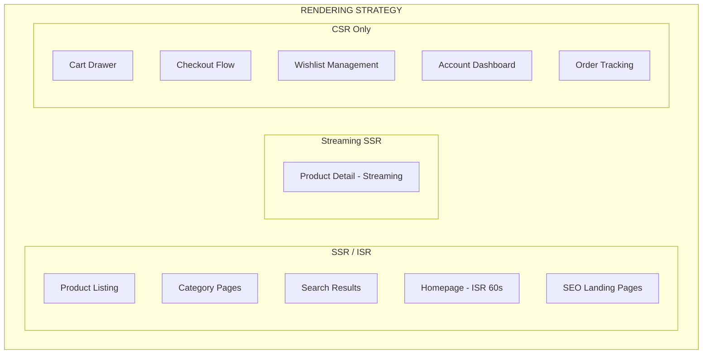
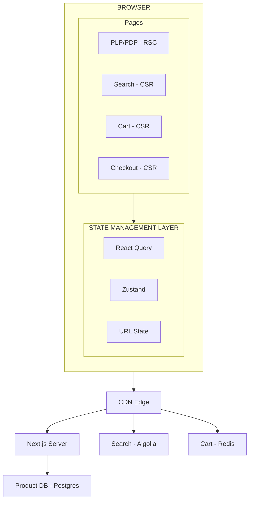

## Problem Statement

An e-commerce marketplace is among the most demanding front-end architectures in production today. Amazon processes 4,000+ orders per second during peak events. Shopify storefronts serve billions of page views monthly. eBay handles 1.7 billion live listings. Each platform must simultaneously serve SEO crawlers, first-time visitors, and returning customers with sub-second load times — while maintaining transactional integrity on cart and checkout flows.

E-commerce differs fundamentally from content sites in three ways:

1. **Dynamic pricing and inventory** — a product page is not static content. Prices change hourly, inventory depletes in real-time during flash sales, and personalized pricing (coupons, loyalty tiers) means the same URL serves different data to different users.
2. **Stateful user journeys** — a user's cart, wishlist, and checkout progress must persist across tabs, sessions, devices, and even network failures. Losing a cart with 12 items mid-checkout is a conversion-killing event.
3. **SEO as revenue driver** — organic search drives 30-40% of e-commerce traffic. Product listing pages (PLP) and product detail pages (PDP) must be crawlable, fast, and structured-data rich.

**Scope of this design:** Front-end architecture covering rendering strategy, state management, SEO optimization, checkout UX, and performance under load. We design for a marketplace with 10M+ products, 50M+ monthly visitors, and flash-sale events that spike traffic 10x.

**Real-world references:** Amazon (hybrid rendering, predictive prefetching), Shopify Hydrogen (React Server Components for storefronts), eBay (Marko framework for streaming SSR), Etsy (ISR for listing pages), Walmart.com (edge rendering for personalization).

---

## Requirements Exploration

### Functional Requirements

| Feature                    | Description                                                                                        |
| -------------------------- | -------------------------------------------------------------------------------------------------- |
| Product Listing Page (PLP) | Grid/list view with faceted filters, sort options, pagination/infinite scroll                      |
| Product Detail Page (PDP)  | Image gallery, variant selection (size/color), pricing, reviews summary, add-to-cart               |
| Search                     | Autocomplete with typo tolerance, faceted filtering, recent searches                               |
| Cart Management            | Add/remove/update quantity, persist across sessions, sync across tabs                              |
| Checkout Flow              | Multi-step form (shipping → payment → review → confirm), address validation, saved payment methods |
| Reviews                    | Display paginated reviews, star distribution, photo reviews, helpful votes                         |
| Wishlist                   | Save items, move to cart, share wishlist                                                           |
| Inventory Display          | Real-time stock status, low-stock warnings, back-in-stock notifications                            |

### Non-Functional Requirements

| Metric                    | Target               | Rationale                                                          |
| ------------------------- | -------------------- | ------------------------------------------------------------------ |
| LCP                       | < 2.5s (p75)         | Google ranking factor; direct SEO impact                           |
| INP                       | < 200ms (p75)        | Filter interactions and add-to-cart must feel instant              |
| CLS                       | < 0.1                | Image layout shifts kill conversion on PDP                         |
| Checkout Conversion       | > 3.5%               | Industry avg is 2.5%; every 100ms delay loses 1% revenue           |
| Cart Persistence          | 100% across sessions | Abandoned carts with items represent deferred revenue              |
| Inventory Accuracy        | < 500ms staleness    | Overselling during flash sales causes cancellations and trust loss |
| Time to Interactive (PDP) | < 3s on 4G           | Mobile commerce is 60%+ of traffic                                 |
| Search Response           | < 200ms p95          | Autocomplete latency directly impacts search usage                 |

---

## Capacity Estimation & Constraints

| Dimension              | Estimate                                                 | Implication                                                                  |
| ---------------------- | -------------------------------------------------------- | ---------------------------------------------------------------------------- |
| Product catalog        | 10M SKUs, 50M variants                                   | Cannot pre-render all pages; ISR with on-demand revalidation required        |
| Pages per session      | 8-12 (PLP → PDP → cart → checkout)                       | Prefetching strategy needed for perceived instant navigation                 |
| Cart update rate       | 500 updates/sec baseline, 5,000/sec during sales         | Debounced server sync; optimistic UI mandatory                               |
| Search RPS             | 10,000 queries/sec                                       | Dedicated search infrastructure (Algolia/Elasticsearch); client-side caching |
| Image payload per PDP  | 2-5MB (8-12 product images)                              | Lazy loading, responsive srcset, AVIF/WebP with fallback                     |
| SKU combinations       | Up to 500 variants per product (size × color × material) | Client-side variant matrix computation; cannot pre-compute all combinations  |
| Checkout form fields   | 15-25 fields across 3-4 steps                            | Progressive form persistence; field-level validation                         |
| Flash sale concurrency | 100,000+ users on single product page                    | Edge caching with real-time inventory overlay via WebSocket                  |

---

## Architecture / High-Level Design

### Rendering Strategy

The marketplace uses a hybrid rendering approach driven by a single principle: **SEO-critical pages are server-rendered; interaction-heavy flows are client-rendered.**



**Why streaming SSR for PDP:** Product detail pages need SEO (server-rendered shell with title, description, structured data, primary image) but also dynamic content (real-time price, inventory, personalized recommendations). Streaming allows the static shell to flush immediately while dynamic sections load via Suspense boundaries.

### Navigation Model

```mermaid
graph LR
    subgraph NAV["NAVIGATION MODEL — MPA-like with aggressive prefetching"]
        PLP["PLP - SSR"] -->|"prefetch on hover"| PDP["PDP - Streaming"]
        PDP -->|"client-side"| CART["Cart Drawer"]
        PLP -->|"prefetch"| PLP
        CART --> CHECKOUT["Checkout - SPA"]
    end

    style NAV fill:#1a1a2e,stroke:#5cb8d6
```



### System Architecture Diagram



### Component Architecture

```
App
├── PlatformShell
│   ├── Header
│   │   ├── SearchBar (autocomplete, recent searches)
│   │   ├── CartIcon (badge with item count)
│   │   └── AccountMenu
│   └── MobileNav
├── ProductListingPage
│   ├── BreadcrumbNav
│   ├── FilterSidebar
│   │   ├── FacetGroup (category, price range, brand, rating)
│   │   └── ActiveFilters
│   ├── SortControls
│   ├── ProductGrid
│   │   └── ProductCard (image, title, price, rating, add-to-cart)
│   └── Pagination / InfiniteScroll
├── ProductDetailPage
│   ├── ImageGallery (zoom, thumbnails, 360° view)
│   ├── ProductInfo
│   │   ├── VariantSelector (size/color matrix)
│   │   ├── PriceDisplay (sale price, discount %)
│   │   ├── InventoryStatus
│   │   └── AddToCartButton
│   ├── ProductTabs (description, specs, reviews)
│   └── RecommendationCarousel
├── CartDrawer (slide-over panel)
│   ├── CartItemList
│   │   └── CartItem (image, qty controls, remove, subtotal)
│   ├── CartSummary (subtotal, shipping estimate, tax)
│   └── CheckoutCTA
└── CheckoutFlow
    ├── ShippingStep (address form, saved addresses)
    ├── PaymentStep (hosted payment fields, saved cards)
    ├── ReviewStep (order summary, edit links)
    └── ConfirmationStep (order number, tracking)
```

### State Management

| State Category             | Tool                             | Rationale                                                          |
| -------------------------- | -------------------------------- | ------------------------------------------------------------------ |
| Product data (PLP/PDP)     | React Query + RSC                | Server-owned, cache-first, stale-while-revalidate                  |
| Search results             | React Query                      | Cached by query key, deduplicated across renders                   |
| Filter/sort state          | URL search params                | Shareable, bookmarkable, SEO-relevant                              |
| Cart state                 | Zustand + cookie sync            | Cross-tab via BroadcastChannel, persisted to cookie for SSR access |
| Checkout form              | React Hook Form + sessionStorage | Multi-step persistence, field-level validation                     |
| UI state (modals, drawers) | Zustand (ephemeral slice)        | No persistence needed                                              |
| User session               | Server cookie (httpOnly)         | Auth state never in client JS                                      |

---

## Data Model / Entities

```typescript
interface Product {
  id: string;
  slug: string;
  title: string;
  description: string; // HTML-safe markdown
  brand: string;
  categoryPath: string[]; // ["Electronics", "Phones", "Android"]
  basePrice: Money;
  salePrice: Money | null;
  images: ProductImage[];
  variants: Variant[];
  attributes: Record<string, string>; // "material": "Cotton", "weight": "200g"
  rating: RatingAggregate;
  reviewCount: number;
  inventoryStatus: InventoryStatus;
  seoMeta: SEOMeta;
  createdAt: string; // ISO 8601
  updatedAt: string;
}

interface Variant {
  id: string;
  sku: string;
  attributes: VariantAttribute[]; // [{ name: "Size", value: "XL" }, { name: "Color", value: "Navy" }]
  price: Money;
  compareAtPrice: Money | null;
  inventory: number; // -1 = unlimited
  image: ProductImage | null; // variant-specific image override
  available: boolean;
}

interface VariantAttribute {
  name: string;
  value: string;
  swatch?: string; // hex color or image URL for visual selectors
}

interface Money {
  amount: number; // cents (integer) — never floating point
  currency: string; // ISO 4217: "USD", "EUR"
}

interface ProductImage {
  id: string;
  url: string; // base URL — append size params at runtime
  alt: string;
  width: number;
  height: number;
  position: number; // display order
}

interface CartItem {
  id: string; // cart-line ID (not product ID)
  productId: string;
  variantId: string;
  quantity: number;
  price: Money; // locked at add-time, revalidated at checkout
  title: string; // denormalized for offline display
  image: string; // denormalized thumbnail URL
  variantLabel: string; // "Size: XL, Color: Navy"
  addedAt: string;
}

interface Cart {
  id: string;
  items: CartItem[];
  itemCount: number; // sum of quantities
  subtotal: Money;
  estimatedTax: Money | null;
  estimatedShipping: Money | null;
  discounts: Discount[];
  updatedAt: string;
  expiresAt: string; // carts expire after 30 days
}

interface Discount {
  code: string;
  type: "percentage" | "fixed" | "shipping";
  value: number;
  appliedAmount: Money;
}

interface Order {
  id: string;
  orderNumber: string; // human-readable "ORD-2024-XXXXX"
  status: OrderStatus;
  items: OrderItem[];
  shippingAddress: Address;
  billingAddress: Address;
  paymentMethod: PaymentMethodSummary;
  subtotal: Money;
  tax: Money;
  shipping: Money;
  total: Money;
  placedAt: string;
  estimatedDelivery: string;
}

type OrderStatus =
  | "pending"
  | "confirmed"
  | "processing"
  | "shipped"
  | "delivered"
  | "cancelled"
  | "refunded";

interface Review {
  id: string;
  productId: string;
  author: ReviewAuthor;
  rating: number; // 1-5
  title: string;
  body: string;
  images: string[];
  verifiedPurchase: boolean;
  helpfulCount: number;
  createdAt: string;
}

interface RatingAggregate {
  average: number; // 4.3
  count: number; // total reviews
  distribution: [number, number, number, number, number]; // [1★, 2★, 3★, 4★, 5★] counts
}

interface SearchResult {
  query: string;
  hits: ProductHit[];
  facets: Facet[];
  totalHits: number;
  processingTimeMs: number;
  page: number;
  totalPages: number;
}

interface ProductHit {
  product: Product;
  highlights: Record<string, string>; // field → highlighted HTML snippet
  score: number;
}

interface Facet {
  field: string; // "brand", "price", "rating", "category"
  type: "list" | "range" | "rating";
  values: FacetValue[];
}

interface FacetValue {
  value: string;
  label: string;
  count: number;
  selected: boolean;
}

interface SEOMeta {
  title: string;
  description: string;
  canonical: string;
  structuredData: object; // JSON-LD Product schema
}

type InventoryStatus = "in_stock" | "low_stock" | "out_of_stock" | "preorder";
```

---

## Interface Definition (API)

### Product Listing (Paginated, Filterable)

```typescript
// GET /api/products?category=phones&brand=Apple,Samsung&price=100-500&sort=price_asc&page=1&limit=24
interface ProductListingRequest {
  category?: string;
  brand?: string[];
  priceMin?: number;
  priceMax?: number;
  rating?: number; // minimum rating filter
  sort:
    | "relevance"
    | "price_asc"
    | "price_desc"
    | "newest"
    | "rating"
    | "bestselling";
  page: number;
  limit: number; // 24 | 48 | 96
}

interface ProductListingResponse {
  products: Product[];
  facets: Facet[];
  pagination: {
    page: number;
    limit: number;
    total: number;
    totalPages: number;
    hasNext: boolean;
  };
  appliedFilters: Record<string, string[]>;
  breadcrumbs: Breadcrumb[];
}
```

### Search (Algolia-like)

```typescript
// GET /api/search?q=wireless+headphones&facets=brand,price_range&page=1
interface SearchRequest {
  query: string;
  facets?: string[];
  filters?: Record<string, string[]>;
  page?: number;
  hitsPerPage?: number;
  sortBy?: string;
}

interface SearchResponse {
  hits: ProductHit[];
  facets: Facet[];
  query: string;
  totalHits: number;
  processingTimeMs: number;
  suggestions: string[]; // "Did you mean..." alternatives
  pagination: PaginationMeta;
}

// GET /api/search/autocomplete?q=wire
interface AutocompleteResponse {
  suggestions: AutocompleteSuggestion[];
  products: ProductHit[]; // top 3-5 instant results
  categories: CategorySuggestion[];
}

interface AutocompleteSuggestion {
  text: string;
  highlighted: string; // "<mark>wire</mark>less headphones"
  category?: string;
}
```

### Cart CRUD

```typescript
// POST /api/cart/items
interface AddToCartRequest {
  productId: string;
  variantId: string;
  quantity: number;
}

// PATCH /api/cart/items/:lineId
interface UpdateCartItemRequest {
  quantity: number;
}

// DELETE /api/cart/items/:lineId

// GET /api/cart
interface CartResponse {
  cart: Cart;
  warnings: CartWarning[]; // price changes, stock issues
}

interface CartWarning {
  lineId: string;
  type: "price_changed" | "low_stock" | "out_of_stock" | "quantity_adjusted";
  message: string;
  previousValue?: string;
  currentValue?: string;
}
```

### Checkout Steps

```typescript
// POST /api/checkout/shipping
interface SetShippingRequest {
  address: Address;
  shippingMethod: string; // "standard" | "express" | "overnight"
}

interface SetShippingResponse {
  shippingOptions: ShippingOption[];
  estimatedTax: Money;
  orderSummary: OrderSummary;
}

// POST /api/checkout/payment-intent
interface CreatePaymentIntentResponse {
  clientSecret: string; // Stripe PaymentIntent client secret
  publishableKey: string;
}

// POST /api/checkout/confirm
interface ConfirmOrderRequest {
  paymentIntentId: string;
  shippingAddressId: string;
  billingAddressId: string;
  shippingMethod: string;
}

interface ConfirmOrderResponse {
  order: Order;
  redirectUrl: string; // confirmation page URL
}
```

### Inventory Check

```typescript
// POST /api/inventory/check
interface InventoryCheckRequest {
  items: Array<{ variantId: string; quantity: number }>;
}

interface InventoryCheckResponse {
  available: boolean;
  items: Array<{
    variantId: string;
    requested: number;
    available: number;
    status: InventoryStatus;
  }>;
}
```

---

## Caching Strategy

### Multi-Layer Cache Architecture

```
┌─────────────────────────────────────────────────────────────┐
│                     CACHING LAYERS                            │
├─────────────┬───────────────┬───────────────┬───────────────┤
│   Browser   │  Service      │   CDN Edge    │   Origin      │
│   Cache     │  Worker       │   (Vercel)    │   Cache       │
├─────────────┼───────────────┼───────────────┼───────────────┤
│ React Query │ Offline cart  │ ISR pages     │ Redis         │
│ in-memory   │ fallback      │ (60s stale)   │ (product DB)  │
│             │               │               │               │
│ localStorage│ Static assets │ Image CDN     │ Search index  │
│ (cart)      │ (immutable)   │ (1yr cache)   │ (Algolia)     │
└─────────────┴───────────────┴───────────────┴───────────────┘
```

### Strategy by Resource Type

| Resource              | Cache Location                  | TTL                | Invalidation                                  |
| --------------------- | ------------------------------- | ------------------ | --------------------------------------------- |
| Product listing pages | CDN (ISR)                       | 60s revalidate     | On-demand via webhook on product update       |
| Product detail pages  | CDN (ISR)                       | 60s revalidate     | On-demand on price/inventory change           |
| Product images        | Image CDN                       | 1 year (immutable) | URL versioning (content hash in filename)     |
| Search results        | React Query (client)            | 30s staleTime      | Refetch on focus, invalidate on filter change |
| Cart state            | Zustand + localStorage + cookie | Persistent         | Explicit mutations, BroadcastChannel sync     |
| Inventory status      | React Query                     | 10s staleTime      | Real-time via WebSocket during flash sales    |
| User reviews          | CDN (ISR)                       | 5 min              | On-demand on new review submission            |
| Autocomplete          | React Query                     | 60s                | Keyed by query prefix; LRU eviction           |

### Cart State Persistence

```typescript
// Cart persistence strategy: cookie (SSR) + localStorage (detail) + server (source of truth)

const CART_COOKIE_KEY = "cart_id";
const CART_LOCAL_KEY = "cart_items";

// On add-to-cart:
// 1. Optimistic update to Zustand store
// 2. Persist to localStorage (full cart for offline)
// 3. Sync cookie with cart ID (for SSR cart badge)
// 4. POST to server (source of truth)
// 5. BroadcastChannel notify other tabs

const cartChannel = new BroadcastChannel("cart_sync");

function syncCartAcrossTabs(cart: Cart): void {
  cartChannel.postMessage({ type: "CART_UPDATED", cart });
}

cartChannel.onmessage = (event) => {
  if (event.data.type === "CART_UPDATED") {
    useCartStore.getState().setCart(event.data.cart);
  }
};
```

### Image CDN with Responsive Variants

```typescript
function getProductImageUrl(baseUrl: string, options: ImageOptions): string {
  const params = new URLSearchParams();
  params.set('w', String(options.width));
  params.set('q', String(options.quality ?? 80));
  params.set('fm', options.format ?? 'auto');  // auto-negotiates AVIF/WebP
  if (options.fit) params.set('fit', options.fit);
  return `${baseUrl}?${params.toString()}`;
}

// Usage in ProductCard

```

---

## Rendering & Performance Deep Dive

### ISR for Product Pages

Product pages use Incremental Static Regeneration with on-demand revalidation:

```typescript
// app/products/[slug]/page.tsx
export const revalidate = 60; // fallback: revalidate every 60s

export async function generateStaticParams() {
  // Pre-render top 10,000 products (by traffic)
  const topProducts = await getTopProductSlugs(10_000);
  return topProducts.map((slug) => ({ slug }));
}

// On-demand revalidation webhook:
// POST /api/revalidate?path=/products/[slug]&secret=xxx
export async function POST(request: Request) {
  const { path, secret } = await request.json();
  if (secret !== process.env.REVALIDATION_SECRET) {
    return new Response("Unauthorized", { status: 401 });
  }
  revalidatePath(path);
  return new Response("OK");
}
```

### Streaming SSR for PDP

```typescript
// Product detail page with streaming
import { Suspense } from 'react';

export default async function ProductPage({ params }: { params: { slug: string } }) {
  const product = await getProduct(params.slug); // fast: cached in Redis

  return (
    <>
      {/* Immediate flush: SEO-critical content */}
      <ProductSEOHead product={product} />
      <ProductImageGallery images={product.images} />
      <ProductTitle title={product.title} brand={product.brand} />

      {/* Streamed: dynamic content */}
      <Suspense fallback={<PriceSkeleton />}>
        <ProductPrice productId={product.id} />
      </Suspense>

      <Suspense fallback={<InventorySkeleton />}>
        <InventoryStatus variantId={product.variants[0].id} />
      </Suspense>

      <Suspense fallback={<ReviewsSkeleton />}>
        <ProductReviews productId={product.id} />
      </Suspense>

      <Suspense fallback={<RecommendationsSkeleton />}>
        <PersonalizedRecommendations productId={product.id} />
      </Suspense>
    </>
  );
}
```

### Image Optimization Strategy

| Technique          | Implementation                                                      | Impact                                 |
| ------------------ | ------------------------------------------------------------------- | -------------------------------------- |
| Format negotiation | Image CDN serves AVIF → WebP → JPEG based on Accept header          | 30-50% size reduction                  |
| Responsive srcset  | 200w, 400w, 800w variants; `sizes` attribute for accurate selection | No oversized images on mobile          |
| Lazy loading       | `loading="lazy"` on below-fold images; eager on LCP image           | Reduces initial payload by 60%         |
| Blur placeholder   | Base64 10px blur-up (LQIP) inline in HTML                           | Eliminates CLS from image loading      |
| Priority hints     | `fetchpriority="high"` on LCP image                                 | 200-400ms LCP improvement              |
| Preconnect         | `<link rel="preconnect" href="https://images.cdn.example.com">`     | Eliminates DNS+TCP+TLS for first image |

### Skeleton Loading Pattern

```typescript
// ProductGrid skeleton — matches exact layout dimensions to prevent CLS
function ProductGridSkeleton({ count = 24 }: { count?: number }) {
  return (
    <div className="grid grid-cols-2 md:grid-cols-3 lg:grid-cols-4 gap-4">
      {Array.from({ length: count }, (_, i) => (
        <div key={i} className="animate-pulse">
          <div className="aspect-square bg-muted rounded-lg" />
          <div className="mt-2 h-4 bg-muted rounded w-3/4" />
          <div className="mt-1 h-4 bg-muted rounded w-1/2" />
          <div className="mt-1 h-5 bg-muted rounded w-1/4" />
        </div>
      ))}
    </div>
  );
}
```

### Core Web Vitals Budget

| Metric | Budget  | Primary Driver                          | Optimization                                               |
| ------ | ------- | --------------------------------------- | ---------------------------------------------------------- |
| LCP    | < 2.5s  | Hero product image on PDP               | Preconnect + fetchpriority="high" + AVIF                   |
| CLS    | < 0.1   | Product images, ad slots, price loading | aspect-ratio containers, min-height on dynamic sections    |
| INP    | < 200ms | Filter toggle, add-to-cart button       | startTransition for filter updates, optimistic UI for cart |
| FCP    | < 1.8s  | Initial HTML delivery                   | Streaming SSR, critical CSS inlining                       |
| TTFB   | < 800ms | Server processing time                  | Edge caching, ISR, CDN                                     |

<Callout>
**Staff+ Insight:** The single highest-impact optimization for e-commerce CWV is getting the LCP image into the initial HTML response as a preload link with `fetchpriority="high"`. This alone can improve LCP by 500ms+ because the browser discovers the image immediately instead of waiting for CSS/JS parsing. Combine with `<link rel="preconnect">` to the image CDN origin to eliminate connection setup time.
</Callout>

---

## Security Deep Dive

### Threat Model

| Threat                 | Vector                                      | Impact                                 | Mitigation                                                                            |
| ---------------------- | ------------------------------------------- | -------------------------------------- | ------------------------------------------------------------------------------------- |
| Price manipulation     | Modified client state sent to checkout      | Revenue loss                           | Server-side price validation at every checkout step; prices never trusted from client |
| Cart tampering         | Modified localStorage/cookie cart data      | Fraudulent discounts                   | Cart items validated against server state before payment; signed cart token           |
| Checkout CSRF          | Forged checkout submission                  | Unauthorized purchases                 | SameSite=Strict cookies + CSRF token in checkout form                                 |
| Payment data theft     | XSS exfiltrating card data                  | PCI breach, massive liability          | Hosted payment fields (Stripe Elements); card data never touches our DOM              |
| XSS via reviews        | Malicious scripts in user-generated content | Session hijacking, data theft          | Server-side HTML sanitization (DOMPurify on output); CSP restricting inline scripts   |
| Inventory manipulation | Rapid cart additions to reserve stock       | Denial of service to legitimate buyers | Cart holds expire after 15 min; rate limiting on add-to-cart                          |
| Coupon abuse           | Automated coupon enumeration                | Revenue loss                           | Rate limiting, CAPTCHA on repeated failures, server-side validation only              |
| Bot scraping           | Automated price/inventory monitoring        | Competitive intelligence theft, load   | Bot detection (fingerprinting), rate limiting, CAPTCHA challenges                     |

### PCI Compliance via Hosted Fields

```typescript
// Payment step — card data NEVER enters our DOM
// Uses Stripe Elements (hosted iframes)

'use client';

import { Elements, CardElement, useStripe, useElements } from '@stripe/react-stripe-js';
import { loadStripe } from '@stripe/stripe-js';

const stripePromise = loadStripe(process.env.NEXT_PUBLIC_STRIPE_PK!);

function PaymentForm({ clientSecret }: { clientSecret: string }) {
  const stripe = useStripe();
  const elements = useElements();

  async function handleSubmit(e: React.FormEvent) {
    e.preventDefault();
    if (!stripe || !elements) return;

    const { error, paymentIntent } = await stripe.confirmCardPayment(clientSecret, {
      payment_method: { card: elements.getElement(CardElement)! },
    });

    if (error) {
      // Display error.message to user
    } else if (paymentIntent?.status === 'succeeded') {
      // Redirect to confirmation
    }
  }

  return (
    <form onSubmit={handleSubmit}>
      <CardElement options={{ style: { base: { fontSize: '16px' } } }} />
      <button type="submit" disabled={!stripe}>Pay Now</button>
    </form>
  );
}

// Wrapper provides Stripe context
export function CheckoutPayment({ clientSecret }: { clientSecret: string }) {
  return (
    <Elements stripe={stripePromise} options={{ clientSecret }}>
      <PaymentForm clientSecret={clientSecret} />
    </Elements>
  );
}
```

### Content Security Policy

```typescript
// next.config.ts — CSP headers
const cspHeader = `
  default-src 'self';
  script-src 'self' 'unsafe-inline' https://js.stripe.com https://www.googletagmanager.com;
  frame-src https://js.stripe.com https://hooks.stripe.com;
  img-src 'self' https://images.cdn.example.com https://*.stripe.com data:;
  connect-src 'self' https://api.stripe.com https://*.algolia.net;
  style-src 'self' 'unsafe-inline';
  font-src 'self';
  object-src 'none';
  base-uri 'self';
  form-action 'self';
  frame-ancestors 'none';
`;
```

### Price Validation Architecture

```typescript
// Server-side: NEVER trust client-provided prices
async function validateCheckout(cart: Cart): Promise<ValidatedCart> {
  const serverPrices = await Promise.all(
    cart.items.map(async (item) => {
      const variant = await getVariant(item.variantId);
      return {
        lineId: item.id,
        clientPrice: item.price,
        serverPrice: variant.price,
        available: variant.inventory >= item.quantity,
        priceChanged: item.price.amount !== variant.price.amount,
      };
    }),
  );

  const warnings = serverPrices
    .filter((p) => p.priceChanged)
    .map((p) => ({
      lineId: p.lineId,
      type: "price_changed" as const,
      message: `Price updated from ${formatMoney(p.clientPrice)} to ${formatMoney(p.serverPrice)}`,
    }));

  const unavailable = serverPrices.filter((p) => !p.available);

  if (unavailable.length > 0) {
    throw new CheckoutError("ITEMS_UNAVAILABLE", { items: unavailable });
  }

  return { items: serverPrices, warnings, total: computeTotal(serverPrices) };
}
```

<Callout>
  **Staff+ Insight:** The most common e-commerce security mistake is trusting
  cart totals computed client-side. Every checkout API must recompute the total
  from variant prices in the database. Even a race condition between "add to
  cart" and a price change must be caught at checkout time — show the user a
  clear "price updated" warning rather than silently charging a different
  amount.
</Callout>

---

## Scalability & Reliability

### Flash Sale Architecture (10x Traffic Spikes)

```
Normal traffic:  10,000 RPM on a product page
Flash sale:     100,000+ RPM on a single product page

┌──────────────────────────────────────────────────────────┐
│                 FLASH SALE ARCHITECTURE                    │
│                                                          │
│  ┌──────────┐     ┌──────────┐     ┌──────────────────┐ │
│  │  Static  │     │ Dynamic  │     │  Real-time       │ │
│  │  Shell   │ +   │ Overlay  │ +   │  Inventory       │ │
│  │  (CDN)   │     │  (Edge)  │     │  (WebSocket)     │ │
│  └──────────┘     └──────────┘     └──────────────────┘ │
│                                                          │
│  Product page is ISR-cached at CDN (static shell).       │
│  Price/inventory injected via edge middleware.           │
│  Real-time stock count pushed via WebSocket.             │
└──────────────────────────────────────────────────────────┘
```

### Inventory Race Condition Handling

```typescript
// Optimistic UI with server validation
async function addToCart(
  productId: string,
  variantId: string,
  quantity: number,
) {
  // 1. Optimistic update — show item in cart immediately
  const optimisticItem = createOptimisticCartItem(
    productId,
    variantId,
    quantity,
  );
  useCartStore.getState().addItemOptimistic(optimisticItem);

  try {
    // 2. Server request — validates inventory
    const response = await fetch("/api/cart/items", {
      method: "POST",
      body: JSON.stringify({ productId, variantId, quantity }),
    });

    if (!response.ok) {
      const error = await response.json();
      if (error.code === "INSUFFICIENT_INVENTORY") {
        // 3a. Rollback optimistic update, show available quantity
        useCartStore.getState().rollbackItem(optimisticItem.id);
        toast.error(`Only ${error.available} available`);
        return;
      }
      throw new Error(error.message);
    }

    // 3b. Replace optimistic item with server-confirmed item
    const confirmedItem = await response.json();
    useCartStore.getState().confirmItem(optimisticItem.id, confirmedItem);
  } catch (error) {
    // 4. Network failure — keep optimistic item, retry on reconnect
    useCartStore.getState().markItemPending(optimisticItem.id);
    queueRetry(() => addToCart(productId, variantId, quantity));
  }
}
```

### Checkout Resilience (Form Persistence on Network Failure)

```typescript
// Multi-step checkout with sessionStorage persistence
'use client';

import { useForm } from 'react-hook-form';
import { useEffect } from 'react';

const STORAGE_KEY = 'checkout_shipping_form';

export function ShippingForm({ onNext }: { onNext: (data: ShippingData) => void }) {
  const form = useForm<ShippingData>({
    defaultValues: loadFromStorage(STORAGE_KEY) ?? {
      firstName: '',
      lastName: '',
      address1: '',
      address2: '',
      city: '',
      state: '',
      zip: '',
      country: 'US',
    },
  });

  // Persist form state on every change (debounced)
  useEffect(() => {
    const subscription = form.watch((values) => {
      saveToStorage(STORAGE_KEY, values);
    });
    return () => subscription.unsubscribe();
  }, [form]);

  // Handle submission with retry logic
  async function onSubmit(data: ShippingData) {
    try {
      const response = await submitShipping(data);
      clearStorage(STORAGE_KEY);
      onNext(response);
    } catch (error) {
      if (isNetworkError(error)) {
        toast.info('Saved locally. Will retry when connection resumes.');
        // Form data already persisted via watch — user can close and return
      } else {
        toast.error('Please check your address and try again.');
      }
    }
  }

  return <form onSubmit={form.handleSubmit(onSubmit)}>{/* ... fields ... */}</form>;
}

function loadFromStorage<T>(key: string): T | null {
  try {
    const stored = sessionStorage.getItem(key);
    return stored ? JSON.parse(stored) : null;
  } catch {
    return null;
  }
}

function saveToStorage(key: string, value: unknown): void {
  try {
    sessionStorage.setItem(key, JSON.stringify(value));
  } catch {
    // Storage full — silently fail, form still works
  }
}

function clearStorage(key: string): void {
  sessionStorage.removeItem(key);
}
```

### A/B Testing at Scale

```typescript
// Edge middleware for A/B testing — no client-side flicker
// middleware.ts
import { NextResponse } from "next/server";
import type { NextRequest } from "next/server";

export function middleware(request: NextRequest) {
  const response = NextResponse.next();

  // Assign experiment bucket if not already assigned
  if (!request.cookies.get("exp_checkout_v2")) {
    const bucket = Math.random() < 0.5 ? "control" : "variant";
    response.cookies.set("exp_checkout_v2", bucket, {
      httpOnly: true,
      sameSite: "lax",
      maxAge: 60 * 60 * 24 * 30, // 30 days
    });
  }

  return response;
}
```

<Callout>
  **Staff+ Insight:** Flash sales expose a fundamental tension: CDN caching
  gives you scalability but stale inventory data. The solution is the "static
  shell + dynamic overlay" pattern. The product page HTML is cached at the CDN
  indefinitely. A small client-side script hydrates the price and inventory from
  a fast edge API (or WebSocket for real-time countdown). This gives you
  infinite scalability on the page itself while keeping inventory accurate to
  within seconds.
</Callout>

---

## Accessibility Deep Dive

### Product Grid Navigation

```typescript
// Keyboard-navigable product grid with roving tabindex
'use client';

import { useRef, useState } from 'react';

interface ProductGridProps {
  products: Product[];
  columns: number;
}

export function ProductGrid({ products, columns }: ProductGridProps) {
  const [focusIndex, setFocusIndex] = useState(0);
  const gridRef = useRef<HTMLDivElement>(null);

  function handleKeyDown(e: React.KeyboardEvent) {
    let newIndex = focusIndex;

    switch (e.key) {
      case 'ArrowRight':
        newIndex = Math.min(focusIndex + 1, products.length - 1);
        break;
      case 'ArrowLeft':
        newIndex = Math.max(focusIndex - 1, 0);
        break;
      case 'ArrowDown':
        newIndex = Math.min(focusIndex + columns, products.length - 1);
        break;
      case 'ArrowUp':
        newIndex = Math.max(focusIndex - columns, 0);
        break;
      default:
        return;
    }

    e.preventDefault();
    setFocusIndex(newIndex);
    const cards = gridRef.current?.querySelectorAll('[data-product-card]');
    (cards?.[newIndex] as HTMLElement)?.focus();
  }

  return (
    <div
      ref={gridRef}
      role="grid"
      aria-label="Product results"
      onKeyDown={handleKeyDown}
    >
      {products.map((product, i) => (
        <ProductCard
          key={product.id}
          product={product}
          tabIndex={i === focusIndex ? 0 : -1}
          data-product-card
        />
      ))}
    </div>
  );
}
```

### Filter Interactions

| Interaction           | Accessible Implementation                                                                    |
| --------------------- | -------------------------------------------------------------------------------------------- |
| Filter toggle         | `<button aria-expanded="true/false" aria-controls="filter-panel">`                           |
| Facet checkbox        | `<input type="checkbox" id="...">` with explicit `<label>`                                   |
| Price range slider    | `<input type="range" aria-valuemin aria-valuemax aria-valuenow aria-label="Minimum price">`  |
| Active filter removal | `<button aria-label="Remove filter: Brand: Apple">×</button>`                                |
| Results count update  | `<div role="status" aria-live="polite" aria-atomic="true">Showing 24 of 1,234 results</div>` |

### Cart Updates with aria-live

```typescript
// Cart badge announces changes to screen readers
function CartIcon({ itemCount }: { itemCount: number }) {
  return (
    <button aria-label={`Shopping cart, ${itemCount} items`}>
      <ShoppingCartIcon />
      <span className="sr-only" aria-live="polite" aria-atomic="true">
        {itemCount} items in cart
      </span>
      <span aria-hidden="true" className="badge">{itemCount}</span>
    </button>
  );
}

// After add-to-cart action
function announceCartUpdate(productTitle: string) {
  const announcement = document.getElementById('cart-announcement');
  if (announcement) {
    announcement.textContent = `${productTitle} added to cart`;
  }
}

// Hidden announcement region in layout
<div id="cart-announcement" role="status" aria-live="assertive" className="sr-only" />
```

### Checkout Form Validation

```typescript
// Accessible form validation pattern
function AddressField({
  name,
  label,
  error,
  required
}: FieldProps) {
  const id = `field-${name}`;
  const errorId = `${id}-error`;
  const descriptionId = `${id}-description`;

  return (
    <div>
      <label htmlFor={id}>
        {label}
        {required && <span aria-hidden="true" className="text-destructive"> *</span>}
      </label>
      <input
        id={id}
        name={name}
        aria-required={required}
        aria-invalid={!!error}
        aria-describedby={error ? errorId : descriptionId}
      />
      {error && (
        <p id={errorId} role="alert" className="text-destructive text-sm">
          {error}
        </p>
      )}
    </div>
  );
}
```

### Price Announcements for Screen Readers

```typescript
// Price display with proper semantics
function PriceDisplay({ price, compareAtPrice }: PriceProps) {
  const hasDiscount = compareAtPrice && compareAtPrice.amount > price.amount;
  const discountPercent = hasDiscount
    ? Math.round((1 - price.amount / compareAtPrice!.amount) * 100)
    : 0;

  return (
    <div aria-label={
      hasDiscount
        ? `Sale price: ${formatMoney(price)}, was ${formatMoney(compareAtPrice!)}, ${discountPercent}% off`
        : `Price: ${formatMoney(price)}`
    }>
      <span aria-hidden="true" className="text-2xl font-bold">
        {formatMoney(price)}
      </span>
      {hasDiscount && (
        <>
          <span aria-hidden="true" className="line-through text-muted-foreground ml-2">
            {formatMoney(compareAtPrice!)}
          </span>
          <span aria-hidden="true" className="text-destructive ml-2">
            -{discountPercent}%
          </span>
        </>
      )}
    </div>
  );
}
```

---

## Monitoring & Observability

### Core Web Vitals Dashboard (SEO Impact)

| Metric     | Source         | Alert Threshold | Business Impact                                                |
| ---------- | -------------- | --------------- | -------------------------------------------------------------- |
| LCP (p75)  | CrUX / RUM     | > 2.5s          | Google ranking demotion; -7% organic traffic per 1s regression |
| CLS (p75)  | CrUX / RUM     | > 0.1           | Lower ad revenue, search ranking penalty                       |
| INP (p75)  | RUM            | > 200ms         | Add-to-cart drop-off increases                                 |
| TTFB (p75) | Server metrics | > 800ms         | Cascading impact on all metrics                                |

### Conversion Funnel Tracking

```typescript
// Analytics event tracking for checkout funnel
const CHECKOUT_EVENTS = {
  CART_VIEW: "checkout_funnel.cart_viewed",
  CHECKOUT_START: "checkout_funnel.started",
  SHIPPING_COMPLETE: "checkout_funnel.shipping_complete",
  PAYMENT_COMPLETE: "checkout_funnel.payment_complete",
  ORDER_CONFIRMED: "checkout_funnel.order_confirmed",
  CHECKOUT_ERROR: "checkout_funnel.error",
} as const;

function trackCheckoutStep(
  event: keyof typeof CHECKOUT_EVENTS,
  metadata: Record<string, unknown>,
) {
  analytics.track(CHECKOUT_EVENTS[event], {
    ...metadata,
    timestamp: Date.now(),
    sessionId: getSessionId(),
    cartValue: useCartStore.getState().cart?.subtotal.amount,
    itemCount: useCartStore.getState().cart?.itemCount,
  });
}
```

### Cart Abandonment Metrics

| Metric                    | Definition                                   | Target                        | Alert                                           |
| ------------------------- | -------------------------------------------- | ----------------------------- | ----------------------------------------------- |
| Cart abandonment rate     | Carts created but not checked out within 24h | < 70%                         | > 75% for 1h                                    |
| Checkout drop-off by step | % users exiting at each checkout step        | Shipping < 30%, Payment < 20% | Any step > 40%                                  |
| Add-to-cart failure rate  | Failed add-to-cart API calls                 | < 0.1%                        | > 1% for 5 min                                  |
| Cart sync failures        | Client-server cart desync events             | < 0.5%                        | > 2% for 5 min                                  |
| Payment decline rate      | Failed payment attempts                      | < 5%                          | > 10% for 15 min (may indicate processor issue) |

### Error Monitoring by Checkout Step

```typescript
// Structured error reporting for checkout diagnostics
interface CheckoutError {
  step: "shipping" | "payment" | "confirmation";
  code: string;
  message: string;
  userId?: string;
  cartId: string;
  metadata: Record<string, unknown>;
}

function reportCheckoutError(error: CheckoutError) {
  // Sentry/DataDog structured error
  captureException(new Error(error.message), {
    tags: {
      checkout_step: error.step,
      error_code: error.code,
    },
    extra: {
      cartId: error.cartId,
      metadata: error.metadata,
    },
    level: error.step === "payment" ? "critical" : "error",
  });

  // Business metric
  analytics.track("checkout_error", {
    step: error.step,
    code: error.code,
    cartValue: error.metadata.cartValue,
  });
}
```

### Real-Time Alerting Rules

```yaml
# Alert configurations
alerts:
  - name: LCP Regression
    condition: p75_lcp > 2500ms for 15 minutes
    severity: high
    channel: "#frontend-perf"
    runbook: "Check ISR cache hit rate, image CDN latency, server response time"

  - name: Checkout Conversion Drop
    condition: checkout_conversion_rate < 2% for 30 minutes
    severity: critical
    channel: "#revenue-alerts"
    runbook: "Check payment processor status, checkout error rates by step"

  - name: Cart Sync Failure Spike
    condition: cart_sync_error_rate > 2% for 5 minutes
    severity: high
    channel: "#frontend-eng"
    runbook: "Check cart service health, Redis connectivity, client error logs"

  - name: Flash Sale Load
    condition: product_page_rps > 50000
    severity: info
    channel: "#platform-ops"
    runbook: "Verify CDN cache hit rate > 99%, check inventory WebSocket connections"
```

---

## Trade-offs

| Decision               | Option A                    | Option B                                | Choice                         | Justification                                                                                                                                     |
| ---------------------- | --------------------------- | --------------------------------------- | ------------------------------ | ------------------------------------------------------------------------------------------------------------------------------------------------- |
| Product page rendering | Full SSR on every request   | ISR with on-demand revalidation         | **ISR**                        | 100x reduction in server compute; 60s staleness acceptable for 99% of pages; flash sales use WebSocket overlay for real-time data                 |
| Search infrastructure  | Self-hosted Elasticsearch   | Managed Algolia                         | **Algolia**                    | Sub-50ms response times out of the box; typo tolerance, faceting, analytics included; engineering time better spent on checkout than search infra |
| Cart persistence       | Cookie-only (small payload) | localStorage + server sync              | **localStorage + server sync** | Cookies limited to 4KB (insufficient for 20+ item carts); localStorage gives offline access; server sync provides cross-device continuity         |
| Checkout architecture  | Single-page mega-form       | Multi-step wizard                       | **Multi-step wizard**          | Reduces cognitive load; enables step-level persistence; allows per-step server validation; analytics shows 15% higher conversion                  |
| Payment integration    | Direct card tokenization    | Hosted payment fields (Stripe Elements) | **Hosted fields**              | Eliminates PCI SAQ-D compliance burden; reduces security scope; Stripe handles 3DS, fraud detection                                               |
| Image format           | WebP only                   | AVIF with WebP fallback                 | **AVIF + WebP**                | AVIF is 20% smaller than WebP; browser support at 85%+; `<picture>` with fallback adds zero overhead                                              |
| State management       | Redux Toolkit               | Zustand + React Query                   | **Zustand + React Query**      | Zustand: 1KB bundle, no boilerplate for cart/UI state; React Query: built-in caching, deduplication, background refetch for server data           |
| Filter state           | Component state             | URL search params                       | **URL search params**          | Shareable filtered views, SEO value for faceted pages, browser back/forward works correctly, zero client state to manage                          |

---

## What Great Looks Like

### Senior Engineer (L5)

- Implements ISR product pages with correct cache headers and revalidation
- Builds responsive product grid with lazy loading and skeleton states
- Creates cart state management with localStorage persistence
- Implements accessible checkout form with client-side validation
- Handles loading, error, and empty states for all data-fetching scenarios
- Sets up basic CWV monitoring and identifies regressions

### Staff Engineer (L6)

- Designs the hybrid rendering strategy (ISR + streaming + CSR) and justifies each page's approach
- Architects cart state with cross-tab BroadcastChannel sync and optimistic updates with rollback
- Implements flash sale resilience pattern (static shell + dynamic overlay)
- Designs the checkout form persistence strategy that survives network failures
- Creates structured error monitoring with conversion funnel attribution
- Implements edge middleware for A/B testing without client-side flicker
- Identifies and mitigates the inventory race condition between add-to-cart and checkout

### Principal Engineer (L7)

- Defines the platform-level rendering strategy that serves SEO, performance, and personalization simultaneously
- Architects the image pipeline from upload through CDN to responsive client delivery with format negotiation
- Designs the security boundary where client-computed data is validated server-side at every trust boundary
- Creates the observability framework that directly correlates CWV metrics with revenue impact
- Establishes the caching topology across browser, edge, and origin with coherent invalidation
- Designs for 10x traffic events without architectural changes — the system scales by configuration, not code changes
- Defines the component architecture that enables independent team ownership (cart team, search team, checkout team) without cross-team coordination for deploys

---

## Key Takeaways

- **Hybrid rendering is non-negotiable for e-commerce** — ISR for SEO-critical pages (PLP/PDP), streaming for personalized content, CSR for transactional flows (cart/checkout). No single rendering mode serves all needs.

- **Cart state requires multi-layer persistence** — Zustand for immediate UI, localStorage for offline resilience, cookie for SSR hydration, server for cross-device sync, BroadcastChannel for cross-tab consistency. Losing cart items is losing revenue.

- **Never trust client-computed prices at checkout** — The server must recompute totals from the database at every checkout step. Price manipulation is the #1 e-commerce front-end security vulnerability.

- **Flash sales are an architecture problem, not a scaling problem** — The "static shell + dynamic overlay" pattern separates cacheable content from real-time data. This gives CDN-level scalability while maintaining inventory accuracy.

- **Core Web Vitals directly impact revenue** — LCP < 2.5s is a Google ranking signal that drives 30-40% of traffic. Every 100ms of load time costs ~1% conversion. Performance is not a nice-to-have; it is the product.

- **Checkout form resilience prevents revenue loss** — sessionStorage persistence, field-level validation, and network failure recovery ensure users never lose their checkout progress. A single failed payment attempt without state preservation loses 40% of those users permanently.

- **Accessibility is a conversion multiplier** — Proper keyboard navigation, screen reader announcements for cart updates, and accessible variant selectors expand your addressable market by 15-25% and are legally required in many jurisdictions.

- **URL-driven filter state is both UX and SEO** — Encoding filters in URL params creates shareable, bookmarkable, crawlable filtered views. This generates long-tail SEO pages ("Nike running shoes under $100") that content sites cannot replicate.
