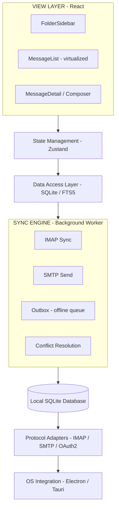

## Problem Statement

Design a desktop email client application — a locally-installed program that connects to one or more email providers (Gmail, Outlook, iCloud, custom IMAP), syncs mail to a local database, and provides a full-featured interface for reading, composing, searching, and organizing email. The client must work offline and reconcile state with the server when connectivity returns.

This is fundamentally different from **webmail** (gmail.com, outlook.com) — webmail is a server-rendered thin client where the server holds all state. An email client is a **fat client with a local database as the source of truth**, a background sync engine, and protocol adapters for IMAP/SMTP. The front-end architecture is closer to a database-backed desktop application than a typical web SPA.

The architectural challenge: managing a local data store with 100K+ messages, syncing bidirectionally with multiple remote servers, rendering arbitrary untrusted HTML safely, and providing sub-100ms search across the entire corpus — all while keeping the UI responsive at 60fps.

**Real-world examples:** Microsoft Outlook, Apple Mail, Thunderbird, Airmail, Mailspring, Superhuman

---

## Requirements Exploration

### Functional Requirements

1. **Multi-account management:** Users connect multiple email accounts (Gmail, Outlook, iCloud, custom IMAP). Each account has independent sync, credentials, and folder structure. A "Unified Inbox" merges all accounts.
2. **Three-pane layout:** Folder sidebar (left), message list (center), message detail/reader (right). Panes are resizable via drag handles.
3. **Message reading:** Render full email HTML safely in a sandboxed environment. Support inline images, attachments, quoted replies, and signatures.
4. **Composition:** Rich text editor with bold, italic, lists, links, inline images. Reply, Reply All, Forward with proper header prefill. Signature management per account.
5. **Threading:** Group messages into conversations by `In-Reply-To` / `References` headers. Show thread as a collapsible stack in the detail pane.
6. **Folder/label management:** Standard folders (Inbox, Sent, Drafts, Trash, Archive, Spam) + custom folders. Drag-and-drop to move messages between folders.
7. **Search:** Full-text search across all mail (subject, sender, body, recipient) with < 200ms results for local queries. Structured filters: `from:`, `to:`, `has:attachment`, `is:unread`, date range.
8. **Bulk operations:** Select-all, multi-select, archive, delete, mark read/unread, move-to-folder on batches of 1000+ messages.
9. **Offline mode:** Read all synced mail offline. Compose and queue messages for sending when online. All mutations (read, star, delete, move) are queued and synced.
10. **Notifications:** OS-level desktop notifications for new mail. Per-account and per-folder notification preferences.
11. **Attachment handling:** Preview common file types inline (PDF, images). Download attachments to local filesystem. Track download progress.
12. **Contact autocomplete:** Token input with autocomplete for To/Cc/Bcc fields, ranked by communication frequency.

### Non-Functional Requirements

| Category      | Requirement                         | Target                                                            |
| ------------- | ----------------------------------- | ----------------------------------------------------------------- |
| Performance   | App launch to interactive inbox     | < 1.5s (reading from local DB)                                    |
| Performance   | Message list scroll                 | 60fps sustained for 100K+ message inboxes                         |
| Performance   | Search response time (local FTS)    | < 200ms for 500K messages                                         |
| Performance   | Message open (HTML render)          | < 300ms for typical marketing email                               |
| Latency       | Sync new mail detection (IMAP IDLE) | < 5s from server receipt                                          |
| Latency       | Send message (SMTP submission)      | < 2s (or queued with instant UI feedback)                         |
| Storage       | Local database size                 | < 2GB for 500K messages (index + bodies, no attachments)          |
| Storage       | Attachment cache                    | Configurable, default 5GB, LRU eviction                           |
| Offline       | Full offline read capability        | All synced messages available                                     |
| Offline       | Offline write queue capacity        | Unlimited (bounded by disk)                                       |
| Security      | HTML email rendering                | Zero XSS — sandboxed iframe, script-src 'none'                    |
| Security      | Credential storage                  | OS keychain (Keytar/macOS Keychain/Windows Credential Store)      |
| Security      | Remote image blocking               | Default block; per-sender allowlist                               |
| Accessibility | WCAG compliance                     | AA (keyboard-first power user interface)                          |
| Reliability   | Sync conflict resolution            | Last-writer-wins for flags; server-authoritative for folder moves |

---

## Capacity Estimation & Constraints

```
Typical power user:
  Accounts: 2–3 (personal Gmail + work Outlook + newsletter catch-all)
  Total messages: ~200K across all accounts (10 years of email)
  Inbox messages: ~5K unread/recent
  Messages received/day: ~100 (50 real + 50 automated/newsletters)
  Messages sent/day: ~30

Storage estimation:
  Average message header + body (text): ~5KB
  200K messages × 5KB = ~1GB raw text
  SQLite with FTS5 index overhead: ~1.5GB total
  Attachment cache (most recent 6 months): ~3GB

Memory budget (Electron app):
  Active message list (500 rows metadata): ~500KB
  Open thread (10 messages with HTML): ~2MB
  Contact autocomplete index: ~5MB (50K contacts)
  Total working memory: < 200MB

Sync bandwidth:
  New mail check (IMAP IDLE): ~0 bandwidth (push notification)
  Full sync (initial setup, 200K messages headers): ~1GB one-time
  Incremental sync: ~50KB/day (100 new message headers + bodies)

Operations per session:
  Read messages: ~50
  Archive/delete: ~30
  Compose/send: ~5
  Search: ~10
```

**Architecture implications:**

- 200K messages cannot be held in memory — must be paged from SQLite. The message list must be virtualized.
- 1.5GB SQLite database requires efficient indexing. FTS5 provides < 200ms full-text search at this scale.
- IMAP IDLE (push) is essential — polling 3 accounts every 30s wastes battery and bandwidth on desktop.
- Initial sync of 200K messages takes minutes — must be background with progressive UI updates.

---

## Architecture / High-Level Design

### Rendering Strategy

**Client-side rendering (CSR)** — this is a desktop application (Electron or Tauri). There is no server-side rendering. The local SQLite database is the data source for all UI reads.

The architecture is **offline-first by design**: the UI always reads from the local database. The sync engine writes to the local database, and the UI reactively updates. The network is an implementation detail of the sync layer, not a concern of the view layer.

### Navigation Model

**Single-window, multi-pane application.** Not a traditional SPA with routes — the three-pane layout is always visible. "Navigation" means changing the selected folder (left pane), the selected thread (center pane), or the view mode (reader vs. composer in the right pane).

Deep linking is limited to `mailto:` protocol handler support (OS launches the client with a pre-filled compose view).

### System Architecture Diagram



### Component Architecture

```
<App>
  <ThemeProvider>
    <KeyboardShortcutProvider>
      <SplitPaneLayout>
        <FolderSidebar>              ← 200px, resizable
          <AccountGroup>             ← collapsible per account
            <FolderItem />           ← with unread badge
          </AccountGroup>
          <UnifiedInboxToggle />
        </FolderSidebar>

        <MessageListPane>            ← 300–400px, resizable
          <SearchBar />              ← with filter chips
          <BulkActionBar />          ← visible when multi-selecting
          <VirtualizedMessageList>
            <MessageRow />           ← star, checkbox, subject, sender, date, snippet
          </VirtualizedMessageList>
        </MessageListPane>

        <DetailPane>                 ← fills remaining space
          <ThreadView>               ← collapsed messages in thread
            <MessageDetail>          ← sandboxed HTML rendering
              <MessageHeader />      ← from, to, cc, date, attachments
              <SandboxedHtmlFrame /> ← iframe with CSP
              <AttachmentList />
            </MessageDetail>
          </ThreadView>
          — OR —
          <ComposeView>              ← rich text editor
            <RecipientField />       ← token input with autocomplete
            <SubjectField />
            <RichTextEditor />       ← TipTap / ProseMirror
            <AttachmentUploader />
            <SendButton />
          </ComposeView>
        </DetailPane>
      </SplitPaneLayout>
    </KeyboardShortcutProvider>
  </ThemeProvider>
</App>
```

### State Management Strategy

| State Type                                   | What Lives Here                 | Storage                      |
| -------------------------------------------- | ------------------------------- | ---------------------------- |
| Server state (messages, folders)             | Local SQLite database           | Disk-backed, queryable       |
| UI state (selections, pane sizes)            | Zustand in-memory store         | RAM, lost on restart         |
| Persistent UI state (pane sizes, sort prefs) | localStorage                    | Survives restart             |
| Composer drafts                              | SQLite drafts table + auto-save | Disk-backed, recoverable     |
| Sync state (last UID, cursors)               | SQLite sync_state table         | Per-account, per-folder      |
| Outbox (pending sends)                       | SQLite outbox table             | Survives offline, crash-safe |
| Credentials (OAuth tokens)                   | OS Keychain                     | Encrypted, per-user          |

---

## Data Model / Entities

### Database Schema (SQLite)

```sql
CREATE TABLE accounts (
  id TEXT PRIMARY KEY,
  email TEXT NOT NULL,
  display_name TEXT NOT NULL,
  provider TEXT NOT NULL,  -- 'gmail' | 'outlook' | 'icloud' | 'imap-generic'
  imap_host TEXT NOT NULL,
  imap_port INTEGER NOT NULL,
  smtp_host TEXT NOT NULL,
  smtp_port INTEGER NOT NULL,
  last_synced_at INTEGER
);

CREATE TABLE folders (
  id TEXT PRIMARY KEY,
  account_id TEXT NOT NULL REFERENCES accounts(id),
  name TEXT NOT NULL,
  role TEXT NOT NULL,  -- 'inbox' | 'sent' | 'drafts' | 'trash' | 'archive' | 'spam' | 'custom'
  unread_count INTEGER DEFAULT 0,
  total_count INTEGER DEFAULT 0,
  parent_folder_id TEXT REFERENCES folders(id),
  imap_uidvalidity INTEGER,
  imap_highest_modseq INTEGER
);

CREATE TABLE threads (
  id TEXT PRIMARY KEY,
  account_id TEXT NOT NULL REFERENCES accounts(id),
  subject TEXT NOT NULL,
  snippet TEXT NOT NULL,
  last_message_at INTEGER NOT NULL,
  is_unread INTEGER DEFAULT 0,
  is_starred INTEGER DEFAULT 0,
  has_attachments INTEGER DEFAULT 0,
  message_count INTEGER DEFAULT 1
);

CREATE TABLE messages (
  id TEXT PRIMARY KEY,
  thread_id TEXT NOT NULL REFERENCES threads(id),
  account_id TEXT NOT NULL REFERENCES accounts(id),
  folder_id TEXT NOT NULL REFERENCES folders(id),
  message_id_header TEXT,  -- RFC 2822 Message-ID
  in_reply_to TEXT,
  from_name TEXT NOT NULL,
  from_email TEXT NOT NULL,
  to_json TEXT NOT NULL,   -- JSON array of {name, email}
  cc_json TEXT,
  bcc_json TEXT,
  subject TEXT NOT NULL,
  body_text TEXT,
  body_html TEXT,
  received_at INTEGER NOT NULL,
  is_read INTEGER DEFAULT 0,
  is_starred INTEGER DEFAULT 0,
  is_draft INTEGER DEFAULT 0,
  imap_uid INTEGER,
  flags_json TEXT           -- JSON array of IMAP flags
);

CREATE INDEX idx_messages_folder ON messages(folder_id, received_at DESC);
CREATE INDEX idx_messages_thread ON messages(thread_id, received_at ASC);
CREATE INDEX idx_messages_unread ON messages(folder_id, is_read) WHERE is_read = 0;

-- Full-text search index
CREATE VIRTUAL TABLE messages_fts USING fts5(
  subject, from_name, from_email, body_text,
  content=messages, content_rowid=rowid
);

CREATE TABLE attachments (
  id TEXT PRIMARY KEY,
  message_id TEXT NOT NULL REFERENCES messages(id),
  filename TEXT NOT NULL,
  mime_type TEXT NOT NULL,
  size_bytes INTEGER NOT NULL,
  content_id TEXT,         -- for inline images (cid: references)
  is_downloaded INTEGER DEFAULT 0,
  local_path TEXT
);

CREATE TABLE outbox (
  id TEXT PRIMARY KEY,
  account_id TEXT NOT NULL REFERENCES accounts(id),
  draft_json TEXT NOT NULL,  -- serialized Draft object
  status TEXT DEFAULT 'pending',  -- 'pending' | 'sending' | 'failed'
  attempts INTEGER DEFAULT 0,
  last_attempt_at INTEGER,
  error_message TEXT,
  created_at INTEGER NOT NULL
);

CREATE TABLE contacts (
  id TEXT PRIMARY KEY,
  email TEXT NOT NULL UNIQUE,
  name TEXT,
  frequency INTEGER DEFAULT 1,  -- communication frequency for ranking
  last_contacted_at INTEGER
);
```

### TypeScript Types (View Layer)

```typescript
type Account = {
  id: string;
  email: string;
  displayName: string;
  provider: "gmail" | "outlook" | "icloud" | "imap-generic";
  lastSyncedAt: number | null;
  syncStatus: "idle" | "syncing" | "error";
};

type Folder = {
  id: string;
  accountId: string;
  name: string;
  role: "inbox" | "sent" | "drafts" | "trash" | "archive" | "spam" | "custom";
  unreadCount: number;
  totalCount: number;
  parentFolderId: string | null;
  children: Folder[]; // for tree rendering
};

type ThreadSummary = {
  id: string;
  accountId: string;
  subject: string;
  snippet: string;
  participants: Array<{ name: string; email: string }>;
  lastMessageAt: number;
  isUnread: boolean;
  isStarred: boolean;
  hasAttachments: boolean;
  messageCount: number;
};

type Message = {
  id: string;
  threadId: string;
  from: { name: string; email: string };
  to: Array<{ name: string; email: string }>;
  cc: Array<{ name: string; email: string }>;
  subject: string;
  bodyText: string;
  bodyHtml: string;
  receivedAt: number;
  isRead: boolean;
  isStarred: boolean;
  attachments: Attachment[];
};

type Attachment = {
  id: string;
  filename: string;
  mimeType: string;
  sizeBytes: number;
  contentId: string | null;
  isDownloaded: boolean;
  localPath: string | null;
  downloadProgress: number; // 0–100, for active downloads
};

type Draft = {
  id: string;
  accountId: string;
  threadId: string | null;
  inReplyToMessageId: string | null;
  replyType: "reply" | "reply-all" | "forward" | null;
  to: Array<{ name: string; email: string }>;
  cc: Array<{ name: string; email: string }>;
  bcc: Array<{ name: string; email: string }>;
  subject: string;
  bodyHtml: string;
  attachments: Attachment[];
  lastSavedAt: number;
};
```

<Callout>
**Why SQLite instead of IndexedDB?** An email client manages 200K+ structured records with complex queries (full-text search, multi-column filtering, sorted pagination). SQLite with FTS5 handles this in < 200ms. IndexedDB lacks full-text search, has no query planner, and requires manual index management — it would produce 2–5x slower queries at this scale.
</Callout>

---

## Interface Definition (API)

The email client's "API" is the contract between the View layer and the Data Access / Sync Engine layers. This is not a remote HTTP API — it's an internal IPC interface.

### Data Access Interface

```typescript
interface MailDataAccess {
  // Folder operations
  getFolders(accountId: string): Folder[];
  getUnifiedInbox(): ThreadSummary[];

  // Thread/message queries (paginated, from SQLite)
  getThreads(query: ThreadQuery): {
    threads: ThreadSummary[];
    totalCount: number;
  };
  getMessages(threadId: string): Message[];
  getMessage(messageId: string): Message;

  // Mutations (applied locally + queued for sync)
  markAsRead(messageIds: string[]): void;
  markAsUnread(messageIds: string[]): void;
  star(threadIds: string[]): void;
  unstar(threadIds: string[]): void;
  moveToFolder(threadIds: string[], targetFolderId: string): void;
  deleteThreads(threadIds: string[]): void;
  archiveThreads(threadIds: string[]): void;

  // Search
  search(query: SearchQuery): { threads: ThreadSummary[]; totalCount: number };

  // Compose
  saveDraft(draft: Draft): Draft;
  sendMessage(draft: Draft): void; // moves to outbox
  discardDraft(draftId: string): void;

  // Contacts
  searchContacts(query: string, limit: number): Contact[];
}

type ThreadQuery = {
  folderId: string;
  page: number;
  pageSize: number; // default 50
  sortBy: "date" | "subject" | "sender";
  sortDir: "asc" | "desc";
  filterUnread?: boolean;
  filterStarred?: boolean;
};

type SearchQuery = {
  text?: string;
  from?: string;
  to?: string;
  subject?: string;
  hasAttachment?: boolean;
  isUnread?: boolean;
  isStarred?: boolean;
  folderId?: string;
  accountId?: string;
  dateAfter?: number;
  dateBefore?: number;
  page: number;
  pageSize: number;
};
```

### Sync Engine Interface

```typescript
interface SyncEngine {
  // Account management
  addAccount(config: AccountConfig): Promise<void>;
  removeAccount(accountId: string): Promise<void>;

  // Sync control
  syncAll(): void; // trigger sync for all accounts
  syncFolder(folderId: string): void; // sync specific folder
  pauseSync(): void;
  resumeSync(): void;

  // Status
  getSyncStatus(accountId: string): SyncStatus;
  onSyncProgress(callback: (progress: SyncProgress) => void): () => void;
  onNewMail(callback: (accountId: string, count: number) => void): () => void;

  // Outbox
  getOutboxEntries(): OutboxEntry[];
  retryOutboxEntry(entryId: string): void;
  cancelOutboxEntry(entryId: string): void;
}

type SyncStatus = {
  state: "idle" | "syncing" | "error";
  lastSyncedAt: number | null;
  error: string | null;
  progress: { current: number; total: number } | null;
};

type OutboxEntry = {
  id: string;
  accountId: string;
  subject: string;
  to: string[];
  status: "pending" | "sending" | "failed";
  attempts: number;
  lastAttemptAt: number | null;
  error: string | null;
  createdAt: number;
};
```

### IMAP Sync Protocol

```typescript
// Delta sync using IMAP CONDSTORE extension
async function syncFolder(account: Account, folder: Folder): Promise<void> {
  const connection = await imapConnect(account);

  // 1. Check for new messages since last known UID
  const newMessages = await connection.fetch(`${folder.lastUid + 1}:*`, {
    envelope: true,
    bodystructure: true,
    flags: true,
  });

  // 2. Check for flag changes since last HIGHESTMODSEQ
  const changedFlags = await connection.fetch("1:*", {
    flags: true,
    modseq: folder.highestModseq,
  });

  // 3. Check for expunged messages
  const expunged = await connection.expungedSince(folder.highestModseq);

  // 4. Apply changes to local SQLite
  await db.transaction(() => {
    for (const msg of newMessages) insertMessage(msg);
    for (const change of changedFlags) updateFlags(change);
    for (const uid of expunged) deleteMessage(uid);
    updateFolderSyncState(folder.id, connection.highestModseq);
  });

  // 5. Enter IDLE for real-time push
  connection.idle();
  connection.on("mail", () => syncFolder(account, folder));
}
```

<Callout>
  **Why CONDSTORE/QRESYNC over full folder scan?** Without CONDSTORE, detecting
  flag changes requires fetching flags for all messages on every sync — O(n) for
  50K messages. CONDSTORE lets you query "what changed since modseq X" —
  typically O(10) messages per sync cycle. This is the difference between a
  5-second sync and a 50ms sync.
</Callout>

---

## Caching Strategy

### Local Database as Primary Cache

The SQLite database IS the cache. There is no separate caching layer for the primary data. The UI reads directly from SQLite. The sync engine writes to SQLite. This is the "offline-first" model — the local database is always available, and the network is an optimization for freshness.

### Message Body Cache

- **Full bodies** are stored in SQLite for all synced messages (within the sync window).
- **Sync window:** Default: last 12 months for Inbox, last 3 months for other folders. Configurable per account.
- **Beyond sync window:** Only headers are stored. Body is fetched on demand when the user opens the message (with a loading indicator).
- **Memory cache:** The last 20 opened message bodies are kept in memory for instant back/forward navigation within a thread.

### Attachment Cache

| Policy            | Value                                            |
| ----------------- | ------------------------------------------------ |
| Max cache size    | 5GB (configurable)                               |
| Eviction          | LRU by last access time                          |
| Storage location  | `{appData}/attachments/{accountId}/{messageId}/` |
| Pre-download      | Attachments < 1MB auto-download during sync      |
| Large attachments | Download on demand with progress indicator       |

### Contact Index Cache

- **In-memory:** Top 500 contacts by frequency, loaded on app start.
- **Disk:** All contacts in SQLite, queried on each keystroke (debounced 150ms).
- **Index update:** On every sent message, increment frequency for all recipients. On every received message, upsert sender.

### Folder Unread Counts

- **Stored in SQLite** per folder row. Updated transactionally when messages are marked read/unread.
- **Read into memory** on app start for sidebar badge rendering.
- **Updated reactively** via a DB trigger (or manual transaction hook) — when a message's `is_read` flag changes, the folder's `unread_count` is decremented/incremented.

---

## Rendering & Performance Deep Dive

### Critical Rendering Path (App Launch)

```
T=0ms     Electron main process starts
T=50ms    Browser window created, shell HTML loads
T=100ms   React app mounts, reads folder tree from SQLite (< 50ms for 200 folders)
T=150ms   Sidebar renders with folder names + cached unread counts
T=200ms   Message list queries SQLite for Inbox threads (page 1, 50 items)
T=250ms   Message list renders (virtualized, only 15 visible rows)
T=300ms   App is interactive — user can click folders, scroll, search

Background (non-blocking):
T=500ms   Sync engine starts, connects to all accounts via IMAP
T=2000ms  First sync completes, unread counts may update
T=5000ms  IMAP IDLE connections established (real-time push)
```

**Key insight:** The app is interactive in < 300ms because it reads from the local database, not the network. The sync engine runs entirely in the background.

### Message List Virtualization

**The challenge:** An Inbox with 50K threads. Even rendering a summary row per thread would produce 50K DOM nodes.

**Solution:** react-virtuoso with dynamic row heights.

- **Visible rows:** ~15 at any time (list height / row height).
- **Overscan:** 5 rows above and below (total ~25 rendered).
- **Row height:** Fixed 72px per row (avatar + subject + snippet + date).
- **Scroll performance:** 60fps guaranteed because only 25 DOM nodes exist at any time.
- **Selection model:** `selectedIds: Set<string>` in Zustand. Shift-click for range, Cmd-click for toggle.

### HTML Email Rendering (The Hardest Problem)

Email HTML is unlike web HTML. It uses:

- `<table>` layouts (not flexbox/grid)
- Inline styles (not CSS classes)
- Outdated attributes (`bgcolor`, `width`, `align`)
- Embedded `<style>` tags with non-scoped selectors
- `cid:` references for inline images
- Remote images (tracking pixels)

**Rendering architecture:**

```
┌─────────────────────────────────────────────────────────┐
│  Parent React App (main frame)                          │
│                                                          │
│  ┌─────────────────────────────────────────────────┐   │
│  │  <iframe                                         │   │
│  │    sandbox="allow-same-origin"                    │   │
│  │    csp="script-src 'none'; object-src 'none'"    │   │
│  │    srcdoc={sanitizedHtml}                         │   │
│  │  />                                               │   │
│  │                                                   │   │
│  │  Email HTML renders here (isolated from app)      │   │
│  └─────────────────────────────────────────────────┘   │
└─────────────────────────────────────────────────────────┘
```

**Sanitization pipeline (before rendering):**

1. Parse HTML with DOMParser.
2. Remove all `<script>`, `<object>`, `<embed>`, `<applet>`, `<iframe>` elements.
3. Remove all event handler attributes (`onclick`, `onerror`, etc.).
4. Rewrite `cid:` image references to local file paths (cached attachments).
5. Replace remote image `src` with a placeholder. Show "Load images" button.
6. Validate all `<a href>` — allowlist `http:`, `https:`, `mailto:` only.
7. Add `rel="noopener noreferrer"` to all links.
8. Inject `<base target="_blank">` so all links open in the default browser.

**Height measurement:** After the iframe content loads, measure `document.body.scrollHeight` and set the iframe height to match (no iframe scrollbar — the parent pane scrolls).

<Callout>
**Why not render email HTML directly in the React tree?** Email HTML contains `<style>` tags with selectors like `p { color: red }` that would leak into the entire application. An iframe provides complete style isolation. The `sandbox` attribute prevents script execution even if the sanitizer misses something — defense in depth.
</Callout>

### Search Performance

**SQLite FTS5 configuration:**

```sql
CREATE VIRTUAL TABLE messages_fts USING fts5(
  subject,
  from_name,
  from_email,
  body_text,
  content=messages,
  content_rowid=rowid,
  tokenize='porter unicode61'
);
```

**Query patterns:**

```sql
-- Full-text search
SELECT m.* FROM messages m
JOIN messages_fts ON messages_fts.rowid = m.rowid
WHERE messages_fts MATCH 'invoice AND from_email:accounting*'
ORDER BY rank
LIMIT 50 OFFSET 0;

-- Structured filter
SELECT * FROM messages
WHERE folder_id = ? AND is_read = 0 AND received_at > ?
ORDER BY received_at DESC
LIMIT 50;
```

**Performance at scale:** FTS5 with the porter stemmer and unicode61 tokenizer handles 500K messages in < 200ms for typical queries. Index size is ~30% of the original text size.

**Incremental indexing:** New messages are added to the FTS index immediately after insertion (within the same transaction). No separate indexing pass needed.

### Bundle & Memory Optimization

| Concern              | Strategy                                                                                                     |
| -------------------- | ------------------------------------------------------------------------------------------------------------ |
| Electron binary size | Use `electron-builder` with ASAR packaging. Target < 100MB installed.                                        |
| JS bundle            | Code-split: core (500KB), composer (200KB), settings (100KB). Lazy-load composer on first use.               |
| Memory leaks         | WeakRef for message body cache. Close unused IMAP connections after 5 min idle.                              |
| SQLite memory        | Use WAL mode for concurrent read/write. Set `cache_size = -64000` (64MB page cache).                         |
| Renderer process     | Single renderer process for the main window. No additional BrowserWindows for compose (use in-window modal). |

---

## Security Deep Dive

### Threat Model

| Threat                | Attack Vector                                      | Impact                                          | Mitigation                                                                        |
| --------------------- | -------------------------------------------------- | ----------------------------------------------- | --------------------------------------------------------------------------------- |
| XSS via email HTML    | Malicious `<script>` in email body                 | Full app compromise (Electron = Node.js access) | Sandboxed iframe + CSP `script-src 'none'` + HTML sanitization                    |
| Remote code execution | Crafted attachment triggers Electron vulnerability | System compromise                               | `contextIsolation: true`, `nodeIntegration: false`, `sandbox: true` on renderer   |
| Tracking pixels       | 1×1 remote images reveal IP and open time          | Privacy violation                               | Block remote images by default; per-sender allowlist                              |
| Phishing links        | Display text differs from actual URL               | Credential theft                                | Show actual URL on hover; warn on domain mismatch; check against phishing DB      |
| Credential theft      | Attacker reads localStorage/config files           | Account takeover                                | Store tokens in OS Keychain (encrypted, OS-level access control)                  |
| MITM on IMAP/SMTP     | Attacker intercepts unencrypted connection         | Email content exposure                          | Enforce TLS; reject invalid certificates; certificate pinning for major providers |
| Outbox tampering      | Attacker modifies queued outbound messages         | Send unauthorized email                         | Outbox in SQLite with app-level integrity checks; sign outbox entries             |

### Electron Security Hardening

```javascript
// main.js — BrowserWindow configuration
const mainWindow = new BrowserWindow({
  webPreferences: {
    contextIsolation: true, // renderer cannot access Node.js
    nodeIntegration: false, // no require() in renderer
    sandbox: true, // Chromium sandbox enabled
    webSecurity: true, // enforce same-origin policy
    allowRunningInsecureContent: false,
    enableRemoteModule: false, // deprecated, ensure disabled
  },
});

// Preload script exposes ONLY the mail API via contextBridge
contextBridge.exposeInMainWorld("mailAPI", {
  getFolders: (accountId) => ipcRenderer.invoke("mail:getFolders", accountId),
  getThreads: (query) => ipcRenderer.invoke("mail:getThreads", query),
  // ... only whitelisted operations
});
```

### Remote Image Blocking

```typescript
function processEmailHtml(html: string, senderEmail: string): string {
  const doc = new DOMParser().parseFromString(html, "text/html");

  const images = doc.querySelectorAll("img");
  for (const img of images) {
    const src = img.getAttribute("src");

    if (src?.startsWith("cid:")) {
      // Inline image — resolve to local attachment path
      img.setAttribute("src", resolveContentId(src));
    } else if (isRemoteUrl(src)) {
      if (isSenderTrusted(senderEmail)) {
        // Trusted sender — proxy through our image cache
        img.setAttribute("src", proxyUrl(src));
      } else {
        // Untrusted — replace with placeholder
        img.setAttribute("src", "data:image/svg+xml,..."); // placeholder icon
        img.setAttribute("data-original-src", src);
        img.classList.add("blocked-image");
      }
    }
  }

  return doc.documentElement.outerHTML;
}
```

<Callout>
  **Why proxy trusted sender images instead of loading directly?** Even for
  trusted senders, direct image loading reveals the user's IP address and exact
  open time. Proxying through a local cache (or CDN proxy) masks the user's IP
  and allows the client to strip tracking query parameters.
</Callout>

---

## Scalability & Reliability

### Scalability Patterns

- **Virtualized message list:** Handles 100K+ threads at 60fps.
- **Paginated SQLite queries:** Never load more than 50 rows at a time. Keyset pagination (`WHERE received_at < ? ORDER BY received_at DESC LIMIT 50`) for stable performance regardless of dataset size.
- **Incremental sync:** CONDSTORE/QRESYNC ensures sync time is proportional to changes, not total mailbox size. A sync cycle touches 10–50 messages, not 200K.
- **Background sync worker:** Runs in a separate thread (Node.js worker_threads or Electron utility process) to never block the UI.
- **Lazy body loading:** Messages outside the sync window store only headers. Body is fetched on demand. This caps database size even for users with 10+ year email history.

### Failure Handling

| Failure Mode                    | Detection                           | Recovery                                                                                                                   |
| ------------------------------- | ----------------------------------- | -------------------------------------------------------------------------------------------------------------------------- |
| IMAP connection dropped         | Socket close / timeout              | Exponential backoff reconnect (1s, 2s, 4s... max 5min). UI shows "Reconnecting..." status                                  |
| IMAP auth fails (token expired) | 401/auth error from server          | Trigger OAuth refresh flow. If refresh fails, prompt user to re-authenticate                                               |
| SMTP send fails                 | SMTP error code / timeout           | Move entry to outbox "failed" state. Show notification. Auto-retry 3x with backoff. Surface error to user after 3 failures |
| SQLite corruption               | PRAGMA integrity_check fails        | Restore from last WAL checkpoint. If unrecoverable, re-sync from server (IMAP is the source of truth)                      |
| Disk full                       | SQLite write fails with SQLITE_FULL | Show "Disk full" alert. Offer to purge attachment cache. Pause sync.                                                       |
| Network offline                 | navigator.onLine + fetch failures   | Switch to offline mode. All reads continue from local DB. Writes queue to outbox. Show "Offline" indicator                 |

### Conflict Resolution

When the user flags a message on two devices simultaneously, the sync engine must resolve the conflict:

- **Flag changes (read, starred, deleted):** **Last-writer-wins** with server as authority. On next sync, the server's flag state overwrites the local state. Rationale: flags are idempotent — "mark as read" twice = "mark as read" once.
- **Folder moves:** Server-authoritative. If message is moved to Trash locally and to Archive remotely, the server wins on next sync.
- **Draft edits:** **Client wins** with timestamp comparison. If the local draft is newer than the server draft, push local to server. If server is newer (edited on another device), show a conflict dialog.

---

## Accessibility Deep Dive

### Keyboard Navigation Model

An email client is a power-user tool. Keyboard efficiency is paramount.

| Context      | Key           | Action                               |
| ------------ | ------------- | ------------------------------------ |
| Global       | `Cmd+N`       | New compose window                   |
| Global       | `Cmd+Shift+F` | Focus search bar                     |
| Global       | `Cmd+1/2/3`   | Switch between panes                 |
| Message list | `↑` / `↓`     | Navigate between messages            |
| Message list | `Enter`       | Open selected message in detail pane |
| Message list | `e`           | Archive selected                     |
| Message list | `#`           | Delete selected                      |
| Message list | `r`           | Reply to selected                    |
| Message list | `a`           | Reply all to selected                |
| Message list | `f`           | Forward selected                     |
| Message list | `s`           | Toggle star                          |
| Message list | `Shift+I`     | Mark as read                         |
| Message list | `Shift+U`     | Mark as unread                       |
| Message list | `Space`       | Toggle selection (for bulk ops)      |
| Compose      | `Cmd+Enter`   | Send message                         |
| Compose      | `Cmd+Shift+D` | Save draft and close                 |
| Compose      | `Escape`      | Discard draft (with confirmation)    |

### ARIA Roles and Landmarks

```html
<div role="application" aria-label="Email Client">
  <nav role="navigation" aria-label="Folders">
    <div role="tree" aria-label="Account folders">
      <div role="treeitem" aria-expanded="true" aria-selected="{isActive}">
        Inbox (3 unread)
      </div>
    </div>
  </nav>

  <main role="main" aria-label="Messages">
    <div role="listbox" aria-label="Message list" aria-multiselectable="true">
      <div
        role="option"
        aria-selected="{isSelected}"
        aria-label="From Alice: Meeting tomorrow, received 2 hours ago, unread"
      >
        ...
      </div>
    </div>
  </main>

  <section role="region" aria-label="Message detail" aria-live="polite">
    ...
  </section>
</div>
```

### Screen Reader Announcements

- **New mail:** `aria-live="polite"` region announces "3 new messages in Inbox"
- **Folder change:** Announce "Inbox, 142 messages, 3 unread" when folder changes
- **Bulk action:** Announce "5 messages archived" after bulk operation
- **Send confirmation:** Announce "Message sent to alice@example.com"
- **Error states:** `role="alert"` for sync errors, send failures

---

## Monitoring & Observability

### Client-Side Metrics

| Metric                    | Collection                                | Alert Threshold          |
| ------------------------- | ----------------------------------------- | ------------------------ |
| App launch to interactive | Custom timer                              | > 2s                     |
| Sync duration (per cycle) | Sync engine timer                         | > 10s                    |
| SQLite query time (p95)   | Instrumented data access layer            | > 500ms                  |
| FTS search time (p95)     | Instrumented search                       | > 300ms                  |
| Memory usage (renderer)   | `process.memoryUsage()` sampled every 60s | > 500MB                  |
| Outbox failure rate       | Outbox entry status changes               | > 3 consecutive failures |
| IMAP reconnection rate    | Sync engine counter                       | > 5/hour                 |
| Electron crash rate       | `crashReporter`                           | Any crash                |

### Telemetry (Opt-In)

- **Anonymized usage stats:** Feature usage frequency, search query patterns (without content), account count, message volume.
- **Performance percentiles:** App launch time, search latency, sync duration — bucketed by message count (1K, 10K, 100K, 500K+).
- **Error reporting:** Stack traces with source maps, system info (OS, Electron version, memory). No email content or credentials ever transmitted.

### Health Checks

- **SQLite integrity:** Run `PRAGMA integrity_check` on app start (background, non-blocking).
- **Sync heartbeat:** If no sync activity for 15 minutes and network is available, alert user "Sync may be stuck."
- **Disk space:** Warn at 90% disk usage. Pause sync at 95%.

---

## Trade-offs

| Decision                                         | Pro                                                 | Con                                                           |
| ------------------------------------------------ | --------------------------------------------------- | ------------------------------------------------------------- |
| SQLite over IndexedDB                            | Full SQL, FTS5, 200K+ message performance           | Requires Electron/Tauri (no pure web app)                     |
| Offline-first over network-first                 | Instant reads, works offline, predictable latency   | Complex sync, conflict resolution, storage management         |
| Sandboxed iframe over direct rendering           | Complete style/script isolation, defense-in-depth   | Height measurement complexity, no React context inside iframe |
| IMAP IDLE over polling                           | Real-time (< 5s) new mail detection                 | One TCP connection per account permanently open               |
| SQLite FTS5 over external search (Elasticsearch) | Local, no network dependency, < 200ms for 500K msgs | Limited relevance ranking vs. dedicated search engine         |
| Rich text editor (TipTap) over plain textarea    | Full formatting, paste-from-Word, inline images     | Large dependency (~200KB), complex state                      |
| Electron over pure web                           | Native OS integration, SQLite, filesystem access    | Large binary (~100MB), higher memory, update complexity       |
| CONDSTORE sync over full scan                    | O(changes) per sync instead of O(mailbox-size)      | Requires server support; fallback to full scan if unsupported |

---

## What Great Looks Like

A **senior** answer covers:

- Three-pane layout with folder sidebar, message list, and detail view.
- Basic data model (messages, folders) with IMAP fetch on demand.
- Compose with reply/forward.
- Mentions "offline support" and "search" without implementation details.

A **staff** answer additionally:

- Offline-first architecture with SQLite as source of truth and background sync.
- Sandboxed iframe HTML rendering with specific CSP and sanitization pipeline.
- IMAP delta sync using CONDSTORE/QRESYNC (not full-folder scan on every check).
- Full-text search via FTS5 with specific tokenizer config and query patterns.
- Outbox pattern for offline sends with retry and idempotency.
- Keyboard-first design as a core requirement with specific shortcut mappings.
- Remote image blocking with per-sender trust model for privacy.
- Contact autocomplete ranked by communication frequency.

A **principal** answer additionally:

- Capacity estimation that drives sync window decisions (12 months inbox, 3 months other folders).
- Electron security hardening (contextIsolation, sandbox, IPC whitelist via contextBridge).
- Conflict resolution strategy (LWW for flags, server-authoritative for moves, client-wins-with-timestamp for drafts).
- Database maintenance strategy (VACUUM, integrity checks, WAL checkpointing).
- Organizational considerations: the sync engine is a separate module/team from the UI — the Data Access interface is the team boundary contract.
- Migration path: initial release supports 2–3 major providers. The MailProvider abstraction allows adding Exchange/EWS or JMAP in future without UI changes.
- Performance profiling strategy: identify the 5% of users with 500K+ messages and design the sync window / lazy body loading specifically for them.

---

## Key Takeaways

- An email client is offline-first: the local SQLite database is the source of truth, not the IMAP server. The UI never waits for the network.
- HTML email rendering is a security-critical problem: sandboxed iframe + CSP + sanitization + remote image blocking are all mandatory.
- CONDSTORE/QRESYNC makes IMAP sync proportional to changes, not mailbox size — the difference between 50ms and 5s per sync cycle.
- Virtualize the message list from day one — 100K thread inboxes are common for power users.
- SQLite FTS5 provides < 200ms full-text search for 500K messages without any external service.
- Store credentials in the OS keychain, never in config files or localStorage.
- Keyboard-first design is not optional for an email client — it's the primary interaction mode for the target user base.
- Remote image blocking is a privacy requirement, not a feature toggle. Default to blocked, with per-sender allowlisting.
