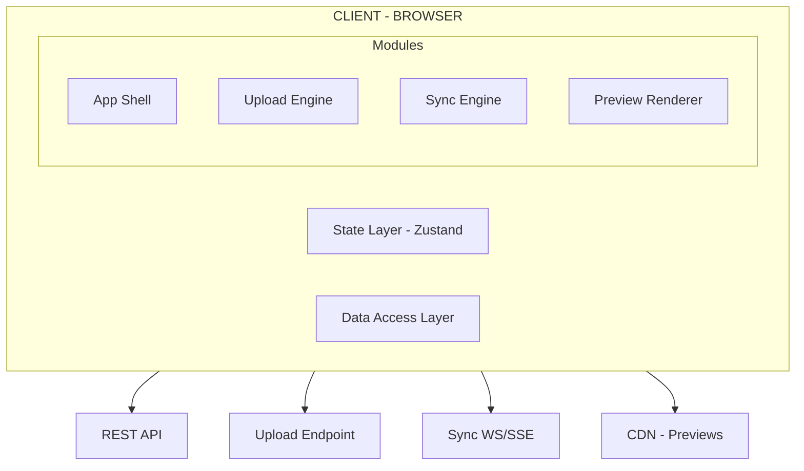

## Problem Statement

Design the frontend architecture for a cloud file storage and synchronization platform — the kind of system powering Google Drive, Dropbox, OneDrive, Box, and iCloud Drive. The core architectural challenge is building a client that can reliably upload multi-gigabyte files over unstable networks via chunked resumable transfers, perform delta sync to minimize bandwidth, present a responsive file tree for millions of files, and handle conflict resolution when multiple clients modify the same file offline.

**Scope:** File browser UI, chunked/resumable upload engine, delta sync client, real-time collaboration presence, sharing/permission management, preview generation pipeline, offline access via Service Worker, and storage quota visualization. Out of scope: server-side storage backend, billing system, mobile-native clients, and admin console.

**What makes this architecturally interesting:** Unlike CRUD apps, a file storage client must handle arbitrarily large binary payloads, maintain a local replica of remote state that can diverge for hours (offline), and reconcile those replicas without data loss — all while keeping the UI responsive during heavy I/O operations on the main thread.

**Real-world examples:** Google Drive (15GB free, real-time collaboration), Dropbox (LAN sync, smart sync), OneDrive (Files On-Demand, Office integration), Box (enterprise governance), iCloud Drive (deep OS integration).

---

## Requirements Exploration

### Functional Requirements

1. Users can browse files and folders in a nested tree with lazy-loaded expansion and breadcrumb navigation.
2. Users can upload files up to 50GB via chunked resumable uploads with real-time progress tracking.
3. Users can drag-and-drop entire folder structures, preserving hierarchy on upload.
4. The system performs delta sync — only changed bytes are transferred on subsequent syncs using rolling checksums.
5. Conflict resolution surfaces "conflicted copy" files when server and client diverge, with a merge UI.
6. Users see real-time presence indicators showing who is currently viewing or editing a file.
7. Users can share files/folders via link (view/edit/comment) or direct invitation with role-based permissions.
8. The system generates previews: thumbnails for images, rendered previews for PDF/docs, syntax-highlighted code.
9. Users can perform batch operations: multi-select move, delete, download-as-zip.
10. Offline mode allows viewing and editing recently-used files, with automatic sync on reconnection.
11. Storage quota is visualized with breakdown by file type and upgrade prompts at 80%/95% thresholds.
12. Users can search files by name, content, owner, and modification date with instant results.

### Non-Functional Requirements

| Category      | Requirement                           | Target                                  |
| ------------- | ------------------------------------- | --------------------------------------- |
| Performance   | Time to Interactive (file browser)    | < 1.8s on 4G mid-range device           |
| Performance   | File list render (1000 items)         | < 16ms frame budget (60fps scroll)      |
| Upload        | Chunk upload throughput               | Saturate available bandwidth (≥ 90%)    |
| Upload        | Resume after network failure          | < 3s to detect + resume from last chunk |
| Sync          | Delta sync overhead vs full re-upload | < 5% bandwidth for typical edits        |
| Bundle        | Initial JS payload                    | < 180KB gzipped (shell + file browser)  |
| Offline       | Recently-used file availability       | Last 50 files accessible offline        |
| Reliability   | Upload success rate on flaky 3G       | > 99.5% eventual success                |
| Consistency   | Conflict detection latency            | < 2s after reconnection                 |
| Accessibility | WCAG compliance                       | AA (AAA for focus indicators)           |

---

## Capacity Estimation & Constraints

**User profile:**

- DAU: 10M users
- Average files per user: 2,400
- Average folder depth: 4 levels
- Average file size: 4.2MB (skewed: many small docs, few large videos)

**Traffic patterns:**

- File browser navigations: 15 per session × 3 sessions/day = 450M folder reads/day → ~5,200 RPS
- Uploads: 0.8 files/user/day = 8M uploads/day → ~93 RPS
- Sync checks: every 30s per active client = 333K RPS (polling) or 10M concurrent WebSocket connections
- Search: 2 queries/session = 60M/day → ~700 RPS

**Bandwidth:**

- Upload: 8M files × 4.2MB average = 33.6TB/day inbound
- Delta sync saves: 70% bandwidth reduction for edited files → 10TB actual transfer
- Download/preview: 20M previews/day × 200KB = 4TB/day

**Client memory budget:**

- File tree metadata (visible): 500 items × 200 bytes = 100KB
- Upload queue state: 10 concurrent × 5MB buffer = 50MB peak
- IndexedDB offline cache: 500MB budget (configurable)
- Service Worker cache: 50MB for shell + previews

<Callout>
  The 50MB upload buffer per concurrent chunk is the critical memory constraint.
  A naive implementation that buffers entire files would crash tabs on large
  uploads. Streaming chunks directly from `File.slice()` to `fetch()` keeps
  memory flat regardless of file size.
</Callout>

---

## Architecture / High-Level Design

### Rendering Strategy

**CSR (Client-Side Rendering)** for the file browser workspace. Rationale:

1. File operations are inherently interactive — drag-drop, rename inline, context menus.
2. The file tree state changes constantly (real-time updates from collaborators).
3. No SEO requirement for authenticated file views.
4. Service Worker handles the app shell for instant repeat loads.

**SSR for marketing/sharing pages** — public shared folder links need SEO and OG metadata.

### Navigation Model

SPA with client-side routing. URL structure encodes navigation state:

```
/files                          → Root folder
/files/folder/{folderId}        → Nested folder view
/files/file/{fileId}/preview    → File preview overlay
/files/shared                   → Shared with me
/files/recent                   → Recently accessed
/files/trash                    → Trash (30-day retention)
/search?q=budget&type=pdf       → Search results
```

URL state preserved: current folder, view mode (grid/list), sort order, selected items. Deep links allow sharing folder views directly.

### System Architecture Diagram



### Component Architecture

```
<App>
├── <AppShell>                         [Client — persistent chrome]
│   ├── <Sidebar>                      [Client — navigation tree]
│   │   ├── <QuickAccess />            [Server — static links]
│   │   ├── <FolderTree />             [Client — lazy-loaded, virtualized]
│   │   └── <StorageQuota />           [Client — real-time usage]
│   ├── <Header>                       [Client — search, user menu]
│   │   ├── <SearchBar />              [Client — instant search]
│   │   ├── <UploadButton />           [Client — triggers upload dialog]
│   │   └── <PresenceIndicator />      [Client — active collaborators]
│   └── <MainContent>                  [Client — route-dependent]
│       ├── <Breadcrumb />             [Client — folder path]
│       ├── <Toolbar />                [Client — view/sort/batch actions]
│       ├── <FileList />               [Client — virtualized grid/list]
│       │   └── <FileItem />           [Client — individual file row/card]
│       ├── <UploadOverlay />          [Client — drag-drop zone]
│       └── <PreviewPanel />           [Client — file preview slider]
├── <UploadManager />                  [Client — background upload queue]
├── <SyncWorker />                     [Service Worker — delta sync]
└── <ConflictResolver />               [Client — modal for conflicts]
```

### State Management Strategy

| State Category                  | Store                     | Persistence      | Sync           |
| ------------------------------- | ------------------------- | ---------------- | -------------- |
| File tree metadata              | `fileTreeStore` (Zustand) | IndexedDB        | WebSocket push |
| Upload progress                 | `uploadStore` (Zustand)   | None (transient) | Local only     |
| Sync state                      | `syncStore` (Zustand)     | IndexedDB        | Bidirectional  |
| Presence                        | `presenceStore` (Zustand) | None             | WebSocket      |
| UI state (selection, view mode) | URL + `uiStore`           | URL params       | None           |
| Offline file cache              | Service Worker Cache API  | Disk             | On reconnect   |
| File content (offline)          | IndexedDB (blobs)         | Disk             | Delta sync     |

---

## Data Model / Entities

```typescript
// Core file system entities
interface FileNode {
  id: string; // UUID v7 (time-sortable)
  name: string; // Display name with extension
  type: "file" | "folder";
  mimeType: string | null; // null for folders
  size: number; // bytes, 0 for folders
  parentId: string | null; // null = root
  path: string; // /Documents/Reports/Q4.pdf
  checksum: string; // SHA-256 of content (files only)
  version: number; // Monotonic, incremented on each edit
  createdAt: string; // ISO 8601
  modifiedAt: string; // ISO 8601
  createdBy: string; // User ID
  modifiedBy: string; // User ID
  isShared: boolean;
  isFavorite: boolean;
  isOfflineAvailable: boolean; // Pinned for offline access
  thumbnailUrl: string | null; // CDN URL for preview thumbnail
  downloadUrl: string; // Signed URL, short-lived
}

interface FolderChildren {
  folderId: string;
  items: FileNode[];
  nextCursor: string | null; // Cursor-based pagination
  totalCount: number;
  hasMore: boolean;
}

// Upload management
interface UploadSession {
  sessionId: string; // Server-assigned upload session
  fileId: string; // Pre-allocated file ID
  fileName: string;
  totalSize: number;
  chunkSize: number; // 5MB default
  totalChunks: number;
  completedChunks: number[]; // Indices of confirmed chunks
  status: "pending" | "uploading" | "paused" | "completed" | "failed";
  startedAt: string;
  bytesUploaded: number;
  uploadRate: number; // bytes/sec (rolling average)
  etaSeconds: number;
  retryCount: number;
  lastError: UploadError | null;
}

interface UploadChunk {
  index: number;
  offset: number; // byte offset in file
  size: number; // actual chunk size (last may be smaller)
  checksum: string; // MD5 of chunk for integrity
  status: "pending" | "uploading" | "confirmed" | "failed";
}

interface UploadError {
  code: "NETWORK" | "TIMEOUT" | "QUOTA_EXCEEDED" | "CONFLICT" | "SERVER_ERROR";
  message: string;
  retryable: boolean;
  retryAfterMs: number | null;
}

// Delta sync
interface SyncState {
  lastSyncCursor: string; // Server cursor for incremental sync
  lastSyncAt: string;
  pendingChanges: LocalChange[]; // Outbound queue
  conflictedFiles: ConflictRecord[];
  syncStatus: "idle" | "syncing" | "error" | "offline";
}

interface LocalChange {
  id: string;
  fileId: string;
  type: "create" | "modify" | "delete" | "move" | "rename";
  timestamp: string;
  payload: DeltaPatch | null; // Binary diff for modifications
  idempotencyKey: string; // Prevents duplicate application
}

interface DeltaPatch {
  baseVersion: number; // Version this diff applies to
  baseChecksum: string; // SHA-256 of base file
  operations: DeltaOperation[];
  resultChecksum: string; // Expected checksum after apply
}

interface DeltaOperation {
  type: "copy" | "insert";
  offset: number; // Offset in new file
  sourceOffset?: number; // For 'copy': offset in old file
  length: number; // Bytes to copy or insert
  data?: ArrayBuffer; // For 'insert': new data
}

// Conflict resolution
interface ConflictRecord {
  fileId: string;
  fileName: string;
  localVersion: number;
  serverVersion: number;
  localModifiedAt: string;
  serverModifiedAt: string;
  serverModifiedBy: string;
  resolution: "pending" | "keep_local" | "keep_server" | "keep_both";
  conflictedCopyId: string | null; // ID of "filename (conflicted copy)" file
}

// Sharing & permissions
interface ShareLink {
  id: string;
  fileId: string;
  url: string;
  permission: "view" | "comment" | "edit";
  expiresAt: string | null;
  password: string | null; // Hashed, never stored in client
  downloadEnabled: boolean;
  accessCount: number;
  createdBy: string;
}

interface FilePermission {
  fileId: string;
  userId: string;
  role: "owner" | "editor" | "commenter" | "viewer";
  grantedAt: string;
  grantedBy: string;
  inherited: boolean; // From parent folder
}

// Real-time presence
interface PresenceState {
  fileId: string;
  activeUsers: ActiveUser[];
}

interface ActiveUser {
  userId: string;
  displayName: string;
  avatarUrl: string;
  activity: "viewing" | "editing";
  lastSeenAt: string; // Heartbeat timestamp
  cursorPosition?: number; // For text files
}

// Storage quota
interface StorageQuota {
  used: number; // bytes
  limit: number; // bytes
  breakdown: QuotaBreakdown[];
  percentUsed: number;
  upgradeAvailable: boolean;
}

interface QuotaBreakdown {
  category: "documents" | "images" | "videos" | "archives" | "other";
  bytes: number;
  fileCount: number;
}

// Normalized store shape
interface FileStoreState {
  entities: Record<string, FileNode>; // Normalized by ID
  folderContents: Record<string, FolderChildren>; // Children by folder ID
  selectedIds: Set<string>;
  expandedFolderIds: Set<string>;
  viewMode: "grid" | "list";
  sortBy: "name" | "modified" | "size" | "type";
  sortDirection: "asc" | "desc";
  searchQuery: string;
  searchResults: FileNode[] | null;
}
```

---

## Interface Definition (API)

### File Operations

```typescript
// List folder contents (cursor-based pagination)
// GET /api/v1/files?parentId={folderId}&cursor={cursor}&limit=100&sort=modified&order=desc
interface ListFilesResponse {
  items: FileNode[];
  nextCursor: string | null;
  totalCount: number;
}

// Get file metadata
// GET /api/v1/files/{fileId}
// Response: FileNode

// Create folder
// POST /api/v1/files
interface CreateFolderRequest {
  name: string;
  parentId: string;
  type: "folder";
  idempotencyKey: string;
}

// Move files (batch)
// PATCH /api/v1/files/batch
interface BatchMoveRequest {
  fileIds: string[];
  targetFolderId: string;
  idempotencyKey: string;
}

// Delete files (batch, moves to trash)
// DELETE /api/v1/files/batch
interface BatchDeleteRequest {
  fileIds: string[];
  permanent: boolean; // true = skip trash
}
```

### Upload API (tus-compatible)

```typescript
// Initiate upload session
// POST /api/v1/uploads
// Headers: Upload-Length, Upload-Metadata (filename, filetype, parentId)
interface InitiateUploadResponse {
  sessionId: string;
  uploadUrl: string; // tus endpoint for this session
  fileId: string; // Pre-allocated file ID
  chunkSize: number; // Server-recommended chunk size (5MB)
}

// Upload chunk
// PATCH /api/v1/uploads/{sessionId}
// Headers: Upload-Offset, Content-Type: application/offset+octet-stream
// Body: raw chunk bytes
// Response: 204 No Content, Upload-Offset: {newOffset}

// Get upload status (for resume)
// HEAD /api/v1/uploads/{sessionId}
// Response Headers: Upload-Offset (bytes received so far)
```

### Sync API

```typescript
// Get changes since cursor
// GET /api/v1/sync/changes?cursor={cursor}&limit=500
interface SyncChangesResponse {
  changes: SyncChange[];
  newCursor: string;
  hasMore: boolean;
}

interface SyncChange {
  type:
    | "create"
    | "modify"
    | "delete"
    | "move"
    | "rename"
    | "permission_change";
  fileId: string;
  file: FileNode | null; // null for deletes
  timestamp: string;
  actor: string; // User ID who made change
}

// Push local changes (delta upload)
// POST /api/v1/sync/push
interface SyncPushRequest {
  changes: LocalChange[];
  clientId: string; // For deduplication
}

interface SyncPushResponse {
  applied: string[]; // IDs of applied changes
  conflicts: ConflictRecord[]; // Changes that conflicted
  newCursor: string;
}
```

### WebSocket Contract (Presence + Real-time)

```typescript
// Client → Server
type ClientMessage =
  | { type: "subscribe"; fileIds: string[] }
  | { type: "unsubscribe"; fileIds: string[] }
  | { type: "presence"; fileId: string; activity: "viewing" | "editing" }
  | { type: "heartbeat" };

// Server → Client
type ServerMessage =
  | { type: "file_changed"; fileId: string; change: SyncChange }
  | { type: "presence_update"; fileId: string; users: ActiveUser[] }
  | { type: "upload_complete"; fileId: string; file: FileNode }
  | { type: "conflict_detected"; conflict: ConflictRecord }
  | { type: "quota_warning"; percentUsed: number };
```

### Sharing API

```typescript
// Create share link
// POST /api/v1/files/{fileId}/shares
interface CreateShareRequest {
  permission: "view" | "comment" | "edit";
  expiresAt?: string;
  password?: string;
  downloadEnabled: boolean;
}

// Update permissions
// PUT /api/v1/files/{fileId}/permissions/{userId}
interface UpdatePermissionRequest {
  role: "editor" | "commenter" | "viewer";
}
```

### Download & Preview

```typescript
// Get signed download URL
// POST /api/v1/files/{fileId}/download
interface DownloadResponse {
  url: string; // Signed CDN URL, expires in 1hr
  expiresAt: string;
}

// Batch download as ZIP
// POST /api/v1/files/download-zip
interface BatchDownloadRequest {
  fileIds: string[];
}
interface BatchDownloadResponse {
  jobId: string; // Poll for completion
  statusUrl: string;
}

// Get preview
// GET /api/v1/files/{fileId}/preview?width=800&format=webp
// Response: redirect to CDN URL for rendered preview
```

---

## Caching Strategy

### Client-Side Caching

**In-memory (Zustand normalized store):**

- File metadata: LRU cache of 5,000 entities. Evict by `lastAccessedAt` when limit reached.
- Folder contents: Cache last 50 navigated folders. Invalidate on WebSocket `file_changed` event.
- Search results: Cache last 10 queries for 30s (instant back-navigation).

**IndexedDB (Dexie.js):**

- `fileMetadata` table: Full FileNode for offline-pinned files + recent 500 files. TTL: 7 days for non-pinned.
- `fileContent` table: Binary blobs for offline-available files. Budget: 500MB max, LRU eviction.
- `syncQueue` table: Pending local changes (outbox pattern). No TTL — must persist until synced.
- `uploadSessions` table: Interrupted upload state for resume. TTL: 30 days.

**Service Worker (Workbox):**

- App shell (HTML, CSS, core JS): Cache-first, update in background. Versioned by build hash.
- API responses (`/api/v1/files?parentId=*`): Network-first with 5s timeout, fall back to IndexedDB.
- Previews/thumbnails: Cache-first with 7-day TTL, max 200 items via LRU.
- Upload chunks: Never cached (write-through only).

### CDN & Edge Caching

| Resource                  | Cache-Control                                         | Invalidation             |
| ------------------------- | ----------------------------------------------------- | ------------------------ |
| App shell (index.html)    | `no-cache` (revalidate every load)                    | Deploy-time              |
| JS/CSS bundles            | `public, max-age=31536000, immutable`                 | Content-hash in filename |
| Thumbnails                | `public, s-maxage=86400, stale-while-revalidate=3600` | Purge on file modify     |
| File previews             | `private, max-age=3600`                               | Version query param      |
| Shared folder pages (SSR) | `public, s-maxage=60, stale-while-revalidate=30`      | Purge on content change  |
| Download URLs             | `private, no-store`                                   | Signed URL expiry        |

### Cache Coherence

**Real-time invalidation:** WebSocket pushes `file_changed` events. On receipt:

1. Invalidate in-memory cache entry for that `fileId`.
2. If file is in active viewport, refetch immediately.
3. If file is in IndexedDB, mark stale; lazy-refresh on next access.

**Cross-tab consistency:** `BroadcastChannel('file-sync')` propagates store mutations across tabs. When Tab A uploads a file, Tab B's file list updates within 100ms without a server round-trip.

**Optimistic update reconciliation:**

- Rename: Apply immediately, revert if server returns 409 (name conflict).
- Delete: Remove from UI, restore if server returns error (permission denied).
- Upload: Add placeholder item with spinner; replace with real metadata on completion.
- Move: Optimistically relocate in tree; on conflict, show toast + revert.

**Deploy cache busting:** Service Worker detects new version via `skipWaiting()` → `clients.claim()`. Stale tabs get a non-intrusive "Update available" banner. Critical: never force-refresh during active uploads.

<Callout>
  The BroadcastChannel pattern for cross-tab sync eliminates the "stale tab"
  problem that plagues file managers. Without it, a user uploading in Tab A
  would need to manually refresh Tab B to see the file — a common complaint in
  early Dropbox web.
</Callout>

---

## Rendering & Performance Deep Dive

### Critical Rendering Path

**Tier 1 (< 500ms):** App shell + sidebar skeleton + cached folder contents from Service Worker.

**Tier 2 (< 1.5s):** File list with metadata (names, icons, dates), toolbar, breadcrumb. Hydrate from IndexedDB if network is slow.

**Tier 3 (interaction-triggered):** Preview panel, upload engine, sharing dialog, search overlay, conflict resolver.

```typescript
// Route-based code splitting
const PreviewPanel = lazy(() => import("./PreviewPanel"));
const ShareDialog = lazy(() => import("./ShareDialog"));
const UploadEngine = lazy(() => import("./UploadEngine"));
const ConflictResolver = lazy(() => import("./ConflictResolver"));

// Interaction-based: load upload engine on first drag event
document.addEventListener(
  "dragenter",
  () => {
    import("./UploadEngine");
  },
  { once: true },
);
```

### Core Web Vitals Targets

| Metric | Target  | Strategy                                                              |
| ------ | ------- | --------------------------------------------------------------------- |
| LCP    | < 1.5s  | App shell from SW cache, file list from IndexedDB on repeat visits    |
| INP    | < 100ms | Virtualized list (no DOM thrash), Web Worker for checksum computation |
| CLS    | < 0.05  | Fixed sidebar width, skeleton placeholders with exact dimensions      |
| FCP    | < 800ms | Inlined critical CSS, SW-cached shell                                 |
| TTFB   | < 200ms | CDN-served SPA, edge-cached shared pages                              |

### List Virtualization

Use `@tanstack/react-virtual` for the file list:

- **Overscan buffer:** 10 items above/below viewport (covers fast scroll + reduced flicker).
- **Row height:** Fixed 44px in list view; 180px cards in grid view. No dynamic measurement needed.
- **Scroll restoration:** Store `scrollOffset` per folder in session storage. Restore on back-navigation.
- **Folder expansion:** Tree virtualization for sidebar — only render visible nodes + 5 overscan. Collapse non-visible subtrees entirely.

For a folder with 50,000 items: renders ~30 DOM nodes at any time, constant memory regardless of folder size.

### Image / Media Optimization

- Thumbnails: AVIF with WebP fallback, 200×200px grid thumbnails, 40×40px list icons.
- `srcset` for 1x/2x/3x density: `thumbnail-200.avif 200w, thumbnail-400.avif 400w`.
- Lazy load via Intersection Observer with 200px root margin (preload before entering viewport).
- Placeholder: Dominant color extracted server-side, rendered as background-color during load.
- Large previews (PDF, doc): Rendered server-side, delivered as paginated images. Client loads page-by-page.

### Bundle Optimization

| Chunk    | Contents                               | Size (gzip) |
| -------- | -------------------------------------- | ----------- |
| Shell    | Router, layout, sidebar, header        | 45KB        |
| FileList | Virtualized list, file item, toolbar   | 35KB        |
| Upload   | tus client, chunk manager, progress UI | 28KB        |
| Preview  | PDF.js, code highlighter, image viewer | 95KB (lazy) |
| Sync     | Delta engine, conflict resolver        | 22KB (lazy) |
| Shared   | React, Zustand, utilities              | 55KB        |

Total initial load: ~135KB. Largest lazy chunk (Preview) loads only on file click.

CI budget gate: Fail build if initial bundle exceeds 180KB gzip. Tracked via `@next/bundle-analyzer` + size-limit in CI.

---

## Security Deep Dive

### Threat Model

| Threat                             | Attack Vector                                                     | Mitigation                                                                                                                |
| ---------------------------------- | ----------------------------------------------------------------- | ------------------------------------------------------------------------------------------------------------------------- |
| Malicious file upload (stored XSS) | Upload HTML/SVG with inline JS, trick user into opening "preview" | Serve all previews from isolated origin (`preview.cdn.example.com`), strip `<script>` tags, CSP sandbox on preview iframe |
| Path traversal via filename        | Upload file named `../../etc/passwd` or `\..\..\Windows`          | Client-side filename sanitization (strip `../`, null bytes, control chars), server rejects non-normalized paths           |
| Share link enumeration             | Brute-force short share link IDs                                  | 128-bit random tokens (22-char base62), rate limit 10 attempts/min per IP, optional password                              |
| Chunk upload hijacking             | Attacker resumes another user's upload session                    | Bind upload session to authenticated user + IP range, validate auth on every PATCH                                        |
| Offline data exfiltration          | Stolen device with offline-cached files                           | Encrypt IndexedDB blobs with key derived from user password, clear cache on logout, configurable offline retention        |

### CSP

```
Content-Security-Policy:
  default-src 'self';
  script-src 'self' 'nonce-{random}';
  style-src 'self' 'unsafe-inline';
  img-src 'self' https://thumbnails.cdn.example.com data:;
  connect-src 'self' https://api.example.com wss://sync.example.com;
  frame-src https://preview.cdn.example.com;
  worker-src 'self' blob:;
  object-src 'none';
  base-uri 'self';
```

Preview iframes get a restrictive sandbox:

```html
<iframe
  src="https://preview.cdn.example.com/render/{fileId}"
  sandbox="allow-scripts"
  csp="default-src 'none'; img-src 'self'; style-src 'unsafe-inline'"
/>
```

### File Upload Security

1. **Client-side validation:** Check MIME type via magic bytes (first 8 bytes), not just extension. Reject executables (`.exe`, `.bat`, `.sh`, `.app`).
2. **Size enforcement:** Reject files exceeding quota before upload starts. Validate `Content-Length` matches declared `Upload-Length`.
3. **Chunk integrity:** MD5 checksum per chunk in `Upload-Checksum` header. Server rejects mismatched chunks.
4. **Virus scanning:** Server-side async scan post-upload. File marked "scanning" until clear. Client shows scan status.
5. **Filename sanitization:** Strip Unicode control characters, normalize to NFC, limit to 255 bytes, reject reserved names (`CON`, `NUL` on Windows).

### Sharing & Permissions

**Permission inheritance:** Folder permissions cascade to children. Explicit file permissions override inherited ones. Permission check order: file-level → parent folder → grandparent → ... → team space.

**Token-based share links:** Share tokens are opaque 128-bit values. The link `https://app.example.com/s/{token}` resolves server-side to file + permission level. Never expose file IDs in share URLs.

**Revocation:** Revoking a share link invalidates the token immediately. CDN-cached preview pages purged within 60s. Active WebSocket connections with revoked tokens are disconnected server-side.

<Callout>
  Serving file previews from an isolated origin (`preview.cdn.example.com`) is
  non-negotiable for file storage systems. If a user uploads a malicious HTML
  file and it's previewed on the main origin, the attacker gains access to auth
  cookies and the full DOM — game over.
</Callout>

---

## Scalability & Reliability

### Scalability Patterns

**File list pagination:** Cursor-based using `(modifiedAt, id)` composite cursor. Offset-based pagination breaks when files are added/removed between pages. Cursor guarantees no duplicates or skips.

**Folder tree lazy loading:** Only fetch children of expanded folders. Root → depth 1 on initial load. Each expansion triggers a new request. Cache aggressively since folder structure changes infrequently.

**Upload parallelism:** 3 concurrent chunk uploads per file, 2 concurrent files max. Total: 6 concurrent HTTP requests. Prevents browser connection pool exhaustion (Chrome limit: 6 per origin). Use HTTP/2 multiplexing when available.

**Search:** Client-side for filename matches (instant, no network). Server-side for content search (debounced 300ms, paginated results). Combine results: local matches first, server results appended.

### Failure Handling

| Failure                      | User Experience                                 | Recovery                                                                                        |
| ---------------------------- | ----------------------------------------------- | ----------------------------------------------------------------------------------------------- |
| Chunk upload fails (network) | Progress bar pauses, "Retrying..." label        | Exponential backoff: 1s → 2s → 4s → 8s (max 30s). After 5 retries, pause + show "Resume" button |
| WebSocket disconnects        | Presence dots go gray, "Reconnecting..." banner | Reconnect with jitter: 1-3s → 2-6s → 4-12s. On reconnect, fetch missed changes via cursor       |
| Sync conflict detected       | Toast notification + file icon badge            | Show conflict resolution modal. Auto-create "conflicted copy" if unresolved after 1 hour        |
| IndexedDB quota exceeded     | Non-blocking warning toast                      | Evict oldest non-pinned files. If still full, disable offline caching + prompt cleanup          |
| API 429 (rate limited)       | Queue operations, show "Busy" indicator         | Respect `Retry-After` header. Batch pending operations on retry                                 |
| API 500 (server error)       | Error boundary with "Retry" button              | 3 automatic retries with backoff. After that, show error state with manual retry                |

### Resilience Patterns

**Outbox pattern for offline writes:** All mutations (rename, move, delete, create) are written to IndexedDB `syncQueue` first, then pushed to server. On failure, operations persist in queue. On reconnection, drain queue in FIFO order with idempotency keys.

**Upload resume:** tus protocol stores `Upload-Offset` server-side. On resume: `HEAD` request returns bytes received → client seeks to that offset in the file → continues chunking. Works across browser sessions (session ID stored in IndexedDB).

**Circuit breaker for sync:** If sync endpoint fails 3 times in 60s, stop polling for 5 minutes. Show "Sync paused" indicator. Background timer re-enables sync automatically.

### Graceful Degradation

| Condition                 | Behavior                                                    |
| ------------------------- | ----------------------------------------------------------- |
| No WebSocket support      | Fall back to polling every 30s                              |
| No Service Worker         | Full network dependency, no offline                         |
| No IndexedDB              | In-memory only, no persistence across sessions              |
| Slow connection (< 1Mbps) | Disable thumbnail preloading, reduce chunk concurrency to 1 |
| JavaScript disabled       | Server-rendered read-only file list (shared pages only)     |

---

## Accessibility Deep Dive

### Landmarks & Roles

```html
<nav aria-label="File navigation">
  <!-- Sidebar folder tree -->
  <main aria-label="File browser">
    <!-- Main content area -->
    <region aria-label="Upload progress">
      <!-- Upload status panel -->
      <search aria-label="Search files"><!-- Search bar --></search></region
    >
  </main>
</nav>
```

### Keyboard Navigation

| Context     | Key       | Action                            |
| ----------- | --------- | --------------------------------- |
| File list   | `↑` / `↓` | Move focus between files          |
| File list   | `Enter`   | Open file/folder                  |
| File list   | `Space`   | Toggle selection                  |
| File list   | `Ctrl+A`  | Select all                        |
| File list   | `Delete`  | Move to trash                     |
| File list   | `F2`      | Rename inline                     |
| Folder tree | `→`       | Expand folder                     |
| Folder tree | `←`       | Collapse folder                   |
| Global      | `Ctrl+U`  | Open upload dialog                |
| Global      | `/`       | Focus search bar                  |
| Drag-drop   | `Ctrl+V`  | Paste files (alternative to drag) |

### Screen Reader Announcements

```typescript
// File upload progress
<div aria-live="polite" aria-atomic="true">
  Uploading report.pdf: 45% complete, 2 minutes remaining
</div>

// Sync status changes
<div aria-live="polite">
  3 files synced successfully
</div>

// Conflict detection (assertive — requires action)
<div aria-live="assertive">
  Conflict detected: budget.xlsx was modified on another device.
  Press Enter to resolve.
</div>

// Batch operation completion
<div aria-live="polite">
  5 files moved to Documents folder
</div>
```

### Drag-and-Drop Alternative

Drag-and-drop for file moves/uploads is inaccessible to keyboard and screen reader users. Provide:

1. **Cut/Copy/Paste** keyboard shortcuts for file moves.
2. **"Move to..." context menu** option (opens folder picker dialog).
3. **Upload button** as primary upload path (drag-drop is progressive enhancement).
4. **Folder picker** uses `role="tree"` with `aria-expanded` for accessible folder selection.

### Focus Management

- **Modal dialogs** (share, conflict, delete confirm): Trap focus with `inert` on background. Restore focus to triggering element on close.
- **Inline rename:** Focus moves to input on `F2`. On `Enter`/`Escape`, focus returns to file item.
- **Upload completion:** Do NOT move focus (interrupts workflow). Use `aria-live` announcement only.
- **Route changes:** Focus moves to `<h1>` of new folder name via `useEffect` + ref.

### Motion & Color

- All animations respect `prefers-reduced-motion`. Upload progress uses numeric percentage instead of animated bar.
- File type icons use shape + color (not color alone). Folder = filled rectangle, file = outline with folded corner.
- Error states: red color + icon + text label (triple redundancy).
- Minimum contrast: 4.5:1 for file names, 3:1 for metadata (dates, sizes).

---

## Monitoring & Observability

### Client-Side Metrics

| Metric                  | Collection                               | Alert Threshold                           |
| ----------------------- | ---------------------------------------- | ----------------------------------------- |
| LCP (file browser load) | `web-vitals` lib, p75                    | > 2.5s                                    |
| INP (file interactions) | `web-vitals` lib, p75                    | > 200ms                                   |
| Upload success rate     | Custom event on complete/fail            | < 98% over 5min                           |
| Upload throughput       | bytes/sec per session                    | < 500KB/s median (when bandwidth > 5Mbps) |
| Sync latency            | Time from server change to client update | > 5s p95                                  |
| Conflict rate           | Conflicts per 1000 sync operations       | > 2%                                      |
| Offline queue depth     | Pending changes in IndexedDB             | > 50 items (suggests sync stuck)          |
| JS errors               | `window.onerror` + `unhandledrejection`  | > 0.5% of sessions                        |

### Error Tracking

- **Sentry** with source maps uploaded at build time.
- Chunk upload failures tagged with: chunk index, retry count, HTTP status, upload session ID.
- Error grouping: by error message + stack trace fingerprint. Custom fingerprint for upload errors (group by error code, not chunk index).
- Breadcrumbs: last 50 user actions before error (file clicks, uploads started, folders expanded).

### Logging & Tracing

```typescript
// Structured client log
interface ClientLog {
  level: "info" | "warn" | "error";
  event: string; // 'upload_chunk_failed', 'sync_conflict_detected'
  correlationId: string; // Traces through upload session or sync cycle
  userId: string;
  sessionId: string;
  metadata: Record<string, unknown>;
  timestamp: string;
}
```

Correlation: Upload session ID links client logs → server logs → storage backend logs. Full request waterfall visible in distributed tracing.

### Day-1 Launch Dashboard (8 panels)

1. **Upload Success Rate** — Line chart, 5-min buckets, threshold line at 98%
2. **Upload Throughput (p50/p95)** — Dual line chart, MB/s
3. **Sync Latency (p50/p95/p99)** — Histogram
4. **Active WebSocket Connections** — Gauge, current count
5. **Conflict Rate** — Line chart, conflicts per 1000 syncs
6. **Core Web Vitals (LCP/INP/CLS)** — Segmented by device type
7. **Error Rate by Category** — Stacked bar (upload/sync/UI/network)
8. **Storage Quota Usage Distribution** — Histogram (% users at each utilization tier)

### Alerting Rules

| Alert                 | Condition                      | Channel                |
| --------------------- | ------------------------------ | ---------------------- |
| Upload failures spike | > 5% failure rate for 5 min    | PagerDuty (P2)         |
| Sync completely down  | 0 successful syncs for 2 min   | PagerDuty (P1)         |
| LCP regression        | p75 > 3s for 15 min            | Slack #frontend-alerts |
| Error rate spike      | > 1% sessions with JS errors   | Slack #frontend-alerts |
| Conflict storm        | > 10% conflict rate for 10 min | Slack #backend-alerts  |

---

## Trade-offs

| Decision                                          | Pro                                                                   | Con                                                                                                        |
| ------------------------------------------------- | --------------------------------------------------------------------- | ---------------------------------------------------------------------------------------------------------- |
| Chunked upload (5MB) vs streaming upload          | Resumable, progress tracking, parallelizable                          | More complex client logic, overhead of per-chunk HTTP requests, chunk reassembly server-side               |
| Delta sync vs full re-upload                      | 70% bandwidth savings for edits, faster sync for large files          | Client must compute rolling checksums (CPU-intensive), complex diff/patch logic, version tracking overhead |
| WebSocket for real-time vs polling                | Instant presence updates, low latency file change notifications       | Persistent connection per tab, reconnection complexity, harder to scale (stateful), proxy/firewall issues  |
| IndexedDB offline cache vs Files API              | Broad browser support, structured storage, transactional              | 500MB practical limit, slow for large blobs, no streaming reads, complex migration on schema change        |
| Cursor pagination vs offset                       | Stable under concurrent modifications, no duplicates on insert/delete | Cannot jump to arbitrary page, harder to show "page X of Y", cursor must be opaque and tamper-proof        |
| Isolated preview origin vs same-origin            | Eliminates stored XSS from malicious uploads, cookie isolation        | CORS complexity, separate CDN config, authentication for private previews requires token passing           |
| Optimistic UI vs wait-for-server                  | Instant feedback for rename/move/delete, feels responsive             | Must handle rollback on failure, temporary inconsistency, complex reconciliation logic                     |
| Client-side search + server search vs server-only | Instant results for filename matches, works offline                   | Dual result merging, stale local index, inconsistent results between local and server                      |
| tus protocol vs custom upload API                 | Industry standard, library ecosystem, interoperable                   | Extra HTTP round-trips for protocol handshake, overkill for small files (< 5MB), learning curve            |
| Service Worker caching vs HTTP cache only         | Offline support, granular cache control, background sync              | Another layer of complexity, debugging cache bugs is hard, storage quota competition with IndexedDB        |

<Callout>
The 5MB chunk size is a Goldilocks number: small enough to retry quickly on failure (< 5s on 1Mbps), large enough to avoid excessive HTTP overhead. Google Drive uses 5MB. Dropbox uses 4MB. Below 1MB, TCP slow-start dominates. Above 10MB, retry cost is too high on mobile.
</Callout>

---

## What Great Looks Like

A **senior** answer covers:

- Chunked upload with resume capability and progress tracking
- Basic file tree with pagination and lazy loading
- Client-side state management with optimistic updates
- Core security concerns (XSS via file preview, auth on uploads)

A **staff** answer additionally:

- Delta sync architecture with rolling checksums and binary diff
- Conflict resolution strategy with "conflicted copy" pattern
- Multi-layer caching with explicit TTLs and coherence strategy
- Offline architecture with IndexedDB + Service Worker + outbox pattern
- Real-time presence via WebSocket with reconnection and heartbeat
- Detailed failure handling per failure mode with specific recovery

A **principal** answer additionally:

- Cross-tab consistency via BroadcastChannel and sync coordination
- Upload engine design: chunk parallelism, memory management, bandwidth saturation
- Security threat model specific to file storage (isolated preview origins, path traversal, upload hijacking)
- Capacity estimation that directly informs architectural decisions (memory budget → streaming chunks, not buffering)
- Monitoring strategy with day-1 dashboard and specific alerting thresholds

<Callout>
  The distinction between staff and principal here is systems thinking. A
  principal candidate explains WHY 5MB chunks (TCP slow-start, retry cost
  curve), WHY isolated preview origins (not just "security"), and HOW capacity
  numbers drove the streaming-chunk architecture decision. Every choice has a
  quantified justification.
</Callout>

---

## Key Takeaways

- **Chunked resumable uploads (tus protocol, 5MB chunks)** are non-negotiable for files > 10MB — they turn unreliable networks into reliable delivery with automatic resume from the last confirmed byte offset.
- **Delta sync with rolling checksums** reduces bandwidth by 70%+ for file edits, but requires careful version tracking and a robust conflict resolution strategy (server timestamps + "conflicted copy" pattern).
- **Memory management is the hidden constraint** — stream chunks directly from `File.slice()` to `fetch()` rather than buffering entire files, keeping memory flat at ~50MB regardless of file size.
- **Isolated preview origins** eliminate an entire class of stored XSS attacks from malicious file uploads — serve all user content from a separate domain with restrictive CSP.
- **Offline-first architecture** (IndexedDB metadata + Service Worker cache + outbox pattern) transforms the app from "broken without network" to "degraded but functional" — drain the outbox on reconnect with idempotency keys.
- **Cross-tab consistency via BroadcastChannel** prevents the "stale tab" problem where uploading in one tab doesn't appear in another — a subtle UX issue that erodes trust in sync.
- **Real-time presence via WebSocket** with heartbeat-based timeout (30s) and graceful degradation to polling gives users confidence that collaboration is live without over-engineering the connection layer.
- **Cursor-based pagination** is mandatory for file lists that change during browsing — offset pagination silently duplicates or skips files when items are added or removed between pages.
