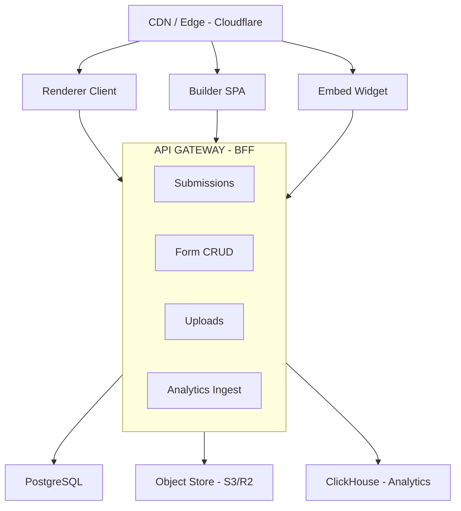

## Problem Statement

Design a form builder platform that enables non-technical users to create, publish, and analyze complex forms — covering everything from simple contact forms to multi-page surveys with conditional branching, file uploads, and computed fields. The system has two distinct surfaces: a **builder UI** (drag-and-drop construction with live preview) and a **respondent UI** (schema-driven renderer that executes the form definition client-side). This is architecturally interesting because the form schema acts as a DSL that drives rendering, validation, navigation, and analytics — making it a compiler/interpreter problem disguised as a CRUD app.

**Scope:** Builder canvas with drag-and-drop, schema-driven renderer, conditional logic engine, multi-step navigation, validation pipeline, response storage, and embed distribution. Out of scope: payment collection, e-signature legal compliance, backend workflow automation (Zapier-style integrations).

**Real-world examples:** Typeform (conversational one-question-at-a-time), Google Forms (traditional multi-question pages), Jotform (layout-heavy with columns/sections), Tally (Notion-like inline builder), SurveyMonkey (enterprise analytics and branching).

---

## Requirements Exploration

### Functional Requirements

1. **Builder UI:** Users drag fields from a palette onto a canvas, reorder via drag-and-drop, configure field properties (label, placeholder, validation rules, conditional visibility) through an inspector panel.
2. **Field types:** Text (short/long), email, phone, number, date/time, file upload, dropdown, multi-select, checkbox, radio, rating (stars/NPS), matrix/grid, signature pad, payment (stub), hidden fields.
3. **Conditional logic engine:** Show/hide fields based on previous answers, skip pages, compute values (e.g., total = quantity × price), and validate cross-field dependencies.
4. **Multi-step wizard:** Forms split into pages with progress indicators, "next/back" navigation, per-page validation gates, and configurable completion behaviour.
5. **Validation engine:** Synchronous rules (required, min/max length, regex), asynchronous rules (unique email check, address verification), custom validator functions, and cross-field validation.
6. **Theming:** Brand colors, font selection, border radius, layout variants (classic, conversational, card-per-question), custom CSS injection.
7. **Response collection:** Submissions stored with metadata (timestamp, duration, UTM params, device info), partial response tracking, file upload handling.
8. **Analytics:** Completion rate, average time per field, drop-off by page/field, response volume over time.
9. **Form versioning:** Draft/published states, revision history, rollback, ability to close submissions without deleting the form.
10. **Distribution:** Embed modes (iframe, popup modal, inline script, chatbot-style), shareable link, prefill via URL parameters, QR code generation.
11. **Anti-spam:** Honeypot fields, submission rate limiting per IP, optional CAPTCHA (reCAPTCHA/Turnstile), bot detection heuristics.

### Non-Functional Requirements

| Category      | Requirement                             | Target                              |
| ------------- | --------------------------------------- | ----------------------------------- |
| Performance   | Renderer TTI                            | &lt; 1.8s on 4G mid-range device    |
| Performance   | Builder interaction latency (drag/drop) | &lt; 50ms per frame (60fps)         |
| Bundle size   | Renderer initial JS                     | &lt; 80KB gzipped                   |
| Bundle size   | Builder initial JS                      | &lt; 200KB gzipped (heavy editor)   |
| Reliability   | Partial response persistence            | Auto-save every field change        |
| Availability  | Renderer uptime                         | 99.95% (forms are revenue-critical) |
| Scalability   | Concurrent form submissions             | 10K submissions/sec per form        |
| Accessibility | WCAG compliance                         | 2.1 AA for renderer, AA for builder |
| SEO           | Form landing pages                      | Crawlable, shareable OG tags        |
| Latency       | Schema fetch → first paint              | &lt; 500ms at CDN edge              |

---

## Capacity Estimation & Constraints

**Assumptions (mid-scale platform like Tally/Jotform):**

- 500K active forms, 50K DAU (builders), 2M respondents/day
- Average form: 12 fields, 3 pages, 2 conditional rules, ~8KB JSON schema
- Average submission: 2KB payload (excluding file uploads)
- File uploads: 10% of forms use them, average 2MB per file

**Traffic:**

- Form loads (renderer): 2M/day ÷ 86,400 = ~23 RPS average, 200 RPS peak
- Schema fetches: same as form loads, served from CDN (cache hit ~95%)
- Submissions: 2M/day × 0.6 completion rate = 1.2M submissions/day = ~14 RPS average
- Builder saves: 50K DAU × 20 saves/session = 1M saves/day = ~12 RPS

**Data:**

- Form schemas: 500K × 8KB = 4GB total (easily fits in CDN cache)
- Submissions: 1.2M/day × 2KB = 2.4GB/day raw responses
- File uploads: 200K/day × 2MB = 400GB/day (object storage)

**Client memory budget:**

- Renderer: &lt; 30MB heap (mobile-friendly)
- Builder: &lt; 100MB heap (desktop-only, heavy interactions)

**Key insight:** The renderer is the high-scale, latency-sensitive surface. The builder is low-scale but interaction-heavy. Architect them as separate bundles with independent performance budgets.

---

## Architecture / High-Level Design

### Rendering Strategy

**Renderer (respondent-facing):** SSR with hydration for the form shell + metadata (SEO, OG tags), then CSR for interactive form logic. The form schema is fetched at the edge and the renderer interprets it client-side. This ensures sub-second first paint while keeping conditional logic and validation entirely on the client.

**Builder (creator-facing):** Pure CSR (SPA). No SEO requirement, heavy interactivity (drag-and-drop, real-time preview), requires full browser API access. Lazy-load heavy dependencies (DnD library, code editor for custom validators).

**Justification:** SSR for renderer because form landing pages need OG meta tags and fast first paint. CSR for builder because it's an authenticated workspace tool where TTI is less critical than interaction fluency.

### Navigation Model

**Renderer:** SPA-like within a form session. URL encodes form slug + optional page index (`/f/contact-us?p=2`). Browser back button navigates between form pages. On submit, redirect to configurable thank-you URL.

**Builder:** SPA with hash routing within the editor (`/builder/abc123#fields`, `/builder/abc123#logic`, `/builder/abc123#theme`). No full page reloads during editing. Deep-linkable tabs for collaboration ("look at the logic tab").

### System Architecture Diagram



### Component Architecture

```
Builder App
├── BuilderShell (layout: palette | canvas | inspector)
│   ├── FieldPalette (draggable field type cards)
│   ├── FormCanvas (drop target, sortable field list)
│   │   ├── FieldBlock (wrapper: drag handle, delete, duplicate)
│   │   │   └── FieldPreview (mini-renderer for live preview)
│   │   └── PageDivider (page break indicators)
│   ├── InspectorPanel (context-sensitive field config)
│   │   ├── FieldSettings (label, placeholder, required)
│   │   ├── ValidationRules (add/remove rule editors)
│   │   ├── ConditionalLogic (if/then rule builder)
│   │   └── StyleOverrides (per-field styling)
│   └── BuilderToolbar (undo/redo, preview, publish, version)
│
Renderer App
├── FormRenderer (interprets schema, manages state)
│   ├── PageContainer (renders current page fields)
│   │   ├── FieldRenderer (switch on field.type → component)
│   │   │   ├── TextField / EmailField / PhoneField
│   │   │   ├── DropdownField / MultiSelectField
│   │   │   ├── DateField / FileUploadField
│   │   │   ├── RatingField / MatrixField / SignatureField
│   │   │   └── HiddenField (prefill, tracking)
│   │   └── FieldError (validation message display)
│   ├── ProgressBar (multi-step progress)
│   ├── NavigationControls (prev/next/submit)
│   └── SubmissionHandler (POST + redirect)
```

### State Management Strategy

**Builder state (Zustand):**

- `formSchema` — the source-of-truth JSON schema (synced to server on save)
- `selectedFieldId` — which field is selected for inspection
- `undoStack` / `redoStack` — command history for undo/redo
- `dragState` — current DnD operation in progress
- `publishState` — draft/published/publishing status

**Renderer state (React context + useReducer):**

- `responses` — Map&lt;fieldId, value&gt; (current answers)
- `errors` — Map&lt;fieldId, string[]&gt; (validation errors)
- `currentPage` — active page index
- `visitedPages` — Set&lt;number&gt; (for progress tracking)
- `conditionalVisibility` — Map&lt;fieldId, boolean&gt; (computed from logic engine)
- `submissionState` — idle | submitting | success | error

**Why not Zustand for renderer?** The renderer is embedded in third-party pages. Minimizing dependencies keeps the bundle small. React context + useReducer is sufficient for form-scoped state.

---

## Data Model / Entities

```typescript
// ─── Form Schema (stored as JSON, served via CDN) ───

interface FormSchema {
  id: string; // UUID
  version: number; // Increments on publish
  title: string;
  description: string;
  pages: FormPage[];
  settings: FormSettings;
  theme: FormTheme;
  logic: ConditionalRule[];
  metadata: FormMetadata;
}

interface FormPage {
  id: string;
  title?: string;
  description?: string;
  fields: FormField[];
}

interface FormField {
  id: string; // Stable across versions for analytics continuity
  type: FieldType;
  label: string;
  placeholder?: string;
  description?: string; // Helper text below field
  required: boolean;
  validation: ValidationRule[];
  properties: FieldProperties; // Type-specific config
  conditionalVisibility?: ConditionGroup;
  prefill?: PrefillConfig;
  style?: FieldStyleOverride;
}

type FieldType =
  | "short_text"
  | "long_text"
  | "email"
  | "phone"
  | "number"
  | "url"
  | "date"
  | "time"
  | "datetime"
  | "dropdown"
  | "multi_select"
  | "radio"
  | "checkbox"
  | "file_upload"
  | "rating"
  | "nps"
  | "matrix"
  | "signature"
  | "hidden"
  | "divider"
  | "heading";

// ─── Field Properties (discriminated union) ───

type FieldProperties =
  | TextFieldProperties
  | ChoiceFieldProperties
  | FileUploadProperties
  | RatingProperties
  | MatrixProperties
  | DateProperties;

interface TextFieldProperties {
  maxLength?: number;
  minLength?: number;
  inputMask?: string; // e.g., "(###) ###-####"
}

interface ChoiceFieldProperties {
  options: ChoiceOption[];
  allowOther: boolean;
  randomizeOrder: boolean;
  maxSelections?: number; // For multi_select
}

interface ChoiceOption {
  id: string;
  label: string;
  value: string;
  imageUrl?: string; // Visual choice cards
}

interface FileUploadProperties {
  maxFileSizeMB: number;
  allowedMimeTypes: string[]; // ["image/*", "application/pdf"]
  maxFiles: number;
}

interface RatingProperties {
  maxRating: number; // 5 or 10
  icon: "star" | "heart" | "thumb";
  showLabels: boolean;
  lowLabel?: string; // "Not likely"
  highLabel?: string; // "Very likely"
}

interface MatrixProperties {
  rows: { id: string; label: string }[];
  columns: { id: string; label: string }[];
  inputType: "radio" | "checkbox" | "dropdown";
}

interface DateProperties {
  minDate?: string; // ISO date
  maxDate?: string;
  disableWeekends: boolean;
  format: "MM/DD/YYYY" | "DD/MM/YYYY" | "YYYY-MM-DD";
}

// ─── Validation ───

interface ValidationRule {
  type: ValidationType;
  params: Record<string, unknown>; // Type-specific params
  message: string; // Custom error message
}

type ValidationType =
  | "required"
  | "min_length"
  | "max_length"
  | "pattern"
  | "email"
  | "url"
  | "phone"
  | "min_value"
  | "max_value"
  | "min_date"
  | "max_date"
  | "file_size"
  | "file_type"
  | "custom_async"; // Calls external endpoint

// ─── Conditional Logic ───

interface ConditionalRule {
  id: string;
  conditions: ConditionGroup;
  actions: ConditionalAction[];
}

interface ConditionGroup {
  operator: "AND" | "OR";
  conditions: (Condition | ConditionGroup)[];
}

interface Condition {
  fieldId: string;
  comparator: Comparator;
  value: unknown;
}

type Comparator =
  | "equals"
  | "not_equals"
  | "contains"
  | "not_contains"
  | "greater_than"
  | "less_than"
  | "is_empty"
  | "is_not_empty"
  | "starts_with"
  | "ends_with";

interface ConditionalAction {
  type:
    | "show_field"
    | "hide_field"
    | "skip_to_page"
    | "set_value"
    | "require_field"
    | "disable_field";
  targetId: string; // fieldId or pageId
  value?: unknown; // For set_value action
}

// ─── Settings & Theme ───

interface FormSettings {
  submitButtonText: string;
  showProgressBar: boolean;
  progressBarStyle: "percentage" | "steps" | "bar";
  redirectUrl?: string;
  closedMessage?: string;
  responseLimit?: number;
  closeAtDate?: string;
  notifyOnSubmission: string[]; // Email addresses
  captchaEnabled: boolean;
  captchaProvider: "recaptcha_v3" | "turnstile" | "none";
}

interface FormTheme {
  primaryColor: string; // Hex
  backgroundColor: string;
  fontFamily: string;
  borderRadius: "none" | "small" | "medium" | "large";
  layout: "classic" | "conversational" | "card";
  customCss?: string; // Injected in renderer
  logoUrl?: string;
  coverImageUrl?: string;
}

interface FormMetadata {
  createdAt: string;
  updatedAt: string;
  publishedAt?: string;
  ownerId: string;
  workspaceId: string;
  status: "draft" | "published" | "closed" | "archived";
  responseCount: number;
  embedDomains: string[]; // Allowed embed origins
}

// ─── Prefill ───

interface PrefillConfig {
  source: "url_param" | "hidden" | "computed";
  paramName?: string; // URL param key
  expression?: string; // Computed value expression
}

// ─── Submission ───

interface FormSubmission {
  id: string;
  formId: string;
  formVersion: number;
  responses: Record<string, FieldResponse>;
  metadata: SubmissionMetadata;
  completedAt: string;
  durationMs: number;
}

interface FieldResponse {
  fieldId: string;
  value: unknown; // Typed per field type
  answeredAt: string; // For time-per-field analytics
}

interface SubmissionMetadata {
  ip: string; // Hashed for privacy
  userAgent: string;
  referrer?: string;
  utmParams?: Record<string, string>;
  deviceType: "mobile" | "tablet" | "desktop";
  locale: string;
  submittedVia: "link" | "embed_iframe" | "embed_popup" | "embed_inline";
}
```

<Callout>
  The `FormSchema` acts as a DSL: the renderer is essentially an interpreter
  that walks the schema, evaluates conditional rules, and renders the
  appropriate components. This means the renderer has zero knowledge of specific
  forms — it's entirely schema-driven. Adding a new field type requires only
  registering a new renderer component, not changing the renderer core.
</Callout>

---

## Interface Definition (API)

### Form CRUD

```typescript
// GET /api/forms/:formId/schema
// Served via CDN with cache headers
// Response: FormSchema (full JSON, ~8KB)
// Cache-Control: public, s-maxage=300, stale-while-revalidate=600

// PUT /api/forms/:formId
// Autosave from builder — debounced, idempotent
interface UpdateFormRequest {
  schema: FormSchema;
  idempotencyKey: string; // Client-generated UUID per save
}
interface UpdateFormResponse {
  version: number;
  updatedAt: string;
}

// POST /api/forms/:formId/publish
interface PublishFormResponse {
  version: number;
  publishedAt: string;
  publicUrl: string;
  embedCode: string;
}
```

### Submissions

```typescript
// POST /api/forms/:formId/submissions
interface SubmitFormRequest {
  responses: Record<string, unknown>;
  metadata: {
    durationMs: number;
    pageTimings: Record<string, number>; // Page ID → time spent
    fieldTimings: Record<string, number>; // Field ID → time to answer
  };
  captchaToken?: string;
  honeypot?: string; // Must be empty
}

interface SubmitFormResponse {
  submissionId: string;
  redirectUrl?: string;
}

// Error shape
interface SubmissionError {
  code: "VALIDATION_FAILED" | "FORM_CLOSED" | "RATE_LIMITED" | "CAPTCHA_FAILED";
  fieldErrors?: Record<string, string[]>;
  message: string;
  retryAfter?: number; // Seconds, for rate limiting
}
```

### Partial Responses (Auto-save)

```typescript
// PUT /api/forms/:formId/partial
// Fires on every field blur — debounced 2s client-side
interface PartialResponseRequest {
  sessionId: string; // Anonymous session token
  responses: Record<string, unknown>;
  currentPage: number;
  lastFieldId: string;
}
// Response: 204 No Content
```

### File Uploads

```typescript
// POST /api/forms/:formId/uploads
// Returns pre-signed URL for direct-to-S3 upload
interface UploadInitRequest {
  fileName: string;
  mimeType: string;
  fileSizeBytes: number;
}

interface UploadInitResponse {
  uploadId: string;
  presignedUrl: string; // PUT directly to object storage
  expiresAt: string;
  maxSizeBytes: number;
}
```

### Analytics

```typescript
// GET /api/forms/:formId/analytics?range=7d
interface FormAnalytics {
  totalResponses: number;
  completionRate: number; // 0–1
  averageDurationMs: number;
  responsesByDay: { date: string; count: number }[];
  dropOffByField: { fieldId: string; label: string; dropRate: number }[];
  dropOffByPage: { pageIndex: number; dropRate: number }[];
  deviceBreakdown: Record<string, number>;
  topReferrers: { url: string; count: number }[];
}
```

### Async Validation

```typescript
// POST /api/forms/:formId/validate-field
interface AsyncValidationRequest {
  fieldId: string;
  value: unknown;
  ruleType: "custom_async";
  context: Record<string, unknown>; // Other field values for cross-field
}

interface AsyncValidationResponse {
  valid: boolean;
  message?: string;
}
```

---

## Caching Strategy

### Client-Side Caching

**Form schema (renderer):** Cache the schema in memory for the duration of the form session. On revisit within 5 minutes, use `stale-while-revalidate` — show cached schema immediately, refresh in background. Store in sessionStorage (max 50KB per form).

**Builder draft state:** Persist to localStorage every 5 seconds as crash recovery. Key: `form-draft-\{formId\}`. Max 500KB. Clear on successful server save confirmation.

**Partial responses:** Store in sessionStorage keyed by `partial-\{formId\}-\{sessionId\}`. Enables resume after accidental tab close. TTL: 24 hours. Max 100KB.

**Field validation results:** Cache async validation results in a Map keyed by `fieldId:value`. Max 200 entries with LRU eviction. Prevents re-validation when user navigates back.

### CDN & Edge Caching

| Resource               | Cache-Control                                        | Invalidation                      |
| ---------------------- | ---------------------------------------------------- | --------------------------------- |
| Form schema JSON       | `public, s-maxage=300, stale-while-revalidate=600`   | Purge on publish                  |
| Renderer HTML shell    | `public, s-maxage=3600, stale-while-revalidate=7200` | Purge on deploy                   |
| Theme CSS              | `public, s-maxage=86400, immutable`                  | Filename hash (content-addressed) |
| Static assets (JS/CSS) | `public, max-age=31536000, immutable`                | Content-hashed filenames          |
| Uploaded files         | `private, max-age=3600`                              | Pre-signed URLs with 1h expiry    |

**Schema invalidation:** On form publish, issue a CDN purge for `/api/forms/\{formId\}/schema`. The 5-minute `stale-while-revalidate` window means at most 5 minutes of stale schema served to new respondents after an update.

### Cache Coherence

**Cross-tab consistency (builder):** Use `BroadcastChannel('form-builder')` to sync saves across tabs. If the user has the same form open in two tabs, the newer save wins and the stale tab shows a "Form updated in another tab — reload?" banner.

**Optimistic update reconciliation:** The builder applies edits optimistically to local state. If the server rejects (version conflict), show a conflict resolution UI: "Someone else edited this form. Merge or overwrite?"

**Cache versioning:** The form schema includes a `version` field. The renderer checks `version` on hydration — if the cached schema version is stale (compared to a lightweight version-check endpoint), refetch the full schema.

---

## Rendering & Performance Deep Dive

### Critical Rendering Path

**Renderer loading tiers:**

| Tier   | What loads                                                   | Trigger          | Budget                   |
| ------ | ------------------------------------------------------------ | ---------------- | ------------------------ |
| Tier 1 | HTML shell + critical CSS + form title + first page skeleton | SSR              | &lt; 200ms server render |
| Tier 2 | Form schema fetch + first page fields render + theme CSS     | Hydration        | &lt; 800ms               |
| Tier 3 | Validation engine + conditional logic engine + analytics SDK | Idle callback    | &lt; 1.5s                |
| Tier 4 | File upload, signature pad, rich field types                 | User interaction | On demand                |

**Builder loading tiers:**

| Tier   | What loads                                           | Budget       |
| ------ | ---------------------------------------------------- | ------------ |
| Tier 1 | Shell + field palette + empty canvas                 | &lt; 1.5s    |
| Tier 2 | DnD engine (dnd-kit) + schema hydration              | &lt; 2.5s    |
| Tier 3 | Inspector panel + logic editor + theme editor        | On tab focus |
| Tier 4 | Preview renderer + code editor for custom validators | On demand    |

### Core Web Vitals Targets

| Metric | Renderer Target | Builder Target | Strategy                                             |
| ------ | --------------- | -------------- | ---------------------------------------------------- |
| LCP    | &lt; 1.5s       | &lt; 2.5s      | SSR shell + inlined critical CSS                     |
| INP    | &lt; 100ms      | &lt; 150ms     | Debounced validation, requestIdleCallback for logic  |
| CLS    | &lt; 0.05       | &lt; 0.1       | Fixed-height field skeletons, preloaded fonts        |
| FCP    | &lt; 0.8s       | &lt; 1.5s      | Edge-cached HTML, minimal blocking resources         |
| TTFB   | &lt; 200ms      | &lt; 400ms     | CDN for renderer, origin for builder (authenticated) |

### Schema Interpretation Performance

The conditional logic engine evaluates on every field change. For forms with 50+ fields and 20+ rules:

```typescript
// Memoize condition evaluation results
const evaluateVisibility = useMemo(() => {
  const engine = new ConditionEngine(schema.logic);
  return engine.computeVisibility(responses);
}, [responses, schema.logic]);

// Only re-render fields whose visibility changed
const FieldRenderer = memo(({ field, visible }: Props) => {
  if (!visible) return null;
  return <FieldComponent field={field} />;
}, (prev, next) => prev.visible === next.visible && prev.field === next.field);
```

**Performance budget for logic evaluation:** &lt; 5ms for 100 rules on a mid-range mobile device. Achieve this by pre-compiling conditions into a dependency graph at schema load time, then only re-evaluating rules whose input fields changed.

<Callout>
  Build a dependency graph from the conditional rules at schema parse time. When
  field X changes, only re-evaluate rules that depend on X — not all rules. This
  reduces evaluation from O(rules × fields) to O(affected_rules) per keystroke.
</Callout>

### Bundle Optimization

| Chunk                 | Contents                                            | Size budget    |
| --------------------- | --------------------------------------------------- | -------------- |
| `renderer-core`       | Schema engine + basic fields (text, choice, number) | 45KB gz        |
| `renderer-complex`    | File upload, signature, matrix, date picker         | 35KB gz (lazy) |
| `renderer-validation` | Validation engine + error display                   | 12KB gz        |
| `builder-core`        | Canvas + palette + DnD                              | 120KB gz       |
| `builder-inspector`   | Field config panels                                 | 60KB gz (lazy) |
| `builder-logic`       | Condition builder UI                                | 40KB gz (lazy) |

**Heavy dependency management:**

- `dnd-kit`: Builder-only, never shipped to renderer
- `date-fns`: Tree-shake to only imported functions, or use Temporal API where available
- Signature pad: Canvas-based, lazy-loaded only when signature field exists in form
- File upload: Lazy-loaded, includes chunked upload + progress UI

---

## Security Deep Dive

### Threat Model

| Threat                     | Attack Vector                                                        | Impact                                    | Mitigation                                                                                                |
| -------------------------- | -------------------------------------------------------------------- | ----------------------------------------- | --------------------------------------------------------------------------------------------------------- |
| Schema injection           | Malicious form creator injects script via custom CSS or label fields | XSS on respondent page                    | Sanitize `customCss` (allowlist properties), escape all user text with DOMPurify                          |
| File upload abuse          | Upload malicious files (polyglots, web shells)                       | Server compromise, malware distribution   | Validate MIME type server-side (magic bytes, not extension), scan with ClamAV, serve from isolated domain |
| Response data exfiltration | Builder account takeover → export all PII                            | Data breach                               | Encrypt sensitive fields at rest, audit log all exports, require 2FA for bulk export                      |
| Form schema manipulation   | MITM or CDN poisoning serves altered schema                          | Phishing, data harvesting via fake fields | Subresource Integrity (SRI) for schema fetch, schema signature verification                               |
| Submission flooding        | Bot submits millions of responses to exhaust storage                 | DoS, cost amplification                   | Rate limit per IP (100/hour), CAPTCHA after 5 submissions from same fingerprint, honeypot                 |

### XSS & Injection Prevention

**Form labels and descriptions:** All user-authored text rendered via `textContent` (not `innerHTML`). For rich text descriptions, use a strict allowlist: `&lt;b&gt;`, `&lt;i&gt;`, `<a>` (with `rel="noopener"` and `target="_blank"`), `<br>`. Strip everything else server-side before schema storage.

**Custom CSS injection:** Parse with a CSS tokenizer. Allowlist: color properties, font properties, sizing, borders, backgrounds (no `url()` except data URIs &lt; 1KB). Block: `position: fixed/absolute`, `z-index > 1000`, any `@import`, any `expression()`, any `javascript:` URLs.

```typescript
const sanitizeCss = (css: string): string => {
  const parsed = postcss.parse(css);
  parsed.walkDecls((decl) => {
    if (BLOCKED_PROPERTIES.has(decl.prop)) decl.remove();
    if (decl.value.includes("url(") && !isAllowedUrl(decl.value)) decl.remove();
    if (decl.value.includes("expression")) decl.remove();
  });
  return parsed.toString();
};
```

**Embed isolation:** Renderer embedded via iframe uses `sandbox="allow-forms allow-scripts allow-same-origin"`. The `allow-same-origin` is needed for localStorage (partial saves) but combined with CSP `frame-ancestors` to restrict embedding domains.

### CSRF Protection

- All mutation endpoints require `X-CSRF-Token` header (double-submit cookie pattern)
- Form submissions from embeds use a per-form, time-limited nonce embedded in the schema response
- The nonce is validated server-side and expires after 2 hours (prevents replay attacks on submission endpoint)
- File upload pre-signed URLs are single-use and expire in 15 minutes

### Data Privacy

- PII fields (email, phone, name) are encrypted at rest with per-workspace keys (AES-256-GCM)
- IP addresses are hashed with a daily-rotating salt before storage
- Respondent data is isolated per form — no cross-form correlation possible without workspace admin access
- GDPR deletion: cascade delete submissions + partial responses on form deletion
- Data residency: schema served from nearest edge, but submission storage region is configurable (EU, US, APAC)

<Callout>
  The `customCss` injection surface is unique to form builders and frequently
  overlooked. A seemingly innocent CSS feature like `background-image: url()`
  can exfiltrate data via request timing or load external resources. Always
  parse and allowlist — never regex-filter CSS.
</Callout>

---

## Scalability & Reliability

### Scalability Patterns

**Schema serving at scale:** Form schemas are static JSON blobs (immutable once published). Serve from CDN edge with 5-minute cache. Even a viral form (millions of loads) costs near-zero origin load. On publish, purge the specific cache key — 95%+ cache hit rate.

**Submission ingestion:** Use a write-ahead buffer. Client submits to an edge function that validates + writes to a durable queue (Cloudflare Queues / SQS), returns 202 Accepted immediately. Background worker drains queue to PostgreSQL. This decouples user-facing latency from database write throughput.

**Analytics aggregation:** Raw submission events flow into an OLAP store (ClickHouse). Pre-aggregate hourly/daily rollups. The analytics API reads from materialized views, never scans raw data. Supports 10K QPS on analytics dashboards without impacting submission path.

**Builder collaboration:** For future multi-user editing, use CRDT-based operational transforms on the schema JSON. For now, last-write-wins with version conflict detection is sufficient.

### Failure Handling

| Failure Mode             | Detection                             | User Experience                                               | Recovery                                                           |
| ------------------------ | ------------------------------------- | ------------------------------------------------------------- | ------------------------------------------------------------------ |
| Schema fetch fails (CDN) | Fetch error / timeout (5s)            | Show cached version (if available) or "Form unavailable" page | Retry 3× with exponential backoff (1s, 3s, 9s), fallback to origin |
| Submission fails         | 4xx/5xx or network error              | Keep form filled, show error banner with retry button         | Store in localStorage, retry on reconnect (max 3 attempts)         |
| File upload fails        | Pre-signed URL expired / upload error | Show "Upload failed" per file with retry icon                 | Re-request pre-signed URL, resume upload                           |
| Partial save fails       | Network error on auto-save            | Silent (non-blocking), retry on next field change             | Queue in localStorage, flush on reconnect                          |
| Builder save conflict    | 409 Conflict response                 | "Updated by another user" modal with merge option             | Fetch latest version, three-way merge or manual resolution         |
| Validation endpoint down | Timeout (3s) on async validation      | Skip async rule, accept submission, validate post-hoc         | Queue for background re-validation, flag submission                |

### Resilience Patterns

**Offline submission queue:** If the device goes offline during form fill, persist the complete submission to IndexedDB. On reconnect, replay submissions in order. Use idempotency keys (UUID generated at form start) to prevent duplicates.

**Circuit breaker for analytics:** If the analytics ingest endpoint is unhealthy (>5% error rate over 30s), stop sending timing events client-side. Buffer locally, resume when healthy. Analytics loss is acceptable; submission loss is not.

**Graceful degradation tiers:**

| Condition                      | Degraded feature                        | Fallback                                          |
| ------------------------------ | --------------------------------------- | ------------------------------------------------- |
| No JavaScript                  | Full form unusable                      | SSR a `&lt;noscript&gt;` message with mailto link |
| Slow connection (&lt; 200Kbps) | Complex fields (signature, file upload) | Replace with text description fallback            |
| WebSocket unavailable          | Real-time collaboration in builder      | Poll every 5s for version changes                 |
| localStorage unavailable       | Partial save, crash recovery            | Warn user, disable auto-save indicator            |

---

## Accessibility Deep Dive

### Semantic Structure

```html
<form role="form" aria-label="Contact Form" aria-describedby="form-description">
  <div role="group" aria-labelledby="page-title-1">
    <!-- Progress -->
    <div
      role="progressbar"
      aria-valuenow="33"
      aria-valuemin="0"
      aria-valuemax="100"
      aria-label="Form progress: page 1 of 3"
    ></div>

    <!-- Field -->
    <div role="group" aria-labelledby="field-label-email">
      <label id="field-label-email" for="field-email">Email address</label>
      <span id="field-desc-email" class="sr-only"
        >We'll never share your email</span
      >
      <input
        id="field-email"
        type="email"
        aria-describedby="field-desc-email field-error-email"
        aria-required="true"
        aria-invalid="false"
      />
      <div id="field-error-email" role="alert" aria-live="polite"></div>
    </div>
  </div>
</form>
```

### Keyboard Navigation

| Context         | Key              | Action                                 |
| --------------- | ---------------- | -------------------------------------- |
| Form fields     | Tab / Shift+Tab  | Move between fields                    |
| Rating field    | Arrow Left/Right | Adjust rating value                    |
| Multi-select    | Space            | Toggle option selection                |
| Matrix field    | Arrow keys       | Navigate grid cells                    |
| Multi-step      | Enter            | Advance to next page (if valid)        |
| File upload     | Space/Enter      | Open file picker                       |
| Signature pad   | (none)           | Provide "Type signature" text fallback |
| Builder palette | Enter            | Add field to canvas at cursor position |
| Builder canvas  | Arrow Up/Down    | Reorder selected field                 |
| Builder canvas  | Delete/Backspace | Remove selected field                  |

### Dynamic Content Announcements

- **Validation errors:** `aria-live="polite"` on error containers. Announce on blur, not on every keystroke.
- **Page transitions:** Focus moves to page title on next/prev. `aria-live="assertive"` announces "Page 2 of 3: Personal Details".
- **Conditional field appearance:** When a field becomes visible, append to live region: "Additional field appeared: \{label\}". Focus does NOT auto-move (would be disorienting).
- **Submission success:** Focus moves to success message container with `role="alert"`.

### Builder Accessibility

**Drag-and-drop alternative:** Every drag operation has a keyboard equivalent:

- Select field with Space/Enter
- Use Arrow Up/Down to reorder
- Use keyboard shortcut (Ctrl+Shift+Arrow) to move between pages
- "Move to..." context menu accessible via Shift+F10

**Inspector panel:** Announced as a complementary landmark (`role="complementary"`). When field selection changes, focus moves to the inspector only if user explicitly invoked it (not on every click in canvas).

<Callout>
  Signature pad fields are inherently inaccessible for screen reader users.
  Always provide a text-input alternative ("Type your full name as signature")
  alongside the canvas. This isn't optional — it's a WCAG 2.1 AA requirement for
  equivalent functionality.
</Callout>

---

## Monitoring & Observability

### Client-Side Metrics

**Renderer metrics:**

- `form.load.time` — Time from navigation start to all first-page fields interactive
- `form.schema.fetch.duration` — CDN schema fetch latency (p50, p95, p99)
- `form.field.interaction.latency` — Time from user input to visual response (target: &lt; 50ms)
- `form.submission.duration` — Time from submit click to success confirmation
- `form.completion.rate` — Sessions that reach submission / total sessions started
- `form.dropoff.field` — Last interacted field before abandonment

**Builder metrics:**

- `builder.dnd.frame.time` — Frame duration during drag operations (target: &lt; 16ms)
- `builder.save.latency` — Time from change to server confirmation
- `builder.schema.size` — JSON byte size of form schema (track growth over time)

### Error Tracking

- Unhandled exceptions: Sentry with source maps, grouped by form ID
- Validation engine errors: Log when rule evaluation throws (indicates malformed schema)
- File upload failures: Track per-provider (S3 pre-sign failures vs upload failures)
- Schema parse errors: Alert immediately — indicates data corruption

### Logging & Tracing

- Correlation ID: Generated on form load, attached to all API calls for that session
- Trace submission lifecycle: `form_loaded → field_1_answered → ... → page_2_entered → submitted`
- Builder action log: Every edit operation (add field, reorder, delete) logged with timestamp for undo debugging

### Alerting & Dashboards

**Day-1 launch dashboard (8 panels):**

1. Form load success rate (target: > 99.5%)
2. Submission success rate (target: > 99%)
3. Schema fetch p95 latency (target: &lt; 300ms)
4. Submission p95 latency (target: &lt; 1s)
5. File upload success rate (target: > 95%)
6. Error rate by type (validation, network, server)
7. Active form sessions (real-time gauge)
8. CDN cache hit ratio (target: > 95%)

**Alert thresholds:**

| Metric                    | Warning        | Critical       | Action                     |
| ------------------------- | -------------- | -------------- | -------------------------- |
| Submission error rate     | > 1% for 5 min | > 5% for 2 min | Page on-call               |
| Schema fetch latency p95  | > 500ms        | > 2s           | CDN health check           |
| File upload failure rate  | > 10%          | > 25%          | Check object storage       |
| Builder save failure rate | > 2%           | > 10%          | Database health check      |
| Form load errors          | > 0.5%         | > 2%           | CDN + origin investigation |

### Real User Monitoring

- Sample 100% of submission events (low volume, high value)
- Sample 10% of field interaction timings (high volume)
- Segment by: device type, connection speed, embed mode, form complexity (field count)
- Rage-click detection: 3+ clicks on same element within 2s → flag field as potentially confusing
- Dead-click detection on form pages → indicates non-obvious UI (user clicking non-interactive elements)

---

## Trade-offs

| Decision                          | Chose                  | Over                                       | Pro                                                                     | Con                                                                      |
| --------------------------------- | ---------------------- | ------------------------------------------ | ----------------------------------------------------------------------- | ------------------------------------------------------------------------ |
| Schema as JSON (DSL)              | JSON schema            | Code-based form definitions                | No-code builder friendly, CDN-cacheable, version-diffable               | Limited expressiveness for edge cases, requires custom interpreter       |
| CSR for renderer logic            | Client-side evaluation | Server-side rendering of conditional forms | Instant feedback, no server round-trips per field change, works offline | Larger bundle, logic visible to users (can reverse-engineer skip logic)  |
| Separate builder/renderer bundles | Independent apps       | Monolithic SPA                             | Independent scaling, renderer stays tiny, builder can be heavy          | Code duplication for shared types, deploy coordination needed            |
| Last-write-wins (builder)         | Simple conflict model  | CRDT/OT real-time collab                   | Fast to implement, no collaboration complexity                          | Data loss risk with simultaneous editors, requires explicit conflict UI  |
| CDN-first schema delivery         | Edge caching           | Direct API calls                           | Sub-200ms schema load globally, massive scale for free                  | 5-minute staleness window after publish, purge latency                   |
| localStorage for partial saves    | Client persistence     | Server-side session state                  | Works offline, no auth required for respondents, zero server cost       | Lost on device switch, storage limits (5MB), private browsing clears it  |
| Pre-signed URLs for uploads       | Direct-to-storage      | Server proxy upload                        | No server bandwidth cost, handles large files, resumable                | Complexity: pre-sign → upload → confirm flow, CORS configuration         |
| Dependency graph for logic        | Pre-compiled graph     | Evaluate all rules on every change         | O(affected) vs O(all) per field change, critical for complex forms      | Higher schema parse cost upfront, graph must be rebuilt on schema change |
| Debounced async validation        | 300ms debounce         | Validate on every keystroke                | Reduces server load 10×, prevents UI jank                               | 300ms delay before error/success feedback appears                        |
| Honeypot over CAPTCHA by default  | Invisible to users     | CAPTCHA always on                          | Zero friction for legitimate users, catches naive bots                  | Sophisticated bots bypass, need CAPTCHA escalation for targeted attacks  |

---

## What Great Looks Like

A **senior** answer covers:

- Schema-driven renderer architecture with field type registry
- Multi-step navigation with per-page validation
- Basic conditional logic (show/hide based on field values)
- File upload with pre-signed URLs
- Responsive rendering across device types

A **staff** answer additionally:

- Dependency graph for conditional logic evaluation with memoization
- Builder undo/redo via command pattern with full state reconstruction
- Embed security model (iframe sandboxing, CSP, origin validation)
- Performance budgets for renderer vs builder with different optimization strategies
- Partial response persistence and session recovery across page refreshes
- Analytics pipeline design with drop-off tracking per field
- Cache invalidation strategy for schema updates (CDN purge + SWR)

A **principal** answer additionally:

- Form schema as a compiler target: parsing, validation, optimization passes before execution
- Schema versioning with backward-compatible migrations (responses reference schema version)
- Multi-tenant isolation model for custom CSS injection (parsing + allowlisting approach)
- Failure mode analysis with specific recovery strategies per layer
- Accessibility architecture for complex field types (matrix keyboard nav, signature pad alternatives)

---

## Key Takeaways

- **The form schema is a DSL** — design it as a language with a parser, validator, and interpreter. The renderer's quality is determined by the schema's expressiveness.
- **Separate builder and renderer concerns entirely.** Different performance budgets (200KB vs 80KB), different rendering strategies (CSR vs SSR+hydration), different scaling characteristics.
- **Pre-compile conditional logic into a dependency graph** at schema load time. Evaluating all rules on every keystroke is O(n²) and will cause jank on complex forms.
- **Partial response persistence is a competitive feature.** Users abandon forms to answer phones, switch devices, or lose connectivity. localStorage + sessionStorage + server sync makes completion rates measurably higher.
- **Custom CSS is an XSS vector.** Parse it with a tokenizer and allowlist — never regex. Block `url()`, `expression()`, `@import`, and positioning properties that could overlay phishing content.
- **CDN-first architecture for the renderer** makes form load time independent of user geography. Schemas are tiny JSON blobs; cache them aggressively with publish-triggered invalidation.
- **Accessibility for form builders requires creative alternatives** — signature pads need text fallbacks, drag-and-drop needs keyboard equivalents, dynamic field visibility needs live region announcements.
- **Analytics must track the funnel at field granularity**, not just page level. Knowing which specific field causes 40% drop-off is the insight that drives form optimization.
