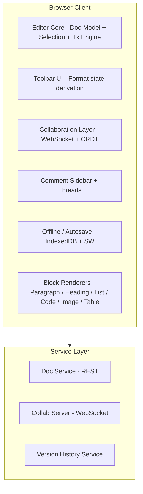

## Problem Statement

A collaborative document editor is the backbone of modern knowledge work. Products like Google Docs, Notion, Coda, Dropbox Paper, and Quip have replaced static file-based workflows with real-time, multiplayer document platforms. This is not a basic rich text editor — it is a full document authoring system with structured content, collaboration primitives, and a sophisticated editing experience.

This design covers the **complete product surface**: the document model (blocks, inline formatting, nesting), the editor UI and toolbar, comments and suggestions mode, version history with visual diffs, sharing and permission controls, and the integration of real-time collaboration into the editing experience. The underlying CRDT/OT synchronization engine is treated as an infrastructure layer — this entry focuses on what sits above it.

**What makes this hard:**

- The document model must support arbitrary nesting (lists inside tables inside toggles) while remaining serializable and diffable
- contentEditable is the only browser API that handles IME, selection, and cursor behavior — but it fights you at every turn
- Toolbar state must reflect the current selection's formatting without re-rendering the document
- Comments and suggestions overlay non-document UI onto document positions that shift as text is edited
- Version history requires efficient structural diffs between document snapshots
- A 100-page document must feel as responsive as a 1-page document

**Scope:**

- Block-based document model and rendering
- Formatting toolbar with selection-aware state
- Comments, suggestions, and resolve workflows
- Version history with diff visualization
- Sharing UI and permission enforcement
- Large-document performance (virtualization)
- Slash commands and block insertion
- Offline editing and autosave

**Out of scope:**

- The CRDT/OT algorithm implementation (covered in "realtime-collaboration-editor")
- Backend infrastructure and database design
- Authentication/SSO flows
- Mobile native editors

---

## Requirements Exploration

### Functional Requirements

| #    | Requirement              | Description                                                                                                                                    |
| ---- | ------------------------ | ---------------------------------------------------------------------------------------------------------------------------------------------- |
| FR1  | Block-based editing      | Users create and manipulate blocks: paragraphs, headings (H1–H3), bullet/numbered lists, toggle lists, code blocks, quotes, callouts, dividers |
| FR2  | Inline formatting        | Bold, italic, underline, strikethrough, code, links, highlight colors within any text block                                                    |
| FR3  | Images and embeds        | Upload/paste images, embed videos, embed third-party content (Figma, Loom, etc.) with responsive sizing                                        |
| FR4  | Tables                   | Insert tables with row/column add/delete, cell merging, per-cell block content                                                                 |
| FR5  | Comments and suggestions | Comment on any text range, reply threads, resolve comments. Suggestions mode: proposed edits shown as tracked changes                          |
| FR6  | Version history          | Browse named versions and auto-snapshots, visual diff (additions in green, deletions in red), restore any version                              |
| FR7  | Sharing and permissions  | Share via link or email, permission levels (viewer/commenter/editor), workspace-level inheritance                                              |
| FR8  | Slash commands           | "/" trigger shows searchable menu of block types and actions, keyboard navigable                                                               |
| FR9  | Drag-and-drop reordering | Move blocks via drag handle, nest/unnest via indentation                                                                                       |
| FR10 | Find and replace         | Full-text search within document, regex support, replace all                                                                                   |
| FR11 | Export                   | PDF, Markdown, HTML export with formatting preserved                                                                                           |
| FR12 | Real-time collaboration  | See other users' cursors and selections, presence indicators                                                                                   |

### Non-Functional Requirements

| NFR                 | Target                                                     | Rationale                                            |
| ------------------- | ---------------------------------------------------------- | ---------------------------------------------------- |
| Keystroke latency   | &lt;50ms from keydown to rendered character                   | Below human perception threshold; >100ms feels laggy |
| Autosave            | Every 5s or on pause                                       | Prevents data loss without constant network chatter  |
| Document size       | 100+ pages (50,000+ words) without degradation             | Enterprise documents regularly hit this size         |
| Offline editing     | Full editing capability for 24h+ offline                   | Commuters, flights, unreliable networks              |
| Time to interactive | &lt;2s for a 10-page document                                 | Users expect instant access to their work            |
| Collaboration sync  | &lt;200ms operation propagation to other clients              | Feels "live" without being wasteful                  |
| Version history     | Retain 30 days of auto-snapshots, unlimited named versions | Compliance and peace of mind                         |

---

## Capacity Estimation & Constraints

### Document Size Model

| Metric                                     | Value                                               | Notes                               |
| ------------------------------------------ | --------------------------------------------------- | ----------------------------------- |
| Average block                              | 80 characters / 160 bytes text + 200 bytes metadata | Block type, formatting marks, IDs   |
| 1 page                                     | ~25 blocks                                          | ~9KB per page                       |
| 100-page document                          | 2,500 blocks                                        | ~900KB serialized                   |
| Operations per minute (single user typing) | 200–400                                             | Each keystroke = 1 insert operation |
| Concurrent editors per doc (P95)           | 5–10                                                | Most collaboration is 2–3 people    |
| Concurrent editors per doc (P99)           | 25–50                                               | All-hands notes, lecture notes      |

### Storage and Bandwidth

| Metric                                     | Value                                                                     |
| ------------------------------------------ | ------------------------------------------------------------------------- |
| Document snapshot (100 pages)              | ~900KB JSON                                                               |
| Operation (single character insert)        | ~100 bytes                                                                |
| Operations per second (10 active editors)  | ~50 ops/s                                                                 |
| WebSocket bandwidth per client             | ~5KB/s inbound during active collaboration                                |
| Autosave payload (delta since last save)   | 1–10KB typical                                                            |
| Version history (30 days, 1 snapshot/hour) | 720 snapshots × 900KB = ~650MB uncompressed; ~65MB with delta compression |
| Image storage per document (median)        | 5–20MB                                                                    |

### Client Memory Budget

| Resource                         | Budget                                    |
| -------------------------------- | ----------------------------------------- |
| Document model in memory         | 5–15MB for a 100-page doc                 |
| Undo/redo history                | Last 100 operations, ~50KB                |
| Rendered DOM nodes (virtualized) | 200–500 blocks visible at once            |
| IndexedDB offline storage        | 50MB per document                         |
| Web Worker for diff computation  | Dedicated thread, no main-thread blocking |

---

## Architecture / High-Level Design

### Rendering Strategy

The document editor uses a **controlled rendering model** built on ProseMirror/Tiptap architecture:

1. **Document State** is the single source of truth — an immutable tree of blocks and marks
2. **Transactions** describe mutations (insert text, apply mark, delete block)
3. **View Layer** derives DOM from state via a reconciliation step — not raw contentEditable
4. **contentEditable** is used only as an input mechanism — the browser handles IME, spell-check, and cursor positioning, but the editor intercepts all mutations and replays them through the transaction pipeline

This gives us the predictability of a virtual DOM approach while leveraging the browser's native text editing capabilities.

### Navigation Model

The application is a **document-centric SPA**:

```
/docs                    → Document list
/docs/:id                → Document editor (main experience)
/docs/:id/history        → Version history view
/docs/:id/history/:vId   → Specific version with diff
```

All navigation within the editor (scrolling to comments, jumping to headings) is in-page. The URL updates for deep-linking but the editor never unmounts during a session.

### System Architecture Diagram



### Component Architecture

```
┌─────────────────────────────────────────────────────────┐
│ DocumentEditor (root)                                    │
├─────────────────────────────────────────────────────────┤
│                                                         │
│  ┌─────────────────────────────────────────────────┐   │
│  │ EditorChrome (toolbar + sidebar frame)           │   │
│  │  ┌───────────────────────────────────────────┐  │   │
│  │  │ FormattingToolbar                         │  │   │
│  │  │  [B] [I] [U] [S] [Code] [Link] [Color]  │  │   │
│  │  │  [H1] [H2] [H3] [•] [1.] [☐] [<>]      │  │   │
│  │  └───────────────────────────────────────────┘  │   │
│  └─────────────────────────────────────────────────┘   │
│                                                         │
│  ┌──────────────────────────┐ ┌──────────────────────┐ │
│  │ EditorCanvas              │ │ CommentSidebar       │ │
│  │  ┌────────────────────┐  │ │  ┌────────────────┐ │ │
│  │  │ BlockRenderer[]    │  │ │  │ CommentThread  │ │ │
│  │  │  - ParagraphBlock │  │ │  │ CommentThread  │ │ │
│  │  │  - HeadingBlock    │  │ │  │ CommentThread  │ │ │
│  │  │  - ListBlock       │  │ │  └────────────────┘ │ │
│  │  │  - CodeBlock       │  │ └──────────────────────┘ │
│  │  │  - ImageBlock      │  │                          │
│  │  │  - TableBlock      │  │ ┌──────────────────────┐ │
│  │  │  - EmbedBlock      │  │ │ VersionHistoryPanel  │ │
│  │  └────────────────────┘  │ │  ┌────────────────┐ │ │
│  │  ┌────────────────────┐  │ │  │ VersionList    │ │ │
│  │  │ SlashCommandMenu   │  │ │  │ DiffViewer     │ │ │
│  │  └────────────────────┘  │ │  └────────────────┘ │ │
│  │  ┌────────────────────┐  │ └──────────────────────┘ │
│  │  │ SelectionToolbar   │  │                          │
│  │  └────────────────────┘  │                          │
│  └──────────────────────────┘                          │
│                                                         │
│  ┌─────────────────────────────────────────────────┐   │
│  │ StatusBar                                        │   │
│  │  [Saving...] [3 collaborators] [Word count]     │   │
│  └─────────────────────────────────────────────────┘   │
└─────────────────────────────────────────────────────────┘
```

### State Management

The editor uses a **layered state model**:

```
┌────────────────────────────────────────────┐
│ Layer 1: Document Model (EditorState)       │
│ - Block tree with content and marks         │
│ - Selection state                           │
│ - Immutable — changes via transactions      │
├────────────────────────────────────────────┤
│ Layer 2: Collaboration State                │
│ - Remote cursors and selections             │
│ - Pending/unconfirmed local operations      │
│ - Awareness (who is viewing what)           │
├────────────────────────────────────────────┤
│ Layer 3: UI State (Zustand)                 │
│ - Sidebar open/closed                       │
│ - Active comment thread                     │
│ - Version history panel state               │
│ - Slash command menu position               │
├────────────────────────────────────────────┤
│ Layer 4: Derived/Computed State             │
│ - Toolbar formatting indicators             │
│ - Table of contents                         │
│ - Word/character count                      │
│ - Comment position anchors                  │
└────────────────────────────────────────────┘
```

The document model is the **single source of truth**. UI state never mutates the document directly — all changes flow through the transaction pipeline, which ensures collaboration, undo/redo, and persistence all see the same mutations.

---

## Data Model / Entities

### Block Types

```typescript
/** Union of all block types in the document */
type BlockType =
  | "paragraph"
  | "heading"
  | "bulletList"
  | "numberedList"
  | "todoList"
  | "toggleList"
  | "codeBlock"
  | "blockquote"
  | "callout"
  | "image"
  | "video"
  | "embed"
  | "table"
  | "divider"
  | "mathBlock";

/** Inline formatting marks */
type MarkType =
  | "bold"
  | "italic"
  | "underline"
  | "strikethrough"
  | "code"
  | "link"
  | "highlight"
  | "textColor"
  | "comment" // marks text that has an associated comment
  | "suggestion"; // marks text involved in a suggestion

/** A single mark instance with optional attributes */
interface Mark {
  type: MarkType;
  attrs?: Record<string, unknown>;
  // link: { href: string; title?: string }
  // highlight: { color: string }
  // comment: { commentId: string }
  // suggestion: { suggestionId: string; type: 'insert' | 'delete' }
}

/** Inline content — a run of text with formatting */
interface TextNode {
  type: "text";
  text: string;
  marks: Mark[];
}

/** An inline image or mention within text */
interface InlineNode {
  type: "mention" | "emoji" | "inlineImage";
  attrs: Record<string, unknown>;
}

type InlineContent = TextNode | InlineNode;
```

### Document Tree Structure

```typescript
/** A block in the document tree */
interface Block {
  id: string; // stable unique ID (nanoid)
  type: BlockType;
  attrs: BlockAttrs; // type-specific attributes
  content: InlineContent[]; // inline text content (for text blocks)
  children: Block[]; // nested blocks (lists, toggles, table cells)
  meta: {
    createdAt: number;
    createdBy: string;
    updatedAt: number;
  };
}

/** Type-specific block attributes */
interface HeadingAttrs {
  level: 1 | 2 | 3;
}

interface CodeBlockAttrs {
  language: string;
  lineNumbers: boolean;
}

interface ImageAttrs {
  src: string;
  alt: string;
  width: number;
  height: number;
  caption?: string;
}

interface TableAttrs {
  columnWidths: number[]; // percentage widths
}

interface EmbedAttrs {
  url: string;
  provider: string; // 'figma' | 'loom' | 'youtube' | ...
  width: number;
  height: number;
}

interface CalloutAttrs {
  emoji: string;
  color: "blue" | "green" | "yellow" | "red" | "purple";
}

type BlockAttrs =
  | HeadingAttrs
  | CodeBlockAttrs
  | ImageAttrs
  | TableAttrs
  | EmbedAttrs
  | CalloutAttrs
  | Record<string, unknown>;

/** The root document */
interface Document {
  id: string;
  title: string;
  blocks: Block[]; // top-level blocks
  version: number; // monotonically increasing
  createdAt: string;
  updatedAt: string;
  createdBy: string;
  collaborators: Collaborator[];
}
```

### Comment and Suggestion Types

```typescript
interface Comment {
  id: string;
  documentId: string;
  /** Anchor: the block ID and character range this comment refers to */
  anchor: {
    blockId: string;
    from: number; // character offset in block
    to: number;
  };
  content: string; // markdown-supported comment text
  author: User;
  createdAt: string;
  resolvedAt?: string;
  resolvedBy?: User;
  replies: CommentReply[];
}

interface CommentReply {
  id: string;
  content: string;
  author: User;
  createdAt: string;
}

interface Suggestion {
  id: string;
  documentId: string;
  type: "insert" | "delete" | "replace" | "formatChange";
  /** The range being modified */
  anchor: {
    blockId: string;
    from: number;
    to: number;
  };
  /** The proposed new content (for insert/replace) */
  proposedContent?: InlineContent[];
  /** The proposed formatting change */
  proposedMarks?: Mark[];
  author: User;
  createdAt: string;
  status: "pending" | "accepted" | "rejected";
}
```

### Version and Snapshot Types

```typescript
interface DocumentVersion {
  id: string;
  documentId: string;
  versionNumber: number;
  /** Named versions are user-created; auto versions are system-created */
  type: "named" | "auto";
  title?: string; // user-provided name for named versions
  snapshot: Block[]; // full document state at this version (or delta reference)
  createdAt: string;
  createdBy: string;
  /** Summary of changes from previous version */
  changeSummary: {
    blocksAdded: number;
    blocksDeleted: number;
    blocksModified: number;
    wordsAdded: number;
    wordsDeleted: number;
  };
}

interface VersionDiff {
  /** Per-block diffs */
  blockDiffs: BlockDiff[];
}

interface BlockDiff {
  blockId: string;
  type: "added" | "removed" | "modified" | "moved";
  /** For modified blocks: inline text diff */
  textChanges?: Array<{
    type: "insert" | "delete" | "retain";
    content: string;
  }>;
}
```

### Permission Model

```typescript
type PermissionLevel = "viewer" | "commenter" | "editor" | "owner";

interface ShareSettings {
  documentId: string;
  /** Public link sharing */
  linkSharing: {
    enabled: boolean;
    permission: PermissionLevel;
    expiresAt?: string;
  };
  /** Individual user permissions */
  userPermissions: Array<{
    userId: string;
    email: string;
    permission: PermissionLevel;
    addedAt: string;
    addedBy: string;
  }>;
  /** Workspace-level default */
  workspaceDefault: PermissionLevel | "none";
}
```

---

## Interface Definition (API)

### Document CRUD

```typescript
// GET /api/documents/:id
interface GetDocumentResponse {
  document: Document;
  permissions: PermissionLevel;
  collaborators: ActiveCollaborator[];
}

// POST /api/documents
interface CreateDocumentRequest {
  title: string;
  templateId?: string; // clone from template
  workspaceId: string;
}

// PATCH /api/documents/:id
interface UpdateDocumentRequest {
  title?: string;
  icon?: string;
  coverImage?: string;
}
```

### Block Operations

```typescript
// POST /api/documents/:id/operations
// Batched block mutations (typically sent via WebSocket, REST as fallback)
interface OperationBatch {
  documentId: string;
  baseVersion: number; // optimistic concurrency
  operations: Operation[];
}

type Operation =
  | { type: "insertBlock"; parentId: string; index: number; block: Block }
  | { type: "deleteBlock"; blockId: string }
  | {
      type: "moveBlock";
      blockId: string;
      newParentId: string;
      newIndex: number;
    }
  | { type: "updateBlockAttrs"; blockId: string; attrs: Partial<BlockAttrs> }
  | {
      type: "insertText";
      blockId: string;
      offset: number;
      text: string;
      marks: Mark[];
    }
  | { type: "deleteText"; blockId: string; from: number; to: number }
  | { type: "addMark"; blockId: string; from: number; to: number; mark: Mark }
  | {
      type: "removeMark";
      blockId: string;
      from: number;
      to: number;
      markType: MarkType;
    };

interface OperationBatchResponse {
  accepted: boolean;
  serverVersion: number;
  /** If rejected, client must rebase on these missed operations */
  missedOperations?: Operation[];
}
```

### Comment CRUD

```typescript
// GET /api/documents/:id/comments
interface GetCommentsResponse {
  comments: Comment[];
  total: number;
}

// POST /api/documents/:id/comments
interface CreateCommentRequest {
  anchor: { blockId: string; from: number; to: number };
  content: string;
}

// POST /api/documents/:id/comments/:commentId/replies
interface CreateReplyRequest {
  content: string;
}

// PATCH /api/documents/:id/comments/:commentId/resolve
interface ResolveCommentRequest {
  resolved: boolean;
}
```

### Version History API

```typescript
// GET /api/documents/:id/versions?type=named|auto&limit=20&cursor=...
interface GetVersionsResponse {
  versions: DocumentVersion[];
  nextCursor?: string;
}

// POST /api/documents/:id/versions
interface CreateNamedVersionRequest {
  title: string;
}

// GET /api/documents/:id/versions/:versionId/diff?compareWith=:otherId
interface GetVersionDiffResponse {
  diff: VersionDiff;
  fromVersion: Pick<DocumentVersion, "id" | "versionNumber" | "createdAt">;
  toVersion: Pick<DocumentVersion, "id" | "versionNumber" | "createdAt">;
}

// POST /api/documents/:id/versions/:versionId/restore
interface RestoreVersionResponse {
  newVersion: number;
  document: Document;
}
```

### Share and Permission API

```typescript
// GET /api/documents/:id/sharing
interface GetSharingResponse {
  settings: ShareSettings;
}

// PATCH /api/documents/:id/sharing/link
interface UpdateLinkSharingRequest {
  enabled: boolean;
  permission: PermissionLevel;
  expiresAt?: string;
}

// POST /api/documents/:id/sharing/users
interface AddUserPermissionRequest {
  email: string;
  permission: PermissionLevel;
}

// DELETE /api/documents/:id/sharing/users/:userId
// 204 No Content
```

### Real-Time WebSocket Protocol

```typescript
/** Client → Server messages */
type ClientMessage =
  | { type: "join"; documentId: string; token: string }
  | { type: "operations"; batch: OperationBatch }
  | { type: "cursor"; position: CursorPosition }
  | { type: "awareness"; state: AwarenessState };

/** Server → Client messages */
type ServerMessage =
  | { type: "joined"; documentState: Document; version: number; peers: Peer[] }
  | {
      type: "operations";
      peerId: string;
      operations: Operation[];
      version: number;
    }
  | { type: "cursor"; peerId: string; position: CursorPosition }
  | { type: "peerJoined"; peer: Peer }
  | { type: "peerLeft"; peerId: string }
  | { type: "ack"; version: number }
  | { type: "reject"; reason: string; serverVersion: number };

interface CursorPosition {
  blockId: string;
  offset: number;
  /** If selection, also include anchor */
  anchorBlockId?: string;
  anchorOffset?: number;
}

interface AwarenessState {
  user: { name: string; color: string; avatar?: string };
  activeBlockId?: string;
}
```

---

## Caching Strategy

### Document Content Cache

```typescript
/**
 * Multi-layer caching for document content:
 *
 * L1: In-memory EditorState (current session)
 * L2: IndexedDB (offline persistence + fast reload)
 * L3: Service Worker cache (document metadata, images)
 * L4: CDN (static assets, embed thumbnails)
 */

interface DocumentCache {
  /** Current document state — always in memory during editing */
  editorState: EditorState;

  /** Persisted to IndexedDB for offline and fast reload */
  persistedState: {
    document: Document;
    lastSyncedVersion: number;
    pendingOperations: Operation[]; // not yet acknowledged by server
    lastSavedAt: number;
  };
}
```

### Autosave with Debounce

```typescript
class AutosaveManager {
  private saveTimer: ReturnType<typeof setTimeout> | null = null;
  private readonly SAVE_INTERVAL = 5000; // 5 seconds
  private readonly IDLE_SAVE_DELAY = 1000; // save 1s after last keystroke

  /**
   * Strategy:
   * 1. After every transaction, reset the idle timer
   * 2. If idle timer fires (1s of no changes), save immediately
   * 3. If user keeps typing, force-save every 5s regardless
   * 4. On visibility change (tab blur), save immediately
   * 5. On beforeunload, synchronous save to IndexedDB
   */
  onTransaction(tr: Transaction): void {
    if (!tr.docChanged) return;

    // Reset idle timer
    this.resetIdleTimer();

    // Ensure max interval save
    if (!this.saveTimer) {
      this.saveTimer = setTimeout(() => this.save(), this.SAVE_INTERVAL);
    }
  }

  private resetIdleTimer(): void {
    clearTimeout(this.idleTimer);
    this.idleTimer = setTimeout(() => this.save(), this.IDLE_SAVE_DELAY);
  }

  private async save(): Promise<void> {
    this.saveTimer = null;
    const ops = this.getPendingOperations();
    // 1. Persist to IndexedDB (always succeeds, offline-safe)
    await this.persistToIndexedDB(ops);
    // 2. Attempt server sync (may fail if offline)
    try {
      await this.syncToServer(ops);
    } catch {
      // Operations remain in IndexedDB pending queue
      // Will retry on reconnect
    }
  }
}
```

### Offline Draft Storage

```typescript
interface OfflineStorage {
  /** Full document snapshot for offline viewing/editing */
  getDocument(id: string): Promise<Document | null>;
  putDocument(doc: Document): Promise<void>;

  /** Operation queue for changes made while offline */
  getPendingOps(docId: string): Promise<Operation[]>;
  appendOps(docId: string, ops: Operation[]): Promise<void>;
  clearOps(docId: string, upToVersion: number): Promise<void>;

  /** Image blobs cached for offline */
  getImage(url: string): Promise<Blob | null>;
  putImage(url: string, blob: Blob): Promise<void>;
}

// Implementation uses IndexedDB with structured stores:
// - documents: { id, data, version, updatedAt }
// - operations: { docId, ops[], createdAt }
// - images: { url, blob, cachedAt }
```

### Image Upload Cache

Images use a two-phase upload strategy:

1. **Optimistic display**: Image is shown immediately from a local blob URL
2. **Background upload**: File uploads to object storage, URL replaces blob
3. **Cache-first loading**: Subsequent loads check Service Worker cache before network

```typescript
class ImageUploadManager {
  async insertImage(file: File, blockId: string): Promise<void> {
    // 1. Create local blob URL for instant display
    const localUrl = URL.createObjectURL(file);
    this.editor.updateBlockAttrs(blockId, { src: localUrl, uploading: true });

    // 2. Upload in background
    const permanentUrl = await this.uploadToStorage(file);

    // 3. Replace blob URL with permanent URL
    this.editor.updateBlockAttrs(blockId, {
      src: permanentUrl,
      uploading: false,
    });

    // 4. Cache the permanent URL in Service Worker
    await this.cacheImage(permanentUrl, file);

    // 5. Revoke blob URL
    URL.revokeObjectURL(localUrl);
  }
}
```

### Version History Pagination Cache

```typescript
/**
 * Version history uses cursor-based pagination with a local cache:
 * - First page (latest 20 versions) cached in memory
 * - Older versions fetched on demand and cached in session storage
 * - Full version snapshots are NOT preloaded — fetched only when user views diff
 */
const versionHistoryCache = new Map<string, DocumentVersion[]>();

async function loadVersionHistory(
  docId: string,
  cursor?: string,
): Promise<{ versions: DocumentVersion[]; nextCursor?: string }> {
  const cacheKey = `${docId}:${cursor ?? "initial"}`;
  if (versionHistoryCache.has(cacheKey)) {
    return { versions: versionHistoryCache.get(cacheKey)!, nextCursor: cursor };
  }

  const response = await api.getVersions(docId, { cursor, limit: 20 });
  versionHistoryCache.set(cacheKey, response.versions);
  return response;
}
```

---

## Rendering & Performance Deep Dive

### contentEditable vs Custom Renderer

| Aspect              | contentEditable (ProseMirror/Tiptap)   | Custom Canvas Renderer                       |
| ------------------- | -------------------------------------- | -------------------------------------------- |
| IME support         | Native — handles CJK, emoji, dictation | Must reimplement entirely                    |
| Selection           | Browser-native selection + caret       | Must render custom caret and selection rects |
| Spell check         | Browser spell-check works              | No browser spell-check                       |
| Accessibility       | Screen readers work with DOM           | Must implement custom a11y layer             |
| Predictability      | Mutations intercepted and normalized   | Full control, no surprises                   |
| Performance         | DOM updates for each change            | Can batch render, skip invisible             |
| Implementation cost | Medium — fight contentEditable quirks  | Very high — reimplement everything           |

**Decision: contentEditable with controlled state (ProseMirror model).**

Rationale: IME support alone is a dealbreaker. Japanese, Chinese, and Korean input methods require the browser's native composition handling. Custom renderers (like Google Docs' canvas-based approach) require enormous engineering teams to maintain. ProseMirror's model gives us controlled state while delegating the hard parts (text input, cursor movement, spell check) to the browser.

<Callout>
  **Staff+ Insight**: Google Docs moved to a canvas-based renderer in 2021 to
  solve cross-browser inconsistencies. This is viable only with 100+ engineers
  dedicated to the editor. For any team under that size, the ProseMirror/Tiptap
  model (contentEditable as input, controlled state as truth) is the correct
  trade-off. You get 95% of the control at 5% of the implementation cost.
</Callout>

### Large Document Performance

A 100-page document has ~2,500 blocks. Rendering all of them into the DOM simultaneously creates:

- 2,500+ DOM nodes minimum (often 10,000+ with nested elements)
- Massive layout/paint cost on scroll
- Memory pressure from keeping all content in the render tree

**Solution: Block-level virtualization**

```typescript
interface VirtualizedEditor {
  /** Only blocks within viewport + buffer are rendered */
  visibleRange: { startIndex: number; endIndex: number };
  /** Buffer above and below viewport (in blocks) */
  overscan: number; // typically 10-20 blocks
  /** Estimated height for unrendered blocks */
  estimatedBlockHeight: number; // 40px default
  /** Measured heights for rendered blocks (cached) */
  measuredHeights: Map<string, number>;
}

/**
 * Virtualization strategy:
 * 1. Render blocks within viewport + 20-block overscan
 * 2. Use spacer divs above/below for scroll height
 * 3. Measure block heights after render, cache them
 * 4. On scroll, recalculate visible range
 * 5. Keep DOM node count under 500 at all times
 *
 * Exception: Active editing block and its neighbors are ALWAYS
 * rendered regardless of viewport position (prevents janky typing)
 */
```

```
┌─────────────────────────────────┐
│ Spacer (estimated height)        │ ← Blocks 0-45 (not rendered)
├─────────────────────────────────┤
│ Block 46                         │ ┐
│ Block 47                         │ │ Overscan (above)
│ ...                              │ │
│ Block 55                         │ ┘
├─────────────────────────────────┤
│ Block 56                         │ ┐
│ Block 57                         │ │
│ ...                              │ │ Viewport (visible)
│ Block 85                         │ │
│ Block 86                         │ ┘
├─────────────────────────────────┤
│ Block 87                         │ ┐
│ ...                              │ │ Overscan (below)
│ Block 96                         │ ┘
├─────────────────────────────────┤
│ Spacer (estimated height)        │ ← Blocks 97-2500 (not rendered)
└─────────────────────────────────┘
```

<Callout>
  **Staff+ Insight**: ProseMirror does not natively support block-level
  virtualization because contentEditable requires contiguous DOM. The solution
  is to render a "frozen" placeholder (a div with measured height and
  `contenteditable="false"`) for off-screen blocks. The editor's NodeView system
  allows swapping between full rendering and placeholder rendering as blocks
  enter/exit the viewport. This is how Notion handles 100+ page documents.
</Callout>

### Toolbar State Derivation

The formatting toolbar must show which marks are active at the current selection. Naively, this requires traversing all text nodes in the selection range on every cursor movement.

```typescript
/**
 * Efficient toolbar state derivation:
 * 1. On selection change, gather marks at cursor position (single point)
 *    or intersection of marks across selection range
 * 2. Use the editor's storedMarks (ProseMirror concept) for empty selections
 * 3. Cache the result — only recompute when selection actually changes
 * 4. Toolbar subscribes to this derived state, NOT to the full document
 */

function deriveToolbarState(state: EditorState): ToolbarState {
  const { from, to, empty } = state.selection;

  if (empty) {
    // At cursor: use stored marks or marks at position
    const marks = state.storedMarks ?? state.doc.resolve(from).marks();
    return marksToToolbarState(marks);
  }

  // Range selection: find intersection of marks across all positions
  const activeMarks = new Set<MarkType>(ALL_MARK_TYPES);
  state.doc.nodesBetween(from, to, (node) => {
    if (node.isText) {
      const nodeMarks = new Set(node.marks.map((m) => m.type.name));
      for (const mark of activeMarks) {
        if (!nodeMarks.has(mark)) activeMarks.delete(mark);
      }
    }
  });

  return { activeMarks, blockType: getBlockTypeAtSelection(state) };
}
```

**Key optimization**: The toolbar component uses `React.memo` with a custom comparator that checks only the derived `ToolbarState` object. Document content changes that don't affect formatting at the cursor position do NOT re-render the toolbar.

### Selection and Cursor Rendering

For collaborative cursors (showing where other users are typing):

```typescript
interface RemoteCursor {
  peerId: string;
  user: { name: string; color: string };
  position: { blockId: string; offset: number };
  selection?: { anchorBlockId: string; anchorOffset: number };
}

/**
 * Remote cursors are rendered as:
 * 1. A colored caret (2px wide div, positioned absolutely)
 * 2. A name label above the caret (appears on hover or activity)
 * 3. A colored highlight for selections
 *
 * Implementation: ProseMirror DecorationSet
 * - Decorations are computed from collaboration state
 * - They overlay the document without modifying it
 * - Positioned using the editor's coordsAtPos() method
 */

function createRemoteCursorDecoration(cursor: RemoteCursor): Decoration {
  const widget = document.createElement("span");
  widget.className = "remote-cursor";
  widget.style.borderLeft = `2px solid ${cursor.user.color}`;
  widget.setAttribute("data-name", cursor.user.name);
  return Decoration.widget(cursorPos, widget, { side: 1 });
}
```

### Image Lazy Loading

```typescript
/**
 * Images in the document use intersection observer for lazy loading:
 * 1. Below-the-fold images render as placeholder (blur-up thumbnail)
 * 2. When block enters viewport + 500px buffer, full image loads
 * 3. Images use srcset for responsive sizing
 * 4. Failed loads show a retry button, not a broken image icon
 */

function ImageBlock({ attrs }: { attrs: ImageAttrs }) {
  const [loaded, setLoaded] = useState(false);
  const ref = useRef<HTMLDivElement>(null);

  useEffect(() => {
    const observer = new IntersectionObserver(
      ([entry]) => {
        if (entry.isIntersecting) {
          setLoaded(true);
          observer.disconnect();
        }
      },
      { rootMargin: '500px' },
    );
    if (ref.current) observer.observe(ref.current);
    return () => observer.disconnect();
  }, []);

  return (
    <div ref={ref} style={{ aspectRatio: `${attrs.width}/${attrs.height}` }}>
      {loaded ? (
        
      ) : (
        <div className="bg-muted animate-pulse" />
      )}
    </div>
  );
}
```

---

## Security Deep Dive

### Threat Model

| Threat                 | Vector                                       | Impact                                  | Mitigation                                            |
| ---------------------- | -------------------------------------------- | --------------------------------------- | ----------------------------------------------------- |
| Paste XSS              | HTML from clipboard containing scripts       | Script execution in user's session      | Sanitize all pasted HTML through allowlist parser     |
| Stored XSS via blocks  | Malicious content in code blocks or embeds   | Persistent XSS for all document viewers | Server-side sanitization + CSP                        |
| Share link enumeration | Brute-force capability URLs                  | Unauthorized document access            | 128-bit random tokens + rate limiting                 |
| Permission bypass      | Direct API calls skipping UI checks          | Unauthorized edits/deletions            | Server-side permission enforcement on every operation |
| Comment injection      | Markdown in comments rendering as HTML       | XSS via comment content                 | Render comments with text-only or sanitized markdown  |
| Export injection       | CSV/HTML export with formula injection       | Code execution in spreadsheet apps      | Prefix dangerous characters in exports                |
| WebSocket hijacking    | Stolen or replayed auth tokens               | Unauthorized real-time access           | Short-lived tokens + connection-level auth            |
| Image SSRF             | User-provided image URLs fetched server-side | Internal network scanning               | Proxy images through CDN, validate URLs               |

### Paste Sanitization

The clipboard is the #1 vector for XSS in document editors. Users paste from emails, websites, and other documents that may contain malicious HTML.

```typescript
/**
 * Paste sanitization pipeline:
 * 1. Intercept paste event
 * 2. If HTML content, parse through DOMParser
 * 3. Walk the DOM tree, keeping ONLY allowlisted elements and attributes
 * 4. Convert sanitized HTML to editor blocks
 * 5. Insert blocks through the normal transaction pipeline
 */

const ALLOWED_ELEMENTS = new Set([
  "p",
  "h1",
  "h2",
  "h3",
  "h4",
  "h5",
  "h6",
  "ul",
  "ol",
  "li",
  "blockquote",
  "pre",
  "code",
  "strong",
  "em",
  "u",
  "s",
  "a",
  "br",
  "table",
  "thead",
  "tbody",
  "tr",
  "th",
  "td",
  "img",
]);

const ALLOWED_ATTRIBUTES: Record<string, Set<string>> = {
  a: new Set(["href", "title"]),
  img: new Set(["src", "alt", "width", "height"]),
  td: new Set(["colspan", "rowspan"]),
  th: new Set(["colspan", "rowspan"]),
};

function sanitizePastedHtml(html: string): string {
  const doc = new DOMParser().parseFromString(html, "text/html");
  const walker = document.createTreeWalker(doc.body, NodeFilter.SHOW_ELEMENT);

  const nodesToRemove: Node[] = [];
  let node: Node | null = walker.currentNode;

  while (node) {
    if (node.nodeType === Node.ELEMENT_NODE) {
      const el = node as Element;
      const tag = el.tagName.toLowerCase();

      if (!ALLOWED_ELEMENTS.has(tag)) {
        nodesToRemove.push(el);
      } else {
        // Strip all attributes not in allowlist
        const allowed = ALLOWED_ATTRIBUTES[tag] ?? new Set();
        for (const attr of Array.from(el.attributes)) {
          if (!allowed.has(attr.name)) {
            el.removeAttribute(attr.name);
          }
        }
        // Validate href — only http/https/mailto
        if (tag === "a") {
          const href = el.getAttribute("href") ?? "";
          if (!/^(https?:|mailto:)/i.test(href)) {
            el.removeAttribute("href");
          }
        }
        // Validate img src — only https
        if (tag === "img") {
          const src = el.getAttribute("src") ?? "";
          if (!/^https:/i.test(src)) {
            el.removeAttribute("src");
          }
        }
      }
    }
    node = walker.nextNode();
  }

  // Remove disallowed nodes (replace with their text content)
  for (const n of nodesToRemove) {
    const text = document.createTextNode(n.textContent ?? "");
    n.parentNode?.replaceChild(text, n);
  }

  return doc.body.innerHTML;
}
```

### Share Link Security

```typescript
/**
 * Capability URLs for document sharing:
 * - Token: 22-character base62 (128 bits of entropy)
 * - URL: /docs/share/{token}
 * - Token is NOT the document ID — it maps to a permission record
 * - Tokens can be revoked without changing the document URL
 * - Rate limit: 10 share link accesses per IP per minute
 * - Honeypot: invalid tokens log the attempt for abuse detection
 */

function generateShareToken(): string {
  const bytes = crypto.getRandomValues(new Uint8Array(16));
  return base62Encode(bytes); // 22 characters
}
```

### Content Security Policy

```
Content-Security-Policy:
  default-src 'self';
  script-src 'self' 'wasm-unsafe-eval';
  style-src 'self' 'unsafe-inline';
  img-src 'self' https://images.docs.example.com blob: data:;
  connect-src 'self' wss://collab.docs.example.com;
  frame-src https://embed.docs.example.com;
  object-src 'none';
  base-uri 'self';
```

Key decisions:

- `blob:` and `data:` for `img-src` — needed for paste preview and optimistic image display
- `wss:` for WebSocket collaboration
- `frame-src` restricted to our embed proxy — third-party embeds (Figma, YouTube) are loaded through an embed proxy to prevent them from accessing the parent document
- No `unsafe-eval` — the editor does not need it

### Embed Security

Third-party embeds (Figma, YouTube, Loom) are isolated:

```typescript
/**
 * Embed isolation strategy:
 * 1. All third-party embeds load through our proxy: embed.docs.example.com
 * 2. Embed iframes have sandbox="allow-scripts allow-same-origin"
 * 3. No allow-top-navigation — embeds cannot redirect the parent
 * 4. Communication with embeds via postMessage with origin validation
 * 5. Embed URLs are validated against an allowlist of providers
 */

const EMBED_PROVIDERS: Record<string, { urlPattern: RegExp; sandbox: string }> =
  {
    figma: {
      urlPattern: /^https:\/\/(www\.)?figma\.com\/(file|proto|design)\//,
      sandbox: "allow-scripts allow-same-origin allow-popups",
    },
    youtube: {
      urlPattern: /^https:\/\/(www\.)?youtube\.com\/embed\//,
      sandbox: "allow-scripts allow-same-origin",
    },
    loom: {
      urlPattern: /^https:\/\/(www\.)?loom\.com\/embed\//,
      sandbox: "allow-scripts allow-same-origin",
    },
  };
```

---

## Scalability & Reliability

### Large Documents (1000+ Blocks)

| Challenge               | Solution                                                                         |
| ----------------------- | -------------------------------------------------------------------------------- |
| Initial load time       | Stream document blocks; render first screen immediately, load rest in background |
| Memory usage            | Block-level virtualization; only 200-500 blocks in DOM at once                   |
| Transaction performance | Operations are O(1) or O(log n) with rope-based document representation          |
| Undo/redo stack         | Bounded to last 200 operations; older history available via version snapshots    |
| Find/replace            | Run search in Web Worker; stream results to main thread                          |
| Table of contents       | Derived incrementally — update only when heading blocks change                   |

### Concurrent Editing (Operation Compression)

When multiple users edit simultaneously, the operation stream can become noisy. Operation compression reduces bandwidth and processing:

```typescript
/**
 * Operation compression strategies:
 *
 * 1. Character-level batching:
 *    Typing "hello" generates 5 insertText operations.
 *    Compress to 1 operation: insertText("hello") before sending.
 *    Batch window: 50ms or until next non-text operation.
 *
 * 2. Inverse cancellation:
 *    Type "a" then delete it → net zero, drop both operations.
 *
 * 3. Mark coalescing:
 *    Select range, apply bold, then italic → send single combined operation.
 *
 * 4. Move compression:
 *    Drag-and-drop generates delete + insert → compress to single move.
 */

function compressOperations(ops: Operation[]): Operation[] {
  const compressed: Operation[] = [];

  for (let i = 0; i < ops.length; i++) {
    const current = ops[i];
    const last = compressed[compressed.length - 1];

    if (
      current.type === "insertText" &&
      last?.type === "insertText" &&
      last.blockId === current.blockId &&
      last.offset + last.text.length === current.offset &&
      marksEqual(last.marks, current.marks)
    ) {
      // Merge consecutive inserts in the same block
      last.text += current.text;
    } else if (
      current.type === "deleteText" &&
      last?.type === "insertText" &&
      last.blockId === current.blockId &&
      current.from === last.offset &&
      current.to === last.offset + last.text.length
    ) {
      // Insert followed by delete of same content = no-op
      compressed.pop();
    } else {
      compressed.push({ ...current });
    }
  }

  return compressed;
}
```

### Autosave Reliability

```
┌─────────────────────────────────────────────────────────┐
│                   Autosave Pipeline                       │
├─────────────────────────────────────────────────────────┤
│                                                         │
│  User types → Transaction → [Operation Buffer]          │
│                                    │                    │
│                          ┌─────────┴─────────┐         │
│                          ▼                   ▼          │
│                    IndexedDB             Server Sync     │
│                    (ALWAYS)              (best-effort)   │
│                          │                   │          │
│                          │            ┌──────┴──────┐   │
│                          │            │ Online?     │   │
│                          │            ├─────────────┤   │
│                          │            │ Yes → POST  │   │
│                          │            │ No → Queue  │   │
│                          │            └─────────────┘   │
│                          │                              │
│                          ▼                              │
│              Local state is ALWAYS                       │
│              consistent and recoverable                  │
│                                                         │
└─────────────────────────────────────────────────────────┘
```

**Guarantees:**

1. No data loss — IndexedDB write completes before acknowledging the save
2. Eventual consistency — queued operations sync when connectivity returns
3. Conflict resolution — server rejects stale operations; client rebases on server state
4. Visibility change — `document.visibilityState === 'hidden'` triggers immediate save

### Offline Editing with Conflict Resolution

```typescript
/**
 * Offline editing flow:
 *
 * 1. User goes offline (detected via navigator.onLine + WebSocket disconnect)
 * 2. Editor continues working normally — all operations go to IndexedDB
 * 3. Status bar shows "Offline — changes saved locally"
 * 4. On reconnect:
 *    a. Fetch server's current version
 *    b. If server version > our last synced version, fetch missed operations
 *    c. Rebase our pending operations on top of missed operations
 *    d. Send rebased operations to server
 *    e. If rebase fails (structural conflict), show merge UI
 */

async function reconnectSync(docId: string): Promise<void> {
  const local = await offlineStorage.getPendingOps(docId);
  const lastSynced = await offlineStorage.getLastSyncedVersion(docId);

  // Fetch what we missed
  const serverState = await api.getDocumentSince(docId, lastSynced);

  if (serverState.version === lastSynced) {
    // No server changes — just send our operations
    await api.sendOperations(docId, local);
  } else {
    // Rebase our operations on top of server changes
    const rebased = rebaseOperations(local, serverState.missedOperations);
    if (rebased.conflicts.length === 0) {
      await api.sendOperations(docId, rebased.operations);
    } else {
      // Show conflict resolution UI for structural conflicts
      showMergeDialog(rebased.conflicts);
    }
  }
}
```

<Callout>
**Staff+ Insight**: Structural conflicts (two users deleted the same block, or one user edited a block another deleted) are rare in practice (&lt;0.1% of sync events) but must be handled gracefully. The best UX is to auto-resolve when possible (prefer keep over delete) and only surface a merge dialog for genuinely ambiguous cases. Never silently discard user work.
</Callout>

---

## Accessibility Deep Dive

### Editor Accessibility Model

```html
<!-- The editor's root element -->
<div
  role="textbox"
  aria-multiline="true"
  aria-label="Document editor"
  aria-describedby="editor-status"
  contenteditable="true"
>
  <!-- Block content rendered here -->
</div>

<!-- Live region for status updates -->
<div id="editor-status" aria-live="polite" aria-atomic="true">
  <!-- "Saving..." / "All changes saved" / "3 collaborators editing" -->
</div>
```

### Keyboard Shortcuts

| Action              | Shortcut    | Context                         |
| ------------------- | ----------- | ------------------------------- |
| Bold                | Cmd+B       | Text selected or cursor in text |
| Italic              | Cmd+I       | Text selected or cursor in text |
| Heading 1           | Cmd+Opt+1   | Block-level format              |
| Heading 2           | Cmd+Opt+2   | Block-level format              |
| Heading 3           | Cmd+Opt+3   | Block-level format              |
| Bullet list         | Cmd+Shift+8 | Block-level format              |
| Numbered list       | Cmd+Shift+7 | Block-level format              |
| Code block          | Cmd+Shift+E | Block-level format              |
| Link                | Cmd+K       | Text selected                   |
| Slash command       | /           | Start of block or after space   |
| Indent              | Tab         | List items, nested blocks       |
| Outdent             | Shift+Tab   | List items, nested blocks       |
| Undo                | Cmd+Z       | Global                          |
| Redo                | Cmd+Shift+Z | Global                          |
| Comment             | Cmd+Opt+M   | Text selected                   |
| Find                | Cmd+F       | Global                          |
| Navigate to heading | Cmd+Shift+H | Opens heading jump menu         |

### Heading Navigation

For large documents, screen reader users need efficient heading navigation:

```typescript
/**
 * Heading navigation features:
 * 1. Document outline panel (role="navigation", aria-label="Document outline")
 * 2. Cmd+Shift+H opens a heading jump menu (similar to VS Code's Cmd+Shift+O)
 * 3. All headings use proper <h1>-<h3> elements (not styled divs)
 * 4. aria-level attribute matches the heading level
 */

function HeadingBlock({ level, content }: { level: 1 | 2 | 3; content: InlineContent[] }) {
  const Tag = `h${level}` as const;
  return (
    <Tag aria-level={level} data-block-type="heading">
      <InlineRenderer content={content} />
    </Tag>
  );
}
```

### Table Navigation

Tables require additional keyboard handling for cell navigation:

```typescript
/**
 * Table keyboard navigation:
 * - Tab: move to next cell (left-to-right, top-to-bottom)
 * - Shift+Tab: move to previous cell
 * - Arrow keys: move between cells when cursor is at cell boundary
 * - Enter: new line within cell (not next row)
 * - Escape: exit table, move cursor after table block
 *
 * ARIA:
 * - table: role="grid" (allows arrow key navigation)
 * - cells: role="gridcell" with aria-colindex and aria-rowindex
 * - header cells: role="columnheader" or "rowheader"
 */
```

### Comment Threading Accessibility

```html
<!-- Comment sidebar -->
<aside aria-label="Comments" role="complementary">
  <h2 id="comments-heading">Comments</h2>
  <div role="feed" aria-labelledby="comments-heading">
    <!-- Each thread -->
    <article aria-label="Comment by Alice on paragraph 3" role="article">
      <p>This should use a different approach...</p>
      <!-- Replies -->
      <div role="feed" aria-label="Replies">
        <article aria-label="Reply by Bob">
          <p>Agreed, let me update this.</p>
        </article>
      </div>
      <button aria-label="Reply to this comment">Reply</button>
      <button aria-label="Resolve this comment">Resolve</button>
    </article>
  </div>
</aside>
```

### Suggestions Mode Screen Reader Support

```typescript
/**
 * When suggestions mode is active:
 * 1. Announce mode change: "Suggestions mode active. Your changes will be proposed, not applied directly."
 * 2. Each suggestion is marked with aria-description:
 *    - Inserted text: "Suggested addition by [name]"
 *    - Deleted text: "Suggested deletion by [name]"
 * 3. Accept/reject buttons have descriptive labels:
 *    - "Accept suggestion: insert 'component' after 'the'"
 *    - "Reject suggestion: delete 'old'"
 * 4. Navigation: Cmd+] to jump to next suggestion, Cmd+[ for previous
 */

function SuggestionDecoration({ suggestion }: { suggestion: Suggestion }) {
  const description =
    suggestion.type === 'insert'
      ? `Suggested addition by ${suggestion.author.name}`
      : `Suggested deletion by ${suggestion.author.name}`;

  return (
    <span
      className={cn(
        suggestion.type === 'insert' && 'bg-green-100 text-green-900',
        suggestion.type === 'delete' && 'bg-red-100 text-red-900 line-through',
      )}
      aria-description={description}
    >
      {/* suggestion content */}
    </span>
  );
}
```

---

## Monitoring & Observability

### Key Metrics Dashboard

| Metric                              | Target   | Alert Threshold       | Collection Method                         |
| ----------------------------------- | -------- | --------------------- | ----------------------------------------- |
| Keystroke latency (P50)             | &lt;30ms    | >50ms                 | Performance.now() in input handler        |
| Keystroke latency (P95)             | &lt;50ms    | >100ms                | Performance.now() in input handler        |
| Autosave success rate               | >99.9%   | &lt;99%                  | IndexedDB write confirmation              |
| Server sync success rate            | >99%     | &lt;95%                  | API response tracking                     |
| WebSocket connection uptime         | >99.5%   | &lt;98%                  | Connection state monitoring               |
| Document load time (P50)            | &lt;1.5s    | >3s                   | Navigation timing API                     |
| Document load time (P95, 50+ pages) | &lt;4s      | >8s                   | Navigation timing API                     |
| Collaboration sync latency (P95)    | &lt;200ms   | >500ms                | Timestamp comparison between send and ack |
| Offline operation queue depth       | &lt;100 ops | >500 ops              | IndexedDB query                           |
| Error rate (editor crashes)         | &lt;0.01%   | >0.1%                 | Error boundary + Sentry                   |
| Image upload success rate           | >99%     | &lt;95%                  | Upload API response                       |
| Version snapshot creation rate      | 1/hour   | missed >2 consecutive | Background job monitoring                 |

### Performance Instrumentation

```typescript
/**
 * Custom performance marks for editor operations:
 */
class EditorPerformanceMonitor {
  /** Measure keystroke-to-render latency */
  measureKeystrokeLatency(): void {
    // Mark at keydown
    document.addEventListener(
      "keydown",
      () => {
        performance.mark("keystroke-start");
      },
      { once: true },
    );

    // Mark after DOM update (via MutationObserver or requestAnimationFrame)
    requestAnimationFrame(() => {
      requestAnimationFrame(() => {
        performance.mark("keystroke-rendered");
        const measure = performance.measure(
          "keystroke-latency",
          "keystroke-start",
          "keystroke-rendered",
        );
        this.report("keystroke_latency_ms", measure.duration);
      });
    });
  }

  /** Track document load phases */
  measureDocumentLoad(docId: string): void {
    performance.mark("doc-fetch-start");
    // ... after fetch
    performance.mark("doc-fetch-end");
    // ... after parse
    performance.mark("doc-parse-end");
    // ... after first render
    performance.mark("doc-render-end");

    this.report(
      "doc_fetch_ms",
      performance.measure("", "doc-fetch-start", "doc-fetch-end").duration,
    );
    this.report(
      "doc_parse_ms",
      performance.measure("", "doc-fetch-end", "doc-parse-end").duration,
    );
    this.report(
      "doc_render_ms",
      performance.measure("", "doc-parse-end", "doc-render-end").duration,
    );
  }

  /** Monitor collaboration health */
  measureCollabSync(sentAt: number, ackedAt: number): void {
    const latency = ackedAt - sentAt;
    this.report("collab_sync_latency_ms", latency);
    if (latency > 500) {
      this.reportWarning("collab_high_latency", { latency, docId: this.docId });
    }
  }

  private report(metric: string, value: number): void {
    // Send to analytics service (batched, non-blocking)
    navigator.sendBeacon(
      "/api/metrics",
      JSON.stringify({ metric, value, ts: Date.now() }),
    );
  }
}
```

### Error Tracking

```typescript
/**
 * Editor-specific error boundaries:
 * 1. Block-level: If a single block throws, replace with error placeholder, don't crash editor
 * 2. Plugin-level: If a plugin (comments, suggestions) crashes, disable it gracefully
 * 3. Collaboration-level: If WebSocket dies, switch to polling mode
 * 4. Fatal: If EditorState becomes corrupt, restore from last IndexedDB snapshot
 */

function BlockErrorBoundary({ blockId, children }: { blockId: string; children: React.ReactNode }) {
  return (
    <ErrorBoundary
      fallback={
        <div className="p-4 border border-destructive rounded bg-destructive/10">
          <p className="text-sm text-destructive">
            This block encountered an error.{' '}
            <button onClick={() => reloadBlock(blockId)}>Retry</button>
          </p>
        </div>
      }
      onError={(error) => {
        reportError('block_render_error', { blockId, error: error.message });
      }}
    >
      {children}
    </ErrorBoundary>
  );
}
```

---

## Trade-offs

| Decision                     | Option A                               | Option B                                      | Choice                                                      | Justification                                                                                                                                                                |
| ---------------------------- | -------------------------------------- | --------------------------------------------- | ----------------------------------------------------------- | ---------------------------------------------------------------------------------------------------------------------------------------------------------------------------- |
| Document model               | Flat sequence (Google Docs-style)      | Block-based tree (Notion-style)               | **Block-based tree**                                        | Blocks can be independently rendered, moved, typed, and virtualized. Modern editors universally adopt this pattern.                                                          |
| Rendering approach           | Raw contentEditable                    | Controlled state + contentEditable input      | **Controlled state**                                        | Raw contentEditable is unpredictable across browsers. Controlled state (ProseMirror model) gives deterministic behavior while leveraging native IME/selection.               |
| Rendering engine             | contentEditable-based                  | Canvas-based (Google Docs 2021+)              | **contentEditable-based**                                   | Canvas requires reimplementing everything (selection, IME, a11y, spell check). Only viable with 100+ engineers. contentEditable + controlled state handles 99% of use cases. |
| Collaboration protocol       | OT (Operational Transformation)        | CRDT (Conflict-free Replicated Data Types)    | **CRDT**                                                    | CRDTs work offline without a central server, enable peer-to-peer sync, and have simpler conflict resolution. OT requires a central ordering server.                          |
| Autosave interval            | 2 seconds                              | 5 seconds                                     | **5 seconds**                                               | 2s creates unnecessary network traffic for minor edits. 5s balances data safety with bandwidth. Combined with immediate save on idle (1s) and visibility change.             |
| Block virtualization         | Render all blocks, use CSS containment | True virtualization (mount/unmount)           | **True virtualization**                                     | CSS containment helps but doesn't solve memory pressure for 2500+ block documents. Virtualization keeps DOM under 500 nodes.                                                 |
| Version history storage      | Full snapshots at each version         | Delta chain from base                         | **Delta chain with periodic full snapshots**                | Full snapshots waste storage (650MB/month for one doc). Deltas are tiny but require chain traversal. Periodic snapshots (daily) cap traversal length.                        |
| Offline strategy             | Read-only offline with queued edits    | Full offline editing with conflict resolution | **Full offline editing**                                    | Users expect to edit anywhere. The complexity cost of conflict resolution is justified by the user experience gain.                                                          |
| Slash command implementation | Fixed menu                             | Fuzzy-searchable with plugins                 | **Fuzzy-searchable with plugin architecture**               | Fixed menus don't scale as block types grow. Fuzzy search handles 50+ block types and custom actions without overwhelming the user.                                          |
| Comment anchoring            | Store character offsets                | Store relative position (before/after node)   | **Store block ID + character offset, update on operations** | Character offsets break on remote edits. Block ID + offset allows efficient repositioning when the surrounding text changes.                                                 |

---

## What Great Looks Like

### Senior Engineer (Solid Implementation)

- Implements the block-based document model with 5+ block types
- Builds the formatting toolbar with correct mark detection for selections
- Implements autosave with IndexedDB persistence
- Handles paste sanitization to prevent XSS
- Creates the comment sidebar with basic threading
- Implements keyboard shortcuts for formatting
- Addresses basic accessibility (semantic HTML, focus management)
- Performance: handles 50-page documents without degradation

### Staff Engineer (Production Architecture)

Everything in Senior, plus:

- Designs the full state management architecture (document model → derived UI state)
- Implements block virtualization for 100+ page documents
- Builds the collaboration layer (WebSocket protocol, remote cursors, operation buffering)
- Designs the offline-first architecture with conflict resolution strategy
- Implements version history with efficient diffing (block-level and inline)
- Addresses toolbar state derivation performance (no document re-render on cursor move)
- Implements suggestions mode with tracked changes
- Comprehensive security model (paste sanitization, embed isolation, permission enforcement)
- Performance budget with monitoring and alerting
- Graceful degradation patterns (offline mode, collaboration fallback to polling)

### Principal Engineer (Platform Thinking)

Everything in Staff, plus:

- Designs the editor as an extensible platform (plugin system for custom blocks, marks, and actions)
- Architects the document model for forward compatibility (schema versioning, migration strategies)
- Designs the rendering layer to support future canvas-based rendering without rewriting the state layer
- Considers the full document lifecycle: creation → editing → collaboration → publishing → archival
- Identifies the organizational boundary: what the editor team owns vs. what platform teams own
- Proposes incremental delivery strategy: ship basic editor first, add collaboration, then offline
- Evaluates build-vs-buy for the editor core (ProseMirror/Tiptap vs custom)
- Defines SLOs for the editing experience and proposes error budgets
- Considers multi-platform strategy (web, mobile, desktop) with shared document model
- Identifies data sovereignty requirements (where document content is stored and processed)
- Designs for 10x scale: what breaks when you go from 1K to 1M documents, from 3 to 50 concurrent editors

---

## Key Takeaways

- **Block-based document models** are superior to flat sequences for modern editors — they enable independent rendering, movement, typing, and virtualization of content units
- **contentEditable with controlled state** (ProseMirror/Tiptap architecture) is the optimal trade-off: you get browser-native IME, selection, and spell-check while maintaining deterministic document state through a transaction pipeline
- **Toolbar state derivation** is a critical performance concern — derive formatting state from the selection without re-rendering the document, and memoize aggressively to prevent toolbar re-renders on every keystroke
- **Block-level virtualization** is mandatory for large documents (100+ pages) — keep rendered DOM under 500 nodes by mounting/unmounting blocks as they enter/exit the viewport, with frozen placeholders maintaining scroll position
- **Local-first with server sync** is the correct autosave architecture — write to IndexedDB first (always succeeds), then sync to server (best-effort). This guarantees zero data loss regardless of network state
- **Paste sanitization is the #1 security concern** — the clipboard is an uncontrolled input vector. Parse all HTML through a strict allowlist before converting to document blocks
- **Comments and suggestions anchor to block ID + offset**, not absolute character positions — this allows efficient repositioning when remote edits shift surrounding content
- **Operation compression** (batching keystrokes, cancelling inverse operations, coalescing marks) reduces WebSocket bandwidth by 5-10x during active collaboration without adding perceptible latency
