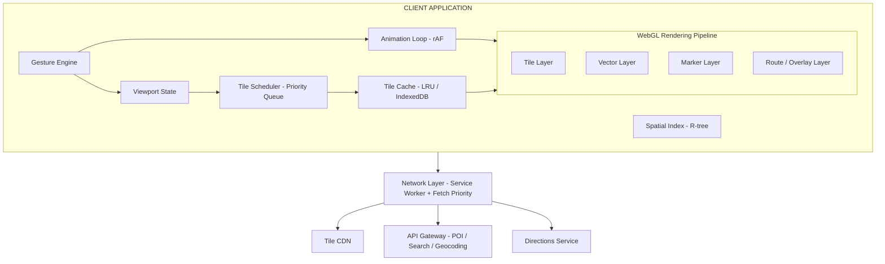

## Problem Statement

An interactive map application is one of the most technically demanding frontend systems ever built. It must render a seamless, zoomable representation of the entire planet — from satellite-level overviews (zoom 0: single 256×256 tile) down to street-level detail (zoom 22: ~2cm/pixel) — while maintaining 60fps pan/zoom interactions, handling tens of thousands of markers, computing and visualizing routes, and supporting offline-first experiences on constrained mobile devices.

Google Maps alone serves over 1 billion monthly users across web and mobile, rendering approximately 100 million map tiles per second globally. Apple Maps, Mapbox GL, HERE Maps, and OpenStreetMap-based solutions each solve this problem with different rendering strategies, tile formats, and performance trade-offs.

The frontend engineering challenge encompasses: real-time WebGL rendering of vector geometry, efficient spatial data structures for viewport-based queries, gesture recognition systems with inertial physics, progressive detail loading across 23 discrete zoom levels, and tile caching strategies that balance storage budgets against network costs.

<Callout>
  This is not a "show a map on screen" problem. This is a real-time geospatial
  rendering engine that must handle 10K+ interactive markers at 60fps while
  streaming gigabytes of cartographic data on demand. The rendering pipeline
  alone rivals a game engine in complexity.
</Callout>

---

## Requirements Exploration

### Functional Requirements

1. **Tile-based map rendering** — Render Slippy Map tiles (256×256 or 512×512) across zoom levels 0–22, supporting both raster (PNG/JPEG) and vector (MVT/PBF) tile formats
2. **Smooth viewport manipulation** — Pan, pinch-zoom, rotation, and tilt with inertial scrolling at 60fps, minimum 16.67ms frame budget
3. **Marker management** — Display, cluster, and interact with 10,000+ markers without frame drops; support custom marker icons and info windows
4. **Geocoding & search** — Forward/reverse geocoding with typeahead suggestions, viewport-biased results
5. **Route visualization** — Render polyline routes with animated directions, turn-by-turn navigation overlay, and traffic-aware coloring
6. **Point of interest (POI) display** — Progressive loading of POIs based on zoom level and viewport bounds
7. **Geolocation tracking** — Real-time user position with heading indicator and accuracy circle
8. **Offline map access** — Pre-fetch and cache tile regions for offline use within configurable storage budgets
9. **Street View integration** — Seamless transition between 2D map and 360° panoramic imagery
10. **Layer management** — Toggle satellite, terrain, traffic, transit, and cycling overlays

### Non-Functional Requirements

| Requirement                   | Target                      | Rationale                                                    |
| ----------------------------- | --------------------------- | ------------------------------------------------------------ |
| First Meaningful Paint        | < 1.5s                      | Map must be interactive before user loses patience           |
| Frame rate during interaction | ≥ 60fps (≥ 55fps P95)       | Sub-60fps is perceptible as jank during pan/zoom             |
| Time to Interactive (TTI)     | < 3s on 4G                  | Users expect immediate map interaction                       |
| Tile load latency (P50)       | < 200ms                     | Visible blank tiles destroy spatial continuity               |
| Tile load latency (P99)       | < 800ms                     | Long tail causes "grey grid" on fast pans                    |
| Marker render capacity        | 10K+ visible simultaneously | Dense urban POI datasets                                     |
| Offline tile budget           | 50–500MB configurable       | Mobile storage constraints                                   |
| Memory ceiling                | < 512MB heap                | Prevent OOM crashes on mid-range devices                     |
| Bundle size (initial)         | < 150KB gzipped             | Map SDK must not dominate page weight                        |
| Accessibility                 | WCAG 2.1 AA                 | Spatial content must be navigable via keyboard/screen reader |

---

## Capacity Estimation & Constraints

**Tile pyramid mathematics:**

```
Zoom 0:  1 tile (whole world)
Zoom 1:  4 tiles (2×2)
Zoom 2:  16 tiles (4×4)
...
Zoom N:  4^N tiles

Zoom 15: 4^15 = 1,073,741,824 tiles (~1 billion)
Zoom 22: 4^22 = 17,592,186,044,416 tiles (~17.6 trillion)
```

**Viewport tile requirements:**

- Typical viewport at 1920×1080 with 256px tiles: ~8×5 = 40 visible tiles
- With 1-tile buffer for smooth panning: ~10×7 = 70 tiles loaded
- At 512px tiles (Retina): ~5×3 = 15 visible, ~7×5 = 35 buffered

**Tile sizes:**

| Format                  | Avg. Size (256px) | Avg. Size (512px)            |
| ----------------------- | ----------------- | ---------------------------- |
| Raster PNG              | 25–80KB           | 80–200KB                     |
| Raster JPEG (satellite) | 40–120KB          | 120–350KB                    |
| Vector MVT (PBF)        | 15–50KB           | N/A (resolution-independent) |
| Vector (gzipped)        | 8–25KB            | N/A                          |

**Bandwidth per viewport change:**

- Raster: 70 tiles × 50KB avg = 3.5MB per full viewport refresh
- Vector: 70 tiles × 20KB avg = 1.4MB per full viewport refresh
- With caching (80% hit rate): ~700KB and ~280KB effective

**Marker data budget:**

- 10,000 markers × 64 bytes (lat, lng, id, category, icon index) = 640KB
- Clustered at viewport level: typically reduces to 200–500 visible clusters
- Info window content: lazy-loaded on interaction, 2–10KB per POI

**Offline storage budget:**

- City-level coverage (zoom 10–17, 20km radius): ~150MB raster, ~40MB vector
- Metro area (zoom 8–17, 100km radius): ~2GB raster, ~400MB vector
- IndexedDB practical limit: 50% of available disk (browser-enforced)

---

## Architecture / High-Level Design

### Rendering Strategy

Three viable rendering approaches exist, each with distinct performance characteristics:

| Approach      | Pros                                                                      | Cons                                                          | Used By                            |
| ------------- | ------------------------------------------------------------------------- | ------------------------------------------------------------- | ---------------------------------- |
| **WebGL**     | 60fps with 100K+ features, GPU-accelerated transforms, vector tile native | Complex shader pipeline, higher memory, mobile GPU throttling | Mapbox GL JS, Google Maps (v3.44+) |
| **Canvas 2D** | Simpler API, good for raster tiles, lower memory baseline                 | CPU-bound transforms, struggles above 5K features, no 3D      | Leaflet, older Google Maps         |
| **DOM-based** | CSS transforms for pan/zoom, simple hit testing, native accessibility     | Cannot scale beyond ~500 elements, layout thrashing           | Early web maps, simple use cases   |

**Decision: WebGL as primary renderer with Canvas 2D fallback.**

WebGL enables GPU-accelerated tile compositing, vector geometry rendering via vertex/fragment shaders, and smooth 3D perspective transforms. The Canvas 2D fallback handles devices without WebGL support (~2% of traffic).

### Navigation Model

```
URL Structure:
/@{lat},{lng},{zoom}z/{tilt}t,{heading}h

Examples:
/@37.7749,-122.4194,15z           — San Francisco, zoom 15
/@37.7749,-122.4194,15z/45t,90h   — Tilted 45°, heading East
/directions/@37.77,-122.42/to/@34.05,-118.24  — Route view
/place/ChIJN1t_tDeuEmsRUsoyG83frY4  — Place detail
```

### System Architecture Diagram ASCII



### Component Architecture

```
┌─────────────────────────────────────────────────────────────┐
│ <MapApplication>                                             │
├─────────────────────────────────────────────────────────────┤
│                                                               │
│  ┌─────────────────────────────────────────────────────┐     │
│  │ <MapCanvas>                                          │     │
│  │  ├── <TileRenderer>          — WebGL tile compositing│     │
│  │  ├── <VectorRenderer>        — Geometry/label render │     │
│  │  ├── <MarkerLayer>           — Clustered markers     │     │
│  │  ├── <RouteOverlay>          — Polyline rendering    │     │
│  │  ├── <GeolocationIndicator>  — User position dot     │     │
│  │  └── <GestureHandler>        — Touch/mouse events    │     │
│  └─────────────────────────────────────────────────────┘     │
│                                                               │
│  ┌──────────────┐  ┌──────────────┐  ┌──────────────────┐   │
│  │ <SearchBar>  │  │ <LayerPanel> │  │ <DirectionsPanel>│   │
│  │  ├── Input   │  │  ├── Toggle  │  │  ├── WaypointList│   │
│  │  └── Results │  │  └── Legend  │  │  ├── RouteOptions│   │
│  └──────────────┘  └──────────────┘  │  └── TurnList    │   │
│                                        └──────────────────┘   │
│  ┌──────────────┐  ┌──────────────┐                          │
│  │ <ZoomControl>│  │ <InfoWindow> │                          │
│  │  ├── ZoomIn  │  │  ├── Header  │                          │
│  │  ├── ZoomOut │  │  ├── Content │                          │
│  │  └── Compass │  │  └── Actions │                          │
│  └──────────────┘  └──────────────┘                          │
└─────────────────────────────────────────────────────────────┘
```

### State Management Strategy

The map application state divides into three domains with different update frequencies:

```typescript
// Viewport state — updates at 60fps during interaction
interface ViewportState {
  center: { lat: number; lng: number };
  zoom: number; // 0–22, supports fractional (e.g., 14.5)
  bearing: number; // 0–360 degrees
  pitch: number; // 0–60 degrees
  bounds: LngLatBounds; // Derived from center + zoom + viewport size
}

// Application state — updates on user actions (Hz range)
interface AppState {
  searchQuery: string;
  selectedPlace: Place | null;
  activeRoute: Route | null;
  activeLayers: Set<LayerType>;
  isNavigating: boolean;
}

// Data state — updates on network responses (seconds range)
interface DataState {
  visibleMarkers: MarkerCluster[];
  tileCache: Map<string, TileEntry>;
  searchResults: Place[];
  routeGeometry: RouteGeometry | null;
}
```

**State management choice:** Viewport state lives outside React (in the rendering engine) to avoid reconciliation overhead at 60fps. Application and data state use Zustand with selective subscriptions.

---

## Data Model / Entities

```typescript
/** Geographic coordinate in WGS84 */
interface LatLng {
  lat: number; // -90 to 90
  lng: number; // -180 to 180
}

/** Bounding box for viewport queries */
interface LngLatBounds {
  sw: LatLng; // Southwest corner
  ne: LatLng; // Northeast corner
}

/** Tile coordinate in the Slippy Map system */
interface TileCoord {
  x: number; // Column: 0 to 2^zoom - 1
  y: number; // Row: 0 to 2^zoom - 1
  z: number; // Zoom level: 0 to 22
}

/** Tile metadata and content */
interface TileEntry {
  coord: TileCoord;
  format: "raster-png" | "raster-jpeg" | "vector-mvt";
  data: ArrayBuffer;
  size: number; // bytes
  fetchedAt: number; // timestamp
  expiresAt: number; // Cache-Control derived
  etag: string | null;
  priority: TilePriority;
}

type TilePriority = "critical" | "visible" | "buffer" | "prefetch";

/** Vector tile layer structure (MVT decoded) */
interface VectorTileLayer {
  name: string; // 'roads', 'buildings', 'labels', 'water'
  features: VectorFeature[];
  extent: number; // Tile coordinate space (typically 4096)
}

interface VectorFeature {
  id: number;
  type: "Point" | "LineString" | "Polygon";
  geometry: number[][]; // Coordinate rings
  properties: Record<string, string | number | boolean>;
  tags: number[]; // Encoded key-value indices
}

/** Marker with clustering support */
interface MapMarker {
  id: string;
  position: LatLng;
  icon: MarkerIcon;
  category: string;
  priority: number; // Higher = shown at lower zoom levels
  clusterGroup: string; // Grouping key for clustering algorithm
  metadata: Record<string, unknown>;
}

interface MarkerIcon {
  url: string;
  size: [number, number]; // [width, height] in pixels
  anchor: [number, number]; // Anchor point offset
  spriteOffset?: [number, number]; // For sprite sheet icons
}

/** Cluster node produced by spatial indexing */
interface MarkerCluster {
  id: string;
  center: LatLng;
  count: number;
  expansion_zoom: number; // Zoom level where cluster breaks apart
  children: string[]; // Marker IDs or child cluster IDs
  bounds: LngLatBounds;
}

/** Route geometry and metadata */
interface Route {
  id: string;
  origin: LatLng;
  destination: LatLng;
  waypoints: LatLng[];
  legs: RouteLeg[];
  overview_polyline: string; // Encoded polyline
  bounds: LngLatBounds;
  duration: number; // seconds
  distance: number; // meters
  traffic_model: "best_guess" | "pessimistic" | "optimistic";
}

interface RouteLeg {
  start: LatLng;
  end: LatLng;
  steps: RouteStep[];
  duration: number;
  distance: number;
  traffic_segments: TrafficSegment[];
}

interface RouteStep {
  instruction: string;
  maneuver: ManeuverType;
  polyline: string; // Encoded polyline for this step
  duration: number;
  distance: number;
  start_location: LatLng;
  end_location: LatLng;
}

type ManeuverType =
  | "turn-left"
  | "turn-right"
  | "turn-slight-left"
  | "turn-slight-right"
  | "uturn-left"
  | "uturn-right"
  | "merge"
  | "fork-left"
  | "fork-right"
  | "ramp-left"
  | "ramp-right"
  | "roundabout"
  | "straight"
  | "depart"
  | "arrive";

interface TrafficSegment {
  start_index: number;
  end_index: number;
  speed: "fast" | "moderate" | "slow" | "traffic_jam";
  color: string; // Hex color for rendering
}

/** Place / POI entity */
interface Place {
  place_id: string;
  name: string;
  position: LatLng;
  category: PlaceCategory;
  rating: number | null;
  price_level: 1 | 2 | 3 | 4 | null;
  opening_hours: OpeningHours | null;
  address: string;
  viewport: LngLatBounds;
  icon_mask_url: string;
}

type PlaceCategory =
  | "restaurant"
  | "hotel"
  | "gas_station"
  | "hospital"
  | "school"
  | "park"
  | "shopping"
  | "transit"
  | "parking"
  | "airport"
  | "museum"
  | "bank"
  | "pharmacy";

interface OpeningHours {
  is_open_now: boolean;
  periods: { open: TimeOfDay; close: TimeOfDay }[];
}

interface TimeOfDay {
  day: 0 | 1 | 2 | 3 | 4 | 5 | 6;
  hours: number;
  minutes: number;
}

/** Geolocation state */
interface UserLocation {
  position: LatLng;
  accuracy: number; // meters
  heading: number | null; // degrees from north
  speed: number | null; // m/s
  timestamp: number;
  source: "gps" | "network" | "ip";
}

/** Offline region definition */
interface OfflineRegion {
  id: string;
  name: string;
  bounds: LngLatBounds;
  minZoom: number;
  maxZoom: number;
  tileCount: number;
  sizeEstimate: number; // bytes
  downloadedAt: number | null;
  progress: number; // 0–1
  format: "raster" | "vector";
}
```

---

## Interface Definition (API)

### Tile Fetching API

```typescript
/**
 * Tile URL template following Slippy Map convention.
 * CDN serves pre-rendered raster or on-demand vector tiles.
 */
// Raster: GET /tiles/{z}/{x}/{y}.png
// Vector: GET /tiles/{z}/{x}/{y}.mvt
// Satellite: GET /satellite/{z}/{x}/{y}.jpeg

interface TileRequestParams {
  z: number;
  x: number;
  y: number;
  format: "png" | "mvt" | "jpeg";
  scale?: 1 | 2; // @2x for Retina
  lang?: string; // Label language
  style?: string; // Map style ID
}

// Response headers:
// Cache-Control: public, max-age=86400
// ETag: "abc123"
// Content-Encoding: gzip (for MVT)
// Content-Type: image/png | application/x-protobuf | image/jpeg
```

### Places / POI API

```typescript
/** Viewport-based POI search */
// GET /api/places/viewport
interface ViewportPlacesRequest {
  bounds: string; // "sw_lat,sw_lng,ne_lat,ne_lng"
  zoom: number;
  categories?: string[];
  limit?: number; // default 200
}

interface ViewportPlacesResponse {
  places: Place[];
  clusters: PlaceCluster[];
  total_count: number;
  next_cursor: string | null;
}

/** Geocoding API */
// GET /api/geocode?query=...&location=lat,lng&radius=50000
interface GeocodeRequest {
  query: string;
  location?: string; // Bias center "lat,lng"
  radius?: number; // Bias radius in meters
  language?: string;
  components?: string; // Country restriction
}

interface GeocodeResponse {
  results: GeocodeResult[];
  status: "OK" | "ZERO_RESULTS" | "OVER_QUERY_LIMIT";
}

interface GeocodeResult {
  place_id: string;
  formatted_address: string;
  geometry: {
    location: LatLng;
    viewport: LngLatBounds;
  };
  types: string[];
}
```

### Directions API

```typescript
// POST /api/directions
interface DirectionsRequest {
  origin: LatLng | string; // Coordinates or place_id
  destination: LatLng | string;
  waypoints?: (LatLng | string)[];
  mode: "driving" | "walking" | "cycling" | "transit";
  departure_time?: number; // Unix timestamp
  avoid?: ("tolls" | "highways" | "ferries")[];
  alternatives?: boolean;
}

interface DirectionsResponse {
  routes: Route[];
  status: "OK" | "NOT_FOUND" | "ZERO_RESULTS";
  geocoded_waypoints: GeocodeResult[];
}
```

### Autocomplete API

```typescript
// GET /api/autocomplete?input=...&sessiontoken=...
interface AutocompleteRequest {
  input: string;
  sessiontoken: string; // Groups requests for billing
  location?: string;
  radius?: number;
  types?: string[]; // 'establishment' | 'geocode' | 'address'
  language?: string;
}

interface AutocompleteResponse {
  predictions: Prediction[];
  status: "OK" | "ZERO_RESULTS";
}

interface Prediction {
  place_id: string;
  description: string;
  structured_formatting: {
    main_text: string;
    secondary_text: string;
    main_text_matched_substrings: { offset: number; length: number }[];
  };
  types: string[];
  distance_meters: number | null;
}
```

---

## Caching Strategy

### Client-Side Caching

```typescript
/**
 * Three-tier client cache: Memory → IndexedDB → Network
 *
 * Memory (LRU): ~200 tiles, immediate access (<1ms)
 * IndexedDB: configurable budget (default 100MB), ~5ms access
 * Network: 200ms–2s depending on CDN proximity
 */

interface TileCacheConfig {
  memoryMaxTiles: number; // Default: 256
  memoryMaxBytes: number; // Default: 64MB
  diskMaxBytes: number; // Default: 100MB
  diskEvictionPolicy: "lru" | "lru-with-priority";
  prefetchRadius: number; // Tiles beyond viewport: 1–2
  offlineBudgetBytes: number; // Default: 200MB
}

class TileCache {
  private memoryCache: LRUCache<string, TileEntry>;
  private db: IDBDatabase;

  async get(coord: TileCoord): Promise<TileEntry | null> {
    const key = `${coord.z}/${coord.x}/${coord.y}`;

    // L1: Memory
    const memHit = this.memoryCache.get(key);
    if (memHit) return memHit;

    // L2: IndexedDB
    const diskHit = await this.readFromDisk(key);
    if (diskHit && !this.isExpired(diskHit)) {
      this.memoryCache.set(key, diskHit); // Promote to L1
      return diskHit;
    }

    // L3: Network (caller handles)
    return null;
  }

  async put(
    coord: TileCoord,
    data: ArrayBuffer,
    headers: Headers,
  ): Promise<void> {
    const entry: TileEntry = {
      coord,
      format: this.detectFormat(headers),
      data,
      size: data.byteLength,
      fetchedAt: Date.now(),
      expiresAt: this.parseExpiry(headers),
      etag: headers.get("etag"),
      priority: this.computePriority(coord),
    };

    this.memoryCache.set(this.toKey(coord), entry);
    await this.writeToDisk(entry);
    await this.enforceQuota();
  }

  private async enforceQuota(): Promise<void> {
    const usage = await this.getDiskUsage();
    if (usage > this.config.diskMaxBytes) {
      // Evict lowest-priority, oldest tiles first
      await this.evictLRU(usage - this.config.diskMaxBytes * 0.8);
    }
  }
}
```

**Cache key strategy:**

```
Key format: "{style}/{z}/{x}/{y}@{scale}x.{format}"
Examples:
  "default/15/5242/12661@2x.mvt"
  "satellite/18/41943/101325@1x.jpeg"
```

### CDN & Edge Caching

| Layer                 | TTL                      | Purge Strategy                   | Hit Rate Target |
| --------------------- | ------------------------ | -------------------------------- | --------------- |
| Browser Cache-Control | 24h (tiles), 5min (POI)  | ETag revalidation                | 80%+            |
| Service Worker        | 7 days (tiles), 1h (API) | Stale-while-revalidate           | 90%+            |
| CDN Edge (CloudFront) | 30 days                  | Versioned URLs for style changes | 95%+            |
| Origin Shield         | 30 days                  | Manual purge on data updates     | 99%+            |

**Service Worker strategy:**

```typescript
// sw.ts — Stale-while-revalidate for tiles, network-first for API
self.addEventListener("fetch", (event: FetchEvent) => {
  const url = new URL(event.request.url);

  if (url.pathname.startsWith("/tiles/")) {
    event.respondWith(staleWhileRevalidate(event.request, "tile-cache-v1"));
  } else if (url.pathname.startsWith("/api/")) {
    event.respondWith(networkFirst(event.request, "api-cache-v1", 3000));
  }
});

async function staleWhileRevalidate(
  request: Request,
  cacheName: string,
): Promise<Response> {
  const cache = await caches.open(cacheName);
  const cached = await cache.match(request);

  const networkPromise = fetch(request).then((response) => {
    if (response.ok) cache.put(request, response.clone());
    return response;
  });

  return cached ?? networkPromise;
}
```

### Cache Coherence

Map tile data changes infrequently (road updates, new buildings), but when it changes, stale tiles create visual inconsistencies at boundaries.

**Coherence strategy:**

1. **Tile versioning** — Style URL includes version hash: `/tiles/v3a7f2/{z}/{x}/{y}.mvt`
2. **Boundary buffering** — Fetch tiles with 1px overlap to prevent seam artifacts
3. **Atomic style updates** — New style version triggers full memory cache flush, background IndexedDB migration
4. **Vector tile advantage** — Styles are applied client-side; only geometry needs re-fetching on data changes

<Callout>
  Vector tiles decouple data from presentation. A style change (colors, labels,
  road widths) requires zero network requests — only a re-render. This is why
  Mapbox GL can offer "dark mode" as an instant toggle while raster-based maps
  require downloading entirely new tile sets.
</Callout>

---

## Rendering & Performance Deep Dive

### Critical Rendering Path

```
Timeline (target: interactive in 1.5s):

0ms     — HTML received, parser starts
50ms    — Critical CSS inlined, map container rendered (skeleton)
100ms   — Map SDK JS begins loading (async, 120KB gzipped)
300ms   — SDK initialized, WebGL context created
400ms   — Viewport determined, first tile requests dispatched (9 center tiles)
600ms   — First tiles received from CDN (warm cache: 200ms, cold: 400ms)
700ms   — First tiles decoded and uploaded to GPU textures
800ms   — First frame rendered — user sees map ← FMP
1000ms  — Remaining buffer tiles loaded, markers fetched
1200ms  — Gesture handlers attached, search bar interactive
1500ms  — Full interactivity ← TTI
```

### Core Web Vitals

| Metric    | Target  | Strategy                                                                 |
| --------- | ------- | ------------------------------------------------------------------------ |
| LCP       | < 1.5s  | Map canvas is the LCP element; first 9 tiles must render in 800ms        |
| FID / INP | < 100ms | Gesture handler is synchronous; tile loading is async and non-blocking   |
| CLS       | < 0.05  | Map container has explicit dimensions; no layout shift from tile loading |
| TTFB      | < 200ms | CDN-served HTML, edge-cached tile responses                              |

### Map Tile Rendering

**WebGL tile compositing pipeline:**

```typescript
class TileRenderer {
  private gl: WebGL2RenderingContext;
  private tileProgram: WebGLProgram;
  private tileTextures: Map<string, WebGLTexture>;

  renderFrame(viewport: ViewportState, tiles: TileEntry[]): void {
    this.gl.clear(this.gl.COLOR_BUFFER_BIT);

    // Compute view-projection matrix from viewport
    const vpMatrix = this.computeViewProjection(viewport);

    // Sort tiles: lower zoom (background) first, then current zoom
    const sorted = this.sortByZoomThenDistance(tiles, viewport.center);

    for (const tile of sorted) {
      const texture = this.getOrUploadTexture(tile);
      const tileMatrix = this.computeTileMatrix(tile.coord, vpMatrix);

      this.gl.useProgram(this.tileProgram);
      this.gl.uniformMatrix4fv(this.mvpLocation, false, tileMatrix);
      this.gl.bindTexture(this.gl.TEXTURE_2D, texture);
      this.gl.drawArrays(this.gl.TRIANGLE_STRIP, 0, 4);
    }
  }

  /**
   * Convert tile coordinate to pixel position.
   * Slippy Map: pixel_x = (x * 256) - (viewport_x * 256)
   */
  private computeTileMatrix(
    coord: TileCoord,
    vpMatrix: Float32Array,
  ): Float32Array {
    const scale = Math.pow(2, coord.z);
    const tileSize = 256;
    const worldX = coord.x * tileSize;
    const worldY = coord.y * tileSize;
    // Apply world position offset then view-projection
    return mat4.translate(vpMatrix, [worldX, worldY, 0]);
  }
}
```

**Vector tile rendering adds complexity:**

```typescript
class VectorTileRenderer {
  /**
   * Vector tiles require tessellation (converting polygons to triangles)
   * and text shaping (placing labels along roads, deconflicting overlaps).
   *
   * Pipeline: MVT decode → Feature filter → Tessellate → Upload → Render
   *
   * Tessellation runs in a Web Worker to avoid blocking the main thread.
   */

  private workers: Worker[];
  private bucketCache: Map<string, RenderBucket>;

  async prepareTile(tile: VectorTileLayer[]): Promise<RenderBucket[]> {
    // Offload to worker pool
    const worker = this.getNextWorker();
    return new Promise((resolve) => {
      worker.postMessage({ type: "tessellate", layers: tile });
      worker.onmessage = (e) => resolve(e.data.buckets);
    });
  }
}

interface RenderBucket {
  layerName: string;
  vertexBuffer: Float32Array; // Tessellated geometry
  indexBuffer: Uint16Array;
  labelAnchors: LabelAnchor[]; // For text placement
  lineVertices: Float32Array; // For road/path rendering
}
```

### Marker Clustering

**Supercluster algorithm (grid-based hierarchical clustering):**

```typescript
/**
 * Supercluster builds a tree of clusters at each zoom level.
 * Time complexity: O(n) for initial build, O(log n) for viewport query.
 * Used by Mapbox GL, deck.gl, and most production map libraries.
 */
interface SuperclusterOptions {
  minZoom: number; // Default: 0
  maxZoom: number; // Default: 16 (beyond this, no clustering)
  radius: number; // Cluster radius in pixels: 40–80
  extent: number; // Tile extent: 512
  nodeSize: number; // KD-tree node size: 64
  minPoints: number; // Min points to form cluster: 2
}

class MarkerClusterEngine {
  private trees: KDBush[]; // One spatial index per zoom level

  /**
   * Build hierarchical cluster tree.
   * For 10K markers: ~15ms on modern hardware.
   */
  load(markers: MapMarker[]): void {
    // Zoom maxZoom+1: individual points
    let points = markers.map((m) => this.lngLatToPoint(m.position));

    for (let z = this.options.maxZoom; z >= this.options.minZoom; z--) {
      this.trees[z] = new KDBush(points);
      points = this.clusterAtZoom(points, z);
    }
  }

  /**
   * Query clusters visible in viewport.
   * Returns mix of individual markers and cluster nodes.
   */
  getClusters(
    bounds: LngLatBounds,
    zoom: number,
  ): (MapMarker | MarkerCluster)[] {
    const tree = this.trees[Math.floor(zoom)];
    const [minX, minY, maxX, maxY] = this.boundsToRange(bounds, zoom);
    const ids = tree.range(minX, minY, maxX, maxY);
    return ids.map((id) => this.points[id]);
  }

  private clusterAtZoom(points: ClusterPoint[], zoom: number): ClusterPoint[] {
    const radius =
      this.options.radius / (this.options.extent * Math.pow(2, zoom));
    const clustered: ClusterPoint[] = [];

    for (const point of points) {
      if (point.visited) continue;
      point.visited = true;

      const neighbors = this.trees[zoom + 1].within(point.x, point.y, radius);
      const cluster = this.mergePoints(point, neighbors);
      clustered.push(cluster);
    }
    return clustered;
  }
}
```

**Performance comparison of clustering approaches:**

| Algorithm              | Build Time (10K pts) | Query Time    | Memory | Quality               |
| ---------------------- | -------------------- | ------------- | ------ | --------------------- |
| Grid-based             | 5ms                  | O(1) per cell | Low    | Poor (grid artifacts) |
| K-means                | 200ms+               | N/A (global)  | Medium | Good (but iterative)  |
| Supercluster (KD-tree) | 15ms                 | O(log n)      | Medium | Excellent             |
| DBSCAN                 | 50ms                 | O(n log n)    | High   | Best (density-aware)  |

### Bundle Optimization

```
Map SDK bundle breakdown (target: < 150KB gzipped):

Core (always loaded):
  ├── Viewport math + projections:     8KB
  ├── Tile scheduler + cache:         12KB
  ├── WebGL renderer (shaders):       25KB
  ├── Gesture engine:                 10KB
  ├── Style spec parser:              15KB
  └── Base total:                     70KB gzipped

Lazy-loaded on demand:
  ├── Directions renderer:            15KB
  ├── Search/Geocoding UI:            12KB
  ├── Offline sync engine:            20KB
  ├── Vector tile decoder (PBF):      8KB
  ├── Marker clustering:              10KB
  ├── Street View bridge:             25KB
  └── Total lazy:                     90KB gzipped

Web Workers (loaded in worker context):
  ├── Vector tessellation worker:     30KB
  └── Label collision worker:         15KB
```

---

## Security Deep Dive

### Threat Model

| Threat                | Vector                                              | Impact                               | Mitigation                                                  |
| --------------------- | --------------------------------------------------- | ------------------------------------ | ----------------------------------------------------------- |
| API key extraction    | Client-side JS inspection                           | Unauthorized usage, quota theft      | HTTP Referrer restrictions, key rotation, usage quotas      |
| Tile URL scraping     | Network inspection                                  | Bulk tile downloading, service abuse | Rate limiting per IP, token-signed tile URLs                |
| XSS via POI content   | Injected place names/descriptions                   | Session hijack, data theft           | DOMPurify on all user-generated content, CSP                |
| Location tracking     | Geolocation API abuse                               | Privacy violation, stalking          | Permission-gated, session-only, no persistent logging       |
| Man-in-the-middle     | Insecure tile fetching                              | Modified map data, phishing overlays | HTTPS-only tiles, SRI for SDK bundle                        |
| Clickjacking          | Iframe embedding of map                             | UI redress, credential theft         | X-Frame-Options, CSP frame-ancestors                        |
| Prototype pollution   | Malicious GeoJSON input                             | Code execution                       | Object.freeze on parsed configs, input validation           |
| DoS via tile flooding | Rapid viewport changes triggering 1000s of requests | CDN cost explosion                   | Request deduplication, viewport debounce, tile queue limits |

### CSP

```typescript
// Content-Security-Policy for map application
const cspDirectives = {
  "default-src": ["'self'"],
  "script-src": ["'self'", "'wasm-unsafe-eval'"], // WebAssembly for vector tile decoding
  "style-src": ["'self'", "'unsafe-inline'"], // Map styles require inline (canvas doesn't use DOM)
  "img-src": [
    "'self'",
    "https://*.tile.openstreetmap.org",
    "https://maps.googleapis.com",
    "data:",
    "blob:",
  ],
  "connect-src": [
    "'self'",
    "https://*.googleapis.com",
    "https://*.mapbox.com",
    "https://api.maptiler.com",
  ],
  "worker-src": ["'self'", "blob:"], // Web Workers for tessellation
  "child-src": ["'none'"],
  "frame-ancestors": ["'self'"], // Prevent clickjacking
};
```

### API Key Security

```typescript
/**
 * API keys are inherently exposed in client-side applications.
 * Defense-in-depth approach:
 */

// 1. HTTP Referrer restriction (server-side enforcement)
// Key only works from: *.yourdomain.com, localhost:*

// 2. Proxy through BFF to hide raw key
// Client calls: /api/tiles/{z}/{x}/{y}
// Server appends: ?key=ACTUAL_KEY and forwards to tile provider

// 3. Short-lived signed URLs for tile requests
interface SignedTileConfig {
  baseUrl: string;
  token: string; // Rotates every 60 minutes
  signature: string; // HMAC of baseUrl + timestamp
  expiresAt: number;
}

async function getSignedTileUrl(coord: TileCoord): Promise<string> {
  // Fetch fresh config every 55 minutes (5min buffer before expiry)
  const config = await this.getOrRefreshConfig();
  return `${config.baseUrl}/${coord.z}/${coord.x}/${coord.y}.mvt?token=${config.token}&sig=${config.signature}`;
}

// 4. Usage quotas with alerts
// Per-key daily limits: 100K tile loads, 10K geocode requests
// Alert at 80% threshold, block at 100%
```

### Geolocation Privacy

```typescript
/**
 * Geolocation data handling principles:
 * 1. Never persist precise location beyond session
 * 2. Coarsen location for analytics (round to 3 decimal places = ~100m)
 * 3. Allow user to override/spoof for privacy
 * 4. Clear location data on page unload
 */

function coarsenForAnalytics(position: LatLng): LatLng {
  return {
    lat: Math.round(position.lat * 1000) / 1000, // ~111m precision
    lng: Math.round(position.lng * 1000) / 1000,
  };
}

// Permission request is user-initiated only — never on page load
function requestLocation(): Promise<UserLocation> {
  // Only request after explicit user action (clicking "My Location" button)
  // navigator.geolocation.getCurrentPosition with:
  // - enableHighAccuracy: false initially (faster, less battery)
  // - timeout: 10000ms
  // - maximumAge: 60000ms (allow 1-min cached position)
}
```

<Callout>
  Never auto-request geolocation on page load. This triggers a browser
  permission prompt that trains users to click "Block." Wait for explicit user
  intent (clicking the location button). Google Maps follows this pattern — the
  location dot only appears after user action.
</Callout>

---

## Scalability & Reliability

### Scalability Patterns

**Tile request management:**

```typescript
/**
 * Priority queue prevents tile request flooding during rapid pan/zoom.
 * Maximum 6 concurrent tile requests (HTTP/2 connection limit per origin).
 * Cancellation of out-of-viewport requests on viewport change.
 */
class TileScheduler {
  private queue: PriorityQueue<TileRequest>;
  private active: Map<string, AbortController>;
  private maxConcurrent = 6;

  scheduleViewport(viewport: ViewportState): void {
    // Cancel all active requests for tiles no longer needed
    for (const [key, controller] of this.active) {
      if (!this.isTileInViewport(key, viewport)) {
        controller.abort();
        this.active.delete(key);
      }
    }

    // Compute needed tiles and enqueue by priority
    const needed = this.computeNeededTiles(viewport);
    for (const tile of needed) {
      if (!this.cache.has(tile) && !this.active.has(this.toKey(tile))) {
        this.queue.enqueue({
          coord: tile,
          priority: this.computePriority(tile, viewport),
        });
      }
    }

    this.drainQueue();
  }

  private computePriority(coord: TileCoord, viewport: ViewportState): number {
    // Priority: center tiles > edge tiles > buffer tiles
    // Priority: current zoom > parent zoom (placeholder) > child zoom
    const distFromCenter = this.distanceFromCenter(coord, viewport);
    const zoomDelta = Math.abs(coord.z - Math.round(viewport.zoom));
    return 100 - distFromCenter * 10 - zoomDelta * 20;
  }
}
```

**Viewport debouncing for API calls:**

```typescript
/**
 * POI and geocoding requests are viewport-debounced.
 * Don't fire on every frame during pan — wait for gesture end.
 */
function createViewportObserver(
  callback: (bounds: LngLatBounds) => void,
  options: { debounceMs: number; minMovement: number },
) {
  let timeout: ReturnType<typeof setTimeout>;
  let lastBounds: LngLatBounds | null = null;

  return (bounds: LngLatBounds) => {
    if (
      lastBounds &&
      !hasMovedSignificantly(lastBounds, bounds, options.minMovement)
    ) {
      return;
    }
    clearTimeout(timeout);
    timeout = setTimeout(() => {
      lastBounds = bounds;
      callback(bounds);
    }, options.debounceMs);
  };
}

// Usage: fire POI fetch 300ms after pan ends, only if viewport moved > 20%
const poiFetcher = createViewportObserver(fetchPOIs, {
  debounceMs: 300,
  minMovement: 0.2, // 20% viewport change threshold
});
```

### Failure Handling

| Failure Mode                | Detection                                      | Recovery                                                                          | User Experience                                                |
| --------------------------- | ---------------------------------------------- | --------------------------------------------------------------------------------- | -------------------------------------------------------------- |
| Tile load failure (404/5xx) | HTTP status, timeout (8s)                      | Retry with exponential backoff (1s, 2s, 4s), show parent zoom tile as placeholder | Grey tile with retry icon; parent zoom tile visible underneath |
| WebGL context lost          | `webglcontextlost` event                       | Recreate context, re-upload visible textures                                      | Brief flash, automatic recovery                                |
| Geolocation denied          | PermissionDenied error                         | Show manual location search, IP-based rough position                              | "Enable location" banner, map centered on IP location          |
| Directions API failure      | Network error, 5xx                             | Retry once, fallback to cached route if same O/D                                  | "Route unavailable" with retry button                          |
| IndexedDB quota exceeded    | QuotaExceededError                             | Evict lowest-priority tiles, reduce offline budget                                | "Storage full" notification, auto-cleanup                      |
| Service Worker crash        | navigator.serviceWorker error                  | Bypass to network, re-register SW                                                 | Transparent fallback, slightly slower tile loads               |
| Memory pressure             | `performance.measureUserAgentSpecificMemory()` | Reduce texture cache, lower tile buffer radius                                    | Slight loading on fast pan, but no crash                       |
| Network offline             | `navigator.onLine` + fetch failures            | Serve from IndexedDB/Cache API, disable search                                    | "Offline" badge, cached tiles still pannable                   |

### Resilience Patterns

```typescript
/**
 * Graceful degradation cascade:
 * WebGL → Canvas 2D → Static tile image
 * Vector tiles → Raster tiles → Cached tiles → Placeholder
 */

class RenderingFallback {
  private renderer: MapRenderer;

  initialize(): MapRenderer {
    if (this.supportsWebGL2()) {
      return new WebGL2Renderer();
    }
    if (this.supportsWebGL1()) {
      return new WebGL1Renderer();
    }
    if (this.supportsCanvas2D()) {
      console.warn("Map: Falling back to Canvas 2D — reduced performance");
      return new Canvas2DRenderer();
    }
    // Final fallback: server-side rendered static image
    return new StaticImageRenderer();
  }

  private supportsWebGL2(): boolean {
    const canvas = document.createElement("canvas");
    return canvas.getContext("webgl2") !== null;
  }
}

/**
 * Placeholder tile from parent zoom while loading:
 * If zoom 15 tile is loading, render zoom 14 parent tile scaled 2x.
 * Provides visual continuity during loading.
 */
function getPlaceholderTile(
  coord: TileCoord,
  cache: TileCache,
): TileEntry | null {
  for (let z = coord.z - 1; z >= Math.max(0, coord.z - 3); z--) {
    const parentCoord = {
      x: Math.floor(coord.x / Math.pow(2, coord.z - z)),
      y: Math.floor(coord.y / Math.pow(2, coord.z - z)),
      z,
    };
    const parent = cache.getSync(parentCoord);
    if (parent) return parent;
  }
  return null;
}
```

---

## Accessibility Deep Dive

Interactive maps present unique accessibility challenges. Spatial content is inherently visual, but must be navigable for screen reader users and keyboard-only users.

**ARIA landmark structure:**

```tsx
<div role="application" aria-label="Interactive map">
  <div role="region" aria-label="Map canvas" aria-roledescription="map">
    <canvas aria-hidden="true" /> {/* WebGL canvas is not accessible */}
    {/* Accessible map description — screen reader only */}
    <div className="sr-only" aria-live="polite" aria-atomic="true">
      Map showing {areaDescription}. Center: {centerAddress}. Zoom level {zoom}.{" "}
      {markerCount} points of interest visible.
    </div>
    {/* Keyboard-navigable marker list */}
    <ul role="listbox" aria-label="Map markers" className="sr-only">
      {visibleMarkers.map((marker) => (
        <li
          key={marker.id}
          role="option"
          aria-selected={marker.id === selectedId}
          tabIndex={0}
        >
          {marker.name}, {marker.category}, {distanceFromCenter(marker)}
        </li>
      ))}
    </ul>
  </div>
</div>
```

**Keyboard navigation scheme:**

| Key             | Action                                | Context          |
| --------------- | ------------------------------------- | ---------------- |
| Arrow keys      | Pan map (100px per press)             | Map focused      |
| `+` / `-`       | Zoom in / out                         | Map focused      |
| `Tab`           | Cycle through markers (nearest-first) | Map focused      |
| `Enter`         | Open info window for focused marker   | Marker focused   |
| `Escape`        | Close info window, deselect           | Info window open |
| `Shift + Arrow` | Pan map (400px per press, fast)       | Map focused      |
| `Home`          | Reset to default view                 | Map focused      |
| `R`             | Read current viewport (screen reader) | Map focused      |

**Screen reader announcements:**

```typescript
class MapAnnouncer {
  private liveRegion: HTMLElement;
  private debounceTimer: ReturnType<typeof setTimeout> | null = null;

  announceViewportChange(viewport: ViewportState): void {
    // Debounce: only announce after 500ms of no movement
    if (this.debounceTimer) clearTimeout(this.debounceTimer);
    this.debounceTimer = setTimeout(() => {
      const address = this.reverseGeocode(viewport.center);
      const markerCount = this.getVisibleMarkerCount(viewport);
      this.announce(
        `Map moved to ${address}. Zoom level ${Math.round(viewport.zoom)}. ` +
          `${markerCount} places visible.`,
      );
    }, 500);
  }

  announceRouteLoaded(route: Route): void {
    this.announce(
      `Route found. ${route.legs.length} legs. ` +
        `Total distance: ${formatDistance(route.distance)}. ` +
        `Estimated time: ${formatDuration(route.duration)}.`,
    );
  }

  private announce(message: string): void {
    this.liveRegion.textContent = message;
  }
}
```

**Reduced motion support:**

```typescript
const prefersReducedMotion = window.matchMedia(
  "(prefers-reduced-motion: reduce)",
).matches;

const animationConfig = prefersReducedMotion
  ? { inertia: false, zoomAnimation: false, panDuration: 0 }
  : { inertia: true, zoomAnimation: true, panDuration: 300 };
```

<Callout>
  Google Maps solves the "spatial content for non-visual users" problem by
  providing a parallel text-based interface: the search panel, directions list,
  and nearby places list are all fully accessible. The map canvas itself is
  `aria-hidden`; the accessible interface wraps it. This dual-interface pattern
  is the gold standard for map accessibility.
</Callout>

---

## Monitoring & Observability

### Client-Side Metrics

| Metric                               | Collection Method                              | Alert Threshold              | Dashboard            |
| ------------------------------------ | ---------------------------------------------- | ---------------------------- | -------------------- |
| Tile load time (P50, P95, P99)       | PerformanceObserver (resource timing)          | P95 > 800ms                  | Tile Performance     |
| First map frame rendered             | Custom mark (`performance.mark`)               | > 2s                         | Core Vitals          |
| Frame rate during interaction        | `requestAnimationFrame` delta tracking         | P10 < 50fps                  | Rendering Health     |
| WebGL context loss events            | Event listener count                           | > 0.1% sessions              | Stability            |
| Cache hit rate (memory/disk)         | Custom counter                                 | < 70%                        | Caching              |
| Tile request cancellation rate       | AbortController signal count                   | > 50%                        | Network Efficiency   |
| JS heap size                         | `performance.measureUserAgentSpecificMemory()` | > 400MB                      | Memory               |
| Marker cluster computation time      | `performance.measure`                          | > 50ms                       | Data Processing      |
| Gesture recognition latency          | Touch event → first frame delta                | > 100ms                      | Input Responsiveness |
| Offline tile coverage completeness   | IndexedDB audit                                | < 80% for downloaded regions | Offline              |
| Service Worker registration failures | SW lifecycle events                            | > 1%                         | Infrastructure       |
| INP (Interaction to Next Paint)      | web-vitals library                             | > 200ms                      | Core Vitals          |

### Error Tracking

```typescript
interface MapErrorEvent {
  type:
    | "tile_load_failure"
    | "webgl_context_lost"
    | "worker_crash"
    | "geolocation_error"
    | "api_error"
    | "oom_warning";
  timestamp: number;
  viewport: ViewportState;
  tileCoord?: TileCoord;
  httpStatus?: number;
  errorMessage: string;
  deviceMemory: number;
  connectionType: string;
  userAgent: string;
  sessionId: string;
}

class MapErrorReporter {
  private buffer: MapErrorEvent[] = [];
  private flushInterval = 10_000; // Batch every 10s

  report(event: Omit<MapErrorEvent, "timestamp" | "sessionId">): void {
    this.buffer.push({
      ...event,
      timestamp: Date.now(),
      sessionId: this.sessionId,
    });

    // Flush immediately for critical errors
    if (event.type === "webgl_context_lost" || event.type === "oom_warning") {
      this.flush();
    }
  }

  private async flush(): Promise<void> {
    if (this.buffer.length === 0) return;
    const batch = this.buffer.splice(0);

    // Use sendBeacon for reliability (survives page unload)
    navigator.sendBeacon("/api/telemetry/map-errors", JSON.stringify(batch));
  }
}
```

### Alerting

| Alert                 | Condition                            | Severity | Action                                                |
| --------------------- | ------------------------------------ | -------- | ----------------------------------------------------- |
| Tile CDN degradation  | P95 tile latency > 1.5s for 5 min    | P1       | Page CDN team, enable origin failover                 |
| WebGL crash spike     | Context loss > 1% sessions in 15 min | P2       | Investigate GPU driver issue, deploy Canvas fallback  |
| Memory leak detected  | Heap growth > 50MB/min sustained     | P2       | Capture heap snapshot, investigate texture cache      |
| Tile 404 spike        | > 5% tile requests returning 404     | P1       | Tile generation pipeline failure, check data pipeline |
| API quota approaching | > 80% daily quota consumed           | P3       | Notify, prepare quota increase request                |
| Offline sync failures | > 10% of offline downloads failing   | P3       | Check IndexedDB health, storage quota                 |

---

## Trade-offs

| Decision                | Option A                  | Option B                               | Choice                                                         | Justification                                                                                 |
| ----------------------- | ------------------------- | -------------------------------------- | -------------------------------------------------------------- | --------------------------------------------------------------------------------------------- |
| Rendering engine        | WebGL                     | Canvas 2D                              | WebGL (with Canvas fallback)                                   | 10x marker capacity, GPU-accelerated transforms, 3D support — worth the complexity            |
| Tile format             | Raster PNG/JPEG           | Vector MVT/PBF                         | Vector (primary) + Raster (satellite)                          | 60% smaller payloads, dynamic styling, resolution independence                                |
| Tile size               | 256×256                   | 512×512                                | 512×512 for vector, 256×256 for raster                         | Vector: fewer requests matter more than size; Raster: CDN cache hit rate favors smaller tiles |
| Clustering algorithm    | Grid-based                | Supercluster (KD-tree)                 | Supercluster                                                   | O(log n) queries, smooth zoom transitions, sub-20ms for 50K markers                           |
| State management        | React state (all in tree) | External engine + selective React sync | External viewport + Zustand app state                          | Viewport changes 60x/sec — React reconciliation at that rate causes frame drops               |
| Offline strategy        | Service Worker only       | IndexedDB + explicit download          | Hybrid: SW for opportunistic, IDB for explicit offline regions | SW alone can't guarantee coverage of a specific area                                          |
| Bundle loading          | Single bundle             | Core + lazy chunks                     | Core (70KB) + lazy features                                    | First render in 800ms vs 1.5s; most users only pan/zoom initially                             |
| Map projection          | Web Mercator (EPSG:3857)  | Globe projection                       | Web Mercator (with globe at low zoom)                          | Industry standard, tile grid alignment — globe only for zoom < 3 aesthetics                   |
| Label rendering         | DOM overlays              | WebGL text (SDF)                       | WebGL SDF text                                                 | DOM labels cause layout thrashing during pan; SDF scales without re-rasterization             |
| Touch gesture detection | Pointer Events only       | Hammer.js library                      | Custom Pointer Events implementation                           | Hammer.js adds 7KB and over-normalizes; Pointer Events API is sufficient on modern browsers   |

<Callout>
  The most impactful trade-off is keeping viewport state outside React. A naive
  implementation using `useState` for map center/zoom would trigger a full
  component tree reconciliation 60 times per second during a pan gesture. The
  WebGL renderer operates on raw state; React only knows about user-facing UI
  changes (info windows, search results, route panels).
</Callout>

---

## What Great Looks Like

### Senior Engineer (L5/E5)

- Integrates a map SDK (Mapbox GL / Google Maps JS API) correctly with proper lifecycle management (init on mount, destroy on unmount)
- Implements marker clustering using Supercluster with proper viewport-based queries
- Handles tile loading states with appropriate placeholders (parent zoom tile upscaling)
- Manages memory by cleaning up textures and listeners when components unmount
- Implements proper error boundaries around the map canvas
- Achieves < 2s TTI with lazy-loaded map SDK

### Staff Engineer (L6/E6)

- Designs the tile caching architecture: memory LRU + IndexedDB with quota management and eviction policies
- Architects the rendering pipeline with proper separation between viewport state (60fps) and application state (React)
- Implements offline-first strategy with Service Worker + explicit region download with progress tracking
- Designs the gesture engine with inertial physics, pinch-zoom detection, and rotation support
- Builds the tile scheduler with priority queue, request cancellation, and concurrent request limits
- Creates the monitoring stack with real-time frame rate tracking and tile performance waterfall

### Principal Engineer (L7/E7)

- Designs a custom WebGL rendering engine when SDK limitations arise (label deconfliction, custom data layers, 3D buildings)
- Architects cross-platform map state synchronization (web ↔ native via shared viewport protocol)
- Evaluates and decides between vector vs raster tile pipelines based on data freshness requirements, rendering complexity, and CDN cost models
- Designs the vector tile tessellation pipeline with Web Workers, SharedArrayBuffer for zero-copy transfer, and progressive rendering
- Creates framework-agnostic map kernel that can run in React, Vue, or Vanilla JS contexts
- Defines SLOs for map performance that align business metrics (engagement, directions started) with technical metrics (FPS, tile latency)
- Designs the accessibility architecture: dual-interface pattern where the map is a visual complement to a fully accessible text-based spatial interface

---

## Key Takeaways

- **Tile pyramid math drives everything**: a map at zoom 15 requires addressing 1 billion potential tiles; the caching, scheduling, and eviction strategies must respect this scale. Cache budgets of 100–500MB cover only tiny fractions of the tileset.

- **WebGL is non-negotiable for production maps**: Canvas 2D hits a wall at ~5K features and cannot do 3D transforms. The 2% of users without WebGL get Canvas fallback, but the primary path must be GPU-accelerated.

- **Viewport state must live outside React**: at 60fps, the viewport updates every 16.67ms. React reconciliation at this frequency destroys performance. The renderer operates on raw typed arrays; React only renders UI chrome (panels, controls, info windows).

- **Vector tiles are strictly superior for interactive maps**: 60% smaller than raster, support dynamic styling (dark mode without re-fetching), are resolution-independent for any screen density, and enable client-side label placement. Raster remains necessary only for satellite/aerial imagery.

- **Marker clustering is a solved problem**: Supercluster's hierarchical KD-tree approach handles 100K+ markers with sub-20ms query times. The key insight is pre-computing clusters at every zoom level during data load, not on-demand during render.

- **Offline maps require explicit region management**: Service Workers provide opportunistic caching of tiles the user has viewed, but cannot guarantee complete coverage of an area. Explicit region download with IndexedDB storage is required for true offline support.

- **Accessibility demands a dual-interface architecture**: the canvas is `aria-hidden`; spatial information is exposed through a parallel text interface (marker lists, directions steps, area descriptions). Screen readers navigate the text; sighted users navigate the canvas.

- **Performance budgets are tile-centric**: first 9 center tiles within 800ms defines FMP. Memory budget (512MB) maps to ~2,000 loaded tile textures. Network budget (6 concurrent requests) requires priority scheduling with cancellation on viewport change.
