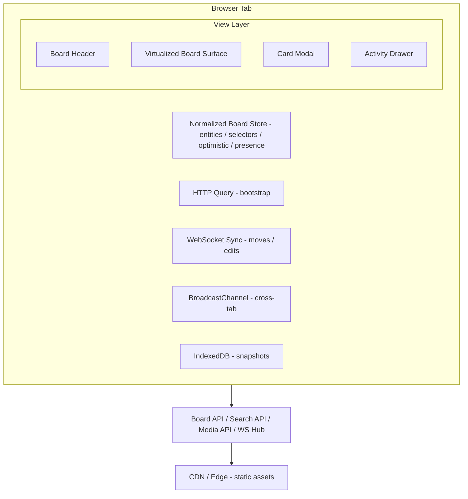

## Problem Statement

A kanban board is a shared,
ordered,
real-time view of work.
The frontend is difficult because the visible position of every card is both UI state
and persisted business state.
Users do not evaluate this product by form correctness alone.
They evaluate it by whether cards land exactly where intended,
whether collaborators see the same ordering immediately,
and whether the board stays fluid while it contains 20 to 30 columns and thousands of
cards.

This design covers the frontend architecture for a board in the class of
Trello,
Jira Board,
Linear,
Asana Board,
Notion project board,
and Monday.com.
Scope includes the board surface,
drag-and-drop interactions,
fractional ordering,
real-time synchronization,
filters,
search,
swimlanes,
WIP limits,
permissions,
activity feed,
keyboard shortcuts,
mobile interactions,
and the card detail modal with markdown,
checklists,
attachments,
and comments.
Backend storage topology,
search indexing internals,
and workflow automation execution are out of scope except where they shape the client
contract.

This problem is not equivalent to rendering a list.
A kanban board is a live,
ordered projection of work where the primary mutation is movement.
That makes ordered-list persistence,
optimistic reordering,
and concurrency control the core of the system.
Trello proves that low-friction movement is the product.
Jira proves that enterprise boards need board-level policy and permissions.
Linear proves that perceived speed determines trust.
Asana proves that board cards are projections of richer tasks.
Notion proves that cards must open into dense structured detail.
Monday.com proves that view configurability cannot come at the cost of interaction
predictability.

<Callout>
  The center of the design is not the modal, the comment thread, or the board
  header. It is the guarantee that order remains stable under concurrency
  without sacrificing latency.
</Callout>

---

## Requirements Exploration

### Functional Requirements

1. Users can open a board and immediately see columns,
   card counts,
   WIP status,
   swimlanes,
   and card summaries.
2. Users can drag cards within a column,
   across columns,
   and across swimlanes with immediate visual feedback.
3. Users can reorder columns themselves if board permissions allow board-structure
   changes.
4. Users can create cards from empty buckets,
   column footers,
   and keyboard shortcuts.
5. Users can open a card detail modal that supports markdown description,
   checklist sections,
   checklist items,
   attachments,
   comments,
   labels,
   due dates,
   assignees,
   linked cards,
   and activity history.
6. Users can see card moves,
   title changes,
   assignee changes,
   checklist toggles,
   comments,
   and archival changes from collaborators in real time.
7. Users can view presence indicators showing who is on the board and who is viewing
   the same card.
8. Users can filter by assignee,
   label,
   due-state,
   priority,
   archived status,
   blocked status,
   and free-text query.
9. Users can search within a board and jump directly to a matching card.
10. Users can group cards by no swimlane,
    assignee,
    priority,
    project,
    or a board-defined custom field.
11. Users can define soft or hard WIP limits per column and optionally per swimlane
    bucket.
12. Users can inspect an activity feed that captures card moves,
    field changes,
    comments,
    checklist events,
    and permission changes.
13. Users can manage board permissions if authorized and understand why controls are
    disabled when not authorized.
14. Users can use the board fully from the keyboard,
    including searching,
    filtering,
    opening cards,
    and moving cards.
15. Users on touch devices can long-press to drag,
    horizontally navigate many columns,
    and edit cards in a mobile-appropriate modal or sheet.
16. Users can deep-link to a board view,
    a filter preset,
    or a specific card modal.
17. Users can continue limited work offline using a recent board snapshot,
    local drafts,
    and a retryable outbox.
18. Users can observe optimistic state that later reconciles cleanly with the server,
    without duplicate movement animations or silent data loss.

### Non-Functional Requirements

| Category      | Requirement                         | Target                               | Why It Matters                     |
| ------------- | ----------------------------------- | ------------------------------------ | ---------------------------------- |
| Performance   | Board shell first paint             | < 700ms p75 desktop                  | Frame the board instantly          |
| Performance   | First interactive board paint       | < 2.0s p75 4G mid-range mobile       | Primary workflow surface           |
| Performance   | Drag start to overlay render        | < 16ms p95                           | Drag latency is obvious            |
| Performance   | Drop to optimistic visual commit    | < 100ms p95                          | Movement must feel direct          |
| Performance   | Card modal open warm cache          | < 150ms p95                          | Card inspection is frequent        |
| Performance   | Card modal open cold cache          | < 400ms p95                          | Detail path cannot feel remote     |
| Latency       | WebSocket event propagation         | < 250ms p95 same region              | Collaboration must feel live       |
| Latency       | Board-local search result paint     | < 300ms p95                          | Search is an operational action    |
| Scalability   | Concurrent viewers on one board     | 200 sessions                         | Shared planning and incidents      |
| Scalability   | Supported columns in one board view | 30 columns                           | Large boards exist in practice     |
| Scalability   | Supported cards in one board view   | 2,500 cards                          | Enterprise boards exceed toy sizes |
| Reliability   | Mutation success rate               | 99.95% monthly                       | Card moves cannot disappear        |
| Freshness     | Maximum online staleness            | < 2s outside active drag             | Users notice stale workflow state  |
| Offline       | Snapshot retention                  | last 10 boards or 60MB total         | Resilience on flaky connections    |
| Bundle size   | Initial board route JS              | < 170KB Brotli                       | Keep route responsive              |
| Accessibility | Keyboard parity for core actions    | 100% for move; open; search; comment | Drag-only UX is invalid            |
| Accessibility | Touch target size                   | >= 44x44 CSS px                      | WCAG and mobile usability          |
| Security      | Stored XSS tolerance                | 0 incidents                          | Boards are UGC-heavy               |
| Consistency   | Optimistic rollback rate            | < 0.5% of successful drops           | Frequent rollback erodes trust     |
| Observability | Sessions with uncaught client error | < 1%                                 | Launch quality bar                 |

---

## Capacity Estimation & Constraints

### Product Traffic Model

Assume a mature collaboration product with:

- 2 million DAU
- 300,000 workspaces
- 1.2 million boards touched daily
- 3 board sessions per active user per day
- 1.6 board visits per session
- 8 minutes average board session length

Derived board-open volume:

- board opens per day = 2,000,000 x 3 x 1.6 = 9.6 million
- average board-open RPS = 9.6 million / 86,400 ~= 111 RPS
- practical peak multiplier = 6x
- peak board-open RPS ~= 670 RPS

That read volume is manageable server-side,
but it is large enough that redundant refetches and bloated payloads become expensive
client-side and operationally noisy.

### Board Shape Model

| Metric                          | Typical | P95   | Hard Ceiling Used for Design |
| ------------------------------- | ------- | ----- | ---------------------------- |
| Columns per board               | 9       | 18    | 30                           |
| Swimlane buckets visible        | 1       | 6     | 12                           |
| Cards total                     | 220     | 1,100 | 2,500                        |
| Cards per bucket                | 24      | 95    | 240                          |
| Comments on active card         | 18      | 80    | 250                          |
| Attachments on active card      | 3       | 12    | 40                           |
| Concurrent viewers on one board | 6       | 32    | 200                          |
| Concurrent editors on one board | 2       | 12    | 50                           |

The worst board is not merely large.
It is large while being actively edited,
filtered,
and viewed through a detail modal.

### Payload Model

Card summaries and card details are separate by design.
Without that split,
board bootstrap cost becomes untenable.

| Payload                        | Raw JSON | Brotli | Notes                                    |
| ------------------------------ | -------- | ------ | ---------------------------------------- |
| Board metadata and permissions | 6KB      | 2KB    | Name; role; presets; feature flags       |
| Column summary                 | 220B     | 90B    | WIP limit; done flag; counts             |
| Swimlane bucket summary        | 180B     | 70B    | Key; title; counts                       |
| Card summary                   | 720B     | 240B   | Title; labels; assignees; counters; rank |
| Card detail core               | 5.8KB    | 1.8KB  | Markdown; checklist refs; watcher ids    |
| Comments page of 50            | 18KB     | 4.9KB  | Text dominates                           |
| Attachments metadata page      | 4KB      | 1.2KB  | Previews loaded separately               |
| Activity page of 50            | 12KB     | 3.5KB  | Structured audit rows                    |

For a 20-column board with roughly 6 cards visible per column,
the initial card window is about 120 summaries.
That is approximately 28.8KB Brotli for cards,
plus metadata,
users,
labels,
and lane indexes.
A practical bootstrap target under 75KB Brotli is realistic.

### Mutation Volume Model

Assume a normal board session produces:

- 24 card moves
- 18 field edits
- 12 comments
- 20 checklist toggles
- 6 filter or preset changes

At peak collaborative boards with 50 active editors,
the client may observe:

- 20 to 30 mutation events per second
- 20 to 30 WebSocket fanout events per second
- 5 to 10 presence updates per second

That event rate is high enough that board-wide rerenders are unacceptable.
Selectors and virtualization must limit impact to affected buckets and cards.

### Client Memory Budget

| Resource                       | Budget     | Hard Policy                             |
| ------------------------------ | ---------- | --------------------------------------- |
| Normalized board summaries     | 12MB       | Keep at most 10,000 summaries in memory |
| Card detail cache              | 8MB        | LRU; max 250 detailed cards             |
| Comments cache                 | 6MB        | Keep 500 recent comments                |
| Attachment metadata cache      | 4MB        | Keep 300 attachment records             |
| DnD measurement cache          | 1MB        | Clear on board change or zoom change    |
| Pending mutations and inverses | 2MB        | Max 500 queued mutations                |
| Virtualizer measurement maps   | 3MB        | Per board; bounded by visible buckets   |
| IndexedDB persistent snapshots | 60MB total | Last 10 boards; oldest evicted first    |

### Constraints That Drive Architecture

1. Order must survive concurrent inserts.
   Plain integer indexes are insufficient.
2. Boards can exceed safe DOM sizes by an order of magnitude.
   Full rendering is not viable.
3. Card detail is dense,
   but card scanning is summary-first.
   The payload model must reflect that.
4. The board is authenticated and personalized.
   Broad CDN caching of board JSON is unsafe.
5. Mobile interactions require touch-first alternatives to hover.
6. Card movement is the dominant mutation.
   The optimistic pipeline must be specialized for moves,
   not treated as generic form submission.

<Callout>
  The ordered-list problem is the root constraint. Once order is modeled
  correctly, pagination, optimistic updates, and reconciliation all become
  tractable.
</Callout>

---

## Architecture / High-Level Design

### Rendering Strategy

The correct rendering strategy is hybrid.
Render the page shell on the server.
Render the board surface on the client.

Server-rendered content:

- board page chrome
- board title and breadcrumb shell
- filter bar shell
- loading skeletons for columns and cards

Client-rendered content:

- normalized board store
- drag-and-drop runtime
- virtualized columns and cards
- presence indicators
- live activity updates
- card detail modal state

Why this split is correct:

- the board surface is personalized and permission-scoped
- live updates make server-rendered board content stale almost immediately
- hydration mismatch risk rises if the server renders rapidly changing card placement
- SSR still helps with fast first paint and stable layout

The board shell benefits from SSR.
The board data does not meaningfully benefit from SSR because it must be refetched or
subscribed immediately after load anyway.

### Navigation Model

The application should be an SPA with URL-driven board state.
This keeps the board responsive,
preserves context on refresh,
and supports deep links for collaboration.

Canonical routes:

| Route                                  | Meaning                           |
| -------------------------------------- | --------------------------------- |
| `/boards/:boardId`                     | Default board surface             |
| `/boards/:boardId?swimlane=assignee`   | Active swimlane grouping          |
| `/boards/:boardId?filter=mine,blocked` | Shared or ad hoc filter state     |
| `/boards/:boardId?query=checkout`      | Active board-local search         |
| `/boards/:boardId/cards/:cardId`       | Deep-linked card modal            |
| `/boards/:boardId/activity`            | Activity drawer or route fallback |

State distribution rules:

- URL state: active board; card modal; search query; swimlane mode; filter preset
- client state: drag session; keyboard selection; hover; optimistic mutations
- persistent local state: collapsed columns; recent boards; drafts; scroll positions

### System Architecture Diagram



The decisive choice is that the normalized store is the client-side authority.
HTTP snapshots seed it.
WebSocket events mutate it.
BroadcastChannel keeps sibling tabs consistent.

### Component Architecture

```text
BoardRoute
├── BoardPageShell
│   ├── BoardHeader
│   │   ├── BoardTitle
│   │   ├── PresenceAvatars
│   │   ├── SearchBox
│   │   ├── FilterBar
│   │   ├── SwimlaneSwitcher
│   │   └── ViewActions
│   ├── WipSummaryStrip
│   ├── BoardCanvas
│   │   ├── HorizontalColumnVirtualizer
│   │   │   └── ColumnViewport
│   │   │       ├── ColumnHeader
│   │   │       ├── LaneGroup
│   │   │       │   ├── LaneHeader
│   │   │       │   └── CardListVirtualizer
│   │   │       │       └── CardShell
│   │   │       └── EmptyBucketDropZone
│   │   └── DragOverlayPortal
│   ├── OfflineBanner
│   └── BoardFooterStatus
├── CardModalRoute
│   ├── CardDetailHeader
│   ├── MarkdownDescriptionEditor
│   ├── ChecklistPanel
│   ├── AttachmentPanel
│   ├── CommentThread
│   └── ActivityMiniFeed
└── ActivityFeedDrawer
```

Ownership rules:

- BoardCanvas owns interaction orchestration,
  not data fetching.
- CardShell receives a stable card ID and derives view data via selectors.
- Card modal owns local drafts but not authoritative entities.
- Presence and optimistic state live in the shared store,
  not in component-local state trees.

### State Management Strategy

| State Class         | Storage                       | Examples                                       | Policy                       |
| ------------------- | ----------------------------- | ---------------------------------------------- | ---------------------------- |
| Server entities     | normalized query-backed store | board; columns; cards; comments; attachments   | stale-while-revalidate       |
| Client UI state     | lightweight client store      | active drag; selected card; collapsed columns  | local only unless preference |
| URL state           | router                        | modal card id; query; filters; swimlane mode   | canonical and shareable      |
| Local durable state | IndexedDB and localStorage    | drafts; snapshots; scroll restore              | bounded by TTL and size cap  |
| Optimistic state    | client store plus outbox      | pending move; inverse patches; pending comment | settles or rolls back        |
| Presence state      | client store only             | active users; active card viewers              | short TTL; websocket-driven  |

Bucket identity is explicit.
Ordered lane indexes are keyed by:

`boardId + viewId + columnId + laneKey`

That is necessary because a board grouped by assignee and the same board grouped by
priority are different projections over the same card entities.

#### Drag-and-Drop Architecture

The implementation should use dnd-kit or a library with equivalent sensor and overlay
capabilities.
It should not rely on native HTML5 drag-and-drop.

Reasons:

- touch support matters
- keyboard sensors matter
- DragOverlay matters because columns are virtualized and clipped
- custom collision detection matters because the surface is multi-axis and grouped

Sensor model:

- PointerSensor with 6px activation distance
- TouchSensor with 180ms long-press activation
- KeyboardSensor with custom coordinate getter for bucket traversal
- auto-scroll thresholds of 24px desktop and 48px mobile

During drag:

1. lock measurements for the current frame
2. widen virtualization overscan
3. render DragOverlay in a portal
4. compute target bucket first and insertion position second
5. synthesize placeholder in destination bucket
6. on drop generate a provisional rank and optimistically patch local indexes

```text
Pointer / Touch / Keyboard
          │
          ▼
      dnd-kit sensors
          │
          ▼
     DragOverlay portal
          │
          ├── widen virtualizer overscan
          ├── freeze active measurements
          ├── compute bucket collision
          └── synthesize placeholder
                    │
                    ▼
               onDrop commit
                    │
                    ├── provisional rank generation
                    ├── optimistic local patch
                    ├── HTTP mutation with idempotency key
                    └── WebSocket reconciliation
```

Optimistic lifecycle:

1. user drops card
2. client computes target bucket and neighbor ranks
3. client generates provisional rank
4. client patches summary entity and lane indexes synchronously
5. client writes outbox record with inverse patch
6. client sends move request
7. server responds and WebSocket echoes authoritative placement
8. client settles or rolls back based on match or conflict

<Callout>
  Optimistic movement is not optional. If the board waits for the server before
  visually moving a card, it loses to Trello, Linear, and Jira on perceived
  quality even when backend latency is good.
</Callout>

---

## Data Model / Entities

The data model is normalized,
versioned,
and intentionally split into summary and detail layers.
The board needs cheap scanning and cheap diffing.
The modal needs rich detail.
Those are different data shapes.

```typescript
type BoardId = string;
type WorkspaceId = string;
type ColumnId = string;
type CardId = string;
type UserId = string;
type CommentId = string;
type AttachmentId = string;
type ChecklistId = string;
type ChecklistItemId = string;
type ActivityEventId = string;
type FilterPresetId = string;
type ISODateString = string;
type Rank = string;
type EntityVersion = number;

type BoardRole = "viewer" | "commenter" | "editor" | "admin" | "owner";

type BoardDensity = "comfortable" | "compact";

type SwimlaneMode =
  | "none"
  | "assignee"
  | "priority"
  | "project"
  | "custom_field";

type Priority = "none" | "low" | "medium" | "high" | "urgent";

type DueState = "none" | "upcoming" | "today" | "overdue" | "completed";

type CardStatusBadge = "blocked" | "ready" | "in_review" | "at_risk";

interface BoardFeatureFlags {
  enableSwimlanes: boolean;
  enableWipLimits: boolean;
  enableCardCovers: boolean;
  enableAttachments: boolean;
  enableChecklists: boolean;
  enableActivityFeed: boolean;
  enableOfflineQueue: boolean;
  enableHardWipEnforcement: boolean;
}

interface BoardPermissionSet {
  canViewBoard: boolean;
  canCreateCard: boolean;
  canEditCard: boolean;
  canMoveCard: boolean;
  canDeleteCard: boolean;
  canComment: boolean;
  canUploadAttachment: boolean;
  canEditBoardStructure: boolean;
  canManagePermissions: boolean;
  canViewActivityFeed: boolean;
}

interface BoardSummary {
  id: BoardId;
  workspaceId: WorkspaceId;
  name: string;
  description: string | null;
  boardRole: BoardRole;
  featureFlags: BoardFeatureFlags;
  permissions: BoardPermissionSet;
  defaultSwimlaneMode: SwimlaneMode;
  density: BoardDensity;
  columnOrder: ColumnId[];
  filterPresetIds: FilterPresetId[];
  activeCardCount: number;
  archivedCardCount: number;
  memberCount: number;
  version: EntityVersion;
  createdAt: ISODateString;
  updatedAt: ISODateString;
}

interface ColumnSummary {
  id: ColumnId;
  boardId: BoardId;
  name: string;
  description: string | null;
  orderRank: Rank;
  wipLimit: number | null;
  hardWipEnforcement: boolean;
  isDoneColumn: boolean;
  isCollapsed: boolean;
  colorToken: string | null;
  cardCount: number;
  visibleCardCount: number;
  version: EntityVersion;
  updatedAt: ISODateString;
}

interface SwimlaneBucket {
  key: string;
  mode: SwimlaneMode;
  title: string;
  orderRank: Rank;
  wipLimit: number | null;
  cardCount: number;
  visibleCardCount: number;
  isSyntheticUnassigned: boolean;
}

interface UserSummary {
  id: UserId;
  displayName: string;
  avatarUrl: string | null;
  handle: string;
  isDeactivated: boolean;
}

interface LabelSummary {
  id: string;
  name: string;
  colorToken: string;
}

interface CardPlacement {
  boardId: BoardId;
  columnId: ColumnId;
  laneKey: string;
  orderRank: Rank;
  sortGroupVersion: number;
}

interface CardCounters {
  commentCount: number;
  attachmentCount: number;
  checklistItemCount: number;
  checklistCompletedCount: number;
  subtaskCount: number;
  subtaskCompletedCount: number;
}

interface CardSummary {
  id: CardId;
  boardId: BoardId;
  title: string;
  titleSearchText: string;
  descriptionSnippet: string | null;
  placement: CardPlacement;
  labelIds: string[];
  assigneeIds: UserId[];
  reporterId: UserId | null;
  priority: Priority;
  dueAt: ISODateString | null;
  dueState: DueState;
  estimatePoints: number | null;
  coverImageUrl: string | null;
  statusBadges: CardStatusBadge[];
  isArchived: boolean;
  counters: CardCounters;
  latestCommentPreview: string | null;
  latestActivityAt: ISODateString;
  version: EntityVersion;
  createdAt: ISODateString;
  updatedAt: ISODateString;
}

interface CardDetail {
  id: CardId;
  boardId: BoardId;
  descriptionMarkdown: string;
  checklistIds: ChecklistId[];
  attachmentIds: AttachmentId[];
  linkedCardIds: CardId[];
  watcherIds: UserId[];
  activityPreviewIds: ActivityEventId[];
  commentPageInfo: CursorPageInfo;
  attachmentPageInfo: CursorPageInfo;
  loadedAt: ISODateString;
  version: EntityVersion;
}

interface ChecklistSection {
  id: ChecklistId;
  cardId: CardId;
  title: string;
  orderRank: Rank;
  itemIds: ChecklistItemId[];
  completedCount: number;
  totalCount: number;
  version: EntityVersion;
  updatedAt: ISODateString;
}

interface ChecklistItem {
  id: ChecklistItemId;
  checklistId: ChecklistId;
  cardId: CardId;
  content: string;
  isCompleted: boolean;
  assigneeId: UserId | null;
  dueAt: ISODateString | null;
  orderRank: Rank;
  completedAt: ISODateString | null;
  completedBy: UserId | null;
  version: EntityVersion;
  updatedAt: ISODateString;
}

type AttachmentType =
  | "image"
  | "video"
  | "document"
  | "archive"
  | "link"
  | "other";

interface AttachmentRecord {
  id: AttachmentId;
  cardId: CardId;
  fileName: string;
  fileSizeBytes: number;
  mimeType: string;
  attachmentType: AttachmentType;
  storageKey: string;
  previewUrl: string | null;
  downloadUrl: string;
  uploadedBy: UserId;
  uploadedAt: ISODateString;
  virusScanStatus: "pending" | "clean" | "blocked";
  version: EntityVersion;
}

interface CommentRecord {
  id: CommentId;
  cardId: CardId;
  authorId: UserId;
  bodyMarkdown: string;
  renderedExcerpt: string;
  mentionedUserIds: UserId[];
  reactionCounts: Record<string, number>;
  createdAt: ISODateString;
  updatedAt: ISODateString;
  deletedAt: ISODateString | null;
  version: EntityVersion;
}

type ActivityEventType =
  | "card_created"
  | "card_moved"
  | "card_archived"
  | "card_restored"
  | "title_changed"
  | "description_changed"
  | "assignee_changed"
  | "label_changed"
  | "checklist_item_toggled"
  | "comment_added"
  | "attachment_added"
  | "column_created"
  | "column_reordered"
  | "permission_changed";

interface ActivityEvent {
  id: ActivityEventId;
  boardId: BoardId;
  cardId: CardId | null;
  actorId: UserId;
  eventType: ActivityEventType;
  summaryText: string;
  payload: Record<string, string | number | boolean | null>;
  createdAt: ISODateString;
}

interface FilterPreset {
  id: FilterPresetId;
  boardId: BoardId;
  name: string;
  isShared: boolean;
  createdBy: UserId;
  query: BoardFilterQuery;
  updatedAt: ISODateString;
}

interface BoardFilterQuery {
  text: string;
  assigneeIds: UserId[];
  labelIds: string[];
  priorities: Priority[];
  dueStates: DueState[];
  includeArchived: boolean;
  blockedOnly: boolean;
  hideDoneColumns: boolean;
}

interface PresenceSession {
  sessionId: string;
  userId: UserId;
  boardId: BoardId;
  activeCardId: CardId | null;
  activity: "viewing_board" | "dragging_card" | "editing_card";
  lastSeenAt: ISODateString;
}

interface CursorPageInfo {
  nextCursor: string | null;
  previousCursor: string | null;
  hasMoreForward: boolean;
  hasMoreBackward: boolean;
}

interface PendingMoveMutation {
  kind: "move_card";
  clientMutationId: string;
  cardId: CardId;
  fromPlacement: CardPlacement;
  toPlacement: CardPlacement;
  submittedAt: ISODateString;
  retryCount: number;
}

interface PendingPatchMutation {
  kind: "patch_card" | "comment_create" | "checklist_toggle";
  clientMutationId: string;
  cardId: CardId;
  patch: Record<string, string | number | boolean | null | string[]>;
  inversePatch: Record<string, string | number | boolean | null | string[]>;
  submittedAt: ISODateString;
  retryCount: number;
}

type PendingMutation = PendingMoveMutation | PendingPatchMutation;

interface KeyboardSelectionState {
  activeCardId: CardId | null;
  activeColumnId: ColumnId | null;
  activeLaneKey: string | null;
  mode: "browse" | "move" | "search";
}

interface BoardUiState {
  boardId: BoardId | null;
  density: BoardDensity;
  swimlaneMode: SwimlaneMode;
  filterQuery: BoardFilterQuery;
  activeCardId: CardId | null;
  isActivityDrawerOpen: boolean;
  collapsedColumnIds: ColumnId[];
  horizontalScrollOffset: number;
  keyboardSelection: KeyboardSelectionState;
  pendingFocusRestoreTarget: string | null;
}

interface LaneIndexEntry {
  boardId: BoardId;
  columnId: ColumnId;
  laneKey: string;
  cardIds: CardId[];
  nextPageCursor: string | null;
  totalCount: number;
  loadedCount: number;
  isHydrating: boolean;
  lastSyncedAt: ISODateString;
}

interface BoardEntityState {
  boards: Record<BoardId, BoardSummary>;
  columns: Record<ColumnId, ColumnSummary>;
  cards: Record<CardId, CardSummary>;
  cardDetails: Record<CardId, CardDetail>;
  checklistSections: Record<ChecklistId, ChecklistSection>;
  checklistItems: Record<ChecklistItemId, ChecklistItem>;
  attachments: Record<AttachmentId, AttachmentRecord>;
  comments: Record<CommentId, CommentRecord>;
  activityEvents: Record<ActivityEventId, ActivityEvent>;
  users: Record<UserId, UserSummary>;
  labels: Record<string, LabelSummary>;
  filterPresets: Record<FilterPresetId, FilterPreset>;
  laneIndexes: Record<string, LaneIndexEntry>;
  presence: Record<string, PresenceSession>;
  pendingMutations: Record<string, PendingMutation>;
  ui: BoardUiState;
}
```

### Ordering Model

The card position is not a plain numeric index.
It is a lexicographically sortable `Rank` scoped to a bucket.
The bucket is the combination of current column and lane.

Why that matters:

- inserting between neighbors is cheap
- optimistic moves do not require rewriting whole arrays
- cursor pagination remains stable under concurrent inserts
- rank reconciliation can be local to a bucket

Rank policy:

- base-62 alphabet
- client generates provisional rank between neighbor ranks
- server may canonicalize rank while preserving order
- if rank length grows too much,
  server rebalances one bucket,
  not the whole board

```typescript
const RANK_ALPHABET =
  "0123456789ABCDEFGHIJKLMNOPQRSTUVWXYZabcdefghijklmnopqrstuvwxyz";

function rankToDigits(rank: Rank): number[] {
  return rank.split("").map((char) => RANK_ALPHABET.indexOf(char));
}

function digitsToRank(digits: number[]): Rank {
  return digits.map((digit) => RANK_ALPHABET[digit]).join("");
}

function generateRankBetween(left: Rank | null, right: Rank | null): Rank {
  const minDigit = 0;
  const maxDigit = RANK_ALPHABET.length - 1;
  const leftDigits = left ? rankToDigits(left) : [minDigit];
  const rightDigits = right ? rankToDigits(right) : [maxDigit];
  const result: number[] = [];
  const maxLength = Math.max(leftDigits.length, rightDigits.length) + 1;

  for (let index = 0; index < maxLength; index += 1) {
    const leftDigit = leftDigits[index] ?? minDigit;
    const rightDigit = rightDigits[index] ?? maxDigit;

    if (rightDigit - leftDigit > 1) {
      result.push(Math.floor((leftDigit + rightDigit) / 2));
      return digitsToRank(result);
    }

    result.push(leftDigit);
  }

  result.push(Math.floor((minDigit + maxDigit) / 2));
  return digitsToRank(result);
}
```

### Why These Entities Exist

| Entity Choice                            | Reason                                                        |
| ---------------------------------------- | ------------------------------------------------------------- |
| `CardSummary` separate from `CardDetail` | Keep board payload compact and list rendering cheap           |
| `LaneIndexEntry`                         | Ordered IDs must be managed separately from card objects      |
| `PendingMutation` with inverse patch     | Rollback must be deterministic                                |
| `PresenceSession`                        | Presence is ephemeral and should not pollute durable entities |
| `BoardPermissionSet`                     | UI affordances must react immediately to role changes         |
| `FilterPreset`                           | Shared operational views are first-class objects              |
| `ActivityEvent`                          | Audit history should not be reconstructed from entity diffs   |

---

## Interface Definition (API)

The interface is split between HTTP and WebSocket.
HTTP is authoritative for snapshots and durable writes.
WebSocket is authoritative for incremental board events,
presence,
and fast cross-user propagation.

### REST Endpoints

| Method  | Path                                      | Purpose                                                                         | Cache Policy                                    |
| ------- | ----------------------------------------- | ------------------------------------------------------------------------------- | ----------------------------------------------- |
| `GET`   | `/v1/boards/:boardId/bootstrap`           | fetch board metadata; columns; visible lane windows; permissions; users; labels | `private, max-age=0, stale-while-revalidate=15` |
| `GET`   | `/v1/boards/:boardId/lane-window`         | page card summaries for one bucket                                              | `private, max-age=0, stale-while-revalidate=10` |
| `GET`   | `/v1/cards/:cardId`                       | fetch full card detail                                                          | `private, max-age=0, stale-while-revalidate=30` |
| `POST`  | `/v1/cards`                               | create card in target bucket                                                    | `no-store`                                      |
| `PATCH` | `/v1/cards/:cardId`                       | patch card fields                                                               | `no-store`                                      |
| `POST`  | `/v1/cards/:cardId/move`                  | move card across or within buckets                                              | `no-store`                                      |
| `POST`  | `/v1/cards/:cardId/comments`              | create comment                                                                  | `no-store`                                      |
| `PATCH` | `/v1/comments/:commentId`                 | edit comment                                                                    | `no-store`                                      |
| `POST`  | `/v1/cards/:cardId/checklists`            | create checklist section                                                        | `no-store`                                      |
| `PATCH` | `/v1/checklist-items/:itemId`             | toggle or edit checklist item                                                   | `no-store`                                      |
| `POST`  | `/v1/cards/:cardId/attachments`           | create attachment metadata and signed upload contract                           | `no-store`                                      |
| `GET`   | `/v1/boards/:boardId/activity`            | page activity feed                                                              | `private, max-age=0, stale-while-revalidate=15` |
| `GET`   | `/v1/boards/:boardId/search`              | board-scoped search                                                             | `private, max-age=0, stale-while-revalidate=5`  |
| `GET`   | `/v1/boards/:boardId/permissions`         | list board members and roles                                                    | `private, max-age=0, stale-while-revalidate=30` |
| `PATCH` | `/v1/boards/:boardId/permissions/:userId` | update member role                                                              | `no-store`                                      |

### Bootstrap Contract

The bootstrap endpoint accepts viewport hints.
That is how the client avoids downloading offscreen card summaries for giant boards on
initial paint.

```typescript
interface BoardBootstrapRequest {
  boardId: BoardId;
  swimlaneMode: SwimlaneMode;
  filterQuery: BoardFilterQuery;
  visibleColumnIds: ColumnId[];
  laneViewportHint: string[];
  density: BoardDensity;
}

interface LaneWindowPayload {
  bucketKey: string;
  cardIds: CardId[];
  nextCursor: string | null;
  totalCount: number;
  loadedCount: number;
}

interface BoardBootstrapResponse {
  board: BoardSummary;
  columns: ColumnSummary[];
  swimlaneBuckets: SwimlaneBucket[];
  users: UserSummary[];
  labels: LabelSummary[];
  cards: CardSummary[];
  laneWindows: LaneWindowPayload[];
  filterPresets: FilterPreset[];
  presence: PresenceSession[];
  serverTime: ISODateString;
  eventCursor: string;
}
```

### Lane Pagination Contract

Offset pagination is incorrect here.
Cards move while the user is browsing.
Cursor pagination survives that reality because it keys off rank and card ID.

```typescript
interface LaneWindowRequest {
  boardId: BoardId;
  columnId: ColumnId;
  laneKey: string;
  after: string | null;
  limit: number;
  filterQuery: BoardFilterQuery;
}

interface LaneWindowResponse {
  cards: CardSummary[];
  nextCursor: string | null;
  totalCount: number;
  loadedCount: number;
}
```

Cursor encoding uses `(orderRank, cardId)`.
That makes duplicate ranks or late insertions easy to disambiguate without unstable
offset math.

### Move Contract

Moves are the highest-value mutation.
The contract must expose enough information to keep client optimism honest.

```typescript
interface MoveCardRequest {
  cardId: CardId;
  boardId: BoardId;
  fromPlacement: CardPlacement;
  toColumnId: ColumnId;
  toLaneKey: string;
  beforeCardId: CardId | null;
  afterCardId: CardId | null;
  proposedRank: Rank;
  baseVersion: EntityVersion;
  clientMutationId: string;
}

interface MoveCardResponse {
  cardId: CardId;
  placement: CardPlacement;
  version: EntityVersion;
  committedAt: ISODateString;
  activityEvent: ActivityEvent;
}
```

Semantics:

- `proposedRank` lets the client remain optimistic
- `baseVersion` detects stale writes and stale permission assumptions
- `clientMutationId` provides idempotency and easy local settlement
- server may canonicalize the rank while preserving visual relative order

### Card Patch Contract

```typescript
interface PatchCardRequest {
  cardId: CardId;
  boardId: BoardId;
  baseVersion: EntityVersion;
  clientMutationId: string;
  patch: {
    title?: string;
    descriptionMarkdown?: string;
    assigneeIds?: UserId[];
    labelIds?: string[];
    dueAt?: ISODateString | null;
    priority?: Priority;
    isArchived?: boolean;
  };
}

interface PatchCardResponse {
  card: CardSummary;
  cardDetail?: CardDetail;
  activityEvents: ActivityEvent[];
}
```

Markdown editing is saved on idle,
not on every keystroke,
because this product does not need Google Docs semantics inside the card body.

### Card Detail Supporting Contracts

```typescript
interface CreateCommentRequest {
  cardId: CardId;
  bodyMarkdown: string;
  clientMutationId: string;
  mentionedUserIds: UserId[];
}

interface CreateCommentResponse {
  comment: CommentRecord;
  cardId: CardId;
  activityEvent: ActivityEvent;
}

interface ToggleChecklistItemRequest {
  itemId: ChecklistItemId;
  isCompleted: boolean;
  baseVersion: EntityVersion;
  clientMutationId: string;
}

interface ToggleChecklistItemResponse {
  item: ChecklistItem;
  checklist: ChecklistSection;
  card: CardSummary;
}

interface AttachmentUploadRequest {
  cardId: CardId;
  fileName: string;
  mimeType: string;
  fileSizeBytes: number;
  clientMutationId: string;
}

interface AttachmentUploadResponse {
  attachment: AttachmentRecord;
  uploadUrl: string;
  uploadHeaders: Record<string, string>;
  expiresAt: ISODateString;
}
```

### Search Contract

```typescript
interface BoardSearchResponse {
  results: Array<{
    cardId: CardId;
    title: string;
    highlightedTitle: string;
    highlightedSnippet: string | null;
    columnId: ColumnId;
    laneKey: string;
    updatedAt: ISODateString;
  }>;
  queryTimeMs: number;
}
```

The response carries only jump-target summary data.
Opening the modal still fetches full detail on demand if not cached.

### WebSocket Contracts

The client opens one board-scoped channel:

`wss://api.example.com/v1/boards/:boardId/live?cursor=:eventCursor`

Authentication is not the cookie directly.
The client first requests a short-lived WebSocket token bound to the board and the
current session.

```typescript
type ClientToServerEvent =
  | {
      type: "presence.update";
      boardId: BoardId;
      activeCardId: CardId | null;
      activity: PresenceSession["activity"];
    }
  | {
      type: "board.subscribe";
      boardId: BoardId;
      cursor: string;
    }
  | {
      type: "board.unsubscribe";
      boardId: BoardId;
    };

type ServerToClientEvent =
  | {
      type: "card.moved";
      sequence: number;
      boardId: BoardId;
      cardId: CardId;
      placement: CardPlacement;
      version: EntityVersion;
      actorId: UserId;
      clientMutationId: string | null;
      committedAt: ISODateString;
    }
  | {
      type: "card.updated";
      sequence: number;
      boardId: BoardId;
      cardId: CardId;
      summary: Partial<CardSummary>;
      detail: Partial<CardDetail> | null;
      version: EntityVersion;
      actorId: UserId;
      committedAt: ISODateString;
    }
  | {
      type: "comment.created";
      sequence: number;
      boardId: BoardId;
      cardId: CardId;
      comment: CommentRecord;
      actorId: UserId;
    }
  | {
      type: "checklist.item.updated";
      sequence: number;
      boardId: BoardId;
      cardId: CardId;
      item: ChecklistItem;
      checklist: ChecklistSection;
    }
  | {
      type: "activity.appended";
      sequence: number;
      boardId: BoardId;
      event: ActivityEvent;
    }
  | {
      type: "presence.snapshot";
      sequence: number;
      boardId: BoardId;
      presence: PresenceSession[];
    }
  | {
      type: "permissions.updated";
      sequence: number;
      boardId: BoardId;
      permissions: BoardPermissionSet;
      boardRole: BoardRole;
    }
  | {
      type: "lane.reindexed";
      sequence: number;
      boardId: BoardId;
      columnId: ColumnId;
      laneKey: string;
      orderedCardIds: CardId[];
      newRanks: Rank[];
    }
  | {
      type: "cursor.invalid";
      boardId: BoardId;
    };
```

WebSocket rules:

- every event carries a monotonically increasing `sequence`
- sequence gaps trigger targeted refetch of the affected bucket or card detail
- `cursor.invalid` triggers full bootstrap refresh
- `clientMutationId` lets the initiating client settle optimistic state without a
  second visual move

### Error Shapes and Idempotency

```typescript
interface ApiErrorResponse {
  error: {
    code:
      | "FORBIDDEN"
      | "NOT_FOUND"
      | "VALIDATION_FAILED"
      | "VERSION_CONFLICT"
      | "RATE_LIMITED"
      | "WIP_LIMIT_EXCEEDED"
      | "ATTACHMENT_BLOCKED";
    message: string;
    retryAfterMs?: number;
    details?: Record<string, string | number | boolean>;
  };
}
```

| Mutation                   | Idempotency Key    | Rate Limit                               |
| -------------------------- | ------------------ | ---------------------------------------- |
| Card move                  | `clientMutationId` | 30 moves per 10s per user per board      |
| Card patch                 | `clientMutationId` | 60 patches per minute per user per board |
| Comment create             | `clientMutationId` | 20 comments per minute per user per card |
| Attachment metadata create | `clientMutationId` | 60 uploads per hour per user             |

The combination of idempotency key,
base version,
and canonical server response is what makes aggressive optimistic reordering safe.

---

## Caching Strategy

The board needs multiple cache layers because it has three different access patterns:

- repeated viewing of the same board
- high-frequency live updates
- expensive detail content opened only when needed

### Client-Side Caching

#### In-Memory Normalized Store

| Cache Slice     | TTL                   | Size Limit           | Eviction Trigger       | Warm Path                 |
| --------------- | --------------------- | -------------------- | ---------------------- | ------------------------- |
| Board metadata  | 5 minutes soft stale  | 30 boards            | LRU by board recency   | bootstrap                 |
| Column metadata | 5 minutes soft stale  | tied to board        | board eviction         | bootstrap                 |
| Card summaries  | 2 minutes soft stale  | 10,000 cards         | LRU across boards      | bootstrap and lane paging |
| Card detail     | 30 seconds soft stale | 250 detailed cards   | LRU by modal recency   | card open                 |
| Comments        | 60 seconds soft stale | 500 comments         | LRU by card recency    | comment paging            |
| Activity events | 30 seconds soft stale | 1,000 events         | board eviction         | activity drawer           |
| Presence        | 10 seconds hard TTL   | current board only   | heartbeat expiry       | websocket snapshot        |
| Search results  | 10 seconds hard TTL   | 20 queries per board | overwrite on new query | board search              |

The store is not a generic blob.
Each slice has separate freshness and eviction policy because the board header,
lane indexes,
comments,
and presence do not share the same tolerance for staleness.

#### Service Worker and Cache API

| Asset Class              | Strategy                            | TTL        | Size Limit |
| ------------------------ | ----------------------------------- | ---------- | ---------- |
| App shell HTML           | network-first with offline fallback | 15 minutes | 5 entries  |
| Board JS chunks          | cache-first immutable               | 30 days    | 25MB       |
| CSS and fonts            | cache-first immutable               | 30 days    | 10MB       |
| Avatars and cover thumbs | stale-while-revalidate              | 24 hours   | 20MB       |
| Attachment previews      | network-first                       | 1 hour     | 10MB       |

Authenticated board JSON should not live in Cache API.
That data is user-scoped,
permission-scoped,
and often stale within seconds.

#### IndexedDB Offline Cache

Stores:

- `board_snapshots`
- `card_details`
- `pending_mutations`
- `comment_drafts`
- `scroll_positions`

Policies:

| Store               | TTL                     | Budget | Notes                                  |
| ------------------- | ----------------------- | ------ | -------------------------------------- |
| `board_snapshots`   | 24 hours                | 40MB   | summary-only; no giant markdown bodies |
| `card_details`      | 6 hours                 | 10MB   | last 100 opened cards                  |
| `pending_mutations` | until success or 7 days | 2MB    | durable outbox                         |
| `comment_drafts`    | 7 days                  | 2MB    | per-user draft storage                 |
| `scroll_positions`  | 7 days                  | 250KB  | high-value tiny state                  |

Offline warm path:

1. load shell from Service Worker cache
2. read latest board snapshot from IndexedDB
3. hydrate board in offline snapshot mode
4. show queued mutations and drafts
5. retry connectivity in background until the board goes live again

### CDN & Edge Caching

Only cache static and role-independent assets at the CDN.

| Resource                        | Cache-Control                                                        | Reason                                        |
| ------------------------------- | -------------------------------------------------------------------- | --------------------------------------------- |
| JS and CSS chunks               | `public, max-age=31536000, immutable`                                | fingerprinted static assets                   |
| Font files                      | `public, max-age=31536000, immutable`                                | static                                        |
| Avatars                         | `public, max-age=300, s-maxage=86400, stale-while-revalidate=604800` | heavily reused public assets                  |
| Card cover thumbnails           | `public, max-age=300, s-maxage=3600, stale-while-revalidate=86400`   | thumbnails tolerate mild staleness            |
| Public board share preview only | `public, s-maxage=30, stale-while-revalidate=60`                     | only if product exposes public board previews |

Never CDN-cache:

- `/bootstrap`
- `/lane-window`
- `/cards/:cardId`
- `/activity`
- `/search`

Those responses are personalized,
authorization-sensitive,
and too volatile.

### Cache Coherence

| Trigger                       | Action                                                                        |
| ----------------------------- | ----------------------------------------------------------------------------- |
| `card.moved` event            | patch affected summary entity and both lane indexes                           |
| `card.updated` event          | patch summary or detail; invalidate search cache if searchable fields changed |
| `permissions.updated` event   | disable affordances and purge now-forbidden entities                          |
| local tab commit              | BroadcastChannel sends compact invalidation and commit payload                |
| schema version bump on deploy | purge incompatible IndexedDB snapshots                                        |

Cross-tab strategy:

- one tab performs the network request
- sibling tabs receive compact commit payload via BroadcastChannel
- sibling tabs avoid redundant refetch unless a sequence gap appears

Optimistic reconciliation rules:

1. matching `clientMutationId` settles the optimistic mutation
2. differing canonical rank but same relative slot patches silently
3. rejected move applies inverse patch and announces rollback
4. permission revocation cancels queued mutations immediately

```text
HTTP bootstrap ───────┐
                      │ writes
WebSocket events ─────┼────> normalized entity graph ────> selectors and virtualized views
                      │
BroadcastChannel ─────┘
                      │
                      └────> IndexedDB snapshot refresh, debounced 2 seconds
```

<Callout>
  Do not try to recover correctness after unsafe CDN caching of authenticated
  board JSON. Permission leaks are a design failure, not an invalidation bug.
</Callout>

---

## Rendering & Performance Deep Dive

### Critical Rendering Path

Target desktop sequence:

```text
0ms    route transition starts
40ms   shell HTML visible
90ms   critical board CSS applied
140ms  board runtime chunk execution begins
220ms  bootstrap request in flight
320ms  header and column skeletons visible
480ms  first visible columns hydrated
620ms  first visible cards painted
760ms  keyboard navigation active
900ms  presence avatars appear
1200ms card modal chunk idle-prefetched
```

Target mobile 4G sequence:

```text
0ms    navigation starts
120ms  shell visible
280ms  runtime executes
500ms  bootstrap response first byte
900ms  column skeletons and search bar visible
1400ms first visible cards painted
1800ms drag sensors activated
```

Loading tiers:

| Tier   | What Loads                                                          | Budget                         | Why                        |
| ------ | ------------------------------------------------------------------- | ------------------------------ | -------------------------- |
| Tier 1 | shell; header; filter bar; status strip                             | 35KB Brotli                    | establish layout instantly |
| Tier 2 | store; virtualizers; dnd-kit; card shells                           | 95KB Brotli                    | core board interaction     |
| Tier 3 | markdown editor; attachment gallery; activity drawer; rich previews | 40KB to 120KB Brotli on demand | keep the route lean        |

### Core Web Vitals Targets

| Metric | Target                                        | Strategy                                                                        |
| ------ | --------------------------------------------- | ------------------------------------------------------------------------------- |
| LCP    | &lt;= 2.2s p75                                | server-rendered shell and small summary cards                                   |
| INP    | &lt;= 150ms p75                               | bounded DOM; deferred modal code; no board-wide rerender on move                |
| CLS    | &lt;= 0.03                                    | reserved card skeleton heights; explicit column widths; stable modal dimensions |
| FCP    | &lt;= 1.0s p75 desktop; &lt;= 1.6s p75 mobile | SSR shell and critical CSS                                                      |
| TTFB   | &lt;= 350ms p75 authenticated route           | regional API and edge-authenticated shell                                       |

CI performance gates:

- initial board bundle under 170KB Brotli
- card modal chunk under 120KB Brotli
- mobile Lighthouse score above 85 on reference profile
- synthetic drag start scripting under 8ms p95

### List Virtualization

The board uses two-dimensional virtualization.

- horizontal virtualization for columns
- vertical virtualization within visible lane buckets

Recommended stack:

- TanStack Virtual for columns and lists
- dnd-kit for sensors and overlays

Render policy on a 24-column board with 1,100 visible cards:

- mount 4 fully visible columns plus overscan of 2 on each side
- mount 6 to 8 cards above and below the viewport in each visible bucket
- cap mounted cards around 140 in steady browse mode
- temporarily allow around 220 mounted cards during active drag for target stability

Overscan values:

| Virtualizer       | Overscan    | Reason                                        |
| ----------------- | ----------- | --------------------------------------------- |
| Columns           | 2 each side | avoid blank flashes on fast horizontal scroll |
| Cards             | 8 items     | smooth wheel and keyboard navigation          |
| Drag mode columns | 4 each side | drag often crosses near-offscreen columns     |
| Drag mode cards   | 12 items    | keep collision targets mounted                |

Height strategy:

- card summaries are constrained variants,
  not arbitrary rich cards
- board titles clamp to two lines
- counters are badges,
  not full previews
- height measurement uses `ResizeObserver`
- cache measurements by `cardId`,
  density,
  and width bucket

This is not an aesthetic choice.
Unbounded dynamic height on the board surface will break virtualization accuracy and
drag target stability.

### Drag-and-Drop Performance Architecture

Virtualization and drag-and-drop compete for control over which DOM nodes exist.
The solution is to switch the board into a drag-specific rendering mode.

```text
Pointer / Touch / Keyboard
          │
          ▼
      dnd-kit sensors
          │
          ▼
     DragOverlay portal
          │
          ├── widen virtualizer overscan
          ├── freeze live measurements for current frame
          ├── compute bucket collision first
          ├── compute insertion index second
          └── synthesize placeholder in target bucket
                    │
                    ▼
                drop commit path
                    │
                    ├── provisional rank generation
                    ├── optimistic local patch
                    ├── HTTP mutation send
                    └── WebSocket reconciliation
```

Key details:

- DragOverlay lives in a portal outside clipped scroll containers
- empty buckets always render a lightweight droppable sentinel
- collision detection resolves column,
  then lane,
  then insertion position
- active drag widens overscan to preserve potential targets without mounting the
  entire board
- auto-scroll triggers near both viewport edges and column edge boundaries

```typescript
interface DragContextPayload {
  activeCardId: CardId;
  source: CardPlacement;
  target: {
    columnId: ColumnId;
    laneKey: string;
    beforeCardId: CardId | null;
    afterCardId: CardId | null;
  } | null;
}

function handleDragEnd(
  payload: DragContextPayload,
): PendingMoveMutation | null {
  if (payload.target === null) {
    return null;
  }

  const beforeCard = payload.target.beforeCardId
    ? selectCard(payload.target.beforeCardId)
    : null;
  const afterCard = payload.target.afterCardId
    ? selectCard(payload.target.afterCardId)
    : null;

  const proposedRank = generateRankBetween(
    beforeCard?.placement.orderRank ?? null,
    afterCard?.placement.orderRank ?? null,
  );

  return {
    kind: "move_card",
    clientMutationId: crypto.randomUUID(),
    cardId: payload.activeCardId,
    fromPlacement: payload.source,
    toPlacement: {
      boardId: payload.source.boardId,
      columnId: payload.target.columnId,
      laneKey: payload.target.laneKey,
      orderRank: proposedRank,
      sortGroupVersion: payload.source.sortGroupVersion,
    },
    submittedAt: new Date().toISOString(),
    retryCount: 0,
  };
}
```

Optimistic move rules:

1. patch source and target bucket indexes synchronously
2. patch the card summary placement synchronously
3. announce movement in a polite live region synchronously
4. send network mutation after local paint,
   not before
5. treat HTTP and WebSocket as commit confirmation only

Reconciliation rules:

- matching `clientMutationId`: settle and clear pending UI
- canonicalized rank but same visual slot: patch silently
- different authoritative bucket: animate once to authoritative location and show
  explanation toast
- WIP hard limit violation: rollback and restore focus to origin card

### Column Virtualization for 20+ Columns and 1000+ Cards

This is not an optional optimization.
It is a core design requirement.

Board layout decisions:

- comfortable column width 280px
- compact column width 240px
- CSS containment on each column viewport with `contain: layout style paint`
- horizontally translated inner strip for predictable measurement
- counts and headers remain visible within the virtualization window

DOM targets for a 24-column,
1,100-card view:

- &lt;= 8 mounted columns
- &lt;= 160 mounted cards outside an active modal
- &lt;= 2,500 total DOM nodes for the board surface

Without virtualization,
the same board can exceed 20,000 nodes and destroy INP,
scroll smoothness,
and memory efficiency.

### Image and Media Optimization

Policies:

- card cover thumbnails use pre-generated 320px variants
- prefer AVIF,
  then WebP,
  then JPEG
- avatars use 32px and 64px variants only
- markdown images load only in the modal and only when near viewport
- attachment previews never load on the main board surface
- dominant-color or blurred placeholders reserve card cover area before decode

### Bundle Optimization

| Chunk                | Budget      | Load Strategy                          |
| -------------------- | ----------- | -------------------------------------- |
| board-route-core     | 95KB Brotli | initial                                |
| dnd-kit and helpers  | 26KB Brotli | initial because drag is core           |
| markdown editor      | 48KB Brotli | dynamic import on modal open           |
| attachment previewer | 18KB Brotli | dynamic import on attachments tab open |
| activity drawer      | 14KB Brotli | idle prefetch                          |
| search worker        | 12KB Brotli | lazy on first search focus             |

Additional tactics:

- strip locale packs from date libraries
- prefer CSS variables over runtime style objects
- lazy-load analytics and preview-heavy code
- centralize icon imports to avoid per-card duplication

<Callout>
  Virtualization only works if the product team maintains summary discipline on
  the board surface. If every card cell grows into a mini document viewer, no
  renderer will save the experience.
</Callout>

---

## Security Deep Dive

### Threat Model

| Threat                                   | Attack Vector                                     | Impact                                          | Mitigation                                                                      |
| ---------------------------------------- | ------------------------------------------------- | ----------------------------------------------- | ------------------------------------------------------------------------------- |
| Stored XSS in markdown or comments       | unsafe HTML; script URLs; malformed markdown      | account compromise and board defacement         | sanitize markdown server-side and client-side; strict CSP; link allowlist       |
| IDOR on board or card resources          | manipulated IDs in route or API calls             | unauthorized data access                        | enforce permission checks on every API and WebSocket subscription               |
| WebSocket token replay                   | stolen live token reused later                    | unauthorized subscription and presence spoofing | short-lived board-bound token; rotate every 10 minutes; bind to session         |
| Malicious attachment preview             | unsafe content served inline                      | XSS or drive-by content execution               | signed URLs; content-disposition attachment; image proxy; virus scan gate       |
| Permission confusion after optimistic UI | role revoked while user still sees editable state | false confirmation of writes                    | live permissions event; immediate affordance disable; rollback forbidden writes |
| CSRF on mutation routes                  | attacker site submits authenticated request       | unauthorized changes                            | SameSite cookie; CSRF token; origin validation                                  |

### Content Security Policy

Recommended policy:

```text
default-src 'self';
script-src 'self' 'nonce-{nonce}' 'strict-dynamic';
style-src 'self' 'nonce-{nonce}';
img-src 'self' data: https://cdn.example.com https://avatars.example.com;
font-src 'self' https://cdn.example.com;
connect-src 'self' https://api.example.com wss://api.example.com;
frame-ancestors 'none';
base-uri 'self';
form-action 'self';
object-src 'none';
worker-src 'self' blob:;
```

Rules:

- no `unsafe-inline`
- no `unsafe-eval`
- markdown renderer cannot depend on raw inline HTML
- blob URLs are only permitted where worker or preview requirements justify them

### Authentication and Authorization

Authentication:

- primary auth in secure httpOnly same-site cookies
- CSRF token required for all state-changing requests
- short-lived WebSocket token minted over HTTPS for live board subscription

Authorization:

- every response includes `boardRole` and a resolved permission set
- the client uses this to shape UX immediately
- the server remains the only security boundary

Board role expectations:

- viewer can inspect board state but cannot move cards
- commenter can comment but cannot change workflow state
- editor can move and patch cards
- admin can change structure and permissions

Permission revocation flow:

1. backend emits `permissions.updated`
2. client disables controls immediately
3. queued forbidden mutations are canceled
4. any local optimistic state derived from revoked permission is rolled back

### Input Validation and Output Encoding

User input surfaces:

- search query
- filter text
- card title
- markdown description
- comment markdown
- checklist text
- attachment metadata
- external links

Validation policy:

| Input                | Validation                                                     |
| -------------------- | -------------------------------------------------------------- |
| Card title           | 1 to 280 Unicode chars; strip control chars                    |
| Markdown description | 0 to 200KB; sanitized AST; HTML disabled or heavily restricted |
| Comment markdown     | 1 to 20KB; same sanitizer                                      |
| Checklist item       | 1 to 500 chars                                                 |
| Search query         | 0 to 200 chars; escaped before server query composition        |
| URLs                 | allowlist `http`; `https`; `mailto` only                       |
| Attachment metadata  | MIME and size validated before signed upload                   |

Markdown safety:

- parse to AST
- strip or reject raw HTML
- allow only safe link schemes
- render through a controlled React component map
- never use `dangerouslySetInnerHTML` for user content

### Data Protection

Retention rules:

- do not persist attachment binaries in IndexedDB
- persist only metadata and short-lived signed URLs
- redact card titles and comment bodies from telemetry
- namespace drafts and snapshots by authenticated user ID

Clipboard rules:

- copy card link emits only safe text URL
- copy markdown uses sanitized content
- no hidden tracking metadata in clipboard payloads

Logging rules:

- logs may include IDs,
  versions,
  timing,
  and board size buckets
- logs must not include markdown body content,
  comment text,
  or signed attachment URLs

---

## Scalability & Reliability

### Scalability Patterns

1. Use cursor-based lane pagination keyed by rank,
   not offset-based page numbers.
2. Virtualize both axes.
   Large boards are otherwise impossible to keep responsive.
3. Load card detail lazily.
   Dense detail belongs in modal scope,
   not route bootstrap.
4. Rebalance ranks per bucket only.
   Board-wide reindexing is operationally reckless and visually disruptive.
5. Keep search isolated from board bootstrap and lane paging.
6. Use incremental WebSocket events,
   not whole-board snapshots.
7. Keep activity append-only and paginated.

Rank compaction strategy:

- if bucket median rank length exceeds 12 characters or max exceeds 18,
  server schedules compaction
- compaction emits `lane.reindexed`
- clients replace ranks in place while preserving ID order
- because relative order is unchanged,
  the user should see no visual movement

### Failure Handling

| Failure Mode                | Detection                            | User Experience                                   | Recovery Strategy                                                                        |
| --------------------------- | ------------------------------------ | ------------------------------------------------- | ---------------------------------------------------------------------------------------- |
| Board bootstrap timeout     | request exceeds 4s                   | board skeleton plus retry banner                  | abort with `AbortController`; retry at 300ms then 900ms; use offline snapshot if present |
| WebSocket disconnect        | close event or heartbeat miss at 45s | subtle reconnecting badge                         | backoff 1s; 2s; 4s; 8s; 16s; 30s cap; poll every 15s while disconnected                  |
| Move rejected by WIP limit  | HTTP 409 or `WIP_LIMIT_EXCEEDED`     | card snaps back; error toast; screen reader alert | apply inverse patch immediately                                                          |
| Move rejected by permission | HTTP 403                             | controls disable and card snaps back              | refetch permissions and purge queued forbidden writes                                    |
| Sequence gap                | non-consecutive event sequence       | unobtrusive sync badge                            | refetch only affected bucket or detail panel                                             |
| Attachment upload fail      | signed upload or scan error          | row shows failed state and retry control          | retry upload contract up to 3 times; then require manual retry                           |
| Comment draft persist fail  | IndexedDB write failure              | lightweight banner in modal                       | keep draft in memory for session and prompt manual copy on close                         |
| Search service degraded     | search p95 above 1s or repeated 5xx  | degraded search badge                             | fallback to client-side title-only search on loaded cards                                |

Timeout policies:

- bootstrap: 4s
- lane window fetch: 2.5s
- card detail fetch: 2s
- move mutation: 1.5s before background retry
- comment create: 3s

### Resilience Patterns

#### Durable Outbox

Every mutation writes to a durable outbox before it leaves the client.
The outbox record stores payload,
inverse patch,
retry count,
and expiry.

Retry schedule:

- immediate send
- retry at 1s
- retry at 3s
- retry at 9s
- retry at 27s

After four failed attempts,
the item remains queued but requires explicit user retry.

Moves older than 15 minutes while offline are not blindly replayed.
The client first refreshes the relevant buckets and recomputes whether the intended
destination still exists and is still allowed.

#### Idempotency and Deduplication

- every write endpoint accepts `clientMutationId`
- backend stores recent IDs for 24 hours per actor
- replay of an already committed mutation returns the original committed result
- WebSocket events echo `clientMutationId` where applicable so local optimism can
  settle without guesswork

#### Circuit Breakers and Degradation

- disable remote search for 2 minutes after 5 failures in 60 seconds
- suppress noisy presence animation if the live channel is unstable
- keep the activity drawer independently degradable from the main board surface

### Graceful Degradation

| Capability Loss                       | Fallback                                                           |
| ------------------------------------- | ------------------------------------------------------------------ |
| No WebSocket                          | poll delta endpoint every 15 seconds                               |
| Touch-only device                     | long-press drag; move dialog; bottom-sheet modal                   |
| Reduced motion                        | snap transitions; disable lift animation and spring interpolation  |
| Very large board on low-memory device | lower overscan; disable card covers; collapse swimlanes by default |
| JavaScript unavailable                | optional read-only shell only; no interactive board                |

The system should never silently drop a write.
Pending moves show a syncing indicator.
Queued comments show `Queued offline`.
If replay fails after reconnect,
the user sees a durable error state with retry and inspect details.

---

## Accessibility Deep Dive

Accessibility is not solved by making a drag handle focusable.
The board is dense,
virtualized,
dynamic,
and collaborative.
That means it needs a complete non-pointer interaction model,
predictable semantics,
and careful focus restoration.

### Semantic Structure and Roles

Recommended semantics:

- app content root uses `main`
- board header uses `header`
- filter bar uses `search` plus grouped form controls
- board surface wrapper uses `region` with `aria-label="Kanban board"`
- each column uses `section` with `aria-labelledby`
- each lane list uses `list`
- each card uses `article` inside `listitem`
- drag handle uses `button`
- card modal uses `dialog` with `aria-modal="true"`
- activity drawer uses `complementary`

This should not default to `role="grid"`.
Cards are not spreadsheet cells.
List semantics are closer to user expectation and easier to implement correctly with a
roving tabindex model.

### Keyboard Navigation Model

| Action                           | Shortcut                   | Behavior                                |
| -------------------------------- | -------------------------- | --------------------------------------- |
| Move focus within current bucket | `ArrowUp` / `ArrowDown`    | roving tabindex among visible cards     |
| Move focus between columns       | `ArrowLeft` / `ArrowRight` | nearest card in adjacent visible column |
| Open selected card               | `Enter`                    | open modal and trap focus               |
| Create card                      | `c`                        | open create-card composer if permitted  |
| Search                           | `/`                        | focus board search                      |
| Toggle filters                   | `f`                        | focus or expand filter bar              |
| Enter keyboard move mode         | `m`                        | switch active card into move mode       |
| Commit keyboard move             | `Enter` in move mode       | commit move to selected destination     |
| Cancel move mode                 | `Escape`                   | restore original placement focus        |
| Show shortcuts                   | `?`                        | open shortcuts help dialog              |

Accessible move sequence:

1. focus card
2. press `m`
3. arrow keys select destination column or lane
4. optional `Ctrl+ArrowUp` or `Ctrl+ArrowDown` refines insertion position
5. press `Enter` to commit
6. live region announces new position and bucket

High-value controls should expose `aria-keyshortcuts`.
That includes search,
create card,
and move-mode entry.

### Screen Reader Announcements

Use one polite live region for status and one assertive live region for errors.

Examples:

- `Moved "Fix checkout timeout" to In Review, position 3 of 12.`
- `WIP limit exceeded in In Review. Limit 5, current 7.`
- `Alex opened this card.`
- `Move failed. You no longer have permission to edit this board.`

Presence announcements must be sparse.
Do not announce heartbeat noise.
Only announce meaningful collaboration states,
such as another user entering the same card or a conflict affecting the focused card.

### Focus Management

Rules:

- opening card modal moves focus to modal title
- closing modal restores focus to the launching card or nearest surviving fallback
- successful keyboard move keeps focus on the moved card in its new location
- rollback returns focus to original card and announces failure
- search results do not steal focus from the input until the user explicitly enters
  results navigation
- activity drawer updates never steal focus in the background

Virtualization complicates focus because DOM nodes unmount.
The solution is to store logical focus by card ID and bucket key,
not by DOM node reference.
When a focused card remounts,
the roving tabindex system restores the correct tabbable node.

### Drag Alternatives for Assistive Technology

Pointer drag is only one affordance.
Equivalent alternatives are mandatory:

- keyboard move mode
- context menu action labeled `Move to...`
- destination picker dialog for screen reader and mobile users

The destination picker dialog should offer:

- destination column
- destination swimlane when active
- position selection: top; bottom; before focused card; after focused card

This path is slower than pointer drag.
That is acceptable.
What matters is completeness and predictability.

### Visual and Motion Accessibility

- maintain 4.5:1 contrast for standard text and badges
- maintain 3:1 contrast for large headings and focus indicators
- honor `prefers-reduced-motion` by removing lift animation and spring easing
- use visible outlines in forced-colors mode; do not rely only on box shadow
- keep interactive targets at least 44x44 CSS px
- ensure 200% zoom does not force horizontal overflow beyond the intended board scroll

### Mobile Responsive Interactions

The mobile board is not a compressed desktop board.
It needs interaction changes.

Mobile behaviors:

- emphasize one active column with adjacent column peek
- horizontal swipe or pager controls move between columns
- long-press activates drag mode
- drag handle remains persistently visible because hover does not exist
- card detail opens as bottom sheet on phones and dialog on tablets
- comments composer respects keyboard safe area

---

## Monitoring & Observability

### Client-Side Metrics

| Metric                       | Collection Method                    | Alert Threshold                 |
| ---------------------------- | ------------------------------------ | ------------------------------- |
| Board bootstrap latency      | navigation mark to bootstrap resolve | p95 > 2.5s                      |
| First visible cards paint    | custom paint mark                    | p95 > 2.0s mobile               |
| Drag start latency           | pointerdown to overlay paint         | p95 > 24ms                      |
| Drop to optimistic commit    | drag end to local patch              | p95 > 50ms                      |
| Drop to authoritative commit | drag end to settled HTTP or WS ack   | p95 > 800ms                     |
| Optimistic rollback rate     | mutation settlement analysis         | > 1%                            |
| Lane window fetch latency    | query timers                         | p95 > 700ms                     |
| Card modal open latency      | click to modal interactive           | p95 > 400ms cold                |
| Search latency               | input settle to results paint        | p95 > 350ms                     |
| WebSocket reconnect rate     | connection lifecycle tracking        | > 3 reconnects per hour         |
| Long tasks during drag       | `PerformanceObserver`                | > 2 long tasks per drag session |
| JS heap usage                | periodic memory sampling             | > 180MB median on board route   |

These metrics are board-native.
If the team only watches generic page-load dashboards,
it will miss the regressions users actually feel.

### Error Tracking

- capture `window.onerror` and `unhandledrejection`
- wrap board canvas,
  modal,
  and activity drawer in error boundaries
- upload source maps on every release
- group errors by release,
  browser,
  board-size bucket,
  and top stack frame

Custom error names worth tracking explicitly:

- `rank_generation_failed`
- `lane_index_corruption_detected`
- `optimistic_inverse_missing`
- `focus_restore_failed`
- `virtualizer_measurement_nan`

### Logging and Tracing

Every bootstrap request,
lane fetch,
search query,
card move,
modal open,
and attachment upload carries a correlation ID.

```typescript
interface ClientTraceEvent {
  traceId: string;
  spanName:
    | "board.bootstrap"
    | "lane.fetch"
    | "card.move"
    | "card.open"
    | "comment.create";
  startedAt: number;
  durationMs: number;
  outcome: "ok" | "error" | "rollback";
  metadata: Record<string, string | number | boolean>;
}
```

Useful metadata:

- visible column count
- mounted card count
- swimlane mode
- pending mutation depth
- online or offline state

### Alerting and Dashboards

Day-1 dashboard panels:

1. board bootstrap latency p50; p95; p99
2. drag start latency distribution
3. drop settlement latency and rollback rate
4. WebSocket health: connect success; reconnect rate; event lag
5. memory usage by board-size bucket
6. card modal open latency by cold versus warm cache
7. error rate by release and browser
8. offline outbox depth and replay success rate

Alert thresholds:

| Condition                                  | Severity    | Action                                    |
| ------------------------------------------ | ----------- | ----------------------------------------- |
| rollback rate > 2% for 10 min              | P1          | inspect ordering or permission regression |
| drag start p95 > 40ms for 10 min           | P1          | inspect client perf regression            |
| bootstrap p95 > 3s for 15 min              | P2          | inspect API latency or payload bloat      |
| WebSocket event lag p95 > 2s for 10 min    | P2          | inspect live hub capacity                 |
| uncaught client error rate > 1.5% sessions | P1          | consider release rollback                 |
| board bundle exceeds budget in CI          | block merge | prevent regression                        |

### Real User Monitoring (RUM)

Sampling policy:

- 100% of uncaught errors
- 20% of performance sessions on board route
- 100% of rollbacks and move conflicts
- 5% of successful move traces if volume is high

Segment by:

- device class
- browser engine
- board card-count bucket
- column-count bucket
- swimlane mode
- network quality

Useful rage-interaction heuristics:

- repeated failed taps on the same drag handle
- repeated modal open attempts with no modal render
- repeated search submissions after latency spikes

---

## Trade-offs

| Decision        | Chosen Approach                                | Pro                                                          | Con                                                   |
| --------------- | ---------------------------------------------- | ------------------------------------------------------------ | ----------------------------------------------------- |
| Ordering model  | fractional indexing / LexoRank-style strings   | cheap insertions; stable cursoring; good optimistic behavior | requires compaction policy and canonicalization logic |
| Drag library    | dnd-kit                                        | flexible sensors; overlay; works with virtualization         | more custom code than rigid list libraries            |
| Rendering model | SSR shell plus client board                    | fast first paint with client-owned interactivity             | more moving parts than pure CSR                       |
| Payload shape   | summary-first board; lazy detail               | small bootstrap and cheaper rerenders                        | cold modal needs extra fetch                          |
| Real-time model | HTTP writes plus WebSocket fanout              | durable writes and low-latency propagation                   | dual-channel complexity                               |
| Search model    | server-backed board search with local fallback | correct across full board and permissions                    | service dependency and fallback complexity            |
| Offline model   | snapshots plus durable outbox                  | meaningful resilience on flaky networks                      | storage and replay complexity                         |
| Presence model  | board-level and card-level presence only       | useful without becoming noisy                                | less rich than full cursor collaboration              |
| Mobile model    | specialized long-press and bottom sheet        | realistic touch ergonomics                                   | not behaviorally identical to desktop                 |
| WIP enforcement | configurable soft and hard modes               | fits Trello-like and Jira-like teams                         | more policy paths to test                             |

The most important trade-off is text collaboration scope.
This design synchronizes moves,
field edits,
comments,
and checklist updates as discrete operations.
It does not attempt CRDT-style live character collaboration inside markdown bodies.
That is the right boundary for a kanban product.
Trello,
Jira,
Linear,
Asana,
Notion,
and Monday.com all prioritize card movement and workflow coherence over document-grade
text concurrency inside every card.

---

## What Great Looks Like

A senior answer covers:

- client-owned board surface with URL-driven state for filters and modal routing
- dnd-kit or equivalent drag architecture with keyboard and touch support
- rank-based ordering instead of array index persistence
- optimistic card movement with rollback on failure
- summary/detail payload split for board versus modal
- virtualization once board size exceeds comfortable DOM limits

A staff answer adds:

- explicit bucket identity for `columnId + laneKey` ordering
- concrete latency budgets for drag start,
  drop commit,
  search,
  and modal open
- WebSocket sequencing,
  gap detection,
  and reconciliation rules
- BroadcastChannel cross-tab coherence instead of redundant refetches
- offline outbox with inverse patches and idempotent replay
- keyboard move mode and full accessibility parity
- permission revocation handling that safely rolls back optimistic UI

A principal answer adds:

- a precise explanation of why ordered-list persistence is the center of the problem
- bucket-scoped rank compaction instead of board-wide reindexing
- virtualization strategy that explicitly describes drag-mode overscan and measurement
  freezing
- a cache strategy that rejects unsafe CDN caching of authenticated board data
- observability centered on rollback rate,
  event lag,
  and board-size buckets rather than generic page metrics alone
- a realistic mobile interaction model rather than pretending desktop drag semantics
  simply shrink to phone size
- security reasoning that identifies markdown,
  attachment previews,
  and permission confusion as product-specific threats

Great answers are specific.
They do not merely say `WebSocket`,
`virtualization`,
and `optimistic UI`.
They specify how order is generated,
how a move is committed,
how a rollback restores focus,
how large boards stay under DOM and memory budgets,
and why those decisions fit the real product class represented by Trello,
Jira,
Linear,
Asana,
Notion,
and Monday.com.

---

## Key Takeaways

- A kanban board is an ordered collaborative system first and a form-editing surface
  second.
- Fractional indexing or LexoRank-style ordering is the correct persistence model for
  card movement because it supports cheap inserts and concurrency-safe optimistic UI.
- dnd-kit or an equivalent sensor-based architecture is the right drag foundation
  because keyboard,
  touch,
  overlay control,
  and custom collision detection all matter.
- Large boards require two-dimensional virtualization,
  summary-first rendering,
  and drag-mode overscan tuning to stay within DOM,
  memory,
  and INP budgets.
- Real-time collaboration should synchronize moves,
  field edits,
  checklist updates,
  comments,
  permissions,
  and presence through WebSocket fanout with ordered sequencing and targeted
  refetch on gaps.
- The card detail modal should hold markdown,
  checklists,
  attachments,
  comments,
  and activity,
  but that richness must remain lazy so the board payload stays small.
- Accessibility requires equivalent non-pointer movement flows,
  live announcements,
  logical focus restoration under virtualization,
  and mobile-specific affordances.
- Security and observability must track the actual fault lines of the product:
  markdown,
  attachment previews,
  permission changes,
  rollback rate,
  and live event lag.
