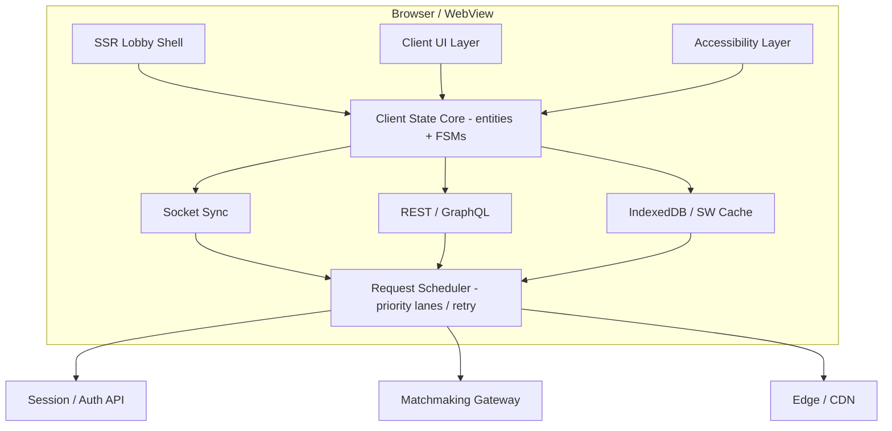

## Problem Statement

A multiplayer game lobby and matchmaking client is the control plane for the entire
pre-match experience.
Fortnite turns the lobby into a social surface with cosmetics, parties, and mode
switching.
Valorant makes queue state, ready checks, and agent select feel deterministic under
strict timing.
League of Legends splits champion select, role intent, and match accept into a
high-stakes, stateful workflow.
Discord Activities treats presence, invites, and voice entry as part of the same
real-time graph.

This system is not a generic chat room with a start button.
It is a latency-sensitive, multi-user orchestration surface that must keep party
membership, queue eligibility, region constraints, platform capabilities, voice
entry points, and countdown timers coherent across desktop, mobile, and console
companions.
The frontend owns state projection, reconnect behavior, transport prioritization,
render scheduling, failure handling, and the contracts that make the lobby feel
authoritative even though the backend is the final source of truth.

The scope here is the frontend architecture for lobby, party, queue, match found,
pre-match role or character selection, tournament or custom room modes, and the
real-time synchronization layer that drives them.
We cover rendering strategy, state management, caching, WebSocket contracts,
responsive interaction models, accessibility, and abuse prevention at the product
surface.
We do not design ranking algorithms, authoritative game simulation, anti-cheat
kernel drivers, payment systems, or long-term player profile storage internals.

What makes this problem architecturally interesting is that the UI is both
transactional and social.
A party invite is a user-to-user workflow with abuse risk.
A matchmaking queue is a distributed progress indicator with unreliable ETA.
A match accept modal is a deadline-bound consensus protocol.
Character select is a collaborative lock manager with visible contention.
Every one of those flows has different correctness, freshness, and failure
tolerance requirements, yet the player experiences them as one continuous product.

The strongest production references are visible and specific.
Fortnite demonstrates a lobby as a sticky social home screen.
Valorant demonstrates strict ready-check and role-select timing with minimal UI
ambiguity.
League demonstrates the psychological importance of visible draft order,
role/character contention, and reconnect continuity.
Discord demonstrates that voice, presence, and invite surfaces must feel native to
the party flow rather than bolted on.
The architectural bar is not just correctness; it is correctness under pressure,
because the user only notices this product when they are waiting, coordinating, or
about to lose a match slot.

<Callout>
  **Staff-level framing:** the lobby is not one screen. It is a finite-state
  machine that spans party discovery, queue entry, match allocation, ready
  consensus, and pre-match commitment. The frontend architecture must model
  those transitions explicitly, or edge cases like reconnect, auto-fill, partial
  declines, and tournament room ownership become impossible to reason about.
</Callout>

---

## Requirements Exploration

### Functional Requirements

1. Players can create, join, leave, and transfer ownership of a party with a
   maximum size defined by game mode, platform policy, and tournament rules.
2. Players can send, receive, mute, rate-limit, and dismiss party invites from
   friend list entries, recent teammates, or join codes.
3. Players can inspect party readiness, connection quality, platform type, current
   playlist eligibility, and region selection before entering queue.
4. Players can select preferred region manually or accept an automatically
   recommended region based on latency, packet loss, and party geographic spread.
5. Players can enter matchmaking for ranked, unranked, custom room, and
   tournament-specific modes with eligibility checks resolved before queue start.
6. The queue UI shows party composition, queue state, wait milestones, and an
   estimated wait time that updates in near real time without reflow jitter.
7. The lobby shows live roster updates, including join, leave, reconnect,
   disconnect, ready, unready, role preference, and voice participation changes.
8. Players receive a match found prompt with accept or decline actions, timeout
   countdown, and visible per-party acceptance state.
9. The system supports auto-fill or backfill when a player declines or times out,
   with transparent messaging about whether the remaining party stays in queue,
   requeues immediately, or is returned to lobby.
10. The pre-match experience supports role preference and character or hero
    selection, lock-in, hover preview, ban phases when applicable, and
    conflict-resolution messaging when multiple players target the same slot.
11. Players can resume lobby state after transient disconnects without losing party
    membership, queue ticket, or selection context when the reconnect window is
    still valid.
12. The product exposes voice chat entry points from lobby and pre-match screens,
    including join voice, mute self, push-to-talk state, and device health.
13. Friend list presence includes joinable state, current activity, party privacy,
    and cross-platform constraints so users understand why an invite may fail.
14. Custom room hosts can configure private matches with join code, spectator
    allowances, team caps, and role-lock settings.
15. Tournament mode can display bracket context, check-in deadlines, room assignment,
    and ready-state enforcement for captains and roster members.
16. The system supports desktop mouse/keyboard, mobile touch, and console controller
    navigation with equivalent capabilities and explicit focus behavior.
17. The lobby surface prevents invite spam, repeated join-code brute force,
    repeated ready-toggle griefing, and abusive custom room ownership transfers.
18. The UI surfaces latency distribution, server region rationale, and degraded
    network warnings before the player confirms queue entry.

### Non-Functional Requirements

| Category             | Requirement                                                                      | Target                                     |
| -------------------- | -------------------------------------------------------------------------------- | ------------------------------------------ |
| Availability         | Lobby and queue surfaces remain usable during a single WebSocket reconnect cycle | 99.95% monthly client-visible availability |
| Real-time latency    | Presence and ready-state updates visible to party members                        | < 250ms p95                                |
| Queue timer accuracy | Client countdown drift relative to server authority                              | < 150ms over 30s window                    |
| Match accept latency | Accept action acknowledgement visible                                            | < 200ms p95                                |
| Initial render       | Authenticated lobby shell interactive on mid-range mobile over 4G                | < 2.5s                                     |
| Input responsiveness | Queue button, ready toggle, role select, and lock-in interactions                | < 100ms INP p75                            |
| Memory               | Active lobby tab memory on desktop                                               | < 180MB                                    |
| Memory               | Active lobby tab memory on mobile webview                                        | < 120MB                                    |
| Network              | Idle lobby bandwidth with presence, heartbeats, and ETA deltas                   | < 12KB/s                                   |
| Network              | Active party lobby with roster churn and voice status                            | < 40KB/s                                   |
| Scale                | Simultaneous users supported by one frontend release train                       | 5M peak concurrent globally                |
| Queue scale          | Simultaneous queued players represented accurately                               | 1.5M concurrent queue tickets              |
| Reconnect            | Resume after network flap without full state rebuild                             | < 3s p90                                   |
| Accessibility        | Compliance target                                                                | WCAG 2.2 AA                                |
| Controller           | All core lobby flows controller-complete                                         | 100% of primary flows                      |
| Abuse prevention     | Invite fan-out per user                                                          | max 20 invites / 10 min                    |
| Abuse prevention     | Join code guesses per IP/device fingerprint                                      | max 10 / min before challenge              |
| Observability        | End-to-end correlation coverage for queue and match-found flows                  | 100% sampled for critical paths            |
| Rendering            | No dropped frames during 10-member roster churn animation on desktop             | 60fps target                               |
| Rendering            | No dropped frames during 6-member roster churn animation on mobile               | 45fps minimum                              |
| Storage              | Durable cached party and queue session metadata                                  | 15MB IndexedDB budget                      |
| Internationalization | Full RTL layout support including controller hints                               | required                                   |

The numbers are intentionally strict because pre-match friction has visible revenue
and retention impact.
If players trust the lobby less than they trust the game server, they stop grouping,
stop queueing, and stop converting socially acquired users into recurring teams.

---

## Capacity Estimation & Constraints

Assume a global live-service game with the following load profile.

| Metric                              | Value | Why It Matters To Frontend                                        |
| ----------------------------------- | ----- | ----------------------------------------------------------------- |
| Monthly active players              | 40M   | Drives long-tail friend graph and presence fan-out                |
| Daily active players                | 12M   | Sets steady-state device mix and asset warm rate                  |
| Peak concurrent players             | 5M    | Determines socket fleet expectations and reconnect storm planning |
| Players in lobby state at peak      | 2.8M  | Dominates presence, invite, and party state traffic               |
| Players in matchmaking at peak      | 1.5M  | Drives queue ETA and match-found event volume                     |
| Average party size                  | 2.3   | Determines roster panel cardinality and social graph exposure     |
| Ranked queue share                  | 35%   | Drives strict ready-check and role-select complexity              |
| Custom room share                   | 8%    | Adds high-cardinality room lists and host controls                |
| Tournament mode share during events | 4%    | Requires deterministic scheduling and check-in timers             |
| Mobile companion share              | 18%   | Forces responsive compression and partial capability support      |
| Console-linked accounts             | 46%   | Requires controller navigation parity and platform gating         |

### Queue Event Volume

Assume 1.5M players are queued at peak.
Average queue session length across all modes is 110 seconds.

```text
Queue entries per second = 1,500,000 / 110 ≈ 13,636
Queue exits per second = 13,636
Match-found prompts per second = 13,636 / average match size factor

If the weighted average match consumes 8 players:
Match allocations per second ≈ 1,704
Ready-check prompts per second ≈ 1,704 match groups
Per-player prompt events per second ≈ 13,632
```

The frontend is not rendering all of that globally.
It renders per-session slices.
But these numbers drive transport and API shape decisions because the system cannot
depend on heavyweight polling.
Polling every 3 seconds would explode fan-out and create visible jitter in ETA,
accept windows, and party status.

### Party Presence Volume

Each active lobby session emits presence heartbeats, voice state changes, and UI
state deltas.

```text
Presence heartbeat interval = 10s
Ready-state or roster deltas per active party per minute = 6 average
Voice state deltas per active party per minute = 4 average

For 1.2M active parties at peak:
Heartbeats/sec = 1,200,000 / 10 = 120,000
Roster deltas/sec = 1,200,000 × 6 / 60 = 120,000
Voice deltas/sec = 1,200,000 × 4 / 60 = 80,000
Total realtime events/sec at party layer ≈ 320,000
```

The UI architecture therefore separates event classes.
Roster and queue authority flow on a reliable ordered channel.
Voice indicators and typing-like ephemeral affordances flow on a lighter,
droppable channel.

### Payload Estimation

Representative payload sizes are small but frequent.

| Payload                         | Approximate Size | Notes                                                |
| ------------------------------- | ---------------- | ---------------------------------------------------- |
| Party snapshot for 5 members    | 2.2KB            | Includes member summaries, readiness, party config   |
| Queue state delta               | 320B             | Ticket id, status, ETA band, timestamp               |
| Match found prompt              | 480B             | Match id, expiry, accept requirement, region         |
| Ready state update              | 140B             | Member id, boolean, monotonic version                |
| Region recommendation set       | 1.1KB            | 6 regions with ping, jitter, confidence, explanation |
| Role preference delta           | 260B             | Member role intents and timestamp                    |
| Character hover event           | 180B             | Hovered character id, slot, expiresAt                |
| Character lock-in event         | 260B             | Selected id, lock timestamp, conflict metadata       |
| Invite event                    | 300B             | Sender, recipient, party id, expiresAt, policy flags |
| Reconnect resume token envelope | 420B             | Signed session token and resume hints                |

Idle lobby bandwidth target remains under 12KB/s.
That budget forces compact envelopes, delta updates, and timer derivation from a
server timestamp rather than per-second tick broadcasts.

### Client Memory Budget

The lobby is graph-heavy rather than media-heavy.
The memory budget is dominated by normalized entity stores, friend presence, and
cached configuration assets.

```text
Friend summaries in memory (400 visible/likely contacts × 320B) ≈ 128KB
Presence overlays and indexes ≈ 180KB
Current party + queue ticket + room config ≈ 40KB
Recent invite history (200 items × 220B) ≈ 44KB
Region performance history (20 samples × 6 regions × 64B) ≈ 7.5KB
Role / character catalog metadata (150 heroes × 1.2KB) ≈ 180KB
Selection art thumbnails for visible roster ≈ 6MB desktop, 2MB mobile
Animation caches and icon atlases ≈ 8MB
React tree + runtime + store overhead ≈ 40MB to 70MB
Voice SDK surface if embedded ≈ 18MB to 35MB
```

Desktop can tolerate up to 180MB.
Mobile webview cannot.
That means the system must treat voice SDK embedding, large hero art, and animated
cosmetic previews as optional capability tiers rather than guaranteed features.

### Offline and Storage Budget

Only a thin durable state layer is worth persisting.
Persisting friend graph snapshots or volatile presence causes coherence bugs.

| Storage Item                  | Budget | TTL                            | Reason                                        |
| ----------------------------- | ------ | ------------------------------ | --------------------------------------------- |
| Last known party membership   | 25KB   | 15 min                         | Supports quick resume after app restart       |
| Queue resume token            | 4KB    | server-defined, usually 3 min  | Allows reconnect without full recovery flow   |
| Region latency history        | 40KB   | 24 h                           | Improves region recommendation warm start     |
| Character catalog metadata    | 2MB    | 24 h                           | Avoids blocking pre-match select on cold boot |
| Custom room list cache        | 1MB    | 30 s                           | Supports refresh during transient API loss    |
| Tournament schedule fragments | 512KB  | event window                   | Enables bracket view during brief outages     |
| Error and trace outbox        | 2MB    | until upload success or 7 days | Preserves critical telemetry                  |

### Constraints That Directly Shape The Design

1. ETA must be model-based and delta-updated.
   A server push every second for 1.5M players is wasteful and unnecessary.
2. Match accept windows must be server-authored but client-rendered from timestamps.
   Pushing countdown ticks is the wrong transport model.
3. Reconnect must be resumable because mobile networks flap constantly.
   Any design that requires full snapshot rebuild for every flap will create false
   queue exits and trust erosion.
4. Friend list and custom room browsing must be virtualized.
   High-cardinality social lists appear small visually but explode DOM cost.
5. Voice integration must degrade cleanly.
   A webview or low-memory phone cannot pay the same cost as desktop.
6. Abuse prevention must happen at the UI contract boundary.
   If invite spam is only a backend concern, the frontend still renders a hostile
   user experience and leaks targeting surfaces.

<Callout>
  **Principal-level constraint:** reconnect storms are the real scale test. A
  new season launch, regional ISP flap, or console platform outage creates a
  synchronized reconnect burst. The client must jitter resume attempts, reuse
  cached capability data, and prefer delta recovery over full hydration or the
  frontend itself becomes the thundering herd multiplier.
</Callout>

---

## Architecture / High-Level Design

### Rendering Strategy

Use a hybrid model: streaming SSR for the authenticated shell and CSR islands for
all real-time and controller-sensitive surfaces.

The shell includes navigation chrome, the active party scaffold, skeleton regions,
cached account identity, and the most recent stable queue or room status persisted
from the prior session.
This yields predictable LCP on web and companion mobile without waiting for the
socket handshake.
All live modules then hydrate as client components.

Why not pure CSR?
Because a cold boot that shows a blank page until auth refresh and socket connect
finishes feels broken even if the total time is acceptable.
The shell must paint immediately so the player understands which account is active,
which party is being resumed, and which controls are available.

Why not fully SSR the lobby state?
Because party state, queue status, and accept windows can change during the server
render itself.
SSR can seed the page with the last committed snapshot and capability flags, but
live authority must come from the session socket.

Rendering policy by surface:

| Surface                      | Strategy                               | Reason                                     |
| ---------------------------- | -------------------------------------- | ------------------------------------------ |
| App shell and navigation     | Streaming SSR                          | Stable chrome, fast first paint            |
| Friend list and party roster | Client island                          | Real-time updates and controller focus     |
| Queue card and ETA           | Client island with persisted warm data | Timestamp-driven countdown and live deltas |
| Match found modal            | Client-only, high priority portal      | Cannot depend on route-level render timing |
| Character select grid        | Client-only with preloaded catalog     | Heavy interaction and optimistic preview   |
| Tournament bracket preview   | SSR + client refresh                   | Mostly read-heavy, bursts during events    |
| Custom room browser          | SSR first page + client pagination     | Fast discovery plus live updates           |

### Navigation Model

Use a persistent SPA shell with URL-addressable substates.
The URL is part of the state contract because players deep-link into invites,
custom rooms, tournament lobbies, and reconnect flows from notifications,
platform overlays, and Discord activity links.

Representative routes:

```text
/lobby
/lobby?party=pt_123
/lobby/queue/ranked?mode=duo&region=use1
/lobby/match-found?ticket=qt_789
/lobby/select?match=mf_456
/lobby/custom-room/cr_001
/lobby/tournament/trn_2026_qualifier/check-in
```

URL state rules are strict.

1. Resource identity goes in the path or canonical query.
2. Focus and ephemeral overlays stay out of the URL.
3. Recoverable transactional state, like a queue ticket or match token, is mirrored
   in a signed resume token rather than exposed as writable URL-only state.
4. Controller focus order survives route transitions through a focus registry keyed
   by route id and component slot.

### System Architecture Diagram ASCII



The transport layer has two logical channels multiplexed over one physical socket.

1. Ordered authoritative channel:
   party snapshots, queue deltas, match prompts, lock-ins, room ownership changes.
2. Ephemeral channel:
   hover previews, voice speaking indicators, soft countdown hints, non-critical
   ETA confidence updates.

That distinction keeps the state machine deterministic without overpaying for
messages whose value expires in under a second.

### Component Architecture

```text
<LobbyShell>
├── <TopNav />
├── <PartyWorkspace>
│   ├── <PartyHeader />
│   ├── <PartyRosterList>
│   │   ├── <PartyMemberCard />
│   │   │   ├── <PlayerIdentity />
│   │   │   ├── <PresenceChip />
│   │   │   ├── <ReadyToggle />
│   │   │   ├── <LatencyBadge />
│   │   │   └── <VoiceEntryButton />
│   ├── <InviteComposer />
│   ├── <FriendListRail />
│   └── <PartySettingsPanel />
├── <QueueWorkspace>
│   ├── <ModeSelector />
│   ├── <RegionSelector />
│   ├── <EstimatedWaitCard />
│   ├── <QueueEligibilitySummary />
│   └── <QueueActionBar />
├── <LobbyAuxRail>
│   ├── <RecentInvitesPanel />
│   ├── <ActivityFeedLite />
│   └── <TournamentOrRoomContext />
├── <MatchFoundPortal />
├── <CharacterSelectPortal />
└── <GlobalLiveAnnouncer />
```

Ownership boundaries are deliberate.

| Component Boundary    | Owns                                                      | Does Not Own                 |
| --------------------- | --------------------------------------------------------- | ---------------------------- |
| LobbyShell            | route layout, focus restoration, bootstrap lifecycle      | party state mutation logic   |
| PartyWorkspace        | party-scoped derived selectors, roster presentation       | matchmaking ticket authority |
| QueueWorkspace        | queue form state, region recommendation UI                | party membership mutation    |
| MatchFoundPortal      | accept/decline interaction state, local countdown visuals | party roster persistence     |
| CharacterSelectPortal | hover state, local preview panel, lock-in CTA cooldown    | authoritative draft order    |
| GlobalLiveAnnouncer   | aria-live text, telemetry breadcrumbing                   | actual domain transitions    |

Desktop layout uses a three-column composition.
Console collapses auxiliary rail into a bumpable panel to preserve controller focus.
Mobile companion uses a stacked card model with a bottom-sheet portal for match
found and selection steps, because full desktop parity is not a realistic input
model for touch under narrow widths.

### State Management Strategy

The frontend uses four state domains.

1. Authoritative server state mirrored locally.
2. Ephemeral collaborative state.
3. Durable client resume state.
4. View-local interaction state.

The server-mirrored domain is normalized and versioned.
Every authoritative entity carries a monotonic version or server timestamp.
Reducers reject stale deltas, and selectors derive UI from the latest committed
snapshot plus optimistic overlays.

The ephemeral collaborative domain contains hover state, live voice indicators,
soft ETA confidence text, and transient network quality hints.
This data expires aggressively and is never persisted.

The durable client domain stores queue resume tokens, the last stable route,
capability flags, recent region measurements, and cached catalog metadata.
This lives in IndexedDB with schema-versioned TTL policies.

The view-local interaction domain contains focused friend row, locally open sheets,
scroll positions, controller graph cursor, and last inspected region explanation.
This lives in component state or a lightweight UI store.

Core finite-state machines:

| Machine             | States                                                             | Why Explicit FSM Matters                                              |
| ------------------- | ------------------------------------------------------------------ | --------------------------------------------------------------------- |
| Party machine       | idle, assembling, eligible, queueing, locked, disbanding           | Prevents impossible transitions like invite during locked match-found |
| Queue machine       | idle, eligibility-check, queued, backfilling, suspending, canceled | Encodes requeue and auto-fill behavior cleanly                        |
| Match-found machine | pending, accepted, declined, expired, replaced                     | Required for timeout and party consensus                              |
| Selection machine   | loading, hovering, locking, locked, conflicted, completed          | Separates local preview from authoritative lock-in                    |
| Reconnect machine   | online, degraded, reconnecting, resuming, restored, failed         | Drives user messaging and retry policy                                |

```ts
type LobbyRoute =
  | { kind: "home" }
  | { kind: "queue"; ticketId?: QueueTicketId }
  | { kind: "matchFound"; ticketId: QueueTicketId; attemptId: MatchAttemptId }
  | { kind: "selection"; matchId: MatchId }
  | { kind: "customRoom"; roomId: CustomRoomId }
  | { kind: "tournament"; tournamentId: TournamentId; phase: TournamentPhase };

interface ResumeEnvelope {
  sessionId: LobbySessionId;
  route: LobbyRoute;
  issuedAtMs: number;
  expiresAtMs: number;
  snapshotVersionHint: number;
}
```

The store does not derive countdowns from local intervals alone.
It stores authoritative timestamps and a clock offset estimate.
Views derive time remaining from `serverNow + offset` so all timers stay aligned
without flooding the render loop with external tick events.

<Callout>
  **Important architectural boundary:** never let the React tree become the
  source of truth for lobby transitions. React state is a projection layer.
  Queue, match-found, and draft state must live in deterministic reducers or
  state machines that can replay socket events, persist checkpoints, and survive
  route re-mounts.
</Callout>

---

## Data Model / Entities

The client store is normalized because the same player, party, queue ticket, and
match attempt surface appears in multiple panes simultaneously.
Without normalization, the app duplicates stale player summaries across party,
friend list, invite toasts, and draft panels, creating inconsistent identity and
latency rendering.

### Core TypeScript Types

```ts
type Brand<TValue, TName extends string> = TValue & { readonly __brand: TName };

type PlayerId = Brand<string, "PlayerId">;
type PartyId = Brand<string, "PartyId">;
type QueueTicketId = Brand<string, "QueueTicketId">;
type MatchId = Brand<string, "MatchId">;
type MatchAttemptId = Brand<string, "MatchAttemptId">;
type InviteId = Brand<string, "InviteId">;
type VoiceSessionId = Brand<string, "VoiceSessionId">;
type TournamentId = Brand<string, "TournamentId">;
type CustomRoomId = Brand<string, "CustomRoomId">;
type LobbySessionId = Brand<string, "LobbySessionId">;
type RegionCode = Brand<string, "RegionCode">;
type CharacterId = Brand<string, "CharacterId">;
type RoleId = Brand<string, "RoleId">;

type PlatformKind =
  | "pc"
  | "xbox"
  | "playstation"
  | "switch"
  | "mobile"
  | "cloud";

type PresenceKind =
  | "offline"
  | "online"
  | "in_lobby"
  | "in_queue"
  | "in_match"
  | "do_not_disturb";

type PartyPrivacy = "public" | "friends_only" | "invite_only" | "hidden";

type QueueKind =
  | "ranked"
  | "unranked"
  | "arcade"
  | "custom_room"
  | "tournament";

type QueueStatus =
  | "idle"
  | "checking_eligibility"
  | "queued"
  | "match_found"
  | "accepted"
  | "backfilling"
  | "canceled"
  | "expired";

type MatchAcceptStatus =
  | "pending"
  | "accepted"
  | "declined"
  | "timed_out"
  | "auto_filled";

type TournamentPhase =
  | "check_in"
  | "seeding"
  | "waiting_room"
  | "live"
  | "completed";

type RoomRole = "host" | "captain" | "member" | "spectator";

interface PlayerIdentity {
  id: PlayerId;
  handle: string;
  displayName: string;
  avatarUrl: string;
  platform: PlatformKind;
  level: number;
  rankedTier?: string;
  mutedByViewer: boolean;
  blockedByViewer: boolean;
  crossPlayAllowed: boolean;
}

interface PresenceSnapshot {
  playerId: PlayerId;
  presence: PresenceKind;
  currentActivityLabel: string | null;
  partyId: PartyId | null;
  joinable: boolean;
  joinBlockReason:
    | "none"
    | "privacy"
    | "platform_mismatch"
    | "full_party"
    | "rank_gap"
    | "ineligible_mode";
  lastHeartbeatAtMs: number;
  lastInteractionAtMs: number;
}

interface RegionMeasurement {
  region: RegionCode;
  latencyMs: number;
  jitterMs: number;
  packetLossPct: number;
  confidence: "high" | "medium" | "low";
  sampledAtMs: number;
}

interface RegionRecommendation {
  recommendedRegion: RegionCode;
  rationale:
    | "lowest_latency"
    | "party_compromise"
    | "capacity_balancing"
    | "tournament_assignment";
  measurements: RegionMeasurement[];
  shouldAutoApply: boolean;
  maxPartyLatencyMs: number;
}

interface PartyMemberState {
  playerId: PlayerId;
  roleInParty: RoomRole;
  isLeader: boolean;
  isReady: boolean;
  isConnected: boolean;
  isVoiceConnected: boolean;
  isSpeaking: boolean;
  selectedRoleIds: RoleId[];
  selectedCharacterId: CharacterId | null;
  hoverCharacterId: CharacterId | null;
  preferredRegion: RegionCode | null;
  loadoutLabel: string | null;
  joinedAtMs: number;
  version: number;
}

interface PartySettings {
  partyId: PartyId;
  privacy: PartyPrivacy;
  maxSize: number;
  crossPlayRequired: boolean;
  voiceAutoJoin: boolean;
  joinCodeEnabled: boolean;
  joinCode: string | null;
  selectedQueueKind: QueueKind | null;
  selectedPlaylistId: string | null;
  selectedRegion: RegionCode | null;
  regionRecommendation: RegionRecommendation | null;
  eligibilityWarnings: PartyEligibilityWarning[];
  version: number;
}

type PartyEligibilityWarning =
  | {
      kind: "rank_gap";
      minTier: string;
      maxTier: string;
      affectedPlayerIds: PlayerId[];
    }
  | {
      kind: "cross_play_block";
      affectedPlayerIds: PlayerId[];
      blockedPlatform: PlatformKind;
    }
  | {
      kind: "region_quality";
      affectedPlayerIds: PlayerId[];
      thresholdMs: number;
    }
  | {
      kind: "tournament_roster_mismatch";
      requiredRosterIds: PlayerId[];
      presentRosterIds: PlayerId[];
    };

interface PartySnapshot {
  id: PartyId;
  leaderPlayerId: PlayerId;
  memberIds: PlayerId[];
  settings: PartySettings;
  queueTicketId: QueueTicketId | null;
  voiceSessionId: VoiceSessionId | null;
  updatedAtMs: number;
  version: number;
}

interface QueueTicket {
  id: QueueTicketId;
  partyId: PartyId;
  queueKind: QueueKind;
  playlistId: string;
  region: RegionCode;
  status: QueueStatus;
  enteredAtMs: number;
  estimatedWaitLowerMs: number;
  estimatedWaitUpperMs: number;
  confidence: "high" | "medium" | "low";
  matchAttemptId: MatchAttemptId | null;
  requeueEligible: boolean;
  autoFillEnabled: boolean;
  resumeToken: string | null;
  version: number;
}

interface MatchAttempt {
  id: MatchAttemptId;
  queueTicketId: QueueTicketId;
  matchId: MatchId | null;
  region: RegionCode;
  requiresFullPartyAccept: boolean;
  acceptDeadlineAtMs: number;
  memberStatuses: Record<PlayerId, MatchAcceptStatus>;
  replacementWindowEndsAtMs: number | null;
  createdAtMs: number;
  version: number;
}

interface CharacterDefinition {
  id: CharacterId;
  name: string;
  portraitUrl: string;
  roleIds: RoleId[];
  difficulty: "easy" | "medium" | "hard";
  disabledQueueKinds: QueueKind[];
  disabledReason: string | null;
}

interface RoleDefinition {
  id: RoleId;
  name: string;
  shortLabel: string;
  description: string;
  queueKinds: QueueKind[];
}

interface SelectionSlot {
  playerId: PlayerId;
  draftOrder: number;
  declaredRoleIds: RoleId[];
  hoveredCharacterId: CharacterId | null;
  lockedCharacterId: CharacterId | null;
  lockDeadlineAtMs: number;
  state: "waiting" | "hovering" | "locked" | "timed_out";
  version: number;
}

interface PreMatchSelectionState {
  matchId: MatchId;
  phase:
    | "role_intent"
    | "ban_phase"
    | "pick_phase"
    | "final_review"
    | "complete";
  viewerPlayerId: PlayerId;
  slots: SelectionSlot[];
  roleCatalog: RoleDefinition[];
  characterCatalogVersion: string;
  phaseStartedAtMs: number;
  phaseEndsAtMs: number;
  version: number;
}

interface InviteEnvelope {
  id: InviteId;
  senderId: PlayerId;
  recipientId: PlayerId;
  partyId: PartyId;
  sentAtMs: number;
  expiresAtMs: number;
  canDeepLink: boolean;
  source: "friend_list" | "recent_teammate" | "join_code" | "platform_overlay";
  status: "pending" | "accepted" | "declined" | "expired" | "canceled";
}

interface VoiceSessionState {
  id: VoiceSessionId;
  partyId: PartyId;
  provider: "discord" | "native_voip" | "platform_party";
  joinUrl: string | null;
  deviceHealth:
    | "unknown"
    | "healthy"
    | "no_mic_permission"
    | "input_missing"
    | "output_missing";
  connectedMemberIds: PlayerId[];
  speakingMemberIds: PlayerId[];
  version: number;
}

interface CustomRoomSettings {
  id: CustomRoomId;
  hostPlayerId: PlayerId;
  roomName: string;
  joinCode: string;
  privacy: PartyPrivacy;
  mapId: string;
  maxPlayers: number;
  teamCount: number;
  allowSpectators: boolean;
  allowRoleLock: boolean;
  region: RegionCode;
  rosterPlayerIds: PlayerId[];
  spectatorIds: PlayerId[];
  updatedAtMs: number;
  version: number;
}

interface TournamentLobbyState {
  tournamentId: TournamentId;
  phase: TournamentPhase;
  teamCaptainId: PlayerId;
  rosterPlayerIds: PlayerId[];
  assignedRoomId: CustomRoomId | null;
  assignedRegion: RegionCode | null;
  checkInDeadlineAtMs: number | null;
  nextMatchStartAtMs: number | null;
  bracketLabel: string;
  seed: number | null;
  version: number;
}

interface ReconnectSessionState {
  sessionId: LobbySessionId;
  socketGeneration: number;
  status: "online" | "degraded" | "reconnecting" | "resuming" | "failed";
  retryCount: number;
  nextRetryAtMs: number | null;
  lastStableSnapshotAtMs: number | null;
  resumeToken: string | null;
}

interface AbuseGuardState {
  recentInviteCount: number;
  inviteWindowStartedAtMs: number;
  recentJoinCodeAttempts: number;
  joinCodeWindowStartedAtMs: number;
  readyToggleCount: number;
  readyToggleWindowStartedAtMs: number;
  wasRateLimited: boolean;
}
```

### Normalized Store Shape

```ts
interface LobbyEntityStore {
  playersById: Record<PlayerId, PlayerIdentity>;
  presencesByPlayerId: Record<PlayerId, PresenceSnapshot>;
  partyMembersByPlayerId: Record<PlayerId, PartyMemberState>;
  partiesById: Record<PartyId, PartySnapshot>;
  queueTicketsById: Record<QueueTicketId, QueueTicket>;
  matchAttemptsById: Record<MatchAttemptId, MatchAttempt>;
  selectionByMatchId: Record<MatchId, PreMatchSelectionState>;
  invitesById: Record<InviteId, InviteEnvelope>;
  voiceSessionsById: Record<VoiceSessionId, VoiceSessionState>;
  customRoomsById: Record<CustomRoomId, CustomRoomSettings>;
  tournamentsById: Record<TournamentId, TournamentLobbyState>;
  charactersById: Record<CharacterId, CharacterDefinition>;
  rolesById: Record<RoleId, RoleDefinition>;
}

interface LobbyIndexes {
  friendIdsSorted: PlayerId[];
  joinableFriendIds: PlayerId[];
  pendingInviteIdsByRecipient: Record<PlayerId, InviteId[]>;
  roomIdsByRegion: Record<RegionCode, CustomRoomId[]>;
  playerIdsByPartyId: Record<PartyId, PlayerId[]>;
  queueTicketIdByPartyId: Record<PartyId, QueueTicketId | undefined>;
  matchAttemptIdByTicketId: Record<QueueTicketId, MatchAttemptId | undefined>;
}

interface LobbyRootState {
  entities: LobbyEntityStore;
  indexes: LobbyIndexes;
  reconnect: ReconnectSessionState;
  route: LobbyRoute;
  activePartyId: PartyId | null;
  activeTicketId: QueueTicketId | null;
  activeMatchId: MatchId | null;
  abuseGuard: AbuseGuardState;
}
```

### UI State Types

```ts
interface FriendListUiState {
  query: string;
  selectedPlayerId: PlayerId | null;
  activeFilter: "all" | "joinable" | "partyable" | "voice_ready";
  scrollOffset: number;
}

interface QueueUiState {
  regionPopoverOpen: boolean;
  eligibilityDrawerOpen: boolean;
  selectedRegionOverride: RegionCode | null;
  displayedEtaBandMs: { lower: number; upper: number } | null;
  queueToastSuppressedUntilMs: number | null;
}

interface MatchFoundUiState {
  modalOpen: boolean;
  localAcceptedAtMs: number | null;
  localDeclinedAtMs: number | null;
  pulseAnimationEnabled: boolean;
  lastAnnouncementText: string | null;
}

interface CharacterSelectUiState {
  highlightedCharacterId: CharacterId | null;
  comparisonDrawerOpen: boolean;
  roleFilterIds: RoleId[];
  portraitDensity: "compact" | "comfortable";
  localHoverPreviewAtMs: number | null;
}

interface AccessibilityUiState {
  focusPath: string[];
  controllerFocusNodeId: string | null;
  reducedMotion: boolean;
  prefersHighContrast: boolean;
  lastLiveRegionText: string | null;
}
```

### Pending Mutation Types

```ts
interface PendingInviteMutation {
  mutationId: string;
  inviteId: InviteId;
  action: "send" | "cancel" | "accept" | "decline";
  createdAtMs: number;
  idempotencyKey: string;
}

interface PendingReadyMutation {
  mutationId: string;
  partyId: PartyId;
  playerId: PlayerId;
  nextReadyState: boolean;
  createdAtMs: number;
  optimisticVersion: number;
}

interface PendingSelectionMutation {
  mutationId: string;
  matchId: MatchId;
  playerId: PlayerId;
  characterId: CharacterId;
  action: "hover" | "lock";
  createdAtMs: number;
  idempotencyKey: string;
}
```

### Field Rationale

| Field                                           | Why It Exists                                                                            |
| ----------------------------------------------- | ---------------------------------------------------------------------------------------- |
| `version` on authoritative entities             | Allows stale delta rejection during reconnect and out-of-order delivery                  |
| `joinBlockReason`                               | The UI must explain why an invite or join action fails instead of silently disabling it  |
| `replacementWindowEndsAtMs`                     | The match-found flow needs explicit messaging for auto-fill or requeue behavior          |
| `characterCatalogVersion`                       | Enables stale catalog invalidation when balance patches disable characters               |
| `mutedByViewer` and `blockedByViewer`           | Abuse controls are viewer-specific and must not leak globally persisted state            |
| `selectedRegionOverride` in UI state            | Keeps tentative region exploration local until the player confirms                       |
| `resumeToken` in both queue and reconnect state | Resume belongs to session lifecycle, but queue UI also needs direct awareness            |
| `pulseAnimationEnabled`                         | Motion must be user-preference aware and switchable without branching in rendering logic |

### Notably Absent Fields

1. Raw MMR is absent.
   The client should not receive exploitable ranking internals.
   It only receives eligibility outcomes or coarse tier labels needed for UI.
2. Full friend graph history is absent.
   The lobby needs current presence and a recent interaction slice, not a social
   network archive.
3. Voice transcript data is absent.
   The lobby only needs voice presence and entry points, not voice content.
4. Server-side queue placement heuristics are absent.
   The client receives ETA bands and confidence, not ranking or pool composition
   internals that players could reverse-engineer.

---

## Interface Definition (API)

The contract uses REST for bootstrap and explicit mutations, and WebSocket for all
stateful live updates.
The client never polls queue or party state while the socket is healthy.

### Endpoint Catalog

| Method   | Path                                       | Purpose                                                          | Cache / Idempotency                                              |
| -------- | ------------------------------------------ | ---------------------------------------------------------------- | ---------------------------------------------------------------- |
| `GET`    | `/api/lobby/bootstrap`                     | Fetch account, active party, capability flags, last stable route | `private, max-age=0, must-revalidate`                            |
| `POST`   | `/api/parties`                             | Create party                                                     | idempotency key required                                         |
| `POST`   | `/api/parties/{partyId}/invites`           | Send invite                                                      | idempotency key + invite rate limit                              |
| `POST`   | `/api/parties/{partyId}/join-code/resolve` | Resolve join code                                                | no-store, abuse-scored                                           |
| `PATCH`  | `/api/parties/{partyId}/settings`          | Change privacy, region, mode, queue kind                         | optimistic write with version precondition                       |
| `POST`   | `/api/queue/eligibility-check`             | Validate roster for queue                                        | `no-store`                                                       |
| `POST`   | `/api/queue/tickets`                       | Enter queue                                                      | idempotency key required                                         |
| `DELETE` | `/api/queue/tickets/{ticketId}`            | Leave queue                                                      | idempotency key accepted                                         |
| `POST`   | `/api/matches/{attemptId}/accept`          | Accept or decline match prompt                                   | idempotency key required                                         |
| `GET`    | `/api/catalog/characters`                  | Fetch character metadata for select                              | `public, max-age=60, s-maxage=300, stale-while-revalidate=86400` |
| `POST`   | `/api/matches/{matchId}/selection/lock`    | Lock character                                                   | idempotency key + version precondition                           |
| `GET`    | `/api/custom-rooms`                        | Browse custom rooms                                              | `private, max-age=0, s-maxage=10, stale-while-revalidate=20`     |
| `POST`   | `/api/custom-rooms`                        | Create private room                                              | idempotency key required                                         |
| `GET`    | `/api/tournaments/{tournamentId}/lobby`    | Fetch tournament lobby state                                     | `private, max-age=0, must-revalidate`                            |
| `POST`   | `/api/voice/sessions`                      | Create or join voice entry                                       | idempotency key required                                         |

### Bootstrap Response

```ts
interface LobbyBootstrapResponse {
  sessionId: LobbySessionId;
  viewer: PlayerIdentity;
  activeParty: PartySnapshot | null;
  activeQueueTicket: QueueTicket | null;
  reconnect: ReconnectSessionState;
  recentInvites: InviteEnvelope[];
  regionRecommendation: RegionRecommendation;
  featureFlags: {
    embeddedVoiceEnabled: boolean;
    tournamentModeEnabled: boolean;
    customRoomsEnabled: boolean;
    autoFillEnabled: boolean;
  };
  capabilityFlags: {
    controllerMode: boolean;
    voiceJoinSupported: boolean;
    pushNotificationsSupported: boolean;
    canResumeQueue: boolean;
  };
  serverNowMs: number;
}
```

### Queue Eligibility Request / Response

```ts
interface QueueEligibilityRequest {
  partyId: PartyId;
  queueKind: QueueKind;
  playlistId: string;
  regionOverride: RegionCode | null;
}

interface QueueEligibilityResponse {
  partyId: PartyId;
  eligible: boolean;
  effectiveRegion: RegionCode;
  warnings: PartyEligibilityWarning[];
  estimatedWaitLowerMs: number;
  estimatedWaitUpperMs: number;
  confidence: "high" | "medium" | "low";
  expiresAtMs: number;
}
```

The eligibility call is explicit because the UI must show blockers before the
player commits to queue.
It also gives the client a stable baseline for ETA without committing a queue
ticket.

### Create Queue Ticket

```ts
interface CreateQueueTicketRequest {
  partyId: PartyId;
  queueKind: QueueKind;
  playlistId: string;
  region: RegionCode;
  autoFillEnabled: boolean;
  idempotencyKey: string;
  expectedPartyVersion: number;
}

interface CreateQueueTicketResponse {
  ticket: QueueTicket;
  party: PartySnapshot;
  serverNowMs: number;
}
```

### Match Accept Mutation

```ts
interface MatchAcceptRequest {
  attemptId: MatchAttemptId;
  action: "accept" | "decline";
  idempotencyKey: string;
  expectedAttemptVersion: number;
}

interface MatchAcceptResponse {
  attempt: MatchAttempt;
  queueTicket: QueueTicket | null;
  nextRoute:
    | { kind: "selection"; matchId: MatchId }
    | { kind: "queue"; ticketId: QueueTicketId }
    | { kind: "home" };
  serverNowMs: number;
}
```

### Character Lock Mutation

```ts
interface CharacterLockRequest {
  matchId: MatchId;
  characterId: CharacterId;
  slotVersion: number;
  idempotencyKey: string;
}

interface CharacterLockResponse {
  selection: PreMatchSelectionState;
  outcome: "locked" | "conflict" | "phase_closed";
  conflictWithPlayerId?: PlayerId;
  serverNowMs: number;
}
```

### WebSocket Session Contract

The socket starts after bootstrap succeeds.
The client sends a `resume` frame if it has a valid `resumeToken`; otherwise it
performs a fresh subscribe.

```ts
type ClientSocketMessage =
  | {
      type: "session.resume";
      sessionId: LobbySessionId;
      resumeToken: string;
      lastKnownEntityVersions: Record<string, number>;
    }
  | {
      type: "session.subscribe";
      sessionId: LobbySessionId;
      activePartyId: PartyId | null;
      activeQueueTicketId: QueueTicketId | null;
    }
  | {
      type: "party.ready.set";
      partyId: PartyId;
      nextReadyState: boolean;
      idempotencyKey: string;
    }
  | {
      type: "party.region.preview";
      partyId: PartyId;
      region: RegionCode;
    }
  | {
      type: "selection.hover";
      matchId: MatchId;
      characterId: CharacterId;
    }
  | {
      type: "heartbeat";
      sessionId: LobbySessionId;
      sentAtMs: number;
    };

type ServerSocketMessage =
  | {
      type: "session.resumed";
      sessionId: LobbySessionId;
      serverNowMs: number;
      deltaReplayCount: number;
    }
  | {
      type: "party.snapshot";
      party: PartySnapshot;
      members: PartyMemberState[];
      players: PlayerIdentity[];
    }
  | {
      type: "party.member.updated";
      member: PartyMemberState;
      player: PlayerIdentity;
    }
  | {
      type: "party.invite.received";
      invite: InviteEnvelope;
      sender: PlayerIdentity;
    }
  | {
      type: "queue.updated";
      ticket: QueueTicket;
      serverNowMs: number;
    }
  | {
      type: "queue.eta.updated";
      ticketId: QueueTicketId;
      lowerMs: number;
      upperMs: number;
      confidence: "high" | "medium" | "low";
      serverNowMs: number;
    }
  | {
      type: "match.found";
      attempt: MatchAttempt;
      serverNowMs: number;
    }
  | {
      type: "match.accept.updated";
      attemptId: MatchAttemptId;
      playerId: PlayerId;
      status: MatchAcceptStatus;
      version: number;
    }
  | {
      type: "match.replaced";
      attempt: MatchAttempt;
      replacementReason: "decline" | "timeout" | "disconnect";
    }
  | {
      type: "selection.snapshot";
      selection: PreMatchSelectionState;
      characters: CharacterDefinition[];
      roles: RoleDefinition[];
      serverNowMs: number;
    }
  | {
      type: "selection.slot.updated";
      matchId: MatchId;
      slot: SelectionSlot;
      serverNowMs: number;
    }
  | {
      type: "voice.updated";
      voiceSession: VoiceSessionState;
    }
  | {
      type: "tournament.updated";
      state: TournamentLobbyState;
    }
  | {
      type: "customRoom.updated";
      room: CustomRoomSettings;
    }
  | {
      type: "presence.updated";
      snapshot: PresenceSnapshot;
    }
  | {
      type: "error";
      code:
        | "RATE_LIMITED"
        | "STALE_VERSION"
        | "QUEUE_EXPIRED"
        | "REGION_UNAVAILABLE"
        | "TOURNAMENT_CHECKIN_FAILED"
        | "RESUME_REJECTED";
      message: string;
      correlationId: string;
      retryAtMs?: number;
    };
```

### Match Found Flow Diagram

```text
Client A Party      Gateway / Matchmaker        Client B Party        Replacement Pool
      │                     │                        │                       │
      │ queue.updated       │                        │                       │
      │────────────────────>│                        │                       │
      │                     │ build candidate match  │                       │
      │                     │───────────────────────>│                       │
      │                     │                        │                       │
      │ match.found         │                        │ match.found           │
      │<────────────────────│───────────────────────>│                       │
      │                     │                        │                       │
      │ accept              │                        │ timeout               │
      │────────────────────>│                        │                       │
      │                     │ match.accept.updated   │                       │
      │<────────────────────│                        │<──────────────────────│
      │                     │                        │                       │
      │                     │ B timed out            │                       │
      │                     │───────────────────────────────────────────────>│
      │                     │ replacement found      │                       │
      │ match.replaced      │                        │                       │
      │<────────────────────│                        │                       │
      │                     │ new accept window      │                       │
```

### Pagination Strategy

Use cursor pagination for friend list, recent invite history, and custom room
browsing.
Offset pagination is unstable under live joins, leaves, and presence sort changes.

```ts
interface CursorPage<TItem> {
  items: TItem[];
  nextCursor: string | null;
  previousCursor: string | null;
  asOfMs: number;
}
```

### Error Shape

```ts
interface ApiError {
  code:
    | "UNAUTHORIZED"
    | "FORBIDDEN"
    | "STALE_CLIENT_VERSION"
    | "INVITE_RATE_LIMITED"
    | "JOIN_CODE_CHALLENGE_REQUIRED"
    | "QUEUE_NOT_ELIGIBLE"
    | "MATCH_ALREADY_RESOLVED"
    | "SELECTION_PHASE_CLOSED";
  message: string;
  correlationId: string;
  retryable: boolean;
  retryAfterMs?: number;
}
```

### Rate Limiting And Caching Headers

1. Invite send responses include `X-RateLimit-Limit`, `X-RateLimit-Remaining`, and
   `X-RateLimit-Reset`.
2. Join-code resolution always uses `Cache-Control: no-store`.
3. Character catalog and room metadata can use CDN caching with SWR because they are
   not per-user secret.
4. Queue and match accept routes always use `Cache-Control: no-store`.
5. Mutating routes accept idempotency keys and reject duplicates with the first
   successful response replayed when safe.

### Versioning Strategy

REST endpoints version at the route group level: `/api/v1/...`.
Socket messages carry `schemaVersion` inside the handshake response.
The client can operate one minor schema behind for additive fields.
Breaking realtime changes require a hard reconnect and a minimum client version
gate surfaced in the bootstrap response.

---

## Caching Strategy

### Client-Side Caching

The lobby uses three client cache layers.

| Layer                      | What Is Cached                                                                        | TTL                            | Size Limit                              | Eviction                                  |
| -------------------------- | ------------------------------------------------------------------------------------- | ------------------------------ | --------------------------------------- | ----------------------------------------- |
| In-memory normalized store | Active party, queue ticket, recent invites, visible friend summaries, selection state | session-bound                  | 25,000 entities or 20MB logical payload | LRU by entity group, hard reset on logout |
| IndexedDB durable cache    | resume token, last stable route, region history, character catalog, custom room slice | 30s to 24h depending on entity | 15MB                                    | per-store TTL sweep + oldest-first        |
| Service Worker cache       | shell HTML, static JS chunks, icons, catalog art thumbnails                           | build hash or 24h              | 50MB                                    | cache version bump on deploy              |

The in-memory cache is authoritative only while the socket generation is current.
When a reconnect resumes successfully, incoming entity versions reconcile with the
store.
When resume fails, authoritative stores are invalidated and rebuilt from bootstrap.

Warm-start behavior:

1. Paint shell from SSR.
2. Hydrate with last stable party route and cached catalog metadata.
3. Start socket resume with version hints.
4. Replace cached queue or selection state only after the first authoritative delta
   confirms it is still valid.

IndexedDB stores:

```ts
interface IndexedDbSchema {
  resumeSessions: {
    key: LobbySessionId;
    value: ResumeEnvelope;
  };
  regionHistory: {
    key: string;
    value: RegionMeasurement[];
  };
  characterCatalog: {
    key: string;
    value: {
      version: string;
      characters: CharacterDefinition[];
      roles: RoleDefinition[];
      expiresAtMs: number;
    };
  };
  customRoomPages: {
    key: string;
    value: {
      page: CursorPage<CustomRoomSettings>;
      expiresAtMs: number;
    };
  };
}
```

### CDN & Edge Caching

Only non-secret, low-sensitivity resources live behind aggressive CDN policy.

| Resource                             | Header                                                           | Invalidation Trigger               |
| ------------------------------------ | ---------------------------------------------------------------- | ---------------------------------- |
| Character catalog JSON               | `public, max-age=60, s-maxage=300, stale-while-revalidate=86400` | balance patch or emergency disable |
| Character portraits and thumbnails   | `public, max-age=31536000, immutable`                            | content hash change                |
| Static shell chunks                  | `public, max-age=31536000, immutable`                            | build hash change                  |
| Custom room public listing fragments | `private, max-age=0, s-maxage=10, stale-while-revalidate=20`     | host updates room settings         |
| Tournament bracket fragments         | `public, max-age=5, s-maxage=15, stale-while-revalidate=30`      | bracket reseed or score update     |

Edge compute can personalize the shell minimally.
It may inject feature flags, platform hints, and the last visited lobby route from
server session state.
It does not attempt to render live queue or party state because that data expires
too quickly.

### Cache Coherence

Cross-tab coherence matters because players often open a companion tab while the
desktop client is already running.

Use `BroadcastChannel` with four message classes.

1. `party_state_hint`
2. `queue_resume_hint`
3. `catalog_invalidated`
4. `logout`

If one tab accepts a match prompt, all other tabs immediately suppress stale queue
affordances.
If one tab receives a logout or session refresh failure, all tabs purge sensitive
cache state.

Optimistic reconciliation rules:

| Mutation        | Optimistic?                        | Reconciliation                                                         |
| --------------- | ---------------------------------- | ---------------------------------------------------------------------- |
| Ready toggle    | yes                                | revert if stale version or rate limited                                |
| Invite send     | yes                                | toast pending then finalize on ack                                     |
| Region preview  | local only                         | commit only on party settings ack                                      |
| Match accept    | yes, irreversible in UI once acked | if server rejects due to timeout, route back with explicit error state |
| Character hover | yes, ephemeral                     | drop silently if superseded                                            |
| Character lock  | partial                            | show local loading state, finalize only on authoritative slot update   |

Cache-full behavior is explicit.

1. Evict custom room pages older than 30 seconds first.
2. Evict catalog art thumbnails next.
3. Never evict the active resume envelope while it is still valid.
4. If storage quota is exceeded on mobile, disable non-critical artwork caching and
   keep only metadata plus resume token.

<Callout>
  **The cache hierarchy exists to improve continuity, not to invent truth.**
  Cached queue or draft state can seed UX, but it must always be visibly marked
  as provisional until a live authority source confirms it. Treating cached
  lobby state as truth is how users end up “accepted” in a match that no longer
  exists.
</Callout>

---

## Rendering & Performance Deep Dive

### Critical Rendering Path

The shell loads in three tiers.

| Tier   | Contents                                                                                                    | Target Arrival    |
| ------ | ----------------------------------------------------------------------------------------------------------- | ----------------- |
| Tier 1 | SSR HTML shell, critical CSS, current user identity, nav icons, empty party scaffold                        | first response    |
| Tier 2 | route-specific JS for party roster, queue controls, focus graph, socket manager bootstrap                   | < 1.2s            |
| Tier 3 | friend list virtualization, custom room browser, character portraits, tournament panels, embedded voice SDK | on demand or idle |

Render rules:

1. No live region waits on the voice SDK.
2. Countdown timers use derived timestamps and `requestAnimationFrame` throttling for
   visible timers only.
3. Roster items are memoized by entity version, not by broad parent props.
4. Queue ETA text updates at most once per second in the visible card.
   Confidence badges and band changes update only when data changes.

### Core Web Vitals Targets

| Metric | Target (p75)                  | Strategy                                                                |
| ------ | ----------------------------- | ----------------------------------------------------------------------- |
| LCP    | < 2.5s on 4G mid-range mobile | SSR shell, minimal above-fold art, preconnect to API and CDN            |
| INP    | < 100ms                       | isolate input lanes, avoid list-wide rerenders on ready toggle          |
| CLS    | < 0.05                        | fixed slot heights for roster, invite toasts, ETA card, and match modal |
| FCP    | < 1.4s                        | inline critical CSS and stream shell immediately                        |
| TTFB   | < 700ms                       | edge-auth bootstrap and static shell caching                            |

CI gates:

1. Lobby route JS budget under 180KB compressed.
2. Character select incremental chunk under 120KB compressed.
3. Lighthouse mobile score over 90 for the shell route.
4. Custom performance budget asserts no more than 3 committed renders of the
   roster list during a single ready toggle.

### Roster, Friend List, And Room Virtualization

The party roster itself is small.
The friend list and room browser are not.
Use windowed virtualization for any list exceeding 40 rows.

| Surface             | Library Strategy             | Overscan                 |
| ------------------- | ---------------------------- | ------------------------ |
| Friend list         | variable-height virtualizer  | 8 rows desktop, 5 mobile |
| Invite history      | fixed-height virtualizer     | 6 items                  |
| Custom room browser | fixed-height with row groups | 10 items                 |
| Character grid      | windowed grid virtualization | 1 viewport overscan      |

Dynamic height measurement is allowed only for friend rows with long localized
status text.
All other surfaces use reserved heights to avoid layout shifts during presence or
voice changes.

### Countdown Timer Rendering

Timers are a common source of wasteful rerenders.
The system does not dispatch store updates every second for each timer.
Instead, a shared `TimeSliceContext` publishes a coarse `nowBucket` value to
visible timer components only.

```ts
interface TimeSlice {
  animationFrameNowMs: number;
  secondBucketNowMs: number;
}

function selectRemainingMs(
  deadlineAtMs: number,
  clockOffsetMs: number,
  nowMs: number,
): number {
  return Math.max(0, deadlineAtMs - (nowMs + clockOffsetMs));
}
```

Visible accept windows update once per animation frame for progress ring stroke,
but accessible text announcements update only on second boundaries.
Non-visible timers freeze to save CPU.

### Latency Visualization

Region recommendation is performance-sensitive and trust-sensitive.
Players need enough detail to understand why the system recommends a region without
turning the UI into a networking dashboard.

Use three visual layers:

1. A primary badge on the queue card: `34ms`, `82ms`, `145ms`.
2. A color-coded stability label: `stable`, `variable`, `risky`.
3. A details panel with per-region latency, jitter, and packet loss when expanded.

The recommendation panel renders from a compact data model.
It does not animate all bars continuously.
Only the recommended region pulse animates, and that animation is disabled under
`prefers-reduced-motion`.

### Image / Media Optimization

The lobby contains large cosmetic art and hero portraits, but those assets must
never block the queue and roster path.

Rules:

1. Use AVIF first, WebP second, PNG only where alpha fidelity requires it.
2. Preload only the viewer avatar and the current party hero portraits.
3. Defer cosmetic splash art until idle.
4. Character select portrait grids load a 96px sprite first, then upgrade selected
   or hovered portraits to 256px.
5. Mobile companion never loads animated cosmetic backdrops on cellular by default.

### Bundle Optimization

| Bundle Slice                | Strategy                                                                  |
| --------------------------- | ------------------------------------------------------------------------- |
| Core lobby shell            | ship in initial route chunk                                               |
| Friend virtualization       | lazy import on first rail expansion                                       |
| Character select portal     | prefetch after queue enters `queued` state                                |
| Voice SDK integration       | load only if user clicks join voice or auto-join is enabled and supported |
| Tournament bracket viewer   | load only on tournament routes                                            |
| Custom room browser filters | code split from home lobby                                                |

Use tree-shaken icon packs, avoid date libraries in the hot path, and prefer
precompiled static lookup tables for role and queue labels.
Compression is Brotli for all modern browsers.
Source maps upload separately and never block page delivery.

### Responsive Strategy Across Desktop, Console, And Mobile

Desktop prioritizes information density.
Console prioritizes deterministic controller focus and larger hit zones.
Mobile prioritizes status clarity over simultaneous visibility.

| Platform | Layout Rule                                                                    |
| -------- | ------------------------------------------------------------------------------ |
| Desktop  | three-column shell, persistent invite rail, inline region panel                |
| Console  | two-panel shell, focus-first cards, overscan-safe spacing, no hover dependency |
| Mobile   | stacked cards, bottom-sheet overlays, condensed friend and invite entry points |

The architecture keeps the domain model identical across platforms.
Only the component composition and focus graph differ.
That keeps transport and replay logic shared while allowing different input models.

---

## Security Deep Dive

### Threat Model

| Threat                                     | Attack Vector                                                                | Mitigation                                                                                                          |
| ------------------------------------------ | ---------------------------------------------------------------------------- | ------------------------------------------------------------------------------------------------------------------- |
| Invite spam and targeted harassment        | Rapid invite fan-out to recent players, friends, or guessed handles          | local cooldown UI, backend rate limit, mute/block shortcuts, invite inbox batching                                  |
| Join-code enumeration                      | Automated guesses against private custom room codes                          | short expiry join codes, challenge after threshold, no existence leak, per-device/IP scoring                        |
| Match accept botting                       | Scripted instant accepts to preserve queue position or sell boosted accounts | server-authoritative accept deadlines, device/session attestation, suspicious timing analysis, challenge escalation |
| Lobby griefing through ready-toggle thrash | Rapid ready/unready spam causes confusion and accidental queue exits         | frontend debounce, temporary control lock, server rate limit, visible actor attribution                             |
| Presence spoofing                          | Modified client fabricates joinable or in-party state for social engineering | signed server presence only, client never trusts peer-originated presence claims                                    |
| XSS through room names or player labels    | Injected strings in custom room, notes, or tournament labels                 | strict output encoding, sanitization, CSP, no dangerous HTML rendering                                              |

The threat model is system-specific.
The highest-risk attacks exploit social pressure, urgency, and trust.
The match-found modal is especially sensitive because players act under a deadline.
Any spoofable or scriptable UI there becomes a direct monetizable exploit.

### Anti-cheat

The frontend is never authoritative for fairness.
It is responsible for reducing exploit surface and preserving signal quality.

Anti-cheat rules for lobby and matchmaking surfaces:

1. The client never receives exact hidden MMR, pool composition, or match weighting
   details.
2. Match accept and character lock actions require idempotency keys and expected
   entity versions.
3. Accept responses are only considered final when the server acknowledges them.
4. The client emits suspicious behavior markers for impossible timings, such as
   consistent sub-20ms accepts across thousands of sessions.
5. Custom room ownership transfer requires explicit confirmation and cooldown to
   prevent rapid host-flip griefing.
6. Tournament check-in flows require captain identity confirmation and roster hash
   agreement before enabling queue.
7. Automation-sensitive buttons use stable semantics and accessibility labels, but
   the backend validates behavior rate and timing rather than relying on obscurity.

The system also protects against data-mining exploits.
Region recommendations expose latency measurements but not capacity internals.
Queue ETA exposes a band and confidence, not the exact inferred position.
Character availability exposes current legality, not hidden draft simulation data.

### Auth

Use httpOnly, secure, same-site cookies for session authentication.
Do not store primary auth tokens in localStorage.

Refresh behavior:

1. The bootstrap request returns a short-lived session and a refresh window.
2. A single refresh coordinator serializes refresh attempts.
3. During refresh, non-critical requests queue behind the refresh promise.
4. Critical realtime socket resume may proceed with the existing session if the
   refresh is in flight but not yet failed.
5. If refresh fails with a hard auth error, the client tears down socket state,
   purges sensitive caches, broadcasts logout across tabs, and routes to re-auth.

```ts
interface SessionEnvelope {
  sessionId: LobbySessionId;
  accountId: PlayerId;
  issuedAtMs: number;
  expiresAtMs: number;
  refreshAfterMs: number;
  capabilities: string[];
}
```

### Content Security Policy

Use a strict CSP tailored to the lobby app.

```text
default-src 'self';
script-src 'self' 'nonce-{requestNonce}' 'strict-dynamic';
style-src 'self' 'unsafe-inline';
img-src 'self' https://cdn.devpro.example data:;
connect-src 'self' https://api.devpro.example wss://rt.devpro.example https://voice.devpro.example;
font-src 'self' https://cdn.devpro.example;
frame-ancestors 'none';
base-uri 'self';
form-action 'self';
```

Inline style allowance exists only if the runtime or component library requires it.
If that dependency is removed, the policy should eliminate `'unsafe-inline'` from
`style-src` as well.

### Input Validation & Output Encoding

Input vectors are explicit.

| Input Vector                | Validation                                                                            |
| --------------------------- | ------------------------------------------------------------------------------------- |
| Custom room name            | max length 48, allowlist printable Unicode categories, collapse whitespace            |
| Join code                   | uppercase alphanumeric only, fixed length, trimmed, challenge after repeated failures |
| Party notes or labels       | plain text only, HTML escaped on render                                               |
| Search query in friend list | client-side safe string, no HTML interpolation                                        |
| Voice join URL              | server-issued only, never user-editable, URL origin allowlist                         |

The UI renders all user-controlled text as plain text.
No markdown rendering exists in the lobby path.
That removes an entire class of rendering bugs from room names and notes.

### Data Protection

1. Telemetry never includes raw join codes.
2. Queue resume tokens are stored encrypted-at-rest where platform APIs permit it,
   otherwise stored minimally with short TTL.
3. Logs never include exact invite target lists beyond anonymized counts.
4. Device health for voice is coarse-grained and avoids detailed hardware names in
   shared telemetry.
5. Clipboard actions, such as copying join codes, require explicit user interaction
   and surface a privacy hint on shared devices.

---

## Scalability & Reliability

### Scalability Patterns

The frontend scales by bounding what it renders, stores, and retries.

1. Cursor pagination for friend lists and room browsers avoids reindex churn under
   live updates.
2. Virtualization caps DOM size for social rails and room listings.
3. Character select preloads only the current rotation and active mode legality map.
4. Transport prioritization gives match-found and selection frames their own high
   priority lane.
5. Reconnect resume asks for version-based deltas instead of full snapshots.

### Failure Handling

| Failure Mode                          | Client Behavior                                                                           | User Experience                                         |
| ------------------------------------- | ----------------------------------------------------------------------------------------- | ------------------------------------------------------- |
| WebSocket disconnect under idle lobby | enter `reconnecting`, show non-blocking banner, retry with exponential backoff and jitter | player can still browse cached friend list and settings |
| Disconnect while queued               | preserve queue card with provisional badge, attempt resume within 3 min window            | clear message: “Attempting to restore your queue”       |
| Disconnect during match-found         | pin modal, freeze countdown as provisional, request authoritative attempt state on resume | explicit warning that accept status is being verified   |
| Disconnect during character select    | preserve local preview, disable lock button until authoritative state returns             | avoids false lock confidence                            |
| Eligibility API timeout               | show last known blockers and retry affordance after 1.5s                                  | queue button remains disabled, reason visible           |
| Invite send rate-limited              | keep invite row disabled until reset                                                      | user sees remaining cooldown time                       |
| Voice provider bootstrap failure      | degrade to external deep link or disabled voice state                                     | lobby remains fully usable                              |

Backoff policy:

```text
Attempt 1: immediate
Attempt 2: 250ms + jitter
Attempt 3: 750ms + jitter
Attempt 4: 1500ms + jitter
Attempt 5: 3000ms + jitter
After attempt 5: surface manual retry and continue background attempts every 5s up to 3 min
```

### Resilience Patterns

1. Outbox pattern for non-destructive mutations such as invite actions and ready
   toggles during brief offline windows.
2. Idempotency keys for queue create, accept, decline, and lock-in mutations.
3. Request deduplication keyed by route and entity version to prevent reconnect
   storms from duplicating bootstrap calls.
4. Circuit breaker for custom room browser and tournament side panels so their
   failure does not take down the core party and queue workflow.
5. Stale-while-revalidate for non-critical side panels like tournament bracket
   fragments and room lists.

### Graceful Degradation

Capability tiers:

| Connection / Device Tier | Degradation                                                                   |
| ------------------------ | ----------------------------------------------------------------------------- |
| Strong desktop broadband | full lobby, animated art, embedded voice, detailed latency panel              |
| Average 4G mobile        | reduced art density, no autoplay background motion, lazy voice bootstrap      |
| Weak connection          | static art only, compact friend list, voice deep link instead of embedded SDK |
| No WebSocket             | read-only lobby shell with forced refresh CTA, no queue entry                 |
| No IndexedDB             | session-only runtime cache, no resume across reload                           |

Requeue and auto-fill policy is visible.
If a player declines and auto-fill is enabled, the queue card immediately switches
to `backfilling` with a fresh ETA band and actor attribution.
If auto-fill is disabled or impossible, the system routes the party to lobby with a
clear reason rather than silently dropping them into idle.

<Callout>
  **Reliability is not only transport resilience.** It is also preserving user
  certainty during ambiguous moments. A provisional queue badge, a
  frozen-but-labeled countdown, and an explicit “verifying match status” state
  reduce support load because the player can tell the system is uncertain rather
  than broken.
</Callout>

---

## Accessibility Deep Dive

The lobby has dense real-time state and urgent deadlines.
Accessibility design must make urgency understandable without relying on color,
audio, or motion alone.

Primary landmarks:

| Surface               | Role / Landmark                                                    |
| --------------------- | ------------------------------------------------------------------ |
| Top navigation        | `nav` with labeled regions                                         |
| Party roster area     | `section` with `aria-labelledby` pointing to party title           |
| Friend list           | `listbox` when selectable, `list` when read-only browsing          |
| Queue action bar      | `form` with explicit submit and cancel actions                     |
| Match found modal     | `dialog` with focus trap and `aria-describedby` countdown summary  |
| Character select grid | `grid` with row and column counts                                  |
| Live updates          | dedicated `aria-live="polite"` and `aria-live="assertive"` regions |

Keyboard and controller model:

1. `Tab` moves between major regions only.
2. Arrow keys move within roster rows, friend list rows, and character grids.
3. `Enter` activates the primary action on the focused card.
4. `Space` toggles ready where semantically appropriate.
5. `Esc` closes panels and returns focus to the opener.
6. Controller shoulder buttons switch high-level panels on console layouts.
7. Shortcut hints use `aria-keyshortcuts` where they provide value.

Live announcement strategy:

| Event                        | Announcement Channel |
| ---------------------------- | -------------------- |
| Friend comes online          | polite               |
| Party member joined or left  | polite               |
| Queue entered                | polite               |
| Queue canceled               | assertive            |
| Match found                  | assertive            |
| Match accept by teammate     | polite               |
| Accept timeout warning at 5s | assertive            |
| Character lock conflict      | assertive            |

The announcer never repeats full rosters on every change.
It generates concise, deduplicated strings such as:

```text
Party update: Alex joined. Party size 4 of 5.
Queue update: estimated wait now 1 to 2 minutes.
Match found. Accept within 12 seconds.
Jordan locked Sentinel.
```

Focus management rules:

1. After accepting a match prompt, focus moves to the status summary within the
   same modal, not away from the urgent surface.
2. When the lobby transitions into character select, focus lands on the viewer’s
   current slot and announces phase plus remaining time.
3. If reconnect restores queue state after a route reload, focus lands on the queue
   status card with a polite announcement.
4. When a modal closes, focus returns to the exact triggering control when it still
   exists; otherwise it returns to the nearest stable region heading.

Color and motion requirements:

1. All readiness, latency, and acceptance states use text plus iconography, not
   color alone.
2. Countdown urgency colors maintain 4.5:1 contrast against their background.
3. Reduced-motion mode disables pulse, bounce, and background parallax, replacing
   them with static emphasis and textual urgency labels.
4. Touch targets are at least 44 by 44 CSS pixels on mobile and 48 by 48 on
   controller-focused layouts.
5. The layout supports 200% zoom without horizontal scrolling in the core queue and
   acceptance paths.

Assistive technology alternatives:

| Complex Interaction                     | Accessible Alternative                     |
| --------------------------------------- | ------------------------------------------ |
| Drag-like character comparison carousel | previous / next buttons with named targets |
| Hover-only latency details              | explicit expand button                     |
| Animated roster join transition         | static inserted card with announced state  |
| Voice speaking indicator pulse          | text label “speaking” in the member row    |

---

## Monitoring & Observability

### Client-Side Metrics

The lobby emits both UX and business-critical metrics.

| Metric                         | Definition                                                | Alerting                         |
| ------------------------------ | --------------------------------------------------------- | -------------------------------- |
| `lobby_shell_lcp_ms`           | LCP for `/lobby` route                                    | alert if p75 > 2500              |
| `queue_enter_to_ticket_ms`     | time from queue click to ticket ack                       | alert if p95 > 800               |
| `match_found_modal_render_ms`  | time from `match.found` event receipt to modal visible    | alert if p95 > 150               |
| `accept_click_to_ack_ms`       | accept action to server ack                               | alert if p95 > 250               |
| `resume_success_rate`          | successful resumes / resume attempts                      | alert if < 97% over 5 min        |
| `selection_lock_conflict_rate` | lock attempts resulting in conflict                       | informational unless spike > 15% |
| `invite_rate_limit_hit_rate`   | sessions that hit invite UI cooldown or server rate limit | informational for abuse tuning   |

Critical flow correlation keys:

1. `sessionId`
2. `partyId`
3. `queueTicketId`
4. `matchAttemptId`
5. `matchId`
6. `correlationId` per mutation

### Error Tracking

Use a global error boundary for shell failures and route-specific boundaries for
character select, custom room browser, and tournament panels.
Unhandled exceptions, rejected promises, and reducer invariant violations all
capture the current lobby route, platform tier, connection state, and focus node.

Deduplication keys include:

```text
error_name + message_hash + route_kind + socket_generation + client_build_id
```

This prevents a reconnect storm from generating millions of indistinguishable error
events.

### Logging & Tracing

Structured logs are thin but specific.

| Event          | Required Fields                                                   |
| -------------- | ----------------------------------------------------------------- |
| queue enter    | sessionId, partyId, queueKind, playlistId, region, idempotencyKey |
| queue exit     | ticketId, reason, durationMs                                      |
| match found    | attemptId, ticketId, deadlineAtMs, routeKind                      |
| accept click   | attemptId, localRemainingMs, deviceTier                           |
| selection lock | matchId, characterId, slotVersion, outcome                        |
| reconnect      | previousGeneration, retryCount, resumeAttempted, resumeSucceeded  |

Tracing policy:

1. Sample 100% of queue, accept, reconnect, and selection-lock traces.
2. Sample 10% of steady-state lobby browsing traces.
3. Sample 100% of errors and invariant violations.
4. Join client traces with server traces through shared correlation ids and session
   envelopes.

### Alerting & Dashboards

Day-1 launch dashboard panels:

1. Lobby LCP and INP by platform tier.
2. Queue create latency by region.
3. Match found render latency and accept ack latency.
4. Resume success rate and reconnect retry histogram.
5. Socket connected sessions and event backlog depth.
6. Invite rate-limit hits and block/mute interactions.
7. Character select lock conflict rate by queue kind.
8. Voice bootstrap failures by provider.

Alert thresholds:

| Condition                 | Threshold                            |
| ------------------------- | ------------------------------------ |
| Lobby LCP regression      | p75 > 2500ms for 10 min              |
| Match found modal latency | p95 > 150ms for 5 min                |
| Resume success            | < 97% for 5 min                      |
| Accept ack latency        | p95 > 250ms for 5 min                |
| Socket error rate         | > 1% of connected sessions for 5 min |
| Queue create failure rate | > 0.5% for 5 min                     |

### Real User Monitoring (RUM)

RUM segmentation dimensions:

1. platform kind
2. device memory class
3. connection type
4. queue kind
5. region
6. build id

The lobby also tracks rage-click patterns on the queue CTA, repeated accept button
presses, and repeated focus loss during match found.
Those are not vanity metrics.
They indicate ambiguous or delayed UX that directly affects conversion into matches.

---

## Trade-offs

| Decision                                                          | Pro                                                   | Con                                                              |
| ----------------------------------------------------------------- | ----------------------------------------------------- | ---------------------------------------------------------------- |
| Streaming SSR shell instead of pure CSR                           | faster first paint and clearer cold-start continuity  | more complex auth/bootstrap boundary                             |
| WebSocket-first live sync instead of polling                      | low latency and low jitter for queue and roster state | requires stronger reconnect and backpressure logic               |
| Normalized entity store instead of component-local state          | consistent identity and cheap cross-panel updates     | higher upfront modeling cost                                     |
| Authoritative timestamps instead of pushed second ticks           | lower bandwidth and timer coherence across clients    | requires client clock-offset estimation                          |
| Cursor pagination for room and friend lists                       | stable under live inserts and resorting               | harder debugging than offset-based pages                         |
| Embedded voice SDK instead of external deep links only            | seamless party experience and richer device state     | memory and failure blast radius increase                         |
| Auto-fill after decline or timeout                                | preserves party queue progress and lowers abandonment | can feel opaque without strong messaging                         |
| Shared cross-platform domain model with platform-specific layouts | single transport and replay model across devices      | UI composition layer becomes more sophisticated                  |
| Exposing latency details with recommendation rationale            | builds user trust and reduces region confusion        | can trigger region micromanagement and support questions         |
| Aggressive invite rate limits and cooldown UI                     | reduces harassment and spam amplification             | legitimate social users may feel constrained during event spikes |

---

## What Great Looks Like

A **senior** answer covers:

- explicit separation of party, queue, match-found, and selection states
- WebSocket-based lobby sync with resume after transient disconnects
- queue UI with ETA bands, region selection, and readiness visibility
- concrete handling for match accept timeout and character lock conflicts

A **staff** answer additionally:

- models the entire lobby as deterministic finite-state machines rather than loose
  component state
- separates authoritative and ephemeral realtime channels to reduce unnecessary
  reliability costs
- explains why countdowns derive from timestamps instead of second-by-second server
  pushes
- defines abuse prevention for invite spam, join-code enumeration, and ready-toggle
  griefing as first-class product requirements
- covers platform-specific layout and input adaptations without forking the domain
  model
- specifies cache TTLs, resume semantics, and reconnect storm mitigation with real
  numbers

A **principal** answer additionally:

- addresses team boundaries between identity, matchmaking, social, tournament, and
  voice platforms through stable contracts and schema evolution rules
- plans for three-year evolution, including new queue types, stricter integrity
  controls, and more complex draft modes without rewriting the core state model
- analyzes failure blast radius, especially around voice SDK cost, reconnect storms,
  and global event launches
- ties observability, abuse controls, and player trust metrics directly to product
  retention and support load rather than treating them as secondary concerns

---

## Key Takeaways

- A multiplayer lobby is a realtime orchestration system, not a decorative waiting room.
- Deterministic state machines are the only scalable way to reason about queue, match-found, reconnect, and selection flows.
- Timestamp-derived timers beat pushed countdown ticks on bandwidth, coherence, and rendering cost.
- Resume semantics and reconnect storm handling matter more than happy-path socket connectivity.
- Invite abuse, join-code brute force, and ready-toggle griefing must be product-layer concerns, not backend afterthoughts.
- Cross-platform parity comes from sharing domain logic while changing layout, focus, and capability tiers per device class.
- The cache hierarchy should improve continuity without ever pretending to be the authoritative source of match or queue truth.
- Observability for queue, accept, and selection paths is mandatory because those moments define player trust in the system.
