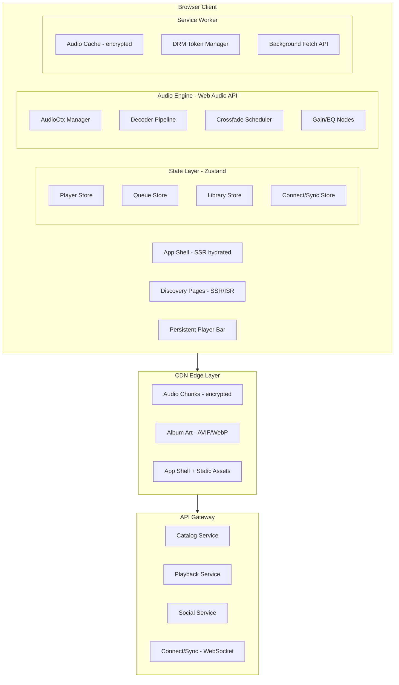

## Problem Statement

Design a browser-based music streaming platform that delivers continuous, gapless audio playback across millions of tracks while supporting offline listening, multi-device sync, and social features. The core architectural challenge is managing the Web Audio API pipeline—buffering, decoding, and crossfading audio streams—while maintaining a persistent player that survives route navigations and handles adaptive bitrate switching based on network conditions.

**Scope:** Client-side audio engine, persistent playback UI, queue/playlist management, offline downloads with DRM, lyrics synchronization, collaborative playlists, and multi-device control (Spotify Connect model). Out of scope: audio transcoding backend, recommendation ML pipeline, payment/subscription management, artist upload portal.

**What makes this different from generic media players:** Music streaming demands gapless playback (no silence between tracks in an album), sub-second skip latency, background audio continuity across tab visibility changes, encrypted offline storage with DRM token rotation, and a persistent player bar that exists outside the router lifecycle.

**Real-world examples:** Spotify (320kbps OGG Vorbis, Connect protocol, collaborative playlists), Apple Music (256kbps AAC, lossless ALAC, spatial audio), YouTube Music (Opus codec, video-to-audio switching), Tidal (MQA lossless, Dolby Atmos), SoundCloud (128kbps MP3, waveform rendering).

---

## Requirements Exploration

### Functional Requirements

1. Users can search, browse, and play any track from a catalog of 100M+ songs with < 300ms playback start latency.
2. Playback continues uninterrupted during route navigations (persistent player bar outside router).
3. Gapless playback between consecutive album tracks with optional crossfade (0–12s configurable).
4. Queue management: play next, play later, shuffle (Fisher-Yates), repeat track/queue/off.
5. Offline mode: download tracks/albums/playlists with encrypted storage and DRM token management.
6. Adaptive quality: auto-switch between 96/128/256/320 kbps based on network conditions.
7. Lyrics display: timestamped line-by-line sync with karaoke (word-level) mode.
8. Media Session API integration: OS-level controls on lock screen, notification center, headphone buttons.
9. Multi-device control (Connect): transfer playback between devices, control remote playback.
10. Social features: collaborative playlists, friend activity feed, share track/playlist with preview.
11. Playlist browsing with virtualized rendering for lists of 10,000+ tracks.
12. Background playback: audio continues when tab is hidden or minimized.

### Non-Functional Requirements

| Category      | Requirement                | Target                                        |
| ------------- | -------------------------- | --------------------------------------------- |
| Performance   | Time to first audio byte   | < 300ms on broadband, < 1.5s on 3G            |
| Performance   | Track skip latency         | < 200ms (buffered), < 500ms (unbuffered)      |
| Performance   | Gapless transition         | < 5ms gap (imperceptible)                     |
| Bundle size   | Initial JS (player core)   | < 80KB gzipped                                |
| Bundle size   | Full app shell             | < 200KB gzipped                               |
| Memory        | Audio buffer ceiling       | 50MB per session (≈3 tracks decoded ahead)    |
| Memory        | Playlist DOM (virtualized) | < 5MB for 10K track list                      |
| Offline       | Download speed             | Saturate connection (parallel chunk download) |
| Offline       | Encrypted storage budget   | Configurable: 1–50GB per user preference      |
| Reliability   | Playback interruption rate | < 0.1% of sessions experience buffer underrun |
| Accessibility | WCAG compliance            | AA minimum, keyboard-navigable player         |
| Network       | Adaptive bitrate switch    | < 2s detection, no audible artifact           |
| Latency       | Connect device transfer    | < 1s state sync                               |

---

## Capacity Estimation & Constraints

**Traffic assumptions (single large-market deployment):**

- 50M DAU, average session: 45 min, 12 tracks played per session
- Peak concurrent listeners: 8M (≈16% of DAU online simultaneously)
- API reads: 600M/day (search, browse, metadata) → ~7K RPS average, 20K RPS peak
- Audio stream requests: 600M/day → 7K RPS average
- Read:write ratio: 200:1 (writes = playlist edits, likes, queue changes)

**Per-track data:**

- Audio file: 3.5 min average × 320kbps = ~8.4MB (high quality)
- Metadata: ~2KB JSON (title, artist, album, duration, ISRC, waveform data)
- Lyrics: ~5KB per track (timestamped LRC format)
- Album art: 300×300 (15KB), 640×640 (60KB), 1280×1280 (200KB)

**Client memory budget:**

- Decoded PCM buffer: ~10MB per minute of stereo 44.1kHz audio (Float32)
- Buffer ahead: 30s decoded + 2 full tracks pre-fetched compressed = ~50MB ceiling
- Playlist metadata cache: 10K tracks × 2KB = 20MB (acceptable in IndexedDB)
- UI component memory: < 30MB (virtualized lists keep DOM nodes < 200)

**Bandwidth per user:**

- Active streaming: 40KB/s (320kbps) sustained
- Metadata/API: ~2KB per track interaction → 24KB per session minute
- Total session bandwidth: ~108MB per 45-min session at high quality

These constraints drive key decisions: aggressive pre-buffering requires memory management, 320kbps streaming demands adaptive quality on mobile, and the 100M+ catalog requires server-driven search (no client-side indexing).

---

## Architecture / High-Level Design

### Rendering Strategy

**Hybrid CSR with SSR for discovery pages.** The player engine and playback state are purely client-side (CSR)—no server can manage AudioContext state. Discovery pages (browse, search results, artist pages) use SSR for SEO and fast FCP. Playlist pages use ISR with 60s revalidation since playlist content changes infrequently.

Justification: Audio playback requires persistent client-side state that survives navigations. SSR the shell and discovery content, hydrate the player engine once, never unmount it.

### Navigation Model

**SPA with persistent layout.** The player bar exists in a root layout component above the router outlet. Route navigations swap only the main content area—the player, queue drawer, and audio engine are never unmounted.

```
URL structure:
/                       → Home / For You
/search?q=...          → Search results
/album/:id             → Album detail
/playlist/:id          → Playlist detail
/artist/:id            → Artist page
/lyrics                → Full-screen lyrics (overlay, not a route change)
/library               → User library
/settings              → Settings (offline, quality, social)
```

URL state: current track and queue are NOT in the URL (they persist across navigations via global store). The URL reflects the browsing context only.

### System Architecture Diagram



### Component Architecture

```
<RootLayout>                          ← Server Component, renders once
├── <AppShell>                        ← Server Component (header, nav)
│   └── <RouterOutlet />              ← Swappable per route
│       ├── <HomePage />              ← SSR, personalized recs
│       ├── <SearchPage />            ← CSR (real-time input)
│       ├── <AlbumPage />             ← SSR + hydration
│       ├── <PlaylistPage />          ← ISR + client mutations
│       └── <ArtistPage />            ← SSR
├── <PersistentPlayer>                ← Client Component, NEVER unmounts
│   ├── <NowPlaying />                ← Track info + album art
│   ├── <PlaybackControls />          ← Play/pause/skip/shuffle/repeat
│   ├── <ProgressBar />              ← Seek bar with buffered indicator
│   ├── <VolumeControl />            ← Gain node binding
│   ├── <QueueDrawer />              ← Slide-up panel
│   └── <DeviceSelector />           ← Connect device picker
├── <LyricsOverlay />                 ← Full-screen overlay (portal)
└── <AudioEngine />                   ← Invisible, manages Web Audio graph
    ├── <MediaSessionBridge />        ← Syncs state to navigator.mediaSession
    └── <ConnectSocket />             ← WebSocket for multi-device
```

### State Management Strategy

| State Type                                               | Technology                           | Justification                                                 |
| -------------------------------------------------------- | ------------------------------------ | ------------------------------------------------------------- |
| Playback state (current track, position, playing/paused) | Zustand store (playerStore)          | Global, survives navigation, needs sync subscriptions         |
| Queue (ordered track list, shuffle state)                | Zustand store (queueStore)           | Mutable by user, drives playback engine                       |
| Audio engine internals (AudioContext, buffers, nodes)    | Module-scoped refs (not React state) | Not renderable, high-frequency updates (60fps position)       |
| Library/playlists                                        | TanStack Query (server state)        | Cacheable, paginated, benefits from stale-while-revalidate    |
| Search results                                           | TanStack Query                       | Debounced, cached, server-driven                              |
| Lyrics (current line index)                              | Zustand (lyricsStore)                | Updates at 10Hz, needs synchronization with playback position |
| Offline download progress                                | Zustand + IndexedDB                  | Persists across sessions, needs UI reactivity                 |
| Connect device state                                     | Zustand + WebSocket                  | Real-time sync across devices                                 |
| User preferences (quality, crossfade)                    | localStorage + Zustand hydration     | Persists, rarely changes                                      |

---

## Data Model / Entities

```typescript
// Core playback entities
interface Track {
  id: string; // Spotify-style base62 ID
  title: string;
  artistIds: string[]; // Normalized references
  albumId: string;
  duration: number; // Milliseconds
  discNumber: number;
  trackNumber: number;
  isrc: string; // International Standard Recording Code
  availableQualities: AudioQuality[];
  hasLyrics: boolean;
  isExplicit: boolean;
  previewUrl: string | null; // 30s preview for non-premium
}

interface Album {
  id: string;
  title: string;
  artistIds: string[];
  releaseDate: string; // ISO 8601
  trackIds: string[]; // Ordered
  coverArt: ResponsiveImage;
  totalDuration: number;
  trackCount: number;
  label: string;
  copyrights: Copyright[];
}

interface Artist {
  id: string;
  name: string;
  imageUrl: ResponsiveImage;
  genres: string[];
  monthlyListeners: number;
  verified: boolean;
}

interface Playlist {
  id: string;
  name: string;
  description: string;
  ownerId: string;
  isCollaborative: boolean;
  isPublic: boolean;
  trackIds: string[]; // Ordered, can contain duplicates
  followerCount: number;
  coverArt: ResponsiveImage | null; // null = auto-generated mosaic
  snapshotId: string; // For optimistic conflict detection
  lastModified: number; // Unix timestamp
}

// Audio engine types
type AudioQuality = "low" | "normal" | "high" | "very_high" | "lossless";

interface QualityConfig {
  low: { bitrate: 96; codec: "AAC" };
  normal: { bitrate: 128; codec: "AAC" };
  high: { bitrate: 256; codec: "AAC" };
  very_high: { bitrate: 320; codec: "OGG" }; // Vorbis
  lossless: { bitrate: 1411; codec: "FLAC" };
}

interface AudioSegment {
  trackId: string;
  quality: AudioQuality;
  segmentIndex: number; // 0-based, 10s segments
  url: string; // CDN URL with signed token
  byteRange: [number, number]; // For range requests
  durationMs: number;
  decryptionKey: ArrayBuffer; // Per-segment AES-128 key
}

interface PlaybackState {
  trackId: string | null;
  status: "idle" | "loading" | "playing" | "paused" | "buffering";
  positionMs: number;
  durationMs: number;
  volume: number; // 0.0 – 1.0
  isMuted: boolean;
  quality: AudioQuality;
  bufferedRanges: TimeRange[]; // What's been downloaded
  decodedAheadMs: number; // How far ahead we've decoded
}

interface TimeRange {
  startMs: number;
  endMs: number;
}

// Queue types
interface QueueState {
  items: QueueItem[];
  currentIndex: number;
  repeatMode: "off" | "track" | "queue";
  shuffleEnabled: boolean;
  shuffleOrder: number[]; // Fisher-Yates permutation indices
  originalOrder: number[]; // Pre-shuffle order for unshuffle
  history: string[]; // Track IDs of previously played
}

interface QueueItem {
  uid: string; // Unique queue entry (same track can appear multiple times)
  trackId: string;
  addedBy: "user" | "autoplay" | "radio";
  context: PlaybackContext; // Where this was queued from
}

interface PlaybackContext {
  type: "album" | "playlist" | "artist" | "search" | "radio" | "queue";
  id: string;
  name: string;
}

// Lyrics types
interface LyricsData {
  trackId: string;
  syncType: "line" | "word" | "unsynced";
  lines: LyricLine[];
  language: string;
  provider: string;
}

interface LyricLine {
  startMs: number;
  endMs: number;
  text: string;
  words?: LyricWord[]; // For karaoke mode
}

interface LyricWord {
  startMs: number;
  endMs: number;
  text: string;
}

// Offline/download types
interface DownloadedTrack {
  trackId: string;
  quality: AudioQuality;
  encryptedBlob: string; // IndexedDB key for encrypted audio
  drmTokenExpiry: number; // Unix timestamp, must refresh before expiry
  fileSize: number; // Bytes
  downloadedAt: number;
  checksum: string; // SHA-256 of decrypted audio for integrity
}

interface DownloadState {
  trackId: string;
  status: "queued" | "downloading" | "decrypting" | "complete" | "failed";
  progress: number; // 0.0 – 1.0
  bytesDownloaded: number;
  totalBytes: number;
  error?: DownloadError;
}

// Connect types (multi-device)
interface ConnectDevice {
  id: string;
  name: string;
  type: "computer" | "smartphone" | "speaker" | "tv";
  isActive: boolean;
  volumePercent: number;
  supportsVolume: boolean;
}

interface ConnectTransferCommand {
  targetDeviceId: string;
  playbackState: PlaybackState;
  queueState: QueueState;
  positionMs: number;
  timestamp: number; // For latency compensation
}

// Responsive image utility
interface ResponsiveImage {
  small: string; // 64×64
  medium: string; // 300×300
  large: string; // 640×640
  xlarge: string; // 1280×1280
}

interface Copyright {
  text: string;
  type: "C" | "P"; // © or ℗
}

// Normalized client store
interface MusicStore {
  tracks: Record<string, Track>;
  albums: Record<string, Album>;
  artists: Record<string, Artist>;
  playlists: Record<string, Playlist>;
}
```

---

## Interface Definition (API)

### Playback Service

```typescript
// GET /v1/tracks/:id/stream
// Returns signed streaming manifest
interface StreamRequest {
  params: { id: string };
  query: {
    quality: AudioQuality;
    startPositionMs?: number; // For seeking into unbuffered region
  };
  headers: {
    Authorization: `Bearer ${string}`;
    "X-Device-Id": string;
  };
}

interface StreamResponse {
  fileId: string;
  format: "ogg" | "aac" | "flac" | "mp3";
  segments: AudioSegment[];
  totalDurationMs: number;
  normalizationGain: number; // ReplayGain dB value
  hasGaplessInfo: boolean;
  gapless?: {
    leadingSilenceMs: number; // Trim from start
    trailingSilenceMs: number; // Trim from end
  };
}

// POST /v1/playback/transfer
// Transfer playback to another device
interface TransferRequest {
  body: {
    targetDeviceId: string;
    ensurePlayback: boolean; // Start playing on target even if paused
  };
}

// GET /v1/tracks/:id/lyrics
interface LyricsResponse {
  syncType: "line" | "word" | "unsynced";
  lines: LyricLine[];
  language: string;
  provider: string;
}
```

### Catalog Service

```typescript
// GET /v1/search
interface SearchRequest {
  query: {
    q: string;
    type: ("track" | "album" | "artist" | "playlist")[];
    limit?: number; // Default 20, max 50
    offset?: number; // Offset-based for search (results are ephemeral)
  };
}

interface SearchResponse {
  tracks: PaginatedResult<Track>;
  albums: PaginatedResult<Album>;
  artists: PaginatedResult<Artist>;
  playlists: PaginatedResult<Playlist>;
}

// GET /v1/playlists/:id/tracks
// Cursor-based pagination (playlists can have 10K+ tracks)
interface PlaylistTracksRequest {
  params: { id: string };
  query: {
    cursor?: string; // Opaque cursor from previous response
    limit?: number; // Default 50, max 100
    snapshotId?: string; // For consistent pagination during edits
  };
}

interface PlaylistTracksResponse {
  items: PlaylistTrackItem[];
  nextCursor: string | null;
  total: number;
  snapshotId: string;
}

interface PlaylistTrackItem {
  addedAt: string; // ISO 8601
  addedBy: { id: string; displayName: string };
  track: Track;
}
```

### Social/Collaborative Service

```typescript
// WebSocket: /v1/connect
// Bidirectional messages for device sync and friend activity
type ConnectMessage =
  | { type: "state_update"; payload: PlaybackState }
  | { type: "transfer"; payload: ConnectTransferCommand }
  | { type: "device_list"; payload: ConnectDevice[] }
  | { type: "friend_activity"; payload: FriendActivity[] }
  | { type: "playlist_change"; payload: PlaylistDelta };

interface PlaylistDelta {
  playlistId: string;
  snapshotId: string;
  operations: PlaylistOperation[];
}

type PlaylistOperation =
  | { op: "add"; trackId: string; position: number }
  | { op: "remove"; uid: string }
  | { op: "move"; uid: string; toPosition: number };
```

### Error Responses

```typescript
interface ApiError {
  error: {
    status: number;
    message: string;
    code:
      | "RATE_LIMITED"
      | "PREMIUM_REQUIRED"
      | "NOT_FOUND"
      | "DEVICE_OFFLINE"
      | "DRM_EXPIRED"
      | "REGION_BLOCKED";
    retryAfter?: number; // Seconds, for rate limiting
  };
}
```

**Pagination strategy:** Cursor-based for playlists and library (stable ordering during mutations, efficient with large lists). Offset-based for search (results are ephemeral, no stable cursor needed, users rarely paginate past page 5).

**Caching headers:** `Cache-Control: private, max-age=0` on playback state endpoints. `Cache-Control: public, s-maxage=300` on catalog metadata. `ETag` on playlist responses for conditional requests.

---

## Caching Strategy

### Client-Side Caching

**In-memory normalized store (Zustand + TanStack Query):**

- Track metadata: LRU cache, max 5,000 entries (~10MB), TTL 1 hour
- Album/artist data: LRU cache, max 1,000 entries (~5MB), TTL 30 minutes
- Search results: max 50 queries cached, TTL 5 minutes, evict on memory pressure
- Eviction: LRU with access-time tracking; evict least-recently-accessed when ceiling hit

**Audio buffer cache (AudioContext-managed):**

- Current track: fully decoded PCM in AudioBuffer (~10MB/min)
- Next track: pre-decoded first 30s (~5MB)
- Previous track: retain last 10s for instant back-skip (~1.7MB)
- Total decoded budget: 50MB hard ceiling, evict oldest buffers first

**Service Worker cache:**

- App shell (HTML, CSS, critical JS): cache-first, versioned with build hash
- Album artwork: cache-first with network fallback, max 500 images (~30MB), LRU eviction
- API responses (catalog): stale-while-revalidate, TTL 5 minutes
- Audio segments (online): network-only (too large to cache speculatively)

**IndexedDB (offline data):**

- Downloaded tracks: encrypted blobs, user-controlled quota (1–50GB)
- Playlist snapshots: full track list for offline playlists, refresh on connectivity
- Queue state: persisted for session restoration
- Schema versioned with migration path

### CDN & Edge Caching

| Resource            | Cache-Control                                          | TTL    | Invalidation                          |
| ------------------- | ------------------------------------------------------ | ------ | ------------------------------------- |
| Audio segments      | `public, max-age=31536000, immutable`                  | 1 year | Content-addressed URLs (hash in path) |
| Album art           | `public, max-age=86400, stale-while-revalidate=604800` | 1 day  | Purge on art update (rare)            |
| App shell           | `public, max-age=31536000, immutable`                  | 1 year | New hash on deploy                    |
| API: catalog        | `public, s-maxage=300, stale-while-revalidate=60`      | 5 min  | TTL-based                             |
| API: playback state | `private, no-store`                                    | None   | Real-time, never cached               |
| API: user library   | `private, max-age=0, must-revalidate`                  | None   | ETag validation                       |

**Edge compute:** Use Cloudflare Workers / Vercel Edge for:

- Signed URL generation (audio segment access tokens, 15-min expiry)
- Geographic routing to nearest audio CDN PoP
- A/B experiment assignment (bucketing at edge, no origin round-trip)

### Cache Coherence

**Stale detection:**

- Playlist `snapshotId` comparison: if server snapshot differs from cached, refetch changed range
- WebSocket `playlist_change` events trigger immediate cache invalidation for collaborative playlists
- Background tab uses `visibilitychange` event to trigger soft-refresh on return

**Cross-tab consistency:**

- `BroadcastChannel('music-player-sync')` ensures only one tab plays audio at a time
- Queue mutations broadcast to all tabs; non-active tabs update their UI
- Shared lock via Web Locks API prevents concurrent DRM token refresh

**Optimistic update reconciliation:**

- Playlist add/remove applies optimistically with `tempId`
- On server confirm: replace `tempId` with real ID, update `snapshotId`
- On server reject (conflict): rollback local change, show toast, refetch playlist

**Cache warming:**

- First visit: shell from CDN cache hit, API calls for personalized content
- Return visit: shell instant (SW cache), stale metadata shown immediately while revalidating
- Pre-fetch: on track 80% complete, fetch next track's metadata + start segment download

---

## Rendering & Performance Deep Dive

### Critical Rendering Path

**Tier 1 (0–500ms): App shell + persistent player skeleton**

- Pre-cached HTML shell via Service Worker (instant on return visit)
- Critical CSS inlined (player bar, navigation chrome)
- Player state restored from IndexedDB → skeleton populated immediately

**Tier 2 (500ms–1.5s): Audio engine + above-fold content**

- Audio engine module (~35KB gzipped) loaded and AudioContext created
- Current route's above-fold content rendered (SSR HTML streamed)
- Media Session API registered

**Tier 3 (1.5s+): Below-fold + interaction-triggered**

- Lyrics renderer (loaded on lyrics button click)
- Search with autocomplete (loaded on search focus)
- Settings panel, social features, Connect UI
- Waveform visualizer (heavy Canvas/WebGL, loaded on demand)

```typescript
// Route-based code splitting
const LyricsOverlay = lazy(() => import("./features/lyrics/LyricsOverlay"));
const SearchPanel = lazy(() => import("./features/search/SearchPanel"));
const ConnectDrawer = lazy(() => import("./features/connect/ConnectDrawer"));
const Equalizer = lazy(() => import("./features/audio/Equalizer"));
```

### Core Web Vitals Targets

| Metric | Target  | Strategy                                                                       |
| ------ | ------- | ------------------------------------------------------------------------------ |
| LCP    | < 1.2s  | SSR above-fold content, preload hero album art, SW shell cache                 |
| INP    | < 100ms | Debounce search, offload audio decoding to AudioWorklet, no main-thread decode |
| CLS    | < 0.05  | Fixed player bar height (72px), skeleton placeholders match final dimensions   |
| FCP    | < 800ms | Inlined critical CSS, SW-cached shell, streaming SSR                           |
| TTFB   | < 200ms | Edge-rendered pages, CDN for static assets                                     |

### List Virtualization

Playlists can contain 10,000+ tracks. Use `@tanstack/react-virtual`:

```typescript
const virtualizer = useVirtualizer({
  count: playlist.trackIds.length,
  getScrollElement: () => scrollRef.current,
  estimateSize: () => 56, // Fixed row height: 56px
  overscan: 15, // Render 15 extra rows above/below viewport
  getItemKey: (index) => playlist.trackIds[index],
});
```

- Fixed row height (56px) avoids expensive dynamic measurement
- Overscan of 15 rows prevents blank flashes during fast scrolling
- Scroll position restoration via `sessionStorage` key per playlist
- Keyboard navigation maintains virtual focus index separate from DOM focus

### Audio Pipeline Optimization

```typescript
// Audio decoding pipeline — offload from main thread
class AudioDecoder {
  private context: AudioContext;
  private decodeQueue: Map<string, Promise<AudioBuffer>>;

  async preDecodeTrack(segment: AudioSegment): Promise<AudioBuffer> {
    const encrypted = await fetch(segment.url).then((r) => r.arrayBuffer());
    const decrypted = await crypto.subtle.decrypt(
      { name: "AES-CBC", iv: segment.iv },
      segment.decryptionKey,
      encrypted,
    );
    // decodeAudioData runs on audio thread, not main thread
    return this.context.decodeAudioData(decrypted);
  }
}
```

<Callout>
  Web Audio API's `decodeAudioData()` runs on a separate audio thread — it does
  NOT block the main thread. This is critical: a 5MB compressed audio file takes
  ~200ms to decode, which would cause INP violations if done synchronously.
  Always use the Promise-based API, never the callback form.
</Callout>

### Bundle Optimization

| Module                               | Size (gzip) | Loading strategy           |
| ------------------------------------ | ----------- | -------------------------- |
| Player core (Zustand + audio engine) | 35KB        | Eager (Tier 2)             |
| TanStack Query + React               | 45KB        | Eager (Tier 1)             |
| Lyrics renderer                      | 12KB        | Lazy (on lyrics open)      |
| Search + autocomplete                | 18KB        | Lazy (on search focus)     |
| Virtualized list                     | 8KB         | Route-level split          |
| Connect/WebSocket                    | 15KB        | Lazy (on device menu open) |
| Equalizer/visualizer                 | 25KB        | Lazy (on EQ toggle)        |

Total critical path: < 80KB. Full app: ~200KB. Brotli compression. `modulepreload` for predicted next interactions.

---

## Security Deep Dive

### Threat Model

| Threat                       | Attack Vector                                                         | Impact                            | Mitigation                                                                                      |
| ---------------------------- | --------------------------------------------------------------------- | --------------------------------- | ----------------------------------------------------------------------------------------------- |
| Audio stream ripping         | Intercept decrypted audio buffers via DevTools or AudioContext hijack | Revenue loss, licensing violation | Encrypted Media Extensions (EME), Widevine L3, obfuscated decryption keys, detect DevTools open |
| DRM token theft              | Steal offline playback tokens from IndexedDB/localStorage             | Unauthorized offline access       | Tokens bound to device fingerprint, short expiry (7 days), stored in non-exportable CryptoKey   |
| Queue/playlist injection     | XSS injecting malicious track metadata (titles with `<script>`)       | Session hijack                    | Strict CSP, sanitize all rendered metadata, no `dangerouslySetInnerHTML`                        |
| Connect session hijack       | Steal WebSocket auth to control another user's playback               | Privacy violation, abuse          | WebSocket tickets (short-lived, single-use), re-auth on reconnect                               |
| Credential stuffing on login | Automated login attempts with leaked credentials                      | Account takeover                  | Rate limiting (5 attempts/min), CAPTCHA after 3 failures, breach password check                 |

### DRM / Content Protection

```typescript
// Encrypted Media Extensions (EME) integration
async function initDRM(audioElement: HTMLMediaElement): Promise<void> {
  const config: MediaKeySystemConfiguration = {
    initDataTypes: ["cenc"],
    audioCapabilities: [
      {
        contentType: 'audio/mp4; codecs="mp4a.40.2"',
        robustness: "SW_SECURE_DECODE", // Widevine L3
      },
    ],
    persistentState: "required", // For offline licenses
    sessionTypes: ["persistent-license"],
  };

  const access = await navigator.requestMediaKeySystemAccess(
    "com.widevine.alpha",
    [config],
  );
  const mediaKeys = await access.createMediaKeys();
  await audioElement.setMediaKeys(mediaKeys);
}
```

<Callout>
  Widevine L3 (software-only) is the maximum DRM level available in browsers. It
  prevents casual ripping but is crackable by determined attackers. This is an
  accepted trade-off in the industry—Spotify, Apple Music, and YouTube Music all
  use L3 for web playback. Hardware DRM (L1) requires native apps.
</Callout>

**Offline DRM token lifecycle:**

1. Download: acquire persistent license (valid 30 days)
2. Daily check-in: device phones home to verify license validity
3. Expiry: after 30 days offline or subscription lapse, license revoked
4. Tokens stored as non-exportable `CryptoKey` objects via Web Crypto API

### Authentication & Authorization

- **Token strategy:** Short-lived access token (15 min JWT) + long-lived refresh token (httpOnly secure cookie, 30 days)
- **Storage:** Access token in memory only (Zustand store). NEVER localStorage.
- **Refresh flow:** Silent refresh via `fetch` to `/auth/refresh` endpoint. Queue all pending requests during refresh to prevent race conditions.
- **Premium gating:** API returns `PREMIUM_REQUIRED` error code for high-quality streams and offline downloads. Client shows upgrade prompt.

```typescript
// Request queue during token refresh
class AuthManager {
  private refreshPromise: Promise<string> | null = null;

  async getAccessToken(): Promise<string> {
    if (this.isTokenValid()) return this.token;

    // Deduplicate concurrent refresh attempts
    if (!this.refreshPromise) {
      this.refreshPromise = this.refreshToken().finally(() => {
        this.refreshPromise = null;
      });
    }
    return this.refreshPromise;
  }
}
```

### Content Security Policy

```
default-src 'self';
script-src 'self' 'nonce-{random}';
style-src 'self' 'unsafe-inline';           // Required for dynamic player styles
media-src blob: https://*.cdn.example.com;  // Audio blob URLs + CDN
connect-src 'self' https://api.example.com wss://connect.example.com;
img-src 'self' https://*.cdn.example.com data:;  // Album art from CDN
worker-src 'self' blob:;                    // Service Worker + AudioWorklet
```

---

## Scalability & Reliability

### Scalability Patterns

**Playlist pagination:** Cursor-based with `snapshotId` for consistency. A user editing a 10K-track playlist while paginating sees a consistent view until they explicitly refresh.

**Virtualized lists:** All lists > 100 items use virtualization. Dynamic height support for search results (tracks vs albums vs artists have different row heights): measure once, cache in `Map<string, number>`.

**Audio segment pre-fetching:** Predictive loading based on queue. When current track reaches 75% played, begin fetching first 3 segments of next track. Abort pre-fetch if user skips.

**Data-driven loading:** Only load the lyrics module if the current track has `hasLyrics: true`. Only load Connect module if user has > 1 registered device.

### Failure Handling

| Failure Mode                            | Detection                          | User Experience                                     | Recovery                                                                        |
| --------------------------------------- | ---------------------------------- | --------------------------------------------------- | ------------------------------------------------------------------------------- |
| Network loss during playback            | `navigator.onLine` + fetch failure | Continue playing buffered audio, show offline badge | Auto-resume streaming when online, seek to current position                     |
| Audio segment fetch timeout             | AbortController (8s timeout)       | Brief buffer spinner, try lower quality             | Retry with exponential backoff (1s, 2s, 4s), downgrade quality after 2 failures |
| AudioContext suspended (browser policy) | `context.state === 'suspended'`    | Show "tap to play" overlay                          | Resume context on user gesture                                                  |
| WebSocket disconnect (Connect)          | Heartbeat timeout (30s)            | "Reconnecting..." indicator                         | Exponential backoff reconnect (1s, 2s, 4s, max 30s), re-sync state on reconnect |
| DRM license server down                 | License request 5xx                | Offline tracks unplayable after expiry              | Grace period (48h cached license), queue license refresh for background retry   |
| Storage quota exceeded (offline)        | QuotaExceededError from IndexedDB  | "Storage full" toast with manage option             | Prompt to delete old downloads, show usage breakdown                            |

### Resilience Patterns

- **Offline queue:** Playlist mutations (add/remove/reorder) stored in outbox when offline. Replay with idempotency keys on reconnect. Conflict resolution: last-writer-wins with `snapshotId` check.
- **Circuit breaker:** If lyrics API fails 5× in 60s, disable lyrics requests for 5 minutes. Show "Lyrics unavailable" instead of repeated failures.
- **Stale-while-revalidate for metadata:** Show cached track/album info immediately, refresh in background. User never sees a loading state for previously-viewed content.
- **Request deduplication:** Multiple components requesting the same track metadata simultaneously get a single in-flight request via TanStack Query's built-in deduplication.

### Graceful Degradation

| Connection Quality      | Experience                                                  |
| ----------------------- | ----------------------------------------------------------- |
| Broadband (>10 Mbps)    | 320kbps streaming, pre-buffer next 2 tracks, full lyrics    |
| Good mobile (3-10 Mbps) | 256kbps streaming, pre-buffer next 1 track                  |
| Slow mobile (1-3 Mbps)  | 128kbps streaming, no pre-buffer, lyrics disabled           |
| Very slow / offline     | Play downloaded content only, queue online tracks for later |
| No JavaScript           | Completely non-functional (acceptable for a streaming app)  |

---

## Accessibility Deep Dive

### Player Controls

```html
<div role="region" aria-label="Music player" aria-live="polite">
  <button aria-label="Previous track" aria-keyshortcuts="Shift+Left">
  <button aria-label="Play" aria-keyshortcuts="Space">  <!-- toggles to "Pause" -->
  <button aria-label="Next track" aria-keyshortcuts="Shift+Right">

  <input type="range" role="slider"
    aria-label="Playback position"
    aria-valuemin="0"
    aria-valuemax="${durationMs}"
    aria-valuenow="${positionMs}"
    aria-valuetext="2 minutes 34 seconds of 4 minutes 12 seconds"
  />

  <input type="range" role="slider"
    aria-label="Volume"
    aria-valuemin="0"
    aria-valuemax="100"
    aria-valuenow="${volume * 100}"
    aria-valuetext="Volume ${Math.round(volume * 100)} percent"
  />
</div>
```

### Keyboard Navigation

| Key           | Context        | Action                        |
| ------------- | -------------- | ----------------------------- |
| Space         | Global         | Play / Pause                  |
| Shift + →     | Global         | Next track                    |
| Shift + ←     | Global         | Previous track                |
| ↑ / ↓         | Playlist/Queue | Navigate tracks               |
| Enter         | Playlist/Queue | Play selected track           |
| L             | Global         | Toggle lyrics                 |
| M             | Global         | Mute / unmute                 |
| Shift + ↑ / ↓ | Global         | Volume up/down (5% increment) |

### Screen Reader Announcements

```typescript
// Announce track changes without interrupting
function announceTrackChange(track: Track): void {
  const announcement = `Now playing: ${track.title} by ${track.artistNames.join(", ")}`;
  // aria-live="polite" region updates — doesn't interrupt current speech
  liveRegionRef.current.textContent = announcement;
}

// Assertive announcement for errors
function announceError(message: string): void {
  errorRegionRef.current.textContent = message; // aria-live="assertive"
}
```

### Motion & Visual Preferences

- `prefers-reduced-motion`: disable crossfade animations, waveform visualizer, lyrics scroll animation
- `prefers-contrast: more`: increase border contrast on player controls, use solid backgrounds instead of blur
- `forced-colors` mode: player controls use `ButtonFace`/`ButtonText` system colors, remove custom theming
- Touch targets: all player buttons minimum 44×44px, volume slider thumb 24px diameter with 44px hit area

### Focus Management

- Tab into player region: focus lands on play/pause button
- Queue drawer open: focus trapped inside, Escape closes and returns focus to queue button
- Lyrics overlay: focus trapped, Escape closes
- Route change: focus moves to main content heading (`h1`), announced via `aria-live`

---

## Monitoring & Observability

### Client-Side Metrics

**Core Web Vitals (via `web-vitals` library):**

- LCP, INP, CLS, FCP, TTFB — reported per route
- Custom: Time-to-First-Audio (TTFA) — from play button click to first audible output
- Custom: Buffer Underrun Rate — percentage of sessions with audible playback interruption
- Custom: Skip Latency — time from skip press to next track audio start

**Business Metrics:**

- Tracks played per session
- Average listening duration per session
- Shuffle-to-sequential ratio
- Offline play percentage
- Quality level distribution (what % of users stream at each bitrate)

### Error Tracking

```typescript
// Structured error reporting
interface AudioError {
  type:
    | "decode_failure"
    | "network_timeout"
    | "drm_error"
    | "context_suspended";
  trackId: string;
  quality: AudioQuality;
  bufferedAheadMs: number;
  networkType: string; // navigator.connection.effectiveType
  timestamp: number;
  sessionDuration: number;
  recoveryAction: "retry" | "quality_downgrade" | "skip" | "none";
}
```

- Source maps uploaded to Sentry on deploy
- Audio-specific errors grouped by `type` + `quality` + `networkType`
- Error boundaries on every route + player sub-component

### Day-1 Launch Dashboard

| Panel                         | Metric                            | Alert Threshold     |
| ----------------------------- | --------------------------------- | ------------------- |
| 1. Active Listeners           | Concurrent stream count           | Drop > 20% in 5 min |
| 2. TTFA (Time to First Audio) | p50, p95, p99                     | p95 > 2s            |
| 3. Buffer Underrun Rate       | % sessions with stall             | > 0.5%              |
| 4. Error Rate                 | Client errors / minute            | > 50 errors/min     |
| 5. DRM License Failures       | Failed license acquisitions / min | > 10/min            |
| 6. API Latency                | p50/p95/p99 for /stream endpoint  | p99 > 1s            |
| 7. Quality Distribution       | % users at each bitrate tier      | Low quality > 30%   |
| 8. Offline Sync Failures      | Failed download attempts / hour   | > 100/hour          |

### Alerting Thresholds

- **P0 (page immediately):** Buffer underrun rate > 2%, DRM failures > 50/min, no audio served for > 2 min
- **P1 (Slack, 15 min):** TTFA p95 > 3s, error rate > 100/min, WebSocket disconnect rate > 5%
- **P2 (ticket):** Bundle size regression > 10KB, CLS > 0.1, quality downgrade rate > 20%

### Real User Monitoring

- Sample 100% of audio errors (critical signal)
- Sample 10% of performance metrics (volume too high for 100%)
- Segment by: device type, connection quality, premium vs free, geographic region
- Rage-click detection on player controls (indicates broken interaction)
- Funnel: app load → first play → 30s listen → full track → second track

---

## Trade-offs

| Decision                                                     | Pro                                                                                  | Con                                                                                |
| ------------------------------------------------------------ | ------------------------------------------------------------------------------------ | ---------------------------------------------------------------------------------- |
| Web Audio API over `<audio>` element                         | Full control over decoding, crossfade, gapless, EQ                                   | Higher complexity, must handle AudioContext lifecycle, no native codec negotiation |
| Zustand over Redux for player state                          | Simpler API, smaller bundle (1KB vs 7KB), no boilerplate, fine-grained subscriptions | Less ecosystem tooling, no time-travel debugging out-of-box                        |
| Cursor pagination over offset for playlists                  | Stable during mutations, performant for large lists                                  | Cannot jump to arbitrary page, must traverse sequentially                          |
| EME/Widevine DRM over custom encryption                      | Industry standard, label compliance, hardware path available on native               | Limited to L3 in browser (software-only), complex license server integration       |
| Pre-decode next track (50MB budget) over just-in-time decode | Gapless playback, instant skips                                                      | Higher memory usage, wasted bandwidth if user skips frequently                     |
| Service Worker for offline over native app                   | Single codebase, web distribution, no app store review                               | Limited background execution, storage quota restrictions, no hardware DRM (L1)     |
| Fixed-height virtualized rows over dynamic                   | Predictable scroll position, no layout thrash, simpler implementation                | Can't show variable-height content (long titles truncated)                         |
| WebSocket for Connect over polling                           | Real-time device sync (< 100ms latency), server push                                 | Connection management complexity, reconnection logic, harder to debug              |
| Fisher-Yates shuffle over random sort                        | True uniform distribution, O(n) time, reversible                                     | Must store full permutation array in memory (negligible for typical queue sizes)   |
| Module-scoped audio refs over React state                    | No re-renders on 60fps position updates, direct Web Audio API access                 | Harder to test, breaks React DevTools inspection, requires imperative bridge       |

---

## What Great Looks Like

A **senior** answer covers:

- Web Audio API basics (AudioContext, AudioBufferSourceNode, GainNode)
- Persistent player bar architecture (state outside router)
- Basic queue management with shuffle/repeat
- Service Worker caching for assets and offline shell

A **staff** answer additionally:

- Gapless playback implementation (pre-decode, trim leading/trailing silence, schedule with `startTime`)
- Adaptive bitrate switching with network quality detection
- Fisher-Yates shuffle with unshuffle capability
- DRM/EME integration and license management
- Memory budget analysis for audio buffers
- Cross-tab coordination via BroadcastChannel
- Virtualized playlists with scroll position restoration

A **principal** answer additionally:

- AudioWorklet for real-time audio processing without main-thread jank
- Connect protocol design (state synchronization, latency compensation, conflict resolution)
- Offline-first architecture with outbox pattern for mutations
- Comprehensive monitoring (TTFA metric, buffer underrun alerting, quality distribution dashboards)
- Security threat model specific to streaming (DRM bypass, token theft, Connect hijack)

<Callout>
  The differentiator between staff and principal here is **systems thinking**: a
  principal candidate designs the Connect protocol considering network
  partitions, clock skew between devices, and graceful degradation when the
  coordinating server is unavailable. They think about what happens at the
  edges, not just the happy path.
</Callout>

---

## Key Takeaways

- **The player bar must exist outside the router lifecycle** — mount it at the root layout level, manage its state in a global store that never resets on navigation.
- **Web Audio API gives gapless playback but demands careful memory management** — budget 50MB for decoded buffers, evict aggressively, and always use the async `decodeAudioData()` to avoid blocking the main thread.
- **Adaptive quality requires proactive network monitoring** — use `navigator.connection` API plus actual download throughput measurement to switch bitrates before the user hears a stall.
- **Offline downloads need a DRM token refresh strategy** — tokens expire, so design a background check-in mechanism and define graceful behavior when the device can't reach the license server.
- **Fisher-Yates shuffle must be reversible** — store the original order alongside the permutation so users can toggle shuffle off and return to the original sequence.
- **Media Session API is not optional** — users expect OS-level controls (lock screen, notification center, headphone buttons) and will consider the app broken without them.
- **Virtualize everything over 100 items** — playlists, search results, and queue views must use windowing to keep DOM node count under 200 regardless of list size.
- **Connect (multi-device) is a distributed systems problem** — design for eventual consistency, timestamp-based conflict resolution, and network partition tolerance between devices.
