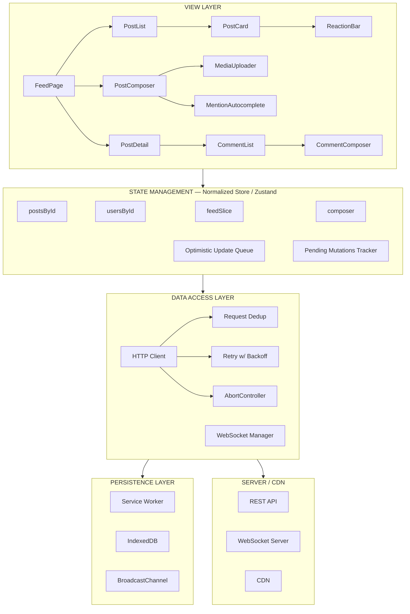

## Problem Statement

Design a web-based news feed application — the core surface of social platforms like Facebook, Twitter/X, LinkedIn, and Reddit. Users browse a personalized, algorithmically-ranked feed of posts, react to content, compose new posts, and maintain a long-lived interactive session. The feed is the highest-traffic, most latency-sensitive page on any social platform — it directly drives engagement metrics and is the primary reason users open the app.

This design focuses on the **front-end architecture**: rendering strategy, state management, client/server contract, pagination, real-time updates, and performance engineering. Backend ranking algorithms, ML pipelines, and distributed storage are out of scope — but the API contract and data shapes they produce are in scope.

**A news feed is not a notification center.** Notifications are append-only, read-once, and low-interaction. A feed is browseable, highly interactive (reactions, comments, shares, long-press menus), and the user may revisit the same content multiple times across sessions. This distinction drives fundamentally different caching, state management, and rendering strategies.

**Real-world examples:** Facebook News Feed, Twitter/X Home Timeline, LinkedIn Feed, Reddit Front Page, Instagram Feed

---

## Requirements Exploration

### Functional Requirements

1. **Feed browsing:** Users see a personalized, ranked feed of posts from connections and followed entities. Posts display author avatar, name, timestamp, body text (with mentions/hashtags/links), optional media (images, video, link previews), and engagement counts.
2. **Infinite scrolling:** Additional posts load automatically as the user scrolls toward the bottom. No explicit "Load more" button. A skeleton placeholder appears during fetch.
3. **Reactions:** Users can react to posts (like, love, haha, wow, sad, angry) with instant visual feedback (< 100ms perceived latency). Only one active reaction per post per user — selecting a new one replaces the old.
4. **Post composition:** Users can create new posts with text + image attachments. The composer supports mentions (@user), hashtags (#topic), and multi-image uploads. Published posts appear at the top of the feed immediately (optimistic insertion).
5. **Comments:** Users can view a comment count and expand to see comments inline. Full comment threading is a separate concern — the feed view shows a preview (top 2 comments) with a "View all N comments" link.
6. **Sharing:** Users can share/reshare posts. A reshare creates a new post wrapping the original.
7. **New content indicator:** For long-lived sessions, a "New posts available" banner appears when newer content exists. Tapping it scrolls to top and loads fresh content. New posts never silently prepend — it disrupts reading position.
8. **Post detail navigation:** Tapping a post opens a detail view (comments, full media gallery). Back-navigation restores exact scroll position and feed state.
9. **Content actions:** Mute, hide, report, save/bookmark — accessible via a "..." overflow menu on each post.

### Non-Functional Requirements

| Category       | Requirement                                   | Target                                           |
| -------------- | --------------------------------------------- | ------------------------------------------------ |
| Performance    | Time to Interactive (TTI) for feed            | < 2.5s on 4G mid-range mobile                    |
| Performance    | Interaction to Next Paint (INP) for reactions | < 100ms (p95)                                    |
| Performance    | Feed scroll frame rate                        | 60fps sustained (no jank during infinite scroll) |
| Latency        | Feed API response (p50 / p99)                 | < 150ms / < 500ms                                |
| Latency        | Post creation (perceived)                     | < 200ms (optimistic)                             |
| Scalability    | Concurrent DAU                                | 50M+ (architecture must not break at scale)      |
| Bundle size    | Initial JS payload (compressed)               | < 120KB (Tier 1 shell + feed renderer)           |
| Offline        | Cached feed for offline reading               | Last 100 posts in IndexedDB                      |
| Data freshness | Maximum staleness of feed                     | < 60s for active sessions                        |
| Availability   | Client-side error rate                        | < 0.1% of sessions encounter a fatal error       |
| Accessibility  | WCAG compliance                               | AA (AAA for color contrast on primary text)      |
| Security       | XSS via user-generated content                | Zero tolerance — CSP + output encoding           |
| Security       | CSRF on mutations                             | SameSite=Strict cookies + CSRF token             |
| i18n           | RTL language support                          | Full BiDi layout                                 |

---

## Capacity Estimation & Constraints

```
DAU: 50M users
Sessions/day: 3 per user (morning, lunch, evening)
Session duration: ~12 min average

Feed page size: 20 posts
Pages/session: ~4 (initial + 3 infinite scroll loads)
Total feed fetches/day: 50M × 3 × 4 = 600M requests/day
Read RPS (feed): 600M / 86,400 ≈ 6,944 RPS

Post creation: ~5% of users post daily = 2.5M posts/day
Write RPS (posts): 2.5M / 86,400 ≈ 29 RPS

Reaction writes: ~30% of users react per session
Reaction RPS: 50M × 3 × 0.3 × 2 / 86,400 ≈ 1,042 RPS

Read:Write ratio ≈ 7:1 (heavily read-skewed)

Per-post JSON payload: ~1.5KB (without media URLs)
Feed page payload: 20 × 1.5KB = 30KB raw → ~6KB gzipped
Media per post: ~2 images average × 80KB = 160KB (lazy loaded)

Client-side store (in memory):
  ~300 posts × 1.5KB = 450KB normalized JSON
  ~200 users × 200B = 40KB
  Total: ~500KB — well within mobile memory budget

Offline cache (IndexedDB):
  100 posts with media references: ~150KB JSON + image cache via Service Worker
```

**Architecture implications:**

- At ~7K RPS, the feed endpoint must be CDN-cacheable for shared content segments or edge-computed for personalization. Personalized feeds cannot be CDN-cached — they need `Cache-Control: private, max-age=0` with `ETag` for conditional revalidation.
- The 7:1 read:write ratio means optimistic updates are high-value — users see instant feedback while writes are eventually consistent.
- 500KB in-memory store is manageable but demands normalization — without it, duplicated user/post entities across feed pages, search results, and notifications balloon to 2–3MB.

---

## Architecture / High-Level Design

### Rendering Strategy

**Client-side rendering (CSR) is the default** for the authenticated feed. Justification:

1. **Personalization kills SSR caching.** Every user's feed is unique (different friends, different ranking). SSR would render on every request with zero cache reuse — all cost, no benefit.
2. **Long-lived session state.** Users browse the feed for 10+ minutes, scrolling, reacting, composing. CSR keeps this state alive across interactions. SSR tears it down on every navigation.
3. **SEO is irrelevant.** The feed is behind authentication. Search engines never see it.

**Exception: Public post permalinks** (shared links to individual posts) use SSR or ISR for SEO and social sharing (Open Graph metadata). These are a separate route with a different rendering strategy.

### Navigation Model

**Single-page application (SPA).** Justification:

1. **Shared client state.** When a user opens a post from the feed, the post entity (text, media, author) is already in the normalized store. Only comments need fetching — navigation feels instant.
2. **Scroll position preservation.** Navigating to a post detail and pressing Back restores the exact scroll offset and feed state. In an MPA, this requires server-side scroll restoration hacks or a full re-fetch.
3. **Optimistic update continuity.** If a user reacts to a post and immediately navigates, the optimistic state persists. An MPA would lose it.

### System Architecture Diagram



### Component Architecture

```
<App>
  <AuthProvider>                    ← provides session context
    <FeedPage>
      <FeedHeader />                ← "Home" title + compose button
      <NewPostsBanner />            ← "N new posts" — aria-live="polite"
      <PostComposer />              ← expandable composition UI
      <VirtualizedPostList>         ← react-window / react-virtuoso
        <PostCard>                  ← role="article", aria-labelledby={authorId}
          <PostHeader />            ← avatar, name, timestamp, overflow menu
          <PostBody />              ← rich text with entity ranges
          <PostMedia />             ← <picture> with lazy loading
          <EngagementBar />         ← reaction/comment/share counts
          <ReactionBar />           ← action buttons (react, comment, share)
        </PostCard>
        <PostCardSkeleton />        ← shimmer placeholder during fetch
      </VirtualizedPostList>
      <InfiniteScrollSentinel />    ← IntersectionObserver trigger
    </FeedPage>
  </AuthProvider>
</App>
```

**State boundaries:**

- `FeedPage` owns the feed slice (which postIds to render, pagination cursors).
- `PostCard` reads from the normalized store by postId — it does not receive the full post object as a prop. This prevents re-renders when unrelated posts change.
- `ReactionBar` subscribes to only `postsById[id].viewerReaction` and `postsById[id].engagementSummary` — surgical subscriptions via Zustand selectors.
- `PostComposer` has its own draft state (Zustand slice) persisted to localStorage for crash recovery.

### State Management Strategy

| State Type       | What Lives Here                                   | Storage                             |
| ---------------- | ------------------------------------------------- | ----------------------------------- |
| Server state     | Posts, users, media entities                      | Normalized Zustand store            |
| Feed state       | Ordered post IDs, cursors, hasMore                | Zustand feed slice                  |
| UI state         | Active composer, expanded comments, scroll offset | Zustand UI slice                    |
| URL state        | Active route, post detail slug                    | URL (react-router / Next.js router) |
| Persistent state | Draft posts, offline cache                        | localStorage + IndexedDB            |
| Cross-tab state  | Entity mutations (reaction changes)               | BroadcastChannel                    |

---

## Data Model / Entities

### Post Entity

```typescript
type EntityRange = {
  type: "mention" | "hashtag" | "link";
  start: number; // character offset in body text
  end: number;
  userId?: string; // for mentions
  url?: string; // for links
  tag?: string; // for hashtags
};

type PostBody = {
  text: string;
  entities: EntityRange[];
};

type ReactionType = "like" | "love" | "haha" | "wow" | "sad" | "angry";

type EngagementSummary = {
  reactions: Record<ReactionType, number>;
  totalReactions: number;
  commentCount: number;
  shareCount: number;
};

type PostMediaType = "image" | "video" | "link-preview";

type PostMedia = {
  id: string;
  type: PostMediaType;
  url: string;
  thumbnailUrl: string;
  width: number; // intrinsic width — needed for CLS prevention
  height: number; // intrinsic height
  altText: string; // accessibility
  blurhash?: string; // placeholder while loading
};

type Post = {
  id: string;
  authorId: string; // FK → User
  body: PostBody;
  media: PostMedia[];
  engagementSummary: EngagementSummary;
  viewerReaction: ReactionType | null;
  viewerHasShared: boolean;
  viewerHasSaved: boolean;
  resharedPostId: string | null; // FK → Post (for reshares)
  createdAt: number; // Unix timestamp ms
  editedAt: number | null;
  visibility: "public" | "friends" | "private";
};
```

<Callout>
  **Why store rich text as plaintext + entity ranges instead of HTML?** Three
  reasons: (1) Security — storing HTML from users is an XSS vector. Entity
  ranges are inert data. (2) Platform independence — the same data renders
  differently on web, mobile, and email notifications. (3) Editability —
  range-based entities survive text edits without breaking markup.
</Callout>

### User Entity

```typescript
type User = {
  id: string;
  name: string;
  handle: string;
  profilePhotoUrl: string;
  profilePhotoBlurhash: string;
  isVerified: boolean;
  relationshipToViewer: {
    isFriend: boolean;
    isFollowing: boolean;
    isMuted: boolean;
    isBlocked: boolean;
  };
};
```

### Feed Entity

```typescript
type Feed = {
  id: string; // e.g., "home", "profile:{userId}"
  postIds: string[]; // ordered list of post IDs
  olderCursor: string | null; // opaque cursor for next page
  newerCursor: string | null; // opaque cursor for polling new posts
  hasOlder: boolean;
  hasNewer: boolean;
  lastFetchedAt: number | null;
  isFetching: boolean;
  fetchError: string | null;
};
```

### Composer Draft

```typescript
type ComposerDraft = {
  body: string;
  mentions: Array<{ userId: string; name: string; offset: number }>;
  mediaUploads: Array<{
    localId: string; // client-generated before upload
    file: File | null; // null after upload completes
    remoteId: string | null; // assigned after upload
    progress: number; // 0–100
    status: "pending" | "uploading" | "done" | "error";
  }>;
  visibility: "public" | "friends" | "private";
  lastSavedAt: number;
};
```

### Normalized Store

```typescript
type NormalizedStore = {
  // Entities
  postsById: Record<string, Post>;
  usersById: Record<string, User>;

  // Feed state
  feedsById: Record<string, Feed>;
  activeFeedId: string;

  // Composer
  composerDraft: ComposerDraft;

  // Optimistic mutations
  pendingMutations: Array<{
    id: string; // idempotency key
    type: "reaction" | "post" | "share" | "delete";
    entityId: string;
    payload: unknown;
    status: "pending" | "confirmed" | "failed";
    createdAt: number;
  }>;

  // UI state
  expandedCommentPostIds: Set<string>;
  activeOverflowMenuPostId: string | null;
};
```

<Callout>
  **Why normalize aggressively?** A single user (e.g., a celebrity) may author 5
  posts visible in the feed, appear in 20 reshares, and show up in comment
  previews. Without normalization, a profile photo change requires finding and
  updating 25+ embedded copies. With normalization, one write to `usersById[id]`
  propagates everywhere via referential subscriptions.
</Callout>

---

## Interface Definition (API)

### Feed Endpoint

| Field             | Value                                                                                         |
| ----------------- | --------------------------------------------------------------------------------------------- |
| **Method**        | `GET`                                                                                         |
| **Path**          | `/api/feed`                                                                                   |
| **Query params**  | `cursor` (opaque string), `count` (int, default 20, max 50), `direction` (`older` \| `newer`) |
| **Auth**          | Bearer token (httpOnly cookie)                                                                |
| **Cache-Control** | `private, no-cache` (personalized — not CDN-cacheable)                                        |
| **ETag**          | Content hash for conditional revalidation (`If-None-Match` → `304`)                           |

**Response shape:**

```json
{
  "feed": {
    "postIds": ["p_abc", "p_def", "p_ghi"],
    "olderCursor": "cursor_xyz_123",
    "newerCursor": "cursor_xyz_456",
    "hasOlder": true,
    "hasNewer": false
  },
  "entities": {
    "posts": {
      "p_abc": {
        "id": "p_abc",
        "authorId": "u_1",
        "body": { "text": "...", "entities": [] },
        "...": "..."
      },
      "p_def": { "...": "..." }
    },
    "users": {
      "u_1": { "id": "u_1", "name": "Alice", "...": "..." }
    }
  }
}
```

<Callout>
  **Why cursor-based pagination, not offset-based?** Offset pagination breaks
  when the dataset changes. If 5 new posts are inserted while the user is on
  page 2, offset-based page 3 will include 5 posts from page 2 (duplicates).
  Cursor-based pagination uses a stable pointer (post ID or score) — it is
  immune to insertions and deletions.
</Callout>

### Post Creation

| Field           | Value                                                                                        |
| --------------- | -------------------------------------------------------------------------------------------- |
| **Method**      | `POST`                                                                                       |
| **Path**        | `/api/posts`                                                                                 |
| **Body**        | `{ body: PostBody, mediaIds: string[], visibility, idempotencyKey: string }`                 |
| **Response**    | `201 Created` with the full Post entity                                                      |
| **Idempotency** | `idempotencyKey` (UUID v4 generated at compose time) — server deduplicates within 24h window |

**Media upload flow:**

1. `POST /api/media/upload-url` → returns `{ uploadUrl: string, mediaId: string }` (presigned S3 URL).
2. Client uploads directly to S3 via the presigned URL (bypasses the app server).
3. Client includes the `mediaId` in the post creation payload.
4. Server validates the media exists and is owned by the authenticated user.

### Reactions

| Action     | Method   | Path                           | Body               |
| ---------- | -------- | ------------------------------ | ------------------ |
| Set/change | `PUT`    | `/api/posts/{postId}/reaction` | `{ type: "like" }` |
| Remove     | `DELETE` | `/api/posts/{postId}/reaction` | —                  |

**Idempotency:** Reactions are inherently idempotent (setting "like" twice = "like" once). No idempotency key needed.

**Rate limiting:** Max 30 reaction writes/minute per user. Returns `429 Too Many Requests` with `Retry-After` header.

### Error Response Shape

```json
{
  "error": {
    "code": "RATE_LIMITED",
    "message": "Too many reactions. Try again in 30 seconds.",
    "retryAfterMs": 30000
  }
}
```

Standard error codes: `UNAUTHORIZED`, `FORBIDDEN`, `NOT_FOUND`, `RATE_LIMITED`, `VALIDATION_ERROR`, `INTERNAL_ERROR`.

### WebSocket Events (Real-Time Updates)

```typescript
// Client → Server
type WsSubscribe = { type: "subscribe"; channels: string[] }; // e.g., ["feed:home"]
type WsUnsubscribe = { type: "unsubscribe"; channels: string[] };

// Server → Client
type WsNewPost = {
  type: "feed:new-posts";
  count: number; // "5 new posts" banner — not the posts themselves
  newerCursor: string;
};

type WsReactionUpdate = {
  type: "post:reaction-update";
  postId: string;
  engagementSummary: EngagementSummary; // server-authoritative counts
};

type WsPostDeleted = {
  type: "post:deleted";
  postId: string;
};
```

<Callout>
  **Why send only counts, not full posts, via WebSocket?** Sending full post
  payloads over WebSocket at scale is prohibitively expensive — a celebrity post
  might trigger millions of real-time updates. Instead, the server sends
  lightweight count updates and "new posts available" signals. The client
  fetches full content on demand.
</Callout>

---

## Caching Strategy

### Client-Side Caching

#### In-Memory Normalized Store

- **What:** All posts, users, and feed state fetched during the session.
- **Max size:** ~500 entities (~500KB). Beyond this, evict least-recently-viewed entities (LRU by last access time).
- **Eviction trigger:** Before inserting new entities, check total count. Evict entities not referenced by any active feed slice.
- **TTL:** None for in-memory (session-scoped). Staleness is handled by the `newerCursor` polling mechanism.

#### Service Worker Cache

- **App shell:** HTML shell, CSS, JS bundles — `CacheFirst` strategy with versioned cache keys.
- **Static assets (fonts, icons):** `CacheFirst`, immutable.
- **API responses:** NOT cached by the Service Worker (personalized, must be fresh). Exception: media URLs are cached with `StaleWhileRevalidate`.

#### IndexedDB Offline Cache

- **What:** Last 100 posts + associated users for offline reading.
- **Storage budget:** ~500KB JSON + ~5MB media via Cache API.
- **Write trigger:** After every successful feed fetch, upsert posts into IndexedDB.
- **Read trigger:** On app launch, if network is unavailable, load from IndexedDB as the initial feed state.
- **Eviction:** FIFO — when exceeding 100 posts, delete the oldest.

### CDN & Edge Caching

| Resource               | Cache Strategy                      | TTL     | Invalidation                  |
| ---------------------- | ----------------------------------- | ------- | ----------------------------- |
| JS/CSS bundles         | Immutable, content-hashed filenames | 1 year  | Deploy new hash               |
| User-uploaded images   | CDN with origin shield              | 30 days | Purge on delete               |
| Profile photos         | CDN                                 | 1 hour  | `stale-while-revalidate=3600` |
| Feed API (`/api/feed`) | NOT CDN-cacheable (personalized)    | 0       | N/A                           |
| Public post pages      | Edge-cached SSR                     | 60s     | `stale-while-revalidate=300`  |

### Cache Coherence

- **Cross-tab consistency:** `BroadcastChannel` propagates entity mutations. If a user reacts to a post in Tab A, Tab B sees the updated reaction immediately via a broadcast message that patches the normalized store.
- **Optimistic reconciliation:** Optimistic updates are applied immediately to the store. When the server responds:
  - **Success:** Replace the optimistic entity with the server-authoritative version (might differ in counts).
  - **Failure:** Revert the optimistic update, show an error toast, and re-enable the action button.
- **Stale feed detection:** The `newerCursor` is polled every 30s. If the server returns `hasNewer: true`, the "New posts available" banner is shown.

---

## Rendering & Performance Deep Dive

### Critical Rendering Path

```
T=0ms     HTML shell loads (< 5KB, inlined critical CSS)
T=100ms   Tier 1 JS: React runtime, router, feed page shell, skeleton renderer
T=300ms   FCP: Feed skeleton visible (shimmer placeholders for 5 posts)
T=400ms   Feed API request fires (conditional GET with ETag)
T=600ms   Tier 2 JS: PostCard renderer, ReactionBar, PostBody (entity renderer)
T=800ms   Feed API response arrives (p50 case)
T=900ms   LCP: First 5 real posts rendered with text + image placeholders
T=1200ms  Above-fold images loaded (preloaded via <link rel="preload">)
T=2000ms  Tier 3 JS: Composer, overflow menus, share dialog, WebSocket manager
```

**JavaScript loading tiers (Facebook model):**

| Tier            | Contents                                                             | Load Strategy                           |
| --------------- | -------------------------------------------------------------------- | --------------------------------------- |
| Tier 1 (< 50KB) | React, router, store, skeleton, critical CSS                         | Inline or preloaded, blocks render      |
| Tier 2 (< 70KB) | PostCard, PostBody, ReactionBar, EngagementBar                       | Async, loaded in parallel with API call |
| Tier 3 (< 80KB) | Composer, media uploader, mention autocomplete, WebSocket, analytics | Deferred until idle or user interaction |

### Core Web Vitals Targets

| Metric | Target (p75) | Strategy                                                                                                        |
| ------ | ------------ | --------------------------------------------------------------------------------------------------------------- |
| LCP    | < 2.5s       | Skeleton → real content swap; preload above-fold images                                                         |
| INP    | < 200ms      | Reaction updates are synchronous store writes (no async in the click path); virtualized list prevents DOM bloat |
| CLS    | < 0.1        | All images have intrinsic `width`/`height`; skeleton matches real layout; font-display: swap with size-adjust   |
| FCP    | < 1.5s       | Inlined critical CSS, Tier 1 JS < 50KB                                                                          |
| TTFB   | < 200ms      | App shell served from CDN edge                                                                                  |

### Feed List Virtualization

**Why virtualize?** A user scrolling through 200+ posts creates 200+ complex DOM subtrees. Without virtualization, layout recalculation takes 50ms+ per frame, dropping below 60fps.

**Implementation (react-virtuoso or react-window):**

- Only render posts in the viewport + 3 posts overscan above and below.
- Off-screen posts are replaced with `<div style="height: {measuredHeight}px" />` spacers.
- Dynamic height measurement: each PostCard is measured after first render via `ResizeObserver`. Measured heights are cached in a `Map<postId, number>`.
- **Scroll position restoration:** On back-navigation, restore `scrollTop` from the Zustand UI slice. The virtualized list uses the cached heights to calculate the exact offset.

**Trade-off:** Virtualization breaks native `Cmd+F` (browser find) because off-screen posts are not in the DOM. Mitigation: provide an in-app search feature.

### Image Optimization

```html
<picture>
  <source srcset="photo.avif" type="image/avif" />
  <source srcset="photo.webp" type="image/webp" />
  
</picture>
```

- **Format:** AVIF → WebP → JPEG fallback (AVIF is 30–50% smaller than WebP for photographic content).
- **Responsive:** `srcset` with 3 widths (400w, 800w, 1200w) + `sizes="(max-width: 600px) 100vw, 600px"`.
- **Lazy loading:** `loading="lazy"` for all images below the fold. Above-fold images (first 2 posts) use `loading="eager"` + `<link rel="preload">`.
- **Placeholders:** BlurHash (compact ~20-byte hash → CSS gradient or tiny canvas) renders instantly. The real image fades in on load.
- **Privacy:** Strip EXIF metadata (GPS coordinates, device IDs) from uploads before sending to the server.

### Bundle Optimization

- **Code splitting:** Route-based (feed, post detail, profile, settings) + interaction-based (composer lazy-loaded on click).
- **Tree shaking:** Ensure all imports are ESM. Avoid barrel files that prevent tree shaking.
- **Compression:** Brotli (20–30% smaller than gzip for JS/CSS). Fallback to gzip for older clients.
- **Dependency budget:** No single dependency > 30KB gzipped. Monaco, chart libraries, etc. are never loaded on the feed page.
- **Module/nomodule:** Serve modern ESM to modern browsers, transpiled bundles to legacy. Eliminates ~15% bundle size from polyfills.

---

## Security Deep Dive

### Threat Model

| Threat                  | Attack Vector                               | Impact                        | Mitigation                                                         |
| ----------------------- | ------------------------------------------- | ----------------------------- | ------------------------------------------------------------------ |
| XSS via post body       | Injected `<script>` in post text or mention | Session hijack, data theft    | Entity-range model (no HTML stored); output-encode all text; CSP   |
| XSS via link URLs       | `javascript:` or `data:` URLs in post links | Code execution                | URL scheme allowlist: `http`, `https`, `mailto` only               |
| CSRF on reactions/posts | Forged POST from attacker site              | Unauthorized actions          | `SameSite=Strict` cookies + `X-CSRF-Token` header                  |
| Clickjacking            | Embedding feed in iframe on attacker site   | UI redress attacks            | `X-Frame-Options: DENY` + CSP `frame-ancestors 'none'`             |
| Image tracking pixels   | 1×1 remote images in reshared content       | Privacy violation, IP leakage | Proxy all external images through CDN; strip tracking params       |
| Media upload abuse      | Malicious files disguised as images         | Server-side exploit           | Content-type validation, magic byte checking, max file size (10MB) |

### Content Security Policy

```
Content-Security-Policy:
  default-src 'self';
  script-src 'self' 'nonce-{random}';
  style-src 'self' 'unsafe-inline';
  img-src 'self' https://cdn.example.com;
  connect-src 'self' wss://ws.example.com;
  frame-ancestors 'none';
  base-uri 'self';
  form-action 'self';
```

### Post Body Rendering (XSS Prevention)

```typescript
function renderPostBody(body: PostBody): React.ReactNode {
  const { text, entities } = body;
  const sorted = [...entities].sort((a, b) => a.start - b.start);
  const parts: React.ReactNode[] = [];
  let cursor = 0;

  for (const entity of sorted) {
    if (entity.start > cursor) {
      parts.push(text.slice(cursor, entity.start));
    }

    const entityText = text.slice(entity.start, entity.end);

    switch (entity.type) {
      case 'mention':
        parts.push(<a href={`/profile/${entity.userId}`} key={entity.start}>{entityText}</a>);
        break;
      case 'hashtag':
        parts.push(<a href={`/tag/${entity.tag}`} key={entity.start}>{entityText}</a>);
        break;
      case 'link':
        if (isSafeUrl(entity.url)) {
          parts.push(
            <a href={entity.url} rel="noopener noreferrer ugc" target="_blank" key={entity.start}>
              {entityText}
            </a>
          );
        } else {
          parts.push(entityText);
        }
        break;
    }
    cursor = entity.end;
  }

  if (cursor < text.length) {
    parts.push(text.slice(cursor));
  }

  return <>{parts}</>;
}

function isSafeUrl(url: string | undefined): boolean {
  if (!url) return false;
  try {
    const parsed = new URL(url);
    return ['http:', 'https:', 'mailto:'].includes(parsed.protocol);
  } catch {
    return false;
  }
}
```

### Authentication & Token Strategy

- **Access token:** Short-lived JWT (15 min) in `httpOnly`, `Secure`, `SameSite=Strict` cookie.
- **Refresh token:** Long-lived (30 days) in a separate `httpOnly` cookie, scoped to `/api/auth/refresh`.
- **Token refresh:** Transparent — the HTTP client interceptor detects `401`, calls `/api/auth/refresh`, replays the failed request.
- **Never in localStorage:** Tokens in localStorage are accessible to any XSS payload. `httpOnly` cookies are invisible to JavaScript.

---

## Scalability & Reliability

### Scalability Patterns

- **Cursor-based pagination:** Stable under inserts/deletes. The cursor encodes a (score, postId) tuple — deterministic ordering even with ties.
- **Virtualized list:** Handles unbounded scroll depth. 10,000 posts render as smoothly as 100.
- **Data-driven code loading:** Each post type (text-only, image, video, link-preview, reshare) loads only its specific renderer. A feed with no videos pays zero cost for the video player.
- **Incremental entity loading:** Each feed page response includes only the entities for that page. The store merges incrementally — never re-fetches the entire dataset.

### Failure Handling

| Failure Mode          | Detection                          | Recovery                                                                                             |
| --------------------- | ---------------------------------- | ---------------------------------------------------------------------------------------------------- |
| Feed fetch fails      | HTTP error or timeout (5s)         | Show cached feed from IndexedDB + error banner. Retry with exponential backoff (1s, 2s, 4s, max 30s) |
| Reaction write fails  | HTTP error after optimistic update | Revert optimistic state, show error toast, re-enable button                                          |
| Image fails to load   | `` onerror event              | Show broken-image placeholder with "Tap to retry"                                                    |
| WebSocket disconnects | `onclose` event                    | Reconnect with backoff + jitter. Fall back to polling `newerCursor` every 30s                        |
| Post creation fails   | HTTP error after optimistic insert | Remove optimistic post from feed, restore draft to composer, show error toast                        |
| Total network loss    | `navigator.onLine` + failed fetch  | Switch to offline mode: read-only from IndexedDB, queue writes to outbox                             |

### Resilience Patterns

- **Outbox for offline writes:** Reactions and posts composed offline are stored in an IndexedDB outbox with idempotency keys. When connectivity returns, the outbox drains in order. The idempotency key ensures no duplicates even if the request was partially processed.
- **Request deduplication:** If two components request the same feed page simultaneously, the data access layer deduplicates via an in-flight request map keyed by URL + params.
- **Stale-while-revalidate for non-critical data:** User profile photos use `stale-while-revalidate` — show cached version immediately, refresh in background.
- **Circuit breaker for feed polling:** If the newer-cursor poll fails 3 times in a row, stop polling for 5 minutes. Resume on user interaction (scroll or tab focus).

---

## Accessibility Deep Dive

### Semantic Structure

```html
<main>
  <div role="feed" aria-label="Home feed" aria-busy="{isFetching}">
    <article
      role="article"
      aria-labelledby="post-author-{id}"
      aria-posinset="{index}"
      aria-setsize="{totalCount}"
    >
      <header>
        
        <h3 id="post-author-{id}">{authorName}</h3>
        <time datetime="{isoDate}">{relativeTime}</time>
      </header>
      <div>{postBody}</div>
      <div role="group" aria-label="Reactions">
        <button
          aria-pressed="{hasReacted}"
          aria-label="Like this post by {authorName}"
        >
          Like
        </button>
        <button aria-label="Comment on this post">Comment</button>
        <button aria-label="Share this post">Share</button>
      </div>
    </article>
  </div>
</main>
```

### Keyboard Navigation

| Key       | Action                                               |
| --------- | ---------------------------------------------------- |
| `Tab`     | Move between posts (each post is a focusable region) |
| `Enter`   | Open post detail                                     |
| `l`       | Toggle like on focused post                          |
| `c`       | Focus comment input on focused post                  |
| `j` / `k` | Navigate to next / previous post (Gmail-style)       |
| `n`       | Open new post composer                               |
| `Escape`  | Close composer / overlay                             |

### Dynamic Content Announcements

- **New posts banner:** `aria-live="polite"` — screen reader announces "5 new posts available" without interrupting.
- **Reaction confirmation:** `aria-live="assertive"` on the reaction button after toggle — announces "Liked" or "Like removed".
- **Infinite scroll loading:** `aria-busy="true"` on the feed container during fetch. Announce "Loading more posts" via a visually hidden live region.
- **Error states:** `role="alert"` on error banners — immediately announced.

### Motion & Visual Preferences

- `prefers-reduced-motion`: disable skeleton shimmer animations, reaction animations, and scroll-to-top transitions.
- `prefers-color-scheme`: dark/light mode with CSS custom properties.
- `prefers-contrast`: increase border widths and ensure AAA contrast (7:1) in high-contrast mode.

---

## Monitoring & Observability

### Client-Side Metrics Dashboard

| Metric                  | Collection                                     | Alert Threshold     |
| ----------------------- | ---------------------------------------------- | ------------------- |
| LCP (p75)               | `web-vitals` library                           | > 3s                |
| INP (p75)               | `web-vitals` library                           | > 300ms             |
| CLS (p75)               | `web-vitals` library                           | > 0.15              |
| Feed load time (p50)    | Custom: navigation start → first post rendered | > 2s                |
| Reaction latency (p95)  | Custom: click → store update                   | > 150ms             |
| JS error rate           | `window.onerror` + `unhandledrejection`        | > 0.5% of sessions  |
| Feed fetch error rate   | HTTP client interceptor                        | > 1% of requests    |
| WebSocket reconnections | WebSocket manager                              | > 5 reconnects/hour |

### Error Tracking

- **React error boundaries** at the feed page and individual post card level. A broken post does not crash the entire feed.
- **Source maps** uploaded to error tracking service on deploy. Production stack traces are readable.
- **Error grouping:** By component + error message. Alert on new error groups.
- **Session replay:** Capture DOM snapshots on error for reproduction (with PII scrubbing).

### Structured Logging

```typescript
logger.info("feed:fetch:success", {
  correlationId: "req_abc123",
  feedId: "home",
  postCount: 20,
  latencyMs: 187,
  cacheHit: false,
  cursor: "cursor_xyz",
});
```

Logs are batched and sent via `sendBeacon` every 10s or on page unload.

---

## Trade-offs

| Decision                                | Pro                                                            | Con                                                            |
| --------------------------------------- | -------------------------------------------------------------- | -------------------------------------------------------------- |
| CSR over SSR for feed                   | Keeps session state alive; instant navigations; no server cost | Slower cold start; requires skeleton UX; no SEO for feed       |
| Normalized store over embedded objects  | Single source of truth; O(1) updates; consistent across views  | More complex write logic; normalization step on every response |
| Cursor pagination over offset           | Stable under inserts/deletes; deterministic ordering           | Cannot jump to arbitrary page; cursor is opaque                |
| Optimistic updates over wait-for-server | Instant perceived performance (< 100ms reactions)              | Must handle rollback; potential UI flicker on revert           |
| Virtualized list over full DOM          | Handles 10K+ posts; constant memory                            | Breaks Cmd+F; complex scroll management; a11y complexity       |
| WebSocket for live updates over polling | Real-time counts; lower bandwidth                              | Connection management; reconnection logic; server cost         |
| Entity ranges over HTML for rich text   | XSS-safe by design; platform-independent                       | More complex rendering logic                                   |
| IndexedDB outbox over drop-on-offline   | Offline writes deliver; no lost work                           | Complex sync; conflict handling                                |

---

## What Great Looks Like

A **senior** answer covers:

- CSR + SPA with basic justification.
- Flat feed component with infinite scrolling via scroll events.
- Basic post data model with inline author objects.
- REST endpoint for feed with offset pagination.
- Mentions "use caching" and "handle errors" without specifics.

A **staff** answer additionally:

- Normalizes the store and justifies why (entity deduplication, O(1) updates).
- Uses cursor-based pagination with explanation of why offset breaks.
- Implements optimistic updates with idempotency keys and rollback strategy.
- Specifies entity-range rich text rendering with URL scheme validation.
- Designs JavaScript loading tiers (Tier 1/2/3) with specific KB budgets.
- Addresses INP as the primary long-session metric, not just LCP.
- Implements cross-tab consistency via BroadcastChannel.
- Designs offline reading (IndexedDB) and offline writing (outbox pattern).

A **principal** answer additionally:

- Provides capacity estimation that directly drives architecture decisions.
- Designs WebSocket contract for real-time updates with throttling for high-traffic posts.
- Defines a complete threat model specific to the feed (entity-range XSS, tracking pixel blocking, URL scheme validation).
- Specifies monitoring dashboards with alert thresholds.
- Considers organizational boundaries: feed team owns the API contract, ranking team owns scoring, media team owns CDN — contracts must be stable across teams.
- Plans for phased rollout: polling first, WebSocket phase 2, real-time reactions phase 3. Each phase independently deployable.

---

## Key Takeaways

- Default to CSR + SPA for authenticated, personalized feeds — SSR/hybrid only for public permalinks needing SEO.
- Normalize the client store: the feed is an ordered list of post IDs, not nested post objects. This is the single most impactful architecture decision.
- Cursor-based pagination is the only correct choice for a dynamic, frequently-updated feed.
- Optimistic updates + idempotency keys + outbox make writes feel instant and survive any failure mode.
- Store rich text as plaintext + entity ranges — never as HTML. Eliminates an entire XSS class by construction.
- Measure INP, not just LCP — a feed session involves thousands of interactions over tens of minutes.
- Virtualize the feed list from day one — it is much harder to add later.
- Block remote images in reshared content to prevent tracking pixel abuse.
