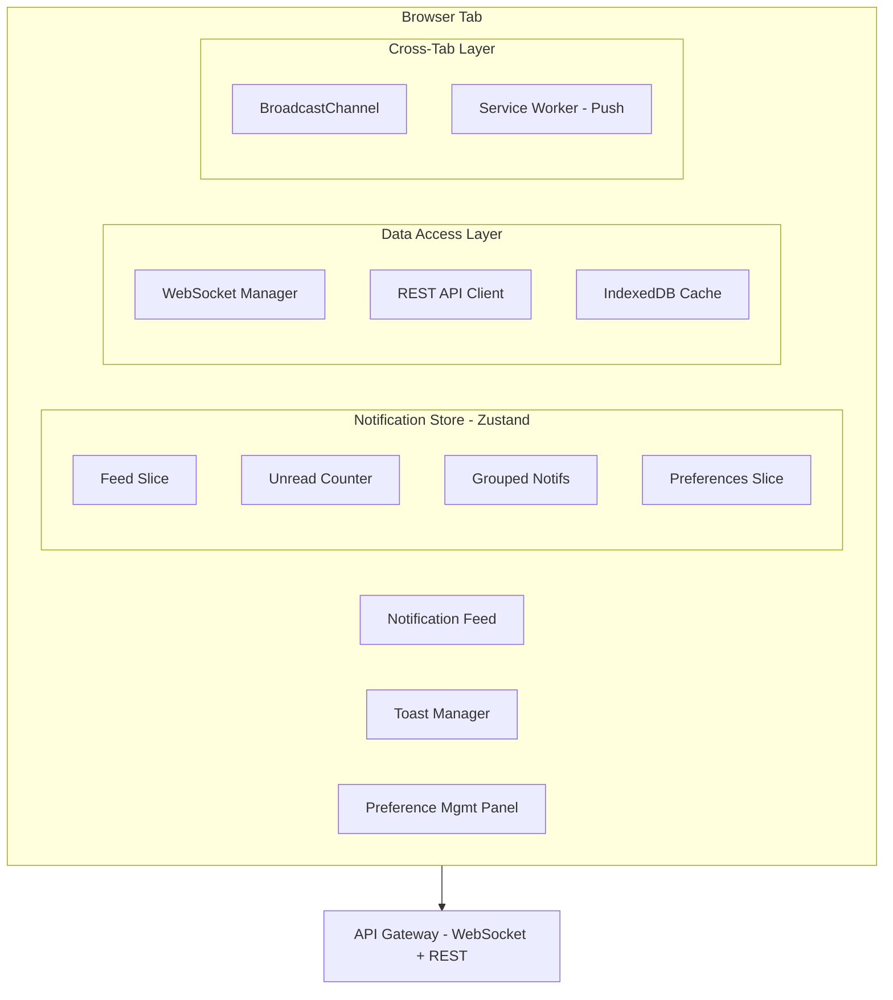

## Problem Statement

A notification system is the central nervous system of any modern product — it connects backend events to user attention across multiple channels (in-app, push, email, SMS) with millisecond latency requirements. Unlike a simple message bus, the frontend of a notification system must orchestrate real-time delivery via WebSocket/SSE, manage complex read/unread state across tabs and devices, batch related events into human-readable groups ("Alice and 5 others liked your post"), and respect per-user delivery preferences — all while preventing notification fatigue through intelligent rate limiting.

**Scope:** This design covers the frontend architecture: in-app notification feed, toast/snackbar system, push notification registration and handling, preference management UI, cross-tab synchronization, and deep-linking. Backend fanout, delivery pipelines, and email/SMS rendering are out of scope.

**What makes this architecturally interesting:** The notification system touches nearly every frontend concern simultaneously — real-time data (WebSocket lifecycle), background processing (Service Workers), cross-origin security (VAPID push), accessibility (live regions for dynamic content), and state synchronization (cross-tab badge updates via BroadcastChannel).

**Real-world examples:** Facebook Notifications (grouped reactions, multi-channel), Slack (channel-level muting, thread notifications, presence-aware delivery), Discord (mention-level granularity, DND schedules), GitHub (subscription model with "participating" vs "watching"), Linear (triage-first design, snooze, inbox-zero UX), Notion (block-level mentions, page updates, in-app + email digest).

---

## Requirements Exploration

### Functional Requirements

1. Users receive real-time in-app notifications via persistent WebSocket connection with SSE fallback.
2. Notification feed supports infinite scroll with cursor-based pagination (50 items per page).
3. Related notifications are grouped/batched (e.g., "5 people liked your post") with expand-to-see-all.
4. Users can mark individual notifications as read, or mark-all-as-read in a single action.
5. Unread badge counter is synchronized across all open tabs within 500ms.
6. Users manage notification preferences per category (mentions, reactions, comments) and per channel (in-app, push, email, SMS).
7. Quiet hours configuration suppresses push/SMS during user-defined time windows.
8. Push notifications are registered via Web Push API with VAPID keys, surviving browser restarts.
9. Toast/snackbar system displays transient notifications with configurable auto-dismiss (5s default), stacking (max 3 visible), and action buttons.
10. Tapping/clicking a notification deep-links to the relevant screen/context with correct scroll position.
11. Rich notifications support images, avatars, action buttons (approve/reject), and progress indicators.
12. Rate limiting prevents notification fatigue: max 5 toasts/minute, max 1 push per 30s per source.

### Non-Functional Requirements

| Category      | Requirement                     | Target                                                      |
| ------------- | ------------------------------- | ----------------------------------------------------------- |
| Performance   | Time from event to in-app toast | < 300ms (p95)                                               |
| Performance   | Feed initial load (TTI)         | < 1.5s on 4G mid-range                                      |
| Performance   | Mark-as-read round-trip         | < 200ms optimistic                                          |
| Bundle Size   | Notification module (lazy)      | < 45KB gzipped                                              |
| Reliability   | WebSocket reconnection          | Auto-reconnect with exponential backoff, max 30s            |
| Reliability   | Offline notification queue      | Persist up to 100 notifications in IndexedDB                |
| Scalability   | Concurrent connections per user | Up to 10 tabs without duplicate delivery                    |
| Accessibility | Screen reader announcements     | All new notifications announced via `aria-live`             |
| Cross-tab     | Badge sync latency              | < 500ms via BroadcastChannel                                |
| Push          | Service Worker registration     | Survives browser restart, auto-refreshes VAPID subscription |

---

## Capacity Estimation & Constraints

**Traffic assumptions (per-user basis for a product with 50M DAU):**

- Average user receives 40 notifications/day → ~1,650/hour platform-wide per 100K users
- 80% are in-app only, 15% trigger push, 5% trigger email
- Read:write ratio for notification state: 10:1 (users check feed 10x for every notification generated)
- Peak multiplier: 3x during product launches or viral moments

**Client-side data budget:**

- Single notification entity: ~800 bytes (JSON with avatar URL, message, metadata, actions)
- Feed page (50 items): ~40KB uncompressed, ~12KB gzipped
- In-memory cache limit: 200 notifications (160KB) before LRU eviction
- IndexedDB offline store: 5MB budget (~6,000 notifications with metadata)

**WebSocket overhead:**

- Heartbeat: 1 ping/30s = 2.88KB/day per connection
- Average notification payload: 500 bytes
- Peak burst: 20 notifications/second during high-activity periods

**Push notification constraints:**

- VAPID subscription payload: ~300 bytes (endpoint + keys)
- Push payload limit: 4KB (encrypted), demands compact payloads
- Service Worker activation cold start: 50–200ms

**These constraints drive architecture decisions:** The 200-notification in-memory limit motivates cursor pagination over offset. The 4KB push payload limit requires server-side message truncation with deep-link for full content. The 10-tab concurrent requirement necessitates BroadcastChannel-based deduplication.

---

## Architecture / High-Level Design

### Rendering Strategy

**CSR with shell pre-rendering.** Notifications are inherently dynamic and user-specific — SSR provides no caching benefit. The notification module is a lazy-loaded panel within an app shell that's statically generated. The feed itself renders client-side after WebSocket connection establishes and initial feed fetch completes.

Justification: Notification content is 100% authenticated and personalized. SSR would require per-request rendering with no CDN cacheability. A pre-rendered shell with loading skeleton provides perceived performance while the client hydrates.

### Navigation Model

SPA with route-based code splitting. The notification panel is a slide-over drawer (not a separate route) triggered from a global header icon. The preference management page is a dedicated route (`/settings/notifications`). Deep-linking from notifications uses `router.push()` with scroll restoration.

URL state: `/notifications` for full-page feed view (optional), query params for filtering (`?filter=unread`). Notification IDs are NOT in URLs — deep-links point to the referenced entity (e.g., `/posts/123#comment-456`).

### System Architecture Diagram



### Component Architecture

```
<App>
├── <Header>
│   └── <NotificationBell>              // Client: badge counter, opens panel
│       └── <UnreadBadge />             // Client: animated counter
├── <NotificationPanel>                 // Client: slide-over drawer
│   ├── <NotificationFilterBar />       // Client: All | Unread | Mentions
│   ├── <NotificationFeed>             // Client: virtualized list
│   │   ├── <NotificationGroup />       // Client: grouped items
│   │   │   └── <NotificationItem />   // Client: single notification
│   │   └── <NotificationItem />       // Client: ungrouped item
│   └── <MarkAllReadButton />          // Client: bulk action
├── <ToastContainer>                   // Client: positioned fixed
│   └── <ToastItem />                  // Client: individual toast
├── <NotificationPreferences>          // Route: /settings/notifications
│   ├── <CategoryToggleGrid />         // Client: per-category controls
│   ├── <ChannelToggleGrid />          // Client: per-channel controls
│   └── <QuietHoursConfig />           // Client: time picker
└── <ServiceWorkerRegistrar />         // Client: push subscription mgmt
```

### State Management Strategy

| State Type                 | Location                              | Justification                                        |
| -------------------------- | ------------------------------------- | ---------------------------------------------------- |
| Notification feed data     | Zustand + IndexedDB                   | Server state cached client-side, persisted offline   |
| Unread count               | Zustand (synced via BroadcastChannel) | Cross-tab reactive, derived from feed                |
| Toast queue                | Zustand (ephemeral)                   | UI-only, no persistence needed                       |
| WebSocket connection state | Zustand                               | UI reflects connection status                        |
| User preferences           | React Query (server state)            | Fetched from API, cached with stale-while-revalidate |
| Push subscription          | Service Worker + IndexedDB            | Survives page reload, SW-accessible                  |
| Read/unread state          | Zustand + optimistic update           | Immediate UI feedback, reconciled on server response |
| Scroll position            | URL state (sessionStorage fallback)   | Restored on back-navigation                          |

---

## Data Model / Entities

```typescript
/** Core notification entity as received from API */
interface Notification {
  id: string; // UUID v7 (time-sortable)
  type: NotificationType; // Discriminated union for rendering
  category: NotificationCategory; // For preference matching
  actorIds: string[]; // Users who triggered (supports grouping)
  primaryActor: ActorSummary; // First/most-recent actor for display
  additionalActorCount: number; // "and 5 others" — server-computed
  targetEntity: EntityReference; // What was acted upon
  message: NotificationMessage; // Structured message with template
  deepLink: string; // Relative URL for navigation
  imageUrl?: string; // Rich notification image
  actions?: NotificationAction[]; // CTA buttons (max 2)
  progress?: ProgressIndicator; // For long-running operations
  groupKey?: string; // Server-assigned grouping key
  isRead: boolean; // Read state
  isArchived: boolean; // Soft-deleted from feed
  createdAt: string; // ISO 8601 timestamp
  expiresAt?: string; // Auto-archive after this time
  channels: DeliveryChannel[]; // Which channels delivered this
}

type NotificationType =
  | "mention"
  | "reaction"
  | "comment"
  | "reply"
  | "share"
  | "follow"
  | "assignment"
  | "status_change"
  | "system"
  | "reminder";

type NotificationCategory =
  | "social" // reactions, follows, shares
  | "discussion" // comments, replies, mentions
  | "workflow" // assignments, status changes
  | "system" // platform announcements
  | "marketing"; // product updates (lowest priority)

type DeliveryChannel = "in_app" | "push" | "email" | "sms";

interface ActorSummary {
  id: string;
  displayName: string;
  avatarUrl: string;
  isVerified: boolean;
}

interface EntityReference {
  id: string;
  type: "post" | "comment" | "project" | "task" | "document" | "channel";
  title: string; // Truncated to 80 chars
  parentId?: string; // For nested entities (comment → post)
}

interface NotificationMessage {
  template: string; // "{{actor}} liked your {{entity}}"
  plainText: string; // Pre-rendered server-side for SR
  richText?: string; // HTML-safe markup (sanitized server-side)
}

interface NotificationAction {
  id: string;
  label: string; // "Approve" | "Reject" | "View"
  variant: "primary" | "secondary" | "destructive";
  endpoint: string; // API endpoint for action
  method: "POST" | "PUT" | "PATCH";
  confirmRequired: boolean; // Show confirmation dialog before executing
}

interface ProgressIndicator {
  current: number;
  total: number;
  label: string; // "Uploading 3 of 7 files"
  isIndeterminate: boolean;
}

/** Grouped notification (client-side aggregation of server groups) */
interface NotificationGroup {
  groupKey: string;
  notifications: Notification[];
  latestAt: string; // Most recent notification timestamp
  isExpanded: boolean; // UI state: show individual items
  summary: string; // "Alice and 4 others liked your post"
}

/** User notification preferences */
interface NotificationPreferences {
  userId: string;
  channels: Record<DeliveryChannel, ChannelConfig>;
  categories: Record<NotificationCategory, CategoryConfig>;
  quietHours: QuietHoursConfig;
  digestFrequency: "realtime" | "hourly" | "daily" | "weekly";
  updatedAt: string;
}

interface ChannelConfig {
  enabled: boolean;
  priority: number; // Lower = tried first in fallback chain
}

interface CategoryConfig {
  channels: Partial<Record<DeliveryChannel, boolean>>; // Per-category channel overrides
  muted: boolean; // Suppress all for this category
  muteUntil?: string; // Temporary mute (ISO timestamp)
}

interface QuietHoursConfig {
  enabled: boolean;
  startTime: string; // "22:00" (local time)
  endTime: string; // "08:00" (local time)
  timezone: string; // IANA timezone identifier
  allowUrgent: boolean; // Let 'urgent' priority through
  daysOfWeek: number[]; // 0=Sun, 6=Sat
}

/** WebSocket message types */
type WSInboundMessage =
  | { type: "notification:new"; payload: Notification }
  | {
      type: "notification:updated";
      payload: Partial<Notification> & { id: string };
    }
  | { type: "notification:read"; payload: { ids: string[] } }
  | { type: "badge:sync"; payload: { unreadCount: number } }
  | { type: "preferences:changed"; payload: Partial<NotificationPreferences> }
  | {
      type: "connection:ack";
      payload: { connectionId: string; serverTime: string };
    };

type WSOutboundMessage =
  | { type: "subscribe"; payload: { channels: string[] } }
  | { type: "mark_read"; payload: { notificationIds: string[] } }
  | { type: "mark_all_read"; payload: { before: string } }
  | { type: "ping" };

/** Zustand store shape */
interface NotificationStore {
  // Feed state
  notifications: Map<string, Notification>;
  groups: Map<string, NotificationGroup>;
  feedOrder: string[]; // Ordered IDs for rendering
  cursor: string | null; // Pagination cursor
  hasMore: boolean;
  isLoading: boolean;

  // Unread state
  unreadCount: number;
  unreadByCategory: Record<NotificationCategory, number>;

  // Connection state
  wsStatus: "connecting" | "connected" | "reconnecting" | "disconnected";
  lastSyncTimestamp: string;

  // Toast state
  toastQueue: ToastItem[];
  visibleToasts: ToastItem[]; // Max 3

  // Actions
  addNotification: (notification: Notification) => void;
  markAsRead: (ids: string[]) => void;
  markAllAsRead: () => void;
  loadMore: () => Promise<void>;
  dismissToast: (id: string) => void;
}

interface ToastItem {
  id: string;
  notification: Notification;
  priority: "low" | "medium" | "high" | "urgent";
  autoDismissMs: number; // 5000 default, 0 for persistent
  enteredAt: number; // Date.now() for animation timing
  actions?: NotificationAction[];
}

/** Push subscription stored in IndexedDB */
interface PushSubscriptionRecord {
  endpoint: string;
  expirationTime: number | null;
  keys: {
    p256dh: string;
    auth: string;
  };
  registeredAt: string;
  lastRefreshedAt: string;
  userAgent: string; // For debugging stale subscriptions
}
```

---

## Interface Definition (API)

### REST Endpoints

```typescript
/** GET /api/notifications — Paginated feed */
interface GetNotificationsRequest {
  cursor?: string; // Opaque cursor from previous response
  limit?: number; // Default: 50, max: 100
  filter?: "all" | "unread" | "mentions";
  category?: NotificationCategory;
}

interface GetNotificationsResponse {
  notifications: Notification[];
  nextCursor: string | null; // null = no more pages
  unreadCount: number; // Always returned for badge sync
  serverTime: string; // For clock drift compensation
}
// Cache-Control: private, no-cache (always revalidate — personalized data)

/** PATCH /api/notifications/read — Mark notifications as read */
interface MarkReadRequest {
  notificationIds: string[]; // Max 100 per request
}

interface MarkReadResponse {
  updated: number;
  unreadCount: number; // New total after update
}

/** POST /api/notifications/read-all — Mark all as read */
interface MarkAllReadRequest {
  before: string; // ISO timestamp — only mark items before this
  category?: NotificationCategory; // Optional category scope
}

interface MarkAllReadResponse {
  updated: number;
  unreadCount: number;
}

/** POST /api/notifications/:id/action — Execute notification action */
interface ExecuteActionRequest {
  actionId: string;
  idempotencyKey: string; // Client-generated UUID for safe retries
}

interface ExecuteActionResponse {
  success: boolean;
  notification: Notification; // Updated notification state
}

/** GET /api/notifications/preferences — User preferences */
interface GetPreferencesResponse {
  preferences: NotificationPreferences;
}
// Cache-Control: private, max-age=60

/** PUT /api/notifications/preferences — Update preferences */
interface UpdatePreferencesRequest {
  preferences: Partial<NotificationPreferences>;
}

interface UpdatePreferencesResponse {
  preferences: NotificationPreferences;
}

/** POST /api/push/subscribe — Register push subscription */
interface PushSubscribeRequest {
  subscription: PushSubscriptionJSON; // From PushSubscription.toJSON()
  deviceName?: string;
  userAgent: string;
}

interface PushSubscribeResponse {
  subscriptionId: string;
  expiresAt: string | null;
}

/** DELETE /api/push/subscribe/:subscriptionId — Unregister */
// No request body, 204 on success
```

### WebSocket Contract

```typescript
// Connection: wss://api.example.com/ws/notifications
// Auth: Bearer token in first message after connection

// Client → Server: Authentication
{ type: 'auth', payload: { token: string; tabId: string } }

// Server → Client: Connection acknowledged
{ type: 'connection:ack', payload: { connectionId: string; serverTime: string } }

// Client → Server: Heartbeat (every 30s)
{ type: 'ping' }

// Server → Client: Heartbeat response
{ type: 'pong', payload: { serverTime: string } }

// Server → Client: New notification
{ type: 'notification:new', payload: Notification }

// Client → Server: Mark as read (fire-and-forget with optimistic UI)
{ type: 'mark_read', payload: { notificationIds: string[] } }
```

<Callout>
  Use cursor-based pagination over offset because notifications are inserted in
  real-time. Offset pagination causes duplicates/gaps when new items arrive
  between page fetches. The cursor is an opaque encoded timestamp + ID pair
  ensuring stable ordering regardless of insertions.
</Callout>

### Error Responses

```typescript
interface ApiError {
  code: string; // Machine-readable: 'RATE_LIMITED'
  message: string; // Human-readable description
  retryAfter?: number; // Seconds (for rate limiting)
  details?: Record<string, unknown>;
}

// Rate limits:
// - GET /notifications: 60 req/min per user
// - PATCH /notifications/read: 30 req/min per user
// - POST /notifications/read-all: 5 req/min per user
// - POST /push/subscribe: 10 req/hour per user
```

---

## Caching Strategy

### Client-Side Caching

**In-memory (Zustand store):**

- Feed notifications: Max 200 items in `Map<string, Notification>`
- LRU eviction: When 201st item arrives, evict oldest read notification (keep unread)
- Group cache: Max 50 groups, evicted by `latestAt` timestamp
- Preferences: Cached with 60s staleness window (refetch on panel open)

**IndexedDB (offline persistence):**

```typescript
// Schema: notifications-db v1
interface NotificationDB {
  notifications: {
    key: string; // notification.id
    value: Notification;
    indexes: {
      "by-created": string; // createdAt for range queries
      "by-read": [boolean, string]; // [isRead, createdAt] compound index
      "by-category": string;
    };
  };
  metadata: {
    key: string; // 'lastSync' | 'cursor' | 'unreadCount'
    value: unknown;
  };
  pushSubscription: {
    key: string; // 'active'
    value: PushSubscriptionRecord;
  };
}
```

- Storage budget: 5MB (enforced via navigator.storage.estimate() check)
- TTL per notification: 30 days from `createdAt` — cleanup on app start
- Write strategy: Batch writes every 2s using requestIdleCallback

**Service Worker cache:**

- App shell (HTML, critical CSS, core JS): Cache-first, updated in background
- Notification icons/avatars: Stale-while-revalidate, max 500 entries, 7-day TTL
- API responses: Network-first (personalized, not cacheable)

### CDN & Edge Caching

- Static notification preference UI shell: `public, max-age=3600, s-maxage=86400`
- Notification template assets (icons, sounds): `public, max-age=604800, immutable`
- API responses (GET /notifications): NOT CDN-cached (private, personalized)
- Push notification VAPID public key endpoint: `public, max-age=86400` (changes rarely)

Invalidation: Template assets use content-hash filenames (immutable cache). Preference UI shell invalidated on deploy via asset manifest.

### Cache Coherence

**Cross-tab sync via BroadcastChannel:**

```typescript
const channel = new BroadcastChannel("notifications-sync");

// Tab A marks notification as read:
channel.postMessage({
  type: "MARK_READ",
  payload: { ids: ["notif-123"], unreadCount: 7 },
});

// All other tabs receive and update their local store:
channel.onmessage = (event) => {
  if (event.data.type === "MARK_READ") {
    store.getState().syncReadState(event.data.payload);
  }
};
```

**Optimistic update reconciliation:**

1. User marks as read → UI updates immediately (optimistic)
2. REST/WS confirms → no-op (already in correct state)
3. REST/WS rejects (409 conflict) → rollback: restore unread state, show error toast
4. Network timeout (5s) → keep optimistic state, queue retry in background

**Cache versioning:** On deploy, Service Worker activates new cache version. Old caches are deleted. In-memory Zustand state is rehydrated from IndexedDB (which survives SW updates).

**Stale detection:** Every WS reconnection sends `lastSyncTimestamp`. Server responds with any missed notifications since that timestamp, ensuring the client catches up without full reload.

---

## Rendering & Performance Deep Dive

### Critical Rendering Path

**Tier 1 (0–500ms): App shell + notification icon**

- Pre-rendered HTML shell with header containing notification bell icon
- Critical CSS inlined (bell icon, badge counter styles)
- Skeleton placeholder for notification panel (hidden until interaction)

**Tier 2 (500ms–1.5s): Notification module on interaction**

- Notification panel code loaded on first bell icon hover (prefetch) or click (load)
- WebSocket connection initiated on module load
- Initial feed fetch (first 50 notifications) starts concurrently with WS handshake

**Tier 3 (deferred): Heavy features**

- Preference management page: Route-based code split
- Service Worker registration: After main content interactive (requestIdleCallback)
- IndexedDB sync: Background after feed is rendered
- Rich notification media (images): Lazy-loaded with Intersection Observer

### Core Web Vitals Targets

| Metric | Target  | Strategy                                                                  |
| ------ | ------- | ------------------------------------------------------------------------- |
| LCP    | < 1.2s  | App shell with pre-rendered bell icon; feed content is below fold         |
| INP    | < 100ms | Mark-as-read is optimistic (no network wait); toast dismiss is immediate  |
| CLS    | < 0.05  | Fixed-height notification items (72px); toast container is fixed-position |
| FCP    | < 800ms | Inlined critical CSS for header + bell; no blocking JS for shell          |
| TTFB   | < 200ms | Shell served from CDN edge; no server rendering needed                    |

### List Virtualization

The notification feed uses virtualized rendering for the infinite scroll list:

- **Library:** `@tanstack/react-virtual` (8KB gzipped, framework-agnostic core)
- **Overscan:** 5 items above and below viewport (balances smooth scroll vs DOM count)
- **Item height:** Fixed 72px for standard notifications, measured dynamically for expanded groups
- **Scroll restoration:** `sessionStorage` stores scroll offset keyed by feed filter state
- **Dynamic measurement:** `ResizeObserver` on expanded groups, update virtualizer after animation completes

```typescript
const virtualizer = useVirtualizer({
  count: feedOrder.length,
  getScrollElement: () => scrollRef.current,
  estimateSize: (index) => {
    const id = feedOrder[index];
    const group = groups.get(id);
    return group?.isExpanded ? group.notifications.length * 72 + 48 : 72;
  },
  overscan: 5,
});
```

### Image / Media Optimization

- **Notification avatars:** 40×40px, served as WebP with AVIF negotiation, `loading="lazy"`
- **Rich notification images:** Max 320×180px, responsive `srcset` with 1x/2x variants
- **Placeholder:** 8-byte BlurHash decoded client-side during load (40×40 decodes in < 1ms)
- **Avatar batch preloading:** On feed load, preload first 10 avatars via `<link rel="preload">`

### Bundle Optimization

| Module                  | Size (gzipped) | Load Trigger                         |
| ----------------------- | -------------- | ------------------------------------ |
| Core notification store | 8KB            | App init (always needed for badge)   |
| Notification panel UI   | 22KB           | Bell icon hover/click                |
| WebSocket manager       | 6KB            | Panel open                           |
| Toast system            | 5KB            | App init (toasts can appear anytime) |
| Preference management   | 15KB           | Route navigation                     |
| Push registration       | 4KB            | requestIdleCallback after TTI        |

Total notification system: 60KB across all chunks. Only 13KB loaded eagerly (store + toasts).

---

## Security Deep Dive

### Threat Model

| Threat                       | Attack Vector                                                  | Impact                                                      | Mitigation                                                                                                       |
| ---------------------------- | -------------------------------------------------------------- | ----------------------------------------------------------- | ---------------------------------------------------------------------------------------------------------------- |
| Notification spoofing        | Compromised WebSocket injects fake notifications               | User trusts fraudulent content, clicks malicious deep-links | WebSocket messages signed with HMAC; verify `connectionId` matches server-issued ID                              |
| XSS via notification content | Attacker crafts notification with malicious `richText` payload | Cookie theft, session hijack                                | Server-side DOMPurify sanitization; client renders with `textContent` only, never `innerHTML`                    |
| Push subscription hijack     | Attacker registers their endpoint for victim's notifications   | Receives victim's notifications on their device             | Subscription tied to authenticated session; re-validate on each push delivery                                    |
| Notification timing oracle   | Attacker monitors badge count changes via SharedWorker         | Infers user activity patterns (online times, engagement)    | Rate-limit badge updates to 1/second; no external access to BroadcastChannel                                     |
| Deep-link open redirect      | Crafted `deepLink` field redirects to attacker site            | Phishing, credential theft                                  | Validate deep-links against allowlist of internal route patterns; reject absolute URLs and `javascript:` schemes |

### Push Notification Security

**VAPID key management:**

```typescript
// Service Worker: Validate push event origin
self.addEventListener("push", (event) => {
  // Only process if the push came from our application server
  // The browser validates VAPID signature automatically
  const payload = event.data?.json();
  if (!payload || !payload.notificationId) {
    return; // Discard malformed payloads
  }

  // Validate payload structure before displaying
  if (!isValidNotificationPayload(payload)) {
    console.error("Invalid push payload structure");
    return;
  }

  event.waitUntil(
    self.registration.showNotification(payload.title, {
      body: payload.body,
      icon: payload.icon,
      data: { deepLink: sanitizeDeepLink(payload.deepLink) },
      tag: payload.groupKey, // Replaces existing notification with same tag
    }),
  );
});

function sanitizeDeepLink(link: string): string {
  // Only allow relative paths starting with /
  if (!link.startsWith("/") || link.includes("//")) {
    return "/notifications"; // Fallback to notification feed
  }
  return link;
}
```

**Subscription lifecycle:**

- Registration requires authenticated session (auth token validated server-side)
- Subscription refreshed every 7 days (VAPID subscriptions can expire)
- On logout: unsubscribe from push AND delete subscription server-side
- Stale subscription cleanup: Server-side job removes subscriptions with 3+ consecutive delivery failures

### XSS in Notification Content

<Callout>
  Never use `dangerouslySetInnerHTML` for notification messages. Even with
  server-side sanitization, defense-in-depth demands client-side rendering via
  structured templates with interpolated text nodes only.
</Callout>

```typescript
// SAFE: Structured template rendering
function renderNotificationMessage(message: NotificationMessage): ReactNode {
  // Use plainText for screen readers, structured rendering for visual
  return (
    <span aria-label={message.plainText}>
      {parseTemplate(message.template, {
        actor: <strong>{actor.displayName}</strong>,
        entity: <span className="text-muted">{entity.title}</span>,
      })}
    </span>
  );
}

// NEVER: Raw HTML injection
// ❌ <div dangerouslySetInnerHTML={{ __html: message.richText }} />
```

**Content Security Policy directives for notification system:**

```
default-src 'self';
connect-src 'self' wss://api.example.com;
img-src 'self' https://cdn.example.com https://avatars.example.com;
script-src 'self' 'nonce-{random}';
worker-src 'self';
```

---

## Scalability & Reliability

### Scalability Patterns

**Cursor-based pagination:** Notifications are ordered by `createdAt` DESC. Cursor encodes `(timestamp, id)` pair — stable even when new notifications arrive between page fetches. Unlike offset, cursor pagination has O(1) seek time regardless of page depth.

**Feed virtualization:** Only 15–20 DOM nodes rendered at any time (visible + overscan), regardless of feed length. Supports 10,000+ notifications without memory pressure.

**Notification grouping (client-side):**

```typescript
function groupNotifications(
  items: Notification[],
): (Notification | NotificationGroup)[] {
  const groups = new Map<string, Notification[]>();

  for (const item of items) {
    if (item.groupKey) {
      const existing = groups.get(item.groupKey) ?? [];
      existing.push(item);
      groups.set(item.groupKey, existing);
    }
  }

  // Server provides groupKey — client merely renders the grouping
  // This avoids expensive client-side deduplication logic
  return items.reduce(
    (acc, item) => {
      if (item.groupKey && groups.get(item.groupKey)!.length > 1) {
        if (!acc.some((x) => "groupKey" in x && x.groupKey === item.groupKey)) {
          acc.push({
            groupKey: item.groupKey,
            notifications: groups.get(item.groupKey)!,
            latestAt: groups.get(item.groupKey)![0].createdAt,
            isExpanded: false,
            summary: buildGroupSummary(groups.get(item.groupKey)!),
          });
        }
      } else {
        acc.push(item);
      }
      return acc;
    },
    [] as (Notification | NotificationGroup)[],
  );
}
```

**Lazy channel loading:** Only load the WebSocket manager when the notification panel opens. Toast system uses a lightweight polling fallback (30s interval) until WS connects.

### Failure Handling

| Failure Mode                 | Detection                         | User Experience                                              | Recovery                                                                                                 |
| ---------------------------- | --------------------------------- | ------------------------------------------------------------ | -------------------------------------------------------------------------------------------------------- |
| WebSocket disconnect         | `onclose` event                   | Yellow banner: "Reconnecting..."                             | Exponential backoff: 1s, 2s, 4s, 8s, 16s, 30s max. After 5 failures, fall back to polling (30s interval) |
| API fetch failure (feed)     | HTTP 5xx or network error         | Show cached feed from IndexedDB + "Unable to refresh" banner | Retry with backoff. If IndexedDB empty, show empty state with retry button                               |
| Push registration failure    | `PushManager.subscribe()` rejects | Silent — don't block user. Log to monitoring                 | Retry on next app start. After 3 failures across sessions, show "Enable push" prompt in settings         |
| Mark-as-read failure         | REST returns 4xx/5xx              | Rollback optimistic update, restore unread badge             | Queue failed operations, retry batch on next successful request                                          |
| BroadcastChannel unavailable | Feature detection on init         | Graceful: tabs operate independently, minor badge desync     | Fall back to `localStorage` event (`storage` event fires cross-tab)                                      |
| IndexedDB quota exceeded     | `QuotaExceededError` on write     | Silent — in-memory cache still works                         | Delete notifications older than 14 days, then retry. If still full, clear all and re-sync                |

### Resilience Patterns

**Outbox pattern for offline writes:**

```typescript
class NotificationOutbox {
  private queue: QueuedAction[] = [];

  async enqueue(action: QueuedAction): Promise<void> {
    this.queue.push({ ...action, enqueuedAt: Date.now(), retries: 0 });
    await this.persistToIndexedDB();
    this.flush(); // Attempt immediate delivery
  }

  async flush(): Promise<void> {
    if (!navigator.onLine) return;

    const pending = this.queue.filter((a) => a.retries < 3);
    for (const action of pending) {
      try {
        await this.execute(action);
        this.queue = this.queue.filter((a) => a.id !== action.id);
      } catch (err) {
        action.retries++;
        action.lastError = err.message;
      }
    }
    await this.persistToIndexedDB();
  }
}
```

**Request deduplication:** Multiple rapid "mark as read" calls (e.g., user scrolls quickly) are debounced into a single batch request with a 300ms window.

**Circuit breaker for WebSocket:** After 5 consecutive connection failures within 60 seconds, stop reconnection attempts for 5 minutes. Show "Notifications may be delayed" banner. Resume on user interaction (tab focus).

### Graceful Degradation

| Condition              | Feature Reduction                                       | User Communication                                       |
| ---------------------- | ------------------------------------------------------- | -------------------------------------------------------- |
| No WebSocket support   | Fall back to SSE, then 30s polling                      | None (transparent)                                       |
| No Service Worker      | Push notifications disabled                             | Settings page shows "Push not available in this browser" |
| No BroadcastChannel    | Cross-tab sync disabled                                 | Badges may briefly desync                                |
| Slow connection (< 2G) | Disable images in notifications, reduce page size to 20 | None (responsive)                                        |
| JavaScript disabled    | Notification bell hidden                                | No notification experience (requires JS)                 |

---

## Accessibility Deep Dive

### Live Region Architecture

```tsx
// Notification announcer — announces new notifications to screen readers
<div
  role="status"
  aria-live="polite"
  aria-atomic="false"
  className="sr-only"
>
  {latestNotification && (
    <span>{latestNotification.message.plainText}</span>
  )}
</div>

// Toast announcer — uses assertive for time-sensitive toasts
<div
  role="alert"
  aria-live="assertive"
  className="sr-only"
>
  {urgentToast && <span>{urgentToast.notification.message.plainText}</span>}
</div>
```

### Notification Feed Semantics

```tsx
<section aria-label="Notifications" role="feed" aria-busy={isLoading}>
  {notifications.map((notification, index) => (
    <article
      key={notification.id}
      role="article"
      aria-setsize={-1} // Unknown total (infinite scroll)
      aria-posinset={index + 1}
      aria-label={notification.message.plainText}
      aria-describedby={`notif-time-${notification.id}`}
      data-read={notification.isRead}
      tabIndex={0}
    >
      {/* Notification content */}
      <time
        id={`notif-time-${notification.id}`}
        dateTime={notification.createdAt}
      >
        {relativeTime(notification.createdAt)}
      </time>
    </article>
  ))}
</section>
```

### Keyboard Navigation

| Key                    | Action                                        | Context              |
| ---------------------- | --------------------------------------------- | -------------------- |
| `Tab`                  | Move to next notification                     | Feed navigation      |
| `Shift+Tab`            | Move to previous notification                 | Feed navigation      |
| `Enter` / `Space`      | Activate notification (navigate to deep-link) | Focused notification |
| `r`                    | Mark focused notification as read             | Focused notification |
| `Shift+R`              | Mark all as read                              | Feed focused         |
| `Escape`               | Close notification panel                      | Panel open           |
| `Delete` / `Backspace` | Archive notification                          | Focused notification |
| `Arrow Up/Down`        | Navigate within notification group            | Expanded group       |

### Focus Management

- **Panel open:** Focus moves to first notification or filter bar. Focus trapped within panel.
- **Panel close (Escape):** Focus returns to bell icon.
- **Toast appears:** Does NOT steal focus (would disrupt user task). Announced via `aria-live`.
- **Mark-all-read:** Focus remains on button. Announcement: "\{n\} notifications marked as read."
- **Infinite scroll load:** Focus preserved on current item. New items do not cause focus jump.
- **Deep-link navigation:** Focus moves to the target content after navigation completes.

### Motion and Preferences

```typescript
const prefersReducedMotion = window.matchMedia(
  "(prefers-reduced-motion: reduce)",
).matches;

// Toast animations
const toastAnimation = prefersReducedMotion
  ? { enter: "opacity-0 → opacity-100", duration: "0ms" } // Instant appear
  : { enter: "translateX(100%) → translateX(0)", duration: "200ms" };

// Badge counter
const badgeAnimation = prefersReducedMotion
  ? "none"
  : "scale(1.2) → scale(1) over 150ms"; // Subtle bounce on increment
```

<Callout>
  The notification bell badge must have `aria-label` dynamically updated:
  "Notifications, 7 unread" — not just a visual number. Screen reader users
  cannot see the badge color/animation that conveys urgency.
</Callout>

---

## Monitoring & Observability

### Client-Side Metrics

| Metric                                        | Collection                                         | Alert Threshold        |
| --------------------------------------------- | -------------------------------------------------- | ---------------------- |
| Notification delivery latency (event → toast) | Custom timer: WS message timestamp vs `Date.now()` | p95 > 500ms            |
| Feed load time                                | Performance mark on first paint of feed items      | p75 > 2s               |
| WebSocket connection uptime                   | Track connected vs total session time              | < 95% over 1hr window  |
| Push permission grant rate                    | Event on `Notification.requestPermission()` result | < 30% (investigate UX) |
| Mark-as-read success rate                     | Track optimistic rollbacks                         | > 2% rollback rate     |
| Toast dismissal rate (manual vs auto)         | Event per toast lifecycle                          | Informational only     |
| BroadcastChannel sync failures                | Error counter on postMessage                       | > 5/min per user       |
| IndexedDB write failures                      | Error counter on transaction                       | Any occurrence         |

### Error Tracking

```typescript
// WebSocket-specific error tracking
wsManager.on("error", (error) => {
  errorTracker.capture({
    category: "websocket",
    error,
    context: {
      readyState: ws.readyState,
      reconnectAttempts: wsManager.reconnectCount,
      lastPongAt: wsManager.lastPongTimestamp,
      tabId: sessionTabId,
    },
  });
});

// Push subscription error tracking
async function registerPush(): Promise<void> {
  try {
    const subscription = await registration.pushManager.subscribe({
      userVisibleOnly: true,
      applicationServerKey: urlBase64ToUint8Array(VAPID_PUBLIC_KEY),
    });
    await sendSubscriptionToServer(subscription);
  } catch (error) {
    errorTracker.capture({
      category: "push_registration",
      error,
      context: {
        permissionState: Notification.permission,
        serviceWorkerState: registration.active?.state,
      },
    });
  }
}
```

### Day-1 Dashboard

| Panel               | Metric                                                   | Visualization              |
| ------------------- | -------------------------------------------------------- | -------------------------- |
| 1. Delivery Latency | p50/p75/p95 event-to-render time                         | Time series (1min buckets) |
| 2. WebSocket Health | Connected users / reconnection rate                      | Gauge + line chart         |
| 3. Feed Engagement  | Open rate, scroll depth, mark-read rate                  | Funnel chart               |
| 4. Push Metrics     | Permission grant rate, delivery success, click-through   | Stacked bar                |
| 5. Error Budget     | Client error rate by category (WS/API/push/storage)      | Pie chart + time series    |
| 6. Cross-Tab Sync   | BroadcastChannel message rate, sync failures             | Counter + rate             |
| 7. Toast Fatigue    | Toasts shown/dismissed/interacted per session            | Histogram                  |
| 8. Performance      | CWV scores (LCP, INP, CLS) for notification interactions | Percentile chart           |

### Alerting Thresholds

| Alert                 | Condition                               | Severity | Action                                         |
| --------------------- | --------------------------------------- | -------- | ---------------------------------------------- |
| Delivery degradation  | p95 latency > 1s for 5 min              | Warning  | Investigate WS infra                           |
| WebSocket storm       | Reconnection rate > 100/min             | Critical | Check server capacity, enable polling fallback |
| Push delivery failure | > 10% failures for 15 min               | Warning  | Check VAPID key validity, APNs/FCM status      |
| Client error spike    | Error rate > 5% for 5 min               | Critical | Page on-call                                   |
| Feed load timeout     | p75 > 3s for 10 min                     | Warning  | Check API latency, CDN                         |
| Storage quota         | > 50% of users hitting IndexedDB limits | Warning  | Adjust TTL, reduce cache size                  |

<Callout>
Track "notification fatigue" as a product metric: if a user dismisses > 80% of toasts without interacting, they're likely over-notified. Surface this in the dashboard to drive product decisions about rate limiting thresholds.
</Callout>

---

## Trade-offs

| Decision               | Option A          | Option B                  | Choice                                              | Rationale                                                                                                                                                     |
| ---------------------- | ----------------- | ------------------------- | --------------------------------------------------- | ------------------------------------------------------------------------------------------------------------------------------------------------------------- |
| Real-time transport    | WebSocket         | Server-Sent Events (SSE)  | WebSocket with SSE fallback                         | WebSocket enables bidirectional (mark-read without separate REST call), but SSE is simpler and works through more proxies. Fallback provides resilience.      |
| Feed pagination        | Cursor-based      | Offset-based              | Cursor-based                                        | Real-time inserts break offset pagination (duplicate/missing items). Cursor is O(1) seek. Downside: can't jump to arbitrary page.                             |
| State management       | Zustand           | React Query               | Zustand for real-time + React Query for preferences | Notifications are pushed (not fetched), so React Query's fetch-centric model doesn't fit. Preferences are classic server state = React Query.                 |
| Notification grouping  | Client-side       | Server-side               | Server-side (with client rendering)                 | Server has full history for accurate counts. Client-side grouping would require fetching all notifications. Downside: server complexity.                      |
| Toast stacking         | Queue (FIFO)      | Replace (newest only)     | Queue with max 3 visible                            | Users need to see multiple notifications but unlimited stacking obscures content. 3 balances visibility vs overwhelm.                                         |
| Cross-tab sync         | BroadcastChannel  | SharedWorker              | BroadcastChannel                                    | Simpler API, wider browser support (Safari 15.4+). SharedWorker adds debugging complexity. Downside: no shared WebSocket connection.                          |
| Offline storage        | IndexedDB         | Cache API                 | IndexedDB                                           | Structured data with indexes (query by read state, category). Cache API is better for request/response pairs. Downside: IndexedDB API is verbose.             |
| Push payload           | Full notification | Minimal (fetch on click)  | Minimal payload + display data                      | 4KB limit forces compact payloads. Include enough to display (title, body, icon URL) but fetch full details on interaction. Downside: stale content possible. |
| Badge counter source   | Client-computed   | Server-authoritative      | Server-authoritative with client optimistic         | Client computation drifts across tabs/devices. Server is truth. Optimistic updates prevent flicker. Downside: extra bytes on every response.                  |
| Preference granularity | Per-category only | Per-category + per-source | Per-category + per-channel                          | Per-source (e.g., mute specific person) adds massive UI complexity with diminishing returns. Category × channel is the sweet spot.                            |

---

## What Great Looks Like

A **senior** answer covers:

- Real-time delivery via WebSocket with reconnection logic
- Basic notification feed with pagination and mark-as-read
- Toast notification system with auto-dismiss
- Push notification registration via Web Push API
- Read/unread state management with optimistic updates

A **staff** answer additionally:

- Cross-tab synchronization via BroadcastChannel with fallback
- Notification grouping/batching with server-computed groups
- Comprehensive preference management (category × channel matrix)
- Offline support with IndexedDB persistence and outbox pattern
- Feed virtualization for unbounded lists
- Rate limiting and notification fatigue prevention
- Detailed failure handling per failure mode with specific recovery
- CSP and XSS mitigation specific to notification content
- Deep-linking with sanitized URL validation

A **principal** answer additionally:

- Full observability strategy with day-1 dashboard specification and fatigue metrics
- Service Worker push lifecycle management (subscription refresh, stale cleanup)
- Quiet hours with timezone handling and urgent override semantics
- Trade-off analysis comparing WebSocket vs SSE vs polling with data-driven thresholds for switching
- Accessibility architecture: `role="feed"`, live regions, keyboard navigation model, reduced-motion support
- Circuit breaker patterns preventing cascading failure from WS reconnection storms

---

## Key Takeaways

- **WebSocket is the primary transport** for sub-300ms delivery, but always implement SSE and polling fallbacks — corporate proxies and mobile networks routinely break WebSocket connections.
- **Server-side grouping is non-negotiable** — client-side grouping requires unbounded data fetching and produces inconsistent counts across devices.
- **BroadcastChannel solves cross-tab badge sync** with near-zero overhead; fall back to `storage` events for older browsers.
- **Push payloads must be minimal** (4KB encrypted limit) — include display data only, deep-link to full content, and sanitize all URLs against open redirect.
- **Notification fatigue is a product metric, not just UX** — track dismiss-without-interaction rates and use them to tune rate limits and batching windows.
- **Cursor pagination is mandatory for real-time feeds** — offset pagination breaks when notifications arrive between page fetches, causing duplicates or gaps.
- **Defense-in-depth for notification content** — server sanitizes, client renders via structured templates (never `innerHTML`), CSP blocks inline scripts, deep-links validated against route allowlist.
- **Optimistic updates with server reconciliation** provide instant feedback for mark-as-read, with graceful rollback on conflict — users should never wait for network to see their action reflected.
