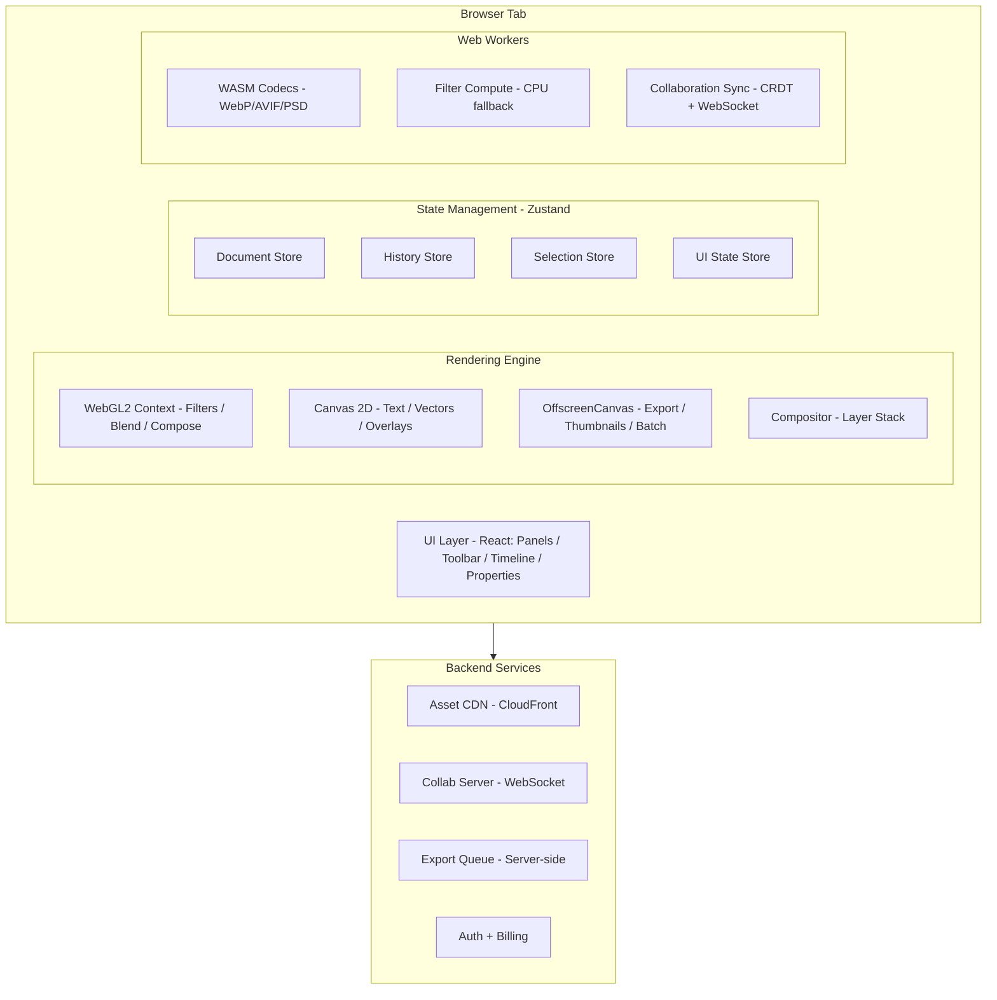

## Problem Statement

Design a browser-based photo and image editor comparable to Canva, Photopea, or Adobe Express. The application must handle professional-grade image manipulation — layer compositing, non-destructive filters, text rendering, and multi-format export — entirely client-side using WebGL, Canvas 2D, and Web Workers.

This is not a simple cropping tool. The system must render 50MP+ images at interactive frame rates, apply GPU-accelerated shader programs for real-time filter previews, manage complex layer hierarchies with blend modes and masks, and support collaborative editing with layer-level conflict resolution.

Real-world products in this space: **Canva** (template-driven design), **Figma** (vector + raster hybrid), **Photopea** (full PSD compatibility), **Pixlr** (AI-enhanced editing), **Adobe Express** (creative cloud integration). Each handles 50M+ monthly active users with sub-100ms interaction latency requirements.

The core challenge is architectural: how do you build a rendering pipeline that maintains 60fps compositing across dozens of layers while keeping memory under 2GB, supporting undo/redo across thousands of operations, and enabling real-time collaboration without conflicts?

---

## Requirements Exploration

### Functional Requirements

1. **Canvas Rendering** — Render multi-layer compositions with blend modes, opacity, masks, and clipping paths at 60fps
2. **Image Import/Export** — Decode JPEG, PNG, WebP, AVIF, HEIC, PSD; export to PNG, JPEG, WebP, PDF at arbitrary resolutions
3. **Non-Destructive Filters** — Apply filter chains (blur, brightness, contrast, hue, curves) as a DAG without modifying source pixels
4. **Layer Management** — Create, reorder, group, lock, hide, duplicate layers; support raster, vector, text, and smart object layer types
5. **Text Engine** — Render variable fonts with kerning, ligatures, text effects (shadow, stroke, warp), and per-character styling
6. **Template System** — Reusable layouts with replaceable content slots, smart resizing, and constraint-based positioning
7. **Undo/Redo** — Unlimited history with branching; support both full-state snapshots and incremental deltas
8. **Selection Tools** — Rectangle, ellipse, lasso, magnetic lasso, magic wand, color range selection with feathering
9. **Drawing Tools** — Brush, pencil, eraser, clone stamp, healing brush with pressure sensitivity (tablet support)
10. **Collaborative Editing** — Real-time multi-user editing with layer-level locking and CRDT-based element positioning
11. **Asset Library** — Searchable stock photos, icons, shapes, and user uploads with drag-and-drop placement
12. **Export Pipeline** — Batch export to multiple formats/sizes with ICC color profile embedding

### Non-Functional Requirements

| Requirement         | Target                    | Rationale                                     |
| ------------------- | ------------------------- | --------------------------------------------- |
| Interaction Latency | < 16ms (60fps)            | Brush strokes and transforms must feel native |
| Filter Preview      | < 100ms for 4K image      | Real-time adjustment sliders                  |
| Time to Interactive | < 3s on 4G                | Compete with native apps                      |
| Memory Budget       | < 2GB peak                | Browser tab limits on mobile                  |
| Image Size Support  | Up to 100MP (10000×10000) | Professional photography workflow             |
| Undo History        | 1000+ operations          | Creative exploration requires deep history    |
| Export Time         | < 5s for 4K PNG           | Users expect fast downloads                   |
| Concurrent Users    | 10 per document           | Team design collaboration                     |
| Uptime              | 99.9%                     | Creative work cannot tolerate data loss       |
| Offline Support     | Full editing capability   | Airplane mode, poor connectivity              |

---

## Capacity Estimation & Constraints

**User scale assumptions:**

- 20M monthly active users
- Average session: 12 minutes, 3 sessions/week
- Average document: 8 layers, 2 text elements, 3 filters
- Average image size: 4000×3000 (12MP, ~48MB uncompressed RGBA)

**Memory budget per document:**

| Component                   | Memory      | Notes                                    |
| --------------------------- | ----------- | ---------------------------------------- |
| Source image (12MP RGBA)    | 48 MB       | Decoded pixel buffer                     |
| Layer textures (8 layers)   | 384 MB      | Each layer = full canvas size worst case |
| Undo snapshots (20 cached)  | 960 MB      | Compressed deltas reduce this 10×        |
| WebGL buffers + shaders     | 64 MB       | GPU-side allocations                     |
| Filter intermediate buffers | 96 MB       | Ping-pong framebuffers                   |
| DOM + JS heap               | 128 MB      | UI framework, state, metadata            |
| **Total peak**              | **~1.7 GB** | Within 2GB budget                        |

**GPU constraints:**

- WebGL2 max texture size: 4096×4096 (mobile) to 16384×16384 (desktop)
- Max framebuffer attachments: 8 (limits simultaneous render targets)
- Shader uniform limit: 1024 vectors (limits filter parameter count)

**Network:**

- Image upload: 5–50MB per file, 95th percentile upload time < 10s
- Template download: 200KB–2MB (compressed metadata + thumbnails)
- Collaboration sync: 500 bytes–5KB per operation, 10–50 ops/second peak

<Callout>
  For 50MP+ images, tiled rendering is mandatory. A single 50MP RGBA texture
  requires 200MB of GPU memory — exceeding mobile GPU limits. Tile the image
  into 2048×2048 chunks and composite only visible tiles at full resolution.
</Callout>

---

## Architecture / High-Level Design

### Rendering Strategy

The editor uses a **hybrid Canvas 2D + WebGL** pipeline:

- **WebGL2** — All pixel manipulation: filters, blend modes, compositing, transforms. GPU parallelism gives 100× speedup over CPU for per-pixel operations.
- **Canvas 2D** — Text rendering (leverages browser font engine), vector path rasterization for selection outlines, UI overlay (handles, guides, rulers).
- **OffscreenCanvas** — Dedicated to Web Workers for background export rendering and thumbnail generation without blocking the main thread.

Why not Canvas 2D for everything? A 12MP gaussian blur takes ~2000ms on CPU vs ~8ms on GPU. Non-negotiable for interactive filter adjustment.

### Navigation Model

```
/editor                    → New blank document
/editor/:projectId         → Load existing project
/editor/:projectId/export  → Export dialog (modal route)
/templates                 → Template gallery
/templates/:templateId     → Apply template to new project
/assets                    → Asset library browser
```

Single-page application with hash-based sub-routing within the editor for panel states (layers panel open, filter panel active). No full-page navigations during editing — all panel transitions are client-side state changes.

### System Architecture Diagram ASCII



### Component Architecture

```
<EditorShell>
├── <Toolbar />                    — Tool selection, undo/redo buttons
├── <PanelLayout>
│   ├── <LeftPanel>
│   │   ├── <LayersPanel />        — Layer list with drag reorder
│   │   └── <AssetsPanel />        — Stock images, shapes, templates
│   ├── <CanvasViewport>
│   │   ├── <WebGLCanvas />        — Main rendering surface
│   │   ├── <OverlayCanvas />      — Selection outlines, guides, handles
│   │   └── <InteractionLayer />   — Mouse/touch event capture
│   └── <RightPanel>
│       ├── <PropertiesPanel />    — Position, size, rotation, opacity
│       ├── <FilterPanel />        — Non-destructive filter stack
│       └── <TextPanel />          — Font, size, alignment, effects
├── <Timeline />                   — Animation keyframes (future)
└── <StatusBar />                  — Zoom level, cursor position, memory usage
```

### State Management Strategy

Four Zustand stores with clear boundaries:

1. **DocumentStore** — Source of truth for the layer tree, element properties, and filter stacks. Serializable to JSON for save/load.
2. **HistoryStore** — Command stack with undo/redo pointers. Stores compressed deltas, not full snapshots.
3. **SelectionStore** — Currently selected elements, active tool, selection region pixels.
4. **UIStore** — Panel visibility, zoom level, canvas scroll position, active panel tab.

Separation ensures that UI state changes (panning, zooming) never trigger document re-renders, and document mutations never force UI recalculation.

---

## Data Model / Entities

```typescript
// Core document structure
interface EditorDocument {
  id: string;
  name: string;
  width: number; // Canvas width in pixels
  height: number; // Canvas height in pixels
  dpi: number; // Resolution for print export (72, 150, 300)
  colorSpace: "sRGB" | "Display-P3" | "Adobe-RGB";
  background: BackgroundConfig;
  layers: Layer[]; // Ordered bottom-to-top
  guides: Guide[]; // Ruler guides for alignment
  metadata: DocumentMetadata;
  version: number; // Optimistic concurrency for collab
}

interface DocumentMetadata {
  createdAt: number;
  updatedAt: number;
  createdBy: string;
  templateId: string | null;
  tags: string[];
  exportHistory: ExportRecord[];
}

// Layer hierarchy
type Layer =
  | RasterLayer
  | VectorLayer
  | TextLayer
  | GroupLayer
  | AdjustmentLayer
  | SmartObjectLayer;

interface BaseLayer {
  id: string;
  name: string;
  visible: boolean;
  locked: boolean;
  opacity: number; // 0–1
  blendMode: BlendMode;
  position: { x: number; y: number };
  size: { width: number; height: number };
  rotation: number; // Degrees
  transform: Matrix3x3; // Affine transform matrix
  mask: LayerMask | null;
  clippingMask: boolean; // Clip to layer below
  filters: FilterNode[]; // Non-destructive filter stack
  lockedBy: string | null; // User ID for collab locking
}

interface RasterLayer extends BaseLayer {
  type: "raster";
  sourceImageId: string; // Reference to decoded image buffer
  crop: { x: number; y: number; width: number; height: number } | null;
  tileMap: TileReference[]; // For large images: references to 2048×2048 tiles
}

interface VectorLayer extends BaseLayer {
  type: "vector";
  paths: VectorPath[];
  fill: FillStyle;
  stroke: StrokeStyle;
}

interface TextLayer extends BaseLayer {
  type: "text";
  content: TextContent;
  boundingBox: "auto" | { width: number; height: number };
  overflow: "visible" | "clip" | "ellipsis";
}

interface GroupLayer extends BaseLayer {
  type: "group";
  children: Layer[];
  passThrough: boolean; // Pass-through vs isolated blending
}

interface AdjustmentLayer extends BaseLayer {
  type: "adjustment";
  adjustment: AdjustmentType; // Applies to all layers below
}

interface SmartObjectLayer extends BaseLayer {
  type: "smart-object";
  sourceDocumentId: string; // Reference to embedded document
  lastRasterized: number; // Timestamp of last rasterization
}

// Filter system (DAG-based)
interface FilterNode {
  id: string;
  type: FilterType;
  enabled: boolean;
  parameters: Record<string, number | string | boolean>;
  inputConnections: string[]; // IDs of upstream filter nodes
  gpuProgram: string | null; // Compiled shader reference
}

type FilterType =
  | "blur-gaussian"
  | "blur-motion"
  | "blur-radial"
  | "sharpen-unsharp-mask"
  | "brightness-contrast"
  | "hue-saturation"
  | "color-balance"
  | "curves"
  | "levels"
  | "vibrance"
  | "noise-reduction"
  | "chromatic-aberration"
  | "vignette"
  | "grain"
  | "color-lookup";

// Blend modes (Photoshop-compatible)
type BlendMode =
  | "normal"
  | "dissolve"
  | "darken"
  | "multiply"
  | "color-burn"
  | "linear-burn"
  | "lighten"
  | "screen"
  | "color-dodge"
  | "linear-dodge"
  | "overlay"
  | "soft-light"
  | "hard-light"
  | "vivid-light"
  | "difference"
  | "exclusion"
  | "hue"
  | "saturation"
  | "color"
  | "luminosity";

// Text content model
interface TextContent {
  paragraphs: TextParagraph[];
}

interface TextParagraph {
  alignment: "left" | "center" | "right" | "justify";
  lineHeight: number; // Multiplier (1.2 = 120%)
  spacing: { before: number; after: number };
  runs: TextRun[];
}

interface TextRun {
  text: string;
  style: TextStyle;
}

interface TextStyle {
  fontFamily: string;
  fontSize: number; // In points
  fontWeight: number; // 100–900
  fontStyle: "normal" | "italic";
  color: ColorValue;
  letterSpacing: number; // In em units
  textDecoration: "none" | "underline" | "strikethrough";
  textTransform: "none" | "uppercase" | "lowercase" | "capitalize";
  effects: TextEffect[];
}

interface TextEffect {
  type: "shadow" | "stroke" | "glow" | "warp";
  parameters: Record<string, number | string>;
}

// Color system
type ColorValue =
  | { type: "solid"; r: number; g: number; b: number; a: number }
  | {
      type: "gradient";
      stops: GradientStop[];
      angle: number;
      gradientType: "linear" | "radial";
    }
  | { type: "pattern"; imageId: string; scale: number; rotation: number };

// Undo/redo command model
interface Command {
  id: string;
  type: CommandType;
  timestamp: number;
  userId: string;
  delta: StateDelta; // Minimal diff for undo
  inverseDelta: StateDelta; // Pre-computed for redo
  affectedLayers: string[]; // For collaboration conflict detection
  snapshotRef: string | null; // Reference to full snapshot (every N commands)
}

type CommandType =
  | "layer.create"
  | "layer.delete"
  | "layer.reorder"
  | "layer.transform"
  | "layer.style"
  | "filter.add"
  | "filter.remove"
  | "filter.update"
  | "text.edit"
  | "text.style"
  | "selection.modify"
  | "paint.stroke"
  | "document.resize"
  | "document.crop";

// Template system
interface Template {
  id: string;
  name: string;
  category: string;
  dimensions: { width: number; height: number };
  thumbnail: string;
  slots: TemplateSlot[];
  constraints: LayoutConstraint[];
  document: EditorDocument; // Base document with placeholder content
}

interface TemplateSlot {
  id: string;
  layerId: string; // Maps to a layer in the template document
  type: "image" | "text" | "shape";
  label: string; // "Hero Image", "Headline", "Logo"
  constraints: {
    minWidth?: number;
    maxWidth?: number;
    aspectRatio?: number;
    allowedFonts?: string[];
  };
}

// Tile system for large images
interface TileReference {
  tileX: number; // Tile grid coordinate
  tileY: number;
  level: number; // Mipmap level (0 = full res)
  textureId: string; // WebGL texture handle
  loaded: boolean;
  lastAccessed: number; // For LRU eviction
}

// Collaboration
interface CollaborationState {
  documentId: string;
  activeUsers: CollabUser[];
  layerLocks: Map<string, string>; // layerId → userId
  pendingOperations: CRDTOperation[];
  vectorClock: Record<string, number>;
}

interface CRDTOperation {
  id: string;
  userId: string;
  timestamp: number;
  vectorClock: Record<string, number>;
  type: "insert" | "delete" | "update" | "move";
  target: { layerId: string; property?: string };
  value: unknown;
}
```

---

## Interface Definition (API)

### Document Management

```typescript
// POST /api/documents
interface CreateDocumentRequest {
  name: string;
  width: number;
  height: number;
  templateId?: string;
  dpi?: number;
}

interface CreateDocumentResponse {
  id: string;
  document: EditorDocument;
  collaborationToken: string; // JWT for WebSocket auth
}

// GET /api/documents/:id
interface GetDocumentResponse {
  document: EditorDocument;
  permissions: DocumentPermissions;
  activeCollaborators: CollabUser[];
}

// PUT /api/documents/:id
interface SaveDocumentRequest {
  document: EditorDocument;
  version: number; // Optimistic concurrency check
  thumbnail: string; // Base64 preview image
}
```

### Image Upload & Processing

```typescript
// POST /api/images/upload
// Content-Type: multipart/form-data
interface UploadImageResponse {
  imageId: string;
  width: number;
  height: number;
  format: string;
  size: number;
  url: string; // CDN URL for the original
  thumbnailUrl: string; // 256px thumbnail
  tilesUrl?: string; // Base URL for tile pyramid (large images only)
}

// POST /api/images/:id/process (server-side fallback for heavy operations)
interface ProcessImageRequest {
  operations: ServerOperation[];
}

type ServerOperation =
  | {
      type: "resize";
      width: number;
      height: number;
      algorithm: "lanczos" | "bicubic";
    }
  | {
      type: "convert";
      format: "webp" | "avif" | "png" | "jpeg";
      quality?: number;
    }
  | { type: "remove-background" } // AI-powered, requires GPU server
  | { type: "upscale"; factor: 2 | 4 };
```

### Export Pipeline

```typescript
// POST /api/export
interface ExportRequest {
  documentId: string;
  format: "png" | "jpeg" | "webp" | "avif" | "pdf" | "svg";
  quality?: number; // 0–100 for lossy formats
  scale?: number; // 0.5×, 1×, 2×, 3×
  colorProfile?: "sRGB" | "Display-P3" | "CMYK";
  pages?: number[]; // For multi-page PDF
  layers?: string[]; // Export specific layers only
}

interface ExportResponse {
  downloadUrl: string;
  expiresAt: number;
  size: number;
  dimensions: { width: number; height: number };
}
```

### Collaboration WebSocket Protocol

```typescript
// Client → Server
type ClientMessage =
  | { type: "join"; documentId: string; token: string }
  | { type: "operation"; op: CRDTOperation }
  | { type: "lock-layer"; layerId: string }
  | { type: "unlock-layer"; layerId: string }
  | { type: "cursor-move"; position: { x: number; y: number }; viewport: Rect }
  | { type: "presence-update"; tool: string; color: string };

// Server → Client
type ServerMessage =
  | { type: "user-joined"; user: CollabUser }
  | { type: "user-left"; userId: string }
  | { type: "operation"; op: CRDTOperation; userId: string }
  | { type: "lock-granted"; layerId: string }
  | { type: "lock-denied"; layerId: string; lockedBy: string }
  | {
      type: "cursor-update";
      userId: string;
      position: { x: number; y: number };
    }
  | {
      type: "conflict";
      operations: CRDTOperation[];
      resolution: "merge" | "reject";
    };
```

### Template API

```typescript
// GET /api/templates?category=social&dimensions=1080x1080
interface TemplateListResponse {
  templates: TemplateSummary[];
  pagination: { cursor: string; hasMore: boolean };
}

// POST /api/templates/:id/instantiate
interface InstantiateTemplateRequest {
  slotValues: Record<
    string,
    | {
        type: "image";
        imageId: string;
      }
    | {
        type: "text";
        content: string;
      }
  >;
}
```

---

## Caching Strategy

### Multi-Layer Cache Architecture

```
┌──────────────────────────────────────────────────────┐
│ L1: GPU Texture Cache (WebGL)                        │
│ • Compiled filter results per layer                   │
│ • Composite framebuffers                              │
│ • Eviction: LRU by last-render timestamp              │
│ • Budget: 512MB GPU memory                            │
├──────────────────────────────────────────────────────┤
│ L2: Memory Cache (ArrayBuffer)                        │
│ • Decoded image pixel data                            │
│ • Tile pyramid levels                                 │
│ • Undo snapshot diffs                                 │
│ • Eviction: LRU with priority (visible layers first)  │
│ • Budget: 1GB system memory                           │
├──────────────────────────────────────────────────────┤
│ L3: IndexedDB (Persistent)                            │
│ • Full document state (autosave every 30s)            │
│ • Image source files (compressed)                     │
│ • Undo history (serialized commands)                  │
│ • Font files (subset WOFF2)                           │
│ • Budget: 2GB per document                            │
├──────────────────────────────────────────────────────┤
│ L4: Service Worker Cache                              │
│ • Application shell (HTML, JS, CSS)                   │
│ • WASM codec modules                                  │
│ • Shared assets (icons, default fonts)                │
│ • Stale-while-revalidate for app updates              │
├──────────────────────────────────────────────────────┤
│ L5: CDN (CloudFront)                                  │
│ • User-uploaded images                                │
│ • Template assets                                     │
│ • Stock photo library                                 │
│ • TTL: 1 year (content-addressed URLs)                │
└──────────────────────────────────────────────────────┘
```

### Cache Invalidation Strategy

| Cache Level    | Invalidation Trigger    | Strategy                                      |
| -------------- | ----------------------- | --------------------------------------------- |
| GPU Textures   | Filter parameter change | Invalidate only affected layer + layers above |
| Memory Tiles   | Viewport pan/zoom       | Predictive prefetch adjacent tiles            |
| IndexedDB      | Document save           | Write-through, never invalidate               |
| Service Worker | App deploy              | Version-stamped URL, SW update lifecycle      |
| CDN            | Never (immutable URLs)  | Content-addressed: `/images/{hash}.webp`      |

### Filter Result Caching

Non-destructive filters use a **dirty flag propagation** system:

```typescript
interface FilterCacheEntry {
  filterId: string;
  inputHash: string; // Hash of input texture + parameters
  outputTextureId: string; // Cached GPU texture
  lastUsed: number;
  sizeBytes: number;
}

// When a filter parameter changes:
// 1. Mark that filter's cache as dirty
// 2. Propagate dirty flag to all downstream filters in the DAG
// 3. On next render, recompute only dirty filters
// 4. Upstream cached results remain valid
```

<Callout>
  Filter caching with DAG-aware invalidation reduces recomputation by 60–80%
  during interactive slider adjustments. Only the modified filter and its
  downstream dependents re-execute — upstream results stay cached in GPU texture
  memory.
</Callout>

---

## Rendering & Performance Deep Dive

### Rendering Pipeline

The compositor executes a multi-pass rendering pipeline every frame:

```
Frame Request (requestAnimationFrame)
        │
        ▼
┌───────────────────┐
│ 1. Dirty Check    │ ← Skip if no state changed since last frame
└────────┬──────────┘
         │
         ▼
┌───────────────────┐
│ 2. Layer Sort     │ ← Topological sort of layer tree (groups expand)
└────────┬──────────┘
         │
         ▼
┌───────────────────┐
│ 3. Visibility     │ ← Frustum cull: skip layers outside viewport
│    Culling        │
└────────┬──────────┘
         │
         ▼
┌───────────────────┐
│ 4. Filter Chain   │ ← Execute dirty filters (GPU shaders)
│    Evaluation     │    Cache results as framebuffer textures
└────────┬──────────┘
         │
         ▼
┌───────────────────┐
│ 5. Compositing    │ ← Blend layers bottom-to-top using blend mode shaders
│    (WebGL)        │    Apply opacity, masks, clipping
└────────┬──────────┘
         │
         ▼
┌───────────────────┐
│ 6. Overlay Pass   │ ← Canvas 2D: selection outlines, guides, handles
│    (Canvas 2D)    │    Cursor position, ruler ticks
└────────┬──────────┘
         │
         ▼
┌───────────────────┐
│ 7. Present        │ ← Swap framebuffer to screen
└───────────────────┘
```

### WebGL/Canvas Performance

**Shader Programs for Blend Modes:**

Each blend mode is a GLSL fragment shader. The compositor binds the base layer texture and the blend layer texture, then executes the appropriate blend equation:

```glsl
// Multiply blend mode shader
precision highp float;

uniform sampler2D u_baseLayer;
uniform sampler2D u_blendLayer;
uniform float u_opacity;

varying vec2 v_texCoord;

void main() {
  vec4 base = texture2D(u_baseLayer, v_texCoord);
  vec4 blend = texture2D(u_blendLayer, v_texCoord);

  vec3 result = base.rgb * blend.rgb;

  // Apply opacity and alpha compositing
  float alpha = blend.a * u_opacity;
  gl_FragColor = vec4(mix(base.rgb, result, alpha), base.a + alpha * (1.0 - base.a));
}
```

**Gaussian Blur Shader (Separable, Two-Pass):**

```glsl
// Horizontal pass (vertical pass is identical with swapped direction)
precision highp float;

uniform sampler2D u_texture;
uniform vec2 u_resolution;
uniform float u_radius;

varying vec2 v_texCoord;

void main() {
  vec4 sum = vec4(0.0);
  float weightSum = 0.0;

  for (float i = -32.0; i <= 32.0; i += 1.0) {
    if (abs(i) > u_radius) continue;

    float weight = exp(-(i * i) / (2.0 * u_radius * u_radius));
    vec2 offset = vec2(i / u_resolution.x, 0.0);
    sum += texture2D(u_texture, v_texCoord + offset) * weight;
    weightSum += weight;
  }

  gl_FragColor = sum / weightSum;
}
```

**Performance targets per operation:**

| Operation                    | Target | Technique                                       |
| ---------------------------- | ------ | ----------------------------------------------- |
| Layer composite (12MP)       | < 2ms  | Single draw call per layer, batched blending    |
| Gaussian blur (r=20, 4K)     | < 8ms  | Separable two-pass, downscale for preview       |
| Color adjustment             | < 1ms  | Single-pass shader, no intermediate buffer      |
| Transform (rotate/scale)     | < 1ms  | GPU matrix multiplication in vertex shader      |
| Text rasterization           | < 5ms  | Cache glyph atlas, only re-render on edit       |
| Full recomposite (20 layers) | < 16ms | Incremental: only recomposite above dirty layer |

### Filter Processing

**Non-destructive filter evaluation as a DAG:**

```typescript
class FilterGraph {
  private nodes: Map<string, FilterNode> = new Map();
  private cache: Map<string, WebGLTexture> = new Map();
  private dirty: Set<string> = new Set();

  markDirty(nodeId: string): void {
    this.dirty.add(nodeId);
    // Propagate to all downstream nodes
    for (const [id, node] of this.nodes) {
      if (node.inputConnections.includes(nodeId)) {
        this.markDirty(id);
      }
    }
  }

  evaluate(outputNodeId: string, gl: WebGL2RenderingContext): WebGLTexture {
    if (!this.dirty.has(outputNodeId) && this.cache.has(outputNodeId)) {
      return this.cache.get(outputNodeId)!;
    }

    const node = this.nodes.get(outputNodeId)!;

    // Recursively evaluate inputs
    const inputTextures = node.inputConnections.map((id) =>
      this.evaluate(id, gl),
    );

    // Execute GPU shader program
    const result = this.executeShader(gl, node, inputTextures);
    this.cache.set(outputNodeId, result);
    this.dirty.delete(outputNodeId);

    return result;
  }

  private executeShader(
    gl: WebGL2RenderingContext,
    node: FilterNode,
    inputs: WebGLTexture[],
  ): WebGLTexture {
    const program = this.getProgram(gl, node.type);
    gl.useProgram(program);

    // Bind input textures
    inputs.forEach((tex, i) => {
      gl.activeTexture(gl.TEXTURE0 + i);
      gl.bindTexture(gl.TEXTURE_2D, tex);
      gl.uniform1i(gl.getUniformLocation(program, `u_input${i}`), i);
    });

    // Set filter parameters as uniforms
    for (const [key, value] of Object.entries(node.parameters)) {
      const loc = gl.getUniformLocation(program, `u_${key}`);
      if (typeof value === "number") gl.uniform1f(loc, value);
    }

    // Render to framebuffer
    const outputTexture = this.allocateTexture(gl);
    const fb = gl.createFramebuffer();
    gl.bindFramebuffer(gl.FRAMEBUFFER, fb);
    gl.framebufferTexture2D(
      gl.FRAMEBUFFER,
      gl.COLOR_ATTACHMENT0,
      gl.TEXTURE_2D,
      outputTexture,
      0,
    );
    gl.drawArrays(gl.TRIANGLE_STRIP, 0, 4);
    gl.deleteFramebuffer(fb);

    return outputTexture;
  }
}
```

### Bundle Optimization

| Chunk                          | Size (gzip) | Loading Strategy                      |
| ------------------------------ | ----------- | ------------------------------------- |
| Shell (React + routing)        | 85 KB       | Preload, critical path                |
| Editor core (canvas, state)    | 120 KB      | Preload, route-level split            |
| WebGL renderer                 | 65 KB       | Dynamic import on editor mount        |
| WASM codecs (WebP + AVIF)      | 180 KB      | Web Worker, lazy load on first decode |
| Text engine (font subsetting)  | 45 KB       | Load on text tool activation          |
| Collaboration module           | 35 KB       | Load when document has >1 user        |
| Export pipeline                | 55 KB       | Load on export dialog open            |
| Filter library (shader source) | 40 KB       | Compile shaders on first use          |
| **Total initial**              | **~205 KB** | Shell + editor core only              |
| **Total loaded**               | **~625 KB** | Everything, amortized over session    |

<Callout>
  WebGL shader compilation is a hidden performance cliff. Compiling 30+ blend
  mode shaders at startup adds 200–500ms. Solution: compile shaders lazily on
  first use, and cache compiled programs in IndexedDB using shader source hash
  as key. Subsequent loads skip compilation entirely.
</Callout>

---

## Security Deep Dive

### Threat Model

| Threat                                 | Impact                  | Likelihood | Mitigation                                              |
| -------------------------------------- | ----------------------- | ---------- | ------------------------------------------------------- |
| Malicious image upload (polyglot file) | XSS via image rendering | High       | Validate magic bytes, re-encode on server, strip EXIF   |
| WebGL shader injection                 | GPU crash / info leak   | Low        | Shaders are compile-time constants, never user-provided |
| CRDT operation tampering               | Document corruption     | Medium     | Sign operations with session token, validate on server  |
| Cross-document data leak               | Privacy breach          | Medium     | IndexedDB isolation per document, clear on close        |
| Plugin/extension code execution        | Full compromise         | High       | Sandboxed iframe with postMessage API, no DOM access    |
| Clipboard paste XSS                    | Script injection        | Medium     | Sanitize HTML paste, only allow known formats           |
| Memory exhaustion DoS                  | Tab crash               | Medium     | Hard limits: 2GB memory, 100 layers, 50 filters         |
| Export URL enumeration                 | Unauthorized download   | Low        | Signed URLs with 1-hour TTL, single-use tokens          |

### CSP

```http
Content-Security-Policy:
  default-src 'self';
  script-src 'self' 'wasm-unsafe-eval';
  style-src 'self' 'unsafe-inline';
  img-src 'self' blob: data: https://cdn.devpro-editor.com;
  connect-src 'self' wss://collab.devpro-editor.com https://api.devpro-editor.com;
  worker-src 'self' blob:;
  child-src 'self' https://plugins.devpro-editor.com;
  frame-ancestors 'none';
  base-uri 'self';
  form-action 'self';
```

Key decisions:

- `wasm-unsafe-eval` required for WASM codec execution
- `blob:` for img-src enables Canvas.toBlob() and createObjectURL for previews
- `worker-src blob:` allows dynamic Web Worker creation from inline code
- `child-src` restricts plugin iframes to trusted origin only

### Image Upload Security

```typescript
// Server-side image validation pipeline
async function validateUpload(
  file: Buffer,
  mimeType: string,
): Promise<ValidationResult> {
  // 1. Check magic bytes match claimed MIME type
  const detected = detectFileType(file.slice(0, 12));
  if (detected.mime !== mimeType) {
    return { valid: false, reason: "MIME type mismatch" };
  }

  // 2. Enforce size limits
  if (file.length > 50 * 1024 * 1024) {
    // 50MB max
    return { valid: false, reason: "File too large" };
  }

  // 3. Attempt decode to verify it's a valid image (not a polyglot)
  const metadata = await sharp(file).metadata();
  if (!metadata.width || !metadata.height) {
    return { valid: false, reason: "Invalid image data" };
  }

  // 4. Check dimensions
  if (metadata.width * metadata.height > 100_000_000) {
    // 100MP limit
    return { valid: false, reason: "Image dimensions exceed limit" };
  }

  // 5. Strip all metadata (EXIF, XMP, IPTC) — prevents data leakage
  const clean = await sharp(file)
    .rotate() // Apply EXIF orientation before stripping
    .withMetadata({ orientation: undefined })
    .toBuffer();

  // 6. Re-encode to eliminate any embedded payloads
  const reencoded = await sharp(clean).png({ compressionLevel: 6 }).toBuffer();

  return { valid: true, cleanBuffer: reencoded, metadata };
}
```

### Plugin Sandboxing

Third-party plugins (filters, effects, templates) run in a sandboxed environment:

```typescript
// Plugin host (main thread)
class PluginSandbox {
  private iframe: HTMLIFrameElement;
  private messagePort: MessagePort;

  constructor(pluginUrl: string) {
    this.iframe = document.createElement("iframe");
    this.iframe.sandbox.add("allow-scripts"); // No forms, no popups, no navigation
    this.iframe.src = `https://plugins.devpro-editor.com/sandbox.html`;
    this.iframe.style.display = "none";
    document.body.appendChild(this.iframe);

    // Establish MessageChannel for structured communication
    const channel = new MessageChannel();
    this.messagePort = channel.port1;
    this.iframe.contentWindow!.postMessage(
      { type: "init", pluginUrl },
      "https://plugins.devpro-editor.com",
      [channel.port2],
    );
  }

  async executeFilter(
    imageData: ImageData,
    params: Record<string, number>,
  ): Promise<ImageData> {
    // Transfer pixel data to sandbox (zero-copy via transferable)
    const buffer = imageData.data.buffer;
    this.messagePort.postMessage(
      {
        type: "filter",
        buffer,
        width: imageData.width,
        height: imageData.height,
        params,
      },
      [buffer],
    );

    // Wait for result with timeout
    return new Promise((resolve, reject) => {
      const timeout = setTimeout(
        () => reject(new Error("Plugin timeout")),
        5000,
      );
      this.messagePort.onmessage = (e) => {
        clearTimeout(timeout);
        const result = new ImageData(
          new Uint8ClampedArray(e.data.buffer),
          e.data.width,
          e.data.height,
        );
        resolve(result);
      };
    });
  }

  destroy(): void {
    this.messagePort.close();
    this.iframe.remove();
  }
}
```

<Callout>
  Never allow plugins to access the DOM, network, or other documents. The
  sandboxed iframe with `allow-scripts` only gives JavaScript execution. All
  data exchange happens through structured `postMessage` with transferable
  ArrayBuffers for performance. A 5-second timeout prevents infinite loops from
  hanging the editor.
</Callout>

---

## Scalability & Reliability

### Failure Modes

| Failure Mode             | Detection                           | Recovery                                                   | Impact                            |
| ------------------------ | ----------------------------------- | ---------------------------------------------------------- | --------------------------------- |
| WebGL context lost       | `webglcontextlost` event            | Recreate context, restore textures from L2 cache           | 1–3s flash, no data loss          |
| Out of GPU memory        | Texture allocation fails            | Evict LRU textures, downscale layer previews               | Reduced quality, still functional |
| Tab memory limit (2GB)   | Performance.memory API              | Offload non-visible layers to IndexedDB, reduce undo depth | Slower undo, still editable       |
| Web Worker crash         | Worker `error` event                | Restart worker, replay pending messages                    | Export restarts, 2–5s delay       |
| WebSocket disconnect     | `close` event + heartbeat timeout   | Exponential backoff reconnect, queue local ops             | Offline mode, sync on reconnect   |
| IndexedDB quota exceeded | `QuotaExceededError`                | Evict old undo history, compress stored images             | Reduced history depth             |
| WASM codec crash         | Worker `error` during decode        | Fallback to Canvas 2D decode (slower), report error        | Slower import, but functional     |
| Browser tab crash        | Service Worker detects no heartbeat | Autosave ensures < 30s data loss                           | Reload recovers last save         |

### Scaling Strategy for Large Documents

**Tiled rendering for images > 16MP:**

```typescript
class TileManager {
  private readonly TILE_SIZE = 2048;
  private tiles: Map<string, TileState> = new Map();
  private loadQueue: PriorityQueue<TileRequest>;
  private maxLoadedTiles: number; // Based on available GPU memory

  getTileKey(x: number, y: number, level: number): string {
    return `${level}:${x}:${y}`;
  }

  updateViewport(viewport: Rect, zoom: number): void {
    // Determine which mipmap level to use based on zoom
    const level = Math.max(0, Math.floor(-Math.log2(zoom)));

    // Calculate visible tile range
    const tileScale = Math.pow(2, level);
    const startX = Math.floor(viewport.x / (this.TILE_SIZE * tileScale));
    const startY = Math.floor(viewport.y / (this.TILE_SIZE * tileScale));
    const endX = Math.ceil(
      (viewport.x + viewport.width) / (this.TILE_SIZE * tileScale),
    );
    const endY = Math.ceil(
      (viewport.y + viewport.height) / (this.TILE_SIZE * tileScale),
    );

    // Queue visible tiles for loading (highest priority)
    for (let y = startY; y <= endY; y++) {
      for (let x = startX; x <= endX; x++) {
        const key = this.getTileKey(x, y, level);
        if (!this.tiles.has(key) || !this.tiles.get(key)!.loaded) {
          this.loadQueue.enqueue({ x, y, level, priority: 0 });
        }
      }
    }

    // Queue adjacent tiles for prefetch (lower priority)
    this.prefetchAdjacentTiles(startX, startY, endX, endY, level);

    // Evict distant tiles if over memory budget
    this.evictDistantTiles(viewport, level);
  }
}
```

### Offline-First Architecture

```typescript
// Service Worker strategy for editor assets
const CACHE_STRATEGIES = {
  // App shell: cache-first, update in background
  shell: new CacheFirst({
    cacheName: "editor-shell-v3",
    plugins: [
      new ExpirationPlugin({ maxEntries: 50, maxAgeSeconds: 7 * 24 * 3600 }),
    ],
  }),

  // WASM modules: cache-first (immutable, versioned URLs)
  wasm: new CacheFirst({
    cacheName: "editor-wasm-v1",
    plugins: [new CacheableResponsePlugin({ statuses: [200] })],
  }),

  // User assets: network-first with cache fallback
  assets: new NetworkFirst({
    cacheName: "user-assets",
    networkTimeoutSeconds: 5,
    plugins: [
      new ExpirationPlugin({ maxEntries: 200, maxAgeSeconds: 30 * 24 * 3600 }),
    ],
  }),

  // API calls: network-only (stale data is dangerous for collab)
  api: new NetworkOnly(),
};
```

---

## Accessibility Deep Dive

### Keyboard Navigation

| Shortcut            | Action                         | Context              |
| ------------------- | ------------------------------ | -------------------- |
| `V`                 | Move tool                      | Global               |
| `B`                 | Brush tool                     | Global               |
| `T`                 | Text tool                      | Global               |
| `Ctrl+Z` / `Cmd+Z`  | Undo                           | Global               |
| `Ctrl+Shift+Z`      | Redo                           | Global               |
| `Tab`               | Cycle through layers           | Layers panel focused |
| `Enter`             | Edit selected layer            | Layer selected       |
| `Escape`            | Deselect / cancel operation    | Any context          |
| `Arrow keys`        | Nudge selected element 1px     | Element selected     |
| `Shift+Arrow`       | Nudge 10px                     | Element selected     |
| `[` / `]`           | Decrease / increase brush size | Brush tool active    |
| `Ctrl+G`            | Group selected layers          | Multiple selected    |
| `Ctrl+E`            | Export dialog                  | Global               |
| `Space+Drag`        | Pan canvas                     | Any tool             |
| `Ctrl++` / `Ctrl+-` | Zoom in / out                  | Global               |

### Screen Reader Support

```tsx
// Layer panel with ARIA tree role
function LayersPanel({ layers }: { layers: Layer[] }) {
  return (
    <div role="tree" aria-label="Document layers" aria-orientation="vertical">
      {layers.map((layer, index) => (
        <div
          key={layer.id}
          role="treeitem"
          aria-level={1}
          aria-setsize={layers.length}
          aria-posinset={index + 1}
          aria-selected={layer.id === selectedLayerId}
          aria-expanded={
            layer.type === "group" ? isExpanded(layer.id) : undefined
          }
          aria-label={`${layer.name}, ${layer.type} layer, ${layer.visible ? "visible" : "hidden"}, opacity ${Math.round(layer.opacity * 100)}%`}
          tabIndex={layer.id === focusedLayerId ? 0 : -1}
        >
          <span aria-hidden="true">{getLayerIcon(layer.type)}</span>
          <span>{layer.name}</span>
          <button
            aria-label={`Toggle visibility of ${layer.name}`}
            aria-pressed={layer.visible}
          />
          <button
            aria-label={`Lock ${layer.name}`}
            aria-pressed={layer.locked}
          />
        </div>
      ))}
    </div>
  );
}
```

### Canvas Accessibility

The canvas element itself is not accessible. Provide an alternative:

```tsx
<div className="relative">
  {/* Visual rendering — hidden from AT */}
  <canvas aria-hidden="true" ref={canvasRef} />

  {/* Accessible description of canvas state */}
  <div role="img" aria-label={canvasDescription} className="sr-only">
    <p>
      Canvas dimensions: {doc.width} by {doc.height} pixels
    </p>
    <p>
      {layers.length} layers. Selected: {selectedLayer?.name ?? "none"}
    </p>
    <ul aria-label="Layer descriptions">
      {layers.map((l) => (
        <li key={l.id}>
          {l.name}: {l.type} layer at position {l.position.x}, {l.position.y}
        </li>
      ))}
    </ul>
  </div>

  {/* Live region for operation announcements */}
  <div role="status" aria-live="polite" aria-atomic="true" className="sr-only">
    {lastAction}
  </div>
</div>
```

### Color Vision Accessibility

- All color pickers include hex/RGB input fields (not just visual selection)
- Filter previews show before/after toggle (not just live preview)
- Layer blend mode previews include text descriptions of the effect
- Selection outlines use animated marching ants (motion-safe) or dashed lines with high contrast

---

## Monitoring & Observability

### Core Metrics Dashboard

| Metric                     | Collection Method                        | Alert Threshold         | Resolution                           |
| -------------------------- | ---------------------------------------- | ----------------------- | ------------------------------------ |
| Frame render time (P95)    | `performance.measure()` per frame        | > 20ms (dropped frames) | Reduce layer count, disable previews |
| GPU memory usage           | `WEBGL_debug_renderer_info` + estimation | > 80% budget            | Evict cached textures                |
| Filter evaluation time     | Timer around shader execution            | > 100ms single filter   | Downscale preview, queue full-res    |
| WebSocket latency (P95)    | Ping/pong measurement                    | > 500ms                 | Switch to polling fallback           |
| IndexedDB write latency    | `performance.measure()`                  | > 200ms                 | Batch writes, reduce frequency       |
| JS heap size               | `performance.memory` (Chrome)            | > 1.5GB                 | Trigger garbage collection hints     |
| Undo history depth         | Counter in HistoryStore                  | > 500 without snapshot  | Force snapshot creation              |
| Worker message queue depth | Pending message count                    | > 50 messages           | Backpressure: throttle operations    |
| Shader compilation time    | Timer around `gl.compileShader`          | > 100ms per shader      | Pre-compile at startup               |
| Export pipeline duration   | Full export timer                        | > 10s for 4K            | Optimize render path                 |

### Error Tracking

```typescript
// Structured error reporting for rendering failures
interface RenderingError {
  type:
    | "webgl_context_lost"
    | "shader_compile_error"
    | "texture_allocation_failed"
    | "worker_crash";
  timestamp: number;
  documentId: string;
  layerCount: number;
  gpuMemoryEstimate: number;
  filterChainLength: number;
  browserInfo: {
    gpu: string;
    maxTextureSize: number;
    extensions: string[];
  };
  stack?: string;
  userAction: string; // What triggered the error
}

function reportRenderError(error: RenderingError): void {
  // Batch errors — don't spam on repeated context losses
  if (
    recentErrors.has(error.type) &&
    Date.now() - recentErrors.get(error.type)! < 5000
  ) {
    return;
  }
  recentErrors.set(error.type, Date.now());

  navigator.sendBeacon("/api/telemetry/error", JSON.stringify(error));
}
```

### Performance Budget Enforcement

```typescript
class PerformanceBudget {
  private frameTimings: number[] = [];
  private readonly BUDGET_FRAME_MS = 16; // 60fps target
  private readonly DEGRADATION_THRESHOLD = 0.2; // 20% of frames over budget

  recordFrame(durationMs: number): void {
    this.frameTimings.push(durationMs);
    if (this.frameTimings.length > 60) this.frameTimings.shift();

    const overBudget = this.frameTimings.filter(
      (t) => t > this.BUDGET_FRAME_MS,
    ).length;
    const ratio = overBudget / this.frameTimings.length;

    if (ratio > this.DEGRADATION_THRESHOLD) {
      this.applyDegradation();
    }
  }

  private applyDegradation(): void {
    // Progressive quality reduction
    // 1. Reduce filter preview resolution (2× downscale)
    // 2. Disable real-time blend mode preview
    // 3. Show checker pattern for hidden layers instead of rendering them
    // 4. Reduce undo snapshot frequency
    emitEvent("performance:degraded", { level: this.degradationLevel++ });
  }
}
```

<Callout>
  Client-side performance monitoring must be lightweight. Measure only on every
  10th frame in production to avoid observer effect. Use `requestIdleCallback`
  for telemetry reporting. Never block the rendering pipeline for metric
  collection.
</Callout>

---

## Trade-offs

| Decision             | Option A                    | Option B                    | Choice                            | Rationale                                                                       |
| -------------------- | --------------------------- | --------------------------- | --------------------------------- | ------------------------------------------------------------------------------- |
| Rendering backend    | Canvas 2D                   | WebGL2                      | **WebGL2**                        | 100× faster per-pixel operations; Canvas 2D cannot do real-time blur on 4K      |
| State management     | Immutable snapshots         | Command pattern with deltas | **Hybrid**                        | Snapshots every 50 ops for fast undo jump; deltas between for memory efficiency |
| Filter evaluation    | Eager (on parameter change) | Lazy (on render request)    | **Lazy**                          | Prevents wasted GPU work during rapid slider adjustment                         |
| Large image handling | Load entire image into GPU  | Tiled rendering             | **Tiled**                         | 50MP image = 200MB texture; exceeds mobile GPU limits                           |
| Collaboration model  | OT (Operational Transform)  | CRDT (Conflict-free)        | **CRDT**                          | Layer-level granularity makes CRDT simpler; no central transform server needed  |
| Text rendering       | Custom WebGL text engine    | Canvas 2D text API          | **Canvas 2D**                     | Browser handles font shaping, kerning, BiDi; custom engine is 6+ months of work |
| Image codec support  | Browser-native only         | WASM codecs                 | **WASM**                          | PSD, AVIF, HEIC support requires custom decoders; WASM runs in Worker           |
| Plugin system        | In-process JS               | Sandboxed iframe            | **Sandboxed iframe**              | Security boundary prevents plugin crashes from killing editor                   |
| Undo granularity     | Per-keystroke               | Per-"semantic action"       | **Semantic action**               | Typing "hello" is one undo step, not five; matches user mental model            |
| Export rendering     | Client-side (Canvas)        | Server-side (headless)      | **Client-first, server fallback** | Client handles 95% of exports; server for PDF/CMYK/batch                        |

---

## What Great Looks Like

### Senior Engineer (L5)

- Implements the WebGL compositing pipeline with correct blend mode shaders
- Builds the filter graph evaluator with dirty propagation
- Designs the undo/redo system using command pattern with delta compression
- Handles WebGL context loss recovery gracefully
- Implements tiled rendering for large images with viewport-based loading

### Staff Engineer (L6)

- Architects the full rendering pipeline with performance budgets and graceful degradation
- Designs the CRDT-based collaboration model with layer-level conflict resolution
- Implements the plugin sandboxing system with security boundaries
- Optimizes memory management across GPU, CPU, and IndexedDB with eviction policies
- Designs the template system with constraint-based layout and slot validation
- Builds the export pipeline with format negotiation and ICC profile handling

### Principal Engineer (L7)

- Defines the overall system architecture balancing client-heavy rendering with server-side fallbacks
- Establishes performance budgets with automated degradation tiers
- Designs the extension/plugin API that enables third-party ecosystem without compromising security
- Architects cross-platform rendering consistency (Safari/Chrome/Firefox WebGL differences)
- Plans the migration path from Canvas 2D prototype to production WebGL pipeline
- Designs the observability system that correlates rendering performance with user engagement metrics
- Makes build-vs-buy decisions: custom WASM codecs vs browser APIs, custom text engine vs Canvas 2D

---

## Key Takeaways

- **WebGL is non-negotiable for professional image editing** — Canvas 2D cannot achieve interactive frame rates for per-pixel operations on images larger than 2MP. The 100× GPU parallelism advantage is the entire architectural foundation.

- **Non-destructive editing requires a DAG-based filter graph** — Filters form a directed acyclic graph where each node caches its output texture. Dirty flag propagation ensures only affected nodes recompute, reducing interactive adjustment latency by 60–80%.

- **Tiled rendering solves the large image problem** — No GPU can hold a 50MP image as a single texture. Decompose into 2048×2048 tiles with a mipmap pyramid. Load only visible tiles at the appropriate detail level. LRU eviction keeps GPU memory bounded.

- **Undo/redo demands a hybrid snapshot + delta approach** — Pure snapshots consume too much memory (48MB per 12MP layer). Pure deltas are slow for deep undo (replaying 500 operations). Take periodic snapshots and store compressed deltas between them.

- **Collaborative editing at the layer level avoids most conflicts** — Unlike text editors that need character-level CRDTs, image editors can lock at layer granularity. Most edits are single-user-per-layer. CRDT handles element positioning for the rare multi-user-same-layer case.

- **Security boundaries must isolate plugins completely** — Third-party filters and effects run in sandboxed iframes with no DOM access. All pixel data transfers use `postMessage` with transferable ArrayBuffers. Timeouts prevent infinite loops from freezing the editor.

- **Progressive degradation keeps the editor usable under pressure** — When frame times exceed 16ms consistently, automatically reduce preview quality, disable real-time blend previews, and downscale filter intermediates. Users prefer lower fidelity over dropped frames.

- **The export pipeline runs on OffscreenCanvas in a Web Worker** — Export rendering at full resolution (potentially 8K+) must never block the main thread. Dedicated Worker with OffscreenCanvas renders the final composite while the user continues editing.
