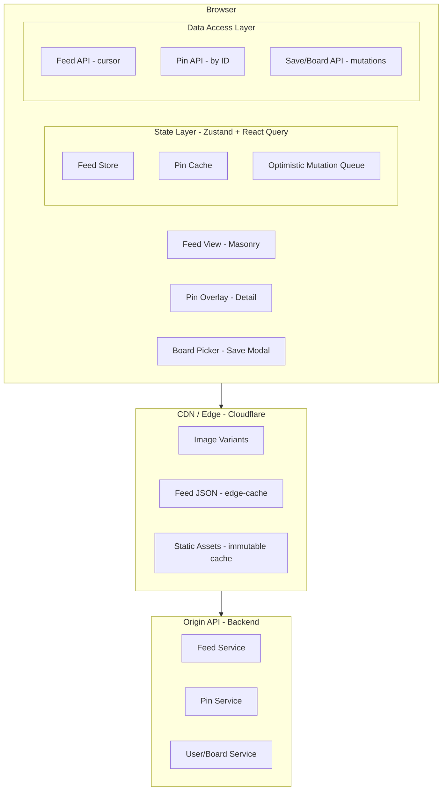

## Problem Statement

Pinterest's masonry feed is a variable-height, multi-column layout that renders thousands of heterogeneous image cards without fixed row boundaries. The architectural challenge is maintaining smooth 60fps scrolling while dynamically computing column positions for items whose height is unknown until image dimensions are resolved — a fundamentally harder problem than fixed-height virtual lists because the scroll container's total height changes as items load, and no item's position can be computed without knowing every preceding item's height in that column.

**Scope:** The feed rendering engine — masonry layout algorithm, virtualized infinite scroll, progressive image loading, pin detail overlay with deep-linking, save/unsave interactions, and responsive reflow. Out of scope: recommendation engine, search, notification system, ad injection (though we define the slot interface).

**Real-world production examples:** Pinterest (500M+ MAU), Unsplash (photo grid), Dribbble (shot feed), Behance (project gallery), Flickr Explore.

---

## Requirements Exploration

### Functional Requirements

1. Users browse a multi-column masonry feed with variable-height pins rendered via infinite scroll.
2. Pins display an image, title, author avatar, save count, and board attribution.
3. Clicking a pin opens a detail overlay at `/pin/\{id\}` without unmounting the feed (preserving scroll position).
4. Users save/unsave pins to boards with immediate (&lt;100ms) visual feedback via optimistic updates.
5. The feed adapts column count based on viewport width (2 columns on mobile, 4–6 on desktop).
6. Images load progressively with BlurHash/LQIP placeholders until full resolution arrives.
7. "Related pins" section in pin detail loads as a nested masonry grid with its own infinite scroll.
8. Feed supports mixed content types: standard pins, story pins (video), promoted pins (ads), and idea pins.

### Non-Functional Requirements

| Category      | Requirement                                     | Target                                       |
| ------------- | ----------------------------------------------- | -------------------------------------------- |
| Performance   | LCP (first meaningful paint of above-fold pins) | < 1.8s on 4G mid-range device                |
| Performance   | INP (tap-to-overlay response)                   | < 150ms                                      |
| Performance   | CLS (layout shift from image load)              | < 0.05                                       |
| Performance   | Scroll frame rate                               | 60fps sustained, < 16ms frame budget         |
| Bundle        | Initial JS payload                              | < 120KB compressed (feed route)              |
| Memory        | DOM node ceiling (virtualized)                  | < 500 nodes regardless of scroll depth       |
| Image         | First pin image decode                          | < 800ms on 4G                                |
| Accessibility | WCAG compliance                                 | AA (2.1)                                     |
| Resilience    | Partial API failure                             | Feed degrades gracefully with cached content |
| Scale         | Concurrent feed renders                         | Support 100K+ concurrent SSR requests        |

---

## Capacity Estimation & Constraints

**Traffic assumptions (Pinterest-scale):**

- 100M DAU, 60% mobile
- Average session: 8 minutes, 3 feed loads, ~200 pins viewed
- Peak: 3× average (Sunday evening US)
- Read:write ratio: 50:1 (saves are infrequent vs. views)

**Per-pin payload:**

- Pin metadata JSON: ~400 bytes (id, title, dimensions, author, board, blurhash, URLs)
- Initial page: 25 pins = 10KB JSON
- Image: average 80KB (compressed, served at appropriate resolution)
- First screen: 8–12 pins visible = ~700KB images (but lazy-loaded below fold)

**Client memory budget:**

- Normalized pin store: 2000 pins cached × 400B = 800KB
- Virtualized DOM: ~40 mounted cards × 3KB DOM subtree = 120KB DOM memory
- Image decode buffer: browser manages, but target < 50MB decoded pixels
- Total JS heap target: < 80MB after 10 minutes of scrolling

**Bandwidth per session:**

- 200 pins × 80KB images = 16MB images + 200 × 0.4KB metadata = ~16.1MB
- On 4G (10 Mbps): 16MB / 1.25 MB/s = ~13s total, amortized across session

**Why this matters:** The memory budget directly informs virtualization window size (how many offscreen items to keep mounted). The payload size informs pagination batch size — 25 pins per page balances network round-trips against time-to-first-pin.

---

## Architecture / High-Level Design

### Rendering Strategy

**Hybrid SSR + Client hydration.** The initial feed page is server-rendered with the first 25 pins (metadata + BlurHash placeholders) for SEO and LCP. Subsequent pages load client-side via cursor-based pagination. Pin detail overlays are fully client-rendered (no SSR benefit for modal content behind user interaction).

Justification: SSR gives us sub-2s LCP because the browser can paint placeholder cards before JS hydrates. Pure CSR would show a blank screen for 1.5–3s on 4G while the bundle downloads and executes.

### Navigation Model

**SPA with shallow routing for overlays.** The feed is a single route (`/`). Pin detail opens as an overlay that pushes `/pin/\{id\}` to history without unmounting the feed. Back navigation dismisses the overlay and restores the feed at the previous scroll position.

URL state encodes: feed position (opaque cursor in sessionStorage, not URL), active pin (path param), and active filters (query params).

### System Architecture Diagram



### Component Architecture

```
App (Server Component - layout shell)
├── FeedPage (Server Component - initial data fetch)
│   ├── FeedHeader (Server - filters, search link)
│   └── MasonryFeed (Client - 'use client')
│       ├── MasonryLayout (calculates column positions)
│       │   ├── VirtualWindow (intersection-based mount/unmount)
│       │   │   └── PinCard[] (individual pin renders)
│       │   │       ├── PinImage (progressive loading)
│       │   │       ├── PinMeta (title, author)
│       │   │       └── SaveButton (optimistic mutation)
│       │   └── ScrollSentinel (triggers next page fetch)
│       └── ColumnResizeObserver (responsive column calc)
├── PinOverlay (Client - portal, loaded on interaction)
│   ├── PinDetail (full pin data)
│   ├── RelatedPinsFeed (nested masonry, own scroll)
│   └── CommentSection (lazy loaded)
└── BoardPicker (Client - save modal)
```

### State Management Strategy

| State Type                 | Solution                              | Justification                                                              |
| -------------------------- | ------------------------------------- | -------------------------------------------------------------------------- |
| Server data (pins, boards) | React Query (TanStack Query)          | Automatic cache invalidation, background refetch, deduplication            |
| Feed scroll position       | Zustand (persisted to sessionStorage) | Survives overlay navigation, not URL-polluting                             |
| Layout positions           | useRef (mutable, no re-render)        | Column heights mutate on every item — triggering re-render would kill perf |
| Pin overlay active pin     | URL path (`/pin/\{id\}`)                | Deep-linkable, back-button works                                           |
| Optimistic save state      | React Query optimistic updates        | Rollback on server rejection                                               |
| Column count               | Derived from ResizeObserver           | Recalculated on viewport change                                            |

---

## Data Model / Entities

```typescript
/** Core pin entity as returned from API */
interface Pin {
  id: string;
  title: string;
  description: string;
  imageUrl: string; // Base URL, append size suffix
  width: number; // Original image width (pixels)
  height: number; // Original image height (pixels)
  aspectRatio: number; // Pre-computed width/height
  blurhash: string; // 4:3 component BlurHash string
  dominantColor: string; // Hex fallback if BlurHash decode fails
  author: PinAuthor;
  board: BoardRef | null; // null for profile pins without board
  saveCount: number;
  isSaved: boolean; // Current user's save state
  contentType: "image" | "video" | "story" | "idea";
  createdAt: string; // ISO 8601
  promotedMetadata: PromotedMeta | null;
}

interface PinAuthor {
  id: string;
  username: string;
  displayName: string;
  avatarUrl: string;
  isVerified: boolean;
}

interface BoardRef {
  id: string;
  name: string;
  slug: string;
}

interface PromotedMeta {
  advertiserId: string;
  clickUrl: string;
  impressionTracker: string;
  disclosureText: string;
}

/** Feed page response with cursor pagination */
interface FeedPage {
  pins: Pin[];
  cursor: string | null; // null = no more pages
  experimentFlags: Record<string, boolean>;
}

/** Masonry layout computed position for each pin */
interface LayoutItem {
  pinId: string;
  column: number; // 0-indexed column assignment
  top: number; // Absolute Y position in px
  left: number; // Absolute X position in px
  width: number; // Rendered width in px
  height: number; // Rendered height in px (from aspect ratio)
}

/** Virtualization window state */
interface VirtualWindow {
  startIndex: number; // First visible item index
  endIndex: number; // Last visible item index
  overscanStart: number; // Buffer items above viewport
  overscanEnd: number; // Buffer items below viewport
  scrollTop: number;
  viewportHeight: number;
  totalHeight: number; // Computed content height
}

/** Column state for masonry algorithm */
interface ColumnState {
  heights: number[]; // Current height of each column in px
  count: number; // Number of columns
  gap: number; // Inter-item gap in px
  columnWidth: number; // Computed column width in px
}

/** Board entity for save modal */
interface Board {
  id: string;
  name: string;
  slug: string;
  pinCount: number;
  coverImageUrl: string | null;
  isSecret: boolean;
  isCollaborative: boolean;
}

/** Optimistic mutation tracking */
interface PendingSave {
  pinId: string;
  boardId: string;
  timestamp: number;
  status: "pending" | "confirmed" | "failed";
}

/** Normalized client store shape */
interface FeedStore {
  pins: Record<string, Pin>; // Normalized by ID
  feedOrder: string[]; // Ordered pin IDs for current feed
  cursor: string | null;
  columnState: ColumnState;
  layouts: Record<string, LayoutItem>; // pinId → computed position
  pendingSaves: PendingSave[];
  boards: Record<string, Board>;
}
```

---

## Interface Definition (API)

### Feed Endpoint

```
GET /api/v3/feed/home?cursor={cursor}&limit=25
```

| Param  | Type   | Default | Description                                             |
| ------ | ------ | ------- | ------------------------------------------------------- |
| cursor | string | null    | Opaque pagination cursor (base64-encoded composite key) |
| limit  | number | 25      | Pins per page (max 50)                                  |

**Response:**

```typescript
interface FeedResponse {
  data: Pin[];
  pagination: {
    cursor: string | null;
    hasMore: boolean;
  };
  metadata: {
    experimentFlags: Record<string, boolean>;
    adSlots: number[]; // Indices where ads should be injected
  };
}
```

**Cache headers:** `Cache-Control: private, max-age=0, s-maxage=30, stale-while-revalidate=60`

Cursor-based (not offset) because: offset pagination breaks when new pins are inserted (items shift, causing duplicates/skips). Cursor encodes the last item's sort key, guaranteeing stable enumeration.

### Pin Detail Endpoint

```
GET /api/v3/pins/{pinId}
```

**Response:**

```typescript
interface PinDetailResponse {
  pin: Pin & {
    richDescription: string; // HTML-sanitized rich text
    link: string | null; // External click-through URL
    tags: string[];
    comments: Comment[]; // First page of comments
    relatedPinsCursor: string; // Cursor for related pins feed
  };
}
```

**Cache headers:** `Cache-Control: public, s-maxage=300, stale-while-revalidate=600`

### Save/Unsave Endpoint

```
POST /api/v3/pins/{pinId}/save
DELETE /api/v3/pins/{pinId}/save
```

**Request body (POST):**

```typescript
interface SaveRequest {
  boardId: string;
  idempotencyKey: string; // Client-generated UUID
}
```

**Response:** `201 Created` / `204 No Content`

Idempotency key prevents duplicate saves from optimistic retry logic. Client generates a UUID per save action and retries with the same key on network failure.

### Related Pins Endpoint

```
GET /api/v3/pins/{pinId}/related?cursor={cursor}&limit=25
```

Same pagination contract as the home feed. Separate endpoint because the recommendation model differs (pin-to-pin similarity vs. user interest graph).

### Image URL Contract

Images use a URL template pattern for responsive variants:

```
https://i.pinimg.com/originals/{hash}.jpg     → original
https://i.pinimg.com/736x/{hash}.jpg          → 736px wide
https://i.pinimg.com/474x/{hash}.jpg          → 474px wide
https://i.pinimg.com/236x/{hash}.jpg          → 236px wide (thumbnail)
```

The client selects the variant based on `columnWidth × devicePixelRatio`.

---

## Caching Strategy

### Client-Side Caching

**React Query normalized cache:**

- Feed pages cached with cursor key: `['feed', 'home', cursor]`
- Individual pins cached by ID: `['pin', pinId]`
- Stale time: 5 minutes for feed, 10 minutes for pin detail
- GC time: 30 minutes (pins removed from cache after inactivity)
- Max entities: 2000 pins in memory (React Query has no built-in LRU, enforce via `onSuccess` pruning)

**Service Worker (Workbox):**

- Cache-first for app shell (HTML, CSS, JS — immutable hashes)
- Stale-while-revalidate for image variants (images rarely change)
- Network-first for API responses (freshness over speed for personalized feed)
- Precache: critical route chunks, font files, BlurHash decoder WASM

**Image cache (browser-managed):**

- `Cache-Control: public, max-age=31536000, immutable` on image CDN responses
- Browser disk cache handles eviction (typically 200–500MB budget)
- No IndexedDB for images — browser cache is sufficient and better optimized

### CDN & Edge Caching

| Resource        | Cache-Control                                      | TTL    | Invalidation                            |
| --------------- | -------------------------------------------------- | ------ | --------------------------------------- |
| Feed JSON       | `private, s-maxage=30, stale-while-revalidate=60`  | 30s    | TTL-based (personalized, no purge)      |
| Pin detail JSON | `public, s-maxage=300, stale-while-revalidate=600` | 5min   | Purge on pin edit/delete                |
| Image variants  | `public, max-age=31536000, immutable`              | 1 year | URL changes on re-upload (hash in path) |
| JS/CSS bundles  | `public, max-age=31536000, immutable`              | 1 year | Content hash in filename                |
| HTML shell      | `public, s-maxage=60, stale-while-revalidate=300`  | 60s    | Deploy-triggered purge                  |

Edge compute (Cloudflare Workers) handles:

- Image format negotiation (check `Accept` header, redirect to AVIF/WebP variant)
- A/B experiment bucket assignment (cookie-based, cached per bucket)

### Cache Coherence

**Stale data detection:**

- Feed: refetch on tab focus after 5+ minutes (React Query `refetchOnWindowFocus`)
- Pin detail: version field in response; stale-while-revalidate shows cached, background fetches fresh
- Save count: eventual consistency acceptable (2–5s lag)

**Cross-tab consistency:**

- BroadcastChannel API syncs save/unsave actions across tabs
- When user saves in tab A, tab B updates its cache immediately without network request

**Optimistic update reconciliation:**

- Save action: immediately update `isSaved` and increment `saveCount` in cache
- On server confirmation: no-op (cache already correct)
- On server rejection (e.g., board deleted): rollback `isSaved`, decrement `saveCount`, show toast

**Deploy-time cache busting:**

- JS bundles: content-hashed filenames, old versions expire naturally
- API responses: no cache busting needed (short TTLs)
- Service Worker: `skipWaiting()` + `clientsClaim()` on new deployment

---

## Rendering & Performance Deep Dive

### Critical Rendering Path

**Tier 1 (0–500ms): Shell + Critical CSS**

- Server-rendered HTML with inline critical CSS (masonry grid skeleton)
- BlurHash-decoded placeholder images (decode happens in SSR via canvas-less library)
- No JS required for first paint — placeholders visible immediately

**Tier 2 (500ms–1.5s): Above-fold interactivity**

- Hydrate feed component, attach scroll listener
- Decode first 8–12 pin images (above fold)
- Initialize ResizeObserver for responsive columns

**Tier 3 (1.5s+): Below-fold and interaction-triggered**

- Lazy-load pin detail overlay code (dynamic import on first click)
- Load save/board picker module on first save button hover (prefetch on hover)
- Initialize intersection observers for lazy image loading

### Core Web Vitals Targets

| Metric | Target  | Strategy                                                                               |
| ------ | ------- | -------------------------------------------------------------------------------------- |
| LCP    | < 1.8s  | SSR first 25 pins, inline BlurHash CSS, preload hero image with `fetchpriority="high"` |
| INP    | < 150ms | Debounce save click handler, use `startTransition` for non-urgent updates              |
| CLS    | < 0.05  | Reserve space via aspect-ratio from known dimensions, BlurHash fills exact space       |
| FCP    | < 1.0s  | Inline critical CSS, SSR HTML, edge-cached responses                                   |
| TTFB   | < 400ms | Edge caching, regional origin selection                                                |

### Virtualization

<Callout>
  The masonry virtualization problem is fundamentally harder than fixed-height
  lists (react-window/react-virtual) because you cannot compute item Y positions
  with a simple `index × rowHeight`. Each item's position depends on the
  accumulated heights of all preceding items **in its specific column**. This
  requires maintaining column height accumulators and a spatial index for
  viewport intersection.
</Callout>

**Algorithm: Position-based virtualization (not index-based)**

```typescript
function getVisibleItems(
  layouts: LayoutItem[],
  scrollTop: number,
  viewportHeight: number,
  overscan: number = 300, // px buffer above and below
): LayoutItem[] {
  const viewStart = scrollTop - overscan;
  const viewEnd = scrollTop + viewportHeight + overscan;

  // Binary search for first item with top >= viewStart
  // (layouts sorted by top position within each column)
  return layouts.filter(
    (item) => item.top + item.height >= viewStart && item.top <= viewEnd,
  );
}
```

**Overscan buffer:** 300px (approximately 1.5 viewport heights on mobile). Justification: faster scroll velocities on mobile (flick gestures) require larger buffers to avoid visible pop-in. 300px catches 95th percentile scroll velocity without over-mounting.

**Scroll position restoration:** On overlay dismiss, restore `scrollTop` from Zustand (persisted to sessionStorage). Feed DOM is never unmounted during overlay — it remains in the background with `visibility: hidden` to preserve layout positions.

**Dynamic height handling:** Pin heights are pre-computable from `width / aspectRatio × columnWidth` — no measurement needed. This is the key insight: Pinterest knows image dimensions at upload time, so the layout engine never measures DOM.

### Image Optimization

**Format negotiation (server-side via CDN):**

1. Check `Accept` header for `image/avif` → serve AVIF (40% smaller than WebP)
2. Fallback to `image/webp` (30% smaller than JPEG)
3. Final fallback: JPEG (universal support)

**Responsive image selection:**

```typescript
function getImageUrl(pin: Pin, columnWidth: number): string {
  const targetWidth = columnWidth * window.devicePixelRatio;
  if (targetWidth <= 236) return pin.imageUrl.replace("/originals/", "/236x/");
  if (targetWidth <= 474) return pin.imageUrl.replace("/originals/", "/474x/");
  if (targetWidth <= 736) return pin.imageUrl.replace("/originals/", "/736x/");
  return pin.imageUrl; // original for 4K/retina wide layouts
}
```

**Progressive loading sequence:**

1. **Immediate:** BlurHash decoded to canvas (20 bytes → colored blur, < 1ms decode)
2. **Lazy (in viewport):** Load appropriate resolution via IntersectionObserver
3. **Transition:** Crossfade from blur to sharp (CSS `opacity` transition, 200ms)
4. **Offscreen:** Revoke object URLs for virtualized-out items to free decode memory

**`` implementation:**

```typescript

```

### Bundle Optimization

| Module                    | Strategy                                      | Size |
| ------------------------- | --------------------------------------------- | ---- |
| Masonry layout engine     | Inline (core)                                 | 3KB  |
| BlurHash decoder          | WASM, preloaded                               | 4KB  |
| React Query               | Shared chunk                                  | 12KB |
| Pin detail overlay        | Dynamic import on click                       | 18KB |
| Board picker              | Dynamic import on hover                       | 8KB  |
| Video player (story pins) | Dynamic import when video pin enters viewport | 45KB |
| Comment section           | Dynamic import on scroll-to-comments          | 15KB |

Total initial route: ~95KB compressed (React + React Query + feed components + masonry engine).

CI budget gate: Lighthouse CI runs on every PR. Bundle > 130KB or LCP > 2.5s fails the build.

---

## Security Deep Dive

### Threat Model

| Threat                                      | Attack Vector                                              | Mitigation                                                                                                                                             |
| ------------------------------------------- | ---------------------------------------------------------- | ------------------------------------------------------------------------------------------------------------------------------------------------------ |
| Malicious pin image (steganography/exploit) | User uploads crafted image that exploits decoder           | Transcode all uploads server-side through libvips; never render user-provided image URLs directly — always through CDN transform pipeline              |
| XSS via pin title/description               | Rich text injection in pin metadata                        | Server sanitizes at write time with DOMPurify; client renders titles as `textContent` (never `innerHTML`); descriptions use allowlisted HTML tags only |
| Open redirect via pin click-through URL     | Attacker sets pin link to `javascript:` or phishing domain | Allowlist URL schemes (`https://` only), render external links with `rel="noopener noreferrer"`, show interstitial warning for off-platform links      |
| CSRF on save/unsave                         | Forge save request to manipulate user's boards             | SameSite=Strict cookies + CSRF token in custom header (`X-CSRF-Token`); mutation endpoints reject requests without valid token                         |
| Scroll position fingerprinting              | Track scroll patterns to deanonymize users                 | No scroll telemetry sent without explicit consent; sampling rate configurable; aggregate metrics only                                                  |

### Content Security Policy

```
default-src 'self';
img-src 'self' https://i.pinimg.com https://*.cloudfront.net;
script-src 'self' 'nonce-{SERVER_GENERATED}';
style-src 'self' 'unsafe-inline';
connect-src 'self' https://api.pinterest.com wss://realtime.pinterest.com;
frame-ancestors 'none';
base-uri 'self';
```

`unsafe-inline` for styles is required because BlurHash generates inline background-color styles. Mitigation: styles are computed from trusted server data (BlurHash string), never from user-controlled input.

### Authentication & Authorization

- **Token strategy:** HttpOnly secure cookie with session ID (not JWT — avoids client-side token storage and XSS exfiltration)
- **Refresh:** Server extends session on activity; no client-side refresh token dance
- **API auth:** Cookie sent automatically on same-origin requests; CORS restricted to `*.pinterest.com`
- **Board privacy:** Server enforces board visibility — client never receives secret board pins for non-owner users

### Input Validation & Output Encoding

| Input Vector              | Validation                                             |
| ------------------------- | ------------------------------------------------------ |
| Pin title (display)       | Max 100 chars, rendered as textContent                 |
| Pin description (display) | Sanitized HTML subset, max 500 chars                   |
| Board name (create)       | Alphanumeric + spaces, max 50 chars                    |
| Search query (URL param)  | URL-encoded, stripped of control chars                 |
| External link (pin URL)   | Must parse as valid HTTPS URL, domain not on blocklist |

---

## Scalability & Reliability

### Scalability Patterns

**Cursor-based pagination:** Each feed response includes an opaque cursor encoding `(lastPinScore, lastPinId)`. This guarantees stable enumeration even as new pins are inserted, unlike offset which shifts items between pages.

**Virtualization for unbounded lists:** Regardless of how far the user scrolls (1000+ pins), only ~40 DOM nodes exist. Position is tracked via the layout map, not DOM measurement.

**Data-driven code loading:** The feed response includes `contentType` per pin. Video player code loads only when a `'video'` pin enters the viewport. If a session has no video pins, that 45KB bundle never downloads.

**Responsive column calculation:**

```typescript
function getColumnCount(containerWidth: number): number {
  if (containerWidth < 600) return 2;
  if (containerWidth < 900) return 3;
  if (containerWidth < 1200) return 4;
  if (containerWidth < 1800) return 5;
  return 6;
}
```

Column count recalculation triggers full layout recomputation — but since positions are pure functions of (pin dimensions, column width, gap), this is O(n) where n is cached pins, completing in < 5ms for 2000 items.

### Failure Handling

| Failure              | User Experience                                                                             | Recovery                                                                                                  |
| -------------------- | ------------------------------------------------------------------------------------------- | --------------------------------------------------------------------------------------------------------- |
| Feed API 5xx         | Show cached feed (stale-while-revalidate) + subtle "Having trouble loading new pins" banner | Exponential backoff: 1s → 2s → 4s → 8s, max 3 retries, then show persistent error                         |
| Image load failure   | Show BlurHash placeholder permanently + broken image icon overlay                           | Retry once after 5s; if still fails, degrade gracefully                                                   |
| Save API failure     | Revert optimistic update, show "Couldn't save — tap to retry" toast                         | User-initiated retry (no auto-retry for mutations to avoid unintended duplicates despite idempotency key) |
| Network offline      | Banner "You're offline — showing cached pins", disable save button                          | Queue save mutations in IndexedDB outbox, flush on reconnect                                              |
| Pin detail 404       | Redirect back to feed with toast "This pin is no longer available"                          | Remove pin from local cache to prevent stale card                                                         |
| WebSocket disconnect | Silently reconnect, no user-facing indication unless > 30s                                  | Exponential backoff reconnection, fall back to polling at 30s intervals                                   |

### Resilience Patterns

**Outbox pattern for offline saves:**

```typescript
interface OutboxEntry {
  id: string; // Idempotency key
  action: "save" | "unsave";
  pinId: string;
  boardId: string;
  timestamp: number;
  retryCount: number;
}
// Stored in IndexedDB, flushed FIFO on network restore
```

**Request deduplication:** React Query deduplicates in-flight requests with the same key. If user scrolls up and re-triggers a page fetch that's already in flight, no duplicate network request occurs.

**Circuit breaker:** If feed API returns 5xx 3 times consecutively, stop retrying for 30 seconds. Show cached data during this window. Prevents thundering herd on server recovery.

**Stale-while-revalidate for feed:** Show immediately from cache, background fetch to update. User sees content instantly; if data changed, UI updates seamlessly (React reconciliation handles DOM updates).

### Graceful Degradation

| Connection Quality | Experience                                                                     |
| ------------------ | ------------------------------------------------------------------------------ |
| Fast (4G+/WiFi)    | Full experience: high-res images, video autoplay, animations                   |
| Slow (3G)          | Reduced image quality (236px variants), no video autoplay, simpler transitions |
| Offline            | Cached pins only, no new content, save actions queued                          |
| No JS (SSR only)   | Static masonry grid with placeholder images, no interaction, links work        |

Detection via `navigator.connection.effectiveType` and Network Information API.

---

## Accessibility Deep Dive

### ARIA Roles and Landmarks

```html
<main role="main" aria-label="Pinterest home feed">
  <div role="feed" aria-busy="false" aria-label="Pin feed">
    <article
      role="article"
      aria-posinset="1"
      aria-setsize="-1"
      aria-label="Pin: Mountain landscape by @photographer"
    >
      <!-- Pin card content -->
    </article>
  </div>
</main>
```

- `role="feed"` on the masonry container — semantically correct for infinite scroll content
- `aria-setsize="-1"` because total count is unknown (infinite)
- `aria-posinset` updates as items virtualize in/out
- `aria-busy="true"` while loading next page, reverts to `false` when complete

### Keyboard Navigation

| Key        | Action                                         | Context                 |
| ---------- | ---------------------------------------------- | ----------------------- |
| Tab        | Move to next pin card                          | Feed                    |
| Shift+Tab  | Move to previous pin card                      | Feed                    |
| Enter      | Open pin detail overlay                        | Focused pin             |
| Escape     | Close overlay, return focus to originating pin | Pin overlay             |
| S          | Save/unsave focused pin                        | Feed (with pin focused) |
| Arrow Down | Scroll to next row of pins                     | Feed                    |
| Arrow Up   | Scroll to previous row of pins                 | Feed                    |
| Home       | Jump to first pin                              | Feed                    |
| End        | Load and jump to last loaded pin               | Feed                    |

<Callout>
  The masonry layout breaks natural Tab order because items are positioned
  absolutely. Implement `tabindex` management: assign `tabindex="0"` only to
  visible (virtualized-in) pins, and use `aria-flowto` to establish logical
  reading order across columns (left-to-right, top-to-bottom by visual position,
  not DOM order).
</Callout>

### Screen Reader Announcements

- **New pins loaded:** `aria-live="polite"` region announces "25 more pins loaded" when infinite scroll triggers
- **Save confirmation:** `aria-live="assertive"` announces "Pin saved to [board name]" or "Pin removed from [board name]"
- **Error state:** `role="alert"` for network errors and failed saves
- **Overlay open:** Focus moves to overlay heading; `aria-modal="true"` traps screen reader navigation

### Focus Management

- **Overlay open:** Focus trapped inside overlay (`inert` attribute on background feed)
- **Overlay close:** Focus restores to the pin card that triggered the overlay
- **Infinite scroll:** Focus remains on current pin; new pins do not steal focus
- **Route change:** `document.title` updates to reflect pin detail for screen reader announcement
- **Virtualization:** When a focused pin is virtualized out (scrolled offscreen), move focus to nearest visible pin to prevent focus loss

### Motion and Visual

- `prefers-reduced-motion: reduce` → disable BlurHash-to-image crossfade, disable scroll animations, use instant layout shifts
- Touch targets: pin cards are naturally large (>200×200px); save button is minimum 44×44px
- Forced colors mode: save icon uses `currentColor` for Windows High Contrast compatibility

---

## Monitoring & Observability

### Client-Side Metrics

| Metric                               | Method                                   | Alert Threshold                   |
| ------------------------------------ | ---------------------------------------- | --------------------------------- |
| LCP                                  | `web-vitals` lib, `PerformanceObserver`  | p75 > 2.5s                        |
| INP                                  | `web-vitals` lib                         | p75 > 200ms                       |
| CLS                                  | `web-vitals` lib                         | p75 > 0.1                         |
| Feed load time (cursor → render)     | Custom `performance.mark`                | p95 > 3s                          |
| Image decode time (BlurHash → sharp) | Custom timing                            | p95 > 2s                          |
| Scroll frame drops                   | `requestAnimationFrame` delta tracking   | > 5% dropped frames in session    |
| Virtualization accuracy              | Percentage of frames with pop-in visible | > 2% sessions with visible pop-in |
| Save mutation latency                | Time from click to server confirmation   | p95 > 2s                          |

### Error Tracking

- **Unhandled exceptions:** `window.addEventListener('error')` + `unhandledrejection`
- **React error boundaries:** Wrap `MasonryFeed`, `PinOverlay`, and `BoardPicker` independently — one failure doesn't crash the entire page
- **Image load failures:** Track per-image `onerror` rate; alert if > 5% of images fail in a 5-min window
- **Source maps:** Upload to Sentry on deploy; stack traces resolve to original TypeScript
- **Error grouping:** Deduplicate by `(error.message, error.stack[0].fileName, error.stack[0].lineNumber)`

### Logging & Tracing

- Every feed request includes a `X-Request-ID` header (UUID generated client-side)
- Traces correlate: client request → CDN hit/miss → origin response time
- Structured logs: `\{ event: 'feed_load', cursor, duration_ms, pin_count, cache_hit \}`
- Synthetic monitoring: Playwright script loads feed every 5 minutes from 3 geo regions, asserts LCP < 3s

### Alerting & Dashboards

**Day-1 Launch Dashboard (8 panels):**

1. LCP p50/p75/p95 (time series, 5-min buckets)
2. Feed API error rate (5xx responses / total requests)
3. Image CDN error rate (4xx + 5xx by region)
4. Save mutation success rate (successful / attempted)
5. Client JS error rate (errors/session)
6. Feed load count (requests/min, segmented by cursor=null vs cursor!=null)
7. Scroll depth distribution (histogram: how far users scroll)
8. Bundle size trend (per-route, overlaid on deploy markers)

**Alert routing:**

- Error rate > 1% for 5 min → Slack #feed-alerts
- LCP p75 > 4s for 10 min → PagerDuty (on-call engineer)
- Image CDN 5xx > 0.5% → Slack #infra-alerts + auto-ticket
- Bundle size increase > 10KB on merge → Block deploy, notify PR author

### Real User Monitoring

- **Sampling:** 100% for errors, 25% for performance metrics, 5% for full session replay
- **Segmentation:** device type × connection quality × geo region
- **Rage click detection:** 3+ clicks on same element within 2s → log with surrounding DOM snapshot
- **Funnel:** landing → scroll > 5 pins → click pin → save pin (track conversion and drop-off)

---

## Trade-offs

| Decision                                                   | Pro                                                                                                | Con                                                                                                               |
| ---------------------------------------------------------- | -------------------------------------------------------------------------------------------------- | ----------------------------------------------------------------------------------------------------------------- |
| Absolute positioning (not CSS columns/flexbox) for masonry | Full control over item placement; enables virtualization; allows column-height balancing algorithm | More complex code; requires manual reflow on resize; no native browser layout optimization                        |
| Pre-computed aspect ratios from server                     | Zero CLS; instant layout calculation; no DOM measurement needed                                    | Requires backend to store dimensions at upload time; fails gracefully if dimensions are missing (fallback to 1:1) |
| BlurHash over LQIP thumbnails                              | 20-byte string vs 1–2KB thumbnail; inline in JSON response; no extra image request                 | CPU cost to decode (~2ms per pin); requires canvas API or WASM decoder; adds bundle size                          |
| React Query over Redux/Zustand for server state            | Built-in caching, deduplication, background refetch, optimistic updates                            | Additional library (12KB); learning curve; less control over exact cache shape                                    |
| Cursor-based pagination over offset                        | Stable under insertions; no duplicates/skips; better DB performance (no OFFSET scan)               | Cannot jump to arbitrary page; harder to show "page X of Y"; opaque cursor debugging                              |
| 300px overscan buffer                                      | Eliminates visible pop-in for 95th percentile scroll velocity                                      | ~15 extra DOM nodes mounted; slightly higher memory/paint cost                                                    |
| SSR first page only (not full ISR)                         | Fresh personalized content; avoids stale cached recommendations                                    | Higher TTFB than ISR (can't serve from edge cache for personalized feed); requires origin roundtrip               |
| Session cookie auth over JWT                               | HttpOnly prevents XSS token theft; no refresh token complexity; server can invalidate instantly    | Requires server-side session store; not suitable for third-party API auth; cookies need CSRF protection           |
| Inline critical CSS over external stylesheet               | Eliminates render-blocking CSS request; faster FCP                                                 | HTML payload larger (~5KB); CSS not cached independently; duplication on navigation                               |
| Video lazy-load (45KB on demand) over preload              | 99% of feed sessions encounter < 5 video pins; saves bandwidth for majority                        | First video pin has 200–500ms delay before player is interactive                                                  |

---

## What Great Looks Like

A **senior** answer covers:

- Masonry layout algorithm with column-height balancing
- Basic infinite scroll with intersection observer pagination
- Responsive column count via media queries or ResizeObserver
- Image lazy loading with `loading="lazy"`

A **staff** answer additionally:

- Variable-height virtualization (position-based, not index-based) with overscan tuning
- BlurHash/LQIP progressive loading pipeline with zero-CLS guarantees
- Optimistic saves with rollback and idempotency keys
- Overlay routing that preserves feed scroll position (shallow routing + `inert`)
- Memory budget analysis driving virtualization window size
- Cross-tab cache coherence via BroadcastChannel
- Detailed failure mode table with specific recovery strategies per failure type

A **principal** answer additionally:

- Capacity math that directly informs batch size, overscan, and memory limits
- Platform-specific degradation strategy (connection-aware image quality, motion preferences)
- Day-1 observability dashboard with specific alert thresholds tied to business impact
- Accessibility deep dive including `role="feed"`, `aria-posinset` for virtualized items, and focus management for absolute-positioned layouts
- Security threat model specific to image-heavy UGC platforms (steganography, open redirects, XSS in rich text)

---

## Key Takeaways

- Masonry layout for variable-height items requires absolute positioning with pre-computed dimensions — CSS Grid/Flexbox cannot achieve gap-free waterfall layout with virtualization.
- Virtualization of masonry feeds is position-based (spatial intersection), not index-based (unlike fixed-height lists), because item Y positions are non-linear.
- Zero CLS in image-heavy feeds demands server-provided aspect ratios; BlurHash provides perceptual placeholders at negligible payload cost (20 bytes vs 2KB LQIP).
- Cursor-based pagination is non-negotiable for feeds with real-time insertions — offset pagination guarantees duplicate/skipped items.
- Overlay navigation must preserve the underlying feed DOM (use `inert` + visibility toggle) because recomputing 2000+ masonry positions on back-navigation destroys perceived performance.
- Optimistic mutations for save/unsave need idempotency keys to survive network retries without duplicating server state.
- Memory budget analysis (DOM nodes, decoded image pixels, JS heap) directly determines virtualization window size and cache eviction policy — these are not independent tuning knobs.
- Accessibility for masonry layouts requires explicit `aria-flowto` and `tabindex` management because absolute positioning breaks the natural document order that assistive technology relies on.
