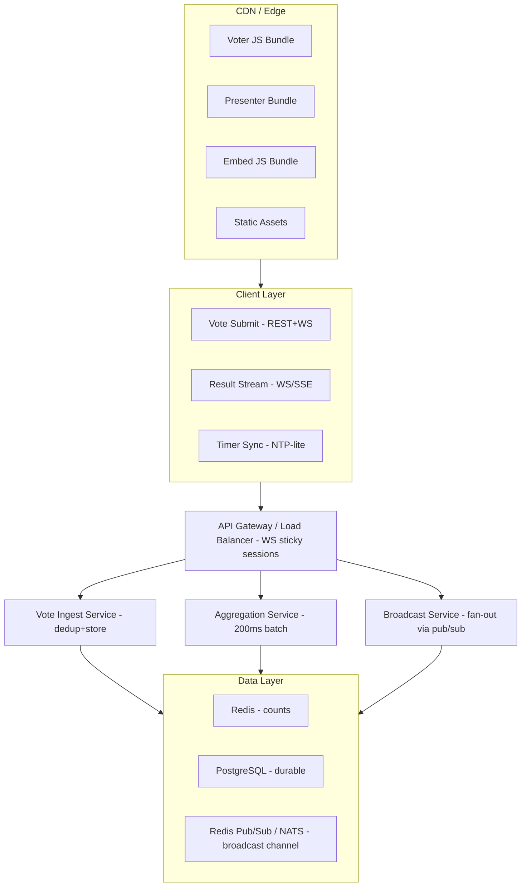

## Problem Statement

A real-time polling and voting system is a high-concurrency,
low-latency frontend application where the core challenge is processing tens of
thousands of simultaneous vote submissions while streaming live result updates to
every connected viewer without visible stutter or data inconsistency.

This design covers the frontend architecture for systems in the class of
Slido (live event Q&A and polls),
Mentimeter (interactive presentations),
Kahoot (gamified quizzes with countdown timers),
Twitter/X Polls (embedded inline voting),
and Strawpoll (lightweight instant polls).

Scope includes the poll creation interface,
voter submission flow,
real-time result streaming,
animated result visualization,
presenter mode (projector-optimized),
voter mode (mobile-optimized),
poll embed modes (iframe, web component, SDK),
countdown timer synchronization,
poll analytics,
anti-cheating mechanisms,
and offline/reconnect resilience.

Backend vote tallying internals,
ML-based fraud detection pipelines,
and email notification delivery are out of scope except where they define the client contract.

This problem is not equivalent to rendering a form.
A polling system is a real-time aggregation projection where the primary constraint is
read/write asymmetry under extreme concurrency.
During a live event with 100K connected viewers,
a single poll generates 50K+ votes in under 30 seconds.
The frontend must optimistically reflect the user's own vote,
stream aggregated results from the server,
animate transitions between states,
and prevent duplicate submissions —
all while maintaining 60fps on mid-range mobile devices.

Slido proves that event-driven context requires sub-second result propagation.
Mentimeter proves that presenter displays must be decoupled from voter interactions.
Kahoot proves that countdown synchronization creates perceived fairness.
Twitter Polls prove that embedded polls must function without navigation.
Strawpoll proves that anonymous voting requires anti-abuse without authentication.

<Callout>
  The architectural center of this system is not the form or the chart. It is
  the pipeline that transforms 100K discrete vote events into a smooth,
  real-time aggregation visualization without dropping frames or losing votes.
</Callout>

---

## Requirements Exploration

### Functional Requirements

1. Presenters can create polls with configurable types: single-choice, multi-choice (max N selections), ranked-choice, word cloud, and open-ended text.
2. Voters can submit their choice and immediately see their vote reflected in the results (optimistic update within 50ms).
3. All connected clients receive aggregated result updates within 500ms of any vote submission.
4. Polls support configurable countdown timers with server-synchronized start/end times.
5. Presenters see a dedicated presenter view optimized for projection (large fonts, high contrast, animated transitions).
6. Voters see a mobile-first voter view with clear tap targets and immediate feedback.
7. Polls can be embedded in external sites via iframe, web component (`<poll-widget>`), or JavaScript SDK.
8. Results render as animated bar charts, pie charts, word clouds, or ranked lists depending on poll type.
9. Presenters can lock/unlock polls, reveal results progressively, and reset votes.
10. The system enforces one-vote-per-entity (user, device, or session depending on configuration).
11. Voters can change their vote while the poll is open (if allowed by poll settings).
12. Poll analytics show turnout rate, vote timing distribution, geographic distribution, and drop-off metrics.

### Non-Functional Requirements

| Category      | Requirement                           | Target                           |
| ------------- | ------------------------------------- | -------------------------------- |
| Performance   | Time to Interactive (voter view)      | < 1.5s on 4G mid-range mobile    |
| Performance   | Vote submission to local reflection   | < 50ms (optimistic)              |
| Performance   | Vote submission to global propagation | < 500ms p95                      |
| Performance   | Result animation frame rate           | 60fps sustained                  |
| Bundle Size   | Voter view initial JS                 | < 80KB gzipped                   |
| Bundle Size   | Presenter view initial JS             | < 150KB gzipped                  |
| Concurrency   | Simultaneous voters per poll          | 100K+                            |
| Concurrency   | WebSocket connections per server      | 50K (with connection pooling)    |
| Reliability   | Vote delivery guarantee               | At-least-once with deduplication |
| Availability  | Uptime during live events             | 99.95%                           |
| Latency       | WebSocket message propagation         | < 200ms p99 server to client     |
| Accessibility | WCAG compliance                       | AA minimum                       |
| Security      | Duplicate vote prevention             | < 0.01% slip-through rate        |

---

## Capacity Estimation & Constraints

**Traffic profile for a large live event (100K attendees):**

| Metric                          | Value              | Derivation                  |
| ------------------------------- | ------------------ | --------------------------- |
| Peak concurrent viewers         | 100,000            | Single keynote poll         |
| Votes in first 30s              | 50,000             | 50% participation rate      |
| Peak vote RPS                   | ~1,700             | 50K / 30s                   |
| WebSocket messages out per vote | 100,000            | Fan-out to all viewers      |
| Total outbound messages/s       | ~170M messages/30s | 1,700 votes × 100K viewers  |
| Result aggregation frequency    | Every 200ms        | Batched to reduce fan-out   |
| Aggregated broadcasts/s         | 5                  | One per 200ms window        |
| Actual outbound messages/s      | 500K               | 5 broadcasts × 100K viewers |

**Payload sizes:**

| Payload                        | Size  | Notes                                             |
| ------------------------------ | ----- | ------------------------------------------------- |
| Vote submission                | ~120B | `{ pollId, optionId, timestamp, nonce }`          |
| Aggregated result update       | ~500B | `{ results: [{id, count, pct}], totalVotes, ts }` |
| Full poll state (initial load) | ~2KB  | Options, metadata, current results                |
| Presenter view full state      | ~5KB  | Includes analytics, voter breakdown               |

**Client memory budget:**

| Layer               | Budget  | Contents                                 |
| ------------------- | ------- | ---------------------------------------- |
| Poll state (active) | 50KB    | Current poll + results + animation state |
| WebSocket buffer    | 100KB   | Message queue for reconnection           |
| Chart rendering     | 200KB   | Canvas/SVG render tree                   |
| Total voter view    | < 500KB | Hard ceiling for mobile                  |

**Bandwidth per viewer:**

- Initial load: ~80KB (JS) + ~2KB (poll state) = ~82KB
- Ongoing: 5 messages/s × 500B = 2.5KB/s = ~150KB/min
- 10-minute session: ~1.5MB total data transfer

These numbers drive two architectural decisions:

1. Result broadcasting must be batched (200ms windows) not per-vote to avoid 170M messages/s.
2. The voter bundle must be aggressively split from the presenter bundle — voters need only submission + result display.

---

## Architecture / High-Level Design

### Rendering Strategy

**Voter view:** Client-Side Rendering (CSR) served from CDN.
Justification: Voter pages are identical for all users (no personalization until vote submission). The shell loads from edge cache in < 200ms. Poll data hydrates via WebSocket on connect. SSR adds no value because the content is entirely dynamic.

**Presenter view:** CSR with preloaded poll data via API.
Justification: Presenters authenticate before viewing. The view is fully interactive (controls, analytics). No SEO requirement. Initial poll state is fetched via REST, then streams via WebSocket.

**Embed widget:** CSR in shadow DOM (web component) or sandboxed iframe.
Justification: Embeds must not conflict with host page styles or scripts. Shadow DOM isolation prevents CSS leakage. Iframe provides security isolation for untrusted hosts.

### Navigation Model

Single-Page Application within each mode (voter/presenter). Modes are separate entry points:

- `/poll/:id` — Voter view (public, no auth required)
- `/present/:id` — Presenter view (authenticated)
- `/create` — Poll creation wizard (authenticated)
- `/analytics/:id` — Post-event analytics (authenticated)
- `/embed/:id` — Embed renderer (frameable, minimal shell)

URL state encodes: `pollId`, `view` (results/waiting/closed), and optional `theme` override for embeds.
No client-side routing between voter and presenter — they are separate bundles deployed to the same origin.

### System Architecture Diagram



### Component Architecture

```
┌─────────────────────────────────────────────────┐
│                  App Shell                        │
│  ┌───────────────────────────────────────────┐  │
│  │         WebSocket Provider                 │  │
│  │  ┌─────────────────────────────────────┐  │  │
│  │  │       Poll State Provider            │  │  │
│  │  │  ┌───────────┐  ┌───────────────┐   │  │  │
│  │  │  │VoterView  │  │PresenterView  │   │  │  │
│  │  │  │           │  │               │   │  │  │
│  │  │  │ ┌───────┐ │  │ ┌───────────┐ │   │  │  │
│  │  │  │ │VoteForm│ │  │ │ResultChart│ │   │  │  │
│  │  │  │ └───────┘ │  │ └───────────┘ │   │  │  │
│  │  │  │ ┌───────┐ │  │ ┌───────────┐ │   │  │  │
│  │  │  │ │Results │ │  │ │PollControl│ │   │  │  │
│  │  │  │ │Display │ │  │ │   Panel   │ │   │  │  │
│  │  │  │ └───────┘ │  │ └───────────┘ │   │  │  │
│  │  │  │ ┌───────┐ │  │ ┌───────────┐ │   │  │  │
│  │  │  │ │Timer  │ │  │ │ Analytics │ │   │  │  │
│  │  │  │ │Display│ │  │ │  Panel    │ │   │  │  │
│  │  │  │ └───────┘ │  │ └───────────┘ │   │  │  │
│  │  │  └───────────┘  └───────────────┘   │  │  │
│  │  └─────────────────────────────────────┘  │  │
│  └───────────────────────────────────────────┘  │
└─────────────────────────────────────────────────┘
```

**Server components:** None — both views are fully client-rendered. The CDN serves a static HTML shell with `<script>` tags.

**Client components:** Everything below App Shell. The WebSocket Provider and Poll State Provider are context-based providers. Views are code-split by entry point.

### State Management Strategy

| State Category                       | Storage                          | Sync Mechanism                                |
| ------------------------------------ | -------------------------------- | --------------------------------------------- |
| Poll metadata (title, options, type) | In-memory store (Zustand)        | REST fetch on connect, WS updates for changes |
| Aggregated results                   | In-memory store                  | WS push every 200ms                           |
| User's own vote                      | In-memory + localStorage         | Optimistic local → confirmed by server ACK    |
| Timer state                          | Derived from server clock offset | NTP-lite sync on connect, local countdown     |
| Presenter controls                   | In-memory store                  | REST mutations + WS confirmations             |
| Connection state                     | In-memory                        | WebSocket lifecycle events                    |
| Vote nonce (anti-replay)             | sessionStorage                   | Generated per vote, cleared on ACK            |

<Callout>
  The voter's own vote state uses a three-phase model: `pending` → `optimistic`
  → `confirmed`. The optimistic phase renders immediately on submission. If the
  server rejects (duplicate, closed, invalid), the state rolls back to `pending`
  with an error message. This ensures the voter always sees immediate feedback
  regardless of network latency.
</Callout>

---

## Data Model / Entities

```typescript
// ─── Poll Types ─────────────────────────────────────────────

type PollType =
  | "single-choice"
  | "multi-choice"
  | "ranked-choice"
  | "word-cloud"
  | "open-ended";

type PollStatus = "draft" | "open" | "locked" | "closed" | "archived";

type VotePrivacy = "anonymous" | "public" | "partially-anonymized";

interface PollOption {
  id: string; // UUID, stable across edits
  label: string; // Display text (max 200 chars)
  position: number; // Render order
  colorHint: string; // Hex color for chart segments
}

interface PollConfig {
  type: PollType;
  maxSelections: number; // For multi-choice: max options selectable
  allowVoteChange: boolean; // Can voter change after submitting
  showResultsBeforeClose: boolean; // Live results visible to voters
  timerDurationMs: number | null; // null = no timer
  privacy: VotePrivacy;
  requireAuth: boolean; // Require login vs anonymous
  antiCheat: AntiCheatConfig;
}

interface AntiCheatConfig {
  fingerprintEnabled: boolean; // Browser fingerprint dedup
  captchaOnSubmit: boolean; // CAPTCHA challenge before vote
  ipRateLimit: number; // Max votes per IP per minute
  cookieEnforcement: boolean; // First-party cookie dedup
}

interface Poll {
  id: string; // UUID
  slug: string; // URL-friendly identifier
  title: string; // Poll question text
  description: string | null; // Optional context
  options: PollOption[]; // 2–20 options
  config: PollConfig;
  status: PollStatus;
  createdBy: string; // User ID of creator
  createdAt: number; // Unix timestamp ms
  opensAt: number | null; // Scheduled open time
  closesAt: number | null; // Auto-close time (timer end)
  totalVotes: number; // Denormalized count
  embedAllowed: boolean; // Can be embedded externally
}

// ─── Vote Types ─────────────────────────────────────────────

interface VoteSubmission {
  pollId: string;
  optionIds: string[]; // Array for multi/ranked-choice
  rankings: number[] | null; // Position rankings for ranked-choice
  textResponse: string | null; // For open-ended
  nonce: string; // Idempotency key (UUID)
  timestamp: number; // Client timestamp
  fingerprint: string | null; // Browser fingerprint hash
}

interface VoteConfirmation {
  pollId: string;
  nonce: string; // Echoed back for client dedup
  accepted: boolean;
  rejectionReason: VoteRejection | null;
  serverTimestamp: number;
}

type VoteRejection =
  | "already-voted"
  | "poll-closed"
  | "poll-locked"
  | "invalid-option"
  | "rate-limited"
  | "captcha-required"
  | "fingerprint-duplicate";

// ─── Result Types ───────────────────────────────────────────

interface AggregatedResult {
  pollId: string;
  results: OptionResult[];
  totalVotes: number;
  lastUpdatedAt: number; // Server timestamp
  voterTurnout: number; // percentage 0-100
}

interface OptionResult {
  optionId: string;
  count: number;
  percentage: number; // Pre-computed server-side (0-100)
  rank: number; // Position by vote count
  delta: number; // Change since last broadcast (+/-)
}

// ─── WebSocket Message Types ────────────────────────────────

type WSInboundMessage =
  | { type: "subscribe"; pollId: string; role: "voter" | "presenter" }
  | { type: "vote"; payload: VoteSubmission }
  | { type: "ping" };

type WSOutboundMessage =
  | { type: "result-update"; payload: AggregatedResult }
  | {
      type: "poll-status-change";
      payload: { pollId: string; status: PollStatus };
    }
  | { type: "timer-sync"; payload: { serverTime: number; endsAt: number } }
  | { type: "vote-ack"; payload: VoteConfirmation }
  | { type: "pong"; serverTime: number }
  | { type: "error"; code: string; message: string };

// ─── Client State ───────────────────────────────────────────

interface PollClientState {
  poll: Poll | null;
  results: AggregatedResult | null;
  userVote: UserVoteState;
  connection: ConnectionState;
  timer: TimerState;
  animation: AnimationState;
}

interface UserVoteState {
  status: "idle" | "pending" | "optimistic" | "confirmed" | "rejected";
  selectedOptionIds: string[];
  submittedAt: number | null;
  rejectionReason: VoteRejection | null;
}

interface ConnectionState {
  status: "connecting" | "connected" | "reconnecting" | "disconnected";
  latencyMs: number;
  serverTimeOffsetMs: number; // serverTime - clientTime
  reconnectAttempt: number;
  lastMessageAt: number;
}

interface TimerState {
  isActive: boolean;
  remainingMs: number;
  serverEndsAt: number; // Absolute server timestamp
  localEndsAt: number; // Adjusted for clock offset
  driftCorrectionMs: number; // Cumulative drift correction
}

interface AnimationState {
  previousResults: OptionResult[] | null; // For interpolation
  transitionProgress: number; // 0-1 animation progress
  isAnimating: boolean;
}
```

---

## Interface Definition (API)

### REST Endpoints

| Method | Path                       | Purpose                               | Auth             |
| ------ | -------------------------- | ------------------------------------- | ---------------- |
| GET    | `/api/polls/:id`           | Fetch poll metadata + current results | Optional         |
| POST   | `/api/polls`               | Create new poll                       | Required         |
| PATCH  | `/api/polls/:id/status`    | Lock/unlock/close poll                | Required (owner) |
| POST   | `/api/polls/:id/votes`     | Submit vote (fallback for no-WS)      | Optional         |
| GET    | `/api/polls/:id/analytics` | Detailed vote analytics               | Required (owner) |
| POST   | `/api/polls/:id/reset`     | Reset all votes                       | Required (owner) |

### Vote Submission (REST fallback)

```typescript
// POST /api/polls/:id/votes
// Headers: X-Idempotency-Key: <nonce>
// Headers: X-Fingerprint: <hash>

interface VoteRequest {
  optionIds: string[];
  rankings: number[] | null;
  textResponse: string | null;
  captchaToken: string | null;
}

// 200 OK
interface VoteResponse {
  accepted: boolean;
  nonce: string;
  updatedResults: AggregatedResult | null; // Included if showResultsBeforeClose
}

// 409 Conflict (duplicate vote)
interface VoteDuplicateError {
  error: "already-voted";
  existingVoteAt: number;
}

// 429 Too Many Requests
interface VoteRateLimitError {
  error: "rate-limited";
  retryAfterMs: number;
}
```

### WebSocket Contract

```typescript
// Connection: wss://ws.polls.example.com/poll/:id?role=voter&token=<optional>

// Client → Server
// Subscribe on connect (implicit from URL params)
// Vote submission
{ "type": "vote", "payload": { "optionIds": ["opt-1"], "nonce": "uuid-v4", "fingerprint": "hash" } }

// Heartbeat (every 25s)
{ "type": "ping" }

// Server → Client
// Initial state on subscribe
{ "type": "result-update", "payload": { "pollId": "...", "results": [...], "totalVotes": 4521 } }

// Batched result update (every 200ms during active voting)
{ "type": "result-update", "payload": { "results": [...], "totalVotes": 4583, "lastUpdatedAt": 1714500000000 } }

// Vote acknowledgement
{ "type": "vote-ack", "payload": { "nonce": "uuid-v4", "accepted": true, "rejectionReason": null } }

// Timer sync (every 5s during countdown)
{ "type": "timer-sync", "payload": { "serverTime": 1714500000000, "endsAt": 1714500030000 } }

// Poll status change (lock, close, etc.)
{ "type": "poll-status-change", "payload": { "pollId": "...", "status": "closed" } }

// Heartbeat response
{ "type": "pong", "serverTime": 1714500000000 }
```

### Embed SDK API

```typescript
// External usage:
// <script src="https://polls.example.com/sdk.js"></script>
// PollSDK.embed('#container', { pollId: 'abc', theme: 'dark' });

interface PollSDKOptions {
  pollId: string;
  theme: "light" | "dark" | "auto";
  locale: string;
  showBranding: boolean;
  onVote: (optionIds: string[]) => void; // Callback for host page
  onResults: (results: AggregatedResult) => void;
  containerStyle: Partial<CSSStyleDeclaration>;
}
```

---

## Caching Strategy

### Client-Side Caching

**In-memory store (Zustand):**

- Active poll state: no eviction (single poll per view)
- Previous result snapshots: ring buffer of last 10 updates for animation interpolation
- User vote state: persisted to `localStorage` keyed by `poll:${pollId}:vote`
- Size limit: 500KB total memory budget per tab

**localStorage persistence:**

| Key                      | TTL       | Purpose                                               |
| ------------------------ | --------- | ----------------------------------------------------- |
| `poll:${id}:vote`        | 30 days   | Remember user's vote (prevents re-vote after refresh) |
| `poll:${id}:fingerprint` | Session   | Device fingerprint for anti-cheat                     |
| `poll:client-id`         | Permanent | Stable client identifier for analytics                |
| `poll:clock-offset`      | 5 minutes | Server time offset (refreshed on WS connect)          |

**Service Worker strategy:**

- Cache-first for static assets (JS bundles, fonts, icons) — immutable with hash filenames
- Network-first for poll data API (`/api/polls/:id`) — always prefer fresh
- No SW caching for WebSocket traffic

### CDN & Edge Caching

| Resource                   | Cache-Control                                      | Invalidation                 |
| -------------------------- | -------------------------------------------------- | ---------------------------- |
| Voter bundle JS            | `public, max-age=31536000, immutable`              | Content-hash in filename     |
| Presenter bundle JS        | `public, max-age=31536000, immutable`              | Content-hash in filename     |
| HTML shell                 | `public, s-maxage=300, stale-while-revalidate=600` | Deploy-time purge            |
| `/api/polls/:id` (GET)     | `public, s-maxage=5, stale-while-revalidate=10`    | Short TTL, live data         |
| `/api/polls/:id/analytics` | `private, no-store`                                | Authenticated, never cached  |
| Embed SDK (`sdk.js`)       | `public, max-age=3600`                             | Versioned URL (`/v2/sdk.js`) |

Edge compute (Cloudflare Workers) handles:

- Geolocation injection for analytics (no client API call needed)
- Rate limiting at edge (before reaching origin)
- WebSocket upgrade routing to nearest WS server

### Cache Coherence

**Stale data detection:**

- Every WS message includes `lastUpdatedAt` timestamp
- Client compares against local state timestamp; if server timestamp is older (duplicate/out-of-order), message is discarded
- Sequence numbers on WS messages detect gaps; missing sequences trigger full state refetch

**Cross-tab consistency:**

- `BroadcastChannel('poll-votes')` synchronizes vote state across tabs
- If user votes in one tab, all tabs for the same poll reflect immediately
- Leader election: first tab to connect WS becomes the "leader"; other tabs receive updates via BroadcastChannel (reduces connection count)

**Optimistic update reconciliation:**

- On vote submission: immediately increment local count, mark vote as `optimistic`
- On server ACK (`vote-ack`): transition to `confirmed`, next `result-update` from server becomes authoritative
- On server NACK: roll back local count, show error, transition to `rejected`
- If `result-update` arrives before ACK: merge by keeping the higher of (local optimistic count, server count) for the voted option

**Cache versioning on deploy:**

- HTML shell includes `<meta name="app-version" content="v2.3.1">`
- WS server sends version in handshake; if mismatch, client shows "Update available" banner
- Hard refresh forced only on major version bumps

---

## Rendering & Performance Deep Dive

### Critical Rendering Path

**Tier 1 (0–500ms):** HTML shell + critical CSS (inline) + loading skeleton. Skeleton shows poll question placeholder and option bars. Size: < 15KB total.

**Tier 2 (500ms–1.5s):** Voter bundle loads. WebSocket connects. Poll data arrives. First meaningful paint: question text + option buttons rendered. Size: < 80KB gzipped JS.

**Tier 3 (1.5s–3s):** Chart library (for result visualization) loads on demand after vote submission or if `showResultsBeforeClose` is true. Animation engine initializes. Size: < 40KB gzipped.

**Tier 4 (deferred):** Analytics panel (presenter only), word cloud renderer, export utilities. Loaded on interaction. Size: varies.

### Core Web Vitals Targets

| Metric | Target  | Strategy                                                           |
| ------ | ------- | ------------------------------------------------------------------ |
| LCP    | < 1.2s  | Inline critical CSS, preload fonts, CDN-served shell               |
| INP    | < 100ms | Vote submission is async; UI updates are synchronous state changes |
| CLS    | < 0.05  | Fixed-height option containers, skeleton matches final layout      |
| FCP    | < 600ms | Inline HTML shell with question text placeholder                   |
| TTFB   | < 100ms | Edge-cached HTML, no server rendering                              |

### Result Animation Engine

```typescript
// Animation uses requestAnimationFrame with eased interpolation
// between previous and current result states

function animateResults(
  from: OptionResult[],
  to: OptionResult[],
  duration: number = 400,
): void {
  const startTime = performance.now();

  function frame(now: number): void {
    const elapsed = now - startTime;
    const progress = Math.min(elapsed / duration, 1);
    const eased = easeOutCubic(progress);

    for (let i = 0; i < to.length; i++) {
      const fromPct = from[i]?.percentage ?? 0;
      const toPct = to[i].percentage;
      const currentPct = fromPct + (toPct - fromPct) * eased;
      renderBar(to[i].optionId, currentPct);
    }

    if (progress < 1) {
      requestAnimationFrame(frame);
    }
  }

  requestAnimationFrame(frame);
}

function easeOutCubic(t: number): number {
  return 1 - Math.pow(1 - t, 3);
}
```

Key decisions:

- Result bars use CSS `transform: scaleX()` for width animation (GPU-composited, no layout thrash)
- Percentage labels use `will-change: contents` sparingly, updated via direct DOM manipulation for 60fps
- Word cloud uses canvas (not DOM) for 200+ word rendering
- Ranked-choice results use FLIP animation for reordering

### Bundle Optimization

| Dependency             | Size | Loading Strategy                          |
| ---------------------- | ---- | ----------------------------------------- |
| Zustand                | 2KB  | Voter bundle (always)                     |
| Chart.js (results)     | 35KB | Dynamic import on first result display    |
| Canvas word cloud      | 12KB | Dynamic import for word-cloud polls only  |
| CAPTCHA SDK            | 25KB | Dynamic import on vote if captchaOnSubmit |
| Reconnecting WebSocket | 3KB  | Voter bundle (always)                     |
| Fingerprint.js         | 8KB  | Dynamic import if fingerprintEnabled      |

Total voter critical path: ~80KB (Zustand + WS lib + UI components + poll logic).

---

## Security Deep Dive

### Threat Model

| Threat               | Attack Vector                                        | Impact                           | Mitigation                                                                       |
| -------------------- | ---------------------------------------------------- | -------------------------------- | -------------------------------------------------------------------------------- |
| Vote stuffing        | Automated scripts submitting thousands of votes      | Corrupted results, loss of trust | Fingerprinting + rate limiting + CAPTCHA + nonce dedup                           |
| Result manipulation  | Man-in-the-middle modifying WS messages              | Viewers see false results        | WSS (TLS) + message signing (HMAC) + server-authoritative state                  |
| Poll takeover        | CSRF on presenter endpoints (lock/close/reset)       | Poll disrupted during live event | SameSite cookies + CSRF token + re-auth for destructive actions                  |
| Timer desync exploit | Client clock manipulation to vote after deadline     | Unfair late votes                | Server-authoritative close time; votes rejected if serverTime > closesAt         |
| Embed clickjacking   | Wrapping embed in invisible overlay to harvest votes | Involuntary vote submission      | `X-Frame-Options: ALLOW-FROM` allowlist + framebusting for non-allowlisted hosts |

### Anti-Cheating

**Multi-layer deduplication:**

```
Layer 1: Nonce (idempotency key) → prevents exact replay
Layer 2: Session cookie (httpOnly, SameSite=Strict) → one vote per session
Layer 3: Browser fingerprint (canvas + WebGL + fonts + timezone) → one vote per device
Layer 4: IP rate limiting (10 votes/min/IP) → prevents botnet spray
Layer 5: CAPTCHA challenge (configurable) → blocks automated tools
```

**Fingerprint generation (client-side):**

```typescript
async function generateFingerprint(): Promise<string> {
  const components = [
    navigator.userAgent,
    navigator.language,
    screen.width + "x" + screen.height,
    new Date().getTimezoneOffset().toString(),
    await getCanvasFingerprint(),
    await getWebGLFingerprint(),
    navigator.hardwareConcurrency?.toString() ?? "unknown",
  ];

  const raw = components.join("|");
  const buffer = await crypto.subtle.digest(
    "SHA-256",
    new TextEncoder().encode(raw),
  );
  return Array.from(new Uint8Array(buffer))
    .map((b) => b.toString(16).padStart(2, "0"))
    .join("");
}
```

The fingerprint is sent with the vote but **never stored raw** — only the hash is compared server-side.

### Rate Limiting

| Scope                      | Limit           | Window           | Action on Exceed                |
| -------------------------- | --------------- | ---------------- | ------------------------------- |
| Per IP                     | 10 votes        | 60s              | 429 + retry-after header        |
| Per fingerprint            | 1 vote per poll | Poll lifetime    | 409 Conflict                    |
| Per session                | 1 vote per poll | Session lifetime | 409 Conflict                    |
| WS messages per connection | 30 messages     | 10s              | Connection throttled (buffered) |
| Poll creation per user     | 20 polls        | 24h              | 429 + upgrade prompt            |

Rate limiting is enforced at the edge (Cloudflare) for IP-level and at the application layer for session/fingerprint-level.

### Abuse Prevention

- **Tor/VPN detection:** Flag votes from known exit nodes; require CAPTCHA for flagged IPs
- **Behavioral analysis:** Votes submitted < 500ms after poll load are flagged (bot speed)
- **Referrer validation for embeds:** Embedded polls only accept votes from allowlisted domains
- **Vote velocity monitoring:** If vote rate exceeds 3× expected for audience size, auto-enable CAPTCHA
- **Presenter notification:** Real-time alert to presenter when suspicious activity detected

<Callout>
  For anonymous polls, the system faces a fundamental tension: stronger
  anti-cheat requires more device identification, which conflicts with voter
  privacy. The resolution is configurable tiers: "casual" (cookie-only),
  "standard" (cookie + fingerprint), and "strict" (fingerprint + CAPTCHA +
  auth). Presenters choose the tier when creating the poll.
</Callout>

---

## Scalability & Reliability

### Scalability Patterns

**WebSocket fan-out architecture:**

```
┌──────────────────────────────────────────────────────────────┐
│                                                               │
│  Vote Ingest ──→ Redis INCR ──→ Aggregation Worker           │
│                                      │                        │
│                               Redis Pub/Sub                   │
│                              ╱       │       ╲                │
│                    WS Server 1   WS Server 2   WS Server N   │
│                    (25K conn)   (25K conn)    (25K conn)      │
│                                                               │
└──────────────────────────────────────────────────────────────┘
```

- Each WS server handles 25K–50K connections
- Aggregation worker publishes to Redis Pub/Sub channel `poll:{id}:results`
- All WS servers subscribe to the channel and broadcast to their connected clients
- Horizontal scaling: add WS servers, connections distributed by load balancer

**Connection pooling for embeds:**

- Embedded polls on high-traffic pages (e.g., news site with 1M readers) use shared WebSocket connections
- One WS connection per browser tab, multiplexed across multiple poll embeds on the same page
- SDK manages connection lifecycle: connect on first poll visible, disconnect after 30s of no visible polls

### Failure Handling

| Failure Mode                    | Detection                            | User Experience                                  | Recovery                                                                                              |
| ------------------------------- | ------------------------------------ | ------------------------------------------------ | ----------------------------------------------------------------------------------------------------- |
| WebSocket disconnect            | `onclose` event                      | "Reconnecting..." banner, results freeze         | Exponential backoff: 1s, 2s, 4s, 8s, max 30s. Jitter ±500ms. Full state refetch on reconnect.         |
| Vote submission timeout         | No ACK within 5s                     | Vote button shows spinner, then "Retry"          | Client retries with same nonce (idempotent). Max 3 retries. After 3: show "Submit failed, try again." |
| Server returns 5xx              | HTTP status code                     | Error banner: "Something went wrong"             | Retry with backoff. Fall back to REST polling (GET results every 2s) if WS is down.                   |
| Clock drift detected            | Timer mismatch > 2s from server sync | Timer auto-corrects (smooth adjustment, no jump) | Re-sync on next `timer-sync` message. If drift > 5s, hard reset timer.                                |
| Stale results (no update > 10s) | Missing heartbeat during active poll | "Results may be delayed" indicator               | Send explicit `ping`; if no `pong` in 3s, reconnect.                                                  |

### Resilience Patterns

- **Outbox pattern:** Votes are stored in `sessionStorage` before submission. If submission fails and user navigates away, the vote is retried on next page load.
- **Idempotency keys:** Every vote includes a UUID nonce. Server deduplicates. Safe to retry indefinitely.
- **Circuit breaker:** If 5 consecutive WS reconnect attempts fail within 60s, fall back to REST polling mode (GET every 2s). Display "Live updates unavailable" notice.
- **Graceful degradation tiers:**

| Connection Quality | Experience                                                             |
| ------------------ | ---------------------------------------------------------------------- |
| WebSocket healthy  | Real-time results, 200ms batches                                       |
| WebSocket flapping | Results via REST polling every 2s                                      |
| Offline            | Show last known results + "Offline" badge, queue vote                  |
| No JavaScript      | Progressive enhancement: form POST submission, page reload for results |

### Offline & Reconnect

```typescript
// Reconnection state machine
type ConnectionPhase =
  | "connected" // WS open, messages flowing
  | "reconnecting" // WS closed, attempting reconnect
  | "polling-fallback" // WS failed, using REST
  | "offline"; // No network detected

// On reconnect, request full state to reconcile
// Server responds with latest AggregatedResult
// Client compares sequence numbers and fast-forwards
```

---

## Accessibility Deep Dive

### Semantic Structure

```html
<!-- Voter view landmark structure -->
<main role="main" aria-labelledby="poll-title">
  <h1 id="poll-title">Which framework do you prefer?</h1>

  <form
    role="radiogroup"
    aria-labelledby="poll-title"
    aria-describedby="poll-instructions"
  >
    <p id="poll-instructions" class="sr-only">
      Select one option then press Submit Vote.
    </p>

    <label>
      <input
        type="radio"
        name="vote"
        value="opt-1"
        aria-describedby="opt-1-pct"
      />
      React
    </label>
    <span id="opt-1-pct" aria-live="polite">42%</span>

    <!-- ... more options ... -->
  </form>

  <button type="submit" aria-busy="false">Submit Vote</button>

  <section aria-label="Results" aria-live="polite" aria-atomic="true">
    <!-- Result bars announced on update -->
  </section>

  <div role="timer" aria-live="assertive" aria-label="Time remaining">
    <!-- Countdown announced at 30s, 10s, 5s, 0s -->
  </div>
</main>
```

### Keyboard Navigation

| Key           | Context               | Action                                   |
| ------------- | --------------------- | ---------------------------------------- |
| Tab           | Options list          | Move between options                     |
| Space/Enter   | Focused option        | Select/deselect option                   |
| Arrow Up/Down | Radio group           | Navigate options (native radio behavior) |
| Enter         | Submit button focused | Submit vote                              |
| Escape        | Any                   | Close result overlay (presenter mode)    |
| 1–9           | Options list          | Quick-select option by number            |

### Screen Reader Announcements

- On poll load: "Poll: [title]. [N] options available. [Timer: X seconds remaining / No time limit]."
- On vote submission: "Vote submitted for [option label]."
- On vote rejection: "Vote not accepted. Reason: [reason]."
- On result update: Announced only at meaningful thresholds (every 10% change or when a new option takes the lead). Avoids announcement storm during rapid voting.
- On timer milestones: "30 seconds remaining." / "10 seconds remaining." / "5, 4, 3, 2, 1." / "Poll closed."
- On poll status change: "Poll is now [locked/closed/open]."

### Motion & Contrast

- `prefers-reduced-motion`: Disable bar animation, use instant transitions. Disable word cloud float animation.
- Result bars use both color AND pattern fills for colorblind accessibility.
- Minimum contrast: 4.5:1 for all text, 3:1 for large text (option labels > 18px).
- Focus indicators: 3px solid outline with 2px offset, high-contrast color.
- Touch targets: All option buttons ≥ 48×48px. Submit button ≥ 48×120px.

---

## Monitoring & Observability

### Client-Side Metrics

| Metric                                  | Collection                                 | Alert Threshold       |
| --------------------------------------- | ------------------------------------------ | --------------------- |
| Vote submission latency (p50, p95, p99) | Custom timing via `performance.mark`       | p95 > 2s              |
| Time to first result display            | Navigation timing + custom mark            | > 3s                  |
| WebSocket connection success rate       | Connect attempts / successful connects     | < 95%                 |
| WebSocket reconnection frequency        | Counter per session                        | > 5 reconnects / 5min |
| Result animation frame drops            | `requestAnimationFrame` timing gaps > 20ms | > 10% frames dropped  |
| Vote rejection rate                     | Client-side counter                        | > 5% of submissions   |
| Client error rate                       | `window.onerror` + boundary catches        | > 1% of sessions      |
| Bundle load time                        | Resource Timing API                        | Voter bundle > 2s     |

### Error Tracking

- Unhandled promise rejections captured via `window.addEventListener('unhandledrejection')`
- React error boundaries at: App level, Result chart level, Vote form level
- Source maps uploaded to error tracking service (Sentry) on deploy
- Errors grouped by: poll ID, error type, browser, connection state
- Alert: > 50 errors/min across all clients for a single poll

### Logging & Tracing

```typescript
// Every WS message includes a correlationId for server-side tracing
interface ClientLog {
  timestamp: number;
  sessionId: string;
  pollId: string;
  event: string; // 'vote-submitted' | 'ws-connected' | 'result-received' | ...
  latencyMs: number | null;
  metadata: Record<string, string | number>;
}

// Sampled at 10% for normal events, 100% for errors
```

### Day-1 Launch Dashboard

| Panel                        | Visualization                   | Purpose                 |
| ---------------------------- | ------------------------------- | ----------------------- |
| Active WebSocket connections | Real-time gauge                 | Capacity monitoring     |
| Votes per second             | Time-series line chart          | Traffic spike detection |
| Vote submission p95 latency  | Time-series with threshold line | Performance regression  |
| WS reconnection rate         | Percentage gauge                | Connection stability    |
| Error rate by type           | Stacked bar chart               | Issue classification    |
| Client JS errors             | Counter with trend              | Deployment regression   |
| Result broadcast lag         | Histogram                       | Fan-out health          |
| Geographic vote distribution | Heatmap                         | CDN/edge coverage gaps  |

### Alerting Rules

| Condition                                 | Severity | Action             |
| ----------------------------------------- | -------- | ------------------ |
| Error rate > 1% for 2 min                 | Warning  | Slack notification |
| Error rate > 5% for 1 min                 | Critical | PagerDuty page     |
| WS connections drop > 20% in 30s          | Critical | PagerDuty page     |
| Vote p95 latency > 3s for 5 min           | Warning  | Slack notification |
| Zero votes received for active poll > 60s | Critical | PagerDuty page     |
| Bundle size exceeds 100KB (CI)            | Blocking | Deploy rejected    |

---

## Trade-offs

| Decision                                         | Pro                                                                                            | Con                                                                                              |
| ------------------------------------------------ | ---------------------------------------------------------------------------------------------- | ------------------------------------------------------------------------------------------------ |
| WebSocket over SSE for result streaming          | Bidirectional — vote submission + result receive on one connection; lower overhead per message | More complex infrastructure (sticky sessions, connection management); not cacheable by CDN       |
| 200ms batched broadcasts over per-vote fan-out   | Reduces outbound messages from 170M/s to 500K/s; smooths animation                             | Adds 0–200ms latency to result visibility; voters may perceive slight delay                      |
| Client-side fingerprinting for anti-cheat        | No login required for anonymous polls; blocks casual fraud                                     | Privacy concern; fingerprint entropy varies by browser (Safari limits); false positives possible |
| Zustand over Redux for state management          | 2KB vs 7KB; simpler API for single-poll state; no boilerplate                                  | Less ecosystem tooling; no Redux DevTools time-travel (use Zustand middleware instead)           |
| Canvas for word cloud over DOM                   | Handles 200+ words at 60fps; no layout thrash                                                  | Not accessible by default (need aria-label overlay); harder to style; no CSS transitions         |
| REST fallback when WS unavailable                | Guarantees votes are never lost; works behind corporate proxies blocking WS                    | 2s polling interval means stale results; higher server load from polling                         |
| Server-authoritative timer over client timer     | Prevents clock manipulation attacks; fair for all voters                                       | Requires NTP-lite sync protocol; visible timer correction if drift > 1s                          |
| Separate voter/presenter bundles over single SPA | Voter bundle stays < 80KB; presenter gets rich tooling without penalizing voters               | Two deployment artifacts; shared types need separate package or build-time extraction            |
| Cookie-based vote dedup over auth-required       | Frictionless voting (no signup); good for casual polls                                         | Cleared cookies = revote possible; weaker guarantee than auth; GDPR consent needed               |

---

## What Great Looks Like

A **senior** answer covers:

- Correct WebSocket connection lifecycle with reconnection logic
- Optimistic vote updates with rollback on rejection
- Basic anti-duplicate (session cookie or localStorage flag)
- Result bar animation using CSS transitions or requestAnimationFrame
- Separation of voter and presenter concerns

A **staff** answer additionally:

- Designs the 200ms batching strategy with clear capacity math
- Implements server-time synchronization for countdown timers (NTP-lite)
- Architects the multi-layer anti-cheat with configurable tiers
- Specifies cross-tab coordination via BroadcastChannel
- Plans the embed isolation model (shadow DOM vs iframe trade-off)
- Defines graceful degradation tiers (WS → REST polling → offline)
- Designs the animation interpolation engine for smooth result transitions

A **principal** answer additionally:

- Models the full fan-out topology and its scaling limits (Redis Pub/Sub channel per poll, WS server fleet sizing)
- Designs the privacy-preserving anti-cheat pipeline where fingerprints are never stored raw
- Specifies the cache coherence protocol including sequence numbers, gap detection, and state reconciliation
- Addresses the fundamental tension between anti-fraud and voter privacy with configurable trust tiers
- Plans monitoring for a 100K concurrent viewer scenario with specific alert thresholds and degradation triggers

---

## Key Takeaways

- **Batch result broadcasts in 200ms windows** to reduce fan-out from millions of messages to hundreds of thousands per second — this single decision determines whether the system survives peak load.
- **Use a three-phase vote state model** (pending → optimistic → confirmed) so voters see instant feedback regardless of network latency while maintaining server-authoritative consistency.
- **Synchronize countdown timers via server-time offset** calculated on WebSocket handshake — never trust `Date.now()` for cross-device fairness.
- **Separate voter and presenter bundles** at the build level — voters need < 80KB for a fast mobile experience; presenters need chart libraries and analytics that would triple the voter bundle.
- **Layer anti-cheat progressively** (cookie → fingerprint → CAPTCHA → auth) and let poll creators choose the tier based on their trust requirements and friction tolerance.
- **Design for WebSocket failure as a normal state** — implement automatic fallback to REST polling with clear UI indicators so users never lose functionality, only freshness.
- **Animate results with GPU-composited transforms** (`scaleX` on bars, canvas for word clouds) — DOM-based animations drop frames when 100K votes arrive in 30 seconds.
- **Use BroadcastChannel for cross-tab deduplication** — both to prevent multiple WebSocket connections and to synchronize vote state across tabs without server round-trips.
