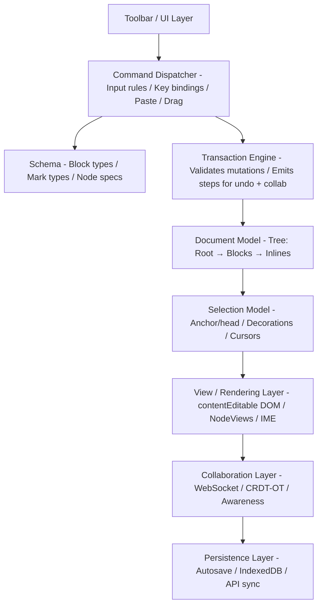

## Problem Statement

Design a rich text editor that supports structured document editing with inline formatting, block-level elements, embedded media, mentions, and an extensible plugin architecture — the kind of editor powering Medium, Notion, Google Docs, and Slack's message composer. The core architectural challenge is maintaining a schema-constrained document model as the single source of truth while using the browser's `contentEditable` as a rendering surface, handling the impedance mismatch between the browser's unpredictable DOM mutations and a deterministic document tree.

**Scope:** The editor engine — document model, input handling, selection management, rendering pipeline, plugin/extension system, undo/redo, collaborative cursor awareness (single-user editing with collaboration-ready architecture). Out of scope: backend persistence layer, full OT/CRDT server infrastructure (though we define the protocol interface), authentication, commenting/annotation threads.

**Real-world production examples:** ProseMirror/Tiptap (Notion, GitLab, Atlassian), Slate (Grafana, Airtable), Lexical (Meta), Quill (Salesforce, LinkedIn), Draft.js (legacy Facebook), Google Docs (custom renderer, no contentEditable).

---

## Requirements Exploration

### Functional Requirements

1. Users edit rich text with inline marks: bold, italic, underline, strikethrough, code, highlight, and links with editable attributes.
2. Users create block-level elements: paragraphs, headings (H1–H6), ordered/unordered lists, blockquotes, code blocks with syntax highlighting, horizontal rules, and tables.
3. Users embed media: images (with captions, alt text, resize), videos, file attachments, and arbitrary embed blocks (tweets, CodePen, etc.).
4. Users trigger mention autocomplete via `@` prefix with fuzzy search and keyboard navigation.
5. Users perform undo/redo with full history that preserves intention (not just DOM snapshots).
6. Users paste content from external sources (Word, Google Docs, web pages) with schema-conformant sanitization.
7. Users drag-and-drop blocks to reorder, and drag external files to embed.
8. The editor exposes a plugin API for custom node types, input rules, key bindings, and decorations.
9. Users see collaborative cursors and selections from other participants in real time (awareness protocol).
10. The document serializes deterministically to JSON, HTML, and Markdown.

### Non-Functional Requirements

| Category      | Requirement                        | Target                                           |
| ------------- | ---------------------------------- | ------------------------------------------------ |
| Performance   | Keystroke-to-render latency (INP)  | < 50ms (16ms target for 60fps)                   |
| Performance   | Initial editor mount (empty doc)   | < 200ms on mid-range device                      |
| Performance   | Large document render (500 blocks) | < 500ms initial, 60fps scroll                    |
| Bundle        | Editor core (no plugins)           | < 80KB gzipped                                   |
| Bundle        | Full-featured editor (all plugins) | < 180KB gzipped                                  |
| Memory        | 100-page document (10K blocks)     | < 60MB JS heap                                   |
| Collaboration | Cursor sync latency                | < 150ms p95                                      |
| Collaboration | Conflict resolution                | Zero data loss under concurrent edits            |
| Reliability   | Unsaved content protection         | Zero data loss on crash/tab close                |
| Accessibility | WCAG compliance                    | AA (2.1) minimum                                 |
| IME           | CJK input composition              | Correct handling on all major browsers + Android |

---

## Capacity Estimation & Constraints

**Usage assumptions (Notion-scale, 30M MAU):**

- 10M DAU, average 4 documents edited/day
- Average document: 50 blocks, 2KB serialized JSON
- Large document (top 5%): 500+ blocks, 40KB serialized
- Peak concurrent editors per document: 8 (team workspace)
- Keystroke rate: 5–8 characters/second per user during active typing

**Payload sizing:**

- Empty editor state: ~200B (root doc + empty paragraph)
- Average document JSON: 2KB (50 blocks × 40B/block average)
- Large document JSON: 40KB (500 blocks, embedded images as URLs)
- Collaboration awareness message: ~100B (userId, cursor position, selection, color)
- OT/CRDT operation: ~80B per character insert, ~200B per block operation

**Client memory budget:**

- Document model in memory: 50 blocks × 200B = 10KB (typical), 500 blocks × 200B = 100KB (large)
- Undo history (50 steps): ~500KB (stores diffs, not full snapshots)
- Plugin state: ~200KB across all plugins
- Collaboration awareness state: ~2KB per participant × 8 = 16KB
- DOM nodes: ~20 per block × visible viewport (30 blocks) = 600 nodes mounted
- Total JS heap target: < 40MB for typical docs, < 60MB for large docs

**Bandwidth:**

- WebSocket frame rate during active editing: ~10 ops/second × 100B = 1KB/s per user
- Document save (debounced): 2KB every 3 seconds (not on every keystroke)
- Image upload: individual concern, streamed via presigned URL

---

## Architecture / High-Level Design

### Rendering Strategy

**Hybrid CSR with SSR-rendered read-only view.** The editor itself is purely client-side (requires DOM APIs, selection management, input events), but the published/read-only rendering uses SSR for SEO and fast LCP. The editor loads on-demand when a user focuses the content area.

Justification: `contentEditable` and Selection APIs are browser-only. SSR is impossible for the editing surface. However, the document model serializes to React components for read-only rendering, enabling SSR for published content.

### Navigation Model

SPA with document-level routing: `/docs/\{id\}/edit` loads the editor, `/docs/\{id\}` renders read-only. URL state encodes the document ID; local editor state (cursor position, scroll) is ephemeral. Deep-linking to specific blocks via fragment identifiers (`#block-abc123`).

### System Architecture Diagram



### Component Architecture

```
EditorProvider (context: editor instance, schema, plugins)
├── Toolbar (server: false, reads editor state, dispatches commands)
│   ├── FormatButtons (mark toggle commands)
│   ├── BlockTypeSelector (transform block type)
│   ├── LinkDialog (modal for URL input)
│   └── ImageUploader (file input + upload progress)
├── EditorContent (contentEditable surface)
│   ├── BlockNodeView[] (rendered per block in document)
│   │   ├── ParagraphView
│   │   ├── HeadingView
│   │   ├── CodeBlockView (with syntax highlighting)
│   │   ├── ImageBlockView (resize handles, caption)
│   │   ├── TableView (cell selection, column resize)
│   │   └── EmbedView (iframe sandbox)
│   └── DecorationLayer (cursors, selections, highlights)
├── SlashCommandMenu (floating, triggered by /)
├── MentionAutocomplete (floating, triggered by @)
└── BubbleMenu (floating toolbar on text selection)
```

### State Management Strategy

| State Type            | Location                         | Justification                                          |
| --------------------- | -------------------------------- | ------------------------------------------------------ |
| Document model        | Editor instance (in-memory tree) | Must be authoritative, fast access for every keystroke |
| Selection/cursor      | Editor instance                  | Coupled to document model positions                    |
| Undo history          | Editor instance (step stack)     | Transaction-based, not state-snapshot-based            |
| Collaboration state   | Zustand store                    | UI needs reactive updates for cursor display           |
| Toolbar active states | Derived from editor selection    | Recomputed on selection change, not stored             |
| Upload progress       | Component-local state            | Ephemeral, per-upload lifecycle                        |
| Draft persistence     | IndexedDB                        | Survives crashes, too large for localStorage           |
| User preferences      | localStorage                     | Theme, toolbar config, font size                       |

---

## Data Model / Entities

### Core Document Model

```typescript
/** A mark applied to inline text (bold, italic, link, etc.) */
interface Mark {
  type: string; // 'bold' | 'italic' | 'link' | 'code' | 'highlight' | etc.
  attrs: Record<string, string | number | boolean>;
}

/** A fragment of text with zero or more marks */
interface TextNode {
  type: "text";
  text: string;
  marks: Mark[];
}

/** An inline atom that isn't text (mention, emoji, inline math) */
interface InlineAtom {
  type: string; // 'mention' | 'emoji' | 'inlineMath'
  attrs: Record<string, unknown>;
  marks: Mark[];
}

type InlineContent = TextNode | InlineAtom;

/** A block-level node in the document tree */
interface BlockNode {
  type: string; // 'paragraph' | 'heading' | 'codeBlock' | 'image' | etc.
  attrs: Record<string, unknown>;
  content: InlineContent[] | BlockNode[]; // leaf blocks have inline, containers have blocks
  marks?: Mark[]; // block-level marks (rare, e.g., alignment)
}

/** The root document */
interface Document {
  type: "doc";
  content: BlockNode[];
  version: number; // incremented on every transaction
}
```

### Schema Definition

```typescript
/** Defines what's valid in the document */
interface NodeSpec {
  group: "block" | "inline" | "topBlock";
  content: string; // content expression, e.g., 'inline*' or 'listItem+'
  attrs?: Record<string, { default: unknown }>;
  marks?: string; // allowed marks, e.g., '_' for all, '' for none
  inline?: boolean;
  atom?: boolean; // non-editable leaf (image, embed)
  draggable?: boolean;
  isolating?: boolean; // prevents cursor from leaving (table cells)
  parseDOM?: ParseRule[];
  toDOM?: (node: BlockNode) => DOMOutputSpec;
}

interface MarkSpec {
  inclusive?: boolean; // whether typing at mark boundary extends the mark
  excludes?: string; // mutually exclusive marks
  attrs?: Record<string, { default: unknown }>;
  parseDOM?: ParseRule[];
  toDOM?: (mark: Mark) => DOMOutputSpec;
}

interface Schema {
  nodes: Record<string, NodeSpec>;
  marks: Record<string, MarkSpec>;
}
```

### Transaction & Step Types

```typescript
/** An atomic, invertible document mutation */
type Step =
  | { type: "replaceStep"; from: number; to: number; slice: Slice }
  | { type: "addMark"; from: number; to: number; mark: Mark }
  | { type: "removeMark"; from: number; to: number; mark: Mark }
  | {
      type: "replaceAround";
      from: number;
      to: number;
      gapFrom: number;
      gapTo: number;
      slice: Slice;
    }
  | {
      type: "setBlockType";
      from: number;
      to: number;
      nodeType: string;
      attrs: Record<string, unknown>;
    };

/** A batch of steps applied atomically */
interface Transaction {
  steps: Step[];
  docs: Document[]; // doc state before each step (for inversion)
  selection: Selection;
  metadata: Record<string, unknown>; // e.g., { inputType: 'insertText', addToHistory: true }
  time: number;
}

/** Cursor/selection state */
interface Selection {
  anchor: number; // resolved position (flat index into document)
  head: number;
  type: "text" | "node" | "cell" | "all";
}
```

### Collaboration Types

```typescript
/** Awareness state broadcast to other participants */
interface AwarenessState {
  clientId: string;
  user: { name: string; color: string; avatar: string };
  cursor: { anchor: number; head: number } | null;
  lastActive: number;
}

/** A collaboration operation (OT model) */
interface CollabOperation {
  clientId: string;
  version: number; // server-assigned monotonic version
  steps: Step[];
  timestamp: number;
}

/** CRDT alternative: Yjs-compatible update */
interface CRDTUpdate {
  origin: string;
  update: Uint8Array; // encoded Yjs update
  awareness: Uint8Array; // encoded awareness state
}
```

### Persistence Types

```typescript
interface DocumentRecord {
  id: string;
  title: string;
  content: Document; // serialized JSON
  version: number;
  createdAt: string; // ISO 8601
  updatedAt: string;
  ownerId: string;
  collaboratorIds: string[];
  wordCount: number;
  lastEditedBy: string;
}

interface DraftState {
  documentId: string;
  content: Document;
  unsavedSteps: Step[];
  lastSyncedVersion: number;
  savedAt: number; // timestamp
}
```

---

## Interface Definition (API)

### REST Endpoints

| Method | Path                             | Purpose                  | Request                                                | Response                                                    |
| ------ | -------------------------------- | ------------------------ | ------------------------------------------------------ | ----------------------------------------------------------- |
| GET    | `/api/docs/\{id\}`                 | Load document            | —                                                      | `\{ doc: Document, version: number, collaborators: User[] \}` |
| POST   | `/api/docs`                      | Create document          | `\{ title: string, content?: Document \}`                | `\{ id: string, doc: Document \}`                             |
| PUT    | `/api/docs/\{id\}`                 | Save full document       | `\{ content: Document, version: number \}`               | `\{ version: number, updatedAt: string \}`                    |
| PATCH  | `/api/docs/\{id\}/steps`           | Submit incremental steps | `\{ steps: Step[], clientId: string, version: number \}` | `\{ version: number, accepted: boolean \}`                    |
| POST   | `/api/docs/\{id\}/upload`          | Upload media             | `FormData(file)`                                       | `\{ url: string, width: number, height: number \}`            |
| GET    | `/api/docs/\{id\}/history`         | Version history          | `?cursor=string&limit=20`                              | `\{ versions: VersionEntry[], nextCursor: string \}`          |
| POST   | `/api/docs/\{id\}/mentions/search` | Mention autocomplete     | `\{ query: string, limit: 8 \}`                          | `\{ users: MentionCandidate[] \}`                             |

### WebSocket Protocol (Collaboration)

```typescript
// Client → Server
type ClientMessage =
  | { type: "join"; docId: string; clientId: string; token: string }
  | { type: "steps"; version: number; steps: Step[]; clientId: string }
  | { type: "awareness"; state: AwarenessState }
  | { type: "ping" };

// Server → Client
type ServerMessage =
  | { type: "sync"; doc: Document; version: number; clients: AwarenessState[] }
  | { type: "steps"; version: number; steps: Step[]; clientId: string }
  | { type: "awareness"; clientId: string; state: AwarenessState }
  | { type: "reject"; version: number; reason: string } // rebase required
  | { type: "pong" };
```

### Conflict Resolution Flow

```
Client A types "hello"     → sends steps [insert "hello"] at version 5
Client B types "world"     → sends steps [insert "world"] at version 5
Server receives A first    → accepts, version → 6
Server receives B          → rejects (version mismatch)
Server sends B steps from A → B rebases own steps against A's, resends at version 6
Server receives B (rebased) → accepts, version → 7
```

### Pagination Strategy

Cursor-based pagination for document history using opaque cursors (base64-encoded `\{version\}:\{timestamp\}`). Justification: documents have monotonically increasing versions, offset-based pagination breaks when new versions are inserted between page loads.

### Rate Limiting

- Steps endpoint: 60 operations/second per client (burst), 20/s sustained
- Upload endpoint: 10 uploads/minute per user
- Mention search: 5 requests/second per user (debounced client-side to 300ms)

---

## Caching Strategy

### Client-Side Caching

**Document model (in-memory):** The editor instance holds the authoritative document tree. No cache layer between the editor and the model — mutations apply directly.

**Undo history:** Stores inverted steps (not full document snapshots). LRU eviction at 200 steps. Cost: ~2KB per step × 200 = 400KB max.

**Mention candidates:** LRU cache of 100 most-recently-fetched users, keyed by query prefix. Invalidated on 5-minute TTL. Enables instant display for repeated `@` triggers.

**IndexedDB draft persistence:**

- Schema: `\{ docId: string, content: Document, steps: Step[], timestamp: number \}`
- TTL: 7 days for unsaved drafts, cleared on successful server sync
- Storage budget: 50MB across all drafts (enforced by quota check before write)
- Saved every 3 seconds during active editing (debounced) and on `beforeunload`

**Service Worker:** Cache-first for editor JS bundle and static assets. Network-first for document API. Stale-while-revalidate for mention search results.

### CDN & Edge Caching

| Resource                | Cache-Control                                     | Justification                   |
| ----------------------- | ------------------------------------------------- | ------------------------------- |
| Editor JS bundle        | `public, max-age=31536000, immutable`             | Content-hashed filenames        |
| Document API (GET)      | `private, no-cache`                               | Per-user content, must validate |
| Mention search API      | `private, max-age=60`                             | User list changes infrequently  |
| Uploaded images         | `public, max-age=31536000, immutable`             | Content-addressed URLs          |
| Read-only rendered page | `public, s-maxage=60, stale-while-revalidate=300` | SSR HTML, purge on edit         |

Invalidation: Publish/edit triggers CDN purge for the read-only page URL. Document API is never CDN-cached (private content).

### Cache Coherence

**Cross-tab consistency:** `BroadcastChannel` API syncs document state across tabs editing the same document. When Tab A receives a WebSocket update, it broadcasts to Tab B to avoid duplicate fetches.

**Optimistic update reconciliation:** Steps are applied optimistically to the local document. If the server rejects (version conflict), the client rebases unconfirmed steps against the server's accepted steps. If rebase fails (structural conflict), the client refetches the full document and replays local unsynced steps.

**Cache versioning on deploy:** The editor bundle uses content hashing. Schema migrations (new node types) are backward-compatible — unknown node types render as generic blocks with a "unsupported content" placeholder. Version header in WebSocket handshake ensures client/server protocol compatibility.

---

## Rendering & Performance Deep Dive

### Critical Rendering Path

**Tier 1 (0–200ms):** App shell + empty editor chrome (toolbar skeleton, content area placeholder). This is SSR'd or cached HTML.

**Tier 2 (200–500ms):** Editor core bundle loads. Document model hydrated from API response. First render of visible blocks (~30 blocks above fold).

**Tier 3 (500ms+):** Plugin initialization (syntax highlighting, mention system, collaboration). Below-fold blocks rendered on scroll. Image thumbnails decode.

```typescript
// Route-level code splitting
const Editor = dynamic(() => import('@/components/editor/EditorRoot'), {
  ssr: false, // editor requires DOM APIs
  loading: () => <EditorSkeleton />,
});

// Plugin-level code splitting
const CodeBlockPlugin = dynamic(() => import('@/plugins/codeBlock'), {
  ssr: false,
});
```

### Core Web Vitals Targets

| Metric | Target  | Strategy                                                                                    |
| ------ | ------- | ------------------------------------------------------------------------------------------- |
| LCP    | < 1.5s  | SSR toolbar + content area skeleton; document JSON inlined in HTML for instant hydration    |
| INP    | < 50ms  | Keystroke → model update → DOM patch in single microtask; no React re-render for text input |
| CLS    | < 0.01  | Fixed toolbar height; image placeholders with exact dimensions from metadata                |
| FCP    | < 800ms | Critical CSS inlined; editor shell renders without JS                                       |
| TTFB   | < 200ms | Edge-cached shell HTML                                                                      |

### Virtualization Strategy for Large Documents

Documents with 500+ blocks use viewport-based block rendering:

```typescript
interface VirtualizationConfig {
  viewportBuffer: number; // render 5 blocks above/below viewport
  estimatedBlockHeight: number; // 80px default, refined per type
  measureOnRender: boolean; // true — measure actual height, update scroll calculations
  scrollAnchor: "top" | "cursor"; // maintain scroll position relative to cursor
}
```

**Implementation:** Only mount DOM nodes for visible blocks ± buffer. Use `IntersectionObserver` to detect which blocks enter/exit viewport. Maintain a height map (`Map<blockId, measuredHeight>`) for accurate scroll position calculations. Estimated heights for unmeasured blocks prevent scroll jumpiness.

<Callout>
  Staff-level insight: Virtualizing a rich text editor is fundamentally harder
  than virtualizing a list because the user's cursor can be in any block. You
  must ensure the cursor's block is always mounted, even if it's technically
  "off-screen" during a rapid scroll. This requires a cursor-aware
  virtualization window that expands around the active selection.
</Callout>

### Image Optimization

- Format: AVIF → WebP → JPEG negotiation via `<picture>` with `srcset`
- Upload: client resizes to max 2000px width before upload (canvas-based, off-main-thread via OffscreenCanvas)
- Placeholders: BlurHash encoded at upload time, stored in image block attrs, rendered as CSS background during decode
- Lazy loading: images below fold use `loading="lazy"` + IntersectionObserver for eager loading when within 200px of viewport

### Bundle Optimization

| Chunk                               | Size (gzip) | Loading                                 |
| ----------------------------------- | ----------- | --------------------------------------- |
| Editor core (model, view, commands) | 45KB        | Route entry                             |
| Toolbar + UI                        | 20KB        | Route entry                             |
| Code block (Prism/Shiki)            | 35KB        | On first code block focus               |
| Table plugin                        | 18KB        | On first table insert                   |
| Collaboration (Yjs + WebSocket)     | 30KB        | On document with multiple collaborators |
| Image upload + resize               | 12KB        | On first image action                   |
| Mention system                      | 8KB         | On first `@` keystroke                  |

Total core: 65KB. Total with all plugins: ~168KB. Brotli compression. Tree-shaking removes unused node types at build time via schema configuration.

---

## Security Deep Dive

### Threat Model

| Threat                  | Attack Vector                                                                           | Impact                             | Mitigation                                                                                                                                                                                      |
| ----------------------- | --------------------------------------------------------------------------------------- | ---------------------------------- | ----------------------------------------------------------------------------------------------------------------------------------------------------------------------------------------------- |
| XSS via pasted HTML     | User pastes malicious HTML from external source containing `<script>` or event handlers | Code execution in victim's session | Schema-based sanitization: only allow marks/blocks defined in schema. Strip all HTML attributes except allowlisted ones. Parse to document model, re-render from model (never inject raw HTML). |
| XSS via link `href`     | User creates link with `javascript:` URL scheme                                         | Code execution on click            | Allowlist URL schemes: `https`, `http`, `mailto` only. Validate at link creation and on render.                                                                                                 |
| Malicious embeds        | User embeds external content (iframe) that exfiltrates data                             | Data theft, phishing               | Sandbox all embeds: `sandbox="allow-scripts allow-same-origin"` with CSP `frame-src` restricting to allowlisted domains.                                                                        |
| Collaborative injection | Malicious participant sends crafted OT steps to corrupt document                        | Data corruption, rendering crash   | Server validates every step against schema before rebroadcasting. Steps that produce invalid document states are rejected.                                                                      |
| Image EXIF data leak    | Uploaded images contain GPS coordinates, camera info                                    | Privacy violation                  | Strip all EXIF metadata server-side on upload (sharp/imagemagick). Re-encode image.                                                                                                             |

### Content Security Policy

```
default-src 'self';
script-src 'self' 'nonce-{random}';
style-src 'self' 'unsafe-inline';  // required for editor inline styles
img-src 'self' https://cdn.devpro.io data:;  // data: for BlurHash
frame-src https://www.youtube.com https://codepen.io;  // allowlisted embeds
connect-src 'self' wss://collab.devpro.io;  // WebSocket for collaboration
```

`unsafe-inline` for styles is necessary because the editor applies inline styles for text color, font size, and alignment. Mitigation: these styles are generated from the document model (not user-controlled CSS strings).

### Authentication & Authorization

- **Token strategy:** Short-lived JWT (15 min) in httpOnly cookie + refresh token (7 day) in httpOnly cookie
- **WebSocket auth:** JWT passed in initial `join` message, validated server-side. Connection dropped if token expires without refresh.
- **Document-level ACL:** Read/write/admin permissions per document. Enforced server-side on every step submission.
- **Refresh flow:** Silent refresh via `/api/auth/refresh` endpoint. WebSocket reconnects with new token after refresh. Pending steps are queued during refresh window (typically < 500ms).

### Input Validation & Output Encoding

**Every input vector:**

| Vector              | Sanitization                                                                      |
| ------------------- | --------------------------------------------------------------------------------- |
| Keyboard input      | Processed through input rules → model transaction. Never raw DOM mutation.        |
| Paste (HTML)        | Parse to DOM → walk DOM tree → map to schema nodes → reject unknown elements      |
| Paste (plain text)  | Escape, split into paragraphs, create text nodes with no marks                    |
| Drag external file  | Validate MIME type against allowlist, scan for embedded scripts                   |
| Mention query       | Alphanumeric + space only, max 50 chars, server-side SQL parameterization         |
| Link URL            | Scheme allowlist validation, URL parsing via `new URL()`, reject on parse failure |
| Collaboration steps | Schema validation on server before broadcast                                      |

---

## Scalability & Reliability

### Scalability Patterns

**Document size scaling:** For documents exceeding 200 blocks, enable block-level lazy loading. Initial API response returns first 50 blocks + total count. Additional blocks fetched on scroll via cursor-based pagination (`?after=blockId&limit=50`).

**Collaboration scaling:** One WebSocket connection per document per client. Server uses pub/sub (Redis) to fan out steps across multiple server instances. Document state partitioned by document ID — all operations for a document route to the same server node (sticky sessions via consistent hashing).

**Plugin scaling:** Plugins that perform expensive computation (syntax highlighting, spell check) run in a Web Worker. Main thread sends document slices to worker, worker returns decorations. Prevents blocking the input loop.

```typescript
// Offload syntax highlighting to worker
const highlightWorker = new Worker("/workers/highlight.js");

highlightWorker.postMessage({
  type: "highlight",
  code: codeBlock.textContent,
  language: codeBlock.attrs.language,
});

highlightWorker.onmessage = (e) => {
  applyDecorations(e.data.decorations);
};
```

### Failure Handling

| Failure Mode                            | Detection                                                    | User Experience                                             | Recovery                                                                                                                              |
| --------------------------------------- | ------------------------------------------------------------ | ----------------------------------------------------------- | ------------------------------------------------------------------------------------------------------------------------------------- |
| WebSocket disconnect                    | `close` event + heartbeat timeout (10s)                      | Yellow banner: "Reconnecting..." Editing continues offline. | Exponential backoff reconnect (1s, 2s, 4s, max 30s). On reconnect, send all queued steps, rebase if needed.                           |
| Server rejects steps (version conflict) | `reject` message from server                                 | Transparent to user — rebase happens silently               | Fetch missing steps from server, transform local steps against them, resend. If structural conflict, full document refetch.           |
| API save failure                        | HTTP 5xx or network error on PUT                             | Orange badge on save indicator: "Retrying..."               | Retry with exponential backoff (3 attempts). After max retries, persist to IndexedDB and show "Saved locally, will sync when online." |
| Browser crash / tab close               | `beforeunload` event (best-effort) + periodic IndexedDB save | On next open: "Recovered unsaved changes" dialog            | Load draft from IndexedDB, diff against server version, present merge UI if diverged.                                                 |
| Image upload failure                    | HTTP error or timeout (30s)                                  | Image block shows error state with retry button             | User-initiated retry. Original file reference preserved in block attrs.                                                               |
| Collaboration server down               | All participants disconnect simultaneously                   | Editor enters single-user mode, queues ops                  | When server recovers, full state sync. Server is source of truth for version ordering.                                                |

### Resilience Patterns

**Outbox pattern:** All document mutations are appended to an IndexedDB outbox before sending to server. Outbox entries are cleared only after server acknowledgment. On reconnect, unacknowledged entries are resent.

**Idempotency keys:** Every step submission includes a client-generated UUID. Server deduplicates: if the same UUID arrives twice, the second is acknowledged without re-applying.

**Request deduplication:** Rapid typing doesn't send per-keystroke API calls. Steps are batched into 100ms windows. If a batch is in-flight, subsequent steps queue locally until acknowledgment.

**Circuit breaker for collaboration:** If the collaboration server returns errors on 3 consecutive attempts within 30 seconds, the client disconnects and enters single-user mode with local persistence. Periodic health checks (every 60s) attempt reconnection.

### Graceful Degradation

| Capability                 | Degraded Mode                                 | Trigger                                              |
| -------------------------- | --------------------------------------------- | ---------------------------------------------------- |
| WebSocket unavailable      | Single-user editing with periodic HTTP saves  | Connection failure or corporate firewall blocking WS |
| JavaScript disabled        | Read-only rendered HTML (SSR output)          | NoScript users                                       |
| Slow connection (&lt;2G)      | Disable real-time sync, batch saves every 30s | `navigator.connection.effectiveType` check           |
| Quota exceeded (IndexedDB) | Disable offline draft saving, warn user       | `QuotaExceededError` caught                          |

---

## Accessibility Deep Dive

### ARIA Roles & Landmarks

```html
<div role="application" aria-label="Rich text editor">
  <div
    role="toolbar"
    aria-label="Formatting toolbar"
    aria-controls="editor-content"
  >
    <button aria-label="Bold" aria-pressed="true" aria-keyshortcuts="Control+B">
      B
    </button>
    <button
      aria-label="Italic"
      aria-pressed="false"
      aria-keyshortcuts="Control+I"
    >
      I
    </button>
    <!-- ... -->
  </div>
  <div
    id="editor-content"
    role="textbox"
    aria-multiline="true"
    aria-label="Document content"
    contenteditable="true"
    aria-describedby="editor-status"
  >
    <!-- document content -->
  </div>
  <div id="editor-status" role="status" aria-live="polite" aria-atomic="true">
    Word count: 342. Last saved 2 minutes ago.
  </div>
</div>
```

### Keyboard Navigation

| Key                     | Context                | Action                                  |
| ----------------------- | ---------------------- | --------------------------------------- |
| `Tab`                   | Toolbar focused        | Move between toolbar groups             |
| `Arrow Left/Right`      | Within toolbar group   | Move between buttons                    |
| `Enter/Space`           | Toolbar button focused | Activate formatting command             |
| `Escape`                | Toolbar/menu focused   | Return focus to editor content          |
| `Ctrl+B/I/U`            | Editor content         | Toggle bold/italic/underline            |
| `Ctrl+Shift+1-6`        | Editor content         | Set heading level                       |
| `Ctrl+Z / Ctrl+Shift+Z` | Editor content         | Undo / Redo                             |
| `Tab`                   | Inside list item       | Increase indent level                   |
| `Shift+Tab`             | Inside list item       | Decrease indent level                   |
| `Enter`                 | End of list item       | New list item (double Enter exits list) |
| `Ctrl+K`                | Text selected          | Open link dialog                        |
| `/`                     | Start of empty block   | Open slash command menu                 |
| `@`                     | Anywhere in text       | Open mention autocomplete               |
| `Arrow Up/Down`         | Autocomplete open      | Navigate options                        |
| `Enter`                 | Autocomplete open      | Select highlighted option               |
| `Escape`                | Autocomplete open      | Close without selecting                 |

### Screen Reader Announcements

```typescript
function announceFormatChange(mark: string, active: boolean): void {
  const status = document.getElementById("editor-status");
  if (status) {
    status.textContent = `${mark} formatting ${active ? "applied" : "removed"}`;
  }
}

function announceBlockTypeChange(type: string): void {
  const status = document.getElementById("editor-status");
  if (status) {
    status.textContent = `Changed to ${type}`;
  }
}

// On collaborative cursor entry
function announceCollaborator(user: string, action: "joined" | "left"): void {
  const status = document.getElementById("editor-status");
  if (status) {
    status.textContent = `${user} ${action} the document`;
  }
}
```

### Focus Management

- **Toolbar → content:** `Escape` in toolbar returns focus to last cursor position in editor (stored before toolbar received focus).
- **Dialog open:** Focus traps inside link/image dialogs. `Escape` closes and restores focus to editor at the selection that triggered the dialog.
- **Mention picker:** Focus remains in editor (picker is an overlay). Arrow keys are intercepted for navigation. `Escape` dismisses picker.
- **Block drag-and-drop:** Alternative keyboard mechanism: select block → `Ctrl+Shift+Up/Down` to move block. Announces new position.

<Callout>
  Staff-level insight: The biggest accessibility challenge in rich text editors
  is that `contentEditable` hijacks screen reader navigation. Screen readers use
  virtual cursor mode to read content, but editing requires forms mode. The
  editor must signal mode transitions correctly and ensure that ARIA live
  regions don't flood the screen reader with announcements during rapid typing
  (debounce status updates to 500ms).
</Callout>

### Motion & Visual Preferences

- `prefers-reduced-motion`: disable cursor blink animation, collaboration cursor transitions, block drag animations. Provide instant state transitions.
- `forced-colors` (Windows high contrast): toolbar buttons use transparent borders that become visible in high contrast. Selection highlighting uses `Highlight` system color.
- Touch targets: all toolbar buttons are minimum 44×44px. Mobile: bottom toolbar with larger targets (48×48px).

---

## Monitoring & Observability

### Client-Side Metrics

| Metric                            | Collection Method                                          | Alert Threshold          |
| --------------------------------- | ---------------------------------------------------------- | ------------------------ |
| Keystroke-to-render latency       | `performance.mark()` before/after transaction              | p95 > 80ms               |
| Document load time                | Navigation timing from route enter to first block render   | p95 > 3s                 |
| Collaboration sync latency        | Timestamp diff between step send and server acknowledgment | p95 > 500ms              |
| Undo/redo execution time          | Timer around history pop + re-render                       | p95 > 100ms              |
| Paste processing time             | Timer around paste parse + schema validation               | p95 > 200ms              |
| Error rate (unhandled exceptions) | `window.onerror` + React error boundaries                  | > 0.5% of sessions       |
| Document save success rate        | HTTP response tracking                                     | < 99.5%                  |
| WebSocket reconnection count      | Connection lifecycle tracking                              | > 3 reconnects/hour/user |
| Memory usage (JS heap)            | `performance.memory` (Chrome) sampled every 30s            | > 100MB                  |
| Bundle parse time                 | `performance.getEntriesByType('resource')`                 | > 500ms                  |

### Error Tracking

- **Source maps:** Uploaded to error tracking service (Sentry) on deploy. Production errors show original TypeScript stack traces.
- **Error boundaries:** Wrap each block's NodeView in an error boundary. A crashed code block doesn't take down the editor — renders "This block encountered an error" with retry button.
- **Deduplication:** Group errors by: (1) error message + stack top frame, (2) document schema version, (3) browser/OS. Alert on new error groups, not repeat occurrences.
- **Collaboration errors:** Track step rejection rate per document. High rejection rate (>10%) indicates a rebase bug or malicious client.

### Alerting & Dashboards

**Day-1 launch dashboard:**

1. Keystroke latency heatmap (p50, p75, p95, p99) — broken down by document size
2. Document save success/failure rate — with failure reason breakdown
3. WebSocket connection health — connected/reconnecting/disconnected distribution
4. Error rate by error type — boundary catches vs unhandled
5. Active collaboration sessions — concurrent editors per document
6. Bundle size trend — tracked per PR in CI
7. Memory usage distribution — segmented by document size

**Alert triggers:**

| Condition                            | Severity   | Action             |
| ------------------------------------ | ---------- | ------------------ |
| Keystroke p95 > 100ms for 5 min      | Warning    | Slack notification |
| Save failure rate > 5% for 2 min     | Critical   | PagerDuty          |
| WebSocket error rate > 10% for 5 min | Critical   | PagerDuty          |
| Error boundary catch rate > 1%       | Warning    | Slack notification |
| Bundle size exceeds budget by 10KB   | CI Failure | Block merge        |

### Real User Monitoring (RUM)

- **Sampling:** 100% for errors, 25% for performance metrics (editor is high-interaction, need representative data)
- **Segmentation:** by document size bucket (0–50, 50–200, 200–500, 500+ blocks), device class (mobile/desktop), connection type
- **Rage-click detection:** 3+ clicks within 500ms on same element indicates broken interaction (e.g., formatting button not responding)
- **Session replay:** Record editor interactions (not content) for reproducing layout bugs. Exclude document text from recordings for privacy.

---

## Trade-offs

| Decision             | Option A                                    | Option B                                              | Choice                  | Justification                                                                                                                                                                                                                                     |
| -------------------- | ------------------------------------------- | ----------------------------------------------------- | ----------------------- | ------------------------------------------------------------------------------------------------------------------------------------------------------------------------------------------------------------------------------------------------- |
| Document model       | Flat (Quill Delta — array of ops)           | Tree (ProseMirror — nested nodes)                     | **Tree**                | Tree structure naturally represents nested content (lists in blockquotes, tables with cells). Flat models require complex position mapping for nested structures.                                                                                 |
| Collaboration engine | OT (Operational Transformation)             | CRDT (Yjs/Automerge)                                  | **CRDT (Yjs)**          | OT requires a central server for total ordering. CRDTs allow peer-to-peer sync, offline editing, and simpler server logic. Yjs is battle-tested (Notion, Tiptap).                                                                                 |
| Rendering surface    | `contentEditable` + controlled model        | Custom renderer (canvas/DOM without contentEditable)  | **contentEditable**     | Custom renderers (Google Docs approach) give full control but lose native IME, spell check, accessibility, and require reimplementing all text input. contentEditable with a model-driven approach (ProseMirror pattern) is the pragmatic choice. |
| Undo strategy        | State snapshots (full doc per undo step)    | Inverted operations (store step inverses)             | **Inverted operations** | State snapshots are O(n) per step for large docs. Inverted operations are O(1) per step and compose efficiently for collaborative undo.                                                                                                           |
| Schema enforcement   | Permissive (allow anything, validate later) | Strict (reject invalid mutations at transaction time) | **Strict**              | Permissive schemas lead to "impossible states" that crash renderers. Strict schemas prevent corruption at the source, making collaboration safer.                                                                                                 |
| Plugin architecture  | Monolithic (all features compiled in)       | Dynamic (plugins loaded at runtime)                   | **Dynamic**             | Reduces initial bundle size. Teams using the editor can configure which features they need. Unused plugins (e.g., table editing) never download.                                                                                                  |
| Block virtualization | Always on                                   | Only for large documents (>200 blocks)                | **Conditional**         | Virtualization adds complexity (cursor tracking, selection across virtual boundaries). Small documents don't benefit. Enable above threshold.                                                                                                     |
| Image storage        | Inline (base64 in document JSON)            | External (URL reference, separate upload)             | **External**            | Base64 inflates document size 33%, makes collaboration ops enormous, bloats undo history. External URLs keep the document model lightweight.                                                                                                      |
| State management     | React state (re-render on every keystroke)  | External mutable instance (bypass React for edits)    | **External instance**   | React re-renders at 60fps keystroke rate would destroy performance. The editor owns its own state; React only re-renders for toolbar state and UI chrome.                                                                                         |
| Paste handling       | Accept HTML as-is (trust browser parser)    | Parse to model, re-serialize (schema-constrained)     | **Parse to model**      | Raw HTML from Word/Google Docs contains hundreds of inline styles, custom elements, and potential XSS vectors. Parsing through the schema ensures safety and consistency.                                                                         |

<Callout>
  Principal-level insight: The choice between OT and CRDT has shifted decisively
  toward CRDTs since 2020. Yjs provides sub-millisecond local operations,
  efficient binary encoding (~30% smaller than JSON OT ops), and eliminates the
  need for a centralized transform server. The trade-off — slightly higher
  memory usage for tombstones and larger initial sync — is negligible for
  documents under 1MB. The architectural simplicity of "every client converges
  without coordination" unlocks offline-first and peer-to-peer topologies
  impossible with OT.
</Callout>

---

## What Great Looks Like

### Senior Engineer (L5)

- Designs a working editor with a document model separate from the DOM
- Handles basic inline formatting and block types
- Implements undo/redo with state snapshots
- Sanitizes pasted content
- Covers keyboard shortcuts and basic accessibility
- Identifies that contentEditable is unreliable and explains the model-driven approach

### Staff Engineer (L6)

All of senior, plus:

- Designs schema-constrained document model with validation at transaction boundaries
- Implements inverted-operation undo that works with collaboration
- Architects plugin system with dynamic loading and typed extension points
- Designs WebSocket collaboration protocol with conflict resolution
- Addresses IME composition handling (Android, CJK) as a first-class concern
- Virtualizes large documents with cursor-aware rendering windows
- Designs the caching and offline persistence strategy with IndexedDB outbox
- Provides concrete performance budgets with monitoring and alerting

### Principal Engineer (L7)

All of staff, plus:

- Evaluates OT vs CRDT with specific trade-off analysis (tombstone overhead, causality tracking, server topology implications)
- Designs intention-preserving collaborative undo (not just "undo my last operation" but "undo the effect of my operation even after others edited nearby")
- Architects schema migration strategy for evolving document formats across versions without data loss
- Designs multi-tenant editor infrastructure (isolation, resource limits, abuse prevention)
- Plans progressive enhancement: the editor works without WebSocket (HTTP polling fallback), without JavaScript (read-only SSR), and on low-end devices (reduced feature set)
- Addresses WCAG compliance holistically — not just ARIA labels but screen reader navigation mode interactions, virtual cursor behavior, and live region flood prevention
- Designs the observability system that catches regressions before users report them (synthetic editing benchmarks in CI, real-user keystroke latency percentiles)

---

## Key Takeaways

- **The document model is the single source of truth.** The DOM is a derived view. Every mutation flows through the model as a validated transaction, never as a direct DOM edit. This is the fundamental architectural decision that separates production editors from fragile contentEditable wrappers.

- **Schema enforcement at transaction time prevents impossible states.** Reject invalid mutations before they corrupt the document. This eliminates an entire class of bugs where renderers crash on unexpected node structures.

- **CRDTs (Yjs) have won the collaboration architecture debate for rich text.** They eliminate central coordination, enable offline-first editing, and converge automatically. The memory trade-off (tombstones) is negligible for typical document sizes.

- **Performance requires bypassing React for keystroke handling.** The editor owns a mutable state instance outside React's render cycle. React renders toolbar UI and chrome; the editor's own view layer handles the 60fps input loop.

- **Paste sanitization is a security boundary, not a convenience feature.** External HTML (from Word, web pages, email clients) is an XSS vector. Parsing through the schema model is the only safe approach — never inject raw HTML.

- **Virtualization in editors is cursor-aware.** Unlike list virtualization, the editor must always mount the block containing the user's cursor, even if it's technically outside the visible viewport during rapid scroll.

- **Offline resilience uses the outbox pattern.** Every mutation persists to IndexedDB before sending to the server. Unacknowledged operations survive crashes, tab closes, and network failures. The server deduplicates via idempotency keys.

- **Accessibility in rich text is a mode-switching problem.** Screen readers use virtual cursor mode for reading and forms mode for editing. The editor must cooperate with both modes and avoid flooding ARIA live regions during rapid typing.
