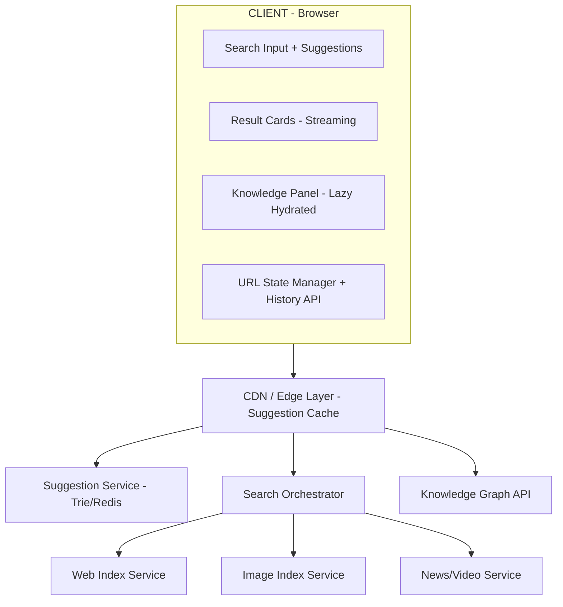

## Problem Statement

A Search Engine Results Page (SERP) is the most latency-sensitive page on the internet. Google processes 8.5 billion searches per day — each one demanding sub-second rendering of heterogeneous content: organic links, featured snippets, knowledge panels, image carousels, video results, maps, shopping listings, and "People Also Ask" accordions. The frontend must orchestrate federated results from dozens of backend services, stream them progressively, and render a pixel-perfect page within 400ms of keystroke.

This is not a simple list. A modern SERP is a **layout engine** that dynamically composes 15+ result card types, handles instant search suggestions with keyboard navigation, maintains URL-driven state for shareability, tracks click-through rates for ranking feedback, and supports voice input — all while hitting Core Web Vitals targets that directly impact the search engine's own brand credibility.

Real-world implementations: Google Search, Bing, DuckDuckGo, Elasticsearch UI (Kibana), Algolia InstantSearch, Meilisearch UI, and Typesense SearchBar.

---

## Requirements Exploration

### Functional Requirements

1. **Instant search suggestions** — typeahead dropdown with ≤100ms response, keyboard navigation (↑↓ Enter Esc), recent searches, trending queries
2. **Federated result types** — web links, images, news, videos, knowledge panels, maps, shopping, featured snippets, People Also Ask, sitelinks
3. **Result card rendering** — each type renders differently: snippets with query highlighting, sitelinks grid, image thumbnails, video previews with duration
4. **Progressive/streaming rendering** — stream results as backend services respond; show skeleton → partial → complete
5. **URL-driven state** — query `q`, page `p`, filters `tbm` (type), time range `tbs`, SafeSearch `safe` — all in URL for bookmarking/sharing
6. **Search filters** — tabs (All, Images, News, Videos, Maps, Shopping) + sidebar refinements (time range, verbatim, region)
7. **Pagination** — numbered pages with "Next" for web results; infinite scroll for image grid
8. **Knowledge panel** — structured entity card with facts, images, related entities, social links
9. **People Also Ask** — expandable accordion with lazy-loaded answers
10. **Voice search** — Web Speech API integration, animated microphone UI, query-by-voice
11. **Image search grid** — masonry layout, SafeSearch toggle, hover preview, color filter
12. **Click tracking** — CTR measurement per position, dwell time signals, A/B testing of result layouts

### Non-Functional Requirements

| Requirement           | Target                     | Rationale                                    |
| --------------------- | -------------------------- | -------------------------------------------- |
| Time to First Result  | ≤400ms (P50), ≤800ms (P95) | Users abandon after 1s                       |
| LCP                   | ≤1.2s                      | First visible result card                    |
| INP                   | ≤100ms                     | Suggestion selection, filter toggling        |
| CLS                   | 0                          | Results must not shift as late content loads |
| Suggestion latency    | ≤100ms                     | Typeahead must feel instant                  |
| Bundle size (initial) | ≤80KB gzipped              | Critical path JS only                        |
| Availability          | 99.99%                     | Core product SLA                             |
| Concurrent users      | 500K+ simultaneous         | Peak traffic handling                        |
| Accessibility         | WCAG 2.2 AA                | Legal requirement + user base                |
| SEO (of SERP itself)  | Lighthouse 95+             | Brand credibility                            |

---

## Capacity Estimation & Constraints

```
Daily searches:           8.5 billion
Peak QPS:                 ~150,000
Avg results per query:    10 (page 1) + suggestions + knowledge panel
Avg response payload:     45KB (compressed JSON)
Suggestion requests/search: 4-6 (per keystroke after debounce)
Peak suggestion QPS:      ~700,000
Image results per grid:   20-40 thumbnails (lazy loaded)

Client constraints:
- Mobile: 60% of traffic, 3G+ networks
- Average device: mid-range Android (4GB RAM, Snapdragon 600-series)
- Target JS parse budget: <100ms on mid-range mobile
- Image budget per page: <500KB total (lazy loaded)

CDN edge nodes:          200+ global PoPs
Cache hit rate target:   85% for suggestions, 40% for results
```

<Callout>
  The suggestion service alone handles 4-6× the QPS of the actual search API.
  This means the typeahead infrastructure must be optimized independently —
  smaller payloads, aggressive edge caching, and client-side caching of recent
  prefixes.
</Callout>

---

## Architecture / High-Level Design

### Rendering Strategy

**Streaming SSR with progressive hydration.** The SERP uses a streaming server response:

1. HTML shell + critical CSS streams immediately (TTFB ≤100ms)
2. Search input + suggestion JS hydrates first (interactive in ≤200ms)
3. Result cards stream as backend services respond (chunked transfer encoding)
4. Knowledge panel, PAA, and image carousels hydrate on visibility (Intersection Observer)

This is NOT a traditional SPA. Each search is a full navigation (for cacheability and SEO), but the search input maintains client-side state across navigations via `beforeunload` preservation.

### Navigation Model

```
URL Schema:
/search?q={query}&tbm={type}&p={page}&tbs={time_filter}&safe={0|1}&hl={lang}

Examples:
/search?q=react+fiber+architecture
/search?q=cats&tbm=isch&safe=1
/search?q=latest+news&tbm=nws&tbs=qdr:h
/search?q=restaurants&tbm=lcl&near=sf
```

Every state change updates the URL. Back/forward navigation restores exact SERP state. No client-side routing for result navigation — clicking a result is a standard `<a href>` for maximum performance and reliability.

### System Architecture Diagram ASCII



### Component Architecture

```
SearchPage
├── SearchHeader
│   ├── Logo
│   ├── SearchInput
│   │   ├── InputField (controlled)
│   │   ├── VoiceSearchButton
│   │   ├── CameraSearchButton
│   │   └── SuggestionDropdown
│   │       ├── SuggestionItem (keyboard navigable)
│   │       ├── RecentSearchItem
│   │       └── TrendingSearchItem
│   └── UserMenu
├── SearchFilters
│   ├── TypeTabs (All | Images | News | Videos | Maps | Shopping)
│   ├── TimeFilter
│   └── RegionFilter
├── ResultsContainer (streaming boundary)
│   ├── FeaturedSnippet
│   ├── WebResultCard
│   │   ├── ResultTitle (with query highlighting)
│   │   ├── ResultURL (breadcrumb format)
│   │   ├── ResultSnippet (with bold matches)
│   │   └── SiteLinks (2x3 grid when available)
│   ├── ImageCarousel (horizontal scroll)
│   ├── VideoResultCard (thumbnail + duration)
│   ├── NewsResultCard (publisher + timestamp)
│   ├── PeopleAlsoAsk (accordion)
│   │   └── PAQItem (expandable, lazy-loads answer)
│   ├── MapResultCard (embedded mini-map)
│   └── ShoppingResultCard (price + rating + image)
├── KnowledgePanel (right sidebar on desktop)
│   ├── EntityHeader (image + title + description)
│   ├── FactsTable
│   ├── RelatedEntities (carousel)
│   └── SocialLinks
├── Pagination
│   ├── PageNumbers
│   └── NextButton
└── SearchFooter
    ├── RelatedSearches
    └── LocationInfo
```

### State Management Strategy

The SERP has minimal client state because it's URL-driven:

```typescript
// URL is the single source of truth
interface SearchState {
  query: string; // ?q=
  type: SearchType; // ?tbm=
  page: number; // ?p=
  timeRange: TimeRange; // ?tbs=
  safeSearch: boolean; // ?safe=
  language: string; // ?hl=
}

// Client-only ephemeral state (not URL-persisted)
interface EphemeralState {
  suggestionQuery: string; // Current typeahead input
  suggestions: Suggestion[]; // Dropdown items
  selectedSuggestionIndex: number; // Keyboard nav position
  isVoiceActive: boolean; // Microphone recording
  expandedPAQ: Set<string>; // Expanded accordion items
}
```

State split: URL params for shareable state, component-local state for UI interactions. No global store needed — each component reads from URL and manages its own ephemeral state.

---

## Data Model / Entities

```typescript
// Core search types
type SearchType = "web" | "images" | "news" | "videos" | "maps" | "shopping";
type TimeRange = "any" | "hour" | "day" | "week" | "month" | "year" | "custom";
type SafeSearch = "off" | "moderate" | "strict";

// Suggestion types
interface Suggestion {
  id: string;
  text: string;
  type: "query" | "calculator" | "entity" | "navigation";
  icon?: string;
  entityImage?: string; // For entity suggestions (people, places)
  estimatedResults?: number;
}

interface RecentSearch {
  query: string;
  timestamp: number;
  type: SearchType;
}

// Federated result union
type SearchResult =
  | WebResult
  | ImageResult
  | NewsResult
  | VideoResult
  | MapResult
  | ShoppingResult
  | FeaturedSnippetResult
  | PeopleAlsoAskResult
  | KnowledgePanelResult;

// Web result (organic link)
interface WebResult {
  kind: "web";
  id: string;
  position: number;
  title: string; // With <em> tags for query match
  url: string;
  displayUrl: string; // Breadcrumb format: example.com › path › page
  snippet: string; // With <em> tags for query match highlighting
  datePublished?: string;
  siteLinks?: SiteLink[]; // Up to 6 sub-links
  favicon: string;
  schema?: StructuredData; // Recipe, FAQ, HowTo, etc.
  trackingId: string; // For CTR measurement
}

interface SiteLink {
  title: string;
  url: string;
  snippet?: string;
}

// Image result
interface ImageResult {
  kind: "image";
  id: string;
  thumbnailUrl: string;
  fullUrl: string;
  width: number;
  height: number;
  alt: string;
  sourceUrl: string;
  sourceDomain: string;
  title: string;
  aspectRatio: number; // For masonry layout calculation
}

// News result
interface NewsResult {
  kind: "news";
  id: string;
  title: string;
  url: string;
  source: string;
  sourceIcon: string;
  publishedAt: string; // ISO 8601
  thumbnailUrl?: string;
  snippet: string;
  isTopStory: boolean;
}

// Video result
interface VideoResult {
  kind: "video";
  id: string;
  title: string;
  url: string;
  thumbnailUrl: string;
  duration: number; // Seconds
  channel: string;
  publishedAt: string;
  views: number;
  platform: "youtube" | "vimeo" | "other";
}

// Map/Local result
interface MapResult {
  kind: "map";
  id: string;
  name: string;
  address: string;
  rating: number; // 1-5
  reviewCount: number;
  category: string;
  hours: string;
  distance?: string;
  lat: number;
  lng: number;
  photoUrl?: string;
}

// Shopping result
interface ShoppingResult {
  kind: "shopping";
  id: string;
  title: string;
  price: number;
  currency: string;
  merchant: string;
  imageUrl: string;
  rating?: number;
  reviewCount?: number;
  url: string;
  freeShipping: boolean;
}

// Featured snippet (position zero)
interface FeaturedSnippetResult {
  kind: "featured_snippet";
  id: string;
  type: "paragraph" | "list" | "table";
  content: string; // HTML content
  sourceTitle: string;
  sourceUrl: string;
  sourceDisplayUrl: string;
}

// People Also Ask
interface PeopleAlsoAskResult {
  kind: "people_also_ask";
  id: string;
  questions: PAQQuestion[];
}

interface PAQQuestion {
  id: string;
  question: string;
  answer?: string; // Lazy loaded on expand
  sourceUrl?: string;
  sourceTitle?: string;
}

// Knowledge panel
interface KnowledgePanelResult {
  kind: "knowledge_panel";
  id: string;
  title: string;
  subtitle: string;
  description: string;
  imageUrl: string;
  facts: Record<string, string>; // Key-value pairs
  socialLinks: { platform: string; url: string }[];
  relatedEntities: { name: string; imageUrl: string; url: string }[];
}

// Full search response (streamed)
interface SearchResponse {
  query: string;
  totalResults: number;
  correctedQuery?: string; // "Did you mean..."
  results: SearchResult[];
  knowledgePanel?: KnowledgePanelResult;
  relatedSearches: string[];
  filters: AvailableFilter[];
  timing: {
    totalMs: number;
    serviceTimings: Record<string, number>;
  };
}

// Click tracking
interface ClickEvent {
  queryId: string;
  resultId: string;
  position: number;
  resultType: SearchResult["kind"];
  timestamp: number;
  dwellTimeMs?: number; // Time before user returns to SERP
}
```

---

## Interface Definition (API)

### Search API

```typescript
// GET /api/search?q=react+hooks&tbm=web&p=1&tbs=qdr:w&safe=1&hl=en
// Response: Streamed JSON (NDJSON) for progressive rendering

interface SearchRequest {
  q: string;
  tbm?: SearchType;
  p?: number; // Page (1-indexed)
  tbs?: string; // Time filter
  safe?: "0" | "1";
  hl?: string; // Language
  num?: number; // Results per page (default 10)
}

// Response streams as newline-delimited JSON:
// {"type":"meta","totalResults":1230000,"correctedQuery":null,"timing":{"totalMs":180}}
// {"type":"featured_snippet","data":{...}}
// {"type":"web","data":{...}}
// {"type":"web","data":{...}}
// {"type":"people_also_ask","data":{...}}
// {"type":"web","data":{...}}
// {"type":"related_searches","data":["react hooks tutorial","react hooks vs classes"]}
// {"type":"knowledge_panel","data":{...}}
// {"type":"done"}
```

### Suggestion API

```typescript
// GET /api/suggest?q=react+ho&type=web&hl=en
// Response: JSON (not streamed — must be <50ms)

interface SuggestionRequest {
  q: string; // Partial query
  type?: SearchType;
  hl?: string;
}

interface SuggestionResponse {
  suggestions: Suggestion[];
  recentSearches: RecentSearch[]; // Only if user is authenticated
}
```

### Click Tracking API

```typescript
// POST /api/track/click (beacon API — fire and forget)
interface ClickTrackRequest {
  queryId: string;
  resultId: string;
  position: number;
  resultType: string;
  action: "click" | "return" | "long_click";
  dwellTimeMs?: number;
}
```

### People Also Ask Expand API

```typescript
// GET /api/paq/expand?questionId=abc123&query=react+hooks
interface PAQExpandResponse {
  answer: string; // HTML content
  sourceUrl: string;
  sourceTitle: string;
  relatedQuestions: PAQQuestion[]; // Load more questions on expand
}
```

---

## Caching Strategy

### Client-Side Caching

```typescript
// Suggestion cache — LRU with prefix matching
class SuggestionCache {
  private cache = new Map<string, { data: Suggestion[]; ts: number }>();
  private maxSize = 200;
  private ttlMs = 5 * 60 * 1000; // 5 minutes

  get(prefix: string): Suggestion[] | null {
    const entry = this.cache.get(prefix);
    if (!entry || Date.now() - entry.ts > this.ttlMs) return null;
    return entry.data;
  }

  // Also check if a longer cached prefix contains valid results
  getFromLongerPrefix(prefix: string): Suggestion[] | null {
    for (const [key, entry] of this.cache) {
      if (key.startsWith(prefix) && Date.now() - entry.ts < this.ttlMs) {
        return entry.data.filter((s) =>
          s.text.toLowerCase().startsWith(prefix.toLowerCase()),
        );
      }
    }
    return null;
  }
}

// Search result cache — sessionStorage for back/forward
const RESULT_CACHE_KEY = "serp_cache";

function cacheSearchResults(url: string, html: string): void {
  try {
    const cache = JSON.parse(sessionStorage.getItem(RESULT_CACHE_KEY) || "{}");
    cache[url] = { html, ts: Date.now() };
    // Evict oldest if >20 entries
    const keys = Object.keys(cache);
    if (keys.length > 20) {
      const oldest = keys.sort((a, b) => cache[a].ts - cache[b].ts)[0];
      delete cache[oldest];
    }
    sessionStorage.setItem(RESULT_CACHE_KEY, JSON.stringify(cache));
  } catch {
    /* quota exceeded — silent fail */
  }
}
```

### CDN & Edge Caching

| Resource               | Cache-Control                                        | CDN TTL | Notes                             |
| ---------------------- | ---------------------------------------------------- | ------- | --------------------------------- |
| Suggestion API         | `public, max-age=300`                                | 5 min   | Popular prefixes cached at edge   |
| Search results (web)   | `private, no-store`                                  | —       | Personalized, never cached at CDN |
| Image thumbnails       | `public, max-age=86400`                              | 24h     | Immutable content-addressed URLs  |
| Static assets (JS/CSS) | `public, max-age=31536000, immutable`                | 1 year  | Hashed filenames                  |
| Knowledge panel data   | `public, max-age=3600, stale-while-revalidate=86400` | 1h      | Entity data changes slowly        |
| Favicon sprites        | `public, max-age=604800`                             | 7 days  | Aggregated favicon sheet          |

### Cache Coherence

```
Suggestion cache invalidation:
├── Trending queries → TTL 5 min (new trends appear fast)
├── Entity suggestions → TTL 1 hour (stable)
├── Calculator/unit results → TTL 24 hours (immutable)
└── Personalized suggestions → No CDN cache, client LRU only

Search results:
├── Never CDN-cached (personalization, freshness, legal)
├── bfcache (Back/Forward Cache) for instant back navigation
├── sessionStorage snapshot for client-side back/forward
└── Service Worker: cache suggestion API + static assets only
```

<Callout>
  Never cache full search results at the CDN layer. Search results are
  personalized (location, history, A/B cohort), time-sensitive (news), and
  legally sensitive (DMCA takedowns must propagate instantly). The only valid
  client cache is the browser's bfcache and sessionStorage for back/forward
  navigation.
</Callout>

---

## Rendering & Performance Deep Dive

### Critical Rendering Path

```
Timeline (target: first result visible in 400ms):

0ms    → Request sent
50ms   → Edge terminates TLS, routes to nearest search node
80ms   → Server begins streaming HTML shell + critical CSS (inlined)
100ms  → Browser receives first chunk: <head> + search input HTML
150ms  → Critical JS loaded (search input hydration: 12KB)
180ms  → Search input is interactive (can type new query)
200ms  → First result card HTML streams in (chunked transfer)
250ms  → Result cards render (zero JS needed — pure HTML + CSS)
400ms  → All 10 results rendered, LCP fires on first result title
600ms  → Knowledge panel streams in (right rail)
800ms  → Non-critical JS loads (click tracking, PAA, voice search)
1000ms → Full page interactive (all features hydrated)
```

### Progressive Rendering

```typescript
// Server: Stream results as NDJSON, rendered to HTML chunks
async function streamSearchResults(req: Request): Promise<Response> {
  const encoder = new TextEncoder();
  const stream = new ReadableStream({
    async start(controller) {
      // 1. Send HTML shell immediately
      controller.enqueue(encoder.encode(renderShell(req.query)));

      // 2. Start federated search (parallel backend calls)
      const resultStream = searchOrchestrator.stream(req.query);

      // 3. Stream each result as an HTML chunk
      for await (const result of resultStream) {
        const html = renderResultCard(result);
        controller.enqueue(encoder.encode(html));
      }

      // 4. Send closing HTML + deferred scripts
      controller.enqueue(encoder.encode(renderFooter()));
      controller.close();
    },
  });

  return new Response(stream, {
    headers: {
      "Content-Type": "text/html; charset=utf-8",
      "Transfer-Encoding": "chunked",
    },
  });
}
```

### Core Web Vitals

| Metric | Target | Strategy                                                           |
| ------ | ------ | ------------------------------------------------------------------ |
| LCP    | ≤1.2s  | First result card is server-rendered HTML, no JS dependency        |
| INP    | ≤100ms | Suggestion selection uses `requestAnimationFrame` batching         |
| CLS    | 0.00   | All result cards have fixed height slots via CSS `contain: layout` |
| FID    | ≤50ms  | Critical JS is 12KB (search input only); rest deferred             |
| TTFB   | ≤100ms | Edge streaming, no full-page server render blocking                |
| TBT    | ≤150ms | No long tasks; hydration split into 5ms microtasks                 |

**CLS prevention strategy:**

```css
/* Reserve exact space for each result card type */
.result-card--web {
  min-height: 116px;
  contain: layout style;
}
.result-card--video {
  min-height: 138px;
  contain: layout style;
}
.result-card--news {
  min-height: 96px;
  contain: layout style;
}
.result-card--image-carousel {
  height: 180px;
  contain: strict;
}
.knowledge-panel {
  width: 360px;
  min-height: 400px;
  contain: layout;
}

/* Skeleton exactly matches final layout */
.result-skeleton {
  height: 116px;
  background: linear-gradient(90deg, #f0f0f0 25%, #e0e0e0 50%, #f0f0f0 75%);
  background-size: 200% 100%;
  animation: shimmer 1.5s infinite;
}
```

### Bundle Optimization

```
Total JS budget: 80KB gzipped (initial load)

Chunk split strategy:
├── critical.js (12KB) — Search input, form submission, URL state
├── suggestions.js (8KB) — Typeahead dropdown, keyboard nav
├── tracking.js (3KB) — Click beacon, visibility observer
├── voice.js (6KB) — Web Speech API wrapper (loaded on mic click)
├── paq.js (4KB) — People Also Ask accordion expand
├── images.js (15KB) — Masonry layout, lightbox (route: /images)
├── maps.js (20KB) — Map embed, local results (route: /maps)
└── vendor.js (12KB) — Shared utilities (debounce, intersection observer polyfill)

Loading strategy:
- critical.js: inline in HTML (no network request)
- suggestions.js: preload, execute on first keydown
- tracking.js: defer, execute after DOMContentLoaded
- voice.js: dynamic import on microphone button click
- images.js/maps.js: route-based code splitting
```

---

## Security Deep Dive

### Threat Model

| Threat                 | Vector                                   | Impact                       | Mitigation                                   |
| ---------------------- | ---------------------------------------- | ---------------------------- | -------------------------------------------- |
| XSS via search results | Malicious page title/snippet indexed     | Execute JS in SERP context   | Server-side sanitization + CSP               |
| Open redirect          | Crafted result URL via tracking redirect | Phishing                     | Allowlist domains, validate redirect targets |
| Query injection        | Reflected query in DOM                   | XSS                          | Encode query in all render contexts          |
| Clickjacking           | Embed SERP in iframe                     | Steal clicks                 | `X-Frame-Options: DENY`                      |
| CSRF on tracking       | Forge click events                       | Poison ranking data          | SameSite cookies + request origin validation |
| Privacy leakage        | Referer header on result click           | Query exposed to third-party | `Referrer-Policy: origin` on outbound links  |
| DOM clobbering         | Named elements in snippet HTML           | Override globals             | Sanitize `id` and `name` attributes          |

### XSS in Search Results

Search results contain user-influenced content (page titles, snippets, URLs). The rendering pipeline must sanitize at multiple levels:

```typescript
// Server-side: sanitize indexed content before storage
function sanitizeSnippet(raw: string): string {
  // Allow only <em> for query highlighting
  const allowed = new Set(['em']);
  return raw.replace(/<\/?([a-z]+)[^>]*>/gi, (match, tag) => {
    return allowed.has(tag.toLowerCase()) ? match : '';
  });
}

// Client-side: never use innerHTML for user content
function HighlightedSnippet({ snippet }: { snippet: string }) {
  // snippet contains only <em> tags (server-sanitized)
  // Use a restricted parser, not dangerouslySetInnerHTML
  const parts = parseHighlightedText(snippet); // splits on <em> boundaries
  return (
    <p className="snippet">
      {parts.map((part, i) =>
        part.highlighted
          ? <em key={i} className="font-bold">{part.text}</em>
          : <span key={i}>{part.text}</span>
      )}
    </p>
  );
}
```

### Open Redirect Prevention

Result links often pass through a tracking redirect (`/url?q=...&url=TARGET`). This is an open redirect vulnerability if not validated:

```typescript
// Tracking redirect handler
function handleTrackingRedirect(req: Request): Response {
  const targetUrl = req.searchParams.get("url");
  const queryId = req.searchParams.get("qid");

  // 1. Validate URL format
  let parsed: URL;
  try {
    parsed = new URL(targetUrl);
  } catch {
    return new Response("Invalid URL", { status: 400 });
  }

  // 2. Block dangerous schemes
  const allowedSchemes = new Set(["http:", "https:"]);
  if (!allowedSchemes.has(parsed.protocol)) {
    return new Response("Blocked scheme", { status: 400 });
  }

  // 3. Block internal redirects (prevent SSRF via redirect)
  const blockedHosts = new Set(["localhost", "127.0.0.1", "0.0.0.0"]);
  if (
    blockedHosts.has(parsed.hostname) ||
    parsed.hostname.endsWith(".internal")
  ) {
    return new Response("Blocked host", { status: 400 });
  }

  // 4. Log click asynchronously
  trackClick(queryId, targetUrl).catch(() => {});

  // 5. Redirect with safe headers
  return new Response(null, {
    status: 302,
    headers: {
      Location: targetUrl,
      "Referrer-Policy": "origin",
      "X-Robots-Tag": "noindex",
    },
  });
}
```

### CSP

```
Content-Security-Policy:
  default-src 'self';
  script-src 'self' 'nonce-{SERVER_NONCE}' https://cdn.search.com;
  style-src 'self' 'unsafe-inline';
  img-src 'self' https: data:;
  connect-src 'self' https://suggest.search.com https://track.search.com;
  frame-src 'self' https://maps.search.com;
  font-src 'self' https://fonts.gstatic.com;
  base-uri 'self';
  form-action 'self';
  frame-ancestors 'none';
```

`img-src https:` is required because result thumbnails come from arbitrary domains. All other resources are restricted to first-party origins.

---

## Scalability & Reliability

| Failure Mode                          | Detection                                 | Impact                                    | Recovery                                                               |
| ------------------------------------- | ----------------------------------------- | ----------------------------------------- | ---------------------------------------------------------------------- |
| Suggestion service down               | Health check fails, timeout >200ms        | No typeahead, user can still submit query | Graceful degradation: hide dropdown, rely on client cache              |
| Image index slow                      | P95 >2s                                   | Image carousel missing from SERP          | Show skeleton for 3s, then hide carousel slot; serve web-only results  |
| Knowledge graph timeout               | >500ms per entity lookup                  | No knowledge panel                        | Skip panel entirely — SERP works without it                            |
| Streaming connection drop             | TCP RST mid-stream                        | Partial results shown                     | Client detects incomplete stream, shows "Load more" button             |
| CDN edge failure                      | Origin health check, synthetic monitoring | Increased latency                         | DNS failover to secondary PoP within 30s                               |
| Spike in QPS (trending event)         | Auto-scaling trigger at 80% CPU           | Degraded latency                          | Scale horizontally; shed non-critical features (PAA, related searches) |
| Database corruption (suggestion trie) | Checksum mismatch                         | Stale suggestions                         | Serve from replica; rebuild primary async                              |
| Client JS error                       | Error boundary + Sentry                   | Feature-specific failure                  | Error boundary shows fallback; core SERP (HTML) still works            |

**Graceful degradation priority:**

```
Must work (no JS required):
├── Display search results (server-rendered HTML)
├── Pagination links
├── Filter tab links
└── Result link clicks

Should work (critical JS):
├── Search input with form submission
├── URL state management
└── Back/forward cache restoration

Nice to have (deferred JS):
├── Suggestion dropdown
├── Voice search
├── People Also Ask expand
├── Click tracking
├── Image masonry layout
└── Knowledge panel interactions
```

<Callout>
A SERP must function as a pure HTML document. Every result is a standard `<a href>` link. Every filter is a `<a href>` to a new URL. The page is usable with JavaScript completely disabled. Progressive enhancement adds suggestions, voice search, and tracking — but the core product never depends on client JS.
</Callout>

---

## Accessibility Deep Dive

### Semantic Structure

```html
<main role="main" aria-label="Search results for 'react hooks'">
  <h1 class="sr-only">Search results for "react hooks"</h1>

  <!-- Search input -->
  <search role="search" aria-label="Search">
    <input
      type="search"
      aria-label="Search query"
      aria-expanded="true"           <!-- suggestions visible -->
      aria-controls="suggestions-list"
      aria-activedescendant="suggestion-2"  <!-- keyboard highlighted -->
      aria-autocomplete="list"
      autocomplete="off"
    />
    <ul id="suggestions-list" role="listbox" aria-label="Search suggestions">
      <li id="suggestion-0" role="option" aria-selected="false">...</li>
      <li id="suggestion-1" role="option" aria-selected="false">...</li>
      <li id="suggestion-2" role="option" aria-selected="true">...</li>
    </ul>
  </search>

  <!-- Filter tabs -->
  <nav aria-label="Result type filters">
    <ul role="tablist">
      <li role="tab" aria-selected="true" aria-controls="results-panel">All</li>
      <li role="tab" aria-selected="false">Images</li>
      ...
    </ul>
  </nav>

  <!-- Results -->
  <section id="results-panel" role="tabpanel" aria-label="Web results">
    <ol aria-label="Search results" role="list">
      <li class="result-card" role="listitem">
        <article>
          <h2><a href="...">Result Title</a></h2>
          <cite>example.com › path</cite>
          <p>Snippet text with <em>highlighted</em> terms...</p>
        </article>
      </li>
    </ol>
  </section>

  <!-- Pagination -->
  <nav aria-label="Search result pages">
    <a href="?p=2" aria-label="Page 2">2</a>
    <a href="?p=2" aria-label="Next page">Next</a>
  </nav>
</main>
```

### Keyboard Navigation

| Key       | Context                  | Action                                    |
| --------- | ------------------------ | ----------------------------------------- |
| `↓` / `↑` | Suggestion dropdown open | Move highlight between suggestions        |
| `Enter`   | Suggestion highlighted   | Submit highlighted suggestion as query    |
| `Escape`  | Suggestion dropdown open | Close dropdown, restore original query    |
| `Tab`     | Search input focused     | Move focus to first result link           |
| `Enter`   | Result link focused      | Navigate to result                        |
| `Space`   | PAQ question focused     | Expand/collapse answer                    |
| `/`       | Anywhere on page         | Focus search input (Gmail-style shortcut) |

### Screen Reader Announcements

```typescript
// Announce result count after search
function announceResults(count: number, query: string): void {
  const announcer = document.getElementById("sr-announcer");
  announcer.textContent = `${count.toLocaleString()} results found for "${query}"`;
}

// Announce suggestion selection during keyboard nav
function announceSuggestion(text: string, index: number, total: number): void {
  const announcer = document.getElementById("sr-announcer");
  announcer.textContent = `${text}, suggestion ${index + 1} of ${total}`;
}
```

```html
<div
  id="sr-announcer"
  aria-live="polite"
  aria-atomic="true"
  class="sr-only"
></div>
```

---

## Monitoring & Observability

| Metric                               | Alert Threshold     | Dashboard         |
| ------------------------------------ | ------------------- | ----------------- |
| P50 Time to First Result             | >500ms              | SERP Performance  |
| P95 Time to First Result             | >1.2s               | SERP Performance  |
| Suggestion P95 latency               | >150ms              | Typeahead Health  |
| LCP (field data, CrUX)               | >2.5s               | Core Web Vitals   |
| CLS (field data)                     | >0.05               | Core Web Vitals   |
| INP (field data)                     | >200ms              | Core Web Vitals   |
| Click-through rate (position 1)      | &lt;20% (7-day avg) | Quality/Relevance |
| Zero-result rate                     | >5%                 | Search Quality    |
| Suggestion cache hit rate            | &lt;70%             | Infrastructure    |
| JS error rate                        | >0.5% sessions      | Client Health     |
| Voice search success rate            | &lt;80% recognition | Voice Feature     |
| Streaming connection failures        | >1%                 | Reliability       |
| Accessibility violations (automated) | Any new P1          | Compliance        |

### Custom Performance Marks

```typescript
// Instrument critical path
performance.mark("search-submit");

// First result painted (via MutationObserver)
const observer = new MutationObserver((mutations) => {
  if (document.querySelector(".result-card")) {
    performance.mark("first-result-painted");
    performance.measure(
      "time-to-first-result",
      "search-submit",
      "first-result-painted",
    );
    observer.disconnect();
    reportMetric(
      "ttfr",
      performance.getEntriesByName("time-to-first-result")[0].duration,
    );
  }
});
observer.observe(document.getElementById("results-container"), {
  childList: true,
});

// Track suggestion latency
async function fetchSuggestions(query: string): Promise<Suggestion[]> {
  const start = performance.now();
  const response = await fetch(`/api/suggest?q=${encodeURIComponent(query)}`);
  const latency = performance.now() - start;
  reportMetric("suggestion_latency", latency, { prefix_length: query.length });
  return response.json();
}
```

### Click Tracking & A/B Testing

```typescript
// Track result clicks with position and dwell time
function trackResultClick(result: WebResult, queryId: string): void {
  const clickTime = Date.now();

  // Use Beacon API for reliable delivery (even on page unload)
  navigator.sendBeacon(
    "/api/track/click",
    JSON.stringify({
      queryId,
      resultId: result.trackingId,
      position: result.position,
      resultType: result.kind,
      action: "click",
      abCohort: getABCohort(), // Which layout variant
      timestamp: clickTime,
    }),
  );

  // Track dwell time when user returns (via Page Visibility API)
  document.addEventListener("visibilitychange", function handler() {
    if (document.visibilityState === "visible") {
      const dwellTime = Date.now() - clickTime;
      navigator.sendBeacon(
        "/api/track/click",
        JSON.stringify({
          queryId,
          resultId: result.trackingId,
          action: dwellTime > 30000 ? "long_click" : "return",
          dwellTimeMs: dwellTime,
        }),
      );
      document.removeEventListener("visibilitychange", handler);
    }
  });
}
```

---

## Trade-offs

| Decision             | Chose                                          | Over                         | Rationale                                                                                                 |
| -------------------- | ---------------------------------------------- | ---------------------------- | --------------------------------------------------------------------------------------------------------- |
| Rendering model      | Streaming SSR                                  | Full client SPA              | 400ms first result vs 1200ms+ SPA cold start; SERP is read-heavy, not interaction-heavy                   |
| Pagination style     | Numbered pages (web), Infinite scroll (images) | Universal approach           | Web results need shareable URLs per page; image grids benefit from continuous browsing                    |
| Suggestion transport | HTTP GET with CDN caching                      | WebSocket                    | WebSocket adds connection overhead for a stateless req/res pattern; CDN cache hits reduce P50 to &lt;10ms |
| State management     | URL params                                     | Client store (Redux/Zustand) | URL is the canonical state; enables sharing, bookmarking, back/forward, and eliminates hydration mismatch |
| Result card heights  | Fixed minimum heights (CSS contain)            | Dynamic auto-sizing          | Prevents CLS; trades slight whitespace for layout stability                                               |
| Click tracking       | Beacon API (fire-and-forget)                   | Tracking redirect (302)      | Avoids adding latency to result navigation; beacon is reliable and non-blocking                           |
| Image layout         | CSS Grid masonry (future) / JS masonry (today) | Fixed grid                   | Masonry maximizes viewport utilization for variable-aspect images; JS fallback until CSS masonry ships    |
| JS loading           | Inline critical (12KB) + deferred rest         | Single bundle                | Shaves 200ms off interactivity for search input; rest loads without blocking                              |
| Knowledge panel      | Streamed after main results                    | Blocking (wait for all)      | Main results visible 200ms earlier; panel appears without layout shift in reserved sidebar                |
| Sanitization         | Server-side allowlist (only `<em>`)            | Client-side DOMPurify        | Eliminates entire class of XSS; smaller client bundle; security at the data layer                         |

---

## What Great Looks Like

### Senior Engineer (L5)

- Implements streaming SSR with proper chunked encoding and skeleton states
- Builds suggestion dropdown with debounce, keyboard nav, and LRU cache
- URL-driven state with proper encoding/decoding and History API integration
- Result cards render correctly for all federated types
- Core Web Vitals within targets
- Proper semantic HTML and ARIA for accessibility
- Click tracking with Beacon API

### Staff Engineer (L6)

- All of Senior, plus:
- Designs the progressive hydration strategy — identifies exactly which bytes must block and which can defer
- Implements graceful degradation: the page works as pure HTML with zero JS
- Builds the suggestion cache with prefix matching and stale-while-revalidate patterns
- Designs the CLS prevention system (reserved heights, CSS containment)
- Architects the A/B testing framework for result layouts
- Implements the security model: sanitization pipeline, CSP, open redirect prevention
- Defines the monitoring strategy with custom performance marks and alert thresholds

### Principal Engineer (L7)

- All of Staff, plus:
- Designs the federated search orchestration: timeout budgets per backend, priority ordering, partial result delivery
- Architects the suggestion infrastructure at scale: trie data structure, edge caching topology, personalization without latency penalty
- Defines the rendering architecture decision (streaming SSR vs Islands vs RSC) with measured trade-offs and migration path
- Builds the observability platform: correlates click signals with search quality metrics, drives ranking improvements from frontend data
- Designs the system for 500K concurrent users with graceful load shedding
- Owns the cross-team contract between frontend, search ranking, and infrastructure teams

---

## Key Takeaways

- **Streaming SSR is non-negotiable for SERP** — users see first results in 400ms, not after a full SPA bootstrap. Every millisecond of delay measurably reduces engagement.
- **URL is the state store** — query, page, filters, and type all live in the URL. This gives you shareability, bookmarking, back/forward, and server-side rendering for free. No client state management framework needed.
- **Progressive enhancement is mandatory** — the SERP must function as pure HTML with `<a>` links. JavaScript adds typeahead, voice, tracking, and animations but never gates core functionality.
- **CLS zero requires upfront engineering** — reserve exact pixel heights for every result card type using CSS `contain`. Layout shifts on a SERP are catastrophic for usability and brand trust.
- **Suggestion latency ≤100ms demands a separate infrastructure** — edge caching, client LRU, prefix matching, and smaller payloads than the main search API. The suggestion service runs at 5× the QPS of search itself.
- **Security surface is large** — result snippets, URLs, and tracking redirects are all XSS/open-redirect vectors. Sanitize at the data layer (server-side allowlist), not the render layer. CSP is a safety net, not the primary defense.
- **Click tracking feeds relevance** — CTR by position, dwell time, and pogo-sticking signals directly improve search quality. Use Beacon API for non-blocking, reliable delivery.
- **Graceful degradation is the reliability strategy** — when image search is slow, hide the carousel. When knowledge graph times out, skip the panel. The SERP never shows an error page; it shows fewer features.

<Callout>
  The meta-lesson: a SERP is optimized for **time-to-information**, not
  time-to-interactive. Users want to see results and click a link — most
  sessions have zero meaningful interaction with the page beyond reading and
  clicking. Design everything around that single flow: arrive → scan → click →
  leave.
</Callout>
