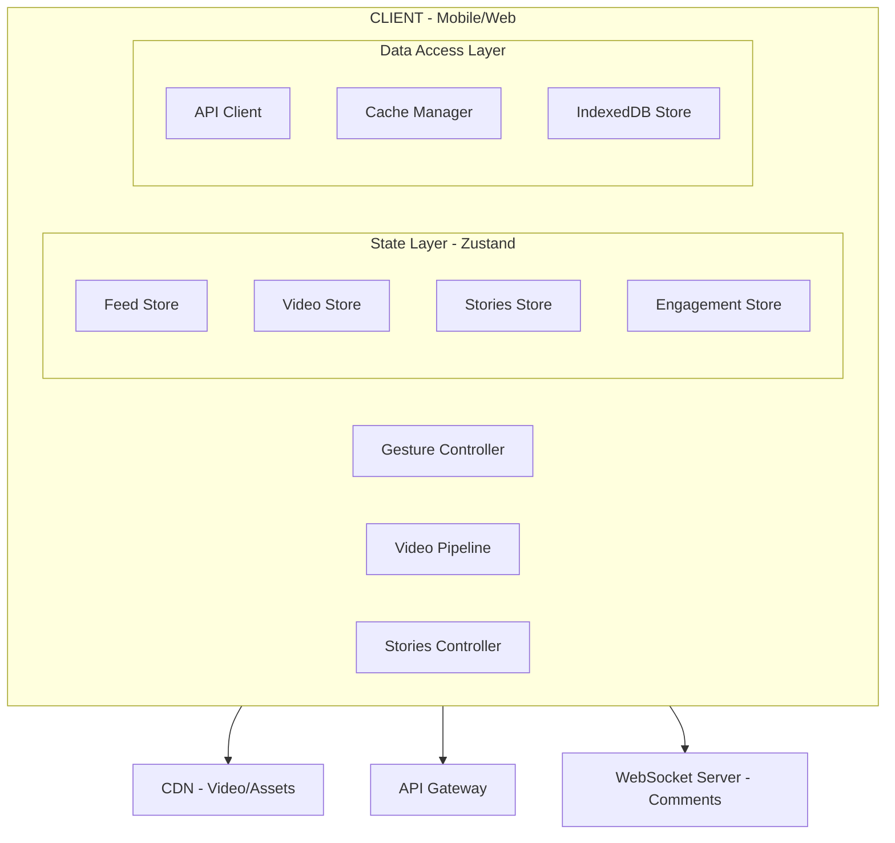

## Problem Statement

Design a full-screen vertical video feed with gesture-based navigation, pre-buffered video pipeline, and ephemeral stories viewer — the core experience powering TikTok, Instagram Reels/Stories, YouTube Shorts, and Snapchat Spotlight. The system must achieve < 200ms first-frame latency on swipe, handle infinite vertical scrolling with zero jank, manage complex gesture disambiguation (swipe vs tap vs long-press vs double-tap), and orchestrate a multi-video prefetching pipeline that keeps 2–3 videos buffered ahead of the current viewport.

This differs from a standard video player because: (1) navigation is gesture-driven with physics-based animations, (2) video lifecycle is managed by viewport intersection rather than explicit user action, (3) the feed is infinite with no defined end, (4) audio autoplay policy requires silent-start workarounds, and (5) the stories format adds auto-advance timers, horizontal navigation between users, and vertical navigation between story segments.

**Scope:** Full-screen reels feed, stories tray + viewer, gesture system, video pipeline, engagement overlay, creator tools UI, adaptive quality, analytics. **Out of scope:** Video encoding/transcoding backend, recommendation ML model, content moderation ML pipeline (we cover the client integration only).

**Production references:** TikTok (1B+ MAU), Instagram Reels (2B+ MAU), YouTube Shorts (2B+ monthly logged-in users), Snapchat Spotlight, Facebook Reels.

---

## Requirements Exploration

### Functional Requirements

1. Users swipe up/down to navigate between full-screen vertical videos in a feed with infinite scroll.
2. Videos auto-play with sound muted on feed entry; tapping unmutes audio.
3. Stories tray displays a horizontally scrollable avatar carousel with ring progress indicators showing unseen story segments.
4. Stories viewer auto-advances segments on a configurable timer (default 5s for images, video duration for video segments), with tap-left/tap-right to skip and hold-to-pause.
5. Double-tap anywhere on a video triggers a like animation with haptic feedback.
6. Long-press opens an options sheet (save, share, report, not interested).
7. Engagement overlay shows like count, comment count, share button, and creator avatar — all interactive.
8. Comments drawer slides up from bottom with real-time new comment streaming.
9. Creator tools: filters, text overlay (draggable/resizable), stickers, music sync (timeline scrubber), and trim tool.
10. Adaptive video quality switches between 360p/480p/720p/1080p based on network conditions and viewport size.
11. View tracking fires at 1s (impression), 3s (short view), and 50%+ duration (engaged view).
12. Creator monetization dashboard shows earnings, ad insertion points, and engagement analytics.

### Non-Functional Requirements

| Category      | Requirement                        | Target                                     |
| ------------- | ---------------------------------- | ------------------------------------------ |
| Performance   | First frame after swipe            | < 200ms on 4G mid-range device             |
| Performance   | Gesture response (touch-to-visual) | < 16ms (single frame)                      |
| Performance   | Feed scroll FPS                    | 60fps constant, 0 dropped frames           |
| Bundle        | Initial JS (feed route)            | < 180KB compressed                         |
| Bundle        | Creator tools (lazy)               | < 250KB compressed, loaded on demand       |
| Memory        | Video buffer pool                  | ≤ 3 videos decoded simultaneously          |
| Memory        | Total app heap                     | < 150MB on mobile                          |
| Network       | Prefetch budget                    | Buffer N+1 fully, N+2 first 2s             |
| Reliability   | Offline tolerance                  | Show cached feed items, queue interactions |
| Accessibility | WCAG compliance                    | AA minimum, keyboard + screen reader       |
| Battery       | Video decode                       | Hardware-accelerated only, no SW decode    |

---

## Capacity Estimation & Constraints

**Traffic assumptions (Instagram Reels scale):**

- DAU: 500M users
- Average session: 30 minutes, ~45 videos viewed
- Peak concurrent viewers: 50M
- Read:write ratio: 100:1 (consumption-heavy)

**Per-video payload:**

- Video manifest (HLS/DASH): ~2KB
- First segment (2s @ 720p): ~500KB
- Full video (15s @ 720p): ~4MB
- Thumbnail/poster: ~30KB (AVIF)
- Metadata (caption, audio, engagement counts): ~1KB JSON

**Client memory budget:**

- 3 decoded video frames in GPU memory: ~3 × 12MB = 36MB
- Prefetch buffer (2 videos × first 2s): ~1MB network cache
- Feed item metadata cache: 100 items × 1KB = 100KB
- Total video subsystem: ~50MB of 150MB budget

**Bandwidth per session:**

- 45 videos × 4MB average = 180MB per 30-min session = ~800 Kbps sustained
- Prefetch overhead: +20% = ~960 Kbps
- On 4G (typical 10–20 Mbps): well within budget
- On 3G (1–2 Mbps): must drop to 360p (~1.5MB/video) = 67.5MB/session

**API call volume:**

- Feed page fetch: 1 request per 10 videos = 4.5 requests/session
- Engagement actions: ~5 likes + 2 comments + 1 share = 8 writes/session
- View tracking beacons: 45 × 3 checkpoints = 135 beacons/session (batched to ~14 requests)

---

## Architecture / High-Level Design

### Rendering Strategy

**Client-Side Rendering (CSR) with app shell** — justified because:

1. Video feed is 100% personalized (no SSR benefit for SEO or shared caching)
2. Video playback requires full client control over `<video>` element lifecycle
3. Gesture handling demands immediate DOM access without hydration delay
4. App shell (header + navigation chrome) caches via Service Worker for instant return visits

The app shell loads in < 500ms (cached SW), then the feed hydrates client-side with the first batch of video metadata.

### Navigation Model

```
/ (feed)                    → Full-screen vertical video feed (SPA)
/stories/:userId            → Stories viewer (overlay on current route)
/reels/:reelId              → Deep-link to specific reel (same feed UI, scrolled to item)
/create                     → Creator tools (lazy-loaded route)
/creator/dashboard          → Monetization stats
```

URL state encodes: current video ID (for deep-linking/sharing), mute state (query param `?muted=0`), and stories position. Browser back button dismisses overlays (stories, comments) before navigating routes.

### System Architecture Diagram



### Component Architecture

```
App
├── FeedRoute (CSR, manages video pipeline)
│   ├── FeedContainer (virtual list, Intersection Observer)
│   │   ├── ReelCard (full-screen video + overlay)
│   │   │   ├── VideoPlayer (HTMLVideoElement wrapper)
│   │   │   ├── EngagementSidebar (like, comment, share, avatar)
│   │   │   ├── CaptionOverlay (expandable text)
│   │   │   └── MusicTicker (rotating disc + song name)
│   │   └── ReelCard × N (recycled/virtualized)
│   ├── GestureLayer (transparent overlay capturing all touch events)
│   └── CommentsDrawer (bottom sheet, lazy)
├── StoriesTray (horizontal scroll, client component)
│   └── StoryAvatar × N (ring progress, tap to open)
├── StoriesViewer (fullscreen overlay)
│   ├── StorySegment (image or video)
│   ├── ProgressBar (segmented, auto-advancing)
│   └── StoryNavigation (tap zones: left/right/hold)
└── CreatorTools (lazy-loaded route)
    ├── VideoRecorder
    ├── FilterPipeline (WebGL)
    ├── TextOverlay (draggable)
    ├── StickerPicker
    ├── MusicTimeline
    └── TrimTool
```

**Server Components:** None in the feed path — everything is client-rendered. The creator dashboard (monetization stats) uses Server Components for the initial data load since it's less latency-sensitive.

### State Management Strategy

| State Type           | Technology                              | Justification                                               |
| -------------------- | --------------------------------------- | ----------------------------------------------------------- |
| Video pipeline state | Zustand `videoStore`                    | Mutable, high-frequency updates (buffering %, current time) |
| Feed items           | Zustand `feedStore` + cursor pagination | Append-only list, normalized by ID                          |
| Stories progress     | Zustand `storiesStore`                  | Complex state machine (which user, which segment, timer)    |
| Engagement counts    | Zustand with optimistic updates         | Immediate UI feedback, reconcile on server response         |
| Mute state           | URL search param + localStorage         | Persists across sessions, shareable via URL                 |
| Comments             | Server state (React Query)              | Paginated, real-time via WebSocket                          |
| Creator tools        | Local component state                   | Ephemeral, discarded on exit                                |

---

## Data Model / Entities

```typescript
/** Core reel/video entity */
interface Reel {
  id: string;
  creatorId: string;
  videoUrl: string; // HLS manifest URL
  posterUrl: string; // First-frame AVIF
  blurhash: string; // 4:3 blurhash for placeholder
  duration: number; // Seconds (max 90s for reels, 60s for stories)
  width: number;
  height: number;
  caption: string;
  audioTrack: AudioTrack | null;
  createdAt: string; // ISO 8601
  engagementCounts: EngagementCounts;
  qualityVariants: QualityVariant[];
  isAd: boolean;
  adMetadata: AdMetadata | null;
}

interface QualityVariant {
  quality: "360p" | "480p" | "720p" | "1080p";
  manifestUrl: string;
  bitrate: number; // bps
  estimatedSize: number; // bytes for full video
}

interface AudioTrack {
  id: string;
  title: string;
  artistName: string;
  coverUrl: string;
  duration: number;
}

interface EngagementCounts {
  likes: number;
  comments: number;
  shares: number;
  views: number;
}

interface AdMetadata {
  advertiserId: string;
  clickUrl: string;
  impressionBeaconUrl: string;
  ctaText: string;
  skipAfterMs: number;
}

/** Story entity (group of segments per user) */
interface Story {
  userId: string;
  username: string;
  avatarUrl: string;
  segments: StorySegment[];
  lastUpdatedAt: string;
  hasUnseen: boolean;
  ringColor: string; // Gradient start color
}

interface StorySegment {
  id: string;
  type: "image" | "video";
  mediaUrl: string;
  duration: number; // Display duration in ms
  createdAt: string;
  expiresAt: string; // 24h from creation
  overlays: StoryOverlay[];
  viewCount: number;
  seen: boolean;
}

interface StoryOverlay {
  type: "text" | "sticker" | "mention" | "poll" | "link";
  position: { x: number; y: number }; // Normalized 0-1
  rotation: number; // Degrees
  scale: number;
  data: TextOverlayData | StickerData | MentionData | PollData | LinkData;
}

/** Video pipeline state */
interface VideoPipelineState {
  currentIndex: number;
  videos: Map<string, VideoPlaybackState>;
  prefetchQueue: string[]; // Ordered IDs to prefetch
  networkQuality: NetworkQuality;
  globalMuted: boolean;
}

interface VideoPlaybackState {
  id: string;
  status: "idle" | "prefetching" | "buffered" | "playing" | "paused" | "error";
  currentTime: number;
  bufferedRanges: TimeRange[];
  selectedQuality: QualityVariant["quality"];
  element: HTMLVideoElement | null; // Ref to DOM element
}

interface NetworkQuality {
  effectiveType: "2g" | "3g" | "4g" | "5g";
  downlink: number; // Mbps estimate
  rtt: number; // ms
  saveData: boolean;
}

/** Feed store (normalized) */
interface FeedState {
  reelIds: string[]; // Ordered feed
  reelsById: Record<string, Reel>;
  cursor: string | null; // For pagination
  hasMore: boolean;
  isLoading: boolean;
}

/** Engagement action (optimistic) */
interface EngagementAction {
  reelId: string;
  type: "like" | "unlike" | "comment" | "share" | "save";
  timestamp: number;
  synced: boolean; // False until server confirms
  idempotencyKey: string;
}

/** View tracking beacon */
interface ViewBeacon {
  reelId: string;
  checkpoint: "impression" | "short_view" | "engaged_view" | "complete";
  watchDurationMs: number;
  percentWatched: number;
  sessionId: string;
  timestamp: number;
  networkType: string;
  quality: string;
}
```

---

## Interface Definition (API)

### Feed Endpoint

```
GET /api/v1/feed/reels?cursor={cursor}&limit=10
```

**Response:**

```typescript
interface FeedResponse {
  reels: Reel[];
  nextCursor: string | null;
  hasMore: boolean;
  sessionId: string; // For analytics correlation
}
```

Cursor-based pagination because: feed is ranked/personalized per request — offset would produce duplicates on re-rank. Cursor is an opaque server token encoding last-seen timestamp + score.

### Stories Endpoints

```
GET /api/v1/stories/tray                    → StoryTrayResponse
GET /api/v1/stories/{userId}/segments       → StorySegmentsResponse
POST /api/v1/stories/seen                   → { acknowledged: true }
```

```typescript
interface StoryTrayResponse {
  stories: Story[]; // Ordered: unseen first, then recency
  nextRefreshAt: string; // When to re-poll tray
}
```

### Engagement Endpoints

```
POST /api/v1/reels/{reelId}/like            → { liked: true, newCount: number }
DELETE /api/v1/reels/{reelId}/like           → { liked: false, newCount: number }
POST /api/v1/reels/{reelId}/comment         → Comment
GET /api/v1/reels/{reelId}/comments?cursor  → PaginatedComments
POST /api/v1/reels/{reelId}/share           → { shareUrl: string }
```

### View Tracking (Batched)

```
POST /api/v1/analytics/views
```

```typescript
interface ViewBatchRequest {
  beacons: ViewBeacon[]; // Batched, max 50 per request
  clientTimestamp: number;
}
```

Batched using `navigator.sendBeacon()` on `visibilitychange` or every 10s interval — guarantees delivery even on tab close.

### WebSocket (Comments Real-time)

```typescript
// Client → Server
{ type: 'subscribe', reelId: string }
{ type: 'unsubscribe', reelId: string }

// Server → Client
{ type: 'new_comment', comment: Comment }
{ type: 'comment_count_update', reelId: string, count: number }
{ type: 'like_count_update', reelId: string, count: number }
```

### Cache Headers

| Endpoint          | Cache-Control                                          |
| ----------------- | ------------------------------------------------------ |
| Feed              | `private, no-store` (personalized)                     |
| Video manifest    | `public, max-age=3600, stale-while-revalidate=86400`   |
| Video segments    | `public, max-age=31536000, immutable`                  |
| Story segments    | `public, max-age=86400` (expire with story)            |
| Engagement counts | `private, max-age=30`                                  |
| User avatar       | `public, max-age=604800, stale-while-revalidate=86400` |

---

## Caching Strategy

### Client-Side Caching

**In-Memory (Zustand + normalized store):**

- Feed items: LRU cache of 200 reels (evict oldest when exceeded)
- Story tray: Full tray cached, refreshed every 60s or on pull-to-refresh
- Engagement counts: Cached per reel, invalidated on user action or 30s TTL

**Video Buffer Pool (3-slot ring buffer):**

```
Slot 0: Previous video (keep for instant back-swipe)
Slot 1: Current video (playing)
Slot 2: Next video (fully buffered)
+ Background prefetch: N+2 first 2 seconds only
```

Eviction: When user swipes forward, slot 0 is released, everything shifts down, new N+1 fills slot 2.

**Service Worker:**

- App shell: Cache-first (HTML + critical CSS + core JS)
- API responses: Network-first with 5s timeout, fall back to cached
- Video segments: No SW caching (too large, CDN handles this)
- Static assets (avatars, stickers): Stale-while-revalidate, 7-day TTL

**IndexedDB:**

- Seen stories set: `{ userId: string, lastSeenSegmentId: string, timestamp: number }`
- Draft creator content: Auto-saved every 5s during creation
- Offline engagement queue: Actions performed offline, replayed on reconnect
- Storage budget: 50MB max, LRU eviction by access time

### CDN & Edge Caching

- Video segments: Immutable URLs with content-hash, cached indefinitely at edge
- Video manifests: 1-hour edge TTL, purge on quality variant update
- Poster images: 24-hour edge TTL, AVIF with WebP fallback via `Accept` header negotiation
- API responses: Not CDN-cached (personalized feed)

Edge compute (Cloudflare Workers / Vercel Edge):

- Geolocation-based CDN origin selection (closest video PoP)
- A/B experiment assignment at edge (avoids API round-trip)

### Cache Coherence

- **Cross-tab:** BroadcastChannel syncs mute state and seen-stories across tabs
- **Optimistic reconciliation:** Like/unlike actions apply immediately; if server rejects (e.g., content deleted), revert count and show toast
- **Cache versioning:** App version in SW precache manifest; on deploy, old cache is purged after new SW activates
- **Stale detection:** Feed items older than 5 minutes re-fetch engagement counts on viewport entry

---

## Rendering & Performance Deep Dive

### Video Pipeline

The video pipeline is the most performance-critical subsystem. It must achieve < 200ms from swipe-end to first frame rendered.

```
┌─────────────────────────────────────────────────────┐
│              Video Pipeline State Machine            │
├─────────────────────────────────────────────────────┤
│                                                     │
│   IDLE → PREFETCH_MANIFEST → PREFETCH_SEGMENTS      │
│     → BUFFERED → PLAYING → PAUSED → IDLE           │
│                                                     │
│   Transitions triggered by:                         │
│   - Intersection Observer (viewport entry/exit)     │
│   - Gesture Controller (swipe complete)             │
│   - Network quality change (quality switch)         │
│   - User action (tap to pause/unmute)               │
│                                                     │
└─────────────────────────────────────────────────────┘
```

**Prefetching strategy:**

```typescript
class VideoPrefetchManager {
  private pool: Map<string, HTMLVideoElement> = new Map();
  private readonly MAX_POOL_SIZE = 3;

  async prefetch(reelId: string, quality: QualityVariant): Promise<void> {
    // Reuse or create video element
    const video = this.acquireElement(reelId);
    video.preload = "auto";
    video.src = quality.manifestUrl;

    // Buffer first 2 seconds minimum
    await new Promise<void>((resolve) => {
      const onProgress = () => {
        if (video.buffered.length > 0 && video.buffered.end(0) >= 2.0) {
          video.removeEventListener("progress", onProgress);
          resolve();
        }
      };
      video.addEventListener("progress", onProgress);
      video.load();
    });
  }

  private acquireElement(reelId: string): HTMLVideoElement {
    if (this.pool.has(reelId)) return this.pool.get(reelId)!;
    if (this.pool.size >= this.MAX_POOL_SIZE) {
      // Evict furthest-from-viewport element
      const evictId = this.findEvictionCandidate();
      const evicted = this.pool.get(evictId)!;
      evicted.src = "";
      evicted.load(); // Force resource release
      this.pool.delete(evictId);
    }
    const el = document.createElement("video");
    el.playsInline = true;
    el.muted = true; // Required for autoplay
    el.setAttribute("playsinline", "");
    this.pool.set(reelId, el);
    return el;
  }
}
```

<Callout>
  **Staff-level insight:** Pre-creating `HTMLVideoElement` instances and reusing
  them via a pool avoids the ~50ms cost of element creation and codec
  initialization on each swipe. TikTok uses a 3-element pool that rotates as the
  user scrolls.
</Callout>

**Adaptive quality selection:**

```typescript
function selectQuality(
  variants: QualityVariant[],
  network: NetworkQuality,
  viewport: { width: number; height: number },
): QualityVariant {
  // If user explicitly prefers data saving
  if (network.saveData) return variants.find((v) => v.quality === "360p")!;

  // Match quality to viewport (no point serving 1080p on 360px-wide phone)
  const maxUsefulHeight = viewport.height * window.devicePixelRatio;

  const qualityMap: Record<string, number> = {
    "360p": 360,
    "480p": 480,
    "720p": 720,
    "1080p": 1080,
  };

  // Filter to variants that don't exceed viewport resolution
  const suitable = variants.filter(
    (v) => qualityMap[v.quality] <= maxUsefulHeight,
  );

  // Select highest quality that fits within bandwidth budget (70% of downlink)
  const budgetBps = network.downlink * 1_000_000 * 0.7;
  const affordable = suitable.filter((v) => v.bitrate <= budgetBps);

  return affordable[affordable.length - 1] ?? suitable[0] ?? variants[0];
}
```

### Gesture System

The gesture system must disambiguate between 6 distinct interactions on the same surface:

| Gesture          | Detection                               | Action                     |
| ---------------- | --------------------------------------- | -------------------------- | ------- | ---------------------------- |
| Swipe up         | `deltaY < -50px` in `< 300ms`           | Navigate to next video     |
| Swipe down       | `deltaY > 50px` in `< 300ms`            | Navigate to previous video |
| Single tap       | `< 200ms` touch, no movement            | Toggle pause/play          |
| Double tap       | Two taps within `300ms`, `< 40px` apart | Like + heart animation     |
| Long press       | Touch held > `500ms` without movement   | Open options sheet         |
| Horizontal swipe | `deltaX > 80px`, `                      | deltaY                     | < 30px` | Navigate stories (in viewer) |

```typescript
class GestureController {
  private touchStart: Touch | null = null;
  private touchStartTime = 0;
  private lastTapTime = 0;
  private lastTapPosition = { x: 0, y: 0 };
  private longPressTimer: number | null = null;
  private readonly SWIPE_THRESHOLD = 50;
  private readonly SWIPE_TIME_LIMIT = 300;
  private readonly DOUBLE_TAP_DELAY = 300;
  private readonly LONG_PRESS_DELAY = 500;

  onTouchStart(e: TouchEvent): void {
    this.touchStart = e.touches[0];
    this.touchStartTime = Date.now();

    this.longPressTimer = window.setTimeout(() => {
      this.emit("longpress", {
        x: this.touchStart!.clientX,
        y: this.touchStart!.clientY,
      });
    }, this.LONG_PRESS_DELAY);
  }

  onTouchEnd(e: TouchEvent): void {
    if (this.longPressTimer) clearTimeout(this.longPressTimer);
    if (!this.touchStart) return;

    const touch = e.changedTouches[0];
    const deltaX = touch.clientX - this.touchStart.clientX;
    const deltaY = touch.clientY - this.touchStart.clientY;
    const elapsed = Date.now() - this.touchStartTime;

    // Swipe detection
    if (elapsed < this.SWIPE_TIME_LIMIT) {
      if (
        Math.abs(deltaY) > this.SWIPE_THRESHOLD &&
        Math.abs(deltaY) > Math.abs(deltaX)
      ) {
        this.emit(deltaY < 0 ? "swipe_up" : "swipe_down", {
          velocity: deltaY / elapsed,
        });
        return;
      }
      if (Math.abs(deltaX) > 80 && Math.abs(deltaY) < 30) {
        this.emit(deltaX > 0 ? "swipe_right" : "swipe_left", {
          velocity: deltaX / elapsed,
        });
        return;
      }
    }

    // Tap detection (no significant movement)
    if (Math.abs(deltaX) < 10 && Math.abs(deltaY) < 10 && elapsed < 200) {
      const now = Date.now();
      const dist = Math.hypot(
        touch.clientX - this.lastTapPosition.x,
        touch.clientY - this.lastTapPosition.y,
      );

      if (now - this.lastTapTime < this.DOUBLE_TAP_DELAY && dist < 40) {
        this.emit("doubletap", { x: touch.clientX, y: touch.clientY });
        this.lastTapTime = 0; // Reset to prevent triple-tap
      } else {
        // Delay single tap to wait for potential double-tap
        setTimeout(() => {
          if (Date.now() - this.lastTapTime >= this.DOUBLE_TAP_DELAY) {
            this.emit("singletap", { x: touch.clientX, y: touch.clientY });
          }
        }, this.DOUBLE_TAP_DELAY);
        this.lastTapTime = now;
        this.lastTapPosition = { x: touch.clientX, y: touch.clientY };
      }
    }
  }
}
```

<Callout>
  **Critical for 60fps:** The gesture layer uses `touch-action: none` on the
  feed container and processes all events in a passive listener. The swipe
  animation uses CSS `transform: translateY()` driven by
  `requestAnimationFrame`, never layout-triggering properties like `top` or
  `margin`.
</Callout>

### Prefetching Strategy

```
Current viewport: Video N (PLAYING)
┌───────────────────────────────┐
│ N-1: Keep decoded in memory   │  ← Instant back-swipe
│ N:   Currently playing        │  ← Active
│ N+1: Fully buffered (2s+)     │  ← Next swipe target
│ N+2: First 2s prefetched      │  ← Speculative
│ N+3: Manifest fetched only    │  ← Minimal prefetch
└───────────────────────────────┘
```

**Triggers for prefetch advancement:**

1. On swipe complete → promote N+1 to current, start N+2 full buffer, start N+3 manifest
2. On 50% watch of current video → speculatively start N+2 full buffer (user likely to continue)
3. On network downgrade → cancel N+3, reduce N+2 to manifest-only

**AbortController integration:**

```typescript
const prefetchControllers = new Map<string, AbortController>();

function cancelPrefetch(reelId: string): void {
  const controller = prefetchControllers.get(reelId);
  if (controller) {
    controller.abort();
    prefetchControllers.delete(reelId);
  }
}
```

### Bundle Optimization

| Chunk          | Contents                                               | Size (gzip) | Load Trigger       |
| -------------- | ------------------------------------------------------ | ----------- | ------------------ |
| `core`         | React, Zustand, gesture lib, router                    | 65KB        | Immediate          |
| `feed`         | Feed components, video pipeline, Intersection Observer | 45KB        | Route entry        |
| `engagement`   | Like animation (Lottie), comments drawer, share sheet  | 35KB        | First interaction  |
| `stories`      | Stories viewer, progress bar, overlay renderer         | 40KB        | Tray tap           |
| `creator`      | Camera, WebGL filters, timeline, music picker          | 220KB       | /create route      |
| `monetization` | Charts (recharts), analytics tables                    | 80KB        | /creator/dashboard |

**Total initial load: 110KB** (core + feed). Everything else is interaction-driven or route-driven lazy loading.

```typescript
// Lazy-load engagement overlay on first interaction
const CommentsDrawer = lazy(() => import("./CommentsDrawer"));
const ShareSheet = lazy(() => import("./ShareSheet"));
const LikeAnimation = lazy(() => import("./LikeAnimation"));

// Preload on hover/focus of engagement buttons
function preloadEngagement(): void {
  import("./CommentsDrawer");
  import("./ShareSheet");
  import("./LikeAnimation");
}
```

---

## Security Deep Dive

### Threat Model

| Threat                                           | Attack Vector                                           | Impact                                | Mitigation                                                                                            |
| ------------------------------------------------ | ------------------------------------------------------- | ------------------------------------- | ----------------------------------------------------------------------------------------------------- |
| Video content theft (screen recording, download) | Browser DevTools, extensions, network interception      | Revenue loss for creators             | DRM (Widevine L3), disable right-click, obfuscate segment URLs with signed tokens                     |
| Fake engagement (bot likes/views)                | Automated scripts, headless browsers                    | Inflated metrics, unfair monetization | Client fingerprinting, CAPTCHA on suspicious patterns, view validation (watch duration > 1s)          |
| Malicious story overlays (phishing links)        | User-generated link stickers pointing to phishing sites | Account compromise                    | URL allowlist (http/https/mailto only), link preview with domain display, warn on external navigation |
| Comment injection (XSS via comments)             | Script tags or event handlers in comment text           | Session hijack                        | Server-side sanitization, client-side DOMPurify, CSP `script-src 'nonce-{random}'`                    |
| Creator impersonation                            | Cloned profile, misleading verified badge               | Trust erosion                         | Server-enforced verified badge rendering (not client-controlled), report flow                         |

### Content Moderation

Client-side integration with moderation pipeline:

- **Pre-upload scanning:** On-device NSFW detection using TensorFlow.js lite model (< 2MB) — blocks obviously violating content before upload, saving server resources
- **Post-upload review:** Server applies full ML pipeline; client shows "Processing" state until approved
- **User-reported content:** Immediate client-side hide + queue for server review
- **Age-gated content:** Requires server-side age verification token; client enforces gate UI

```typescript
// Content gate enforcement
function ContentGate({ reel, children }: { reel: Reel; children: ReactNode }) {
  const { ageVerified } = useAuthStore();

  if (reel.ageRestricted && !ageVerified) {
    return <AgeVerificationPrompt reelId={reel.id} />;
  }
  return <>{children}</>;
}
```

### DRM

For premium/monetized content:

- **Widevine L3** (Chrome, Android) / **FairPlay** (Safari, iOS) for encrypted HLS
- Client requests license on first segment decode; license cached for session duration
- Fallback: Non-DRM streams for non-monetized content (reduces latency)

```typescript
async function requestDRMLicense(
  video: HTMLVideoElement,
  keySystem: string,
): Promise<void> {
  const config: MediaKeySystemConfiguration = {
    initDataTypes: ["cenc"],
    videoCapabilities: [{ contentType: 'video/mp4; codecs="avc1.42E01E"' }],
  };

  const access = await navigator.requestMediaKeySystemAccess(keySystem, [
    config,
  ]);
  const keys = await access.createMediaKeys();
  await video.setMediaKeys(keys);

  video.addEventListener("encrypted", async (event) => {
    const session = keys.createSession();
    session.addEventListener("message", async (e) => {
      const license = await fetchLicense(e.message);
      await session.update(license);
    });
    await session.generateRequest(event.initDataType, event.initData!);
  });
}
```

<Callout>
  **DRM reality check:** Widevine L3 (software-based) is trivially bypassable by
  determined actors. The goal isn't perfect protection — it's raising the cost
  of casual piracy enough to protect creator monetization. L1 (hardware TEE)
  requires native apps and is out of scope for web.
</Callout>

---

## Scalability & Reliability

### Scalability Patterns

**Feed pagination:** Cursor-based with server-issued opaque tokens. Each page returns 10 items. Client requests next page when user is within 3 items of end (prefetch trigger).

**Virtualization:** The feed uses a 3-element virtual window (previous + current + next) rather than traditional list virtualization. Only 3 `ReelCard` components exist in the DOM at any time. On swipe, the topmost is recycled to the bottom with new data.

```typescript
// Virtual window recycling
function useFeedVirtualWindow(feedItems: Reel[], currentIndex: number) {
  return useMemo(
    () => ({
      previous: feedItems[currentIndex - 1] ?? null,
      current: feedItems[currentIndex],
      next: feedItems[currentIndex + 1] ?? null,
    }),
    [feedItems, currentIndex],
  );
}
```

**Infinite feed:** When cursor indicates `hasMore: false`, client shows "You're all caught up" and switches to a secondary feed (e.g., "Suggested reels") with a new cursor chain.

### Failure Handling

| Failure Mode           | Detection                          | User Experience                               | Recovery                                                             |
| ---------------------- | ---------------------------------- | --------------------------------------------- | -------------------------------------------------------------------- |
| Network offline        | `navigator.onLine` + fetch timeout | Banner: "No connection", queue likes/comments | Replay queue on reconnect, exponential backoff (1s, 2s, 4s, max 30s) |
| Video segment 404      | HLS.js error event                 | Skip to next video, show "Video unavailable"  | Remove from feed, report to backend                                  |
| API timeout (> 5s)     | AbortController                    | Show cached feed if available, else skeleton  | Retry with backoff, max 3 retries                                    |
| WebSocket disconnect   | Close event / heartbeat miss       | Comments stop updating (no visible error)     | Auto-reconnect with jitter (1–5s), resync state                      |
| Memory pressure        | `performance.memory` / GC pauses   | Reduce prefetch to N+1 only                   | Release N-1 buffer, pause background prefetch                        |
| Storage quota exceeded | DOMException on IndexedDB write    | Silent degradation (stop caching offline)     | LRU eviction of oldest entries                                       |

### Resilience Patterns

- **Offline engagement queue:** Likes/comments stored in IndexedDB with idempotency keys. Replayed FIFO on reconnect. If server returns conflict (already liked), silently resolve.
- **Stale-while-revalidate for stories tray:** Show cached tray immediately, refresh in background. If refresh fails, tray remains usable with potentially stale "unseen" indicators.
- **Circuit breaker for analytics:** If view beacons fail 3× consecutively, stop sending for 60s. Analytics loss is acceptable; user experience is not.

### Graceful Degradation

| Connection Tier     | Behavior                                            |
| ------------------- | --------------------------------------------------- |
| 5G/WiFi (> 10 Mbps) | Full quality, prefetch N+2, animations enabled      |
| 4G (2–10 Mbps)      | 720p max, prefetch N+1 only, reduce animation       |
| 3G (< 2 Mbps)       | 360p, poster images until tap, disable prefetch     |
| Offline             | Show cached feed, engagement queued, no new content |

```typescript
function useNetworkTier(): "high" | "medium" | "low" | "offline" {
  const [tier, setTier] = useState<"high" | "medium" | "low" | "offline">(
    "high",
  );

  useEffect(() => {
    const conn = (navigator as any).connection;
    if (!conn) return;

    const update = () => {
      if (!navigator.onLine) return setTier("offline");
      if (conn.effectiveType === "4g" && conn.downlink > 10)
        return setTier("high");
      if (conn.effectiveType === "4g" || conn.effectiveType === "3g")
        return setTier("medium");
      setTier("low");
    };

    conn.addEventListener("change", update);
    update();
    return () => conn.removeEventListener("change", update);
  }, []);

  return tier;
}
```

---

## Accessibility Deep Dive

**Landmarks and roles:**

- Feed container: `role="feed"` with `aria-label="Video feed"`
- Each reel card: `role="article"` with `aria-label="{creator} - {caption first 50 chars}"`
- Engagement sidebar: `role="toolbar"` with `aria-label="Video actions"`
- Stories tray: `role="tablist"` with each avatar as `role="tab"`
- Stories viewer: `role="dialog"` with `aria-modal="true"`

**Keyboard navigation:**
| Key | Context | Action |
|-----|---------|--------|
| `ArrowDown` / `J` | Feed | Next video |
| `ArrowUp` / `K` | Feed | Previous video |
| `Space` | Feed | Toggle play/pause |
| `M` | Feed | Toggle mute |
| `L` | Feed | Like/unlike |
| `C` | Feed | Open comments |
| `ArrowLeft` | Stories viewer | Previous segment |
| `ArrowRight` | Stories viewer | Next segment |
| `Escape` | Stories/Comments | Close overlay |

**Screen reader announcements:**

```tsx
<div aria-live="polite" className="sr-only">
  {/* Announced on video change */}
  Video by {creator.username}. {reel.caption}.{reel.engagementCounts.likes}{" "}
  likes, {reel.engagementCounts.comments} comments. Duration:{" "}
  {formatDuration(reel.duration)}.
</div>
```

**Auto-play alternative:** When `prefers-reduced-motion` is set, videos show poster image with explicit play button. No auto-advance in stories — user taps to advance manually.

```css
@media (prefers-reduced-motion: reduce) {
  .swipe-animation {
    transition: none;
  }
  .like-animation {
    animation: none;
  }
  .stories-progress-bar {
    animation: none;
  }
}
```

**Focus management:**

- Opening comments drawer: focus moves to comment input, trapped within drawer
- Closing stories: focus returns to the story avatar that was tapped
- Feed navigation: focus follows current video's first interactive element

**Touch targets:** All engagement buttons (like, comment, share) are minimum 48×48px. Stories avatars in tray are 64×64px with 8px spacing.

---

## Monitoring & Observability

### Client-Side Metrics

| Metric                                           | Collection Method                                     | Alert Threshold |
| ------------------------------------------------ | ----------------------------------------------------- | --------------- |
| First frame latency (swipe → render)             | `performance.mark()` around swipe handler             | p95 > 300ms     |
| Video buffer stall rate                          | HLS.js `BUFFER_STALLED` events / total plays          | > 5%            |
| Gesture recognition accuracy                     | Misfire rate (swipe detected as tap)                  | > 2%            |
| Feed load time (API → first video playing)       | Custom timing from route entry                        | p95 > 3s        |
| Memory usage                                     | `performance.memory.usedJSHeapSize` sampled every 30s | > 200MB         |
| Engagement action latency (tap → server confirm) | Client timing                                         | p95 > 2s        |
| Video quality switches per session               | Count of ABR (adaptive bitrate) changes               | Informational   |
| Creator tools render FPS                         | `requestAnimationFrame` delta measurement             | < 30fps         |

### Error Tracking

- **Video errors:** HLS.js error events categorized by type (network, media, mux). Include: reel ID, quality level, buffer state, network type.
- **Gesture failures:** When touch events don't resolve to any recognized gesture (potential dead zone).
- **API failures:** 4xx/5xx by endpoint, with correlation ID for server-side lookup.
- Source maps uploaded to error tracker (Sentry) on each deploy.
- Error grouping: by error message + component stack (React error boundaries report component tree).

### Alerting & Dashboards

**Day-1 launch dashboard (8 panels):**

1. Feed load success rate (target: > 99.5%)
2. Video play success rate (target: > 98%)
3. First frame latency distribution (p50, p75, p95)
4. Buffer stall rate by network type
5. Engagement actions/minute (likes, comments, shares)
6. Client error rate by category
7. Active concurrent viewers (real-time counter)
8. Memory/CPU usage distribution by device tier

**Alert triggers:**

- Error rate > 1% sustained for 5 minutes → PagerDuty P2
- First frame p95 > 500ms for 10 minutes → Slack #frontend-alerts
- Video play failure > 5% → PagerDuty P1
- Feed API p99 > 3s → Slack + auto-scale trigger

### Real User Monitoring (RUM)

- **Sampling:** 100% for errors, 25% for performance metrics, 5% for full session replay
- **Segmentation:** Device tier (low/mid/high), network type, geo region, app version
- **Funnel tracking:** Feed load → First video play → 3+ videos watched → Engagement action → Session > 5min
- **Rage-tap detection:** 3+ taps in same 50px area within 2s → potential broken interaction

---

## Trade-offs

| Decision                                                  | Pro                                                                     | Con                                                                                           |
| --------------------------------------------------------- | ----------------------------------------------------------------------- | --------------------------------------------------------------------------------------------- |
| 3-element virtual window vs full list virtualization      | Simpler implementation, guaranteed 60fps, no scroll position complexity | Cannot show traditional scroll indicator, harder to implement "scroll to position"            |
| Pre-created video element pool vs on-demand creation      | ~50ms savings per video, smoother transitions                           | Higher baseline memory, complexity in pool management                                         |
| Muted autoplay by default                                 | Complies with browser autoplay policy, no user friction                 | Users may not realize audio exists, lower audio engagement                                    |
| Cursor pagination vs offset                               | No duplicates on re-rank, consistent with infinite feed                 | Cannot "jump to page N", harder to estimate total count                                       |
| Client-side gesture detection vs native scroll            | Full control over animation physics, supports complex gestures          | Must handle all edge cases (multi-touch, scroll momentum), no native accessibility scroll     |
| HLS over DASH                                             | Universal iOS support, wider CDN compatibility                          | Slightly less efficient than DASH for adaptive streaming, larger manifest files               |
| Optimistic engagement updates vs wait for server          | Instant feedback (< 16ms), better perceived performance                 | Must handle rollback on failure, potential for brief inconsistency                            |
| Single WebSocket for comments vs polling                  | Real-time delivery, lower server load for active videos                 | Connection management complexity, reconnection logic, not useful for videos with few comments |
| Lazy-load creator tools (220KB) vs include in main bundle | 55% reduction in initial bundle size                                    | 200–500ms delay on first /create navigation, must show loading state                          |
| Blurhash placeholders vs skeleton UI                      | Visually matches content, smoother transition to loaded video           | ~2ms decode per placeholder, slightly more complex implementation                             |

---

## What Great Looks Like

A **senior** answer covers:

- Full-screen video feed with basic swipe navigation
- Video prefetching (N+1 buffered)
- Gesture system with swipe + tap discrimination
- Muted autoplay with tap-to-unmute
- Basic engagement interactions (like, comment)

A **staff** answer additionally:

- Video element pool with ring buffer rotation strategy
- Adaptive bitrate selection based on network AND viewport
- Complete gesture disambiguation (6 gestures on same surface)
- Stories viewer with auto-advance state machine
- Comprehensive failure handling per failure mode
- View tracking with batched beacons and `sendBeacon`
- Bundle optimization with interaction-triggered lazy loading
- Cross-tab state sync for mute/stories via BroadcastChannel

A **principal** answer additionally:

- DRM integration tradeoffs (L1 vs L3, native vs web)
- Memory pressure detection and dynamic prefetch budget adjustment
- Creator monetization UI with ad insertion point visualization
- Full observability strategy with day-1 dashboard specification
- Battery impact analysis (hardware decode enforcement, prefetch throttling)
- Accessibility model for gesture-heavy interfaces (keyboard alternatives, screen reader announcements)

---

## Key Takeaways

- **Video element pooling** is non-negotiable for < 200ms first frame — pre-create and recycle rather than create-on-demand.
- **Gesture disambiguation** requires careful state machine design with explicit timing thresholds; single-tap must be delayed to allow double-tap detection.
- **Prefetch exactly N+1 fully and N+2 partially** — more wastes bandwidth on content users may never see; less causes visible buffering.
- **Adaptive quality** must consider both network bandwidth AND viewport resolution — serving 1080p to a 360px device wastes 4× the bandwidth for zero visual benefit.
- **Muted autoplay is a constraint, not a choice** — browser policy mandates it; design the UX around progressive audio disclosure.
- **Intersection Observer controls video lifecycle** — play/pause is viewport-driven, not user-driven, which inverts traditional player architecture.
- **Stories and Reels share video infrastructure but differ in navigation model** — horizontal (stories) vs vertical (reels) requires separate gesture handling and prefetch strategies.
- **View tracking must use `navigator.sendBeacon()`** — `fetch` requests are cancelled on page unload, losing critical analytics data.
