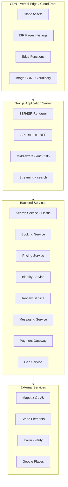

## Problem Statement

Travel booking platforms (Airbnb, Booking.com, Expedia, VRBO) represent one of the most complex frontend architectures in production today. They combine real-time inventory management, geospatial search with map rendering, multi-currency pricing, calendar-based availability, and multi-step transactional flows — all while serving a global audience across devices, languages, and network conditions.

The frontend must handle:

- **Search with geospatial constraints** — viewport-based queries against millions of listings with complex filter combinations (dates, guests, price range, amenities, property type, instant book)
- **Map-list synchronization** — bidirectional state between a Mapbox/Google Maps instance and a paginated listing grid
- **Calendar availability** — per-night pricing, blocked dates, minimum stays, and seasonal rate changes rendered in a performant date picker
- **Booking transactions** — multi-step forms with inventory holds, payment processing, and confirmation flows that tolerate network failures
- **SEO at scale** — millions of listing pages requiring ISR with structured data for Google Hotels integration
- **Internationalization** — 60+ locales, 40+ currencies, RTL layouts, locale-aware date/number formatting

Real-world scale: Airbnb serves 150M+ users across 220+ countries with 7M+ active listings. Booking.com indexes 28M+ reported listings. These platforms process $50B+ in gross bookings annually. The frontend is the revenue surface — every 100ms of latency costs measurable conversion.

---

## Requirements Exploration

### Functional Requirements

1. **Search & Discovery** — Full-text search with autocomplete, geospatial viewport queries, complex filter composition (dates, guests, price range, amenities, property type, instant book, accessibility features)
2. **Map Integration** — Interactive map with marker clustering, viewport-based search updates, price markers, hover/click state synchronization with list view
3. **Listing Detail** — Photo gallery (50+ images), virtual tours/360° views, availability calendar, pricing breakdown, host profile, reviews with sentiment, amenity grid, neighborhood info
4. **Booking Flow** — Guest count selection, date validation against availability, pricing calculation with fees/taxes, payment method entry, identity verification, confirmation with itinerary
5. **Review System** — Star ratings, written reviews, photo reviews, host responses, sentiment indicators, filtering by rating/recency/relevance
6. **Host Dashboard** — Earnings analytics, calendar/availability management, pricing rules, messaging inbox, listing editor, booking management
7. **User Profiles** — Trip history, wishlists, saved searches, payment methods, identity verification status, host/guest mode switching
8. **Messaging** — Real-time host-guest communication, pre-booking inquiries, booking modification requests, automated messages
9. **Notifications** — Price alerts, booking confirmations, review reminders, message notifications across push/email/in-app

### Non-Functional Requirements

| Requirement           | Target                                        | Rationale                                                              |
| --------------------- | --------------------------------------------- | ---------------------------------------------------------------------- |
| LCP                   | < 1.8s (search), < 2.2s (listing)             | Google Hotels ranking factor; conversion drops 7% per 100ms above 2s   |
| INP                   | < 150ms                                       | Map interactions, filter changes, calendar selection must feel instant |
| CLS                   | < 0.05                                        | Image galleries, map resize, price updates must not shift layout       |
| TTI                   | < 3.5s on 4G                                  | 60% of travel searches start on mobile in poor connectivity zones      |
| Search-to-results     | < 400ms (P95)                                 | Users compare 3-4 platforms simultaneously; slowest loses              |
| Booking completion    | < 8 steps                                     | Each additional step loses 15-20% of funnel                            |
| SEO indexability      | 100% of published listings                    | Organic search drives 40%+ of traffic for travel platforms             |
| Availability accuracy | < 30s stale                                   | Double-bookings destroy trust; stale inventory = lost revenue          |
| i18n coverage         | 60+ locales, 40+ currencies                   | Travel is inherently international                                     |
| Offline resilience    | Saved listings, trip details viewable offline | Users travel to areas with poor connectivity                           |
| Accessibility         | WCAG 2.2 AA                                   | Legal requirement in EU/US; 15% of users have accessibility needs      |

---

## Capacity Estimation & Constraints

| Metric                         | Value                             | Impact on Frontend                                   |
| ------------------------------ | --------------------------------- | ---------------------------------------------------- |
| Monthly active users           | 150M                              | CDN capacity, edge caching strategy                  |
| Concurrent search sessions     | 2M peak                           | WebSocket/SSE connections, search API rate limiting  |
| Active listings                | 7M+                               | Search index size, ISR page generation volume        |
| Average photos per listing     | 25-30                             | Image optimization pipeline, lazy loading strategy   |
| Average search filters applied | 4.2 per query                     | Filter state serialization, URL complexity           |
| Search results per page        | 20 items + map markers            | DOM node count, render budget                        |
| Map markers visible            | 50-300 (clustered from thousands) | Canvas/WebGL rendering budget                        |
| Booking funnel steps           | 5-7                               | Form state persistence, recovery on failure          |
| Price updates frequency        | Every 30s during active search    | WebSocket vs polling decision                        |
| Supported languages            | 62                                | Bundle size per locale, translation loading strategy |
| Image variants per photo       | 8 (srcset)                        | CDN storage, responsive image strategy               |
| Calendar range                 | 18 months forward                 | Date picker render performance                       |
| Review count per listing       | 0-5000+                           | Virtualized list, pagination strategy                |

**Bundle Budget:**

| Segment         | Budget        | Contents                              |
| --------------- | ------------- | ------------------------------------- |
| Critical path   | 80KB gzipped  | Shell, search bar, above-fold results |
| Map chunk       | 120KB gzipped | Mapbox GL JS + custom layers          |
| Booking flow    | 60KB gzipped  | Forms, payment, validation            |
| Calendar/dates  | 25KB gzipped  | Date picker, availability logic       |
| Gallery         | 40KB gzipped  | Lightbox, virtual tour viewer         |
| i18n per locale | 15KB gzipped  | ICU messages, CLDR subset             |

---

## Architecture / High-Level Design

### Rendering Strategy

| Route                  | Strategy                            | Rationale                                                         |
| ---------------------- | ----------------------------------- | ----------------------------------------------------------------- |
| `/` (homepage)         | SSG with ISR (60s)                  | Personalized recommendations hydrate client-side; shell is static |
| `/search`              | SSR with streaming                  | Search params in URL for SEO; stream results as API responds      |
| `/listing/[slug]`      | ISR (300s) + on-demand revalidation | 7M+ pages cannot rebuild on deploy; revalidate on host edit       |
| `/booking/[id]`        | CSR (authenticated)                 | No SEO value; complex form state; requires auth                   |
| `/host/dashboard`      | CSR (authenticated)                 | Real-time data; no crawl value                                    |
| `/reviews/[listingId]` | ISR (3600s)                         | SEO value; reviews change infrequently                            |

<Callout>
  Staff-level insight: Use Next.js Partial Prerendering (PPR) for listing pages
  — static shell with availability/pricing as dynamic holes. This gives instant
  TTFB for the 90% of content that rarely changes while keeping
  price/availability fresh.
</Callout>

### Navigation Model

```
/ (homepage)
├── /search?location=X&checkin=Y&checkout=Z&guests=N&filters=...
│   └── (modal) /listing/[slug] (on mobile: full page)
├── /listing/[slug]
│   ├── /listing/[slug]/reviews
│   ├── /listing/[slug]/photos
│   └── /booking/[listingId]
│       ├── /booking/[id]/confirm
│       └── /booking/[id]/receipt
├── /wishlists
├── /trips
├── /messages
│   └── /messages/[threadId]
├── /host
│   ├── /host/listings
│   ├── /host/calendar
│   ├── /host/earnings
│   └── /host/messages
└── /account
    ├── /account/profile
    ├── /account/payments
    └── /account/preferences
```

### System Architecture Diagram



### Component Architecture

```
SearchPage
├── SearchHeader
│   ├── LocationAutocomplete (Google Places / custom)
│   ├── DateRangePicker (availability-aware)
│   └── GuestSelector (adults/children/infants/pets)
├── FilterBar
│   ├── PriceRangeSlider
│   ├── PropertyTypeSelector
│   ├── AmenityCheckboxGroup
│   └── InstantBookToggle
├── SearchLayout (responsive: stack on mobile, split on desktop)
│   ├── MapView
│   │   ├── MapContainer (Mapbox GL JS)
│   │   ├── MarkerCluster
│   │   ├── PriceMarker
│   │   └── MapControls (zoom, fullscreen, satellite)
│   └── ResultsList
│       ├── ListingCard (virtualized)
│       │   ├── ImageCarousel
│       │   ├── PricingBadge
│       │   ├── RatingStars
│       │   └── WishlistButton
│       └── Pagination / InfiniteScroll
└── SearchFooter (mobile: map toggle FAB)

ListingPage
├── PhotoGallery
│   ├── ImageGrid (hero + 4 supporting)
│   ├── LightboxModal (swipeable, keyboard nav)
│   └── VirtualTourViewer (360° embed)
├── ListingContent
│   ├── TitleBlock (title, rating, location, superhost badge)
│   ├── HostCard
│   ├── DescriptionSection (expandable)
│   ├── AmenityGrid
│   ├── AvailabilityCalendar
│   ├── LocationMap (static + expandable)
│   └── ReviewsSection
│       ├── RatingSummary (category breakdown)
│       ├── ReviewList (virtualized)
│       └── ReviewFilters
└── BookingSidebar (sticky on desktop, bottom sheet on mobile)
    ├── PriceBreakdown
    ├── DateSelector (inline calendar)
    ├── GuestSelector
    └── ReserveButton (with inventory status)

BookingFlow
├── BookingStepIndicator
├── GuestInfoStep
├── PaymentStep (Stripe Elements)
├── ReviewStep (summary before confirm)
└── ConfirmationStep (itinerary + receipt)
```

### State Management Strategy

| State Domain          | Solution                     | Rationale                                                           |
| --------------------- | ---------------------------- | ------------------------------------------------------------------- |
| Search filters        | URL search params (nuqs)     | Shareable, bookmarkable, SSR-compatible                             |
| Map viewport          | Zustand (transient)          | High-frequency updates (pan/zoom); no persistence needed            |
| Search results        | TanStack Query               | Server cache with background refetch; deduplication across map/list |
| Booking form          | Zustand + sessionStorage     | Multi-step form; survives refresh; cleared on completion            |
| User session          | Server context + cookie      | HttpOnly cookie; no client-side token exposure                      |
| Wishlists             | TanStack Query (optimistic)  | Optimistic UI for heart toggle; server reconciliation               |
| Real-time prices      | TanStack Query (polling 30s) | Stale-while-revalidate; visual indicator on price change            |
| Calendar availability | TanStack Query (per-listing) | Cached per listing; invalidated on booking                          |
| i18n messages         | Static import (per locale)   | Build-time extraction; no runtime fetch                             |

<Callout>
  Staff-level insight: Search filter state belongs in the URL, not in a client
  store. This enables deep linking, browser back/forward, and SSR of search
  results. Use a library like `nuqs` for type-safe URL state with Next.js App
  Router integration.
</Callout>

---

## Data Model / Entities

```typescript
// Core listing types
interface Listing {
  id: string;
  slug: string;
  title: string;
  description: string;
  propertyType: PropertyType;
  roomType: "entire_place" | "private_room" | "shared_room";
  hostId: string;
  location: GeoLocation;
  address: Address;
  capacity: GuestCapacity;
  bedrooms: number;
  beds: number;
  bathrooms: number;
  amenities: AmenityId[];
  photos: ListingPhoto[];
  virtualTour?: VirtualTourConfig;
  pricing: PricingConfig;
  availability: AvailabilityConfig;
  instantBook: boolean;
  superhostStatus: boolean;
  rating: RatingAggregate;
  reviewCount: number;
  createdAt: string; // ISO 8601
  updatedAt: string;
  status: "active" | "inactive" | "pending_review" | "suspended";
}

type PropertyType =
  | "apartment"
  | "house"
  | "villa"
  | "cabin"
  | "treehouse"
  | "boat"
  | "castle"
  | "tent"
  | "hotel"
  | "hostel"
  | "resort"
  | "farm";

interface GeoLocation {
  lat: number;
  lng: number;
  /** Obfuscated radius for privacy (meters) */
  fuzzyRadius: number;
}

interface Address {
  street?: string; // Only revealed post-booking
  city: string;
  state?: string;
  country: string;
  countryCode: string; // ISO 3166-1 alpha-2
  postalCode?: string;
  neighborhood?: string;
}

interface GuestCapacity {
  maxGuests: number;
  adults: number;
  children: number;
  infants: number;
  pets: boolean;
}

interface ListingPhoto {
  id: string;
  url: string;
  caption?: string;
  width: number;
  height: number;
  blurhash: string;
  /** Responsive variants */
  srcset: ImageVariant[];
  category:
    | "exterior"
    | "interior"
    | "bedroom"
    | "bathroom"
    | "kitchen"
    | "view"
    | "amenity";
}

interface ImageVariant {
  url: string;
  width: number;
  format: "webp" | "avif" | "jpeg";
}

interface VirtualTourConfig {
  provider: "matterport" | "custom";
  embedUrl: string;
  thumbnailUrl: string;
}

// Pricing
interface PricingConfig {
  basePricePerNight: MonetaryAmount;
  currency: CurrencyCode;
  weekendMultiplier: number; // e.g., 1.2
  weeklyDiscount?: number; // percentage
  monthlyDiscount?: number;
  cleaningFee: MonetaryAmount;
  securityDeposit?: MonetaryAmount;
  extraGuestFee?: MonetaryAmount;
  extraGuestThreshold?: number;
  seasonalPricing: SeasonalRate[];
  customNightlyPrices: Record<string, MonetaryAmount>; // date -> price override
}

interface MonetaryAmount {
  amount: number; // cents/smallest unit
  currency: CurrencyCode;
}

type CurrencyCode = "USD" | "EUR" | "GBP" | "JPY" | "AUD" | string;

interface SeasonalRate {
  startDate: string; // MM-DD
  endDate: string;
  multiplier: number;
  label?: string; // "Peak Season", "Holiday"
}

// Availability
interface AvailabilityConfig {
  minNights: number;
  maxNights: number;
  advanceNotice: number; // hours
  preparationTime: number; // days between bookings
  availabilityWindow: number; // months into future
  blockedDates: DateRange[];
  checkInTime: string; // HH:mm
  checkOutTime: string;
  checkInDays?: DayOfWeek[]; // restrict check-in to specific days
}

interface DateRange {
  start: string; // ISO date
  end: string;
  reason?: "host_blocked" | "booked" | "maintenance";
}

type DayOfWeek = "mon" | "tue" | "wed" | "thu" | "fri" | "sat" | "sun";

// Search
interface SearchParams {
  location?: string;
  bounds?: MapBounds;
  checkin?: string;
  checkout?: string;
  guests: GuestCapacity;
  priceMin?: number;
  priceMax?: number;
  propertyTypes?: PropertyType[];
  amenities?: AmenityId[];
  instantBook?: boolean;
  superhostOnly?: boolean;
  roomType?: ("entire_place" | "private_room" | "shared_room")[];
  bedrooms?: number;
  beds?: number;
  bathrooms?: number;
  accessibility?: AccessibilityFeature[];
  sortBy: "relevance" | "price_asc" | "price_desc" | "rating" | "newest";
  page: number;
  pageSize: number;
}

interface MapBounds {
  ne: { lat: number; lng: number };
  sw: { lat: number; lng: number };
}

interface SearchResult {
  listings: ListingCard[];
  total: number;
  pagination: PaginationMeta;
  mapMarkers: MapMarker[];
  facets: SearchFacets;
  searchId: string; // for analytics correlation
}

interface ListingCard {
  id: string;
  slug: string;
  title: string;
  photos: ListingPhoto[]; // first 5 only
  pricing: {
    perNight: MonetaryAmount;
    total?: MonetaryAmount; // if dates provided
  };
  rating: RatingAggregate;
  reviewCount: number;
  propertyType: PropertyType;
  roomType: string;
  location: { city: string; country: string; lat: number; lng: number };
  instantBook: boolean;
  superhostStatus: boolean;
  capacity: GuestCapacity;
  amenityHighlights: AmenityId[]; // top 3-5
  isWishlisted: boolean;
}

interface MapMarker {
  id: string;
  lat: number;
  lng: number;
  price: MonetaryAmount;
  isSelected: boolean;
}

// Booking
interface Booking {
  id: string;
  listingId: string;
  guestId: string;
  hostId: string;
  status: BookingStatus;
  checkIn: string;
  checkOut: string;
  guests: GuestCapacity;
  pricing: BookingPricing;
  paymentIntentId: string;
  specialRequests?: string;
  guestInfo: GuestInfo;
  createdAt: string;
  confirmedAt?: string;
  cancelledAt?: string;
  cancellationReason?: string;
}

type BookingStatus =
  | "pending"
  | "confirmed"
  | "cancelled_guest"
  | "cancelled_host"
  | "completed"
  | "review_pending";

interface BookingPricing {
  nights: number;
  perNightRate: MonetaryAmount;
  subtotal: MonetaryAmount;
  cleaningFee: MonetaryAmount;
  serviceFee: MonetaryAmount;
  taxes: TaxBreakdown[];
  total: MonetaryAmount;
  currency: CurrencyCode;
  /** Exchange rate if display currency differs from listing currency */
  exchangeRate?: { from: CurrencyCode; to: CurrencyCode; rate: number };
}

interface TaxBreakdown {
  name: string;
  rate: number;
  amount: MonetaryAmount;
}

// Reviews
interface Review {
  id: string;
  listingId: string;
  bookingId: string;
  authorId: string;
  authorName: string;
  authorAvatar: string;
  rating: number; // 1-5
  categoryRatings: CategoryRatings;
  content: string;
  photos?: ReviewPhoto[];
  sentiment: "positive" | "neutral" | "negative";
  hostResponse?: { content: string; respondedAt: string };
  createdAt: string;
  stayDates: { checkIn: string; checkOut: string };
  tripType?: "business" | "family" | "couple" | "solo" | "friends";
}

interface CategoryRatings {
  cleanliness: number;
  accuracy: number;
  communication: number;
  location: number;
  checkIn: number;
  value: number;
}

interface RatingAggregate {
  overall: number;
  categories: CategoryRatings;
  distribution: Record<1 | 2 | 3 | 4 | 5, number>;
}
```

---

## Interface Definition (API)

### Search API

```typescript
// GET /api/search
// Query params serialized from SearchParams type
interface SearchRequest {
  method: "GET";
  path: "/api/search";
  query: SearchParams;
  headers: {
    "Accept-Language": string;
    "X-Currency": CurrencyCode;
    "X-Request-Id": string;
  };
}

interface SearchResponse {
  data: SearchResult;
  meta: {
    requestId: string;
    latencyMs: number;
    cacheHit: boolean;
  };
}

// GET /api/search/autocomplete
interface AutocompleteRequest {
  method: "GET";
  path: "/api/search/autocomplete";
  query: {
    q: string;
    types?: ("city" | "region" | "country" | "listing")[];
    limit?: number;
  };
}

interface AutocompleteResponse {
  suggestions: Array<{
    id: string;
    type: "city" | "region" | "country" | "listing";
    label: string;
    subtitle?: string;
    location: GeoLocation;
    resultCount?: number;
  }>;
}
```

### Listing API

```typescript
// GET /api/listings/[slug]
interface ListingDetailResponse {
  listing: Listing;
  host: HostProfile;
  nearbyListings: ListingCard[];
  structuredData: SchemaOrgLodgingBusiness; // JSON-LD
}

// GET /api/listings/[id]/availability
interface AvailabilityRequest {
  method: "GET";
  path: "/api/listings/:id/availability";
  query: { startMonth: string; months: number }; // YYYY-MM, 1-18
}

interface AvailabilityResponse {
  listingId: string;
  calendar: CalendarMonth[];
}

interface CalendarMonth {
  month: string; // YYYY-MM
  days: CalendarDay[];
}

interface CalendarDay {
  date: string; // YYYY-MM-DD
  available: boolean;
  price?: MonetaryAmount;
  minNights?: number;
  checkInAllowed: boolean;
  checkOutAllowed: boolean;
  reason?: "booked" | "blocked" | "past" | "too_far";
}

// GET /api/listings/[id]/reviews
interface ReviewsRequest {
  method: "GET";
  path: "/api/listings/:id/reviews";
  query: {
    page: number;
    pageSize: number; // max 50
    sortBy: "newest" | "highest" | "lowest" | "relevance";
    rating?: number; // filter by star count
    hasPhotos?: boolean;
  };
}

interface ReviewsResponse {
  reviews: Review[];
  aggregate: RatingAggregate;
  pagination: PaginationMeta;
}
```

### Booking API

```typescript
// POST /api/bookings/price-quote
interface PriceQuoteRequest {
  listingId: string;
  checkIn: string;
  checkOut: string;
  guests: GuestCapacity;
  currency: CurrencyCode;
}

interface PriceQuoteResponse {
  pricing: BookingPricing;
  holdExpiry?: string; // ISO datetime — inventory hold expiration
  quoteId: string;
  validUntil: string;
}

// POST /api/bookings/hold
interface InventoryHoldRequest {
  listingId: string;
  checkIn: string;
  checkOut: string;
  quoteId: string;
}

interface InventoryHoldResponse {
  holdId: string;
  expiresAt: string; // 15-minute hold
  status: "held" | "unavailable";
}

// POST /api/bookings
interface CreateBookingRequest {
  holdId: string;
  quoteId: string;
  guests: GuestCapacity;
  guestInfo: GuestInfo;
  paymentMethodId: string;
  specialRequests?: string;
  agreedToTerms: boolean;
}

interface CreateBookingResponse {
  booking: Booking;
  paymentStatus: "succeeded" | "requires_action" | "failed";
  /** Stripe client secret for 3D Secure if requires_action */
  clientSecret?: string;
  confirmationCode: string;
}
```

### WebSocket — Real-time Price & Availability

```typescript
// WSS /ws/search
interface SearchWSMessage {
  type: "price_update" | "availability_change" | "new_listing";
  payload: PriceUpdatePayload | AvailabilityChangePayload;
}

interface PriceUpdatePayload {
  listingId: string;
  oldPrice: MonetaryAmount;
  newPrice: MonetaryAmount;
  reason: "demand" | "host_change" | "promotion";
}

interface AvailabilityChangePayload {
  listingId: string;
  dates: string[];
  available: boolean;
}

// WSS /ws/messages
interface MessageWSPayload {
  type: "new_message" | "typing" | "read_receipt";
  threadId: string;
  senderId: string;
  content?: string;
  timestamp: string;
}
```

### Pagination

```typescript
interface PaginationMeta {
  page: number;
  pageSize: number;
  total: number;
  totalPages: number;
  hasNext: boolean;
  hasPrev: boolean;
  /** Cursor for keyset pagination (preferred for map-based results) */
  cursor?: string;
}
```

---

## Caching Strategy

### Client-Side Caching

| Data                  | Strategy                              | TTL                  | Invalidation                       |
| --------------------- | ------------------------------------- | -------------------- | ---------------------------------- |
| Search results        | TanStack Query stale-while-revalidate | 30s stale, 5min gc   | New search params, viewport change |
| Listing detail        | TanStack Query                        | 5min stale, 30min gc | On-demand via revalidateTag        |
| Availability calendar | TanStack Query per listing            | 60s stale            | Booking creation, host edit        |
| User wishlists        | TanStack Query + optimistic           | 5min stale           | Immediate optimistic update        |
| Autocomplete          | In-memory LRU (100 entries)           | Session lifetime     | Never (append-only cache)          |
| Map tiles             | Mapbox GL cache (IndexedDB)           | 7 days               | Mapbox SDK managed                 |
| Exchange rates        | localStorage                          | 1 hour               | Background refresh                 |
| i18n messages         | Service Worker cache                  | Until next deploy    | Build hash comparison              |

```typescript
// TanStack Query configuration for search
const searchQueryOptions = {
  queryKey: ["search", serializedParams],
  queryFn: () => searchAPI.search(params),
  staleTime: 30_000,
  gcTime: 300_000,
  placeholderData: keepPreviousData, // Show previous results while fetching
  refetchOnWindowFocus: false, // Don't refetch on tab switch
  retry: 2,
  retryDelay: (attempt: number) => Math.min(1000 * 2 ** attempt, 10000),
};

// Optimistic wishlist toggle
const wishlistMutation = useMutation({
  mutationFn: (listingId: string) => toggleWishlist(listingId),
  onMutate: async (listingId) => {
    await queryClient.cancelQueries({ queryKey: ["search"] });
    const previous = queryClient.getQueryData<SearchResult>(["search", params]);
    queryClient.setQueryData(["search", params], (old: SearchResult) => ({
      ...old,
      listings: old.listings.map((l) =>
        l.id === listingId ? { ...l, isWishlisted: !l.isWishlisted } : l,
      ),
    }));
    return { previous };
  },
  onError: (_err, _id, context) => {
    queryClient.setQueryData(["search", params], context?.previous);
  },
});
```

### CDN & Edge Caching

```
Cache-Control headers by route:

/ (homepage)           → s-maxage=60, stale-while-revalidate=300
/search                → private, no-store (personalized + dynamic)
/listing/[slug]        → s-maxage=300, stale-while-revalidate=3600
/listing/[slug]/photos → s-maxage=86400 (photos rarely change)
/api/search            → private, no-store
/api/listings/[id]     → s-maxage=300, stale-while-revalidate=600
/api/autocomplete      → s-maxage=3600 (locations are stable)
/_next/static/*        → immutable, max-age=31536000
/images/*              → max-age=86400, s-maxage=604800
```

<Callout>
  Staff-level insight: Use Vercel's Edge Config or Cloudflare KV for feature
  flags and A/B test assignments at the edge. This avoids a round-trip to origin
  for experiment bucketing and enables instant rollouts of pricing experiments.
</Callout>

### Cache Coherence

**Problem:** Listing price/availability changes must propagate within 30 seconds, but listing detail pages are cached for 5 minutes.

**Solution:** Multi-layer invalidation:

1. **On-demand ISR revalidation** — Host edits trigger `revalidateTag('listing-{id}')` via webhook
2. **Client-side polling** — Availability calendar polls every 60s when the listing page is active
3. **WebSocket overlay** — Price changes pushed to active search sessions; UI shows "Price updated" indicator
4. **Booking creates hard invalidation** — Creating a booking immediately invalidates the listing's availability cache across all layers

```typescript
// Edge middleware for stale content detection
export function middleware(request: NextRequest) {
  const response = NextResponse.next();

  // Add cache status header for observability
  response.headers.set("X-Cache-Status", "MISS");

  // Inject stale indicator for client hydration
  if (response.headers.get("x-vercel-cache") === "STALE") {
    response.headers.set("X-Content-Stale", "true");
  }

  return response;
}
```

---

## Rendering & Performance Deep Dive

### Critical Rendering Path

```
Search Page Critical Path (Target: 1.8s LCP on 4G):

T+0ms     HTML response starts streaming (Edge)
T+100ms   <head> parsed: critical CSS inlined, preload hints emitted
T+200ms   Shell renders: header, search bar, filter skeleton
T+400ms   First search results chunk streams in (React Suspense boundary)
T+600ms   LCP candidate: first listing card image decoded
T+800ms   Map chunk starts loading (intersection observer)
T+1200ms  Map initializes with markers
T+1800ms  Full page interactive (INP-ready)

Listing Page Critical Path (Target: 2.2s LCP on 4G):

T+0ms     ISR cache hit at edge → instant TTFB
T+50ms    Static shell + hero image preloaded
T+150ms   HTML fully parsed (minimal JS for static content)
T+400ms   Hero image decoded → LCP
T+600ms   Dynamic pricing/availability hole fills (PPR)
T+1000ms  Calendar, map, reviews lazy-loaded below fold
T+2200ms  Full page interactive
```

### Core Web Vitals Optimization

| Vital       | Target                  | Technique                                                                                                    |
| ----------- | ----------------------- | ------------------------------------------------------------------------------------------------------------ |
| LCP < 1.8s  | Hero image optimization | `<link rel="preload" as="image">` for first listing photo; AVIF with JPEG fallback; `fetchpriority="high"`   |
| LCP < 1.8s  | Streaming SSR           | Stream search results via React Suspense; show skeleton then real cards progressively                        |
| INP < 150ms | Input responsiveness    | Debounce filter changes (150ms); use `startTransition` for non-urgent updates; worker-offload price sorting  |
| INP < 150ms | Map interactions        | Mapbox GL runs on WebGL — no main thread blocking; throttle `moveend` to 100ms                               |
| CLS < 0.05  | Layout stability        | Explicit `aspect-ratio` on all images; skeleton placeholders match final dimensions; price badge fixed width |

### Virtualization

```typescript
// Search results: virtualize when > 50 items (infinite scroll mode)
import { useVirtualizer } from '@tanstack/react-virtual';

function VirtualizedListings({ listings }: { listings: ListingCard[] }) {
  const parentRef = useRef<HTMLDivElement>(null);

  const virtualizer = useVirtualizer({
    count: listings.length,
    getScrollElement: () => parentRef.current,
    estimateSize: () => 320, // Listing card height
    overscan: 5,
    gap: 24,
  });

  return (
    <div ref={parentRef} className="h-[calc(100vh-200px)] overflow-auto">
      <div style={{ height: virtualizer.getTotalSize() }} className="relative w-full">
        {virtualizer.getVirtualItems().map((virtualItem) => (
          <div
            key={virtualItem.key}
            style={{
              position: 'absolute',
              top: virtualItem.start,
              height: virtualItem.size,
              width: '100%',
            }}
          >
            <ListingCard listing={listings[virtualItem.index]} />
          </div>
        ))}
      </div>
    </div>
  );
}

// Reviews list: always virtualized (listings can have 5000+ reviews)
// Photo gallery: virtual scroll for thumbnail strip
// Map markers: Mapbox built-in clustering handles this at the GL level
```

### Image Optimization

```typescript
// Listing photo component with responsive loading
function ListingImage({ photo, priority = false }: {
  photo: ListingPhoto;
  priority?: boolean;
}) {
  return (
    <div
      className="relative overflow-hidden rounded-xl"
      style={{ aspectRatio: `${photo.width}/${photo.height}` }}
    >
      {/* Blurhash placeholder for instant visual */}
      <BlurhashCanvas hash={photo.blurhash} className="absolute inset-0" />

      <Image
        src={photo.url}
        alt={photo.caption ?? ''}
        fill
        sizes="(max-width: 768px) 100vw, (max-width: 1200px) 50vw, 33vw"
        quality={75}
        priority={priority}
        placeholder="empty" // blurhash handles the placeholder
        className="object-cover"
      />
    </div>
  );
}

// Image CDN URL construction (Cloudinary example)
function getOptimizedUrl(baseUrl: string, opts: {
  width: number;
  format?: 'auto' | 'webp' | 'avif';
  quality?: number;
}): string {
  const { width, format = 'auto', quality = 75 } = opts;
  return `${baseUrl}?w=${width}&f=${format}&q=${quality}&fit=crop`;
}
```

### Bundle Optimization

```typescript
// next.config.ts — aggressive code splitting
const nextConfig: NextConfig = {
  experimental: {
    optimizePackageImports: [
      'lucide-react',
      'date-fns',
      '@tanstack/react-query',
    ],
  },
  images: {
    formats: ['image/avif', 'image/webp'],
    deviceSizes: [640, 750, 828, 1080, 1200, 1920],
    imageSizes: [16, 32, 48, 64, 96, 128, 256, 384],
    remotePatterns: [
      { protocol: 'https', hostname: '**.cloudinary.com' },
      { protocol: 'https', hostname: '**.imgix.net' },
    ],
  },
};

// Dynamic imports for heavy modules
const MapView = dynamic(() => import('./MapView'), {
  ssr: false,
  loading: () => <MapSkeleton />,
});

const DateRangePicker = dynamic(() => import('./DateRangePicker'), {
  loading: () => <DatePickerSkeleton />,
});

const StripeElements = dynamic(() => import('./StripePaymentForm'), {
  ssr: false,
});

const VirtualTourViewer = dynamic(() => import('./VirtualTourViewer'), {
  ssr: false,
  loading: () => <VirtualTourSkeleton />,
});
```

<Callout>
  Principal-level insight: Use Route Groups with separate `loading.tsx`
  boundaries to enable granular streaming. The search results stream
  independently from the map. On slow connections, users see listing cards
  within 400ms while the map (120KB) loads in parallel. This is measurably
  better than waiting for everything.
</Callout>

---

## Security Deep Dive

### Threat Model

| Threat                   | Vector                                                        | Impact                             | Mitigation                                                                      |
| ------------------------ | ------------------------------------------------------------- | ---------------------------------- | ------------------------------------------------------------------------------- |
| Price manipulation       | Tampered client request modifying booking amount              | Financial loss                     | Server-side price calculation from quote ID; never trust client-provided totals |
| Inventory race condition | Concurrent bookings for same dates                            | Double-booking, reputation damage  | Pessimistic locking with hold tokens; DB-level constraint on date range overlap |
| XSS via reviews          | Malicious HTML/JS in review text or photo captions            | Session hijack, phishing           | Sanitize all UGC server-side (DOMPurify); CSP blocks inline scripts             |
| IDOR on bookings         | Accessing `/api/bookings/[id]` with another user's booking ID | PII exposure                       | Authorization middleware validates booking ownership                            |
| Scraping                 | Automated extraction of pricing/availability data             | Competitive intelligence theft     | Rate limiting, bot detection, IP reputation, CAPTCHA on high-volume             |
| Payment fraud            | Stolen cards, chargeback abuse                                | Financial loss                     | Stripe Radar, 3D Secure enforcement, velocity checks                            |
| Host impersonation       | Fake listings with misleading photos                          | Guest safety, trust erosion        | Photo verification AI, identity verification, review authenticity signals       |
| CSRF on booking creation | Forged cross-origin booking request                           | Unauthorized financial transaction | SameSite=Strict cookies, CSRF tokens on mutations                               |
| Location privacy         | Exact coordinates exposed before booking                      | Host safety                        | Obfuscated coordinates (200m radius) pre-booking; exact post-confirmation       |

### Content Security Policy

```typescript
// middleware.ts — CSP header construction
const csp = [
  "default-src 'self'",
  "script-src 'self' 'nonce-{NONCE}' https://js.stripe.com https://api.mapbox.com",
  "style-src 'self' 'unsafe-inline' https://api.mapbox.com", // Mapbox requires inline styles
  "img-src 'self' data: blob: https://*.cloudinary.com https://*.mapbox.com https://*.stripe.com",
  "connect-src 'self' https://api.mapbox.com https://*.stripe.com wss://*.mapbox.com wss://ws.travel-platform.com",
  "frame-src https://js.stripe.com https://hooks.stripe.com https://my.matterport.com",
  "font-src 'self' https://fonts.gstatic.com",
  "object-src 'none'",
  "base-uri 'self'",
  "form-action 'self'",
  "frame-ancestors 'none'",
  "upgrade-insecure-requests",
].join("; ");
```

### Authentication & Authorization

```typescript
// Booking API route — authorization pattern
export async function POST(req: NextRequest) {
  const session = await getServerSession();
  if (!session) {
    return NextResponse.json({ error: "Unauthorized" }, { status: 401 });
  }

  const body = await req.json();
  const parsed = createBookingSchema.safeParse(body);
  if (!parsed.success) {
    return NextResponse.json(
      { error: "Invalid request", details: parsed.error.flatten() },
      { status: 400 },
    );
  }

  // Validate hold token belongs to this user
  const hold = await validateHold(parsed.data.holdId, session.user.id);
  if (!hold) {
    return NextResponse.json(
      { error: "Hold expired or invalid" },
      { status: 409 },
    );
  }

  // Server-side price recalculation — never trust client price
  const pricing = await calculatePricing(
    hold.listingId,
    hold.checkIn,
    hold.checkOut,
    parsed.data.guests,
  );

  // Compare with quoted price — alert on mismatch > 1%
  const priceDrift =
    Math.abs(pricing.total.amount - hold.quotedTotal.amount) /
    hold.quotedTotal.amount;
  if (priceDrift > 0.01) {
    logger.warn("Price mismatch detected", {
      holdId: hold.id,
      quoted: hold.quotedTotal,
      calculated: pricing.total,
    });
    return NextResponse.json(
      { error: "Price changed", newPricing: pricing },
      { status: 409 },
    );
  }

  // Process payment via Stripe
  const paymentIntent = await stripe.paymentIntents.create({
    amount: pricing.total.amount,
    currency: pricing.total.currency.toLowerCase(),
    customer: session.user.stripeCustomerId,
    payment_method: parsed.data.paymentMethodId,
    confirm: true,
    metadata: { bookingId: hold.id, listingId: hold.listingId },
  });

  // ... create booking record, send confirmations
}
```

### Input Validation

```typescript
import { z } from "zod";

const searchParamsSchema = z
  .object({
    location: z.string().max(200).optional(),
    checkin: z
      .string()
      .regex(/^\d{4}-\d{2}-\d{2}$/)
      .optional(),
    checkout: z
      .string()
      .regex(/^\d{4}-\d{2}-\d{2}$/)
      .optional(),
    guests: z.object({
      adults: z.number().int().min(1).max(16),
      children: z.number().int().min(0).max(10),
      infants: z.number().int().min(0).max(5),
      pets: z.boolean().default(false),
    }),
    priceMin: z.number().int().min(0).max(100000).optional(),
    priceMax: z.number().int().min(0).max(100000).optional(),
    propertyTypes: z
      .array(
        z.enum([
          "apartment",
          "house",
          "villa",
          "cabin",
          "treehouse",
          "boat",
          "castle",
          "tent",
          "hotel",
          "hostel",
          "resort",
          "farm",
        ]),
      )
      .max(12)
      .optional(),
    amenities: z.array(z.string().max(50)).max(30).optional(),
    instantBook: z.boolean().optional(),
    page: z.number().int().min(1).max(100).default(1),
    pageSize: z.number().int().min(1).max(50).default(20),
  })
  .refine(
    (data) =>
      !data.priceMin || !data.priceMax || data.priceMin <= data.priceMax,
    { message: "priceMin must be <= priceMax" },
  )
  .refine(
    (data) => !data.checkin || !data.checkout || data.checkin < data.checkout,
    { message: "checkin must be before checkout" },
  );

// Review submission — sanitize UGC
const reviewSchema = z.object({
  rating: z.number().int().min(1).max(5),
  content: z.string().min(10).max(2000).transform(sanitizeHtml),
  categoryRatings: z.object({
    cleanliness: z.number().int().min(1).max(5),
    accuracy: z.number().int().min(1).max(5),
    communication: z.number().int().min(1).max(5),
    location: z.number().int().min(1).max(5),
    checkIn: z.number().int().min(1).max(5),
    value: z.number().int().min(1).max(5),
  }),
});
```

---

## Scalability & Reliability

### Scalability Patterns

| Pattern                | Application                                                  | Implementation                                                      |
| ---------------------- | ------------------------------------------------------------ | ------------------------------------------------------------------- |
| Edge rendering         | Static listing pages served from 200+ PoPs                   | ISR with Vercel/CloudFront edge caches                              |
| Viewport-based loading | Map shows only visible markers; search fetches only viewport | `bounds` param in search API; Mapbox cluster layer                  |
| Incremental data       | Calendar loads month-by-month on scroll                      | Paginated availability API; TanStack Query pagination               |
| Worker offloading      | Price sorting, filter computation for large result sets      | Web Worker for sort/filter on 1000+ results                         |
| Prefetching            | Likely next pages preloaded on hover                         | `<Link prefetch>` for listing cards; intersection observer prefetch |
| Streaming              | Search results stream as backend returns them                | React Suspense + streaming SSR; chunked transfer                    |
| Connection pooling     | WebSocket for real-time prices shared across tabs            | SharedWorker for WS connection; BroadcastChannel for tab sync       |

### Failure Handling

| Failure Mode              | Detection                           | User Impact                      | Recovery                                                                   |
| ------------------------- | ----------------------------------- | -------------------------------- | -------------------------------------------------------------------------- |
| Search API timeout        | 5s timeout + 2 retries              | Stale results shown              | Display cached results with "Results may be outdated" banner               |
| Map tile load failure     | Mapbox error event                  | White map area                   | Fallback to static map image; retry button                                 |
| Payment gateway down      | Stripe webhook failure / timeout    | Cannot complete booking          | Queue booking attempt; show "Reservation held — completing payment"        |
| Inventory hold expiration | 15-min timer expires during form    | Dates may no longer be available | Re-check availability; offer to re-hold if still available                 |
| Image CDN failure         | `onerror` on ``                | Broken images                    | Fallback to lower-res variant; blurhash placeholder persists               |
| WebSocket disconnect      | `onclose` event                     | No real-time price updates       | Automatic reconnection with exponential backoff; fall back to polling      |
| Calendar API failure      | Network error on availability fetch | Cannot select dates              | Show cached availability with staleness indicator; retry button            |
| Auth session expiry       | 401 response during booking         | Mid-flow interruption            | Persist form state to sessionStorage; redirect to login; restore on return |
| Rate limiting (429)       | API responds with 429 + Retry-After | Degraded search experience       | Respect Retry-After header; show throttle indicator; queue requests        |
| i18n bundle load failure  | Dynamic import rejects              | Untranslated strings             | Fall back to English; retry load in background                             |

### Resilience Patterns

```typescript
// Circuit breaker for search API
class SearchCircuitBreaker {
  private failures = 0;
  private lastFailure = 0;
  private state: "closed" | "open" | "half-open" = "closed";

  private readonly THRESHOLD = 5;
  private readonly RESET_TIMEOUT = 30_000;

  async execute<T>(fn: () => Promise<T>, fallback: () => T): Promise<T> {
    if (this.state === "open") {
      if (Date.now() - this.lastFailure > this.RESET_TIMEOUT) {
        this.state = "half-open";
      } else {
        return fallback();
      }
    }

    try {
      const result = await fn();
      this.onSuccess();
      return result;
    } catch (error) {
      this.onFailure();
      return fallback();
    }
  }

  private onSuccess() {
    this.failures = 0;
    this.state = "closed";
  }

  private onFailure() {
    this.failures++;
    this.lastFailure = Date.now();
    if (this.failures >= this.THRESHOLD) {
      this.state = "open";
    }
  }
}

// Booking state persistence for recovery
function useBookingPersistence(bookingId: string) {
  const STORAGE_KEY = `booking-draft-${bookingId}`;

  const save = useCallback(
    (state: BookingFormState) => {
      try {
        sessionStorage.setItem(STORAGE_KEY, JSON.stringify(state));
      } catch {
        /* quota exceeded — non-critical */
      }
    },
    [STORAGE_KEY],
  );

  const restore = useCallback((): BookingFormState | null => {
    try {
      const raw = sessionStorage.getItem(STORAGE_KEY);
      return raw ? JSON.parse(raw) : null;
    } catch {
      return null;
    }
  }, [STORAGE_KEY]);

  const clear = useCallback(() => {
    sessionStorage.removeItem(STORAGE_KEY);
  }, [STORAGE_KEY]);

  return { save, restore, clear };
}
```

---

## Accessibility Deep Dive

### ARIA Patterns

```typescript
// Date picker with ARIA grid pattern
function AvailabilityCalendar({ availability }: { availability: CalendarMonth[] }) {
  return (
    <div role="application" aria-label="Availability calendar">
      {availability.map((month) => (
        <table
          key={month.month}
          role="grid"
          aria-label={formatMonth(month.month)}
        >
          <thead>
            <tr role="row">
              {WEEKDAYS.map((day) => (
                <th key={day.short} role="columnheader" aria-label={day.full}>
                  {day.short}
                </th>
              ))}
            </tr>
          </thead>
          <tbody>
            {getWeeks(month.days).map((week, i) => (
              <tr key={i} role="row">
                {week.map((day) => (
                  <td
                    key={day.date}
                    role="gridcell"
                    aria-selected={isSelected(day.date)}
                    aria-disabled={!day.available}
                    aria-label={`${formatDate(day.date)}, ${
                      day.available
                        ? `${formatCurrency(day.price)} per night`
                        : 'Not available'
                    }`}
                    tabIndex={isFocusable(day.date) ? 0 : -1}
                  >
                    <CalendarDayCell day={day} />
                  </td>
                ))}
              </tr>
            ))}
          </tbody>
        </table>
      ))}
    </div>
  );
}

// Search results with live region for screen readers
function SearchResults({ results, isLoading }: SearchResultsProps) {
  return (
    <>
      <div aria-live="polite" aria-atomic="true" className="sr-only">
        {isLoading
          ? 'Searching for listings...'
          : `${results.total} listings found. Showing ${results.listings.length} results.`}
      </div>
      <ul role="list" aria-label="Search results">
        {results.listings.map((listing) => (
          <li key={listing.id} role="listitem">
            <ListingCard listing={listing} />
          </li>
        ))}
      </ul>
    </>
  );
}
```

### Keyboard Navigation

| Component     | Key                 | Action                           |
| ------------- | ------------------- | -------------------------------- |
| Calendar      | Arrow keys          | Move focus between days          |
| Calendar      | Home / End          | Jump to start/end of week        |
| Calendar      | Page Up / Down      | Navigate to previous/next month  |
| Calendar      | Enter / Space       | Select date (start/end of range) |
| Calendar      | Escape              | Close calendar picker            |
| Photo gallery | Left / Right arrows | Previous/next photo              |
| Photo gallery | Escape              | Close lightbox                   |
| Photo gallery | Home / End          | First/last photo                 |
| Map           | +/-                 | Zoom in/out                      |
| Map           | Arrow keys          | Pan map                          |
| Map           | Enter on marker     | Open listing popup               |
| Map           | Escape              | Close popup                      |
| Filter panel  | Tab                 | Move between filter controls     |
| Filter panel  | Space               | Toggle checkbox/switch           |
| Filter panel  | Enter               | Apply filter / open dropdown     |
| Booking form  | Tab                 | Move between form fields         |
| Booking form  | Enter               | Submit current step              |
| Search bar    | Down arrow          | Open autocomplete suggestions    |
| Search bar    | Enter               | Select highlighted suggestion    |
| Search bar    | Escape              | Close suggestions                |

### Screen Reader Considerations

```typescript
// Listing card with complete screen reader context
function ListingCard({ listing }: { listing: ListingCard }) {
  const srDescription = [
    listing.title,
    `${listing.propertyType} in ${listing.location.city}`,
    `${formatCurrency(listing.pricing.perNight)} per night`,
    `${listing.rating.overall} out of 5 stars from ${listing.reviewCount} reviews`,
    listing.superhostStatus ? 'Superhost' : null,
    listing.instantBook ? 'Instant book available' : null,
  ].filter(Boolean).join('. ');

  return (
    <article aria-label={srDescription}>
      <div aria-hidden="true"> {/* Visual carousel — redundant for SR */}
        <ImageCarousel photos={listing.photos} />
      </div>
      
      {/* Visible content */}
      <h3>{listing.title}</h3>
      <WishlistButton
        listingId={listing.id}
        isWishlisted={listing.isWishlisted}
        aria-label={`${listing.isWishlisted ? 'Remove from' : 'Save to'} wishlist: ${listing.title}`}
      />
    </article>
  );
}
```

### Focus Management

```typescript
// Booking flow — manage focus between steps
function BookingFlow() {
  const stepRefs = useRef<(HTMLElement | null)[]>([]);
  const [currentStep, setCurrentStep] = useState(0);

  const goToStep = useCallback((step: number) => {
    setCurrentStep(step);
    // Move focus to new step heading after transition
    requestAnimationFrame(() => {
      stepRefs.current[step]?.focus();
    });
  }, []);

  return (
    <div role="form" aria-label="Complete your booking">
      <nav aria-label="Booking progress">
        <ol role="list">
          {STEPS.map((step, i) => (
            <li
              key={step.id}
              aria-current={i === currentStep ? 'step' : undefined}
              aria-label={`Step ${i + 1} of ${STEPS.length}: ${step.label}`}
            >
              {step.label}
            </li>
          ))}
        </ol>
      </nav>

      {STEPS.map((step, i) => (
        <section
          key={step.id}
          ref={(el) => { stepRefs.current[i] = el; }}
          tabIndex={-1}
          aria-labelledby={`step-heading-${step.id}`}
          hidden={i !== currentStep}
        >
          <h2 id={`step-heading-${step.id}`}>{step.label}</h2>
          <step.Component onNext={() => goToStep(i + 1)} />
        </section>
      ))}
    </div>
  );
}

// Modal focus trap for photo gallery lightbox
function useFocusTrap(ref: RefObject<HTMLElement>, isActive: boolean) {
  useEffect(() => {
    if (!isActive || !ref.current) return;

    const element = ref.current;
    const previousFocus = document.activeElement as HTMLElement;

    const focusableElements = element.querySelectorAll<HTMLElement>(
      'button, [href], input, select, textarea, [tabindex]:not([tabindex="-1"])'
    );
    const first = focusableElements[0];
    const last = focusableElements[focusableElements.length - 1];

    first?.focus();

    const handleKeyDown = (e: KeyboardEvent) => {
      if (e.key !== 'Tab') return;

      if (e.shiftKey && document.activeElement === first) {
        e.preventDefault();
        last?.focus();
      } else if (!e.shiftKey && document.activeElement === last) {
        e.preventDefault();
        first?.focus();
      }
    };

    element.addEventListener('keydown', handleKeyDown);
    return () => {
      element.removeEventListener('keydown', handleKeyDown);
      previousFocus?.focus();
    };
  }, [ref, isActive]);
}
```

---

## Monitoring & Observability

### Metrics Dashboard

| Metric                      | Source                 | Alert Threshold                | Dashboard          |
| --------------------------- | ---------------------- | ------------------------------ | ------------------ |
| LCP (P75)                   | Web Vitals API         | > 2.5s for 5min                | Core Vitals        |
| INP (P75)                   | Web Vitals API         | > 200ms for 5min               | Core Vitals        |
| CLS (P75)                   | Web Vitals API         | > 0.1 for 5min                 | Core Vitals        |
| Search latency (P95)        | Performance.mark       | > 800ms for 3min               | Search Performance |
| Map render time             | Mapbox events          | > 3s for 5min                  | Map Health         |
| Booking funnel drop-off     | Analytics events       | > 40% at any step              | Revenue            |
| Payment failure rate        | Stripe webhooks        | > 5% over 15min                | Payments           |
| Calendar load time (P95)    | TanStack Query metrics | > 1s for 5min                  | Listing Health     |
| Image error rate            | `onerror` events       | > 2% of loads                  | CDN Health         |
| WebSocket reconnection rate | WS event tracking      | > 10 reconnects/min globally   | Real-time          |
| Bundle size regression      | CI/CD check            | > 5% increase from baseline    | Build Health       |
| ISR revalidation failures   | Vercel logs            | > 10 failures/hour             | Content Freshness  |
| 4xx error rate (API)        | Server logs            | > 5% of requests               | API Health         |
| Availability accuracy       | Booking conflict rate  | > 0.1% double-booking attempts | Inventory          |
| i18n missing keys           | Runtime detection      | Any missing key in production  | Localization       |

### Error Tracking

```typescript
// Structured error reporting with context
import * as Sentry from "@sentry/nextjs";

// Tag errors with booking context for faster triage
function reportBookingError(
  error: unknown,
  context: {
    step: string;
    listingId: string;
    holdId?: string;
    paymentMethod?: string;
  },
) {
  Sentry.withScope((scope) => {
    scope.setTag("feature", "booking");
    scope.setTag("step", context.step);
    scope.setContext("booking", context);
    scope.setLevel("error");
    Sentry.captureException(error);
  });
}

// Custom Web Vitals reporting with attribution
function reportWebVitals(metric: WebVitalMetric) {
  const body = {
    name: metric.name,
    value: metric.value,
    rating: metric.rating, // 'good' | 'needs-improvement' | 'poor'
    delta: metric.delta,
    id: metric.id,
    navigationType: metric.navigationType,
    attribution: metric.attribution, // element, URL, timing breakdown
    route: window.location.pathname,
    device: getDeviceCategory(), // 'mobile' | 'tablet' | 'desktop'
    connection: (
      navigator as Navigator & { connection?: { effectiveType: string } }
    ).connection?.effectiveType,
  };

  // Use sendBeacon to avoid blocking unload
  navigator.sendBeacon("/api/vitals", JSON.stringify(body));
}

// Search quality metrics
function trackSearchInteraction(event: {
  type: "impression" | "click" | "book" | "wishlist";
  searchId: string;
  listingId: string;
  position: number;
  filters: Record<string, unknown>;
}) {
  analytics.track("search_interaction", {
    ...event,
    timestamp: Date.now(),
    viewport: { width: window.innerWidth, height: window.innerHeight },
    resultsVisible: document.querySelectorAll("[data-listing-card]").length,
  });
}
```

### Alerting Rules

```yaml
# PagerDuty integration thresholds
alerts:
  - name: booking_payment_failures
    condition: payment_failure_rate > 0.05
    window: 15m
    severity: critical
    runbook: /runbooks/payment-failures

  - name: search_latency_degradation
    condition: search_p95_latency > 800ms
    window: 5m
    severity: high
    runbook: /runbooks/search-performance

  - name: inventory_accuracy
    condition: double_booking_attempts > 0
    window: 1h
    severity: critical
    runbook: /runbooks/inventory-conflicts

  - name: lcp_regression
    condition: lcp_p75 > 2500ms AND sample_size > 1000
    window: 30m
    severity: high
    runbook: /runbooks/web-vitals

  - name: map_failures
    condition: map_load_error_rate > 0.03
    window: 10m
    severity: medium
    runbook: /runbooks/map-health
```

---

## Trade-offs

| Decision           | Option Chosen                                        | Pro                                                                                                  | Con                                                                                      |
| ------------------ | ---------------------------------------------------- | ---------------------------------------------------------------------------------------------------- | ---------------------------------------------------------------------------------------- |
| Map library        | Mapbox GL JS over Google Maps                        | WebGL rendering (60fps pan/zoom), custom styling, vector tiles, lower cost at scale                  | Larger bundle (120KB), less familiar to some devs, occasional tile rendering bugs        |
| Search state       | URL params over client store                         | Shareable URLs, SSR-compatible, browser history works correctly, SEO for search pages                | URL length limits (~2000 chars), complex serialization logic, noisy URLs                 |
| Listing pages      | ISR over SSR                                         | Edge-served (sub-50ms TTFB), handles 7M+ pages without build-time generation, on-demand revalidation | Up to 5min staleness on price/availability (mitigated by client-side fresh fetch)        |
| Calendar component | Custom over react-datepicker                         | Full control over availability rendering, per-day pricing display, blocked date styling              | 3-4 weeks development, ongoing maintenance, edge cases in timezone handling              |
| Booking inventory  | Pessimistic locking (hold token) over optimistic     | Eliminates double-bookings entirely, clear UX ("held for 15 min")                                    | Requires hold management infrastructure, users who abandon hold waste inventory          |
| Image loading      | Blurhash + lazy over skeleton                        | Visually rich placeholder, smooth transition, low CLS                                                | 50-100 bytes per image for blurhash encoding, slight decode cost on mobile               |
| i18n               | ICU MessageFormat over simple key-value              | Handles plurals, gender, ordinals correctly across 60+ locales                                       | Higher complexity, larger message bundles, harder to maintain                            |
| Real-time prices   | Polling (30s) over WebSocket for search              | Simpler infrastructure, works behind corporate firewalls, no persistent connection management        | 30s maximum staleness, slightly higher server load, does not scale to sub-second updates |
| Payment UI         | Stripe Elements over custom form                     | PCI compliance handled by Stripe, 3D Secure built-in, reduced liability                              | Less styling control, Stripe iframe adds latency, vendor lock-in                         |
| Mobile map         | Toggle (list / map) over split view                  | Full viewport utilization on small screens, clearer interaction model                                | Context switching cost, users lose list position when toggling                           |
| Review rendering   | Virtualized list over paginated                      | Smooth scroll experience, no page reload between batches                                             | More complex implementation, memory usage grows with scroll depth                        |
| Photo gallery      | Native `<dialog>` + custom over third-party lightbox | Smaller bundle, native focus management, full control over touch gestures                            | More implementation effort, cross-browser dialog quirks                                  |

---

## What Great Looks Like

### Senior Engineer (L5)

- Implements the search page with filter state in URL params
- Builds responsive layout with map/list split on desktop, toggle on mobile
- Integrates Mapbox with marker clustering and price markers
- Implements the booking flow as a multi-step form with client-side validation
- Sets up ISR for listing pages with structured data for SEO
- Achieves Core Web Vitals targets on the primary pages
- Uses TanStack Query effectively for server state management
- Handles basic error states and loading indicators

### Staff Engineer (L6)

- Designs the full state management architecture — URL for search, server cache for listings, ephemeral store for map viewport
- Implements streaming SSR for search results with progressive enhancement
- Builds the availability calendar with timezone-correct rendering, min-night rules, and per-night pricing display
- Architects the caching strategy across client, CDN, and edge — with coherent invalidation on booking/host-edit
- Implements pessimistic inventory locking with hold tokens and graceful expiration UX
- Designs the image pipeline — responsive srcset, AVIF/WebP, blurhash placeholders, CDN configuration
- Addresses i18n holistically — ICU messages, currency conversion, RTL layout, locale-aware dates
- Implements circuit breakers and resilience patterns for third-party service failures (Mapbox, Stripe)
- Designs the monitoring strategy with actionable alerts and Web Vitals dashboards
- Provides accessibility that works — not just ARIA attributes, but actual keyboard navigation flows and screen reader testing

### Principal Engineer (L7)

- Defines the rendering strategy per route type (SSG, ISR, SSR, streaming, PPR) with measurable rationale tied to business KPIs
- Architects the real-time system — WebSocket for prices/availability, SharedWorker for connection pooling, BroadcastChannel for multi-tab sync
- Designs the platform for multi-brand/white-label (separate property type verticals sharing core infrastructure)
- Creates the SEO architecture at scale — 7M+ listing pages with ISR, structured data for Google Hotels, dynamic sitemap generation, crawl budget optimization
- Addresses the pricing model frontend implications — demand-based pricing with visual communication of price changes, A/B testing of price display formats, currency arbitrage prevention
- Designs the offline-first architecture for the trip details experience — Service Worker caching of confirmed bookings, offline map tiles for destination areas
- Architects the performance budget system — per-team bundle budgets enforced in CI, performance regression detection, Lighthouse CI integration
- Designs the experimentation platform — edge-based bucketing, server-side experiment resolution for ISR compatibility, metrics attribution per variant
- Creates the migration strategy for evolving from monolithic frontend to micro-frontends (search, booking, host tools) with shared design system
- Addresses regulatory compliance — GDPR data residency implications on CDN caching, PSD2 SCA requirements for European payments, accessibility auditing automation

---

## Key Takeaways

- **Search state lives in the URL** — enables sharing, SSR, browser navigation, and SEO. Use `nuqs` or equivalent for type-safe URL state management with Next.js App Router.

- **ISR + PPR for listing pages at scale** — static shell with dynamic availability/pricing holes gives sub-50ms TTFB while keeping inventory data fresh. On-demand revalidation on host edits ensures correctness.

- **Pessimistic inventory locking prevents double-bookings** — hold tokens with 15-minute TTL give users confidence their dates are reserved while they complete the booking form. The alternative (optimistic with conflict resolution) destroys user trust.

- **Map rendering is a separate performance domain** — Mapbox GL JS operates on WebGL, independent of React's render cycle. Throttle viewport change events (100ms), use cluster layers for marker density, and lazy-load the 120KB map chunk below the fold.

- **Image optimization is a multiplier on every page** — with 25+ photos per listing and millions of pages, the image pipeline (responsive srcset, AVIF/WebP, blurhash placeholders, CDN with proper cache headers) directly impacts both performance and infrastructure cost.

- **Multi-currency and i18n require architectural decisions, not library choices** — ICU MessageFormat for plurals/gender, edge-resolved locale detection, per-locale bundle splitting, and RTL layout support must be designed upfront, not bolted on.

- **Resilience patterns protect revenue** — circuit breakers on third-party services (Mapbox, Stripe, search), form state persistence across session interruptions, and graceful degradation (cached results on API failure) prevent lost bookings during incidents.

- **Accessibility is a competitive advantage in travel** — 15% of travelers have accessibility needs. Proper ARIA grid patterns in calendars, keyboard navigation for map interactions, and screen reader announcements for dynamic content are not compliance checkboxes — they are revenue drivers.
