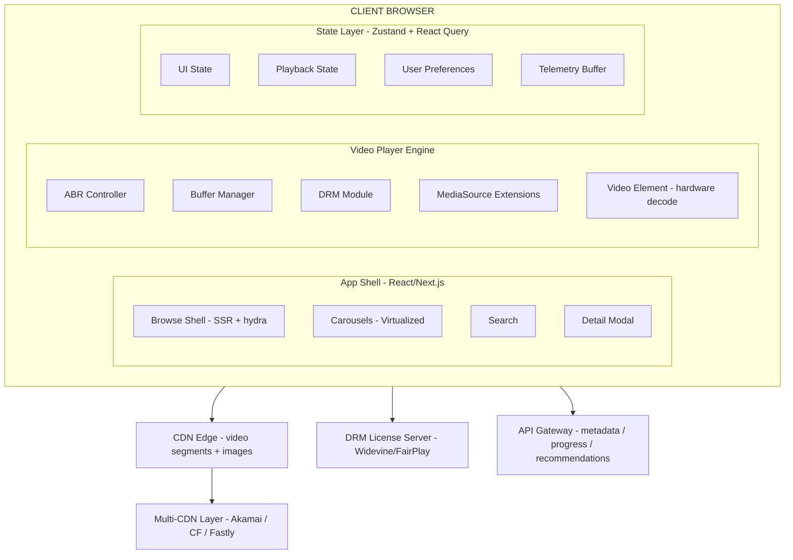

## Problem Statement

A video streaming platform is one of the most architecturally demanding frontend systems in production today. Netflix serves 260M+ subscribers across 190 countries, YouTube handles 800M+ videos watched daily, and Disney+ scaled to 10M subscribers within 24 hours of launch. The frontend must orchestrate adaptive bitrate streaming, DRM-protected content delivery, real-time buffer management, and seamless cross-device playback — all while maintaining sub-second startup times on constrained mobile networks.

The core challenge is not "play a video." HTML5 `<video>` does that. The architectural challenge is building a player that dynamically adapts quality across a 6-tier bitrate ladder (from 235kbps to 15Mbps), manages a multi-segment buffer pipeline via MediaSource Extensions, negotiates DRM licenses through Encrypted Media Extensions, synchronizes watch progress across devices, and renders a content discovery surface with virtualized carousels containing thousands of personalized titles — all within a 200KB JavaScript budget for time-to-interactive under 3 seconds on 4G.

**Scope boundary:** We design the client-side architecture — the video player, content browsing UI, and playback state management. The transcoding pipeline, recommendation engine, and CDN origin infrastructure are treated as backend services exposing defined APIs. We cover the frontend's interaction with CDN edge nodes, DRM license servers, and playback telemetry systems.

**Real-world production examples:** Netflix (Falcor + custom player), YouTube (Shaka Player + Polymer→Lit), Disney+ (BAMTech player + React), Hulu (React + custom MSE player), Amazon Prime Video (custom player + server-driven UI), Twitch (low-latency HLS for live).

---

## Requirements Exploration

### Functional Requirements

1. Play video content with adaptive bitrate streaming (HLS/DASH), dynamically switching between quality levels (240p–4K) based on network conditions
2. Display a content browsing experience with personalized, server-driven rows of horizontally-scrollable carousels (Netflix-style lolomo)
3. Support seeking with instant visual feedback via thumbnail scrubbing (BIF sprite sheets or WebVTT-referenced thumbnails)
4. Render subtitles/closed captions in multiple languages with configurable styling (font size, color, background, position)
5. Sync watch progress (resume position) across devices with < 5s staleness
6. Support Picture-in-Picture (PiP) mode and background audio playback on mobile
7. Prefetch next-episode content (first 2 segments) when current episode reaches 90% completion
8. Provide hover-to-preview (trailer or looping clip) on content cards with < 500ms startup
9. Handle DRM-protected content via EME (Widevine L1/L3, FairPlay, PlayReady)
10. Support multiple audio tracks (language, descriptive audio) with runtime switching
11. Display real-time playback controls: play/pause, volume, fullscreen, quality selector, playback speed (0.5x–2x)
12. Implement a "Skip Intro" / "Skip Recap" button at server-defined timestamp ranges
13. Show post-play experience: countdown to next episode, recommendations grid
14. Support offline download and playback (Progressive Web App with Service Worker + IndexedDB)

### Non-Functional Requirements

| Category      | Requirement                                       | Target                                |
| ------------- | ------------------------------------------------- | ------------------------------------- |
| Startup       | Video start time (first frame rendered)           | < 2s on 4G, < 1s on broadband         |
| Rebuffer      | Rebuffering ratio (time rebuffering / watch time) | < 0.5%                                |
| Latency       | Seek to playback (keyframe)                       | < 300ms                               |
| Bundle        | Player + browsing shell JS (gzipped)              | < 200KB initial, < 400KB total        |
| Accessibility | WCAG 2.2 AA compliance                            | Full keyboard + screen reader support |
| CWV           | LCP (browse page)                                 | < 2.5s                                |
| CWV           | INP (player controls)                             | < 100ms                               |
| CWV           | CLS (browse + player)                             | < 0.05                                |
| Memory        | Client memory (player active)                     | < 150MB on mobile                     |
| Availability  | Player functions without JS hydration complete    | Progressive enhancement for controls  |
| Cross-device  | Resume accuracy                                   | Within 5s of last position            |
| Offline       | Downloaded content playback                       | Works fully offline after download    |

---

## Capacity Estimation & Constraints

**Assumptions (Netflix-scale):**

- 260M subscribers, 100M DAU
- Average session: 1.5 hours (90 minutes of video)
- Average 3 browse interactions (carousel scrolls, searches) before playing
- Content catalog: 15,000 titles, each with 5–10 metadata images, trailers

**Bandwidth calculations:**

```
Average bitrate: 5 Mbps (1080p mid-tier)
Per-user bandwidth per session: 5 Mbps × 90 min × 60s = 27 Gbit = 3.375 GB
Peak concurrent streams: 100M × 0.08 (peak factor) = 8M concurrent streams
Peak egress: 8M × 5 Mbps = 40 Tbps (CDN-distributed, not single origin)
```

**Segment math (drives buffer architecture):**

```
Segment duration: 4 seconds (industry standard for HLS/DASH)
Segments per hour: 900
Segment size at 5 Mbps: 5 × 4 / 8 = 2.5 MB per segment
Target buffer: 30 seconds = 7–8 segments = 17.5–20 MB in memory
Max buffer: 60 seconds = 15 segments = 37.5 MB
```

**Browse page payload:**

```
Hero billboard: 1 large image (300KB) + metadata (2KB)
Rows: 8 rows × 40 titles (only 6–8 visible) = 320 title cards
Title card metadata: 200 bytes × 320 = 64KB
Title card images: 50KB × 48 visible = 2.4 MB (lazy-loaded)
Total browse page data: ~3 MB (progressive, above-fold first)
```

**Client memory budget:**

| Component                   | Budget                                                               |
| --------------------------- | -------------------------------------------------------------------- |
| Video buffer (SourceBuffer) | 40–60 MB                                                             |
| Decoded frames (GPU)        | 30–50 MB                                                             |
| Browse page DOM + images    | 20–30 MB                                                             |
| JS heap (player + UI)       | 15–25 MB                                                             |
| DRM session state           | 2–5 MB                                                               |
| **Total**                   | **107–170 MB** (within 150MB mobile target with aggressive eviction) |

---

## Architecture / High-Level Design

### Rendering Strategy

**Hybrid SSR + CSR.** The browse/discovery pages use SSR (Next.js or equivalent) to deliver above-fold content for LCP < 2.5s. The video player is purely client-side (CSR) because it depends entirely on MediaSource Extensions and Encrypted Media Extensions — browser APIs with no server rendering equivalent.

Why not full CSR? Browse pages are content-heavy and SEO-relevant (for non-auth pages). SSR ensures first meaningful paint contains actual title cards, not loading skeletons. The player page SSRs the metadata (title, description, episode list) while the player component hydrates client-side.

Why not ISR? Content personalization (per-user rows, "continue watching") makes static generation impractical for authenticated users. The shell is static; the content within rows is fetched client-side post-hydration.

### Navigation Model

SPA with client-side routing. Video playback must not be interrupted by navigation — a user browsing while PiP is active cannot trigger a full page reload. The URL reflects the current route (`/browse`, `/watch/{id}`, `/search?q=...`) with state encoded for deep-linking and share URLs.

The player occupies a persistent layer that transcends route transitions. When a user clicks "browse" during playback, the player minimizes to PiP rather than unmounting. This requires a routing architecture where the player component lives outside the route tree.

### System Architecture Diagram



### Component Architecture

```
<App>
├── <PersistentPlayerLayer>           ← Outside route tree, survives navigation
│   ├── <VideoPlayer>                 ← Client-only, dynamic import
│   │   ├── <VideoElement>            ← <video> + MSE attachment
│   │   ├── <ControlsOverlay>        ← Play/pause, seek, volume, quality
│   │   ├── <SubtitleRenderer>       ← WebVTT overlay (not native tracks)
│   │   ├── <ThumbnailScrubber>      ← BIF/sprite hover preview
│   │   └── <BufferIndicator>        ← Buffer health visualization
│   └── <MiniPlayer>                 ← PiP/minimized mode
│
├── <RouteTree>
│   ├── <BrowsePage>                  ← SSR
│   │   ├── <HeroBillboard>          ← Featured content, auto-play trailer
│   │   ├── <PersonalizedRow>[]      ← Virtualized horizontal carousels
│   │   │   └── <TitleCard>[]        ← Poster + hover-to-preview
│   │   └── <ContinueWatchingRow>    ← Resume position overlay
│   │
│   ├── <WatchPage>                   ← Triggers player maximize
│   │   ├── <EpisodeList>
│   │   ├── <MoreLikeThis>
│   │   └── <PostPlayCountdown>
│   │
│   └── <SearchPage>
│       ├── <SearchInput>
│       └── <SearchResults>           ← Grid of TitleCards
│
└── <GlobalProviders>
    ├── <QueryClientProvider>
    ├── <PlayerStateProvider>
    └── <TelemetryProvider>
```

### State Management Strategy

| State Type                                          | Store                               | Justification                                                       |
| --------------------------------------------------- | ----------------------------------- | ------------------------------------------------------------------- |
| Playback state (currentTime, buffered, playing)     | Zustand (imperative)                | Needs high-frequency updates (250ms ticks) without React re-renders |
| Server data (catalog, episodes, metadata)           | React Query / TanStack Query        | Automatic cache invalidation, background refetch, deduplication     |
| User preferences (audio/subtitle language, quality) | Zustand + localStorage persist      | Survives sessions, applies immediately on next playback             |
| Watch progress                                      | React Query (mutation + optimistic) | Syncs to server, needs conflict resolution across devices           |
| Browse UI state (active row, scroll positions)      | Zustand (ephemeral)                 | Lost on navigation, no persistence needed                           |
| URL state (current route, video ID)                 | Router state                        | Enables deep-linking, back/forward, share URLs                      |
| Telemetry buffer                                    | In-memory ring buffer               | Batched send every 30s, no persistence needed                       |

<Callout>
  **Staff-level insight:** Playback state (currentTime, duration, buffered
  ranges) updates at 4Hz via `timeupdate` events but controls UI only re-renders
  at 1Hz (scrubber position). Use a subscription model (Zustand `subscribe`
  without selector) that throttles React updates while keeping internal state at
  full fidelity for ABR decisions.
</Callout>

---

## Data Model / Entities

```typescript
// Core content entities
interface Title {
  id: string;
  type: "movie" | "series";
  name: string;
  synopsis: string;
  releaseYear: number;
  maturityRating: "G" | "PG" | "PG-13" | "R" | "NC-17";
  genres: string[];
  cast: string[];
  duration: number; // seconds (for movies)
  seasonCount?: number;
  posterUrl: string; // CDN URL with width token: /img/{id}/poster?w=342
  backdropUrl: string;
  logoUrl?: string; // title treatment image
  trailerManifestUrl?: string; // HLS manifest for hover preview
}

interface Season {
  id: string;
  titleId: string;
  seasonNumber: number;
  episodeCount: number;
  episodes: Episode[];
}

interface Episode {
  id: string;
  seasonId: string;
  episodeNumber: number;
  name: string;
  synopsis: string;
  duration: number; // seconds
  stillUrl: string; // episode thumbnail
  skipIntro?: TimeRange;
  skipRecap?: TimeRange;
  credits?: TimeRange;
}

interface TimeRange {
  startTime: number; // seconds
  endTime: number;
}

// Playback-specific entities
interface PlaybackManifest {
  contentId: string;
  manifestUrl: string; // HLS master playlist or DASH MPD
  drmConfig: DrmConfig;
  subtitleTracks: SubtitleTrack[];
  audioTracks: AudioTrack[];
  thumbnailTrack?: ThumbnailTrack;
  cdnFailoverUrls: string[]; // ordered by priority
}

interface DrmConfig {
  system: "widevine" | "fairplay" | "playready";
  licenseUrl: string;
  certificateUrl?: string; // FairPlay requires server certificate
  headers: Record<string, string>; // auth headers for license request
  robustnessLevel: "SW_SECURE_CRYPTO" | "HW_SECURE_ALL"; // Widevine L3 vs L1
}

interface SubtitleTrack {
  id: string;
  language: string; // BCP-47: 'en', 'es', 'ja'
  label: string; // "English [CC]", "Spanish"
  url: string; // WebVTT file URL
  isForced: boolean; // forced narrative subtitles (foreign dialogue)
  isCC: boolean; // includes sound descriptions
}

interface AudioTrack {
  id: string;
  language: string;
  label: string;
  codec: string; // 'mp4a.40.2' (AAC), 'ec-3' (Dolby Atmos)
  channels: number; // 2 (stereo), 6 (5.1), 8 (7.1)
  isDescriptive: boolean; // audio description track
}

interface ThumbnailTrack {
  type: "bif" | "webvtt-sprites";
  url: string; // BIF file or WebVTT with sprite coordinates
  interval: number; // seconds between thumbnails (typically 10s)
  width: number; // thumbnail width in px
  height: number;
}

// Watch progress & user state
interface WatchProgress {
  contentId: string;
  position: number; // seconds
  duration: number;
  lastUpdated: number; // Unix timestamp ms
  completed: boolean; // position > 95% of duration
}

interface UserPreferences {
  preferredAudioLanguage: string;
  preferredSubtitleLanguage: string | null; // null = off
  subtitleStyle: SubtitleStyle;
  autoplayNextEpisode: boolean;
  autoplayPreviews: boolean;
  dataUsagePreference: "auto" | "low" | "medium" | "high";
  maxResolution: "480p" | "720p" | "1080p" | "4k" | "auto";
}

interface SubtitleStyle {
  fontSize: "small" | "medium" | "large" | "extra-large";
  fontColor: string; // hex
  backgroundColor: string; // hex with alpha
  edgeStyle: "none" | "raised" | "depressed" | "outline" | "drop-shadow";
  fontFamily:
    | "proportional-sans"
    | "monospace-sans"
    | "proportional-serif"
    | "casual"
    | "cursive";
}

// Player internal state (high-frequency, not persisted)
interface PlayerState {
  status:
    | "idle"
    | "loading"
    | "buffering"
    | "playing"
    | "paused"
    | "ended"
    | "error";
  currentTime: number;
  duration: number;
  bufferedRanges: Array<{ start: number; end: number }>;
  currentBitrate: number; // kbps
  currentResolution: { width: number; height: number };
  volume: number; // 0–1
  muted: boolean;
  playbackRate: number;
  isFullscreen: boolean;
  isPiP: boolean;
  activeSubtitleTrackId: string | null;
  activeAudioTrackId: string;
  estimatedBandwidth: number; // kbps (EWMA)
  droppedFrames: number;
  bufferHealth: number; // seconds of buffer ahead of playhead
}

// Normalized browse store
interface BrowseStore {
  titles: Record<string, Title>;
  seasons: Record<string, Season>;
  episodes: Record<string, Episode>;
  rows: BrowseRow[];
  heroContent: string; // title ID
  continueWatching: WatchProgress[];
}

interface BrowseRow {
  id: string;
  title: string; // "Trending Now", "Because you watched X"
  titleIds: string[];
  rowType: "standard" | "top10" | "continue-watching" | "new-releases";
}
```

---

## Interface Definition (API)

### Browse APIs

| Method | Path                             | Description                | Cache                                                 |
| ------ | -------------------------------- | -------------------------- | ----------------------------------------------------- |
| GET    | `/api/browse/rows`               | Personalized rows (lolomo) | `private, max-age=300`                                |
| GET    | `/api/titles/{id}`               | Full title metadata        | `public, s-maxage=3600, stale-while-revalidate=86400` |
| GET    | `/api/titles/{id}/seasons/{num}` | Season with episodes       | `public, s-maxage=3600`                               |
| GET    | `/api/search?q={query}&limit=20` | Search titles              | `private, max-age=60`                                 |

### Playback APIs

| Method | Path                        | Description                        | Cache                              |
| ------ | --------------------------- | ---------------------------------- | ---------------------------------- |
| POST   | `/api/playback/manifest`    | Get playback manifest + DRM config | No cache (auth-gated, per-session) |
| POST   | `/api/playback/license`     | DRM license acquisition            | No cache                           |
| PUT    | `/api/progress/{contentId}` | Update watch position              | No cache (write)                   |
| GET    | `/api/progress`             | Get all watch progress             | `private, max-age=30`              |

### Playback Manifest Request/Response

```typescript
// POST /api/playback/manifest
interface ManifestRequest {
  contentId: string;
  episodeId?: string;
  deviceProfile: {
    drmSystems: ("widevine" | "fairplay" | "playready")[];
    maxResolution: { width: number; height: number };
    hdrFormats: ("sdr" | "hdr10" | "dolby-vision")[];
    audioFormats: ("aac" | "eac3" | "atmos")[];
  };
}

interface ManifestResponse {
  manifest: PlaybackManifest;
  bookmarkPosition: number; // resume point in seconds
  nextEpisode?: { id: string; title: string; manifestUrl: string };
  skipMarkers: {
    intro?: TimeRange;
    recap?: TimeRange;
    credits?: TimeRange;
  };
}
```

### Watch Progress Sync

```typescript
// PUT /api/progress/{contentId}
interface ProgressUpdateRequest {
  position: number;
  duration: number;
  timestamp: number; // client timestamp for conflict resolution
}

// Conflict resolution: last-write-wins with client timestamp
// Server rejects if timestamp < stored timestamp (stale update from old device)
```

### Pagination Strategy

Browse rows use **cursor-based pagination** (row ID as cursor). Within a row, titles are loaded in windows of 40 (initial render) with additional tiles fetched as the user scrolls right. Cursor-based is mandatory because personalized rows can change between requests (A/B experiments, real-time popularity shifts) — offset-based would cause duplicates or gaps.

---

## Caching Strategy

### Client-Side Caching

**React Query cache (in-memory):**

- Title metadata: `staleTime: 5 min`, `cacheTime: 30 min`, keyed by title ID
- Browse rows: `staleTime: 5 min`, `cacheTime: 10 min` (personalized, shorter retention)
- Episode lists: `staleTime: 60 min` (rarely changes)
- Search results: `staleTime: 30s` (ephemeral)
- Max entries: 500 title objects (~100KB total)

**Video segment cache (Service Worker):**

- Strategy: Cache-first for fully downloaded segments (offline playback)
- Budget: 500MB per downloaded title, max 5 titles offline (2.5GB quota request via StorageManager API)
- Segments for streaming (non-downloaded) are NOT cached in Service Worker — they live only in SourceBuffer memory

**localStorage:**

- Watch progress (optimistic, syncs to server): 50 entries × 100 bytes = 5KB
- User preferences: 1KB
- Recently viewed titles (for instant "Continue Watching"): 20 entries × 500 bytes = 10KB
- Total: ~16KB (well within 5MB localStorage limit)

**IndexedDB (offline playback):**

- Encrypted segments stored as Blobs
- Schema: `{ contentId, segmentIndex, data: Blob, expiresAt }`
- TTL: 48 hours for offline license validity (DRM requirement)
- Storage budget: 2.5GB requested via `navigator.storage.persist()`

### CDN & Edge Caching

**Video segments:**

```
Cache-Control: public, max-age=31536000, immutable
```

Segments are content-addressed (hash in URL path), so they are eternally cacheable. New encodings produce new URLs.

**HLS manifests (live variants):**

```
Cache-Control: public, s-maxage=4, stale-while-revalidate=2
```

Must refresh every segment duration (4s) for live content. VOD manifests are immutable.

**Poster images:**

```
Cache-Control: public, max-age=86400, stale-while-revalidate=604800
```

Images update rarely; CDN purge on artwork change.

**Multi-CDN routing:** The manifest contains multiple CDN base URLs. The client selects CDN based on:

1. Geographic proximity (resolved by DNS)
2. Current CDN error rate (segment fetch failures in last 60s)
3. Measured throughput per CDN (EWMA over last 10 segments)

### Cache Coherence

**Watch progress:** Uses last-write-wins with client timestamps. When resuming on a new device, the client fetches server progress and compares with local — takes the most recent. BroadcastChannel syncs progress across tabs on the same device.

**Catalog updates:** React Query background refetch on window focus. New titles/episodes appear within 5 minutes without explicit user action.

**A/B experiment assignment:** Cached in a cookie with experiment ID + variant. All API responses include an `X-Experiment-Context` header; if it differs from cached context, invalidate browse cache.

<Callout>
  **Staff-level insight:** Video segments are immutable and content-addressed,
  making them the ideal CDN caching target — one year TTL with `immutable`
  directive. But manifests for live content must have TTLs matching segment
  duration (4s). This dual caching strategy means CDN cache-hit ratio for
  segments approaches 99% while manifests are always fresh. Netflix reports 95%+
  CDN hit rates because of this immutability model.
</Callout>

---

## Rendering & Performance Deep Dive

### Critical Rendering Path

**Tier 1 (0–1s): App shell + hero billboard**

- SSR'd HTML with critical CSS inlined (< 14KB first TCP packet)
- Hero image preloaded via `<link rel="preload">`
- Navigation chrome rendered server-side
- No JavaScript required for first paint

**Tier 2 (1–2.5s): Above-fold content + interactivity**

- First 2 carousel rows hydrate (8 visible cards per row = 16 cards)
- Player framework JS loaded (but not initialized until playback)
- Intersection Observer begins lazy-loading below-fold rows
- Images use `loading="lazy"` with `fetchpriority="high"` on first row

**Tier 3 (2.5s+): Below-fold + interaction-triggered**

- Remaining carousel rows load on scroll
- Video player engine loaded on first play intent
- DRM module loaded only when playback starts
- Subtitle rendering engine loaded when subtitles activated

**Code splitting strategy:**

```typescript
// Route-based splitting
const BrowsePage = lazy(() => import("./pages/BrowsePage"));
const WatchPage = lazy(() => import("./pages/WatchPage"));

// Interaction-based splitting (player)
const VideoPlayer = lazy(() => import("./components/VideoPlayer"));

// Feature-based splitting
const DrmModule = lazy(() => import("./lib/player/drm"));
const SubtitleEngine = lazy(() => import("./lib/player/subtitles"));
const OfflineManager = lazy(() => import("./lib/offline"));
```

### Core Web Vitals Targets

| Metric | Target                                | Strategy                                                                                |
| ------ | ------------------------------------- | --------------------------------------------------------------------------------------- |
| LCP    | < 2.5s (browse), < 1.5s (player page) | SSR hero image, preload poster, font-display: optional                                  |
| INP    | < 100ms (controls), < 200ms (browse)  | Throttle playback state updates, virtualize carousels, `startTransition` for non-urgent |
| CLS    | < 0.05                                | Fixed aspect-ratio containers for all images/video, skeleton with exact dimensions      |
| FCP    | < 1.2s                                | Inline critical CSS, SSR, font preload                                                  |
| TTFB   | < 200ms                               | Edge-rendered pages, CDN for static assets                                              |

### Video Player Performance

**Startup optimization (target: < 2s to first frame):**

1. Begin manifest fetch on page load (not on play click): saves 200–400ms
2. Pre-negotiate DRM license during manifest parse: saves 300–500ms
3. Fetch first 2 segments in parallel with license: saves segment RTT
4. Use lower-quality initial segment (720p) for instant start, then upswitch: saves 1–2s on slow connections
5. Preconnect to CDN domain: `<link rel="preconnect" href="https://cdn.example.com">`

**Buffer management:**

```typescript
interface BufferConfig {
  targetBufferLength: 30; // seconds ahead of playhead
  maxBufferLength: 60; // hard cap (memory budget)
  bufferFlushThreshold: 120; // evict segments > 120s behind playhead
  rebufferThreshold: 0.5; // show spinner if buffer < 0.5s
  startupBufferTarget: 2; // seconds needed before initial play
  seekBufferTarget: 1; // seconds needed after seek before play
}
```

**EWMA bandwidth estimation:**

```typescript
function updateBandwidthEstimate(
  segmentBytes: number,
  downloadTimeMs: number,
  currentEstimate: number,
): number {
  const measuredBps = (segmentBytes * 8000) / downloadTimeMs;
  const FAST_ALPHA = 0.4; // reacts quickly to drops
  const SLOW_ALPHA = 0.1; // smooths variance

  // Use minimum of fast and slow EWMA (conservative, avoids rebuffer)
  const fastEstimate =
    FAST_ALPHA * measuredBps + (1 - FAST_ALPHA) * currentEstimate;
  const slowEstimate =
    SLOW_ALPHA * measuredBps + (1 - SLOW_ALPHA) * currentEstimate;

  return Math.min(fastEstimate, slowEstimate);
}
```

### Image Optimization

**Browse page images:**

- Format: AVIF (40% smaller) → WebP fallback → JPEG
- Responsive: `srcset` with 3 sizes (170w, 342w, 684w) for poster cards
- Placeholder: dominant-color extracted at ingest, rendered as CSS background
- Loading: First row `eager` with `fetchpriority="high"`, all others `lazy`
- CDN image transformation: URL parameter for width (`?w=342&format=avif`)

**Thumbnail sprites for scrubbing:**

- Grid: 10×10 thumbnails per sprite sheet (100 frames, covering ~1000s at 10s interval)
- Size: 160×90px per thumbnail, JPEG quality 60
- Sprite sheet size: ~200KB per 1000s of content
- Loaded on first seek intent (hover over progress bar), not on page load

### Bundle Optimization

| Module                         | Size (gzip) | Loading            |
| ------------------------------ | ----------- | ------------------ |
| App shell + routing            | 45KB        | Initial            |
| Browse page (carousels, cards) | 35KB        | Route split        |
| Video player core (MSE + ABR)  | 55KB        | On play intent     |
| DRM module (EME wrapper)       | 15KB        | On playback start  |
| Subtitle renderer              | 12KB        | On subtitle enable |
| Search                         | 18KB        | On search focus    |
| Offline/download manager       | 25KB        | On download click  |
| **Total initial**              | **80KB**    |                    |
| **Total player**               | **127KB**   |                    |

Tree-shaking removes unused codec parsers (HEVC transmuxer not loaded for non-4K devices). Dynamic import boundaries align with user intent signals.

---

## Security Deep Dive

### Threat Model

| Threat                              | Attack Vector                                     | Mitigation                                                                                |
| ----------------------------------- | ------------------------------------------------- | ----------------------------------------------------------------------------------------- |
| Content piracy (stream ripping)     | Screen capture, segment download, HDMI capture    | DRM (EME) with hardware-level protection (Widevine L1), HDCP for HDMI output              |
| License server abuse                | Replay license requests, forge device attestation | Short-lived licenses (24h), device binding via secure enclave, rate limiting              |
| Token theft (session hijack)        | XSS exfiltrating auth cookies, network sniffing   | HttpOnly + Secure + SameSite=Strict cookies, TLS-only, CSP blocking inline scripts        |
| Manifest URL leakage                | Share manifest URL to bypass auth                 | Signed URLs with 1-hour expiry, IP-binding for manifest tokens                            |
| Subtitle injection (XSS via WebVTT) | Malicious subtitle file with script payloads      | Parse WebVTT with strict allowlist, render via Canvas/DOM with sanitization, no innerHTML |

### Content Security Policy

```
Content-Security-Policy:
  default-src 'self';
  script-src 'self' 'nonce-{random}';
  style-src 'self' 'unsafe-inline';  // Required for subtitle styling
  media-src blob: https://cdn.example.com https://cdn-fallback.example.com;
  img-src 'self' https://img.example.com data:;  // data: for dominant-color placeholders
  connect-src 'self' https://api.example.com https://license.example.com https://cdn.example.com https://telemetry.example.com;
  worker-src 'self' blob:;  // Service Worker + MSE worker
  frame-src 'none';
```

The `media-src blob:` directive is essential — MSE creates blob URLs for video segments fed to `<video>`. Without it, playback breaks entirely.

### DRM & Content Protection

**License acquisition flow:**

```
1. Player detects encrypted content (onencrypted event)
2. Create MediaKeySession for content's key system
3. Generate license request (CDM produces challenge)
4. Send challenge to license server with auth token
5. Receive license response (decryption keys)
6. Feed keys to CDM via session.update()
7. CDM decrypts segments in hardware/secure memory
8. Decrypted frames rendered directly to compositor (never in JS memory)
```

**Platform-specific DRM:**

| Platform                   | DRM System       | Security Level | Max Resolution        |
| -------------------------- | ---------------- | -------------- | --------------------- |
| Chrome (desktop)           | Widevine L3      | Software       | 720p (Netflix policy) |
| Chrome (Android, hardware) | Widevine L1      | Hardware       | 4K HDR                |
| Safari (macOS/iOS)         | FairPlay         | Hardware       | 4K HDR                |
| Edge (Windows)             | PlayReady SL3000 | Hardware       | 4K HDR                |

**Why hardware DRM matters:** Content studios (Disney, Warner) mandate hardware-level protection (Widevine L1 or equivalent) for 4K/HDR content. Software-only DRM (L3) caps at 720p or 1080p because the decrypted frames exist in accessible memory.

### Authentication

- Auth tokens in `HttpOnly`, `Secure`, `SameSite=Strict` cookies (never localStorage)
- Short-lived access tokens (15 min) with silent refresh via `/api/auth/refresh`
- DRM license requests include a per-session token (not the user auth token) to prevent license URL sharing
- Device registration: max 4 concurrent streams enforced server-side; client receives 429 with "too many streams" error

<Callout>
  **Staff-level insight:** The DRM license server and the content CDN are
  fundamentally different trust boundaries. The CDN serves encrypted (useless
  without keys) segments — these can be public and cached aggressively. The
  license server gates access to decryption keys — this must be authenticated,
  rate-limited, and device-bound. This separation is why video CDN cache-hit
  rates can reach 99% while maintaining content protection.
</Callout>

---

## Scalability & Reliability

### Scalability Patterns

**Carousel virtualization:** Each browse row contains 40–100 title IDs but renders only the visible window (6–8 cards) plus 2-card overscan on each side. DOM nodes are recycled during scroll with `transform: translateX()` for smooth 60fps scrolling without layout thrash.

**Segment fetch pipeline (parallel downloads):** The player maintains 2–4 concurrent segment fetches to keep the buffer full. This parallelism is critical when individual segment downloads take 500ms–1s on mobile. Without it, a serial pipeline with 4s segments would take 4× longer to fill a 30s buffer.

**Manifest-level CDN failover:** If 2 consecutive segment fetches from CDN-A fail, the player switches to CDN-B's base URL for subsequent segments. This is per-segment granularity — not a full session restart.

**Predictive preloading:**

- At 90% episode completion: prefetch next episode's manifest + first 2 segments
- On hover over title card (300ms dwell): preconnect to trailer CDN, prefetch trailer manifest
- On search type: prefetch top-3 result poster images

### Failure Handling

| Failure Mode                     | Detection                          | Recovery                                                              | User Experience                                                         |
| -------------------------------- | ---------------------------------- | --------------------------------------------------------------------- | ----------------------------------------------------------------------- |
| Segment fetch timeout (> 8s)     | AbortController timeout            | Retry once at same CDN, then failover to backup CDN                   | Buffer drains; spinner appears only if buffer empty                     |
| DRM license failure              | HTTP 4xx/5xx from license server   | Retry 2× with exponential backoff (1s, 3s)                            | "Unable to play. Retrying..." toast; fallback to SD if HD license fails |
| Network offline                  | `navigator.onLine` + fetch failure | Pause playback, show "No connection" banner, auto-resume on reconnect | Buffer provides 30s grace period before spinner                         |
| Manifest parse error             | Invalid M3U8/MPD parsing           | Clear player state, re-fetch manifest from alternate URL              | "Something went wrong. Reloading..." with auto-retry                    |
| Decode error (corrupted segment) | MSE `error` event on SourceBuffer  | Skip corrupted segment, fetch next                                    | Imperceptible skip (4s gap) if buffer has remaining segments            |
| Device stream limit (429)        | Server rejects manifest request    | Show "Too many devices" modal with option to sign out other devices   | Clear error message with actionable resolution                          |
| CDN region failover              | 3+ failures from same edge POP     | CDN-level DNS failover (automatic via multi-CDN orchestrator)         | Transparent to user if buffer has runway                                |

### Resilience Patterns

**Buffer as resilience:** The 30-second target buffer is not just for smooth playback — it's a resilience mechanism. With 30s of buffer, the player tolerates a 30-second network outage without any user-visible disruption. This is why buffer target is 30s, not 5s.

**Segment-level retry with CDN rotation:**

```typescript
async function fetchSegment(
  url: string,
  cdnList: string[],
): Promise<ArrayBuffer> {
  for (let cdnIndex = 0; cdnIndex < cdnList.length; cdnIndex++) {
    const cdnUrl = url.replace("{cdn}", cdnList[cdnIndex]);
    try {
      const response = await fetchWithTimeout(cdnUrl, { timeout: 8000 });
      if (!response.ok) throw new Error(`HTTP ${response.status}`);
      return response.arrayBuffer();
    } catch (error) {
      telemetry.reportCdnFailure(cdnList[cdnIndex], error);
      if (cdnIndex === cdnList.length - 1) throw error; // All CDNs failed
    }
  }
  throw new Error("All CDNs exhausted");
}
```

**Quality downgrade on sustained poor network:** If bandwidth estimate drops below 1 Mbps for > 10 seconds, the ABR algorithm forces a quality floor (480p) to prioritize continuous playback over visual quality. User is notified via a subtle quality indicator change, not an intrusive modal.

### Graceful Degradation

| Condition                     | Degraded Experience                                                                 |
| ----------------------------- | ----------------------------------------------------------------------------------- |
| No MSE support (old browsers) | Fall back to native `<video>` with a single-bitrate progressive MP4                 |
| No EME (DRM unsupported)      | Show message: "This browser doesn't support protected playback. Try Chrome/Safari." |
| JavaScript disabled           | Show poster image + "Enable JavaScript to watch" message (SSR'd)                    |
| Slow connection (< 1 Mbps)    | Auto-select 240p, disable autoplay previews, reduce thumbnail quality               |
| Low memory device             | Reduce max buffer to 15s, disable hover previews, limit carousel prefetch           |
| PiP API unavailable           | Hide PiP button, keep fullscreen as primary option                                  |

---

## Accessibility Deep Dive

### Video Player ARIA

```html
<div
  role="region"
  aria-label="Video player"
  aria-roledescription="video player"
>
  <video aria-hidden="true" />
  <!-- Video element hidden from AT; controls expose state -->

  <div
    role="toolbar"
    aria-label="Playback controls"
    aria-orientation="horizontal"
  >
    <button aria-label="Play" aria-pressed="false">▶</button>
    <button aria-label="Mute" aria-pressed="false">🔊</button>

    <div
      role="slider"
      aria-label="Seek"
      aria-valuemin="0"
      aria-valuemax="7200"
      aria-valuenow="1234"
      aria-valuetext="20 minutes 34 seconds of 2 hours"
    ></div>

    <div
      role="slider"
      aria-label="Volume"
      aria-valuemin="0"
      aria-valuemax="100"
      aria-valuenow="80"
      aria-valuetext="Volume 80 percent"
    ></div>

    <button aria-label="Subtitles" aria-expanded="false" aria-haspopup="menu">
      CC
    </button>
    <button aria-label="Full screen">⛶</button>
  </div>

  <!-- Live region for playback state changes -->
  <div aria-live="polite" aria-atomic="true" class="sr-only">
    <!-- "Playing", "Paused", "Buffering", "Video ended" -->
  </div>
</div>
```

### Keyboard Navigation

| Key       | Action                                | Context        |
| --------- | ------------------------------------- | -------------- |
| Space / K | Toggle play/pause                     | Player focused |
| ← / →     | Seek back/forward 10s                 | Player focused |
| J / L     | Seek back/forward 30s                 | Player focused |
| ↑ / ↓     | Volume up/down 5%                     | Player focused |
| M         | Toggle mute                           | Player focused |
| F         | Toggle fullscreen                     | Player focused |
| C         | Toggle captions                       | Player focused |
| Escape    | Exit fullscreen / close modal         | Any            |
| Tab       | Move between controls                 | Player toolbar |
| 0–9       | Seek to 0%–90% of duration            | Player focused |
| , / .     | Frame step back/forward (when paused) | Player paused  |

### Subtitles & Captions Accessibility

- Custom subtitle renderer (not native `<track>` element) for full styling control
- User-configurable: font size (50%–200%), color, background opacity, edge style, font family
- Positioning: bottom-center default, repositioned when controls overlay is visible
- Forced narrative subtitles auto-enable for foreign language segments (no user action)
- `aria-live="polite"` region announces subtitle text for users who can't see video
- Support for SDH (Subtitles for Deaf and Hard-of-hearing): includes speaker identification, sound effects

### Audio Descriptions

- Descriptive audio tracks available as alternate audio selection
- When descriptive audio is active, an icon indicator persists in the control bar
- Extended audio descriptions (for scenes with no dialogue gaps) use pause-and-describe: player pauses video, plays description, resumes
- Preference persists across sessions (stored in user preferences)

### Browse Page Accessibility

- Carousels use `role="group"` with `aria-roledescription="carousel"` and `aria-label="Trending Now"`
- Each card in carousel: `role="group"` with `aria-label="{title} - {year} - {maturity rating}"`
- Left/right arrows: `aria-label="Scroll left"` / `"Scroll right"`
- Focus management: Tab enters carousel, arrow keys navigate between cards, Tab exits carousel
- Reduced motion: Disable carousel scroll animations, use instant position changes

---

## Monitoring & Observability

### Client-Side Metrics

| Metric                         | Description                                   | Alert Threshold                         |
| ------------------------------ | --------------------------------------------- | --------------------------------------- |
| Video Start Time (VST)         | Time from play intent to first frame rendered | P95 > 4s                                |
| Rebuffer Ratio                 | (Time spent buffering) / (Total watch time)   | > 1% session average                    |
| Rebuffer Frequency             | Rebuffer events per hour of playback          | > 3 per hour                            |
| Bitrate Switches               | Quality changes per minute                    | > 2/min (indicates network instability) |
| Playback Failure Rate          | % of play attempts that result in error       | > 0.5%                                  |
| Exit Before Video Start (EBVS) | User abandons before first frame              | > 5%                                    |
| Seek Latency                   | Time from seek action to resumed playback     | P95 > 2s                                |
| Browse LCP                     | Largest Contentful Paint on browse page       | P75 > 3s                                |
| Browse INP                     | Interaction to Next Paint on browse           | P75 > 250ms                             |
| CDN Error Rate                 | Failed segment fetches / total fetches        | > 0.1% per CDN                          |

### Error Tracking

**Error categories:**

```typescript
enum PlayerErrorCategory {
  NETWORK = "network", // Fetch failures, timeouts
  DRM = "drm", // License acquisition, CDM errors
  MEDIA = "media", // Decode errors, unsupported codec
  MANIFEST = "manifest", // Parse failures, invalid manifest
  BUFFER = "buffer", // QuotaExceededError, SourceBuffer errors
  UNKNOWN = "unknown",
}

interface PlayerErrorEvent {
  category: PlayerErrorCategory;
  code: string; // e.g., 'DRM_LICENSE_EXPIRED'
  message: string;
  fatal: boolean; // Did playback stop?
  contentId: string;
  position: number; // Where in the video
  bufferHealth: number; // Buffer remaining at error time
  bandwidth: number; // Estimated bandwidth at error time
  cdnProvider: string; // Which CDN was serving
  deviceInfo: DeviceInfo;
  sessionId: string;
}
```

**Source maps:** Uploaded to error tracking service (Sentry) on deploy. Stack traces are deobfuscated server-side. Player errors include additional context (buffer state, bandwidth, CDN) beyond generic JS errors.

### Video Quality Metrics

**Quality of Experience (QoE) score:**

```typescript
// Composite score weighted by user-perceived impact
function calculateQoE(session: PlaybackSession): number {
  const startupPenalty = Math.min(session.videoStartTime / 2000, 1) * 25; // 0-25 points lost
  const rebufferPenalty = session.rebufferRatio * 100 * 50; // 0-50 points lost
  const qualityScore = (session.avgBitrate / session.maxAvailableBitrate) * 25; // 0-25 points

  return Math.max(0, 100 - startupPenalty - rebufferPenalty + qualityScore);
}
```

**Telemetry batching:** Events buffered in a ring buffer (max 100 events) and flushed every 30 seconds or on `visibilitychange`. Uses `navigator.sendBeacon()` on page unload to ensure final batch delivery.

### Alerting

**Day-1 dashboard panels:**

1. Video Start Time (P50, P75, P95) by device type
2. Rebuffer ratio (global + per-CDN breakdown)
3. Playback failure rate (by error category)
4. CDN health (error rate + latency per provider)
5. Active concurrent streams (capacity headroom)
6. QoE score distribution (histogram)
7. Exit Before Video Start rate (by content + device)
8. Bandwidth distribution (by geography)

**Alert routing:**

- P95 VST > 6s for 5 min → PagerDuty (P2)
- Rebuffer ratio > 2% for 10 min → PagerDuty (P1)
- Playback failure rate > 1% for 5 min → PagerDuty (P1)
- CDN error rate > 1% → Auto-failover + Slack notification
- EBVS > 10% → Slack notification (investigate)

<Callout>
  **Staff-level insight:** The key insight for video monitoring is that rebuffer
  ratio alone doesn't capture user frustration. A single 30-second rebuffer at a
  climactic moment causes more churn than five 1-second rebuffers during
  credits. Weight rebuffer events by position in content (early = high churn
  risk) and by content popularity. Netflix correlates rebuffer events with
  next-month retention — even a 1% increase in rebuffer ratio correlates with
  measurable subscriber loss.
</Callout>

---

## Trade-offs

| Decision                                    | Pro                                                                                                                          | Con                                                                                                                               |
| ------------------------------------------- | ---------------------------------------------------------------------------------------------------------------------------- | --------------------------------------------------------------------------------------------------------------------------------- |
| HLS over DASH                               | Universal browser support (Safari requires HLS), simpler manifest format, native iOS support                                 | Less flexible multi-period support, no built-in DRM signaling (requires EXT-X-KEY), segment-level only (no subsegment addressing) |
| Custom player over Shaka/hls.js             | Full control over ABR algorithm, buffer strategy, and telemetry; smaller bundle (no unused features)                         | Higher engineering cost (6+ months), must handle edge cases that open-source has solved, ongoing maintenance burden               |
| SSR browse + CSR player                     | Fast LCP for content discovery (SEO), player loads only when needed                                                          | Hydration cost on browse page, complexity of maintaining two rendering modes, potential flash of SSR→hydrated content             |
| 4-second segment duration                   | Good balance: fast seeking (keyframe every 4s), reasonable manifest size, acceptable startup latency                         | Longer than 2s segments: slower quality adaptation (8s minimum to detect bandwidth change), slightly longer startup               |
| Client-side ABR (vs server-driven)          | Reacts to real client conditions (CPU, battery, actual throughput), works with CDN caching (same segments for all)           | Client must implement complex algorithm, inconsistent behavior across player implementations, harder to A/B test new algorithms   |
| WebVTT sprites over BIF format              | Standard format (W3C), works with `<track>` element, CSS-styleable, text-based (debuggable)                                  | Larger payload than binary BIF, requires parsing VTT timing + CSS sprite coordinates, not as compact for very long content        |
| Zustand over Redux for player state         | Minimal boilerplate, imperative updates (good for 4Hz state), no middleware overhead, tiny bundle (1KB)                      | Less structured for large teams, no built-in devtools time-travel, team must enforce conventions manually                         |
| Multi-CDN with client-side switching        | Resilience (no single CDN dependency), cost optimization (cheapest CDN per region), instant failover without DNS propagation | Client complexity (track per-CDN metrics), potential for thundering herd if primary CDN fails, inconsistent caching across CDNs   |
| Blob URL SourceBuffers over native src      | Enables ABR (dynamic quality switching), DRM integration, buffer control, quality metrics                                    | MSE complexity, memory management (must evict old segments), no native iOS support (requires HLS fallback)                        |
| Custom subtitle renderer over native tracks | Full styling control (Netflix-quality rendering), consistent cross-browser, supports advanced positioning                    | Must handle all rendering edge cases, accessibility integration requires manual ARIA, larger bundle                               |

---

## What Great Looks Like

A **senior** answer covers:

- Explains HLS/DASH manifest structure and how ABR works at a high level
- Implements basic player controls with proper keyboard accessibility
- Designs component architecture separating browse from player
- Handles basic error states (network failure, playback error)
- Implements carousel UI with lazy-loaded images

A **staff** answer additionally:

- Designs the full ABR algorithm with EWMA bandwidth estimation and buffer-based switching logic
- Implements multi-CDN failover at the segment level with per-CDN health tracking
- Architects the MSE pipeline: segment fetch → transmux → append to SourceBuffer with proper queue management
- Designs watch progress sync with cross-device conflict resolution (last-write-wins with timestamps)
- Specifies DRM license acquisition flow and explains why hardware DRM gates 4K content
- Implements predictive preloading (next episode, hover previews) with cancellation on navigation
- Designs telemetry system with QoE scoring and rebuffer correlation to retention

A **principal** answer additionally:

- Quantifies the relationship between rebuffer ratio and subscriber churn with concrete numbers
- Designs the buffer management strategy to serve as a resilience layer (30s buffer = 30s network outage tolerance)
- Architects the player as a platform: pluggable ABR algorithms, codec negotiation, DRM abstraction layer
- Specifies how the entire system degrades across connection quality tiers (5G → 4G → 3G → offline) with concrete feature gates per tier
- Identifies that segment immutability enables CDN cache-hit rates approaching 99% and designs URL schema to exploit this

<Callout>
  **Staff-level insight:** The separator between senior and staff answers on
  video streaming is the ABR algorithm. A senior says "it switches quality based
  on bandwidth." A staff engineer explains the EWMA-based estimation with
  fast/slow alpha values, the buffer-based switching threshold (switch down at
  10s buffer, switch up at 30s), and why you use the minimum of throughput-based
  and buffer-based decisions to avoid rebuffer.
</Callout>

---

## Key Takeaways

- **Buffer is resilience, not just smooth playback.** A 30-second buffer tolerates 30 seconds of network failure invisibly — design buffer targets around your resilience SLA, not just quality.
- **Segment immutability is the CDN's best friend.** Content-address your segments (hash in URL path) with 1-year `Cache-Control: immutable` headers — this is how Netflix achieves 95%+ CDN hit rates.
- **ABR is two algorithms in one:** throughput-based (EWMA of download speeds) and buffer-based (switch down when buffer drains below threshold). Take the minimum quality recommendation of both to avoid rebuffer.
- **DRM separates trust boundaries:** Encrypted segments are publicly cacheable (useless without keys); license acquisition is the actual access control gate. This separation enables aggressive CDN caching without compromising content protection.
- **The player outlives the page.** Video playback must survive client-side navigation (PiP, minimize). Architect the player component outside the routing tree as a persistent layer.
- **Monitor rebuffer by position, not just ratio.** A rebuffer at the climax of a film drives more churn than one during credits. Weight your QoE score by content position and title popularity.
- **Multi-CDN is a latency AND reliability decision.** Client-side CDN switching at segment granularity provides instant failover (4 seconds to detect + switch) versus DNS-based failover (60+ seconds of TTL-bound outage).
- **Startup time is the first impression.** Parallel license acquisition + manifest fetch + initial segment download cuts video start time by 40–60%. Never serialize these operations.
